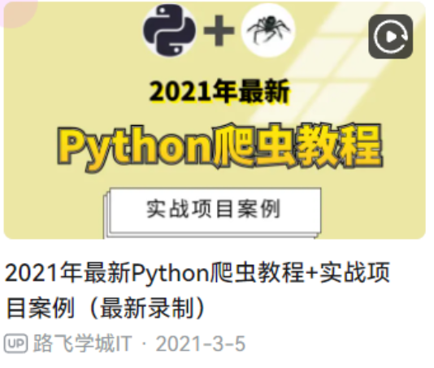
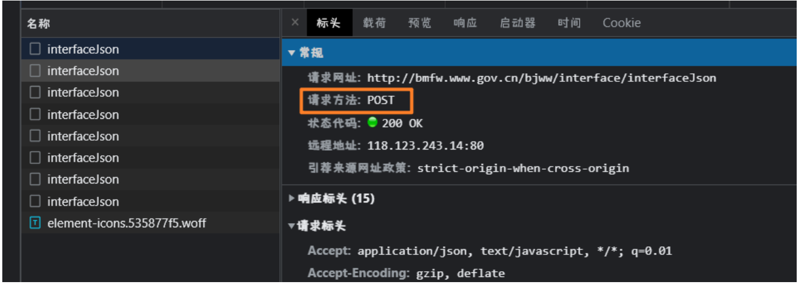
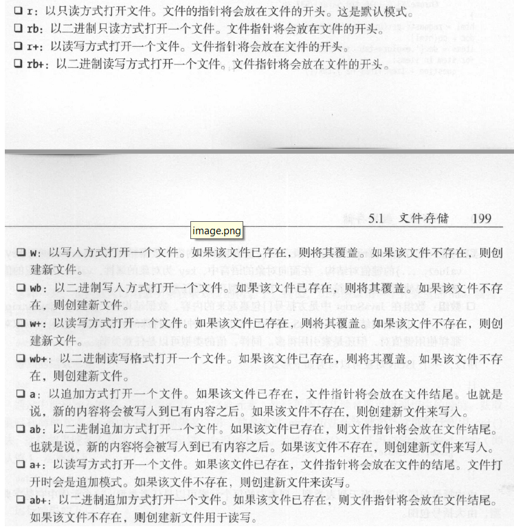
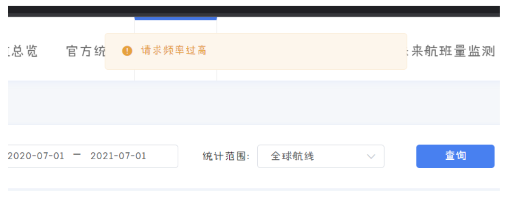
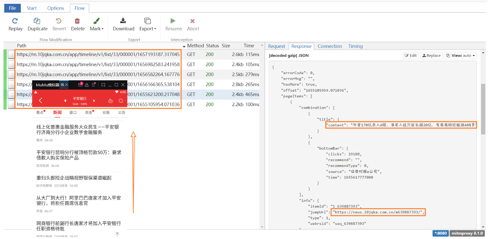
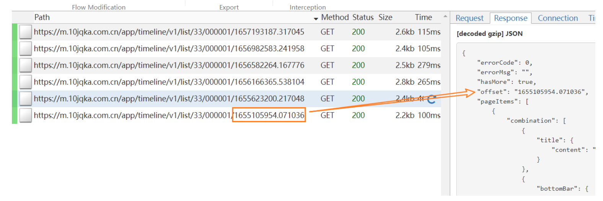

资料仅供参考，切勿用于非法用途，请在24小时内学习后删除。<br>
造成任何后果，与up无关！

# 1 说在前面

因为我这个是 jupyter，比较智能，不需要 print() 就可以输出东西<br>
如果是 pycharm 之类的，需要写 print(xxx) 才能输出东西到


```python
5+5
```


    10

## 1.1 分类

·搜索引擎爬虫<br>
·精确爬虫

## 1.2 robots 协议（君子协议）

Robots协议（也称为爬虫协议、机器人协议等）的全称是“网络爬虫排除标准”，robots.txt是搜索引擎访问网站时第一个查看的文件，当我们网站有部分内容不希望收搜索引擎抓取时，就可以通过Robots协议来告诉搜索引擎哪些页面是不能抓取的，大多用来保护网站的隐私，以及一些死链、重复页面等等。<br>
https://www.zhihu.com<br>
https://www.zhihu.com/robots.txt

## 1.3 不要进橘子了

破坏计算机信息系统罪<br>
侵犯公民个人信息罪<br>

所以说，个人信息坚决不要碰（哪怕是只有电话号码，其他什么信息的都没有的）<br>
政府网站一定要慢，有些年久失修的网站很容易爬崩

## 1.4 爬虫的本质

所见即所得，不可见不可得<br>
能爬的能爬，不能爬的不能爬；如果不能爬的能爬，那么能爬的都能爬，所以你到底爬不爬

## 1.5 推荐课程

### 1.5.1 入门

https://www.bilibili.com/video/BV1i54y1h75W



辅以：《Python 3网络爬虫开发实战 》崔庆才著.pdf

### 1.5.2 进阶

Python 3反爬虫原理与绕过实战 by 韦世东 (z-lib.org).pdf<br>
正则指引 by 余晟 (z-lib.org).pdf<br>
js逆向的资源

### 1.5.3 入狱

志远老师 3399 包吃包住 懂的都懂 快来找我吧 [志远B站](https://space.bilibili.com/38940666)

# 2 开始爬了

## 2.1 第〇步：导库


```python
import requests
```


```python
pip install requests
```

    Requirement already satisfied: requests in e:\pythonenvironment\lib\site-packages (2.28.1)
    Requirement already satisfied: certifi>=2017.4.17 in e:\pythonenvironment\lib\site-packages (from requests) (2022.6.15)
    Requirement already satisfied: charset-normalizer<3,>=2 in e:\pythonenvironment\lib\site-packages (from requests) (2.0.12)
    Requirement already satisfied: urllib3<1.27,>=1.21.1 in e:\pythonenvironment\lib\site-packages (from requests) (1.26.9)
    Requirement already satisfied: idna<4,>=2.5 in e:\pythonenvironment\lib\site-packages (from requests) (3.3)
    Note: you may need to restart the kernel to use updated packages.


## 2.2 第一步：请求信息

### 2.2.1 请求方法
>请求方法一般有两种，post 请求、get 请求

#### 2.2.1.1 get 请求<br>
https://baike.baidu.com/item/%E6%88%90%E9%83%BD%E4%BF%A1%E6%81%AF%E5%B7%A5%E7%A8%8B%E5%A4%A7%E5%AD%A6%E5%AD%A6%E7%94%9F%E6%95%B0%E5%AD%A6%E5%BB%BA%E6%A8%A1%E5%8D%8F%E4%BC%9A/22470042
> 网页源代码里面看得到（Ctrl+U），每一个操作，网页的网址都会改变（豆瓣）


```python
resp = requests.get("https://baike.baidu.com/item/%E6%88%90%E9%83%BD%E4%BF%A1%E6%81%AF%E5%B7%A5%E7%A8%8B%E5%A4%A7%E5%AD%A6%E5%AD%A6%E7%94%9F%E6%95%B0%E5%AD%A6%E5%BB%BA%E6%A8%A1%E5%8D%8F%E4%BC%9A/22470042")
resp.encoding = "utf-8"  # 更改网页的编码
resp.text
```


    '<!doctype html>\r\n<html lang="en">\r\n<head>\r\n    <meta charset="UTF-8">\r\n    <title>百度百科——全球领先的中文百科全书</title>\r\n    <style>\r\n    p {\r\n        margin: 0;\r\n    }\r\n    .baikeLogo {\r\n        width: 780px;\r\n        height: 50px;\r\n        margin: 150px auto 75px;\r\n        text-indent: -9999em;\r\n        background: url(https://img.baidu.com/img/baike/logo-baike.png) 50% 50% no-repeat;\r\n    }\r\n    /* S-- errorBox */\r\n        .errorBox {\r\n            width: 780px;\r\n            margin: 0 auto 65px;\r\n            text-align: center;\r\n            font-family: "Microsoft yahei";\r\n        }\r\n        .errorBox .timeOut {\r\n            color: #666;\r\n            font-size: 16px;\r\n        }\r\n        .errorBox .timeOut a {\r\n            color: #136ec2;\r\n            text-decoration:none;\r\n        }\r\n        .errorBox .countdown {\r\n            font-weight: 700;\r\n        }\r\n    /* E-- errorBox */\r\n\r\n    /* S-- sorryBox */\r\n        .sorryBox {\r\n            position: relative;\r\n            margin-bottom: 10px;\r\n        }\r\n        .sorryBox .sorryTxt {\r\n            color: #559ee7;\r\n        }\r\n        .sorryBox .sorryCont {\r\n            color: #333;\r\n            font-size: 35px;\r\n        }\r\n        .sorryBox .sorryBubble {\r\n            position: absolute;\r\n            left: 98px;\r\n            top: -35px;\r\n            width: 72px;\r\n            height: 37px;\r\n            background: url(/static/common/img/error_bubble_7da2966.jpg) no-repeat 50% 50%;\r\n        }\r\n    /* E-- sorryBox */\r\n\r\n    /* S-- footer */\r\n        .ft {\r\n            width: 780px;\r\n            margin: 0 auto 65px;\r\n            padding-top: 20px;\r\n            padding-bottom: 20px;\r\n            line-height: 20px;\r\n            color: #666;\r\n            font-size: 12px;\r\n            text-align: center;\r\n            background-color: #f8f8f8;\r\n        }\r\n        .ft a{\r\n            color: #2d64b3;\r\n            text-decoration: none;\r\n        }\r\n        .ft a:hover {\r\n            text-decoration: underline;\r\n        }\r\n        .feedBackWays .ul {\r\n            margin: 0;\r\n            padding: 0;\r\n        }\r\n        .feedBackWays .li {\r\n            list-style: none;\r\n        }\r\n        .ftCont {\r\n            margin-top: 20px;\r\n            color: #2d64b3;\r\n        }\r\n    /* E-- footer */\r\n    </style>\r\n</head>\r\n<body>\r\n    <div id="bd">\r\n        <h1 class="baikeLogo">\r\n            百度百科错误页\r\n        </h1>\r\n        <div class="errorBox">\r\n            <!-- 主体 -->\r\n            <div class="sorryBox">\r\n                <div class="sorryBubble"></div>\r\n                <p class="sorryCont"><span class="sorryTxt">抱歉</span>，您所访问的页面不存在...</p>\r\n            </div>\r\n            <div class="timeOut">\r\n                <p><span class="countdown" id="countdown">3</span>秒后自动跳转到<a href="http://baike.baidu.com/">百科首页</a></p>\r\n            </div>\r\n            <!-- /主体 -->\r\n        </div>\r\n    </div>\r\n    <div id="ft">\r\n        <div class="ft">\r\n            <div class="feedBackWays">\r\n                <ul class="ul">\r\n                    <li class="li">如果想提出功能问题或意见建议,请到<a href="http://baike.baidu.com/feedback" target="_blank">意见反馈</a>;</li>\r\n                    <li class="li">如果您要举报侵权或违法信息,请到<a href="http://help.baidu.com/newadd?prod_id=10&category=1" target="_blank">投诉中心</a>;</li>\r\n                    <li class="li">其他问题请访问<a href="http://tieba.baidu.com/f?kw=%B0%D9%B6%C8%B0%D9%BF%C6" target="_blank">百度百科吧</a>。</li>\r\n                </ul>\r\n            </div>\r\n            <div class="ftCont">\r\n                &copy;<span id="copyYear"></span>Baidu <a href="http://www.baidu.com/duty/" target="_blank">使用百度前必读</a> | <a href="http://help.baidu.com/question?prod_en=baike&class=89&id=1637" target="_blank">百科协议</a> | <a href="http://baike.baidu.com/hezuo/" target="_blank">百度百科合作平台</a>\r\n            </div>\r\n        </div>\r\n    </div>\r\n    <script type="text/javascript">\r\n    window.onload = function(){\r\n        var time = 3,\r\n            year = new Date().getFullYear();\r\n\r\n        document.getElementById("copyYear").innerHTML = year;\r\n        setInterval(function(){\r\n            if (time == 0){\r\n                window.location = "http://baike.baidu.com/";\r\n                return;\r\n            }\r\n            document.getElementById("countdown").innerHTML = time;\r\n            time--;\r\n        }, 1000);\r\n    }\r\n    </script>\r\n</body>\r\n</html>'

#### 2.2.1.2 post 请求<br>
http://www.gov.cn/zhuanti/2021yqfkgdzc/index.htm#/
> 浏览器地址栏的 url 不会改变，需要通过抓包获取真实的 url


```python
import time
time.time()
```


    1659277521.9730966


```python
# 这个网站有 sha265 加密

import hashlib
import os
import time
import pandas as pd
import requests
import fake_useragent
import tqdm
import random
import re
import datetime


def get_signatureHeader(timestamp, token="23y0ufFl5YxIyGrI8hWRUZmKkvtSjLQA"):
    timestamp = timestamp
    nonce = "123456789abcdefg"
    data = timestamp + token + nonce + timestamp
    data_sha = hashlib.sha256(data.encode("utf-8")).hexdigest()
    return data_sha


def get_x_wif_signature(timestamp):
    data = timestamp + "fTN2pfuisxTavbTuYVSsNJHetwq5bJvCQkjjtiLM2dCratiA" + timestamp
    data_sha = hashlib.sha256(data.encode("utf-8")).hexdigest()
    return data_sha


def get_data(city_code):
    ti = str(time.time()).split(".")[0]
    js = {
        "appId": "NcApplication",
        "code": city_code,
        "key": "6C3C60DC1BF54982A54D5A8CB4D1817D",
        "nonceHeader": "123456789abcdefg",
        "paasHeader": "zdww",
        "signatureHeader": get_signatureHeader(timestamp=ti).upper(),
        "timestampHeader": ti
    }

    ua = fake_useragent.UserAgent()
    headers = {
        "Accept": "application/json, text/javascript, */*; q=0.01",
        "Accept-Encoding": "gzip, deflate",
        "Accept-Language": "en-GB,en;q=0.9,zh-CN;q=0.8,zh;q=0.7",
        "Cache-Control": "no-cache",
        "Connection": "keep-alive",
        "Content-Length": "251",
        "Content-Type": "application/json; charset=UTF-8",
        "Host": "bmfw.www.gov.cn",
        "Origin": "http://www.gov.cn",
        "Pragma": "no-cache",
        "Referer": "http://www.gov.cn/",
        "User-Agent": ua.random,
        "x-wif-nonce": "QkjjtiLM2dCratiA",
        "x-wif-paasid": "smt-application",
        "x-wif-signature": get_x_wif_signature(timestamp=ti).upper(),
        "x-wif-timestamp": ti
    }

    url = "http://bmfw.www.gov.cn/bjww/interface/interfaceJson"
    resp_json = requests.post(url=url, headers=headers, json=js).json()
    return resp_json


get_data("321300")
```


    {'data': {'levelTag': '6',
      'list': [{'code': '321300',
        'province': '江苏省',
        'city': '宿迁市',
        'county': '',
        'provider': '宿迁市新冠肺炎疫情防控工作领导小组办公室',
        'leave_policy': '非必要不前往中高风险地区和有本土聚集性疫情所在的县（市、区、旗）。如果确实有需要要前往这些地区，要在抵宿前向所在社区（村、单位、酒店）报告，或通过“宿康宝”小程序进行网上申报，并配合做好健康管理措施。',
        'come_policy': '1.密切关注疫情动态，凡是有中高风险地区、本土聚集性疫情所在设区市的来（返）宿人员，提前2天通过“宿康宝”小程序自主申报或向目的地单位、社区（村）或酒店报备，抵宿后积极配合落实相关健康管理措施。\n\n2.对入境人员实行“7天集中隔离医学观察+3天居家健康监测”管理措施。居家健康监测期间不外出，如就医等特殊情况必需外出时做好个人防护，尽量避免乘坐公共交通工具。\n\n3.近7天内有高风险地区旅居史人员，要主动向所在社区（村、酒店、单位等）报备，积极配合做好“7天集中隔离医学观察”，在集中隔离第1、2、3、5、7天各开展一次核酸检测。\n\n4.近7天内有中风险地区旅居史人员，配合做好“7天居家隔离医学观察”，居家隔离医学观察第1、4、7天各开展一次核酸检测；如不具备居家隔离医学观察条件，采取集中隔离医学观察。\n\n5.近7天内有中高风险区所在县（区）低风险区旅居史的人员，需持48小时核酸检测阴性证明。返宿后3天内应完成两次核酸检测（间隔24小时），并做好健康监测。其他低风险区来宿（返）宿人员持绿码可自由流动。\n\n6.对于有疫情地区，高校内如没有疫情、学校实施7天以上封闭管理、持48小时内核酸阴性证明和所在高校开具的相关证明，不再进行集中隔离，到家后实施7天健康监测。\n\n7.有关防控措施将根据疫情形势动态调整，请广大市民继续履行个人防控责任，做好戴口罩、勤洗手、多通风、勤消毒、保持社交距离等防护措施，主动配合落实各项疫情防控措施。',
        'aviation': '',
        'railway': '1.对进站旅客检码测温，检查48小时核酸检测阴性证明；对健康码为红黄码、体温异常的旅客，交由卫健部门按规定处置；对不能提供48小时核酸检测阴性证明的旅客，一律劝返。\n\n2.对出站旅客检码测温，检查48小时核酸检测阴性证明；对健康码为红黄码、体温异常的旅客，交由属地卫健部门按规定处置；对健康码为绿码，但不能提供48小时核酸检测阴性证明的旅客，由防疫人员引导至高铁站便民核酸采集点进行采样。对出站旅客动态语音播报，告知落实“3+11”疫情防控要求。',
        'highway': '1.客运方面：客运站所有进出旅客须测温验码（苏康码、行程码），对有中高风险地区所在设区市的低风险地区旅居史进入我市的人员额外查验48小时内核酸检测阴性证明。有本土病例报告的城市来（返）宿人员，应在客运站出口主动申报，同时在抵宿后应12小时之内向所在社区（村）和单位报备，须持48小时内核酸检测阴性证明方可有序流动。\n\n2.道路卡口方面：各查验点对来自或途径连云港、苏州、上海、青岛等国内重点中高风险地区车辆和人员（查看行程码）做到逢车必查、逢人必验；在查验过程中对健康码为绿码且持有48小时内核酸检测阴性证明的，直接予以放行；未持有48小时内核酸检测阴性证明的，由查验点卫健工作人员提醒其向目的地社区报备，按要求做核酸检测，登记车辆人员信息后予以放行；对健康码为黄码的宿迁籍人员，由查验点卫健工作人员联系目的地疫情防控指挥部，落实集中隔离措施，外地人员实行劝返；对健康码为红码的，禁止驾乘人员离开车辆，由公安、卫健部门将车辆人员引导至指定场所，由当地卫健部门按规定实施集中隔离医学观察。对黄码和红码人员要做好被查车辆和人员信息登记工作；对体温高于37.3度的人员，由查验点卫健工作人员联系120专用救护车送至医疗机构发热门诊就诊。',
        'waterway': '进入我市辖区从事水路交通运输活动人员须测温、验码（健康码、行程码）、戴口罩，从中高风险地区所在设区市进入我市的人员须额外提供48小时内核酸检测阴性证明。',
        'create_time': '2022年7月29日12时',
        'sendtime': 1656676800}],
      'leave_list': [],
      'come_list': [],
      'traffic_list': []},
     'code': 0,
     'msg': '查询成功'}

>浏览器地址栏的 url 是 get 请求，但通过 F12 抓包的，请求方法并不一定绝对是 post，需要具体去看


### 2.2.2 请求头 headers


```python
url = "https://baike.baidu.com/item/%E6%88%90%E9%83%BD%E4%BF%A1%E6%81%AF%E5%B7%A5%E7%A8%8B%E5%A4%A7%E5%AD%A6%E5%AD%A6%E7%94%9F%E6%95%B0%E5%AD%A6%E5%BB%BA%E6%A8%A1%E5%8D%8F%E4%BC%9A/22470042"
headers = {
    "user-agent": "Mozilla/5.0 (Windows NT 10.0; Win64; x64) AppleWebKit/537.36 (KHTML, like Gecko) Chrome/103.0.0.0 Safari/537.36"
}
resp = requests.get(url=url, headers=headers)
resp.encoding = "utf-8"  # 更改网页的编码
resp.text
```


    '<!DOCTYPE html>\n<!--STATUS OK-->\n<html style="">\n\n\n\n<head>\n<meta charset="UTF-8">\n<meta http-equiv="X-UA-Compatible" content="IE=Edge" />\n<meta name="referrer" content="always" />\n<meta name="description" content="成都信息工程大学学生数学建模协会是由成都信息工程大学数学建模和数学爱好者所组成的学生社团。学生数学建模协会正式成立于2001年，是经成都信息工程大学校团委，应用数学学院团委批准，由应用数学学院老师指导，同学自发成立的协会。经过不断地发展，协会已经成为我校规模和影响力最大的学生社团之一。在增长学生知识和提高能力的同时，本协会也为我校培养了大量的全国大学生数学建模竞赛人才，并多次为我校在全国大学生数学建模竞赛中争得荣誉。">\n<title>成都信息工程大学学生数学建模协会_百度百科</title>\n<link rel="shortcut icon" href="/favicon.ico" type="image/x-icon" />\n<link rel="icon" sizes="any" mask href="//baikebcs.bdimg.com/cms/static/baike-icon.svg">\n\n<meta name="csrf-token" content="d4b87f38b35a5e84f28e8674b41132db">\n<meta itemprop="dateUpdate" content="2022-07-01 16:24:28" />\n<meta name="keywords" content="成都信息工程大学学生数学建模协会, 成都信息工程大学学生数学建模协会协会综述, 成都信息工程大学学生数学建模协会数学建模竞赛, 成都信息工程大学学生数学建模协会航空港校区协会介绍, 成都信息工程大学学生数学建模协会龙泉校区协会介绍, 成都信息工程大学学生数学建模协会附录, 成都信息工程大学学生数学建模协会协会章程, 成都信息工程大学学生数学建模协会协会的核心技术——数学建模">\n<link rel="alternate" hreflang="x-default" href="https://baike.baidu.com/item/%E6%88%90%E9%83%BD%E4%BF%A1%E6%81%AF%E5%B7%A5%E7%A8%8B%E5%A4%A7%E5%AD%A6%E5%AD%A6%E7%94%9F%E6%95%B0%E5%AD%A6%E5%BB%BA%E6%A8%A1%E5%8D%8F%E4%BC%9A/22470042" />\n<link rel="alternate" hreflang="zh" href="https://baike.baidu.com/item/%E6%88%90%E9%83%BD%E4%BF%A1%E6%81%AF%E5%B7%A5%E7%A8%8B%E5%A4%A7%E5%AD%A6%E5%AD%A6%E7%94%9F%E6%95%B0%E5%AD%A6%E5%BB%BA%E6%A8%A1%E5%8D%8F%E4%BC%9A/22470042" />\n<link rel="alternate" hreflang="zh-Hans" href="https://baike.baidu.com/item/%E6%88%90%E9%83%BD%E4%BF%A1%E6%81%AF%E5%B7%A5%E7%A8%8B%E5%A4%A7%E5%AD%A6%E5%AD%A6%E7%94%9F%E6%95%B0%E5%AD%A6%E5%BB%BA%E6%A8%A1%E5%8D%8F%E4%BC%9A/22470042" />\n<link rel="alternate" hreflang="zh-Hant" href="https://baike.baidu.hk/item/%E6%88%90%E9%83%BD%E4%BF%A1%E6%81%AF%E5%B7%A5%E7%A8%8B%E5%A4%A7%E5%AD%B8%E5%AD%B8%E7%94%9F%E6%95%B8%E5%AD%B8%E5%BB%BA%E6%A8%A1%E5%8D%94%E6%9C%83/22470042" />\n<link rel="canonical" href="https://baike.baidu.com/item/%E6%88%90%E9%83%BD%E4%BF%A1%E6%81%AF%E5%B7%A5%E7%A8%8B%E5%A4%A7%E5%AD%A6%E5%AD%A6%E7%94%9F%E6%95%B0%E5%AD%A6%E5%BB%BA%E6%A8%A1%E5%8D%8F%E4%BC%9A/22470042" />\n<meta name="image" content="https://bkimg.cdn.bcebos.com/smart/a686c9177f3e6709c93d4acb5193883df8dcd100fff1-bkimg-process,v_1,rw_1,rh_1,pad_1,color_ffffff?x-bce-process=image/format,f_auto" />\n<meta property="og:title" content="成都信息工程大学学生数学建模协会_百度百科" />\n<meta property="og:description" content="成都信息工程大学学生数学建模协会是由成都信息工程大学数学建模和数学爱好者所组成的学生社团。学生数学建模协会正式成立于2001年，是经成都信息工程大学校团委，应用数学学院团委批准，由应用数学学院老师指导，同学自发成立的协会。经过不断地发展，协会已经成为我校规模和影响力最大的学生社团之一。在增长学生知识和提高能力的同时，本协会也为我校培养了大量的全国大学生数学建模竞赛人才，并多次为我校在全国大学生数学建模竞赛中争得荣誉。" />\n<meta property="og:image" content="https://bkimg.cdn.bcebos.com/smart/a686c9177f3e6709c93d4acb5193883df8dcd100fff1-bkimg-process,v_1,rw_1,rh_1,pad_1,color_ffffff?x-bce-process=image/format,f_auto" />\n<meta property="og:url" content="https://baike.baidu.com/item/%E6%88%90%E9%83%BD%E4%BF%A1%E6%81%AF%E5%B7%A5%E7%A8%8B%E5%A4%A7%E5%AD%A6%E5%AD%A6%E7%94%9F%E6%95%B0%E5%AD%A6%E5%BB%BA%E6%A8%A1%E5%8D%8F%E4%BC%9A/22470042" />\n<meta property="og:site_name" content="百度百科" />\n<meta property="og:type" content="website" />\n<style>\r\n        .h4188c {\r\n            display: none !important;\r\n        }\r\n    </style>\n<script async>\n    (function (d, s) {\n        const js = d.createElement(s);\n        const sc = d.getElementsByTagName(s)[0];\n\n        js.src = \'https://dmpstatic.cdn.bcebos.com/weirwood-sdk/1/bundle.min.js\';\n        js.onload = function (params) {\n            var defaultOptions = {\n                common: {\n                    buildid: \'wiki-lemma\',\n                    token: \'3e75a217c52341299b3f0273ff6d2e07\',\n                    ignoreUrls: [\n                        // 本地开发屏蔽错误发送\n                        \'localhost\',\n                        \'127.0.0.1\'\n                    ]\n                },\n                error: {\n                    collectWindowErrors: true,\n                    collectUnhandledRejections: true\n                },\n                perf: {\n                    // 性能数据PV日志会比较大，可以输入 sampleRate 进行采样，控制在 50 W左右\n                    sampleRate: 0.019,\n                    spa: true,\n                    history: true\n                }\n            };\n            /* globals Weirwood */\n            Weirwood.init(defaultOptions);\n        };\n        sc.parentNode.insertBefore(js, sc);\n    }(document, \'script\'));\n</script>\n\n<!--[if lte IE 9]>\n<script>\r\n    (function() {\r\n      var e = "abbr,article,aside,audio,canvas,datalist,details,dialog,eventsource,figure,footer,header,hgroup,mark,menu,meter,nav,output,progress,section,time,video".split(","),\r\n        i = e.length;\r\n      while (i--) {\r\n        document.createElement(e[i]);\r\n      }\r\n\r\n      window.console = window.console || {};\r\n      var f = [\'log\', \'info\', \'warning\', \'error\', \'clear\'];\r\n      var l = f.length;\r\n      while(l--) {\r\n        window.console[f[l]] = function () {};\r\n      }\r\n    })();\r\n  </script>\n<![endif]-->\n<link rel="stylesheet" type="text/css" href="https://bkssl.bdimg.com/static/wiki-lemma/pkg/wiki-lemma_b25e69b.css"/><link rel="stylesheet" type="text/css" href="https://bkssl.bdimg.com/static/wiki-common/widget/lib/larkplayer/larkplayer_83ad94d.css"/><link rel="stylesheet" type="text/css" href="https://bkssl.bdimg.com/static/wiki-common/widget/lib/trumbowyg/plugins/colors/trumbowyg.colors_dd0d230.css"/><link rel="stylesheet" type="text/css" href="https://bkssl.bdimg.com/static/wiki-common/widget/lib/trumbowyg/trumbowyg_2e7ad35.css"/><link rel="stylesheet" type="text/css" href="https://bkssl.bdimg.com/static/wiki-common/widget/lib/watermark/watermark_a0a9ace.css"/><link rel="stylesheet" type="text/css" href="https://bkssl.bdimg.com/static/wiki-common/widget/lib/webuploader/webuploader_08d9db4.css"/><link rel="stylesheet" type="text/css" href="https://bkssl.bdimg.com/static/wiki-common/pkg/wiki-common-base_49c10bb.css"/><link rel="stylesheet" type="text/css" href="https://bkssl.bdimg.com/static/wiki-common/widget/component/userbar-n/userbar-n_be7e889.css"/><link rel="stylesheet" type="text/css" href="https://bkssl.bdimg.com/static/wiki-lemma/widget/tools/announcement/announcement_cba33f4.css"/><link rel="stylesheet" type="text/css" href="https://bkssl.bdimg.com/static/wiki-lemma/widget/tools/label/label_1b0bc0e.css"/><link rel="stylesheet" type="text/css" href="https://bkssl.bdimg.com/static/wiki-lemma/widget/tools/newSideShare/sideShare_7e089b7.css"/><link rel="stylesheet" type="text/css" href="https://bkssl.bdimg.com/static/wiki-lemma/widget/tools/video/pageMask/pageMask_ff9a193.css"/><link rel="stylesheet" type="text/css" href="https://bkssl.bdimg.com/static/wiki-lemma/pkg/wiki-lemma-module_404480a.css"/><link rel="stylesheet" type="text/css" href="https://bkssl.bdimg.com/static/wiki-common/pkg/components-videoPlayer_3ecfb3e.css"/><link rel="stylesheet" type="text/css" href="https://bkssl.bdimg.com/static/wiki-common/pkg/vender-ui_d4defec.css"/><link rel="stylesheet" type="text/css" href="https://bkssl.bdimg.com/static/wiki-common/pkg/modules-second_98ab80e.css"/><link rel="stylesheet" type="text/css" href="https://bkssl.bdimg.com/static/wiki-common/pkg/components-Popup_b211fa3.css"/><link rel="stylesheet" type="text/css" href="https://bkssl.bdimg.com/static/wiki-common/pkg/components-Dialog_a12bb56.css"/><link rel="stylesheet" type="text/css" href="https://bkssl.bdimg.com/static/wiki-lemma/widget/lemma_content/mainContent/mainContent_47f1933.css"/><link rel="stylesheet" type="text/css" href="https://bkssl.bdimg.com/static/wiki-lemma/widget/lemma_content/mainContent/lemmaRelation/lemmaRelation_496a30a.css"/><link rel="stylesheet" type="text/css" href="https://bkssl.bdimg.com/static/wiki-lemma/widget/lemma_content/configModule/zhixin/zhixin_3b0d7a5.css"/><link rel="stylesheet" type="text/css" href="https://bkssl.bdimg.com/static/wiki-lemma/widget/tools/searchHeader/toolButtons-n/toolButtons-n_5841373.css"/><link rel="stylesheet" type="text/css" href="https://bkssl.bdimg.com/static/wiki-lemma/widget/tools/searchHeader/toolButtons-n/userInfo-n_7e90184.css"/><link rel="stylesheet" type="text/css" href="https://bkssl.bdimg.com/static/wiki-lemma/widget/tools/searchHeader/searchHeader-n_f9a6e5b.css"/><link rel="stylesheet" type="text/css" href="https://bkssl.bdimg.com/static/wiki-lemma/widget/feature/Audio/ui/index_e753a3d.css"/><link rel="stylesheet" type="text/css" href="https://bkssl.bdimg.com/static/wiki-lemma/widget/feature/generalAdvert/advertActivity/advertActivity_ed26fc8.css"/><link rel="stylesheet" type="text/css" href="https://bkssl.bdimg.com/static/wiki-lemma/widget/feature/generalAdvert/advertBaseInfo/advertBaseInfo_32e601e.css"/></head>\n\n<script>\r\n        var _hmt = _hmt || [];\r\n        (function() {\r\n            var hm = document.createElement("script");\r\n            hm.src = "https://hm.baidu.com/hm.js?55b574651fcae74b0a9f1cf9c8d7c93a";\r\n            var s = document.getElementsByTagName("script")[0];\r\n            s.parentNode.insertBefore(hm, s);\r\n        })();\r\n    </script>\n\n<body class="wiki-lemma neweditor normal">\n\n\n<div class="header-wrapper pc-header-new">\n<div style="display:none;" id="J-vars" data-lemmaid="22470042" data-lemmatitle="成都信息工程大学学生数学建模协会" data-tk="d4b87f38b35a5e84f28e8674b41132db"></div>\n<div class="topbar cmn-clearfix">\n<ul class="wgt-userbar wgt-userbar-n" id="j-wgt-userbar">\n<li>\n<a href="http://www.baidu.com/">百度首页</a>\n</li>\n</ul>\n<div class="separator"></div>\n<div class="wiki-common-headTabBar">\n<a href="https://www.baidu.com/" nslog="normal" nslog-type="10600112" data-href="https://www.baidu.com/s?ie=utf-8&fr=bks0000&wd=">网页</a>\n<a href="http://news.baidu.com/" nslog="normal" nslog-type="10600112" data-href="http://news.baidu.com/ns?tn=news&cl=2&rn=20&ct=1&fr=bks0000&ie=utf-8&word=">新闻</a>\n<a href="https://tieba.baidu.com/" nslog="normal" nslog-type="10600112" data-href="https://tieba.baidu.com/f?ie=utf-8&fr=bks0000&kw=">贴吧</a>\n<a href="https://zhidao.baidu.com/" nslog="normal" nslog-type="10600112" data-href="https://zhidao.baidu.com/search?pn=0&&rn=10&lm=0&fr=bks0000&word=">知道</a>\n<a href="https://pan.baidu.com?from=1027327l" nslog="normal" nslog-type="10600112" data-href="https://pan.baidu.com/disk/home#/search?from=1027327l&key=">网盘</a>\n<a href="http://image.baidu.com/" nslog="normal" nslog-type="10600112" data-href="http://image.baidu.com/search/index?tn=baiduimage&ct=201326592&lm=-1&cl=2&nc=1&ie=utf-8&word=">图片</a>\n<a href="http://v.baidu.com/" nslog="normal" nslog-type="10600112" data-href="https://www.baidu.com/sf/vsearch?pd=video&tn=vsearch&ie=utf-8&rsv_spt=17&wd=">视频</a>\n<a href="http://map.baidu.com/" nslog="normal" nslog-type="10600112" data-href="http://map.baidu.com/m?ie=utf-8&fr=bks0000&word=">地图</a>\n<a href="https://wenku.baidu.com/" nslog="normal" nslog-type="10600112" data-href="https://wenku.baidu.com/search?lm=0&od=0&ie=utf-8&fr=bks0000&word=">文库</a>\n<b class="baike">百科</b>\n</div>\n</div>\n<div class="header">\n<div class="layout">\n<div class="wgt-searchbar wgt-searchbar-new wgt-searchbar-main cmn-clearfix wgt-searchbar-large">\n<div class="logo-container">\n<a class="logo cmn-inline-block" title="到百科首页" href="/">\n<span class="cmn-baike-logo">\n<em class="cmn-icon cmn-icons cmn-icons_logo-bai"></em>\n<em class="cmn-icon cmn-icons cmn-icons_logo-du"></em>\n<em class="cmn-icon cmn-icons cmn-icons_logo-baike"></em>\n</span>\n</a>\n</div>\n<div class="search">\n<div class="form">\n<form id="searchForm" action="/search/word" method="GET" target="_self">\n<input id="query" nslog="normal" nslog-type="10080011" name="word" type="text" autocomplete="off" autocorrect="off" value="成都信息工程大学学生数学建模协会" /><button id="search" nslog="normal" nslog-type="10080008" type="button">进入词条</button><button id="searchLemma" nslog="normal" nslog-type="10080009" type="button">全站搜索</button><a class="help" href="/help" nslog="normal" nslog-type="10080010" target="_blank">帮助</a>\n</form>\n<form id="searchLemmaForm" action="/search" method="GET" target="_self">\n<input id="searchLemmaQuery" name="word" type="hidden" />\n<input name="pn" type="hidden" value="0" />\n<input name="rn" type="hidden" value="0" />\n<input name="enc" type="hidden" value="utf8" />\n</form>\n<ul id="suggestion" class="suggestion">\n<div class="sug"></div>\n<li class="extra">\n<span id="clear" style="margin-right:8px;">清除历史记录</span><span id="close" nslog="normal" nslog-type="10080012">关闭</span>\n</li>\n</ul>\n</div></div>\n</div>\n<div class="declare-wrap" id="J-declare-wrap">\n<div class="declare" id="J-declare">声明：百科词条人人可编辑，词条创建和修改均免费，绝不存在官方及代理商付费代编，请勿上当受骗。<a class="declare-details" target="_blank" href="/common/declaration">详情>></a>\n<div class="close-btn" id="J-declare-close">\n<em class="cmn-icon cmn-icons cmn-icons_close"></em>\n</div>\n</div>\n</div>\n</div>\n</div>\n</div>\n<div class="navbar-wrapper">\n<div class="wgt-navbar">\n<div class="navbar-bg">\n<div class="navbar-bg-top">\n<div class="navbar-content layout">\n<div class="navbar-content-box">\n<dl class="index ">\n<dt><a href="/">首页</a></dt>\n<dd>\n<div><a href="/calendar/" target="_blank">历史上的今天</a></div>\n<div><a href="/vbaike/" target="_blank">百科冷知识</a></div>\n<div><a href="/vbaike#gallary" target="_blank">图解百科</a></div>\n</dd>\n</dl>\n<dl class="second-know ">\n<dt>秒懂百科</dt>\n<dd>\n<div><a href="https://child.baidu.com/" target="_blank">懂啦</a></div>\n<div><a href="/item/秒懂本尊答" target="_blank">秒懂本尊答</a></div>\n<div><a href="/item/秒懂大师说" target="_blank">秒懂大师说</a></div>\n<div><a href="/item/秒懂看瓦特" target="_blank">秒懂看瓦特</a></div>\n<div><a href="/item/秒懂五千年" target="_blank">秒懂五千年</a></div>\n<div><a href="/item/秒懂全视界" target="_blank">秒懂全视界</a></div>\n</dd>\n</dl>\n<dl class="special ">\n<dt>特色百科</dt>\n<dd>\n<div><a href="/museum" target="_blank">数字博物馆</a></div>\n<div><a href="/feiyi?fr=dhlfeiyi" target="_blank">非遗百科</a></div>\n<div><a href="/wikicategory/view?categoryName=恐龙大全" target="_blank">恐龙百科</a></div>\n<div><a href="/wikicategory/view?categoryName=多肉植物" target="_blank">多肉百科</a></div>\n<div><a href="/art" target="_blank">艺术百科</a></div>\n<div><a href="/science" target="_blank">科学百科</a></div>\n</dd>\n</dl>\n<dl class="user ">\n<dt>用户</dt>\n<dd>\n<div><a href="/kedou/" target="_blank">蝌蚪团</a></div>\n<div><a href="/item/百科热词团队" target="_blank">热词团</a></div>\n<div><a href="/campus" target="_blank">百科校园</a></div>\n<div><a href="https://baike.baidu.com/talent/home/index" target="_blank">分类达人</a></div>\n<div><a href="/task/" target="_blank">百科任务</a></div>\n<div><a href="/mall/" target="_blank">百科商城</a></div>\n</dd>\n</dl>\n<dl class="knowledge">\n<dt>知识专题</dt>\n<dd id="J-knowledge-content">\n</dd>\n</dl>\n<dl class="cooperation ">\n<dt>权威合作</dt>\n<dd>\n<div><a href="/operation/cooperation#joint" target="_blank">合作模式</a></div>\n<div><a href="/operation/cooperation#issue" target="_blank">常见问题</a></div>\n<div><a href="/operation/cooperation#connection" target="_blank">联系方式</a></div>\n</dd>\n</dl>\n<div class="right-list">\n<span class="item appdownload" nslog-type="21040001"><a href="/wapui/subpage/baikeappdownload?sfrom=pc_lemmapage_navigation" target="_blank"><em class="cmn-icon cmn-icons cmn-icons_mobile-phone"></em>下载百科APP</a></span>\n<span class="item usercenter"><a href="/usercenter" target="_blank"><em class="cmn-icon cmn-icons cmn-icons_navbar-usercenter"></em>个人中心</a></span>\n</div>\n</div>\n</div>\n</div>\n</div>\n</div>\n</div>\n\n\n<div class="body-wrapper">\n<div class="before-content">\n</div>\n<div class="content-wrapper">\n<div class="content">\n<div class="main-content J-content">\n<div class="top-tool ">\n<a class="add-sub-icon top-tool-icon" href="javascript:;" title="添加义项" nslog-type="50000101">\n<em class="cmn-icon wiki-lemma-icons wiki-lemma-icons_add-subLemma-solid"></em>\n</a>\n<a href="/divideload/%E6%88%90%E9%83%BD%E4%BF%A1%E6%81%AF%E5%B7%A5%E7%A8%8B%E5%A4%A7%E5%AD%A6%E5%AD%A6%E7%94%9F%E6%95%B0%E5%AD%A6%E5%BB%BA%E6%A8%A1%E5%8D%8F%E4%BC%9A" title="拆分词条" target="_blank" class="split-icon top-tool-icon" style="display:none;" nslog-type="50000104">\n<em class="cmn-icon wiki-lemma-icons wiki-lemma-icons_lemma-split"></em>\n</a>\n<div class="top-collect top-tool-icon" nslog="area" nslog-type="50000102">\n<em class="cmn-icon wiki-lemma-icons wiki-lemma-icons_star-solid"></em>\n<span class="collect-text">收藏</span>\n<div class="collect-tip">查看<a href="/uc/favolemma" target="_blank">我的收藏</a></div>\n</div>\n<a href="javascript:void(0);" id="j-top-vote" class="top-vote top-tool-icon" nslog-type="10060801">\n<em class="cmn-icon wiki-lemma-icons wiki-lemma-icons_zan-solid"></em>\n<span class="vote-count">0</span>\n<span class="vote-tip">有用+1</span>\n<span class="voted-tip">已投票</span>\n</a><div class="bksharebuttonbox top-share">\n<a class="top-share-icon top-tool-icon" nslog-type="9067">\n<em class="cmn-icon wiki-lemma-icons wiki-lemma-icons_share"></em>\n<span class="share-count" id="j-topShareCount">0</span>\n</a>\n<div class="new-top-share" id="top-share">\n<ul class="top-share-list">\n<li class="top-share-item">\n<a class="share-link bds_qzone"  href="javascript:void(0);" nslog-type="10060501">\n<em class="cmn-icon cmn-icons cmn-icons_logo-qzone"></em>\n</a>\n</li>\n<li class="top-share-item">\n<a class="share-link bds_tsina" href="javascript:void(0);" nslog-type="10060701">\n<em class="cmn-icon cmn-icons cmn-icons_logo-sina-weibo"></em>\n</a>\n</li>\n<li class="top-share-item">\n<a class="bds_wechat"  href="javascript:void(0);" nslog-type="10060401">\n<em class="cmn-icon cmn-icons cmn-icons_logo-wechat"></em>\n</a>\n</li>\n<li class="top-share-item">\n<a class="share-link bds_tqq"  href="javascript:void(0);" nslog-type="10060601">\n<em class="cmn-icon cmn-icons cmn-icons_logo-qq"></em>\n</a>\n</li>\n</ul>\n</div>\n</div>\n</div>\n<div style="width:0;height:0;clear:both"></div><dl class="lemmaWgt-lemmaTitle lemmaWgt-lemmaTitle-">\n<dd class="lemmaWgt-lemmaTitle-title J-lemma-title">\n<span class="long-title">\n<h1 >成都信息工程大学学生数学建模协会</h1>\n</span>\n<span class="btn-list">\n<a class="cmn-btn-28 cmn-btn-hover-blue audio-play title-audio-play J-title-audio-play" href="javascript:;"><em class="cmn-icon wiki-lemma-icons wiki-lemma-icons_voice-play"></em><span class="J-audio-text">播报</span></a>\n<a href="javascript:;" class="edit-lemma cmn-btn-hover-blue cmn-btn-28 j-edit-link"><em class="cmn-icon wiki-lemma-icons wiki-lemma-icons_edit-lemma"></em>编辑</a>\n<a class="lock-lemma" nslog-type="10003105" target="_self" href="javascript:;" title="锁定"><em class="cmn-icon wiki-lemma-icons wiki-lemma-icons_lock-lemma"></em>锁定</a>\n<a href="/planet/talk?lemmaId=22470042" target="_blank" class="lemma-discussion cmn-btn-hover-blue cmn-btn-28 j-discussion-link" nslog-type="90000102"><em class="cmn-icon wiki-lemma-icons wiki-lemma-icons_discussion-solid"></em>讨论<span class="num"></span></a>\n<a href="javascript:;" class="add-video cmn-btn-hover-blue cmn-btn-28 J-add-video-link J-add-video">\n<em class="cmn-icon wiki-lemma-icons add-video-icon wiki-lemma-icons_add-video"></em>上传视频</a>\n<a href="javascript:;" class="special-edit cmn-btn-hover-blue cmn-btn-28" id="J-special-edit">\n<em class="cmn-icon wiki-lemma-icons special-edit-icon wiki-lemma-icons_special-edit"></em>特型编辑</a>\n</span>\n</dd>\n<div class="lemma-desc">由应用数学学院老师指导，同学自发组织的学生协会</div>\n</dl>\n<div class="promotion-declaration">\n</div><div class="lemma-summary" label-module="lemmaSummary">\n<div class="para" label-module="para">成都信息工程大学学生数学建模协会是由<a target=_blank href="/item/%E6%88%90%E9%83%BD%E4%BF%A1%E6%81%AF%E5%B7%A5%E7%A8%8B%E5%A4%A7%E5%AD%A6/4743774" data-lemmaid="4743774">成都信息工程大学</a>数学建模和数学爱好者所组成的学生社团。学生<a target=_blank href="/item/%E6%95%B0%E5%AD%A6%E5%BB%BA%E6%A8%A1%E5%8D%8F%E4%BC%9A/3576877" data-lemmaid="3576877">数学建模协会</a>正式成立于2001年，是经成都信息工程大学校团委，应用数学学院团委批准，由应用数学学院老师指导，同学自发成立的协会。经过不断地发展，协会已经成为我校规模和影响力最大的学生社团之一。在增长学生知识和提高能力的同时，本协会也为我校培养了大量的全国大学生数学建模竞赛人才，并多次为我校在全国大学生数学建模竞赛中争得荣誉。</div>\n</div>\n<div class="lemmaWgt-promotion-leadPVBtn">\n</div><div class="configModuleBanner">\n</div><div class="basic-info J-basic-info cmn-clearfix">\n<dl class="basicInfo-block basicInfo-left">\n<dt class="basicInfo-item name" id="basic-name">中文名</dt>\n<dd class="basicInfo-item value">\n成都信息工程大学学生数学建模协会\n</dd>\n<dt class="basicInfo-item name" id="basic-name">外文名</dt>\n<dd class="basicInfo-item value">\nCUIT Mathematical modeling association\n</dd>\n<dt class="basicInfo-item name" id="basic-name">创立时间</dt>\n<dd class="basicInfo-item value">\n2001年\n</dd>\n<dt class="basicInfo-item name" id="basic-name">创始人</dt>\n<dd class="basicInfo-item value">\n张志让教授\n</dd>\n</dl>\n<dl class="basicInfo-block basicInfo-right">\n<dt class="basicInfo-item name" id="basic-name">协会类型</dt>\n<dd class="basicInfo-item value">\n科研学术类\n</dd>\n<dt class="basicInfo-item name" id="basic-name">指导老师</dt>\n<dd class="basicInfo-item value">\n应用数学学院教师团队\n</dd>\n<dt class="basicInfo-item name" id="basic-name">现任会长</dt>\n<dd class="basicInfo-item value">\n李磊、冯骏林（龙泉）\n</dd>\n<dt class="basicInfo-item name" id="basic-name">现任副会长</dt>\n<dd class="basicInfo-item value">\n陈国威、武文奇、廖胤淞（龙泉）、王乐盈（龙泉）\n</dd>\n</dl>\n</div>\n<div class="related-video-container J-related-video-container" style="display: none">\n<div class="related-video-title">\n相关视频<div class="view-more J-go-video-feed">查看全部<em class="cmn-icon wiki-lemma-icons wiki-lemma-icons_arrow-right"></em></div>\n</div>\n<div class="second-wrapper">\n<div\n    class="video-list-container"\n    id="J-video-list-container"\n    style="\n        max-width: 773px;\n            "\n></div>\n</div>\n</div><div class="lemmaWgt-lemmaCatalog">\n<div class="lemma-catalog">\n<h2 class="block-title">目录</h2>\n<div class="catalog-list column-4">\n<ol>\n<li class="level1">\n<span class="index">1</span>\n<span class="text"><a href="#1">协会综述</a></span>\n</li>\n<li class="level2">\n<span class="index">▪</span>\n<span class="text"><a href="#1_1">1.1 简述</a></span>\n</li>\n<li class="level2">\n<span class="index">▪</span>\n<span class="text"><a href="#1_2">1.2 会徽及会旗</a></span>\n</li>\n<li class="level1">\n<span class="index">2</span>\n<span class="text"><a href="#2">数学建模竞赛</a></span>\n</li>\n<li class="level2">\n<span class="index">▪</span>\n<span class="text"><a href="#2_1">2.1 全国大学生数学建模竞赛</a></span>\n</li>\n<li class="level2">\n<span class="index">▪</span>\n<span class="text"><a href="#2_2">2.2 美国大学生数学建模竞赛</a></span>\n</li>\n<li class="level2">\n<span class="index">▪</span>\n<span class="text"><a href="#2_3">2.3 Mathorcup数学建模挑战赛</a></span>\n</li>\n<li class="level2">\n<span class="index">▪</span>\n<span class="text"><a href="#2_4">2.4 全国高校密码数学挑战赛</a></span>\n</li>\n<li class="level2">\n<span class="index">▪</span>\n<span class="text"><a href="#2_5">2.5 数维杯国际大学生数学建模挑战赛</a></span>\n</li>\n</ol><ol><li class="level2">\n<span class="index">▪</span>\n<span class="text"><a href="#2_6">2.6 APMCM亚太地区数学建模竞赛</a></span>\n</li>\n<li class="level2">\n<span class="index">▪</span>\n<span class="text"><a href="#2_7">2.7 五一数学建模竞赛</a></span>\n</li>\n<li class="level2">\n<span class="index">▪</span>\n<span class="text"><a href="#2_8">2.8 电工杯数学建模竞赛</a></span>\n</li>\n<li class="level1">\n<span class="index">3</span>\n<span class="text"><a href="#3">航空港校区协会介绍</a></span>\n</li>\n<li class="level2">\n<span class="index">▪</span>\n<span class="text"><a href="#3_1">3.1 综述</a></span>\n</li>\n<li class="level2">\n<span class="index">▪</span>\n<span class="text"><a href="#3_2">3.2 人事构成</a></span>\n</li>\n<li class="level2">\n<span class="index">▪</span>\n<span class="text"><a href="#3_3">3.3 各部门介绍</a></span>\n</li>\n<li class="level1">\n<span class="index">4</span>\n<span class="text"><a href="#4">龙泉校区协会介绍</a></span>\n</li>\n</ol><ol><li class="level2">\n<span class="index">▪</span>\n<span class="text"><a href="#4_1">4.1 综述</a></span>\n</li>\n<li class="level2">\n<span class="index">▪</span>\n<span class="text"><a href="#4_2">4.2 人事构成</a></span>\n</li>\n<li class="level2">\n<span class="index">▪</span>\n<span class="text"><a href="#4_3">4.3 各部门介绍</a></span>\n</li>\n<li class="level1">\n<span class="index">5</span>\n<span class="text"><a href="#5">附录</a></span>\n</li>\n<li class="level2">\n<span class="index">▪</span>\n<span class="text"><a href="#5_1">5.1 附录一 学生数学建模协会章程</a></span>\n</li>\n<li class="level2">\n<span class="index">▪</span>\n<span class="text"><a href="#5_2">5.2 附录二 龙泉数学建模协会章程</a></span>\n</li>\n<li class="level1">\n<span class="index">6</span>\n<span class="text"><a href="#6">协会章程</a></span>\n</li>\n<li class="level2">\n<span class="index">▪</span>\n<span class="text"><a href="#6_1">6.1 第一章 总则</a></span>\n</li>\n<li class="level2">\n<span class="index">▪</span>\n<span class="text"><a href="#6_2">6.2 第二章 活动</a></span>\n</li>\n<li class="level2">\n<span class="index">▪</span>\n<span class="text"><a href="#6_3">6.3 第三章 组织结构与权限</a></span>\n</li>\n</ol><ol><li class="level2">\n<span class="index">▪</span>\n<span class="text"><a href="#6_4">6.2 第四章 会员管理条例</a></span>\n</li>\n<li class="level2">\n<span class="index">▪</span>\n<span class="text"><a href="#6_5">6.3 第五章 财务管理制度</a></span>\n</li>\n<li class="level2">\n<span class="index">▪</span>\n<span class="text"><a href="#6_6">6.4 第六章 附则</a></span>\n</li>\n<li class="level1">\n<span class="index">7</span>\n<span class="text"><a href="#7">协会的核心技术——数学建模</a></span>\n</li>\n</ol>\n\n</div>\n</div>\n</div>\n<div class="anchor-list ">\n<a name="1" class="lemma-anchor para-title" ></a>\n<a name="sub23080748_1" class="lemma-anchor " ></a>\n<a name="协会综述" class="lemma-anchor " ></a>\n</div><div class="para-title level-2  J-chapter" data-index="1" label-module="para-title">\n<h2 class="title-text"><span class="title-prefix">成都信息工程大学学生数学建模协会</span>协会综述</h2>\n<a class="edit-icon j-edit-link" data-edit-dl="1" href="javascript:;"><em class="cmn-icon wiki-lemma-icons wiki-lemma-icons_edit-lemma"></em>编辑</a>\n<a class="audio-play part-audio-play J-part-audio-play" href="javascript:;"><em class="cmn-icon wiki-lemma-icons wiki-lemma-icons_voice-play"></em>\n<span class="J-part-audio-text">播报</span>\n</a>\n</div>\n<div class="anchor-list ">\n<a name="1_1" class="lemma-anchor para-title" ></a>\n<a name="sub23080748_1_1" class="lemma-anchor " ></a>\n<a name="1.1 简述" class="lemma-anchor " ></a>\n<a name="1-1" class="lemma-anchor " ></a>\n</div><div class="para-title level-3  " data-index="1_1" label-module="para-title">\n<h3 class="title-text"><span class="title-prefix">成都信息工程大学学生数学建模协会</span>1.1 简述</h3>\n</div>\n<div class="para" label-module="para">与数模相遇，享建模之美。CUIT数学建模协会成立于2001年，是由<a target=_blank href="/item/%E5%BA%94%E7%94%A8%E6%95%B0%E5%AD%A6/2922382" data-lemmaid="2922382">应用数学</a>学院教授指导，具有学术性质的协会。协会主要负责承办全国各大<a target=_blank href="/item/%E6%95%B0%E5%AD%A6%E5%BB%BA%E6%A8%A1%E7%AB%9E%E8%B5%9B/539094" data-lemmaid="539094">数学建模竞赛</a>，并且担任校内数学建模知识宣讲工作，为广大师生提供数学建模相关的交流平台与学习平台。协会每周都会开展数学方面的知识与技能培训，并且每年都会定期承办各大数学建模竞赛，选拔优秀建模人才。协会所开展的各项活动之宗旨在于提高同学数模水平，激发同学对数模的兴趣与对学习数学知识及相应软件应用的积极性，培养同学用数学思维来解决实际问题的能力，增强同学的创新意识、探索意识与团队合作意识，提升个人综合素质及科研水平。在2021亚太杯与五一数学建模竞赛中，成绩突出被评为优秀组织单位。现协会在航空港和<a target=_blank href="/item/%E9%BE%99%E6%B3%89/8502699" data-lemmaid="8502699">龙泉</a>校区均有设立，航空港数学建模协会设有秘书处、宣传部、人事部、活动部、建模部、外联部，龙泉数学建模协会设有学术部、活动部、财务部。<sup class="sup--normal" data-sup="9" data-ctrmap=":9,">\n[9]</sup><a class="sup-anchor" name="ref_[9]_23080748">&nbsp;</a>\n</div><div class="anchor-list ">\n<a name="1_2" class="lemma-anchor para-title" ></a>\n<a name="sub23080748_1_2" class="lemma-anchor " ></a>\n<a name="1.2 会徽及会旗" class="lemma-anchor " ></a>\n<a name="1-2" class="lemma-anchor " ></a>\n</div><div class="para-title level-3  " data-index="1_2" label-module="para-title">\n<h3 class="title-text"><span class="title-prefix">成都信息工程大学学生数学建模协会</span>1.2 会徽及会旗</h3>\n</div>\n<div class="para" label-module="para">如图，是数学建模协会会徽及会旗。</div><div class="para" label-module="para"><div class="lemma-album-marquee J-lemma-album" id="J-cellModule-4160646020" title="协会会徽及会旗">\n<div class="lemma-album-marquee__view">\n<div class="lemma-album-marquee__view__imgcontainer gallery">\n<ul class="marquee-canvas J-marquee-canvas">\n<li class="wgt_marquee_unit">\n<a class=" \r\n\t\t\t\t\t\t\t\t\t\t\t\t\t\t\t\t\t\t\t\t\t"\r\n\t\t\t\t\t\t\t\t\t\tdata-album-id="4160646020" \r\n\t\t\t\t\t\t\t\t\t\tdata-src="f2deb48f8c5494eef01f28c344a1f7fe9925bd31d097" \r\n\t\t\t\t\t\t\t\t\t\ttitle="协会会徽及会旗"  href="/pic/%E6%88%90%E9%83%BD%E4%BF%A1%E6%81%AF%E5%B7%A5%E7%A8%8B%E5%A4%A7%E5%AD%A6%E5%AD%A6%E7%94%9F%E6%95%B0%E5%AD%A6%E5%BB%BA%E6%A8%A1%E5%8D%8F%E4%BC%9A/22470042/4160646020/f2deb48f8c5494eef01f28c344a1f7fe9925bd31d097?fr=lemma&ct=cover#pic=f2deb48f8c5494eef01f28c344a1f7fe9925bd31d097&aid=4160646020" target="_blank"   >\n\n</a>\n</li>\n<li class="wgt_marquee_unit">\n<a class=" \r\n\t\t\t\t\t\t\t\t\t\t\t\t\t\t\t\t\t\t\t\t\t"\r\n\t\t\t\t\t\t\t\t\t\tdata-album-id="4160646020" \r\n\t\t\t\t\t\t\t\t\t\tdata-src="0bd162d9f2d3572c11df0c06e347742762d0f6036596" \r\n\t\t\t\t\t\t\t\t\t\ttitle="协会会徽及会旗"  href="/pic/%E6%88%90%E9%83%BD%E4%BF%A1%E6%81%AF%E5%B7%A5%E7%A8%8B%E5%A4%A7%E5%AD%A6%E5%AD%A6%E7%94%9F%E6%95%B0%E5%AD%A6%E5%BB%BA%E6%A8%A1%E5%8D%8F%E4%BC%9A/22470042/4160646020/f2deb48f8c5494eef01f28c344a1f7fe9925bd31d097?fr=lemma&ct=cover#pic=0bd162d9f2d3572c11df0c06e347742762d0f6036596&aid=4160646020" target="_blank"   >\n\n</a>\n</li>\n</ul>\n</div><button class="lemma-album-marquee__view__tool__btn lemma-album-marquee__view__tool__btn--left J-scrollleft"><em class="cmn-icon cmn-icons cmn-icons_arrow-l-2"></em></button>\n<button class="lemma-album-marquee__view__tool__btn lemma-album-marquee__view__tool__btn--right J-scrollright"><em class="cmn-icon cmn-icons cmn-icons_arrow-r-2"></em></button></div>\n<div class="lemma-album-marquee__desc">\n协会会徽及会旗\n</div>\n</div>\n</div><div class="anchor-list ">\n<a name="2" class="lemma-anchor para-title" ></a>\n<a name="sub23080748_2" class="lemma-anchor " ></a>\n<a name="数学建模竞赛" class="lemma-anchor " ></a>\n</div><div class="para-title level-2  J-chapter" data-index="2" label-module="para-title">\n<h2 class="title-text"><span class="title-prefix">成都信息工程大学学生数学建模协会</span>数学建模竞赛</h2>\n<a class="edit-icon j-edit-link" data-edit-dl="2" href="javascript:;"><em class="cmn-icon wiki-lemma-icons wiki-lemma-icons_edit-lemma"></em>编辑</a>\n<a class="audio-play part-audio-play J-part-audio-play" href="javascript:;"><em class="cmn-icon wiki-lemma-icons wiki-lemma-icons_voice-play"></em>\n<span class="J-part-audio-text">播报</span>\n</a>\n</div>\n<div class="para" label-module="para">数学建模协会成立之初主要宗旨在于培养数学建模竞赛的参赛者，其最初主要负责的赛事为全国大学生数学建模竞赛，随着计算机科学的进一步发展，数学建模这一领域越来越被中外学者重视，以及各大数学建模竞赛的涌出，因此，现如今数学建模协会主要负责的赛事为：<a target=_blank href="/item/%E5%85%A8%E5%9B%BD%E5%A4%A7%E5%AD%A6%E7%94%9F%E6%95%B0%E5%AD%A6%E5%BB%BA%E6%A8%A1%E7%AB%9E%E8%B5%9B/9268679" data-lemmaid="9268679">全国大学生数学建模竞赛</a>、<a target=_blank href="/item/%E7%BE%8E%E5%9B%BD%E5%A4%A7%E5%AD%A6%E7%94%9F%E6%95%B0%E5%AD%A6%E5%BB%BA%E6%A8%A1%E7%AB%9E%E8%B5%9B/8324806" data-lemmaid="8324806">美国大学生数学建模竞赛</a>、Mathorcup高校数学建模挑战赛、全国高校密码数学挑战赛、<a target=_blank href="/item/APMCM%E4%BA%9A%E5%A4%AA%E5%9C%B0%E5%8C%BA%E5%A4%A7%E5%AD%A6%E7%94%9F%E6%95%B0%E5%AD%A6%E5%BB%BA%E6%A8%A1%E7%AB%9E%E8%B5%9B/8137146" data-lemmaid="8137146">APMCM亚太地区大学生数学建模竞赛</a>、数维杯国际大学生数学建模挑战赛、五一数学建模竞赛、电工杯数学建模竞赛。</div><div class="para" label-module="para">现对上述数学建模竞赛逐一进行介绍：</div><div class="anchor-list ">\n<a name="2_1" class="lemma-anchor para-title" ></a>\n<a name="sub23080748_2_1" class="lemma-anchor " ></a>\n<a name="2.1 全国大学生数学建模竞赛" class="lemma-anchor " ></a>\n<a name="2-1" class="lemma-anchor " ></a>\n</div><div class="para-title level-3  " data-index="2_1" label-module="para-title">\n<h3 class="title-text"><span class="title-prefix">成都信息工程大学学生数学建模协会</span>2.1 全国大学生数学建模竞赛</h3>\n</div>\n<div class="para" label-module="para">该竞赛创办于1992年，每年一届，是首批列入“高校学科竞赛排行榜”的19项竞赛之一。2021年，来自全国及美国、马来西亚等国家的1566所院校/校区、49529队(本科组45075队、专科组4454队)、近15万人报名参赛。此项比赛为数学建模竞赛中级别最大，认可度最高的数学建模竞赛，每年学校会通过其它数学建模竞赛选拔参加此项比赛的队伍，并会针对该项比赛进行培训。</div><div class="para" label-module="para">该竞赛一般于每年九月份进行，需使用中文写作，属于学校重点学科竞赛，为学校公费比赛，对于评奖推优以及考研工作都具有极大的帮助。<sup class="sup--normal" data-sup="1" data-ctrmap=":1,">\n[1]</sup><a class="sup-anchor" name="ref_[1]_23080748">&nbsp;</a>\n</div><div class="anchor-list ">\n<a name="2_2" class="lemma-anchor para-title" ></a>\n<a name="sub23080748_2_2" class="lemma-anchor " ></a>\n<a name="2.2 美国大学生数学建模竞赛" class="lemma-anchor " ></a>\n<a name="2-2" class="lemma-anchor " ></a>\n</div><div class="para-title level-3  " data-index="2_2" label-module="para-title">\n<h3 class="title-text"><span class="title-prefix">成都信息工程大学学生数学建模协会</span>2.2 美国大学生数学建模竞赛</h3>\n</div>\n<div class="para" label-module="para"><a target=_blank href="/item/%E7%BE%8E%E5%9B%BD%E5%A4%A7%E5%AD%A6%E7%94%9F%E6%95%B0%E5%AD%A6%E5%BB%BA%E6%A8%A1%E7%AB%9E%E8%B5%9B/8324806" data-lemmaid="8324806">美国大学生数学建模竞赛</a>（MCM/ICM）由美国数学及其应用联合会主办，是最高的国际性数学建模竞赛，也是世界范围内最具影响力的数学建模竞赛，一般也指数学建模竞赛。赛题内容涉及经济、管理、环境、资源、生态、医学、安全、等众多领域。竞赛要求三人（本科生和研究生均可参加）为一组，在四天时间内，就指定的问题完成从建立模型、求解、验证到论文撰写的全部工作，体现了参赛选手研究问题、解决方案的能力及团队合作精神。为现今各类数学建模竞赛之鼻祖。</div><div class="para" label-module="para">该竞赛一般于每年一月份进行，需使用英文写作，级别仅次于全国大学生数学建模竞赛，该项竞赛报名费为100美元需参赛者自费，此项比赛对于评奖推优以及考研工作，特别是出国留学具有极大的帮助。<sup class="sup--normal" data-sup="2" data-ctrmap=":2,">\n[2]</sup><a class="sup-anchor" name="ref_[2]_23080748">&nbsp;</a>\n</div><div class="anchor-list ">\n<a name="2_3" class="lemma-anchor para-title" ></a>\n<a name="sub23080748_2_3" class="lemma-anchor " ></a>\n<a name="2.3 Mathorcup数学建模挑战赛" class="lemma-anchor " ></a>\n<a name="2-3" class="lemma-anchor " ></a>\n</div><div class="para-title level-3  " data-index="2_3" label-module="para-title">\n<h3 class="title-text"><span class="title-prefix">成都信息工程大学学生数学建模协会</span>2.3 Mathorcup数学建模挑战赛</h3>\n</div>\n<div class="para" label-module="para">该比赛是由中国优选法统筹法与经济数学研究会主办的面向全日制普通高等院校在校学生的学科竞赛活动。竞赛坚持学会创始人华罗庚教授数学与行业应用实际紧密结合的思想，通过面向实际问题的数学建模竞赛活动，拓宽社会挖掘与培养人才的渠道，搭建展示高校学生基础学术训练的平台，鼓励广大学生踊跃参加课外科技活动，提高学生运用理论知识解决社会实际问题的能力，在扩大学生科研视野同时，培养其创造精神及合作意识。</div><div class="para" label-module="para">该竞赛一般于每年四月份进行，需使用中文写作，该项竞赛报名费为200元人民币需参赛者自费，此项比赛对于评奖推优以及考研工作具有一定的帮助。<sup class="sup--normal" data-sup="3" data-ctrmap=":3,">\n[3]</sup><a class="sup-anchor" name="ref_[3]_23080748">&nbsp;</a>\n</div><div class="anchor-list ">\n<a name="2_4" class="lemma-anchor para-title" ></a>\n<a name="sub23080748_2_4" class="lemma-anchor " ></a>\n<a name="2.4 全国高校密码数学挑战赛" class="lemma-anchor " ></a>\n<a name="2-4" class="lemma-anchor " ></a>\n</div><div class="para-title level-3  " data-index="2_4" label-module="para-title">\n<h3 class="title-text"><span class="title-prefix">成都信息工程大学学生数学建模协会</span>2.4 全国高校密码数学挑战赛</h3>\n</div>\n<div class="para" label-module="para">全国高校数学挑战赛是面向全国高校各专业在校学生的科技类竞赛活动，旨在以挑战赛形式比较精准地发现和及早培养在数学及其交叉应用领域有特殊才能的创新型青年数学人才以满足国家发展需求，推动高校应用数学及交叉学科课程的教学内容和教学方法的改革，强化高校学生的创新意识，提升学生应用数学知识解决实践问题的能力，培养团队合作精神，提高大学生的综合素质，促进校际交流，丰富校园学术气氛。</div><div class="para" label-module="para">竞赛每年举办一次，分为预选赛和全国决赛。预选赛具体时间以各赛区竞赛通知为准，决赛时间由全国竞赛组织委员会确定并以通知为准。该项比赛免费参加，推荐密码学相关专业以及密码学爱好者参加，此项比赛对于评奖推优以及考研工作具有一定的帮助。<sup class="sup--normal" data-sup="4" data-ctrmap=":4,">\n[4]</sup><a class="sup-anchor" name="ref_[4]_23080748">&nbsp;</a>\n</div><div class="anchor-list ">\n<a name="2_5" class="lemma-anchor para-title" ></a>\n<a name="sub23080748_2_5" class="lemma-anchor " ></a>\n<a name="2.5 数维杯国际大学生数学建模挑战赛" class="lemma-anchor " ></a>\n<a name="2-5" class="lemma-anchor " ></a>\n</div><div class="para-title level-3  " data-index="2_5" label-module="para-title">\n<h3 class="title-text"><span class="title-prefix">成都信息工程大学学生数学建模协会</span>2.5 数维杯国际大学生数学建模挑战赛</h3>\n</div>\n<div class="para" label-module="para">该项比赛主要是为了培养学生的创新意识及运用数学方法和计算机技术解决实际问题的能力，数维杯大学生数学建模竞赛每年分为两场，每年上半年为数维杯国赛（5月下旬），下半年为数维杯国际赛(11月下旬)，协会主要组织11月下旬的国际赛。</div><div class="para" label-module="para">该竞赛一般于每年十一月下旬进行，需使用英文写作，该项竞赛报名费为100元人民币需参赛者自费，可作为美赛前的预练赛事，此项比赛对于评奖推优以及考研工作具有一定的帮助。<sup class="sup--normal" data-sup="5" data-ctrmap=":5,">\n[5]</sup><a class="sup-anchor" name="ref_[5]_23080748">&nbsp;</a>\n</div><div class="anchor-list ">\n<a name="2_6" class="lemma-anchor para-title" ></a>\n<a name="sub23080748_2_6" class="lemma-anchor " ></a>\n<a name="2.6 APMCM亚太地区数学建模竞赛" class="lemma-anchor " ></a>\n<a name="2-6" class="lemma-anchor " ></a>\n</div><div class="para-title level-3  " data-index="2_6" label-module="para-title">\n<h3 class="title-text"><span class="title-prefix">成都信息工程大学学生数学建模协会</span>2.6 APMCM亚太地区数学建模竞赛</h3>\n</div>\n<div class="para" label-module="para">由亚太地区大学生数学建模竞赛组委会、数学家（原校苑数模）共同举办的一次亚太地区大学生学科类竞赛，本次竞赛时间为4天，参赛对象为全日制在校大学生，参赛队由1-3名大学生组成。竞赛的试题及试题材料均为英文，要求学生答题也应为英文书写，是美国大学生数学建模竞赛之后，又一级别为国际级的数学建模赛事，也是美国大学生数学建模竞赛开赛前的一个大型赛事。</div><div class="para" label-module="para">该竞赛一般于每年十一月底进行，需使用英文写作，该项竞赛报名费为100元人民币需参赛者自费，可作为美赛前的预练赛事，此项比赛对于评奖推优以及考研工作具有一定的帮助。<sup class="sup--normal" data-sup="6" data-ctrmap=":6,">\n[6]</sup><a class="sup-anchor" name="ref_[6]_23080748">&nbsp;</a>\n</div><div class="anchor-list ">\n<a name="2_7" class="lemma-anchor para-title" ></a>\n<a name="sub23080748_2_7" class="lemma-anchor " ></a>\n<a name="2.7 五一数学建模竞赛" class="lemma-anchor " ></a>\n<a name="2-7" class="lemma-anchor " ></a>\n</div><div class="para-title level-3  " data-index="2_7" label-module="para-title">\n<h3 class="title-text"><span class="title-prefix">成都信息工程大学学生数学建模协会</span>2.7 五一数学建模竞赛</h3>\n</div>\n<div class="para" label-module="para">该项竞赛主要是为了进一步提升学生实践创新能力、促进数学建模教育事业的发展、为经济社会发展中的一些实际问题提供解决方案，五一数学建模竞赛时间一般为每年的5月1日上午9:00至5月4日上午9:00(北京时间)。</div><div class="para" label-module="para">该项比赛一般为学校公费比赛，需使用中文写作，协会统一报名组织，每年竞赛前都会针对数学建模初学者开设相应培训课程，该项比赛题目一般较为基础，推荐所有学生参加，此项比赛对于评奖推优以及考研工作具有一定的帮助。<sup class="sup--normal" data-sup="7" data-ctrmap=":7,">\n[7]</sup><a class="sup-anchor" name="ref_[7]_23080748">&nbsp;</a>\n</div><div class="anchor-list ">\n<a name="2_8" class="lemma-anchor para-title" ></a>\n<a name="sub23080748_2_8" class="lemma-anchor " ></a>\n<a name="2.8 电工杯数学建模竞赛" class="lemma-anchor " ></a>\n<a name="2-8" class="lemma-anchor " ></a>\n</div><div class="para-title level-3  " data-index="2_8" label-module="para-title">\n<h3 class="title-text"><span class="title-prefix">成都信息工程大学学生数学建模协会</span>2.8 电工杯数学建模竞赛</h3>\n</div>\n<div class="para" label-module="para">全国大学生电工数学建模竞赛（以下简称竞赛）是中国电机工程学会电工数学专委会主办的面向全国大学生的科技活动，目的是提高学生的综合素质、增强创新意识、培养学生应用数学知识解决实际工程问题的能力，激发学生学习数学的积极性，同时推动高校的教学改革与教育创新的进程。该竞赛一般于每年五月底进行，需使用中文写作并且不收取报名费，该比赛A题为电气方面的题目，B题为一般数学建模题，此项比赛对于评奖推优以及考研工作具有一定的帮助。<sup class="sup--normal" data-sup="8" data-ctrmap=":8,">\n[8]</sup><a class="sup-anchor" name="ref_[8]_23080748">&nbsp;</a>\n</div><div class="anchor-list ">\n<a name="3" class="lemma-anchor para-title" ></a>\n<a name="sub23080748_3" class="lemma-anchor " ></a>\n<a name="航空港校区协会介绍" class="lemma-anchor " ></a>\n</div><div class="para-title level-2  J-chapter" data-index="3" label-module="para-title">\n<h2 class="title-text"><span class="title-prefix">成都信息工程大学学生数学建模协会</span>航空港校区协会介绍</h2>\n<a class="edit-icon j-edit-link" data-edit-dl="3" href="javascript:;"><em class="cmn-icon wiki-lemma-icons wiki-lemma-icons_edit-lemma"></em>编辑</a>\n<a class="audio-play part-audio-play J-part-audio-play" href="javascript:;"><em class="cmn-icon wiki-lemma-icons wiki-lemma-icons_voice-play"></em>\n<span class="J-part-audio-text">播报</span>\n</a>\n</div>\n<div class="anchor-list ">\n<a name="3_1" class="lemma-anchor para-title" ></a>\n<a name="sub23080748_3_1" class="lemma-anchor " ></a>\n<a name="3.1 综述" class="lemma-anchor " ></a>\n<a name="3-1" class="lemma-anchor " ></a>\n</div><div class="para-title level-3  " data-index="3_1" label-module="para-title">\n<h3 class="title-text"><span class="title-prefix">成都信息工程大学学生数学建模协会</span>3.1 综述</h3>\n</div>\n<div class="para" label-module="para"><b>3.1.1 工作</b></div><div class="para" label-module="para">航空港数学建模协会为最早成立的一批学生协会之一，主要负责全校上述各项竞赛的宣传报名以及后续获奖统计与证书发放，同时亦负责对全校学生数学建模素养的提升、数学建模培训工作的开展。</div><div class="para" label-module="para"><b>3.1.2 成立时间</b></div><div class="para" label-module="para">2001年</div><div class="para" label-module="para"><b>3.1.3 组成</b></div><div class="para" label-module="para">航空港数学建模协会由<b>秘书处</b>、<b>宣传部</b>、<b>人事部</b>、<b>活动部</b>、<b>建模部</b>、<b>外联部</b>组成</div><div class="para" label-module="para"><b>3.1.4 指导老师</b></div><div class="para" label-module="para">张秋燕老师</div><div class="anchor-list ">\n<a name="3_2" class="lemma-anchor para-title" ></a>\n<a name="sub23080748_3_2" class="lemma-anchor " ></a>\n<a name="3.2 人事构成" class="lemma-anchor " ></a>\n<a name="3-2" class="lemma-anchor " ></a>\n</div><div class="para-title level-3  " data-index="3_2" label-module="para-title">\n<h3 class="title-text"><span class="title-prefix">成都信息工程大学学生数学建模协会</span>3.2 人事构成</h3>\n</div>\n<table log-set-param="table_view" data-sort="sortDisabled"><caption>航空港建模协会人事信息</caption><tr><td width="180" height="30"><div class="para" label-module="para"></div><div class="para" label-module="para">姓名  </div></td><td width="180" height="30"><div class="para" label-module="para"></div><div class="para" label-module="para">性别  </div></td><td width="180" height="30"><div class="para" label-module="para"></div><div class="para" label-module="para">职务  </div></td></tr><tr><td width="180" height="30"><div class="para" label-module="para"></div><div class="para" label-module="para">李磊  </div></td><td width="180" height="30"><div class="para" label-module="para"></div><div class="para" label-module="para">男  </div></td><td width="180" height="30"><div class="para" label-module="para"></div><div class="para" label-module="para">会长  </div></td></tr><tr><td width="180" height="30"><div class="para" label-module="para"></div><div class="para" label-module="para">陈国威  </div></td><td width="180" height="30"><div class="para" label-module="para"></div><div class="para" label-module="para">男  </div></td><td width="180" height="30"><div class="para" label-module="para"></div><div class="para" label-module="para">副会长  </div></td></tr><tr><td width="180" height="30"><div class="para" label-module="para"></div><div class="para" label-module="para">武文奇  </div></td><td width="180" height="30"><div class="para" label-module="para"></div><div class="para" label-module="para">男  </div></td><td width="180" height="30"><div class="para" label-module="para"></div><div class="para" label-module="para">副会长  </div></td></tr><tr><td width="180" height="30"><div class="para" label-module="para"></div><div class="para" label-module="para">王骏晗  </div></td><td width="180" height="30"><div class="para" label-module="para"></div><div class="para" label-module="para">女  </div></td><td width="180" height="30"><div class="para" label-module="para"></div><div class="para" label-module="para">宣传部部长  </div></td></tr><tr><td width="180" height="30"><div class="para" label-module="para"></div><div class="para" label-module="para">唐高阳  </div></td><td width="180" height="30"><div class="para" label-module="para"></div><div class="para" label-module="para">女  </div></td><td width="180" height="30"><div class="para" label-module="para"></div><div class="para" label-module="para">宣传部副部长  </div></td></tr><tr><td width="180" height="30"><div class="para" label-module="para"></div><div class="para" label-module="para">张礼兵  </div></td><td width="180" height="30"><div class="para" label-module="para"></div><div class="para" label-module="para">男  </div></td><td width="180" height="30"><div class="para" label-module="para"></div><div class="para" label-module="para">人事部部长  </div></td></tr><tr><td width="180" height="30"><div class="para" label-module="para"></div><div class="para" label-module="para">王薇  </div></td><td width="180" height="30"><div class="para" label-module="para"></div><div class="para" label-module="para">女  </div></td><td width="180" height="30"><div class="para" label-module="para"></div><div class="para" label-module="para">人事部副部长  </div></td></tr><tr><td width="180" height="30"><div class="para" label-module="para"></div><div class="para" label-module="para">胡蔚然  </div></td><td width="180" height="30"><div class="para" label-module="para"></div><div class="para" label-module="para">男  </div></td><td width="180" height="30"><div class="para" label-module="para"></div><div class="para" label-module="para">人事部副部长  </div></td></tr><tr><td width="180" height="30"><div class="para" label-module="para"></div><div class="para" label-module="para">宋丹阳  </div></td><td width="180" height="30"><div class="para" label-module="para"></div><div class="para" label-module="para">女  </div></td><td width="180" height="30"><div class="para" label-module="para"></div><div class="para" label-module="para">活动部部长  </div></td></tr><tr><td width="180" height="30"><div class="para" label-module="para"></div><div class="para" label-module="para">马权权  </div></td><td width="180" height="30"><div class="para" label-module="para"></div><div class="para" label-module="para">男  </div></td><td width="180" height="30"><div class="para" label-module="para"></div><div class="para" label-module="para">活动部副部长  </div></td></tr><tr><td width="180" height="30"><div class="para" label-module="para"></div><div class="para" label-module="para">曹栖  </div></td><td width="180" height="30"><div class="para" label-module="para"></div><div class="para" label-module="para">男  </div></td><td width="180" height="30"><div class="para" label-module="para"></div><div class="para" label-module="para">活动部副部长  </div></td></tr><tr><td width="180" height="30"><div class="para" label-module="para"></div><div class="para" label-module="para">杨传琪  </div></td><td width="180" height="30"><div class="para" label-module="para"></div><div class="para" label-module="para">男  </div></td><td width="180" height="30"><div class="para" label-module="para"></div><div class="para" label-module="para">建模部副部长  </div></td></tr><tr><td width="180" height="30"><div class="para" label-module="para"></div><div class="para" label-module="para">李怡菲  </div></td><td width="180" height="30"><div class="para" label-module="para"></div><div class="para" label-module="para">女  </div></td><td width="180" height="30"><div class="para" label-module="para"></div><div class="para" label-module="para">秘书部部长  </div></td></tr><tr><td width="180" height="30"><div class="para" label-module="para"></div><div class="para" label-module="para">胡悦琪  </div></td><td width="180" height="30"><div class="para" label-module="para"></div><div class="para" label-module="para">女  </div></td><td width="180" height="30"><div class="para" label-module="para"></div><div class="para" label-module="para">秘书部副部长  </div></td></tr><tr><td width="180" height="30"><div class="para" label-module="para"></div><div class="para" label-module="para">陈思州  </div></td><td width="180" height="30"><div class="para" label-module="para"></div><div class="para" label-module="para">男  </div></td><td width="180" height="30"><div class="para" label-module="para"></div><div class="para" label-module="para">建模部部长  </div></td></tr><tr><td width="180" height="30"><div class="para" label-module="para"></div><div class="para" label-module="para">何雅淇  </div></td><td width="180" height="30"><div class="para" label-module="para"></div><div class="para" label-module="para">女  </div></td><td width="180" height="30"><div class="para" label-module="para"></div><div class="para" label-module="para">建模部副部长  </div></td></tr><tr><td width="180" height="30"><div class="para" label-module="para"></div><div class="para" label-module="para">罗荣琦  </div></td><td width="180" height="30"><div class="para" label-module="para"></div><div class="para" label-module="para">男  </div></td><td width="180" height="30"><div class="para" label-module="para"></div><div class="para" label-module="para">外联部部长  </div></td></tr><tr><td width="180" height="30"><div class="para" label-module="para"></div><div class="para" label-module="para">刘金扬  </div></td><td width="180" height="30"><div class="para" label-module="para"></div><div class="para" label-module="para">男  </div></td><td width="180" height="30"><div class="para" label-module="para"></div><div class="para" label-module="para">外联部副部长  </div></td></tr></table><div class="anchor-list ">\n<a name="3_3" class="lemma-anchor para-title" ></a>\n<a name="sub23080748_3_3" class="lemma-anchor " ></a>\n<a name="3.3 各部门介绍" class="lemma-anchor " ></a>\n<a name="3-3" class="lemma-anchor " ></a>\n</div><div class="para-title level-3  " data-index="3_3" label-module="para-title">\n<h3 class="title-text"><span class="title-prefix">成都信息工程大学学生数学建模协会</span>3.3 各部门介绍</h3>\n</div>\n<div class="para" label-module="para"><b>3.3.1 秘书处</b></div><div class="para" label-module="para">秘书处部长：李怡菲</div><div class="para" label-module="para">秘书处副部长：胡悦琪、周丽鸿。</div><div class="para" label-module="para">秘书处作为协会的幕后管理者之一，是协会必不可少的一部分，以服务于协会及会员为宗旨，工作主要包括统计协会财务信息，管理竞赛报名信息，总结会议工作，能够锻炼对金钱的合理规划能力以及锻炼处理信息细心。部门内部和谐融洽，能带给所有加入者一种家的归属感。     </div><div class="para" label-module="para">日常工作：</div><div class="para" label-module="para">1、认真做好每次的会议记录，整理并归入档案，便于未来协会的发展与完善。</div><div class="para" label-module="para">2、积极参与各部门重大活动的组织策划，协助各部门办好每一次活动，加强各部门的联系。</div><div class="para" label-module="para">3、全面了解协会的工作情况，及时向会长及副会长、各部长反应日常出现的问题，并提出合理的解决方案。</div><div class="para" label-module="para">4、做好各部门工作计划,工作总结,活动计划,活动总结的整理存档。</div><div class="para" label-module="para">5、下学期协会纳新,秘书部将做好纳新相关信息记录并严格把关。</div><div class="para" label-module="para">6、定期做好部内建设工作，加进部门人员的感情和凝聚力。</div><div class="para" label-module="para"><b>3.3.2 宣传部</b></div><div class="para" label-module="para">宣传部部长：王骏晗</div><div class="para" label-module="para">宣传部副部长：唐高阳</div><div class="para" label-module="para">宣传部主要负责对各项活动进行整体宣传,塑造本协会整体形象,扩大协会的影响力。并利用宣传展板、日常的海报以及配合其他各部门开展各种活动，对其他部门的活动进行大力地宣传。</div><div class="para" label-module="para">日常工作包括：</div><div class="para" label-module="para">1、公众号的运行（晚安心语、直播培训、实事热点等）</div><div class="para" label-module="para">2、各类活动的前期和后期宣传（制作海报、宣传单等）</div><div class="para" label-module="para">3、每次活动的摄影以及活动结束后撰写新闻稿并存档</div><div class="para" label-module="para">4、定期为干事进行相关技能培训（摄影、制作海报等）</div><div class="para" label-module="para"><b>3.3.3 活动部</b></div><div class="para" label-module="para">活动部部长：宋丹阳</div><div class="para" label-module="para">活动部副部长：马权权、曹栖。</div><div class="para" label-module="para">活动部是数学建模协会重要部门之一，是最能锻炼同学们的执行力、组织能力和凝聚力的部门。</div><div class="para" label-module="para">日常工作包括：</div><div class="para" label-module="para">1、协会内外部的活动策划，活动前期组织人员进行工作准备，如活动策划，场地、教室以及物资的申请工作，活动中期进行现场布置，活动主持与把控以及维持活动现场秩序</div><div class="para" label-module="para">2、活动总结</div><div class="para" label-module="para"><b>3.3.4 人事部</b></div><div class="para" label-module="para">人事部部长：张礼兵</div><div class="para" label-module="para">人事部副部长：王薇、胡蔚然</div><div class="para" label-module="para">日常工作包括：</div><div class="para" label-module="para">1、管理会员、干事流失问题，加强会员与干事之间的关系招收更多各方面的人才，愿意为协会付出的人才沟通协会内外部，整合协会氛围，加强部门之前的联系发展协会的潜在实力，比如乐队、数学建模竞赛、与社会上的数学组织进行交流。培养、锻炼干事，让他们觉得加入我们协会有了收获配合其他部门，共同完成好协会的每一次活动</div><div class="para" label-module="para">2、定期召开会员大会，会员活动，调动会员积极性。</div><div class="para" label-module="para">3、对各部门会议进行考勤，定期上报部门招新及规划: 招新工作做好PPT在招干会上进行宣讲。尽可能招到更多人，培养新生的组织和交流能力。</div><div class="para" label-module="para"><b>3.3.5 外联部</b></div><div class="para" label-module="para">外联部部长：罗荣琦</div><div class="para" label-module="para">外联部副部长：刘金扬</div><div class="para" label-module="para">外联部是一个协会的不可或缺的重要部门，不仅是协会与商家沟通的桥梁也是协会对外的桥梁。</div><div class="para" label-module="para">日常工作包括：</div><div class="para" label-module="para">1、为协会和会员活动筹集资金，即拉赞助；</div><div class="para" label-module="para">2、对外进行交流，促进社团与社团之间的关系；</div><div class="para" label-module="para">3、与各大数学建模竞赛组委会联系，完成协会目标事宜</div><div class="para" label-module="para"><b>3.3.6 建模部</b></div><div class="para" label-module="para">建模部部长：陈思州</div><div class="para" label-module="para">建模部副部长：何雅淇、杨传琪</div><div class="para" label-module="para">日常工作包括：</div><div class="para" label-module="para">1、建模部以训练建模思想，研究建模方法和培养建模人才为基本架构，其成立目的是鼓励和培养学生用数学建模的思想分析生活中的问题、研究其中数学规律，建立数学模型并加以运用。</div><div class="para" label-module="para">2、积极组织和参加校内外各种数学建模竞赛。建模部组织和开展各类数学建模的实践和创新活动，挖掘建模爱好者潜能；</div><div class="para" label-module="para">3、拟订数学建模课程的学习规划及相关工作的严格执行，学术的探讨交流及学术报告会的筹备工作和会员数学建模的培训。</div><div class="para" label-module="para">（其余详细信息见附录一成都信息工程大学学生数学建模协会章程）</div><div class="anchor-list ">\n<a name="4" class="lemma-anchor para-title" ></a>\n<a name="sub23080748_4" class="lemma-anchor " ></a>\n<a name="龙泉校区协会介绍" class="lemma-anchor " ></a>\n</div><div class="para-title level-2  J-chapter" data-index="4" label-module="para-title">\n<h2 class="title-text"><span class="title-prefix">成都信息工程大学学生数学建模协会</span>龙泉校区协会介绍</h2>\n<a class="edit-icon j-edit-link" data-edit-dl="4" href="javascript:;"><em class="cmn-icon wiki-lemma-icons wiki-lemma-icons_edit-lemma"></em>编辑</a>\n<a class="audio-play part-audio-play J-part-audio-play" href="javascript:;"><em class="cmn-icon wiki-lemma-icons wiki-lemma-icons_voice-play"></em>\n<span class="J-part-audio-text">播报</span>\n</a>\n</div>\n<div class="anchor-list ">\n<a name="4_1" class="lemma-anchor para-title" ></a>\n<a name="sub23080748_4_1" class="lemma-anchor " ></a>\n<a name="4.1 综述" class="lemma-anchor " ></a>\n<a name="4-1" class="lemma-anchor " ></a>\n</div><div class="para-title level-3  " data-index="4_1" label-module="para-title">\n<h3 class="title-text"><span class="title-prefix">成都信息工程大学学生数学建模协会</span>4.1 综述</h3>\n</div>\n<div class="para" label-module="para"><b>4.1.1 工作</b></div><div class="para" label-module="para">1、宣传数学建模竞赛，提升数学建模竞赛在龙泉校区的知名度，提高学生的参赛积极性。</div><div class="para" label-module="para">2、培养数学建模人才，配合数学教研组组织校级数学建模竞赛和全国数学建模竞赛，为本校学生在数学、编程方面的学、交流、研究的过程中，提供良好环境并营造良好氛围。</div><div class="para" label-module="para">3、组织相关交流活动，互相交流学习心得、参赛经验。配合空港学生数学建模协会，组织龙泉的同学在数学建模竞赛的报名及相关工作</div><div class="para" label-module="para"><b>4.1.2 成立时间</b></div><div class="para" label-module="para">2017年</div><div class="para" label-module="para"><b>4.1.3 首任会长</b></div><div class="para" label-module="para">曹兆焕</div><div class="para" label-module="para"><b>4.1.4 组成</b></div><div class="para" label-module="para">龙泉数学建模协会由学术部、活动部、财务部组成</div><div class="para" label-module="para"><b>4.1.5 指导老师</b></div><div class="para" label-module="para">方国敏老师</div><div class="anchor-list ">\n<a name="4_2" class="lemma-anchor para-title" ></a>\n<a name="sub23080748_4_2" class="lemma-anchor " ></a>\n<a name="4.2 人事构成" class="lemma-anchor " ></a>\n<a name="4-2" class="lemma-anchor " ></a>\n</div><div class="para-title level-3  " data-index="4_2" label-module="para-title">\n<h3 class="title-text"><span class="title-prefix">成都信息工程大学学生数学建模协会</span>4.2 人事构成</h3>\n</div>\n<table log-set-param="table_view" data-sort="sortDisabled"><caption>龙泉建模协会人事信息</caption><tr><td width="180" height="30"><div class="para" label-module="para"></div><div class="para" label-module="para">姓名  </div></td><td width="180" height="30"><div class="para" label-module="para"></div><div class="para" label-module="para">性别  </div></td><td width="180" height="30"><div class="para" label-module="para"></div><div class="para" label-module="para">职务  </div></td></tr><tr><td width="180" height="30"><div class="para" label-module="para"></div><div class="para" label-module="para">冯骏林  </div></td><td width="180" height="30"><div class="para" label-module="para"></div><div class="para" label-module="para">男  </div></td><td width="180" height="30"><div class="para" label-module="para"></div><div class="para" label-module="para">会长  </div></td></tr><tr><td width="180" height="30"><div class="para" label-module="para"></div><div class="para" label-module="para">廖胤淞  </div></td><td width="180" height="30"><div class="para" label-module="para"></div><div class="para" label-module="para">男  </div></td><td width="180" height="30"><div class="para" label-module="para"></div><div class="para" label-module="para">副会长  </div></td></tr><tr><td width="180" height="30"><div class="para" label-module="para"></div><div class="para" label-module="para">王乐盈  </div></td><td width="180" height="30"><div class="para" label-module="para"></div><div class="para" label-module="para">女  </div></td><td width="180" height="30"><div class="para" label-module="para"></div><div class="para" label-module="para">副会长  </div></td></tr><tr><td width="180" height="30"><div class="para" label-module="para"></div><div class="para" label-module="para">王士杰  </div></td><td width="180" height="30"><div class="para" label-module="para"></div><div class="para" label-module="para">男  </div></td><td width="180" height="30"><div class="para" label-module="para"></div><div class="para" label-module="para">学术部部长  </div></td></tr><tr><td width="180" height="30"><div class="para" label-module="para"></div><div class="para" label-module="para">朱浪  </div></td><td width="180" height="30"><div class="para" label-module="para"></div><div class="para" label-module="para">男  </div></td><td width="180" height="30"><div class="para" label-module="para"></div><div class="para" label-module="para">学术部副部长  </div></td></tr><tr><td width="180" height="30"><div class="para" label-module="para"></div><div class="para" label-module="para">熊诗豪  </div></td><td width="180" height="30"><div class="para" label-module="para"></div><div class="para" label-module="para">男  </div></td><td width="180" height="30"><div class="para" label-module="para"></div><div class="para" label-module="para">学术部副部长  </div></td></tr><tr><td width="180" height="30"><div class="para" label-module="para"></div><div class="para" label-module="para">梁君仪  </div></td><td width="180" height="30"><div class="para" label-module="para"></div><div class="para" label-module="para">男  </div></td><td width="180" height="30"><div class="para" label-module="para"></div><div class="para" label-module="para">活动部部长  </div></td></tr><tr><td width="180" height="30"><div class="para" label-module="para"></div><div class="para" label-module="para">曾倩茹  </div></td><td width="180" height="30"><div class="para" label-module="para"></div><div class="para" label-module="para">女  </div></td><td width="180" height="30"><div class="para" label-module="para"></div><div class="para" label-module="para">活动部副部长  </div></td></tr><tr><td width="180" height="30"><div class="para" label-module="para"></div><div class="para" label-module="para">任丽丽  </div></td><td width="180" height="30"><div class="para" label-module="para"></div><div class="para" label-module="para">女  </div></td><td width="180" height="30"><div class="para" label-module="para"></div><div class="para" label-module="para">活动部副部长  </div></td></tr><tr><td width="180" height="30"><div class="para" label-module="para"></div><div class="para" label-module="para">刘宇洁  </div></td><td width="180" height="30"><div class="para" label-module="para"></div><div class="para" label-module="para">女  </div></td><td width="180" height="30"><div class="para" label-module="para"></div><div class="para" label-module="para">财务部部长  </div></td></tr><tr><td width="180" height="30"><div class="para" label-module="para"></div><div class="para" label-module="para">付丽  </div></td><td width="180" height="30"><div class="para" label-module="para"></div><div class="para" label-module="para">女  </div></td><td width="180" height="30"><div class="para" label-module="para"></div><div class="para" label-module="para">财务部副部长  </div></td></tr><tr><td width="180" height="30"><div class="para" label-module="para"></div><div class="para" label-module="para">蔡睿睿  </div></td><td width="180" height="30"><div class="para" label-module="para"></div><div class="para" label-module="para">女  </div></td><td width="180" height="30"><div class="para" label-module="para"></div><div class="para" label-module="para">财务部副部长  </div></td></tr></table><div class="anchor-list ">\n<a name="4_3" class="lemma-anchor para-title" ></a>\n<a name="sub23080748_4_3" class="lemma-anchor " ></a>\n<a name="4.3 各部门介绍" class="lemma-anchor " ></a>\n<a name="4-3" class="lemma-anchor " ></a>\n</div><div class="para-title level-3  " data-index="4_3" label-module="para-title">\n<h3 class="title-text"><span class="title-prefix">成都信息工程大学学生数学建模协会</span>4.3 各部门介绍</h3>\n</div>\n<div class="para" label-module="para"><b>4.3.1 财务部</b></div><div class="para" label-module="para">财务部部长：刘宇洁</div><div class="para" label-module="para">财务部副部长：付丽、蔡睿睿</div><div class="para" label-module="para">日常工作包括：</div><div class="para" label-module="para">1、负责与社联财务部的工作对接，管理协会财务；会费收取要统一开发票，并写明收款金额、收款单位、收款人姓名；</div><div class="para" label-module="para">2、编制和执行每学期和每个月预算、财务收支计划、拟定资金筹措和使用方案，配合协助协会年度目标任务的制定和分解，编制并下达协会的财务计划，编制并上报协会年度财务计划，指导协会的财务活动，并检查预算的执行情况；</div><div class="para" label-module="para">3、合理统筹安排协会的各项资金收入与支出，进行各种费用的计划、控制、核算、分析、督促协会节约费用，提高经济效益；</div><div class="para" label-module="para">4、确定协会的资金流动方向，制定并管理协会的财务明细账本；要求数字准确，账目清楚；统一格式和标准；</div><div class="para" label-module="para">5、在每一次干部会议和会员大会或会员代表大会中要及时汇报上一时期协会的资金收支情况，并进行综合分析，实行阳光财政；</div><div class="para" label-module="para">6、与协会的活动部加强联系，对每次活动作出资金预算，上报主管部门，请求批准，申请批准后掌管资金流动，分析预算和实际执行的差异和原因，提出改进协会基础管理工作的措施和意见；</div><div class="para" label-module="para">7、详细核对协会的各项与财务有关的数字、金额、期限、手续等是否准确无误，组织领导协会财务部门的工作，分配和监督其他人员的工作任务；</div><div class="para" label-module="para">8、提出资金安排的意见，提高资金的利用率，纠正财务工作中的差错弊端，规范协会的经济行为，妥善保管各种财务凭证、账本、报表和其他资料，负责协会财务计划的编制，完善协会财务管理制度，监督检查财务计划的执行情况；</div><div class="para" label-module="para">9、定期编制协会月度财务情况说明、季度财务分析和年度财务工作总结，对经营管理中存在的问题，提出合理化建议。</div><div class="para" label-module="para"><b>4.3.2 活动部</b></div><div class="para" label-module="para">活动部部长：梁君仪</div><div class="para" label-module="para">活动部副部长：任丽丽、曾倩茹</div><div class="para" label-module="para">日常工作包括：</div><div class="para" label-module="para">1、做好每学期及每个月的活动计划；学期计划和月计划中的各项安排必须能够切合实际，并能够在制定详细计划后按要求进行；</div><div class="para" label-module="para">2、负责协会的各项比赛和与协会相关的各类活动的进程与地点的安排和决议，做出活动策划并交由会长团审核、主管部门审批，上传协会专用群共享；各项活动开展前必须做好筹备工作，尤其是活动时间、地点、参与的人员，并且要充分考虑到活动中可能出现的各种问题，并做好开展前的各种应急计划和安排；</div><div class="para" label-module="para">3、活动部内部人员由部长召集集中定期进行部门会议，主要研究总结活动开展情况，活动开展的创新形式，力求在原来的基础上不断创新，体现出新意，将活动搞活，调动会员的积极性，增强各部门的协调性；</div><div class="para" label-module="para">4、负责每学期、每个月本协会发展的宣传工作以及宣传资料的审定和编辑工作，宣传协会章程，向会员传达协会宗旨，向本部门人员传达有关的会议精神，适时规范宣传规则或方案，在例会上宣传协会各项工作计划及进程；</div><div class="para" label-module="para">5、负责协会外事工作，与兄弟协会加强联系，对外做好协调工作，在每学年开始，招纳新干事，做好相关的面试及外联培训工作，负责活动摊位的申请，活动场地的环境卫生；与协会活动进行配合，与其它协会进行联谊。</div><div class="para" label-module="para">6、活动开展前，要协同财务部门做好财务预算，有关活动经费收支的各项凭据需要保管好；</div><div class="para" label-module="para">7、活动获批准后，便开始进行场地的布置和人员的通知，组织人员进行各种安排，包括组织会员等相关人员的进场、退场以及会场纪律等；</div><div class="para" label-module="para">8、在通知人员参与活动的时间上要特别注意提前通知，避免漏掉个别人员；通知形式上，办公室的人员在群里发布通知，活动部人员进行手机短信或打电话通知；</div><div class="para" label-module="para">9、活动结束后，在规定时间内写好活动总结书，上交主管部门，并上交办公室做好备案存档。认为活动非常有意义时，可以与协会其他部门共同交流和分享；</div><div class="para" label-module="para">10、组织会员参与协会各项活动，扩大协会在学院内外的影响力，指导老师和会长团交办的其它工作；</div><div class="para" label-module="para"><b>4.3.3 学术部</b></div><div class="para" label-module="para">学术部部长：王士杰</div><div class="para" label-module="para">学术部副部长：朱浪、熊诗豪</div><div class="para" label-module="para">日常工作包括：</div><div class="para" label-module="para">1、拟订建模课程的学习规划及相关工作</div><div class="para" label-module="para">2、学术的探讨交流及学术报告会的筹备工作</div><div class="para" label-module="para">3、定期进行会员建模知识培训</div><div class="para" label-module="para">4、学术部所有成员有资格参加建模竞赛时，积极参加建模竞赛，为协会争夺荣誉</div><div class="para" label-module="para">5、解决会员学习过程中遇到的问题</div><div class="para" label-module="para">6、配合其他部门工作</div><div class="para" label-module="para">（其余详细信息见附录二成都信息工程大学龙泉学生数学建模协会章程）</div><div class="anchor-list ">\n<a name="5" class="lemma-anchor para-title" ></a>\n<a name="sub23080748_5" class="lemma-anchor " ></a>\n<a name="附录" class="lemma-anchor " ></a>\n</div><div class="para-title level-2  J-chapter" data-index="5" label-module="para-title">\n<h2 class="title-text"><span class="title-prefix">成都信息工程大学学生数学建模协会</span>附录</h2>\n<a class="edit-icon j-edit-link" data-edit-dl="5" href="javascript:;"><em class="cmn-icon wiki-lemma-icons wiki-lemma-icons_edit-lemma"></em>编辑</a>\n<a class="audio-play part-audio-play J-part-audio-play" href="javascript:;"><em class="cmn-icon wiki-lemma-icons wiki-lemma-icons_voice-play"></em>\n<span class="J-part-audio-text">播报</span>\n</a>\n</div>\n<div class="anchor-list ">\n<a name="5_1" class="lemma-anchor para-title" ></a>\n<a name="sub23080748_5_1" class="lemma-anchor " ></a>\n<a name="5.1 附录一 学生数学建模协会章程" class="lemma-anchor " ></a>\n<a name="5-1" class="lemma-anchor " ></a>\n</div><div class="para-title level-3  " data-index="5_1" label-module="para-title">\n<h3 class="title-text"><span class="title-prefix">成都信息工程大学学生数学建模协会</span>5.1 附录一 学生数学建模协会章程</h3>\n</div>\n<div class="para" label-module="para">（注：该章程初始版本写于2001年协会成立之初，下述为2017年左右的修正版，因此部分内容已不再与当前数学建模协会相匹配）</div><div class="para" label-module="para"><b>一、总则</b></div><div class="para" label-module="para">1. 成都信息工程大学学生数学建模协会是由张志让教授倡议，以计算科学系数学教研组为依托,在院团委,系总支的领导下,由本校学生组成的学生群体性团体。</div><div class="para" label-module="para">2. 遵循国家的法律法规和学院的规章制度,本着“团结,协作,求实,创新,探索,进取”的精神,指导社团运作。</div><div class="para" label-module="para">3. 协会宗旨：激发广大同学学习数学与软件应用的积极性；培养广大有志青年用数学思维来解决现实问题的能力；培养同学们的团队意识,探索意识和创新意识；提高学生的科研水平；为本校学生在数学和编程方面进行学习,交流,研究,提供环境并营造氛围。同时配合数学教研组组织院级数学建模竞赛和全国数学建模竞赛。</div><div class="para" label-module="para"><b>二、组织机构及其职能</b></div><div class="para" label-module="para">(1)建模部 协会数学人才的汇集部门,负责应用类数学知识的收集,传播和交流</div><div class="para" label-module="para">(2)外联部 负责与相关企事业单位,国内外应用数学组织,兄弟院校数学建模协会建立联系,促进彼此交流合作,获取经济支持及相关信息</div><div class="para" label-module="para">(3)秘书处 书面拟订协会的工作计划，书面总结协会的活动，协会活动照片的拍摄，开设活动前通知人员</div><div class="para" label-module="para">(4)宣传部 数模协会的宗旨的直接执行宣传机构,数学协会的形象设计,制作,推广,及各项宣传制作</div><div class="para" label-module="para">(5)活动部 活动的策划,运作,及其活动的组织管理,执行理事会的活动决议</div><div class="para" label-module="para"><b>三、机构职务设置及其职能</b></div><div class="para" label-module="para"><b>会长</b></div><div class="para" label-module="para"><b>副会长</b>协助会长管理协会，对院团委的指示精神进行贯彻实施，审定与支持组织机构的工作计划并监督其执行，建设和完善协会组织机构，对各组织机构部门的工作进行评审和考核，对晋升和改派工作干部提名，授权审查不合格的干事，代表协会参加各种典礼性质的仪式，代表协会参加各种公共活动，出席协会决策。</div><div class="para" label-module="para"><b>建模部</b>部长</div><div class="para" label-module="para">副部长协助部长管理部门</div><div class="para" label-module="para">拟订数学建模课程的学习规划及相关工作的严格执行，学术的探讨交流及学术报告会的筹备工作，会员数学建模的培训，建模部所有成员拥有日常会议不参与权。</div><div class="para" label-module="para">宣传部部长</div><div class="para" label-module="para">副部长协助部长管理部门</div><div class="para" label-module="para">干事PS、 <a target=_blank href="/item/PR/1706930" data-lemmaid="1706930">PR</a>的培训，协会内部风采建设，宣传协会，为协会的发展壮大而奋斗。</div><div class="para" label-module="para"><b>活动部</b>部长</div><div class="para" label-module="para">副部长协助部长管理部门</div><div class="para" label-module="para">干事策划案的培训，<a target=_blank href="/item/MAYA/38497" data-lemmaid="38497">MAYA</a>的学习，培训干事，活动的推演。</div><div class="para" label-module="para"><b>外联部</b>部长</div><div class="para" label-module="para">副部长协助部长管理部门</div><div class="para" label-module="para">拉赞助，商业策划，资源的传递与扩大。</div><div class="para" label-module="para"><b>秘书处</b>部长</div><div class="para" label-module="para">副部长协助部长管理部门</div><div class="para" label-module="para">培养主持人，整理协会的资料，分门别类。</div><div class="para" label-module="para"><b>四、会员的义务与权利</b></div><div class="para" label-module="para">1、入会条件：凡成都信息工程大学在校学生，接受协会章程，均可自愿申请入会，经面试审批合格即可成为正式会员，享受会员权利，履行会议义务。</div><div class="para" label-module="para">2、会员权利：</div><div class="para" label-module="para">在协会内有选举权和被选举权，对协会会员各项工作有批评、建议和监督权，对理事会及各机构部门干部有批评、建议和监督权，参加协会一切相应活动的权利，有申请退会的权利。</div><div class="para" label-module="para">3、会员义务：</div><div class="para" label-module="para">遵守协会章程，积极支持协会组织的各项活动，维护协会形象和荣誉。</div><div class="para" label-module="para">4、干事权利：</div><div class="para" label-module="para">干事由相关部门部长经面试选取积极，勤劳的会员作为部门干事，协助部长完成相关任务，干事需服从部长的安排调度，如有疑问可向会长反映，干事拥有优先被选举权，和选举权，干事拥有活动组织权</div><div class="anchor-list ">\n<a name="5_2" class="lemma-anchor para-title" ></a>\n<a name="sub23080748_5_2" class="lemma-anchor " ></a>\n<a name="5.2 附录二 龙泉数学建模协会章程" class="lemma-anchor " ></a>\n<a name="5-2" class="lemma-anchor " ></a>\n</div><div class="para-title level-3  " data-index="5_2" label-module="para-title">\n<h3 class="title-text"><span class="title-prefix">成都信息工程大学学生数学建模协会</span>5.2 附录二 龙泉数学建模协会章程</h3>\n</div>\n<div class="para" label-module="para">（注：该章程写于2020年，因此部分内容已不再与当前数学建模协会相匹配）</div><div class="anchor-list ">\n<a name="6" class="lemma-anchor para-title" ></a>\n<a name="sub23080748_6" class="lemma-anchor " ></a>\n<a name="协会章程" class="lemma-anchor " ></a>\n</div><div class="para-title level-2  J-chapter" data-index="6" label-module="para-title">\n<h2 class="title-text"><span class="title-prefix">成都信息工程大学学生数学建模协会</span>协会章程</h2>\n<a class="edit-icon j-edit-link" data-edit-dl="6" href="javascript:;"><em class="cmn-icon wiki-lemma-icons wiki-lemma-icons_edit-lemma"></em>编辑</a>\n<a class="audio-play part-audio-play J-part-audio-play" href="javascript:;"><em class="cmn-icon wiki-lemma-icons wiki-lemma-icons_voice-play"></em>\n<span class="J-part-audio-text">播报</span>\n</a>\n</div>\n<div class="anchor-list ">\n<a name="6_1" class="lemma-anchor para-title" ></a>\n<a name="sub23080748_6_1" class="lemma-anchor " ></a>\n<a name="6.1 第一章 总则" class="lemma-anchor " ></a>\n<a name="6-1" class="lemma-anchor " ></a>\n</div><div class="para-title level-3  " data-index="6_1" label-module="para-title">\n<h3 class="title-text"><span class="title-prefix">成都信息工程大学学生数学建模协会</span>6.1 第一章 总则</h3>\n</div>\n<div class="para" label-module="para"><b>第一条 </b>本协会为成都信息工程大学学生数学建模协会（以下简称“建模协会”），根据《成都信息工程大学学生社团管理办法》制定本章程。</div><div class="para" label-module="para"><b>第二条 </b>建模协会是以在校内从事与数学建模有关的活动以及为对数学建模感兴趣的学生提供服务为基础创建的社团组织。接受校团委的领导和学生社团联合会统一管理。</div><div class="para" label-module="para"><b>第三条 </b>建模协会以提高学生数学建模能力，培养学校数学学习氛围为宗旨，以会员为中心相互交流、相互学习努力将建模协会建设成为一支在学校里具有一定影响力的学生团体组织。</div><div class="para" label-module="para"><b>第四条 </b>建模协会以共同努力、严谨求学、互惠交流、共同发展为工作方针。</div><div class="para" label-module="para"><b>第五条 </b>建模协会邀请相关专业老师或学生进行讲解授课，依托协会组织机构进行管理。</div><div class="para" label-module="para"><b>第六条</b> 协会性质：锻炼和提高学生的思维能力、创新能力和观察能力；培养学生用数学思维来解决问题的能力；培养学生的团队意识,探索意识和创新意识。</div><div class="para" label-module="para"><b>第七条</b> 协会理念：以传道受业解惑为根本，培养兴趣，提升学生数学建模能力。</div><div class="para" label-module="para"><b>第八条</b> 协会宗旨：建模协会是一个以培养数学建模人才，配合数学教研组组织校级数学建模竞赛和全国数学建模竞赛，为本校学生在数学、编程方面的学习,交流,研究的过程中，提供良好环境并营造良好氛围，始终贯彻学习为主，娱乐为辅原则的积极向上的协会。</div><div class="para" label-module="para"><b>第九条</b> 建模协会会训： 建模启迪智慧，建模挖掘天赋，建模丰富人生。</div><div class="para" label-module="para"><b>第十条</b> 协会将用心做事、认真负责作为工作准则。</div><div class="anchor-list ">\n<a name="6_2" class="lemma-anchor para-title" ></a>\n<a name="sub23080748_6_2" class="lemma-anchor " ></a>\n<a name="6.2 第二章 活动" class="lemma-anchor " ></a>\n<a name="6-2" class="lemma-anchor " ></a>\n</div><div class="para-title level-3  " data-index="6_2" label-module="para-title">\n<h3 class="title-text"><span class="title-prefix">成都信息工程大学学生数学建模协会</span>6.2 第二章 活动</h3>\n</div>\n<div class="para" label-module="para"><b>第一条常规活动</b></div><div class="para" label-module="para">1、协会会员讨论大会，主要讨论大家在学习中所遇到的专业知识，以及学习中不理解的专业知识；</div><div class="para" label-module="para">2、开展讲座，邀请相关老师与专业学长主讲有关建模相关专业知识；</div><div class="para" label-module="para">3、定期进行建模知识培训；</div><div class="para" label-module="para">4、在每学期期末进行总结交流大会；</div><div class="para" label-module="para">5、参与建模相关的比赛；</div><div class="para" label-module="para"><b>第二条特色活动</b></div><div class="para" label-module="para">1、展开建模知识讲解，邀请已成功学生向会员们传授学习经验及建模相关知识；</div><div class="para" label-module="para">2、参加校级、省级、国家级建模比赛；</div><div class="para" label-module="para">3、在条件允许的情况下，建立协会自己的网站，公众号或微博，宣传建模知识；</div><div class="anchor-list ">\n<a name="6_3" class="lemma-anchor para-title" ></a>\n<a name="sub23080748_6_3" class="lemma-anchor " ></a>\n<a name="6.3 第三章 组织结构与权限" class="lemma-anchor " ></a>\n<a name="6-3" class="lemma-anchor " ></a>\n</div><div class="para-title level-3  " data-index="6_3" label-module="para-title">\n<h3 class="title-text"><span class="title-prefix">成都信息工程大学学生数学建模协会</span>6.3 第三章 组织结构与权限</h3>\n</div>\n<div class="para" label-module="para"><b>6.3.1 权力机构</b></div><div class="para" label-module="para"><b>第一条 </b>本协会的最高决策和权利机构是全体会员大会。其主要职责是：</div><div class="para" label-module="para">1、制定、修改章程； </div><div class="para" label-module="para">2、决定社团会长及其他主要负责人的人选；</div><div class="para" label-module="para">3、决定协会的机构改革； </div><div class="para" label-module="para">4、全体社员单位大会坚决实行“民主”理念，实行“少数服从多数”和民主集中制相结合的原则。</div><div class="para" label-module="para"><b>第二条 </b>本协会实行会长、副会长单位制，设会长一名、副会长两名。下辖学术部、活动部、财务部、3个部门以及各小队，负责协会与主管部门的工作对接及协会日常管理。</div><div class="para" label-module="para"><div class="lemma-picture J-lemma-picture text-pic layout-center" \r\n\t \r\n\t\tstyle="width:441px; float: none; display: block; margin: 0px auto; clear: both;"\r\n\t>\n<a class="image-link" nslog-type="9317" \r\n\t\t\thref="/pic/%E6%88%90%E9%83%BD%E4%BF%A1%E6%81%AF%E5%B7%A5%E7%A8%8B%E5%A4%A7%E5%AD%A6%E5%AD%A6%E7%94%9F%E6%95%B0%E5%AD%A6%E5%BB%BA%E6%A8%A1%E5%8D%8F%E4%BC%9A/22470042/0/838ba61ea8d3fd1f4134a5b6581a321f95cad0c8f1b9?fr=lemma&ct=single" target="_blank"\r\n\t\t\ttitle="会长下设部门" \r\n\t \r\n\t\tstyle="width:441px;height:342px;"\r\n\t\t>\n\n</a>\n<span class="description">\n会长下设部门\n</span>\n</div></div><div class="para" label-module="para">以下为会长、副会长及各部门的主要职责：</div><div class="para" label-module="para"><b>会长及副会长职能</b></div><div class="para" label-module="para"><b><i>会长</i></b></div><div class="para" label-module="para">1、主持协会的全面工作，并对协会负责；</div><div class="para" label-module="para">2、征求指导老师意见，决定协会人员的设置和分工、副会长的提名，决定各部部长的任免；</div><div class="para" label-module="para">3、会长在每学期开学后带领协会各部门负责人在会员大会汇报该学期的工作计划和财务计划，并适时根据协会的发展及时作出调整；会长在每学期结束前带领各部门负责人向会员大会述职，汇报本学期工作总结和财务报表；</div><div class="para" label-module="para">4、召集和主持协会日常会议，定期听取各部部长述职，决定协会各项事务；</div><div class="para" label-module="para">5、会长在协会遇到重大分歧时，有求同存异、听取各类意见的义务，也有最终的决策权；</div><div class="para" label-module="para">6、协调好协会内部之间的关系、协会与其它协会关系、协会与学生社团联合会的关系，定期向社团主管部门汇报协会整体工作及活动情况；</div><div class="para" label-module="para">7、对外全权代表协会出席各种会议、作出各项决定；</div><div class="para" label-module="para">8、提名下一任会长团的权利，对下一任会长团有一个月的考察期，如果认为下一任会长团的成员无法胜任，则召集上一任会长团讨论，经指导老师同意后方可罢免新会长团成员；</div><div class="para" label-module="para">9、新一届会长团在一个月考核合格后，往任会长不得再对协会事务进行干涉；</div><div class="para" label-module="para">10、协会主管部门、指导老师交办的其它工作。</div><div class="para" label-module="para"><b><i>副会长</i></b></div><div class="para" label-module="para">1、协助会长主持协会的日常工作，并具体协调协会各部门之间的工作；</div><div class="para" label-module="para">2、定期不定期检查督促各部门的工作并予以指导，并定期向主管部门和会长汇报本协会的具体工作开展状况；</div><div class="para" label-module="para">3、向会长提出关于协会工作的全面建议；</div><div class="para" label-module="para">4、听取分管部门的学年、学期、月工作计划和工作总结，监督分管部门的工作开展情况，指导分管部门的日常工作；</div><div class="para" label-module="para">5、会长不能正常履行职责时，由副会长作为代理会长，当会长可以正常履行职责时，代理会长终止代理；</div><div class="para" label-module="para">6、听取分管部门的述职报告，有提名分管部门下一任部长的权利，并对新上任的部长进行一个月的考察，若在考察期内不合格，则向会长提议，经会长团讨论同意后罢免部长；</div><div class="para" label-module="para">7、新任副会长团在一个月考核合格后，往任副会长不得再对协会事务进行干涉。</div><div class="para" label-module="para"><b>6.3.2 协会下设部门</b></div><div class="para" label-module="para"><b>活动部职能</b></div><div class="para" label-module="para">1、做好每学期及每个月的活动计划；学期计划和月计划中的各项安排必须能够切合实际，并能够在制定详细计划后按要求进行；</div><div class="para" label-module="para">2、负责协会的各项比赛和与协会相关的各类活动的进程与地点的安排和决议，做出活动策划并交由会长团审核、主管部门审批，上传协会专用群共享；各项活动开展前必须做好筹备工作，尤其是活动时间、地点、参与的人员，并且要充分考虑到活动中可能出现的各种问题，并做好开展前的各种应急计划和安排；</div><div class="para" label-module="para">3、活动部内部人员由部长召集集中定期进行部门会议，主要研究总结活动开展情况，活动开展的创新形式，力求在原来的基础上不断创新，体现出新意，将活动搞活，调动会员的积极性，增强各部门的协调性；</div><div class="para" label-module="para">4、负责每学期、每个月本协会发展的宣传工作以及宣传资料的审定和编辑工作，宣传协会章程，向会员传达协会宗旨，向本部门人员传达有关的会议精神，适时规范宣传规则或方案，在例会上宣传协会各项工作计划及进程；</div><div class="para" label-module="para">5、负责协会外事工作，与兄弟协会加强联系，对外做好协调工作，在每学年开始，招纳新干事，做好相关的面试及外联培训工作，负责活动摊位的申请，活动场地的环境卫生；与协会活动进行配合，与其它协会进行联谊。</div><div class="para" label-module="para">6、活动开展前，要协同财务部门做好财务预算，有关活动经费收支的各项凭据需要保管好；</div><div class="para" label-module="para">7、活动获批准后，便开始进行场地的布置和人员的通知，组织人员进行各种安排，包括组织会员等相关人员的进场、退场以及会场纪律等；</div><div class="para" label-module="para">8、在通知人员参与活动的时间上要特别注意提前通知，避免漏掉个别人员；通知形式上，办公室的人员在群里发布通知，活动部人员进行手机短信或打电话通知；</div><div class="para" label-module="para">9、活动结束后，在规定时间内写好活动总结书，上交主管部门，并上交办公室做好备案存档。认为活动非常有意义时，可以与协会其他部门共同交流和分享；</div><div class="para" label-module="para">10、组织会员参与协会各项活动，扩大协会在学院内外的影响力；</div><div class="para" label-module="para">11、指导老师和会长团交办的其它工作；</div><div class="para" label-module="para"><b>财务部职能</b></div><div class="para" label-module="para">1、负责与社联财务部的工作对接；</div><div class="para" label-module="para">2、管理协会财务；会费收取要统一开发票，并写明收款金额、收款单位、收款人姓名；</div><div class="para" label-module="para">3、严格按照协会第六章第一条财务管理的各项规章制度执行；</div><div class="para" label-module="para">4、编制和执行每学期和每个月预算、财务收支计划、拟定资金筹措和使用方案；</div><div class="para" label-module="para">5、配合协助协会年度目标任务的制定和分解，编制并下达协会的财务计划，编制并上报协会年度财务计划，指导协会的财务活动，并检查预算的执行情况；</div><div class="para" label-module="para">6、合理统筹安排协会的各项资金收入与支出，进行各种费用的计划、控制、核算、分析、督促协会节约费用，提高经济效益；</div><div class="para" label-module="para">7、确定协会的资金流动方向，制定并管理协会的财务明细账本；要求数字准确，账目清楚；统一格式和标准；</div><div class="para" label-module="para">8、在每一次干部会议和会员大会或会员代表大会中要及时汇报上一时期协会的资金收支情况，并进行综合分析，实行阳光财政；</div><div class="para" label-module="para">9、与协会的活动部加强联系，对每次活动作出资金预算，上报主管部门，请求批准，申请批准后掌管资金流动；</div><div class="para" label-module="para">10、分析预算和实际执行的差异和原因，提出改进协会基础管理工作的措施和意见；</div><div class="para" label-module="para">11、详细核对协会的各项与财务有关的数字、金额、期限、手续等是否准确无误；</div><div class="para" label-module="para">12、组织领导协会财务部门的工作，分配和监督其他人员的工作任务；</div><div class="para" label-module="para">13、加强协会的财务工作，发挥财务在协会经营管理经济效益中的作用；</div><div class="para" label-module="para">14、提出资金安排的意见，提高资金的利用率；</div><div class="para" label-module="para">15、纠正财务工作中的差错弊端，规范协会的经济行为。</div><div class="para" label-module="para">16、妥善保管各种财务凭证、账本、报表和其他资料；</div><div class="para" label-module="para">17、负责协会财务计划的编制，完善协会财务管理制度，监督检查财务计划的执行情况；</div><div class="para" label-module="para">18、定期编制协会月度财务情况说明、季度财务分析和年度财务工作总结，对经营管理中存在的问题，提出合理化建议。</div><div class="para" label-module="para"><b>学术部职能</b></div><div class="para" label-module="para">1、 拟订建模课程的学习规划及相关工作</div><div class="para" label-module="para">2、 学术的探讨交流及学术报告会的筹备工作。</div><div class="para" label-module="para">3、 定期进行会员建模知识培训</div><div class="para" label-module="para">4、 学术部所有成员有资格参加建模竞赛时，积极参加建模竞赛，为协会争夺荣誉</div><div class="para" label-module="para">5、 解决会员学习过程中遇到的问题</div><div class="para" label-module="para">6、 配合其他部门工作</div><div class="para" label-module="para"><b>协会干部产生程序</b></div><div class="para" label-module="para">1、首任会长团发起人自行决定，首任干部由会长拟定方案，通过公开招聘产生，为期2个月试用期，自社团成立日开始算起，到期由所有会员投票决定协会干部（所有协会成员，包含会长副会长）是否称职，合格数占总票数的2/3则正式聘用，否则罢免职务，由会员自荐然后公开选举产生；</div><div class="para" label-module="para">2、本协会采取民主选举、公开竞选、公开招聘三种选举方式产生协会各部门负责人，被聘者在校期间视其工作表现及会员代表大会的意见可以续聘；</div><div class="para" label-module="para">3、自第二任负责人开始，会长团人员由上一任会长提名，民主选举产生；新任会长团若在一个月内表现不合格，则上一任会长有权召集上届会长团成员进行讨论，经指导老师同意，主管部门批准后可以罢免新任会长团成员。新任干部在一个月的考察期内表现不合格，则由上一任的副会长召集上届会长团经讨论后可以罢免新任干部；</div><div class="para" label-module="para">4、若有三分之二及以上的会员代表经会员代表大会讨论通过和三分之二及以上的协会干部讨论同意后可以直接选举和罢免会长；</div><div class="para" label-module="para">5、若有三分之二及以上会员代表经会员代表大会讨论后可以直接选举和罢免干部；</div><div class="para" label-module="para">6、若有三分之二以上干部对在任其他干部不满，则可以向会长团提议，由会长团讨论后决定干部去留；</div><div class="para" label-module="para">7、新会员进入协会一个月后，由会员大会通过民主选举产生会员代表，组成会员代表大会；</div><div class="para" label-module="para">8、新一任会长团成员及干部成员在一个月正常履职之后，往届会长团成员及干部成员不得再对协会事务进行干预；</div><div class="para" label-module="para">9、会长、副会长及干部的任期均为一年，一年后若工作表现很好，且经会员大会讨论通过，本人愿意的情况下可以续聘；</div><div class="para" label-module="para">10、协会干事换届大会在每学年下半学期期中之后期末之前举行</div><div class="para" label-module="para"><b>6.3.3 干部干事管理</b></div><div class="para" label-module="para"><b>干部干事考核制度</b></div><div class="para" label-module="para">基础分60分，当分数低于55分，给予警告；分数低于50分，给予严重警告；分数低于45分，罢免职务。</div><div class="para" label-module="para"><b>加分条例</b></div><div class="para" label-module="para">1、按时参加会员大会、干部例会、会长团召集召开的其他会议以及主管部门召开的会议，加1分，每学期全勤另加3分；</div><div class="para" label-module="para">2、参与协会安排的各项活动的，每次活动每人次加2分，每学期全勤另加3分；</div><div class="para" label-module="para">3、在活动中按时完成协会交待的任务，视情况加2分；</div><div class="para" label-module="para">4、代表社团参加校级比赛者加 5 分，获奖者加 4-7 分（加分不重复）；</div><div class="para" label-module="para">5、代表学校参加校外大型比赛者加 8 分，获奖者加 9-12 分（加分不重复）；</div><div class="para" label-module="para">6、对社团的工作提出好的建议，并被采纳者加 2 分，经实践证明起了重大贡献的加 4 分（加分不重复）；</div><div class="para" label-module="para">7、为本协会宣传并吸纳更多会员加入本协会，按每个会员加1分计算；</div><div class="para" label-module="para"><b>减分条例</b></div><div class="para" label-module="para">1、会员大会、干部例会、会长团召集召开的其它会议迟到者扣0.5分，无故缺席扣2分，早退扣1分（特殊情况并经过请示的除外）若连续几次（3次-4次）无故缺勤，给予严重警告，若更多则劝其离职；</div><div class="para" label-module="para">2、请假需要请假条，按照规定签字后将请假条交到监察部登记。没有请假条的扣0.5分；</div><div class="para" label-module="para">3、无故不参加协会活动的扣2分/人次，连续几次不参加活动的（3次及以上）扣7分并进行警告，连续一个月不参加协会举办的任何活动的罢免职务；</div><div class="para" label-module="para">4、凡在活动期间不遵守纪律者，当场口头（通报）批评，扣2分，如造成严重后果者，罢免职务并劝其退会；</div><div class="para" label-module="para">5、在本社团各项活动中不服从安排，持消极工作态度者，给予口头批评并扣3分，因消极怠工而产生严重后果者，罢免职务并劝其退会；</div><div class="para" label-module="para">6、损害协会声誉和形象，对协会名誉造成重大影响者，给予口头（通报）批评并扣4分，情节严重者罢免职务并劝其退会；</div><div class="para" label-module="para">7、以权谋私、作风不正者，给予口头（通报）批评，并在学期期末不再参与任何评优活动，情节严重者罢免职务并劝其退会。</div><div class="para" label-module="para"><b>关于评选社团积极分子以及社团优秀干部的评选办法</b></div><div class="para" label-module="para">95分及以上，若没有，则取最大分值；若有多个，则取前几位。</div><div class="anchor-list ">\n<a name="6_4" class="lemma-anchor para-title" ></a>\n<a name="sub23080748_6_4" class="lemma-anchor " ></a>\n<a name="6.2 第四章 会员管理条例" class="lemma-anchor " ></a>\n<a name="6-4" class="lemma-anchor " ></a>\n</div><div class="para-title level-3  " data-index="6_4" label-module="para-title">\n<h3 class="title-text"><span class="title-prefix">成都信息工程大学学生数学建模协会</span>6.2 第四章 会员管理条例</h3>\n</div>\n<div class="para" label-module="para"><b>第一条 申请加入本团体的会员，必须具备下列条件：</b></div><div class="para" label-module="para">1、遵守国家法律法规，认可中国共产党的基本路线、方针和政策，遵守成都信息工程大学的相关规定；</div><div class="para" label-module="para">2、拥护本协会的章程；</div><div class="para" label-module="para">3、有加入本协会的意愿；</div><div class="para" label-module="para">4、成都信息工程大学的在籍注册学生，对数学建模方面感兴趣，希望能够通过本协会锻炼自己建模方面才能以及其他综合能力的同学；</div><div class="para" label-module="para">5、热爱集体活动，乐于服务同学，愿为协会效力者；</div><div class="para" label-module="para">6、无任何不能参加体育项目的疾病。</div><div class="para" label-module="para"><b>第二条 会员入会的程序</b></div><div class="para" label-module="para">1、填写并提交协会会员申请表；</div><div class="para" label-module="para">2、会员证由社联统一制定，并由协会颁发。</div><div class="para" label-module="para"><b>第三条 会员享有下列权利</b></div><div class="para" label-module="para">1、本协会的选举权、被选举权和表决权；</div><div class="para" label-module="para">2、参加本协会的活动；</div><div class="para" label-module="para">3、获得本协会服务的优先权；</div><div class="para" label-module="para">4、对本协会工作的批评建议权和监督权；</div><div class="para" label-module="para">5、入会自愿，退会自由，违反相关规定者除外；</div><div class="para" label-module="para">6、有行使咨询权、申请权及推选其他会员的权利；</div><div class="para" label-module="para">7、在不影响本协会工作的前提下，有加入其它协会的自由；</div><div class="para" label-module="para">8、 经指导老师和会长团同意，有使用协会各项设施和了解协会的各种资料、信息的权利。</div><div class="para" label-module="para"><b>第四条 会员履行下列义务</b></div><div class="para" label-module="para">1、遵守国家宪法、法律法规；执行本协会的决议、决定和遵守各项规章制度；</div><div class="para" label-module="para">2、坚决维护学校和协会的荣誉；</div><div class="para" label-module="para">3、高度负责，积极认真地完成协会内部分配的任务；</div><div class="para" label-module="para">4、每位会员都有帮助、配合协会各部门开展活动的义务；</div><div class="para" label-module="para">5、每位会员都有积极主动为协会活动和发展提出意见和建议的义务；</div><div class="para" label-module="para">6、认真学习协会指导老师、企业高管、成员传授的知识；</div><div class="para" label-module="para">7、主动学习相关资料，积极支持和参与协会的建设，维护协会的良好形象。</div><div class="para" label-module="para"><b>第五条 </b>会员退会分两种，自由退会者，应书面通知本协会，并交回会员证，被强制退会者，收回会员证。</div><div class="para" label-module="para">违反以下几点中的任意一点，则强制其退会：</div><div class="para" label-module="para">1、经查实违反国家法律法规受到公安机关处分；</div><div class="para" label-module="para">2、经查实在思想上或行动上违背党的基本路线、方针、政策；</div><div class="para" label-module="para">3、经查实违反学院各项规章制度；</div><div class="para" label-module="para">4、经查实违反本协会的章程；</div><div class="para" label-module="para">5、经会长团讨论，会员大会决定的其它情形。</div><div class="para" label-module="para"><b>第六条</b> 会员如果一年不参加本协会活动者，视为自动退会，在本协会享有的权利和该履行的义务自动终止。</div><div class="anchor-list ">\n<a name="6_5" class="lemma-anchor para-title" ></a>\n<a name="sub23080748_6_5" class="lemma-anchor " ></a>\n<a name="6.3 第五章 财务管理制度" class="lemma-anchor " ></a>\n<a name="6-5" class="lemma-anchor " ></a>\n</div><div class="para-title level-3  " data-index="6_5" label-module="para-title">\n<h3 class="title-text"><span class="title-prefix">成都信息工程大学学生数学建模协会</span>6.3 第五章 财务管理制度</h3>\n</div>\n<div class="para" label-module="para"><b>第一条 财务制度</b></div><div class="para" label-module="para">1.经费的管理与使用实行公开原则，任何人有权了解协会的经费使用，定期向全体会员公布；</div><div class="para" label-module="para">2.内部实行负责制，由财务部管理协会经费的收支。接受主管部门和全体会员的监督和审查；</div><div class="para" label-module="para">3.经费管理做到帐目明确，所有帐目的收支、预算必须详细记录，并有报销凭证，做到有据有查；</div><div class="para" label-module="para">4.协会各项活动应坚持自力更生、勤俭节约的办事原则；严格执行主管部门的财务制度；</div><div class="para" label-module="para">5.费用应如实报销，如发现有虚报者直接罢免职务并取消会员资格，若对协会造成了严重损害，需赔偿协会相关损失；</div><div class="para" label-module="para">6.财务部的工作人员不得私自使用协会费用，如有私自使用者直接取消干部和会员资格；若对协会造成了严重损害，需赔偿协会相关损失；</div><div class="para" label-module="para">7.协会公关费用须由财务部全程监督，报销票据至少需要会长或一位副会长签字；</div><div class="para" label-module="para">8.财务部所有总账资料将交于办公室进行汇总存档；</div><div class="para" label-module="para">9.由财务部经手的开支参与人数至少两人签字时必须签财务部长或分管会长名字，若是代签其格式如下：XXX代XXX；</div><div class="para" label-module="para">10、协会的经费必须用于章程规定的活动，任何人不得侵占、私分或挪用协会的财产，亦不得在协会会员中分配；协会接受捐赠、资助，必须向主管部门报告接受、使用捐赠以及资助者的有关情况，并向全体协会会员公开；</div><div class="para" label-module="para">11、协会的财务应由财务部专门管理，使用经费时，须经使用人、负责人，财务部部长共同签字后方可支出，开支较大的需请示会长。报账凭证须有相应的公章或签字才有效；</div><div class="para" label-module="para">12、协会不得向会员收取会费。</div><div class="para" label-module="para"><b>第二条 经费的报销</b></div><div class="para" label-module="para">1.协会活动部有活动需用经费时，必须在活动开展前三天，以书面形式向财务部提出申请，拟出具体费用，包括数目、单价及总额；制定好活动经费预算表，并提交预算表，50元以下由财务部长审核，分管会长签字予以报销；50元以上，则由分管财务的副会长审核后，会长签字进行报销；报销时间在活动结束后一周之内；紧急情况需要开支，需要事先征得财务部长的同意，在紧急情况结束后，一天内应履行规定报账程序；</div><div class="para" label-module="para">2.其他小额报销（10元以内）需开具凭证，若没有，则财务部有权不予报销，财务部部长每月需向会长团提交当月的财务账本，以备核算；</div><div class="para" label-module="para">3、财务人员应参与协会重大经济活动及经济合同的签定，对不规范的情况，财务人员有责任提出异议，并上报会长团；</div><div class="para" label-module="para">4.财务部统一制定报销登记表，每次报销时，由经手人进行填写，财务部核实存档；</div><div class="para" label-module="para">5.外出公事，酌情补助；</div><div class="para" label-module="para">6.经费的支出须开具正规发票；</div><div class="para" label-module="para">7.协会经费的收支须定期向社团主管部门汇报，并向会员公开；</div><div class="para" label-module="para">8.协会活动资金如有超出预算，须由分管财务的副会长进行审核通过后，财务部予以报销；</div><div class="para" label-module="para">9、拉到赞助的后，需要在开展商家活动前至少两天将活动策划书、详细预算及合同书交会长团，由会长团和财务部共同审核后纳入财务管理中。</div><div class="para" label-module="para"><b>第三条 固定资产管理</b></div><div class="para" label-module="para">1、本协会若需要添置一些设备、器材，则需要经过会长团与财务部共同讨论，会长团审核通过后方可进行；</div><div class="para" label-module="para">2、设备器材交由财务部统一管理，任何人不得损坏，不得随意外借；若需要外借，则需要由会长团同意后方可进行；</div><div class="para" label-module="para">3、财务部要定期向负责实训基地的老师反映基地设备情况，保证设备正常运行。</div><div class="anchor-list ">\n<a name="6_6" class="lemma-anchor para-title" ></a>\n<a name="sub23080748_6_6" class="lemma-anchor " ></a>\n<a name="6.4 第六章 附则" class="lemma-anchor " ></a>\n<a name="6-6" class="lemma-anchor " ></a>\n</div><div class="para-title level-3  " data-index="6_6" label-module="para-title">\n<h3 class="title-text"><span class="title-prefix">成都信息工程大学学生数学建模协会</span>6.4 第六章 附则</h3>\n</div>\n<div class="para" label-module="para">第一条 本章程经学生数学建模协会全体会议通过，并报经学生社团联合会同意后生效；</div><div class="para" label-module="para">第二条 所有协会活动必须严格接受社联的管理和知道，本章程的一切解释权归共青团成都信息工程大学委员会所有。涉及具体工作事项，根据章程，有学生数学建模协会制定相应的实施细则并报经学生社团联合会批准同意后方可实施；</div><div class="para" label-module="para">第三条 其他未尽事宜参见成都信息工程大学相关管理文件；</div><div class="para" label-module="para">第四条 本制度最终一切解释权归校团委学生社团管理部所有。</div><div class="anchor-list ">\n<a name="7" class="lemma-anchor para-title" ></a>\n<a name="sub23080748_7" class="lemma-anchor " ></a>\n<a name="协会的核心技术——数学建模" class="lemma-anchor " ></a>\n</div><div class="para-title level-2  J-chapter" data-index="7" label-module="para-title">\n<h2 class="title-text"><span class="title-prefix">成都信息工程大学学生数学建模协会</span>协会的核心技术——数学建模</h2>\n<a class="edit-icon j-edit-link" data-edit-dl="7" href="javascript:;"><em class="cmn-icon wiki-lemma-icons wiki-lemma-icons_edit-lemma"></em>编辑</a>\n<a class="audio-play part-audio-play J-part-audio-play" href="javascript:;"><em class="cmn-icon wiki-lemma-icons wiki-lemma-icons_voice-play"></em>\n<span class="J-part-audio-text">播报</span>\n</a>\n</div>\n<div class="para" label-module="para"><b><i>什么叫</i></b><b><i><a target=_blank href="/item/%E6%95%B0%E5%AD%A6%E5%BB%BA%E6%A8%A1/527" data-lemmaid="527">数学建模</a></i></b></div><div class="para" label-module="para">“数学建模”是指用数学语言描述实际的事物或现象。它一般是实际事物的一种数学简化。它常常是以某种意义接近事物的抽象形式存在的，但它和真实的事物有着本质的区别。为了使描述更具科学性、逻辑性、客观性和可重复性，人们采用一种普遍认为比较严格的语言来描述各种现象，这种语言就是数学。使用数学语言描述的事物就称为数学模型。</div><div class="para" label-module="para"><b><i><a target=_blank href="/item/%E6%95%B0%E5%AD%A6%E6%A8%A1%E5%9E%8B/1376909" data-lemmaid="1376909">数学模型</a></i></b></div><div class="para" label-module="para"><b>&amp;模型</b></div><div class="para" label-module="para">是为了一定的目的，对客观事物的一部分进行简缩、抽象、提炼出来的原型的替代物，集中反映了原型中人们需要那一部分的特征。</div><div class="para" label-module="para"><b>&amp;比赛具备</b></div><table log-set-param="table_view" class="transparentBorder" data-sort="sortDisabled"><tr><td align="left" height="356"><div class="para" label-module="para"><b>数学知识</b></div><div class="para" label-module="para"><a target=_blank href="/item/%E9%AB%98%E7%AD%89%E6%95%B0%E5%AD%A6/1182" data-lemmaid="1182">高等数学</a>、<a target=_blank href="/item/%E7%BA%BF%E6%80%A7%E4%BB%A3%E6%95%B0/800" data-lemmaid="800">线性代数</a>、概率论、统计学、<a target=_blank href="/item/%E5%BE%AE%E5%88%86%E6%96%B9%E7%A8%8B/4763" data-lemmaid="4763">微分方程</a>、运筹学等；</div><div class="para" label-module="para">时间序列、灰色理论、排队论、决策论、模糊数学、神经网络等</div><div class="para" label-module="para"><b>算法</b></div><div class="para" label-module="para">优化问题：<a target=_blank href="/item/%E6%A8%A1%E6%8B%9F%E9%80%80%E7%81%AB%E7%AE%97%E6%B3%95/355508" data-lemmaid="355508">模拟退火算法</a>，<a target=_blank href="/item/%E9%81%97%E4%BC%A0%E7%AE%97%E6%B3%95/838140" data-lemmaid="838140">遗传算法</a></div><div class="para" label-module="para">分类问题：支持向量机SVM，聚类分析，<a target=_blank href="/item/%E4%B8%BB%E6%88%90%E5%88%86%E5%88%86%E6%9E%90%E6%B3%95/2652206" data-lemmaid="2652206">主成分分析法</a>，判别分析，典型相关分析</div><div class="para" label-module="para">评价与决策问题：理想解法，<a target=_blank href="/item/%E6%A8%A1%E7%B3%8A%E7%BB%BC%E5%90%88%E8%AF%84%E5%88%A4%E6%B3%95/8414940" data-lemmaid="8414940">模糊综合评判法</a>，数据包络分析法，灰色关联分析法，主成分分析法，秩和比综合评价法</div><div class="para" label-module="para">预测问题：<a target=_blank href="/item/%E5%BE%AE%E5%88%86%E6%96%B9%E7%A8%8B%E6%A8%A1%E5%9E%8B/56316442" data-lemmaid="56316442">微分方程模型</a>，灰色预测模型，<a target=_blank href="/item/%E9%A9%AC%E5%B0%94%E7%A7%91%E5%A4%AB%E9%A2%84%E6%B5%8B/2889511" data-lemmaid="2889511">马尔科夫预测</a>，<a target=_blank href="/item/%E6%97%B6%E9%97%B4%E5%BA%8F%E5%88%97/1389644" data-lemmaid="1389644">时间序列</a>，插值与拟合，<a target=_blank href="/item/%E7%A5%9E%E7%BB%8F%E7%BD%91%E7%BB%9C/174248" data-lemmaid="174248">神经网络</a></div><div class="para" label-module="para"><b>模型</b></div><div class="para" label-module="para">如评价类模型、预测类模型、最优化模型</div></td><td align="center" width="241" height="356"><div class="para" label-module="para"><div class="lemma-picture J-lemma-picture text-pic neweditortableimg" \r\n\t\t\tstyle="width:100%;height:auto;max-width:220px;"\r\n\t>\n<a class="image-link" nslog-type="9317" \r\n\t\t\thref="/pic/%E6%88%90%E9%83%BD%E4%BF%A1%E6%81%AF%E5%B7%A5%E7%A8%8B%E5%A4%A7%E5%AD%A6%E5%AD%A6%E7%94%9F%E6%95%B0%E5%AD%A6%E5%BB%BA%E6%A8%A1%E5%8D%8F%E4%BC%9A/22470042/0/f603918fa0ec08fad3bb84da55ee3d6d55fbda10?fr=lemma&ct=single" target="_blank"\r\n\t\t\ttitle="" \r\n\t\t>\n\n</a>\n</div></div></td></tr><tr><td align="left" height="403"><div class="para" label-module="para"><b>软件</b></div><div class="para" label-module="para"><a target=_blank href="/item/MATLAB/263035" data-lemmaid="263035">MATLAB</a> 数学建模必备软件，功能强大</div><div class="para" label-module="para"><a target=_blank href="/item/LINGO/8835111" data-lemmaid="8835111">LINGO</a> 优化问题专用软件</div><div class="para" label-module="para"><a target=_blank href="/item/SPSS/2351375" data-lemmaid="2351375">SPSS</a>数据分析和处理软件</div><div class="para" label-module="para">Office系列<a target=_blank href="/item/Word/2970534" data-lemmaid="2970534">Word</a> <a target=_blank href="/item/Excel/9564" data-lemmaid="9564">Excel</a> <a target=_blank href="/item/Visio/357215" data-lemmaid="357215">Visio</a></div><div class="para" label-module="para"><a target=_blank href="/item/Mathtype/8845512" data-lemmaid="8845512">Mathtype</a>数学公式编辑软件</div><div class="para" label-module="para">还需要<a target=_blank href="/item/Python/407313" data-lemmaid="407313">Python</a>、<a target=_blank href="/item/R%E8%AF%AD%E8%A8%80/4090790" data-lemmaid="4090790">R语言</a>等</div></td><td align="center" width="241" height="403"><div class="para" label-module="para"><div class="lemma-picture J-lemma-picture text-pic neweditortableimg" \r\n\t\t\tstyle="width:100%;height:auto;max-width:189.44444444444px;"\r\n\t>\n<a class="image-link" nslog-type="9317" \r\n\t\t\thref="/pic/%E6%88%90%E9%83%BD%E4%BF%A1%E6%81%AF%E5%B7%A5%E7%A8%8B%E5%A4%A7%E5%AD%A6%E5%AD%A6%E7%94%9F%E6%95%B0%E5%AD%A6%E5%BB%BA%E6%A8%A1%E5%8D%8F%E4%BC%9A/22470042/0/21a4462309f7905217c7d04300f3d7ca7acbd5f7?fr=lemma&ct=single" target="_blank"\r\n\t\t\ttitle="Matlab软件" \r\n\t\t>\n\n</a>\n<span class="description">\nMatlab软件\n</span>\n</div></div><div class="para" label-module="para"><div class="lemma-picture J-lemma-picture text-pic neweditortableimg" \r\n\t\t\tstyle="width:100%;height:auto;max-width:220px;"\r\n\t>\n<a class="image-link" nslog-type="9317" \r\n\t\t\thref="/pic/%E6%88%90%E9%83%BD%E4%BF%A1%E6%81%AF%E5%B7%A5%E7%A8%8B%E5%A4%A7%E5%AD%A6%E5%AD%A6%E7%94%9F%E6%95%B0%E5%AD%A6%E5%BB%BA%E6%A8%A1%E5%8D%8F%E4%BC%9A/22470042/0/42a98226cffc1e178a8239c022c4e103738da87743bf?fr=lemma&ct=single" target="_blank"\r\n\t\t\ttitle="LINGO软件" \r\n\t\t>\n\n</a>\n<span class="description">\nLINGO软件\n</span>\n</div></div></td></tr></table><div class="para" label-module="para"><b><i>数学建模的意义</i></b></div><div class="para" label-module="para"><a target=_blank href="/item/%E8%87%AA%E4%B8%BB%E5%AD%A6%E4%B9%A0">自主学习</a>与竞赛相结合,举办竞赛的目的，是让学生懂得如何自主学习和勤学多问。学生只有发现问题，才会去考虑如何来解决问题，从而对<a target=_blank href="/item/%E6%95%B0%E5%AD%A6%E5%BB%BA%E6%A8%A1">数学建模</a>产生浓厚的学习兴趣，而竞赛的真正目的不仅是为了获奖，还要让学生掌握数学建模技能。一道<a target=_blank href="/item/%E9%A2%98%E7%9B%AE">题目</a>有很多种<a target=_blank href="/item/%E6%A8%A1%E5%9E%8B">模型</a>可以采用，但是建模新手对模型掌握较少，不知道如何选择最合适的模型。然而全国赛，由于他的特殊性，不能够将<a target=_blank href="/item/%E8%AE%BA%E6%96%87">论文</a>及时的公示，这样学生参加了一次竞赛，虽然获了奖，但是对于其他同学的论文及模型都不了解，不能发现自己论文的不足之处，在竞赛过后得不到认真的总结。而<a target=_blank href="/item/%E6%8C%91%E6%88%98%E8%B5%9B">挑战赛</a>针对这个问题，调整了办赛思路，将论文全部公开，这样竞赛结束后，学生第一时间就能浏览到其他参赛学生的论文，从而可以进行自我的评价和完善，使学生的被动学习变为主动学习。而后经过指导老师的辅导和指点，继续参加第二阶段的比赛。</div><div class="para" label-module="para"><b><i>数学建模的基本流程</i></b></div><div class="para" label-module="para">数学建模竞赛主要分为上半年中文论文的比赛与下半年英文论文的比赛，它们分别为<b>国赛</b>和<b>美赛</b>做准备，中文论文的比赛时间一般为三天，英文的四天，比赛正式开始后，首先需要在当天确定出题目，即团队需要解决的题目，在选题结束后负责写论文的同学便可以搭建论文的基本框架（主要是写<b>问题背景</b>与<b>问题提出</b>部分），接着一般是寻找相关文献，在剩余的时间内构建出解决问题的数学模型，编程手和建模手是需要根据模型来求解题目中具体问题的，在此期间，负责写论文的同学应该与编程手建模手一同工作，最后完成整篇论文的写作，成功提交论文后便结束了比赛工作，如果后续想要长期参加建模竞赛，比赛后还需要进行经验总结，为下一次建模竞赛做准备。</div><div class="para" label-module="para"><div class="lemma-album-marquee J-lemma-album" id="J-cellModule-4160174432" title="协会时光">\n<div class="lemma-album-marquee__view">\n<div class="lemma-album-marquee__view__imgcontainer gallery">\n<ul class="marquee-canvas J-marquee-canvas">\n<li class="wgt_marquee_unit">\n<a class=" \r\n\t\t\t\t\t\t\t\t\t\t\t\t\t\t\t\t\t\t\t\t\t"\r\n\t\t\t\t\t\t\t\t\t\tdata-album-id="4160174432" \r\n\t\t\t\t\t\t\t\t\t\tdata-src="d043ad4bd11373f0bf5fffe2a80f4bfbfbed046e" \r\n\t\t\t\t\t\t\t\t\t\ttitle="协会时光"  href="/pic/%E6%88%90%E9%83%BD%E4%BF%A1%E6%81%AF%E5%B7%A5%E7%A8%8B%E5%A4%A7%E5%AD%A6%E5%AD%A6%E7%94%9F%E6%95%B0%E5%AD%A6%E5%BB%BA%E6%A8%A1%E5%8D%8F%E4%BC%9A/22470042/4160174432/d043ad4bd11373f0bf5fffe2a80f4bfbfbed046e?fr=lemma&ct=cover#pic=d043ad4bd11373f0bf5fffe2a80f4bfbfbed046e&aid=4160174432" target="_blank"   >\n\n</a>\n</li>\n<li class="wgt_marquee_unit">\n<a class=" \r\n\t\t\t\t\t\t\t\t\t\t\t\t\t\t\t\t\t\t\t\t\t"\r\n\t\t\t\t\t\t\t\t\t\tdata-album-id="4160174432" \r\n\t\t\t\t\t\t\t\t\t\tdata-src="f636afc379310a55fa9e4e89bb4543a982261010" \r\n\t\t\t\t\t\t\t\t\t\ttitle="协会时光"  href="/pic/%E6%88%90%E9%83%BD%E4%BF%A1%E6%81%AF%E5%B7%A5%E7%A8%8B%E5%A4%A7%E5%AD%A6%E5%AD%A6%E7%94%9F%E6%95%B0%E5%AD%A6%E5%BB%BA%E6%A8%A1%E5%8D%8F%E4%BC%9A/22470042/4160174432/d043ad4bd11373f0bf5fffe2a80f4bfbfbed046e?fr=lemma&ct=cover#pic=f636afc379310a55fa9e4e89bb4543a982261010&aid=4160174432" target="_blank"   >\n\n</a>\n</li>\n<li class="wgt_marquee_unit">\n<a class=" \r\n\t\t\t\t\t\t\t\t\t\t\t\t\t\t\t\t\t\t\t\t\t"\r\n\t\t\t\t\t\t\t\t\t\tdata-album-id="4160174432" \r\n\t\t\t\t\t\t\t\t\t\tdata-src="3c6d55fbb2fb4316e90ce8072ca4462309f7d3b8" \r\n\t\t\t\t\t\t\t\t\t\ttitle="协会时光"  href="/pic/%E6%88%90%E9%83%BD%E4%BF%A1%E6%81%AF%E5%B7%A5%E7%A8%8B%E5%A4%A7%E5%AD%A6%E5%AD%A6%E7%94%9F%E6%95%B0%E5%AD%A6%E5%BB%BA%E6%A8%A1%E5%8D%8F%E4%BC%9A/22470042/4160174432/d043ad4bd11373f0bf5fffe2a80f4bfbfbed046e?fr=lemma&ct=cover#pic=3c6d55fbb2fb4316e90ce8072ca4462309f7d3b8&aid=4160174432" target="_blank"   >\n\n</a>\n</li>\n<li class="wgt_marquee_unit">\n<a class=" \r\n\t\t\t\t\t\t\t\t\t\t\t\t\t\t\t\t\t\t\t\t\t"\r\n\t\t\t\t\t\t\t\t\t\tdata-album-id="4160174432" \r\n\t\t\t\t\t\t\t\t\t\tdata-src="21a4462309f7905210efdb4300f3d7ca7acbd5df" \r\n\t\t\t\t\t\t\t\t\t\ttitle="协会时光"  href="/pic/%E6%88%90%E9%83%BD%E4%BF%A1%E6%81%AF%E5%B7%A5%E7%A8%8B%E5%A4%A7%E5%AD%A6%E5%AD%A6%E7%94%9F%E6%95%B0%E5%AD%A6%E5%BB%BA%E6%A8%A1%E5%8D%8F%E4%BC%9A/22470042/4160174432/d043ad4bd11373f0bf5fffe2a80f4bfbfbed046e?fr=lemma&ct=cover#pic=21a4462309f7905210efdb4300f3d7ca7acbd5df&aid=4160174432" target="_blank"   >\n\n</a>\n</li>\n<li class="wgt_marquee_unit">\n<a class=" \r\n\t\t\t\t\t\t\t\t\t\t\t\t\t\t\t\t\t\t\t\t\t"\r\n\t\t\t\t\t\t\t\t\t\tdata-album-id="4160174432" \r\n\t\t\t\t\t\t\t\t\t\tdata-src="d043ad4bd11373f0bff3ffe2a80f4bfbfaed04fa" \r\n\t\t\t\t\t\t\t\t\t\ttitle="协会时光"  href="/pic/%E6%88%90%E9%83%BD%E4%BF%A1%E6%81%AF%E5%B7%A5%E7%A8%8B%E5%A4%A7%E5%AD%A6%E5%AD%A6%E7%94%9F%E6%95%B0%E5%AD%A6%E5%BB%BA%E6%A8%A1%E5%8D%8F%E4%BC%9A/22470042/4160174432/d043ad4bd11373f0bf5fffe2a80f4bfbfbed046e?fr=lemma&ct=cover#pic=d043ad4bd11373f0bff3ffe2a80f4bfbfaed04fa&aid=4160174432" target="_blank"   >\n\n</a>\n</li>\n<li class="wgt_marquee_unit">\n<a class=" \r\n\t\t\t\t\t\t\t\t\t\t\t\t\t\t\t\t\t\t\t\t\t"\r\n\t\t\t\t\t\t\t\t\t\tdata-album-id="4160174432" \r\n\t\t\t\t\t\t\t\t\t\tdata-src="3b292df5e0fe99255b7bfa2d38a85edf8db1715c" \r\n\t\t\t\t\t\t\t\t\t\ttitle="协会时光"  href="/pic/%E6%88%90%E9%83%BD%E4%BF%A1%E6%81%AF%E5%B7%A5%E7%A8%8B%E5%A4%A7%E5%AD%A6%E5%AD%A6%E7%94%9F%E6%95%B0%E5%AD%A6%E5%BB%BA%E6%A8%A1%E5%8D%8F%E4%BC%9A/22470042/4160174432/d043ad4bd11373f0bf5fffe2a80f4bfbfbed046e?fr=lemma&ct=cover#pic=3b292df5e0fe99255b7bfa2d38a85edf8db1715c&aid=4160174432" target="_blank"   >\n\n</a>\n</li>\n<li class="wgt_marquee_unit">\n<a class=" \r\n\t\t\t\t\t\t\t\t\t\t\t\t\t\t\t\t\t\t\t\t\t"\r\n\t\t\t\t\t\t\t\t\t\tdata-album-id="4160174432" \r\n\t\t\t\t\t\t\t\t\t\tdata-src="94cad1c8a786c9177651c144c53d70cf3bc75778" \r\n\t\t\t\t\t\t\t\t\t\ttitle="协会时光"  href="/pic/%E6%88%90%E9%83%BD%E4%BF%A1%E6%81%AF%E5%B7%A5%E7%A8%8B%E5%A4%A7%E5%AD%A6%E5%AD%A6%E7%94%9F%E6%95%B0%E5%AD%A6%E5%BB%BA%E6%A8%A1%E5%8D%8F%E4%BC%9A/22470042/4160174432/d043ad4bd11373f0bf5fffe2a80f4bfbfbed046e?fr=lemma&ct=cover#pic=94cad1c8a786c9177651c144c53d70cf3bc75778&aid=4160174432" target="_blank"   >\n\n</a>\n</li>\n<li class="wgt_marquee_unit">\n<a class=" \r\n\t\t\t\t\t\t\t\t\t\t\t\t\t\t\t\t\t\t\t\t\t"\r\n\t\t\t\t\t\t\t\t\t\tdata-album-id="4160174432" \r\n\t\t\t\t\t\t\t\t\t\tdata-src="21a4462309f79052133ed44300f3d7ca7bcbd5ae" \r\n\t\t\t\t\t\t\t\t\t\ttitle="协会时光"  href="/pic/%E6%88%90%E9%83%BD%E4%BF%A1%E6%81%AF%E5%B7%A5%E7%A8%8B%E5%A4%A7%E5%AD%A6%E5%AD%A6%E7%94%9F%E6%95%B0%E5%AD%A6%E5%BB%BA%E6%A8%A1%E5%8D%8F%E4%BC%9A/22470042/4160174432/d043ad4bd11373f0bf5fffe2a80f4bfbfbed046e?fr=lemma&ct=cover#pic=21a4462309f79052133ed44300f3d7ca7bcbd5ae&aid=4160174432" target="_blank"   >\n\n</a>\n</li>\n</ul>\n</div><button class="lemma-album-marquee__view__tool__btn lemma-album-marquee__view__tool__btn--left J-scrollleft"><em class="cmn-icon cmn-icons cmn-icons_arrow-l-2"></em></button>\n<button class="lemma-album-marquee__view__tool__btn lemma-album-marquee__view__tool__btn--right J-scrollright"><em class="cmn-icon cmn-icons cmn-icons_arrow-r-2"></em></button></div>\n<div class="lemma-album-marquee__desc">\n协会时光\n</div>\n</div>\n</div><div class="para h4188c" label-module="para">zhua曲子白渡白颗</div>\n<div id="J-main-content-end-dom"></div>\n<div class="go-auth-box J-go-auth-box hidden">\n<div class="go-auth-con">\n<em class="cmn-icon wiki-lemma-icons wiki-lemma-icons_info"></em>\n百度百科内容由网友共同编辑，如您发现自己的词条内容不准确或不完善，欢迎使用本人词条编辑服务（免费）参与修正。<a href="/personal/auth/成都信息工程大学学生数学建模协会/22470042?bk_fr=lemma" target="_blank" nslog-type="10090202">立即前往>></a>\n</div>\n</div>\n<div class="anchor-list ">\n<a name="album-list" class="lemma-anchor " ></a>\n</div><div class="album-list">\n<div class="header">\n<a class="more-link" href="/pic/%E6%88%90%E9%83%BD%E4%BF%A1%E6%81%AF%E5%B7%A5%E7%A8%8B%E5%A4%A7%E5%AD%A6%E5%AD%A6%E7%94%9F%E6%95%B0%E5%AD%A6%E5%BB%BA%E6%A8%A1%E5%8D%8F%E4%BC%9A/22470042?fr=lemma" target="_blank" nslog-type="10000204">\n<span class="title">词条图册</span>\n<div class="more">\n<span>更多图册</span>\n<em class="cmn-icon wiki-lemma-icons wiki-lemma-icons_arrow-right arrow-right"></em>\n</div>\n</a>\n</div>\n<div class="scroller">\n<div class="list">\n</div>\n</div>\n<div class="footer">\n</div>\n</div>\n<dl class="lemma-reference collapse nslog-area log-set-param" data-nslog-type="2" log-set-param="ext_reference">\n<dt class="reference-title">参考资料</dt>\n<dd class="reference-list-wrap">\n<ul class="reference-list">\n<li class="reference-item reference-item--type1 " id="reference-[1]-23080748-wrap">\n<span class="index">1.</span>\n<a class="gotop anchor"  name="refIndex_1_23080748" id="refIndex_1_23080748" title="向上跳转" href="#ref_[1]_23080748">&nbsp;&nbsp;</a>\n<a rel="nofollow" href="/reference/22470042/30654xOHZmhr-sohMAa-wB8hp-LP79r-CNR2Ow1PlrkiQIipcp3Hs4S1hbm5IvVcG6N-" target="_blank" class="text">欢迎参加世界上规模最大的数学建模竞赛 -- 一次参赛，终生受益！<span class="linkout">&nbsp;</span></a>\n<span class="site">．全国大学生数学建模竞赛</span><span>&#91;引用日期2022-06-30&#93;</span></li><li class="reference-item reference-item--type1 " id="reference-[2]-23080748-wrap">\n<span class="index">2.</span>\n<a class="gotop anchor"  name="refIndex_2_23080748" id="refIndex_2_23080748" title="向上跳转" href="#ref_[2]_23080748">&nbsp;&nbsp;</a>\n<a rel="nofollow" href="/reference/22470042/fa75a6gp02dQS3B0uBLBPPs_4LplEMBYO-nMPljVmOaB_3ibM6U199LHaprW5wBuPuNf" target="_blank" class="text">美国大学生数学建模竞赛介绍<span class="linkout">&nbsp;</span></a>\n<span class="site">．美国大学生数学建模竞赛</span><span>&#91;引用日期2022-06-30&#93;</span></li><li class="reference-item reference-item--type1 " id="reference-[3]-23080748-wrap">\n<span class="index">3.</span>\n<a class="gotop anchor"  name="refIndex_3_23080748" id="refIndex_3_23080748" title="向上跳转" href="#ref_[3]_23080748">&nbsp;&nbsp;</a>\n<a rel="nofollow" href="/reference/22470042/38ccmdPJ74mgX9rphYQSaTgz3LpIlm6rq0a8jAhjKRfYzLvErnJk5pgD0lsz1W6I8bs" target="_blank" class="text">大赛简介<span class="linkout">&nbsp;</span></a>\n<span class="site">．MathorCup高校数学建模挑战赛官网</span><span>&#91;引用日期2022-06-30&#93;</span></li><li class="reference-item reference-item--type1 " id="reference-[4]-23080748-wrap">\n<span class="index">4.</span>\n<a class="gotop anchor"  name="refIndex_4_23080748" id="refIndex_4_23080748" title="向上跳转" href="#ref_[4]_23080748">&nbsp;&nbsp;</a>\n<a rel="nofollow" href="/reference/22470042/6d07nwulpMTgrHQD8OQV0TvSzEXikodMtLUpn_CHBkN-pn_X4aOn2AJIFd_3H95KuqHF_D21oBxW0WQ" target="_blank" class="text">赛事通知<span class="linkout">&nbsp;</span></a>\n<span class="site">．全国高校密码数学挑战赛</span><span>&#91;引用日期2022-06-30&#93;</span></li><li class="reference-item reference-item--type1 " id="reference-[5]-23080748-wrap">\n<span class="index">5.</span>\n<a class="gotop anchor"  name="refIndex_5_23080748" id="refIndex_5_23080748" title="向上跳转" href="#ref_[5]_23080748">&nbsp;&nbsp;</a>\n<a rel="nofollow" href="/reference/22470042/6472FcbH35bc6C8bOLhd9ap9luS7FfUTohN-HJmWFpmlMFFqtWQV5ckFNCzlCX8tkq34OlGPD5OzYdTQCmd3PjQsbqE" target="_blank" class="text">首页<span class="linkout">&nbsp;</span></a>\n<span class="site">．数维杯国际大学生数学建模挑战赛</span><span>&#91;引用日期2022-06-30&#93;</span></li><li class="reference-item reference-item--type1 " id="reference-[6]-23080748-wrap">\n<span class="index">6.</span>\n<a class="gotop anchor"  name="refIndex_6_23080748" id="refIndex_6_23080748" title="向上跳转" href="#ref_[6]_23080748">&nbsp;&nbsp;</a>\n<a rel="nofollow" href="/reference/22470042/34b6JykiNASCqut7lQV9TjHCo_R1U58EB0fCNSi-AK7wRArLxDKMLdNSHYjEF_9xXVA" target="_blank" class="text">APMCM亚太地区大学生数学建模竞赛章程<span class="linkout">&nbsp;</span></a>\n<span class="site">．APMCM亚太地区大学生数学建模竞赛</span><span>&#91;引用日期2022-06-30&#93;</span></li><li class="reference-item reference-item--type1 " id="reference-[7]-23080748-wrap">\n<span class="index">7.</span>\n<a class="gotop anchor"  name="refIndex_7_23080748" id="refIndex_7_23080748" title="向上跳转" href="#ref_[7]_23080748">&nbsp;&nbsp;</a>\n<a rel="nofollow" href="/reference/22470042/7f3b4w3a0NkIDXQLW-NlkZOQxW2F4RKmliKza-gbZ48UL3owMDwP_eOSd2xKGRplcUEGTN4p" target="_blank" class="text">竞赛简介<span class="linkout">&nbsp;</span></a>\n<span class="site">．五一数学建模竞赛</span><span>&#91;引用日期2022-06-30&#93;</span></li><li class="reference-item reference-item--type1 " id="reference-[8]-23080748-wrap">\n<span class="index">8.</span>\n<a class="gotop anchor"  name="refIndex_8_23080748" id="refIndex_8_23080748" title="向上跳转" href="#ref_[8]_23080748">&nbsp;&nbsp;</a>\n<a rel="nofollow" href="/reference/22470042/42850aaDtgW_EeHvxmqaHGEAowu7tCK6K2f3N3oYBozDCGIo5MmF-fGb9JzsnchA0XH6DDYOBQ" target="_blank" class="text">竞赛章程<span class="linkout">&nbsp;</span></a>\n<span class="site">．电工杯数学建模竞赛报名系统</span><span>&#91;引用日期2022-06-30&#93;</span></li><li class="reference-item reference-item--type1 " id="reference-[9]-23080748-wrap">\n<span class="index">9.</span>\n<a class="gotop anchor"  name="refIndex_9_23080748" id="refIndex_9_23080748" title="向上跳转" href="#ref_[9]_23080748">&nbsp;&nbsp;</a>\n<a rel="nofollow" href="/reference/22470042/9a796G7qaguzb2u9d-lrx0DYR5DSw0LKIghp2CHG4yOtHgOdUjcm_61HlhMskD9AYWvAWLYN" target="_blank" class="text">应用数学学院<span class="linkout">&nbsp;</span></a>\n<span class="site">．成都信息工程大学应用数学学院</span><span>&#91;引用日期2022-07-01&#93;</span></li></ul>\n</dd>\n</dl>\n</div>\n<div class="side-content">\n<div class="summary-pic">\n<a nslog-type="10002401"\r\n                    href="/pic/%E6%88%90%E9%83%BD%E4%BF%A1%E6%81%AF%E5%B7%A5%E7%A8%8B%E5%A4%A7%E5%AD%A6%E5%AD%A6%E7%94%9F%E6%95%B0%E5%AD%A6%E5%BB%BA%E6%A8%A1%E5%8D%8F%E4%BC%9A/22470042/1/a686c9177f3e6709c93d4acb5193883df8dcd100fff1?fr=lemma&amp;ct=single" target="_blank"\r\n\t            >\n\n<button class="picAlbumBtn"><em></em><span>图集</span></button>\n<div>成都信息工程大学学生数学建模协会的概述图（2张）</div>\n</a>\n</div>\n<div class="lemmaWgt-promotion-vbaike">\n<div class="promotion_title">V百科<a href="/vbaike#gallary" target="_blank">往期回顾</a></div>\n<div class="promotion_viewport">\n<dl>\n</dl>\n<div class="promotion_viewport_pager"></div>\n</div>\n</div><div class="lemmaWgt-promotion-rightPreciseAd" data-lemmaId="22470042" data-lemmaTitle="成都信息工程大学学生数学建模协会"></div><div class="lemmaWgt-sideRecommend">\n<a name="zhixinWrap" class="qnAnchor"></a>\n<div class="zhixin-box" id="zhixinWrap" data-source="" data-newLemmaId="22470042">\n</div>\n<form id="zhixinErrorForm" class="hidden" action="https://sp2.baidu.com/-uV1bjeh1BF3odCf/index.php/feedback/zx/baikeJC" target="zhixinSubErr" method="post">\n<input class="js-url" name="fb_html_url" type="hidden" />\n<input class="js-query" name="fb_query" type="hidden" />\n<input class="js-title" name="fb_card_title" type="hidden" />\n<input class="js-content" name="fb_content" type="hidden" />\n<input class="js-souceId" name="fb_source_id" type="hidden" />\n</form>\n<iframe id="zhixinSubErr" name="zhixinSubErr" style="display:none" frameborder="0"></iframe>\n</div>\n<div class="lemmaWgt-promotion-slide">\n<div class="promotion_viewport">\n<dl>\n</dl>\n<div class="promotion_viewport_pager"></div>\n</div>\n</div><div class="lemmaWgt-promotion-rightBigAd">\n</div><dl class="side-box lemma-statistics">\n<dt class="title">词条统计</dt>\n<dd class="description ">\n<ul>\n<li>浏览次数：<span id="j-lemmaStatistics-pv"></span>次</li>\n<li>编辑次数：15次<a href="/historylist/%E6%88%90%E9%83%BD%E4%BF%A1%E6%81%AF%E5%B7%A5%E7%A8%8B%E5%A4%A7%E5%AD%A6%E5%AD%A6%E7%94%9F%E6%95%B0%E5%AD%A6%E5%BB%BA%E6%A8%A1%E5%8D%8F%E4%BC%9A/22470042" class="nslog:1021" target="_blank">历史版本</a></li>\n<li>\n<span class="latest-title">最近更新：</span>\n<span class="latest-content">\n<a id="j-lemmaStatistics-name" class="show-userCard" data-uid="1613711234" data-uk="1-29FvwBf6GWBtbw696oPg" title="查看此用户资料" target="_blank" href="/usercenter/userpage?uk=1-29FvwBf6GWBtbw696oPg&from=lemma"\r\n                    nslog-type="1022">idbkfb</a>\n<span class="j-modified-time" style="display:none">（2022-07-01）</span>\n</span>\n</li>\n</ul>\n</dd>\n</dl>\n<div class="side-catalog" style="visibility:hidden">\n<div class="side-bar">\n</div>\n<div class="catalog-scroller">\n<dl class="catalog-list">\n<dt class="catalog-title level1 active">\n<a href="#1" class="title-link">\n<span class="text">\n<span class="title-index">1</span>\n<span class="title-link" nslog-type="10002802">协会综述</span>\n</span>\n</a>\n</dt>\n<dd class="catalog-title level2">\n<a href="#1_1" class="title-link">\n<span class="text">\n<em class="pointer"></em>\n<span class="title-link" nslog-type="10002802">1.1 简述</span>\n</span>\n</a>\n</dd>\n<dd class="catalog-title level2">\n<a href="#1_2" class="title-link">\n<span class="text">\n<em class="pointer"></em>\n<span class="title-link" nslog-type="10002802">1.2 会徽及会旗</span>\n</span>\n</a>\n</dd>\n<dt class="catalog-title level1 ">\n<a href="#2" class="title-link">\n<span class="text">\n<span class="title-index">2</span>\n<span class="title-link" nslog-type="10002802">数学建模竞赛</span>\n</span>\n</a>\n</dt>\n<dd class="catalog-title level2">\n<a href="#2_1" class="title-link">\n<span class="text">\n<em class="pointer"></em>\n<span class="title-link" nslog-type="10002802">2.1 全国大学生数学建模竞赛</span>\n</span>\n</a>\n</dd>\n<dd class="catalog-title level2">\n<a href="#2_2" class="title-link">\n<span class="text">\n<em class="pointer"></em>\n<span class="title-link" nslog-type="10002802">2.2 美国大学生数学建模竞赛</span>\n</span>\n</a>\n</dd>\n<dd class="catalog-title level2">\n<a href="#2_3" class="title-link">\n<span class="text">\n<em class="pointer"></em>\n<span class="title-link" nslog-type="10002802">2.3 Mathorcup数学建模挑战赛</span>\n</span>\n</a>\n</dd>\n<dd class="catalog-title level2">\n<a href="#2_4" class="title-link">\n<span class="text">\n<em class="pointer"></em>\n<span class="title-link" nslog-type="10002802">2.4 全国高校密码数学挑战赛</span>\n</span>\n</a>\n</dd>\n<dd class="catalog-title level2">\n<a href="#2_5" class="title-link">\n<span class="text">\n<em class="pointer"></em>\n<span class="title-link" nslog-type="10002802">2.5 数维杯国际大学生数学建模挑战赛</span>\n</span>\n</a>\n</dd>\n<dd class="catalog-title level2">\n<a href="#2_6" class="title-link">\n<span class="text">\n<em class="pointer"></em>\n<span class="title-link" nslog-type="10002802">2.6 APMCM亚太地区数学建模竞赛</span>\n</span>\n</a>\n</dd>\n<dd class="catalog-title level2">\n<a href="#2_7" class="title-link">\n<span class="text">\n<em class="pointer"></em>\n<span class="title-link" nslog-type="10002802">2.7 五一数学建模竞赛</span>\n</span>\n</a>\n</dd>\n<dd class="catalog-title level2">\n<a href="#2_8" class="title-link">\n<span class="text">\n<em class="pointer"></em>\n<span class="title-link" nslog-type="10002802">2.8 电工杯数学建模竞赛</span>\n</span>\n</a>\n</dd>\n<dt class="catalog-title level1 ">\n<a href="#3" class="title-link">\n<span class="text">\n<span class="title-index">3</span>\n<span class="title-link" nslog-type="10002802">航空港校区协会介绍</span>\n</span>\n</a>\n</dt>\n<dd class="catalog-title level2">\n<a href="#3_1" class="title-link">\n<span class="text">\n<em class="pointer"></em>\n<span class="title-link" nslog-type="10002802">3.1 综述</span>\n</span>\n</a>\n</dd>\n<dd class="catalog-title level2">\n<a href="#3_2" class="title-link">\n<span class="text">\n<em class="pointer"></em>\n<span class="title-link" nslog-type="10002802">3.2 人事构成</span>\n</span>\n</a>\n</dd>\n<dd class="catalog-title level2">\n<a href="#3_3" class="title-link">\n<span class="text">\n<em class="pointer"></em>\n<span class="title-link" nslog-type="10002802">3.3 各部门介绍</span>\n</span>\n</a>\n</dd>\n<dt class="catalog-title level1 ">\n<a href="#4" class="title-link">\n<span class="text">\n<span class="title-index">4</span>\n<span class="title-link" nslog-type="10002802">龙泉校区协会介绍</span>\n</span>\n</a>\n</dt>\n<dd class="catalog-title level2">\n<a href="#4_1" class="title-link">\n<span class="text">\n<em class="pointer"></em>\n<span class="title-link" nslog-type="10002802">4.1 综述</span>\n</span>\n</a>\n</dd>\n<dd class="catalog-title level2">\n<a href="#4_2" class="title-link">\n<span class="text">\n<em class="pointer"></em>\n<span class="title-link" nslog-type="10002802">4.2 人事构成</span>\n</span>\n</a>\n</dd>\n<dd class="catalog-title level2">\n<a href="#4_3" class="title-link">\n<span class="text">\n<em class="pointer"></em>\n<span class="title-link" nslog-type="10002802">4.3 各部门介绍</span>\n</span>\n</a>\n</dd>\n<dt class="catalog-title level1 ">\n<a href="#5" class="title-link">\n<span class="text">\n<span class="title-index">5</span>\n<span class="title-link" nslog-type="10002802">附录</span>\n</span>\n</a>\n</dt>\n<dd class="catalog-title level2">\n<a href="#5_1" class="title-link">\n<span class="text">\n<em class="pointer"></em>\n<span class="title-link" nslog-type="10002802">5.1 附录一 学生数学建模协会章程</span>\n</span>\n</a>\n</dd>\n<dd class="catalog-title level2">\n<a href="#5_2" class="title-link">\n<span class="text">\n<em class="pointer"></em>\n<span class="title-link" nslog-type="10002802">5.2 附录二 龙泉数学建模协会章程</span>\n</span>\n</a>\n</dd>\n<dt class="catalog-title level1 ">\n<a href="#6" class="title-link">\n<span class="text">\n<span class="title-index">6</span>\n<span class="title-link" nslog-type="10002802">协会章程</span>\n</span>\n</a>\n</dt>\n<dd class="catalog-title level2">\n<a href="#6_1" class="title-link">\n<span class="text">\n<em class="pointer"></em>\n<span class="title-link" nslog-type="10002802">6.1 第一章 总则</span>\n</span>\n</a>\n</dd>\n<dd class="catalog-title level2">\n<a href="#6_2" class="title-link">\n<span class="text">\n<em class="pointer"></em>\n<span class="title-link" nslog-type="10002802">6.2 第二章 活动</span>\n</span>\n</a>\n</dd>\n<dd class="catalog-title level2">\n<a href="#6_3" class="title-link">\n<span class="text">\n<em class="pointer"></em>\n<span class="title-link" nslog-type="10002802">6.3 第三章 组织结构与权限</span>\n</span>\n</a>\n</dd>\n<dd class="catalog-title level2">\n<a href="#6_4" class="title-link">\n<span class="text">\n<em class="pointer"></em>\n<span class="title-link" nslog-type="10002802">6.2 第四章 会员管理条例</span>\n</span>\n</a>\n</dd>\n<dd class="catalog-title level2">\n<a href="#6_5" class="title-link">\n<span class="text">\n<em class="pointer"></em>\n<span class="title-link" nslog-type="10002802">6.3 第五章 财务管理制度</span>\n</span>\n</a>\n</dd>\n<dd class="catalog-title level2">\n<a href="#6_6" class="title-link">\n<span class="text">\n<em class="pointer"></em>\n<span class="title-link" nslog-type="10002802">6.4 第六章 附则</span>\n</span>\n</a>\n</dd>\n<dt class="catalog-title level1 ">\n<a href="#7" class="title-link">\n<span class="text">\n<span class="title-index">7</span>\n<span class="title-link" nslog-type="10002802">协会的核心技术——数学建模</span>\n</span>\n</a>\n</dt>\n<a class="arrow" href="javascript:void(0);"></a>\n</dl>\n</div>\n<div class="right-wrap">\n<a class="go-up disable" href="javascript:void(0);">\n<div class="up-triangle"></div>\n</a>\n<a class="go-down" href="javascript:void(0);">\n<div class="down-triangle"></div>\n</a>\n</div>\n<div class="bottom-wrap">\n<a class="gotop-button" href="javascript:void(0);" nslog-type="10002804"></a>\n</div>\n</div>\n<div id="side_box_fengchao" class="fengchao side-box" nslog="area" nslog-type="10000902">\n</div>\n<div id="side_box_unionAd" class="unionAd">\n<div class="union-content"></div>\n</div>\n<div id="J-side-box-yitiao" class="side-box yitiao-box">\n<div class="recommend-title">为您推荐<span class="recommend-flag">广告</span></div>\n<div class="recommend-content"></div>\n</div>\n</div>\n</div>\n</div>\n<div class="after-content">\n<div class="bottom-recommend-wrapper"></div>\n<div class="fc-guess-like new" id="fc_guess_like_new">\n<span class="logo-du">\n<em class="cmn-icon cmn-icons cmn-icons_logo-du"></em>\n</span>\n<h6>搜索发现</h6>\n<ul class="cmn-clearfix">\n</ul>\n</div>\n</div>\n</div>\n\n\n<div class="wgt-footer-main">\n<div class="content">\n<dl class="fresh">\n<dt><em class="cmn-icon cmn-icons cmn-icons_footer-fresh"></em>新手上路</dt>\n<dd>\n<div><a target="_blank" href="/usercenter/tasks#guide">成长任务</a></div>\n<div><a target="_blank" href="/help#main01">编辑入门</a></div>\n<div><a target="_blank" href="/help#main06">编辑规则</a></div>\n<div><a target="_blank" href="/item/%E7%99%BE%E5%BA%A6%E7%99%BE%E7%A7%91%EF%BC%9A%E6%9C%AC%E4%BA%BA%E8%AF%8D%E6%9D%A1%E7%BC%96%E8%BE%91%E6%9C%8D%E5%8A%A1/22442459?bk_fr=pcFooter">本人编辑</a></div>\n</dd>\n</dl>\n<dl class="question">\n<dt><em class="cmn-icon cmn-icons cmn-icons_footer-question"></em>我有疑问</dt>\n<dd>\n<div><a id="J-bk-feedback-query" data-lemma="成都信息工程大学学生数学建模协会" href="javascript:void(0);" nslog-type="10070001" data-type="feedback">内容质疑</a></div>\n<div><a class="J-bk-online-service" target="_blank" href="http://zhiqiu.baidu.com/baike/passport/html/baikechat.html" nslog-type="10000003">在线客服</a></div>\n<div><a target="_blank" href="http://tieba.baidu.com/f?ie=utf-8&fr=bks0000&kw=%E7%99%BE%E5%BA%A6%E7%99%BE%E7%A7%91">官方贴吧</a></div>\n<div><a id="J-bk-feedback-main" href="javascript:void(0);">意见反馈</a></div>\n</dd>\n</dl>\n<dl class="suggestion">\n<dt><em class="cmn-icon cmn-icons cmn-icons_footer-suggestion"></em>投诉建议</dt>\n<dd>\n<div><a target="_blank" href="http://help.baidu.com/newadd?prod_id=10&category=1">举报不良信息</a></div>\n<div><a target="_blank" href="http://help.baidu.com/newadd?prod_id=10&category=2">未通过词条申诉</a></div>\n<div><a target="_blank" href="http://help.baidu.com/newadd?prod_id=10&category=6">投诉侵权信息</a></div>\n<div><a target="_blank" href="http://help.baidu.com/newadd?prod_id=10&category=5">封禁查询与解封</a></div>\n</dd>\n</dl>\n</div>\n<div class="copyright">©2022&nbsp;Baidu&nbsp;<a href="http://www.baidu.com/duty/" target="_blank">使用百度前必读</a>&nbsp;|&nbsp;<a href="http://help.baidu.com/question?prod_en=baike&class=89&id=1637" target="_blank">百科协议</a>&nbsp;|&nbsp;<a href="http://help.baidu.com/question?prod_id=10&class=690&id=1001779" target="_blank">隐私政策</a>&nbsp;|&nbsp;<a href="/operation/cooperation" target="_blank">百度百科合作平台</a>&nbsp;|&nbsp;<span>京ICP证030173号&nbsp;</span></div>\n<p class="recordcode"><a href="http://www.beian.gov.cn/portal/registerSystemInfo?recordcode=11000002000001" target="_blank"><i class="icon-police"></i>京公网安备11000002000001号</a></p>\n</div>\n\n\n<div class="lemmaWgt-searchHeader">\n<div class="layout cmn-clearfix">\n<div class="wgt-searchbar wgt-searchbar-new wgt-searchbar-simple cmn-clearfix ">\n<div class="logo-container">\n<a class="logo cmn-inline-block" title="到百科首页" href="/">\n<span class="cmn-baike-logo">\n<em class="cmn-icon cmn-icons cmn-icons_logo-bai"></em>\n<em class="cmn-icon cmn-icons cmn-icons_logo-du"></em>\n<em class="cmn-icon cmn-icons cmn-icons_logo-baike"></em>\n</span>\n</a>\n</div>\n<div class="search">\n<div class="form">\n<form id="searchForm" action="/search/word" method="GET" target="_self">\n<input id="query" nslog="normal" nslog-type="10080015" name="word" type="text" autocomplete="off" autocorrect="off" value="成都信息工程大学学生数学建模协会" /><button id="search" nslog="normal" nslog-type="10080013" type="button">进入词条</button>\n</form>\n<form id="searchLemmaForm" action="/search" method="GET" target="_self">\n<input id="searchLemmaQuery" name="word" type="hidden" />\n<input name="pn" type="hidden" value="0" />\n<input name="rn" type="hidden" value="0" />\n<input name="enc" type="hidden" value="utf8" />\n</form>\n<ul id="suggestion" class="suggestion">\n<div class="sug"></div>\n<li class="extra">\n<span id="clear" style="margin-right:8px;">清除历史记录</span><span id="close" nslog="normal" nslog-type="10080016">关闭</span>\n</li>\n</ul>\n</div>\n</div>\n</div>\n<div class="tool-buttons">\n<a class="toolButtons-audio button audio-play header-audio-play J-header-audio-play" javascript=":;"><em class="cmn-icon wiki-lemma-icons wiki-lemma-icons_voice-play"></em><span class="J-audio-text">播报</span></a>\n<a class="toolButtons-edit button j-edit-link" href="javascript:;" nslog-type="10010001"><em class="cmn-icon wiki-lemma-icons wiki-lemma-icons_edit-hollow"></em>编辑</a>\n<a class="toolButtons-discussion button j-discussion-link" href="/planet/talk?lemmaId=22470042" target="_blank" nslog-type="90000103"><em class="cmn-icon wiki-lemma-icons wiki-lemma-icons_discussion-hollow"></em>讨论&nbsp;<span class="num"></span></a>\n<a class="toolButtons-collect button" href="javascript:;" nslog-type="10010002"><em class="cmn-icon wiki-lemma-icons wiki-lemma-icons_star-hollow"></em><em class="cmn-icon wiki-lemma-icons wiki-lemma-icons_star-solid"></em>收藏</a>\n<a class="toolButtons-vote button top-vote" href="javascript:;" nslog-type="10010003"><em class="cmn-icon wiki-lemma-icons wiki-lemma-icons_zan-hollow"></em><em class="cmn-icon wiki-lemma-icons wiki-lemma-icons_zan-solid"></em><span class="j-tool-btn-vote-num">赞</span></a>\n</div>\n<div class="user-info">\n<a class="user-link unlogin" href="javascript:;" nslog-type="10010008" target="_blank">登录</a>\n</div>\n</div></div>\n<div class="new-bdsharebuttonbox new-side-share" id="side-share">\n<div class="share-list">\n<a id="J-bds_task" class="bds_task" target="_blank" href="/wikitask/square" nslog-type="10060902"></a>\n<a class="share-link bds_qzone"  href="javascript:void(0);" nslog-type="10060101">\n<em class="cmn-icon cmn-icons cmn-icons_logo-qzone"></em>\n</a>\n<a class="share-link bds_tsina" href="javascript:void(0);" nslog-type="10060301">\n<em class="cmn-icon cmn-icons cmn-icons_logo-sina-weibo"></em>\n</a>\n<a class="bds_wechat"  href="javascript:void(0);" nslog-type="10060001">\n<em class="cmn-icon cmn-icons cmn-icons_logo-wechat"></em>\n</a>\n<a class="share-link bds_tqq"  href="javascript:void(0);" nslog-type="10060201">\n<em class="cmn-icon cmn-icons cmn-icons_logo-qq"></em>\n</a>\n<a id="J-bds_app" class="bds_app"  href="javascript:void(0);" nslog-type="10060901">\n<em class="cmn-icon cmn-icons cmn-icons_mobile-phone"></em>\n</a>\n</div>\n<div class="go-top">\n<em class="cmn-icon wiki-lemma-icons wiki-lemma-icons_up-arrow"></em>\n</div>\n<div id="J-task-tip" class="task-tip"></div>\n<div id="J-app-download" class="app-download hide">\n<div class="text">\n<h3 class="main">扫码下载百科APP</h3>\n<h4 class="sub">领取<b>50</b>财富值奖励</h4>\n</div>\n<div class="qrcode"></div>\n</div>\n</div>\n<div class="qrcode-wrapper" id="layer" style="display: none">\n<div class="bd_weixin_popup_header">\n<em class="cmn-icon cmn-icons cmn-icons_close"></em>\n<span>分享到微信朋友圈</span>\n</div>\n<div id="wechat-qrcode-img"></div>\n<div class="bd_weixin_popup_footer">打开微信“扫一扫”即可将网页分享至朋友圈</div>\n</div>\n<div></div><div></div><div id="J-tts" class="tts-wrapper">\n<div class="tts-container">\n<div class="tts-info">\n<div class="image-container">\n<div class="image-wrapper">\n\n</div>\n<div class="playing-ani"></div>\n<div class="loading-ani"></div>\n</div>\n<div class="title default"></div>\n</div>\n<div class="tts-voice">\n<div class="voice-notice">\n<div class="choose-title">选择朗读音色</div>\n</div>\n<div class="choose-icon left-icon"></div>\n<div class="choose-icon right-icon"></div>\n<div class="voice-list">\n</div>\n</div>\n<div class="tts-tools">\n<a class="icon enable-icon play-icon continue" title="播放/暂停"></a>\n<div class="progress-container">\n<div class="current-time">00:00</div>\n<div class="progress-bar">\n<div class="progress-bar-inner"></div>\n</div>\n<div class="end-time">00:00</div>\n</div>\n<a class="icon enable-icon voice-icon" title="音色调整"></a>\n<div class="volume-container">\n<a class="icon enable-icon volume-icon" title="音量调整"></a>\n<div class="voice-volume">\n<div class="volume-bar">\n<div class="volume-point"></div>\n<div class="volume-active-bar"></div>\n</div>\n<a class="icon enable-icon ctrl-icon" title="静音"></a>\n</div>\n</div>\n</div>\n<div class="front"></div>\n<div class="background-container">\n<div class="background"></div>\n</div>\n<a class="icon enable-icon close-icon" title="关闭"></a>\n<audio class="audio-core J-audio-core" id="J-audio-current" preload="auto"></audio>\n<audio class="audio-core J-audio-core" id="J-audio-cache" preload="auto"></audio>\n</div>\n</div>\n<script>\r\n        window[\'__abbaidu_2020_subidgetf\'] = function () {\r\n            var subid = \'baike_pc_lemmapage\';\r\n            return subid;\r\n        };\r\n        window[\'__abbaidu_2020_cb\'] = function (res) {\r\n            document.cookie = \'BAIKE_SHITONG=\' + encodeURIComponent(res) + \'; path=/item; max-age=86400\';\r\n        }\r\n    </script>\n<div class="J-empty empty-tag"></div>\n\n<script>\r\n      if (!window[\'__abbaidu_2020_subidgetf\']) {\r\n        window[\'__abbaidu_2020_subidgetf\'] = function () {\r\n            var subid = 01000000;\r\n            return subid;\r\n        };\r\n      }\r\n    </script>\n<script async src="https://dlswbr.baidu.com/heicha/mw/abclite-2020-s.js"></script>\n</body><script type="text/javascript" src="https://bkssl.bdimg.com/static/wiki-common/js/mod_1fc3215.js"></script>\n<script type="text/javascript">require.resourceMap({"res":{"wiki-common:widget/lib/jquery/jquery_1.11.1.js":{"url":"https://bkssl.bdimg.com/static/wiki-common/widget/lib/jquery/jquery_1.11.1_c246440.js","pkg":"wiki-common:p11"},"wiki-common:widget/lib/jquery/jquery.mousewheel.js":{"url":"https://bkssl.bdimg.com/static/wiki-common/widget/lib/jquery/jquery.mousewheel_543643d.js","pkg":"wiki-common:p11"},"wiki-common:widget/lib/jquery/jquery.js":{"url":"https://bkssl.bdimg.com/static/wiki-common/widget/lib/jquery/jquery_2d56800.js","pkg":"wiki-common:p11","deps":["wiki-common:widget/lib/jquery/jquery_1.11.1.js","wiki-common:widget/lib/jquery/jquery.mousewheel.js"]},"wiki-common:widget/lib/jsmart/PHPJS.js":{"url":"https://bkssl.bdimg.com/static/wiki-common/widget/lib/jsmart/PHPJS_162b0d3.js","pkg":"wiki-common:p16"},"wiki-common:widget/lib/jsmart/jsmart.js":{"url":"https://bkssl.bdimg.com/static/wiki-common/widget/lib/jsmart/jsmart_d10620c.js","pkg":"wiki-common:p16","deps":["wiki-common:widget/lib/jsmart/PHPJS.js"]},"wiki-common:node_modules/@baidu/clickstream-sdk/lib/index.js":{"url":"https://bkssl.bdimg.com/static/wiki-common/node_modules/@baidu/clickstream-sdk/lib/index_e4fbbea.js","pkg":"wiki-common:p20"},"wiki-common:packages/utils/clickstream.js":{"url":"https://bkssl.bdimg.com/static/wiki-common/packages/utils/clickstream_66ef8b7.js","pkg":"wiki-common:p20","deps":["wiki-common:node_modules/@baidu/clickstream-sdk/lib/index.js"]},"wiki-common:node_modules/larkplayer/dist/larkplayer.min.js":{"url":"https://bkssl.bdimg.com/static/wiki-common/node_modules/larkplayer/dist/larkplayer.min_31e3773.js","pkg":"wiki-common:p3"},"wiki-common:node_modules/hls.js/dist/hls.js":{"url":"https://bkssl.bdimg.com/static/wiki-common/node_modules/hls.js/dist/hls_5871175.js","pkg":"wiki-common:p3"},"wiki-common:widget/lib/clipboard/clipboard.js":{"url":"https://bkssl.bdimg.com/static/wiki-common/widget/lib/clipboard/clipboard_b8cb7b6.js","pkg":"wiki-common:p17"},"wiki-common:widget/lib/kinetic/kinetic.js":{"url":"https://bkssl.bdimg.com/static/wiki-common/widget/lib/kinetic/kinetic_4e978b1.js","pkg":"wiki-common:p17"},"wiki-common:widget/lib/larkplayer/source/player.js":{"url":"https://bkssl.bdimg.com/static/wiki-common/widget/lib/larkplayer/source/player_2bdf02f.js","pkg":"wiki-common:p17"},"wiki-common:widget/lib/larkplayer/larkplayer-hls.js":{"url":"https://bkssl.bdimg.com/static/wiki-common/widget/lib/larkplayer/larkplayer-hls_1fcbc3e.js","pkg":"wiki-common:p17","deps":["wiki-common:widget/lib/jquery/jquery.js","wiki-common:widget/lib/larkplayer/source/player.js","wiki-common:node_modules/hls.js/dist/hls.js"]},"wiki-common:widget/lib/larkplayer/larkplayer-play-continue.js":{"url":"https://bkssl.bdimg.com/static/wiki-common/widget/lib/larkplayer/larkplayer-play-continue_c9ff8ce.js","pkg":"wiki-common:p17","deps":["wiki-common:widget/lib/larkplayer/source/player.js"]},"wiki-common:widget/lib/larkplayer/larkplayer-play-via-second-id.js":{"url":"https://bkssl.bdimg.com/static/wiki-common/widget/lib/larkplayer/larkplayer-play-via-second-id_989e7f0.js","pkg":"wiki-common:p17","deps":["wiki-common:widget/lib/larkplayer/source/player.js","wiki-common:widget/lib/jquery/jquery.js","wiki-common:widget/component/nslog/nslog.js","wiki-common:widget/component/superLogger/superLogger.es.js","wiki-common:widget/tools/clickstream/clickstream.js"]},"wiki-common:widget/lib/larkplayer/larkplayer-playback-rate.js":{"url":"https://bkssl.bdimg.com/static/wiki-common/widget/lib/larkplayer/larkplayer-playback-rate_d9379dc.js","pkg":"wiki-common:p17","deps":["wiki-common:widget/lib/larkplayer/source/player.js","wiki-common:widget/lib/jquery/jquery.js"]},"wiki-common:widget/lib/larkplayer/larkplayer-window-player.js":{"url":"https://bkssl.bdimg.com/static/wiki-common/widget/lib/larkplayer/larkplayer-window-player_959ba03.js","pkg":"wiki-common:p17","deps":["wiki-common:widget/lib/larkplayer/source/player.js","wiki-common:widget/lib/jquery/jquery.js"]},"wiki-common:widget/lib/larkplayer/source/ui.js":{"url":"https://bkssl.bdimg.com/static/wiki-common/widget/lib/larkplayer/source/ui_7e7c53d.js","pkg":"wiki-common:p17","deps":["wiki-common:widget/lib/larkplayer/source/player.js"]},"wiki-common:widget/lib/larkplayer/larkplayer.js":{"url":"https://bkssl.bdimg.com/static/wiki-common/widget/lib/larkplayer/larkplayer_743cb23.js","pkg":"wiki-common:p17","deps":["wiki-common:widget/lib/larkplayer/source/player.js","wiki-common:widget/lib/larkplayer/larkplayer-hls.js","wiki-common:widget/lib/larkplayer/source/ui.js","wiki-common:widget/lib/larkplayer/larkplayer-play-continue.js","wiki-common:widget/lib/larkplayer/larkplayer-play-via-second-id.js","wiki-common:widget/lib/larkplayer/larkplayer-window-player.js","wiki-common:widget/lib/larkplayer/larkplayer-playback-rate.js"]},"wiki-common:widget/lib/promisePolyfill/promise.js":{"url":"https://bkssl.bdimg.com/static/wiki-common/widget/lib/promisePolyfill/promise_346e986.js","pkg":"wiki-common:p17"},"wiki-common:widget/lib/sparkMD5/sparkMD5.js":{"url":"https://bkssl.bdimg.com/static/wiki-common/widget/lib/sparkMD5/sparkMD5_24bf4de.js","pkg":"wiki-common:p17"},"wiki-common:widget/lib/swfObject/swfObject.js":{"url":"https://bkssl.bdimg.com/static/wiki-common/widget/lib/swfObject/swfObject_945a086.js","pkg":"wiki-common:p17"},"wiki-common:widget/lib/trumbowyg/plugins/colors/trumbowyg.colors.js":{"url":"https://bkssl.bdimg.com/static/wiki-common/widget/lib/trumbowyg/plugins/colors/trumbowyg.colors_ad4a7ef.js","pkg":"wiki-common:p17","deps":["wiki-common:widget/lib/jquery/jquery.js"]},"wiki-common:widget/lib/trumbowyg/trumbowyg.js":{"url":"https://bkssl.bdimg.com/static/wiki-common/widget/lib/trumbowyg/trumbowyg_8b6f8f3.js","pkg":"wiki-common:p17","deps":["wiki-common:widget/lib/jquery/jquery.js"]},"wiki-common:widget/lib/watermark/watermark.js":{"url":"https://bkssl.bdimg.com/static/wiki-common/widget/lib/watermark/watermark_e27d63d.js","pkg":"wiki-common:p17"},"wiki-common:widget/lib/webuploader/webuploader.js":{"url":"https://bkssl.bdimg.com/static/wiki-common/widget/lib/webuploader/webuploader_72dcd61.js","pkg":"wiki-common:p17","deps":["wiki-common:widget/lib/jquery/jquery.js"]},"wiki-common:widget/lib/zeroClipboard/zeroClipboard.js":{"url":"https://bkssl.bdimg.com/static/wiki-common/widget/lib/zeroClipboard/zeroClipboard_7ce8c83.js","pkg":"wiki-common:p17","deps":["wiki-common:widget/lib/jquery/jquery.js"]},"wiki-common:widget/util/browser.js":{"url":"https://bkssl.bdimg.com/static/wiki-common/widget/util/browser_ffd6046.js","pkg":"wiki-common:p10"},"wiki-common:widget/component/psLink/psLink.js":{"url":"https://bkssl.bdimg.com/static/wiki-common/widget/component/psLink/psLink_3e936ee.js","pkg":"wiki-common:p10","deps":["wiki-common:widget/lib/jquery/jquery.js","wiki-common:widget/util/browser.js"]},"wiki-common:widget/util/addStyleSheet.js":{"url":"https://bkssl.bdimg.com/static/wiki-common/widget/util/addStyleSheet_3ca6753.js","pkg":"wiki-common:p13","deps":["wiki-common:widget/lib/jquery/jquery.js"]},"wiki-common:widget/util/tween.js":{"url":"https://bkssl.bdimg.com/static/wiki-common/widget/util/tween_5edc968.js","pkg":"wiki-common:p13"},"wiki-common:widget/util/safeCall.js":{"url":"https://bkssl.bdimg.com/static/wiki-common/widget/util/safeCall_71a8de3.js","pkg":"wiki-common:p13","deps":["wiki-common:widget/lib/jquery/jquery.js"]},"wiki-common:widget/util/animation.js":{"url":"https://bkssl.bdimg.com/static/wiki-common/widget/util/animation_858a1a9.js","pkg":"wiki-common:p13","deps":["wiki-common:widget/lib/jquery/jquery.js","wiki-common:widget/util/tween.js","wiki-common:widget/util/safeCall.js"]},"wiki-common:widget/util/number.js":{"url":"https://bkssl.bdimg.com/static/wiki-common/widget/util/number_66969e3.js","pkg":"wiki-common:p13","deps":["wiki-common:widget/lib/jquery/jquery.js"]},"wiki-common:widget/util/timeFormater.js":{"url":"https://bkssl.bdimg.com/static/wiki-common/widget/util/timeFormater_7a1ee01.js","pkg":"wiki-common:p13","deps":["wiki-common:widget/util/number.js"]},"wiki-common:widget/util/calendar.js":{"url":"https://bkssl.bdimg.com/static/wiki-common/widget/util/calendar_8a0f5ed.js","pkg":"wiki-common:p13","deps":["wiki-common:widget/lib/jquery/jquery.js","wiki-common:widget/util/timeFormater.js","wiki-common:widget/util/safeCall.js"]},"wiki-common:widget/util/checkCSS.js":{"url":"https://bkssl.bdimg.com/static/wiki-common/widget/util/checkCSS_af29366.js","pkg":"wiki-common:p13"},"wiki-common:widget/util/clickstreamSdk.js":{"url":"https://bkssl.bdimg.com/static/wiki-common/widget/util/clickstreamSdk_873b660.js","pkg":"wiki-common:p13","deps":["wiki-common:node_modules/@baidu/clickstream-sdk/lib/index.js"]},"wiki-common:widget/util/color.js":{"url":"https://bkssl.bdimg.com/static/wiki-common/widget/util/color_e0c44fe.js","pkg":"wiki-common:p13","deps":["wiki-common:widget/lib/jquery/jquery.js","wiki-common:widget/util/number.js"]},"wiki-common:widget/util/cookie.js":{"url":"https://bkssl.bdimg.com/static/wiki-common/widget/util/cookie_fd98a1a.js","pkg":"wiki-common:p13"},"wiki-common:widget/util/eventEmitter.js":{"url":"https://bkssl.bdimg.com/static/wiki-common/widget/util/eventEmitter_e3d4d5d.js","pkg":"wiki-common:p13"},"wiki-common:widget/util/feedback.js":{"url":"https://bkssl.bdimg.com/static/wiki-common/widget/util/feedback_3800112.js","pkg":"wiki-common:p13","deps":["wiki-common:widget/lib/jquery/jquery.js"]},"wiki-common:widget/util/getEidByCookie.js":{"url":"https://bkssl.bdimg.com/static/wiki-common/widget/util/getEidByCookie_0584884.js","pkg":"wiki-common:p13","deps":["wiki-common:widget/util/cookie.js"]},"wiki-common:widget/util/getSrcByUrl.js":{"url":"https://bkssl.bdimg.com/static/wiki-common/widget/util/getSrcByUrl_32983d7.js","pkg":"wiki-common:p13"},"wiki-common:widget/util/guid.js":{"url":"https://bkssl.bdimg.com/static/wiki-common/widget/util/guid_5df9a9f.js","pkg":"wiki-common:p13","deps":["wiki-common:widget/lib/sparkMD5/sparkMD5.js","wiki-common:widget/util/cookie.js"]},"wiki-common:widget/util/inSightDetector.es.js":{"url":"https://bkssl.bdimg.com/static/wiki-common/widget/util/inSightDetector.es_103b4c0.js","pkg":"wiki-common:p13"},"wiki-common:widget/util/loadXaf.js":{"url":"https://bkssl.bdimg.com/static/wiki-common/widget/util/loadXaf_37b7950.js","pkg":"wiki-common:p13","deps":["wiki-common:widget/util/safeCall.js","wiki-common:widget/util/cookie.js","wiki-common:widget/lib/jquery/jquery.js"]},"wiki-common:widget/util/scrollTo.js":{"url":"https://bkssl.bdimg.com/static/wiki-common/widget/util/scrollTo_7dabf6c.js","pkg":"wiki-common:p13","deps":["wiki-common:widget/lib/jquery/jquery.js","wiki-common:widget/util/browser.js","wiki-common:widget/util/animation.js"]},"wiki-common:widget/util/scrollToTop.js":{"url":"https://bkssl.bdimg.com/static/wiki-common/widget/util/scrollToTop_68ae519.js","pkg":"wiki-common:p13","deps":["wiki-common:widget/lib/jquery/jquery.js","wiki-common:widget/util/scrollTo.js","wiki-common:widget/util/browser.js","wiki-common:widget/util/safeCall.js"]},"wiki-common:widget/util/string.js":{"url":"https://bkssl.bdimg.com/static/wiki-common/widget/util/string_c137f45.js","pkg":"wiki-common:p13","deps":["wiki-common:widget/lib/jquery/jquery.js","wiki-common:widget/util/timeFormater.js"]},"wiki-common:widget/util/themeColor.es.js":{"url":"https://bkssl.bdimg.com/static/wiki-common/widget/util/themeColor.es_e84826f.js","pkg":"wiki-common:p13"},"wiki-common:widget/util/url.js":{"url":"https://bkssl.bdimg.com/static/wiki-common/widget/util/url_368604c.js","pkg":"wiki-common:p13","deps":["wiki-common:widget/lib/jquery/jquery.js"]},"wiki-common:widget/tools/clickstream/clickstream.js":{"url":"https://bkssl.bdimg.com/static/wiki-common/widget/tools/clickstream/clickstream_7a5bdf2.js","pkg":"wiki-common:p13","deps":["wiki-common:widget/util/clickstreamSdk.js"]},"wiki-common:node_modules/larkplayer-ui/dist/larkplayer-ui.js":{"url":"https://bkssl.bdimg.com/static/wiki-common/node_modules/larkplayer-ui/dist/larkplayer-ui_9e08b02.js","deps":["wiki-common:node_modules/larkplayer/dist/larkplayer.min.js"]},"wiki-common:widget/lib/letvPlayer/letvPlayer.js":{"url":"https://bkssl.bdimg.com/static/wiki-common/widget/lib/letvPlayer/letvPlayer_0d7fbb0.js","pkg":"wiki-common:p15"},"wiki-common:widget/ui/bubble/bubble.js":{"url":"https://bkssl.bdimg.com/static/wiki-common/widget/ui/bubble/bubble_a948974.js","pkg":"wiki-common:p18","deps":["wiki-common:widget/lib/jquery/jquery.js","wiki-common:widget/util/safeCall.js"]},"wiki-common:widget/ui/carousel/aniTypes/aniType_dissolve.js":{"url":"https://bkssl.bdimg.com/static/wiki-common/widget/ui/carousel/aniTypes/aniType_dissolve_9416978.js","pkg":"wiki-common:p18","deps":["wiki-common:widget/lib/jquery/jquery.js","wiki-common:widget/util/safeCall.js","wiki-common:widget/util/animation.js","wiki-common:widget/util/checkCSS.js","wiki-common:widget/util/addStyleSheet.js"]},"wiki-common:widget/ui/carousel/aniTypes/aniType_fade.js":{"url":"https://bkssl.bdimg.com/static/wiki-common/widget/ui/carousel/aniTypes/aniType_fade_12be6a3.js","pkg":"wiki-common:p18","deps":["wiki-common:widget/lib/jquery/jquery.js","wiki-common:widget/util/safeCall.js","wiki-common:widget/util/animation.js"]},"wiki-common:widget/ui/carousel/aniTypes/aniType_ripple.js":{"url":"https://bkssl.bdimg.com/static/wiki-common/widget/ui/carousel/aniTypes/aniType_ripple_9fe398d.js","pkg":"wiki-common:p18","deps":["wiki-common:widget/lib/jquery/jquery.js","wiki-common:widget/util/safeCall.js","wiki-common:widget/util/animation.js","wiki-common:widget/util/checkCSS.js"]},"wiki-common:widget/ui/carousel/aniTypes/aniType_scale.js":{"url":"https://bkssl.bdimg.com/static/wiki-common/widget/ui/carousel/aniTypes/aniType_scale_be5032b.js","pkg":"wiki-common:p18","deps":["wiki-common:widget/lib/jquery/jquery.js","wiki-common:widget/util/safeCall.js","wiki-common:widget/util/animation.js","wiki-common:widget/util/checkCSS.js"]},"wiki-common:widget/ui/carousel/aniTypes/aniType_slide.js":{"url":"https://bkssl.bdimg.com/static/wiki-common/widget/ui/carousel/aniTypes/aniType_slide_bf10c5e.js","pkg":"wiki-common:p18","deps":["wiki-common:widget/lib/jquery/jquery.js","wiki-common:widget/util/safeCall.js","wiki-common:widget/util/animation.js"]},"wiki-common:widget/ui/carousel/aniTypes/aniType_wipe.js":{"url":"https://bkssl.bdimg.com/static/wiki-common/widget/ui/carousel/aniTypes/aniType_wipe_ae1fb29.js","pkg":"wiki-common:p18","deps":["wiki-common:widget/lib/jquery/jquery.js","wiki-common:widget/util/safeCall.js","wiki-common:widget/util/animation.js","wiki-common:widget/util/checkCSS.js"]},"wiki-common:widget/ui/carousel/carousel.js":{"url":"https://bkssl.bdimg.com/static/wiki-common/widget/ui/carousel/carousel_3e8f062.js","pkg":"wiki-common:p18","deps":["wiki-common:widget/lib/jquery/jquery.js","wiki-common:widget/util/checkCSS.js","wiki-common:widget/util/safeCall.js","wiki-common:widget/ui/carousel/aniTypes/aniType_slide.js","wiki-common:widget/util/number.js"]},"wiki-common:widget/ui/casecadeControl/casecadeControl.js":{"url":"https://bkssl.bdimg.com/static/wiki-common/widget/ui/casecadeControl/casecadeControl_610fed4.js","pkg":"wiki-common:p18","deps":["wiki-common:widget/lib/jquery/jquery.js","wiki-common:widget/lib/jsmart/jsmart.js"]},"wiki-common:widget/ui/counter/counter.js":{"url":"https://bkssl.bdimg.com/static/wiki-common/widget/ui/counter/counter_3eb6022.js","pkg":"wiki-common:p18","deps":["wiki-common:widget/lib/jquery/jquery.js","wiki-common:widget/util/safeCall.js","wiki-common:widget/util/animation.js","wiki-common:widget/util/number.js","wiki-common:widget/util/checkCSS.js"]},"wiki-common:widget/ui/datePicker/datePicker.js":{"url":"https://bkssl.bdimg.com/static/wiki-common/widget/ui/datePicker/datePicker_0f9abb9.js","pkg":"wiki-common:p18","deps":["wiki-common:widget/lib/jquery/jquery.js","wiki-common:widget/lib/jsmart/jsmart.js","wiki-common:widget/ui/bubble/bubble.js","wiki-common:widget/util/timeFormater.js","wiki-common:widget/util/checkCSS.js","wiki-common:widget/util/url.js","wiki-common:widget/util/safeCall.js"]},"wiki-common:widget/ui/overlay/overlay.js":{"url":"https://bkssl.bdimg.com/static/wiki-common/widget/ui/overlay/overlay_494073e.js","pkg":"wiki-common:p18","deps":["wiki-common:widget/lib/jquery/jquery.js","wiki-common:widget/util/safeCall.js","wiki-common:widget/util/animation.js"]},"wiki-common:widget/ui/dialog/windowScroll.js":{"url":"https://bkssl.bdimg.com/static/wiki-common/widget/ui/dialog/windowScroll_45b6fe6.js","pkg":"wiki-common:p18"},"wiki-common:widget/ui/dialog/dialog.js":{"url":"https://bkssl.bdimg.com/static/wiki-common/widget/ui/dialog/dialog_b36a239.js","pkg":"wiki-common:p18","deps":["wiki-common:widget/lib/jquery/jquery.js","wiki-common:widget/util/safeCall.js","wiki-common:widget/ui/overlay/overlay.js","wiki-common:widget/lib/jsmart/jsmart.js","wiki-common:widget/util/animation.js","wiki-common:widget/util/checkCSS.js","wiki-common:widget/ui/bubble/bubble.js","wiki-common:widget/ui/dialog/windowScroll.js"]},"wiki-common:widget/ui/dialogPlayer/constants.js":{"url":"https://bkssl.bdimg.com/static/wiki-common/widget/ui/dialogPlayer/constants_5a97307.js","pkg":"wiki-common:p18"},"wiki-common:widget/ui/dialogPlayer/eventful.js":{"url":"https://bkssl.bdimg.com/static/wiki-common/widget/ui/dialogPlayer/eventful_9516214.js","pkg":"wiki-common:p18","deps":["wiki-common:widget/lib/jquery/jquery.js"]},"wiki-common:widget/ui/dialogPlayer/dataManager.js":{"url":"https://bkssl.bdimg.com/static/wiki-common/widget/ui/dialogPlayer/dataManager_491fcee.js","pkg":"wiki-common:p18","deps":["wiki-common:widget/lib/jquery/jquery.js","wiki-common:widget/ui/dialogPlayer/eventful.js","wiki-common:widget/ui/dialogPlayer/constants.js"]},"wiki-common:widget/ui/dialogPlayer/shareBubble/shareBubble.js":{"url":"https://bkssl.bdimg.com/static/wiki-common/widget/ui/dialogPlayer/shareBubble/shareBubble_77c447c.js","pkg":"wiki-common:p18","deps":["wiki-common:widget/lib/jquery/jquery.js","wiki-common:widget/lib/jsmart/jsmart.js","wiki-common:widget/ui/bubble/bubble.js","wiki-common:widget/component/share/share.js","wiki-common:widget/component/share/dep/qrcode.js","wiki-common:widget/ui/dialogPlayer/eventful.js","wiki-common:widget/ui/dialogPlayer/constants.js"]},"wiki-common:widget/ui/dialogPlayer/third_party/perfect-scrollbar/src/js/lib/dom.js":{"url":"https://bkssl.bdimg.com/static/wiki-common/widget/ui/dialogPlayer/third_party/perfect-scrollbar/src/js/lib/dom_63133a4.js","pkg":"wiki-common:p18"},"wiki-common:widget/ui/dialogPlayer/third_party/perfect-scrollbar/src/js/lib/class.js":{"url":"https://bkssl.bdimg.com/static/wiki-common/widget/ui/dialogPlayer/third_party/perfect-scrollbar/src/js/lib/class_d5fac88.js","pkg":"wiki-common:p18"},"wiki-common:widget/ui/dialogPlayer/third_party/perfect-scrollbar/src/js/lib/helper.js":{"url":"https://bkssl.bdimg.com/static/wiki-common/widget/ui/dialogPlayer/third_party/perfect-scrollbar/src/js/lib/helper_bedb798.js","pkg":"wiki-common:p18","deps":["wiki-common:widget/ui/dialogPlayer/third_party/perfect-scrollbar/src/js/lib/class.js","wiki-common:widget/ui/dialogPlayer/third_party/perfect-scrollbar/src/js/lib/dom.js"]},"wiki-common:widget/ui/dialogPlayer/third_party/perfect-scrollbar/src/js/plugin/default-setting.js":{"url":"https://bkssl.bdimg.com/static/wiki-common/widget/ui/dialogPlayer/third_party/perfect-scrollbar/src/js/plugin/default-setting_45e166c.js","pkg":"wiki-common:p18"},"wiki-common:widget/ui/dialogPlayer/third_party/perfect-scrollbar/src/js/lib/event-manager.js":{"url":"https://bkssl.bdimg.com/static/wiki-common/widget/ui/dialogPlayer/third_party/perfect-scrollbar/src/js/lib/event-manager_ea2f6f1.js","pkg":"wiki-common:p18"},"wiki-common:widget/ui/dialogPlayer/third_party/perfect-scrollbar/src/js/lib/guid.js":{"url":"https://bkssl.bdimg.com/static/wiki-common/widget/ui/dialogPlayer/third_party/perfect-scrollbar/src/js/lib/guid_decc89d.js","pkg":"wiki-common:p18"},"wiki-common:widget/ui/dialogPlayer/third_party/perfect-scrollbar/src/js/plugin/instances.js":{"url":"https://bkssl.bdimg.com/static/wiki-common/widget/ui/dialogPlayer/third_party/perfect-scrollbar/src/js/plugin/instances_66108ca.js","pkg":"wiki-common:p18","deps":["wiki-common:widget/ui/dialogPlayer/third_party/perfect-scrollbar/src/js/lib/class.js","wiki-common:widget/ui/dialogPlayer/third_party/perfect-scrollbar/src/js/lib/dom.js","wiki-common:widget/ui/dialogPlayer/third_party/perfect-scrollbar/src/js/plugin/default-setting.js","wiki-common:widget/ui/dialogPlayer/third_party/perfect-scrollbar/src/js/lib/event-manager.js","wiki-common:widget/ui/dialogPlayer/third_party/perfect-scrollbar/src/js/lib/guid.js","wiki-common:widget/ui/dialogPlayer/third_party/perfect-scrollbar/src/js/lib/helper.js"]},"wiki-common:widget/ui/dialogPlayer/third_party/perfect-scrollbar/src/js/plugin/destroy.js":{"url":"https://bkssl.bdimg.com/static/wiki-common/widget/ui/dialogPlayer/third_party/perfect-scrollbar/src/js/plugin/destroy_e35bb20.js","pkg":"wiki-common:p18","deps":["wiki-common:widget/ui/dialogPlayer/third_party/perfect-scrollbar/src/js/lib/dom.js","wiki-common:widget/ui/dialogPlayer/third_party/perfect-scrollbar/src/js/lib/helper.js","wiki-common:widget/ui/dialogPlayer/third_party/perfect-scrollbar/src/js/plugin/instances.js"]},"wiki-common:widget/ui/dialogPlayer/third_party/perfect-scrollbar/src/js/plugin/update-scroll.js":{"url":"https://bkssl.bdimg.com/static/wiki-common/widget/ui/dialogPlayer/third_party/perfect-scrollbar/src/js/plugin/update-scroll_d90a2a3.js","pkg":"wiki-common:p18","deps":["wiki-common:widget/ui/dialogPlayer/third_party/perfect-scrollbar/src/js/plugin/instances.js"]},"wiki-common:widget/ui/dialogPlayer/third_party/perfect-scrollbar/src/js/plugin/update-geometry.js":{"url":"https://bkssl.bdimg.com/static/wiki-common/widget/ui/dialogPlayer/third_party/perfect-scrollbar/src/js/plugin/update-geometry_b61f58d.js","pkg":"wiki-common:p18","deps":["wiki-common:widget/ui/dialogPlayer/third_party/perfect-scrollbar/src/js/lib/class.js","wiki-common:widget/ui/dialogPlayer/third_party/perfect-scrollbar/src/js/lib/dom.js","wiki-common:widget/ui/dialogPlayer/third_party/perfect-scrollbar/src/js/lib/helper.js","wiki-common:widget/ui/dialogPlayer/third_party/perfect-scrollbar/src/js/plugin/instances.js","wiki-common:widget/ui/dialogPlayer/third_party/perfect-scrollbar/src/js/plugin/update-scroll.js"]},"wiki-common:widget/ui/dialogPlayer/third_party/perfect-scrollbar/src/js/plugin/handler/click-rail.js":{"url":"https://bkssl.bdimg.com/static/wiki-common/widget/ui/dialogPlayer/third_party/perfect-scrollbar/src/js/plugin/handler/click-rail_fd121c6.js","pkg":"wiki-common:p18","deps":["wiki-common:widget/ui/dialogPlayer/third_party/perfect-scrollbar/src/js/lib/helper.js","wiki-common:widget/ui/dialogPlayer/third_party/perfect-scrollbar/src/js/plugin/instances.js","wiki-common:widget/ui/dialogPlayer/third_party/perfect-scrollbar/src/js/plugin/update-geometry.js","wiki-common:widget/ui/dialogPlayer/third_party/perfect-scrollbar/src/js/plugin/update-scroll.js"]},"wiki-common:widget/ui/dialogPlayer/third_party/perfect-scrollbar/src/js/plugin/handler/drag-scrollbar.js":{"url":"https://bkssl.bdimg.com/static/wiki-common/widget/ui/dialogPlayer/third_party/perfect-scrollbar/src/js/plugin/handler/drag-scrollbar_9f2284c.js","pkg":"wiki-common:p18","deps":["wiki-common:widget/ui/dialogPlayer/third_party/perfect-scrollbar/src/js/lib/dom.js","wiki-common:widget/ui/dialogPlayer/third_party/perfect-scrollbar/src/js/lib/helper.js","wiki-common:widget/ui/dialogPlayer/third_party/perfect-scrollbar/src/js/plugin/instances.js","wiki-common:widget/ui/dialogPlayer/third_party/perfect-scrollbar/src/js/plugin/update-geometry.js","wiki-common:widget/ui/dialogPlayer/third_party/perfect-scrollbar/src/js/plugin/update-scroll.js"]},"wiki-common:widget/ui/dialogPlayer/third_party/perfect-scrollbar/src/js/plugin/handler/keyboard.js":{"url":"https://bkssl.bdimg.com/static/wiki-common/widget/ui/dialogPlayer/third_party/perfect-scrollbar/src/js/plugin/handler/keyboard_755e8a3.js","pkg":"wiki-common:p18","deps":["wiki-common:widget/ui/dialogPlayer/third_party/perfect-scrollbar/src/js/lib/helper.js","wiki-common:widget/ui/dialogPlayer/third_party/perfect-scrollbar/src/js/lib/dom.js","wiki-common:widget/ui/dialogPlayer/third_party/perfect-scrollbar/src/js/plugin/instances.js","wiki-common:widget/ui/dialogPlayer/third_party/perfect-scrollbar/src/js/plugin/update-geometry.js","wiki-common:widget/ui/dialogPlayer/third_party/perfect-scrollbar/src/js/plugin/update-scroll.js"]},"wiki-common:widget/ui/dialogPlayer/third_party/perfect-scrollbar/src/js/plugin/handler/mouse-wheel.js":{"url":"https://bkssl.bdimg.com/static/wiki-common/widget/ui/dialogPlayer/third_party/perfect-scrollbar/src/js/plugin/handler/mouse-wheel_c7a5a6d.js","pkg":"wiki-common:p18","deps":["wiki-common:widget/ui/dialogPlayer/third_party/perfect-scrollbar/src/js/plugin/instances.js","wiki-common:widget/ui/dialogPlayer/third_party/perfect-scrollbar/src/js/plugin/update-geometry.js","wiki-common:widget/ui/dialogPlayer/third_party/perfect-scrollbar/src/js/plugin/update-scroll.js"]},"wiki-common:widget/ui/dialogPlayer/third_party/perfect-scrollbar/src/js/plugin/handler/native-scroll.js":{"url":"https://bkssl.bdimg.com/static/wiki-common/widget/ui/dialogPlayer/third_party/perfect-scrollbar/src/js/plugin/handler/native-scroll_a39bb7b.js","pkg":"wiki-common:p18","deps":["wiki-common:widget/ui/dialogPlayer/third_party/perfect-scrollbar/src/js/plugin/instances.js","wiki-common:widget/ui/dialogPlayer/third_party/perfect-scrollbar/src/js/plugin/update-geometry.js"]},"wiki-common:widget/ui/dialogPlayer/third_party/perfect-scrollbar/src/js/plugin/handler/selection.js":{"url":"https://bkssl.bdimg.com/static/wiki-common/widget/ui/dialogPlayer/third_party/perfect-scrollbar/src/js/plugin/handler/selection_339f387.js","pkg":"wiki-common:p18","deps":["wiki-common:widget/ui/dialogPlayer/third_party/perfect-scrollbar/src/js/lib/helper.js","wiki-common:widget/ui/dialogPlayer/third_party/perfect-scrollbar/src/js/plugin/instances.js","wiki-common:widget/ui/dialogPlayer/third_party/perfect-scrollbar/src/js/plugin/update-geometry.js","wiki-common:widget/ui/dialogPlayer/third_party/perfect-scrollbar/src/js/plugin/update-scroll.js"]},"wiki-common:widget/ui/dialogPlayer/third_party/perfect-scrollbar/src/js/plugin/handler/touch.js":{"url":"https://bkssl.bdimg.com/static/wiki-common/widget/ui/dialogPlayer/third_party/perfect-scrollbar/src/js/plugin/handler/touch_93a22f8.js","pkg":"wiki-common:p18","deps":["wiki-common:widget/ui/dialogPlayer/third_party/perfect-scrollbar/src/js/plugin/instances.js","wiki-common:widget/ui/dialogPlayer/third_party/perfect-scrollbar/src/js/plugin/update-geometry.js","wiki-common:widget/ui/dialogPlayer/third_party/perfect-scrollbar/src/js/plugin/update-scroll.js"]},"wiki-common:widget/ui/dialogPlayer/third_party/perfect-scrollbar/src/js/plugin/initialize.js":{"url":"https://bkssl.bdimg.com/static/wiki-common/widget/ui/dialogPlayer/third_party/perfect-scrollbar/src/js/plugin/initialize_ecafb67.js","pkg":"wiki-common:p18","deps":["wiki-common:widget/ui/dialogPlayer/third_party/perfect-scrollbar/src/js/lib/class.js","wiki-common:widget/ui/dialogPlayer/third_party/perfect-scrollbar/src/js/lib/helper.js","wiki-common:widget/ui/dialogPlayer/third_party/perfect-scrollbar/src/js/plugin/instances.js","wiki-common:widget/ui/dialogPlayer/third_party/perfect-scrollbar/src/js/plugin/update-geometry.js","wiki-common:widget/ui/dialogPlayer/third_party/perfect-scrollbar/src/js/plugin/handler/click-rail.js","wiki-common:widget/ui/dialogPlayer/third_party/perfect-scrollbar/src/js/plugin/handler/drag-scrollbar.js","wiki-common:widget/ui/dialogPlayer/third_party/perfect-scrollbar/src/js/plugin/handler/keyboard.js","wiki-common:widget/ui/dialogPlayer/third_party/perfect-scrollbar/src/js/plugin/handler/mouse-wheel.js","wiki-common:widget/ui/dialogPlayer/third_party/perfect-scrollbar/src/js/plugin/handler/native-scroll.js","wiki-common:widget/ui/dialogPlayer/third_party/perfect-scrollbar/src/js/plugin/handler/selection.js","wiki-common:widget/ui/dialogPlayer/third_party/perfect-scrollbar/src/js/plugin/handler/touch.js"]},"wiki-common:widget/ui/dialogPlayer/third_party/perfect-scrollbar/src/js/plugin/update.js":{"url":"https://bkssl.bdimg.com/static/wiki-common/widget/ui/dialogPlayer/third_party/perfect-scrollbar/src/js/plugin/update_69db2c4.js","pkg":"wiki-common:p18","deps":["wiki-common:widget/ui/dialogPlayer/third_party/perfect-scrollbar/src/js/lib/dom.js","wiki-common:widget/ui/dialogPlayer/third_party/perfect-scrollbar/src/js/lib/helper.js","wiki-common:widget/ui/dialogPlayer/third_party/perfect-scrollbar/src/js/plugin/instances.js","wiki-common:widget/ui/dialogPlayer/third_party/perfect-scrollbar/src/js/plugin/update-geometry.js","wiki-common:widget/ui/dialogPlayer/third_party/perfect-scrollbar/src/js/plugin/update-scroll.js"]},"wiki-common:widget/ui/dialogPlayer/third_party/perfect-scrollbar/src/js/main.js":{"url":"https://bkssl.bdimg.com/static/wiki-common/widget/ui/dialogPlayer/third_party/perfect-scrollbar/src/js/main_365dfc2.js","pkg":"wiki-common:p18","deps":["wiki-common:widget/ui/dialogPlayer/third_party/perfect-scrollbar/src/js/plugin/destroy.js","wiki-common:widget/ui/dialogPlayer/third_party/perfect-scrollbar/src/js/plugin/initialize.js","wiki-common:widget/ui/dialogPlayer/third_party/perfect-scrollbar/src/js/plugin/update.js"]},"wiki-common:widget/ui/dialogPlayer/third_party/perfect-scrollbar/index.js":{"url":"https://bkssl.bdimg.com/static/wiki-common/widget/ui/dialogPlayer/third_party/perfect-scrollbar/index_87ad452.js","pkg":"wiki-common:p18","deps":["wiki-common:widget/ui/dialogPlayer/third_party/perfect-scrollbar/src/js/main.js"]},"wiki-common:widget/ui/dialogPlayer/perfectScrollbar.js":{"url":"https://bkssl.bdimg.com/static/wiki-common/widget/ui/dialogPlayer/perfectScrollbar_7a59ce7.js","pkg":"wiki-common:p18","deps":["wiki-common:widget/util/browser.js","wiki-common:widget/ui/dialogPlayer/third_party/perfect-scrollbar/index.js","wiki-common:widget/lib/jquery/jquery.js"]},"wiki-common:widget/ui/dialogPlayer/logMap.js":{"url":"https://bkssl.bdimg.com/static/wiki-common/widget/ui/dialogPlayer/logMap_b08e01e.js","pkg":"wiki-common:p18"},"wiki-common:widget/ui/dialogPlayer/statistical.js":{"url":"https://bkssl.bdimg.com/static/wiki-common/widget/ui/dialogPlayer/statistical_6e78240.js","pkg":"wiki-common:p18","deps":["wiki-common:widget/lib/jquery/jquery.js","wiki-common:widget/component/nslog/nslog.js","wiki-common:widget/ui/dialogPlayer/logMap.js"]},"wiki-common:widget/ui/dialogPlayer/dialogPlayer.js":{"url":"https://bkssl.bdimg.com/static/wiki-common/widget/ui/dialogPlayer/dialogPlayer_b941a72.js","pkg":"wiki-common:p18","deps":["wiki-common:widget/lib/jquery/jquery.js","wiki-common:widget/lib/larkplayer/larkplayer.js","wiki-common:widget/ui/dialog/dialog.js","wiki-common:widget/lib/jsmart/jsmart.js","wiki-common:widget/ui/dialogPlayer/dataManager.js","wiki-common:widget/ui/dialogPlayer/shareBubble/shareBubble.js","wiki-common:widget/ui/dialogPlayer/perfectScrollbar.js","wiki-common:widget/ui/dialogPlayer/constants.js","wiki-common:widget/ui/dialogPlayer/eventful.js","wiki-common:widget/ui/dialogPlayer/statistical.js"]},"wiki-common:widget/ui/dialogPlayer/third_party/perfect-scrollbar/src/js/adaptor/global.js":{"url":"https://bkssl.bdimg.com/static/wiki-common/widget/ui/dialogPlayer/third_party/perfect-scrollbar/src/js/adaptor/global_35490aa.js","pkg":"wiki-common:p18","deps":["wiki-common:widget/ui/dialogPlayer/third_party/perfect-scrollbar/src/js/main.js"]},"wiki-common:widget/ui/dialogPlayer/third_party/perfect-scrollbar/src/js/adaptor/jquery.js":{"url":"https://bkssl.bdimg.com/static/wiki-common/widget/ui/dialogPlayer/third_party/perfect-scrollbar/src/js/adaptor/jquery_68f4999.js","pkg":"wiki-common:p18","deps":["wiki-common:widget/ui/dialogPlayer/third_party/perfect-scrollbar/src/js/main.js","wiki-common:widget/ui/dialogPlayer/third_party/perfect-scrollbar/src/js/plugin/instances.js"]},"wiki-common:widget/ui/flip/flip.js":{"url":"https://bkssl.bdimg.com/static/wiki-common/widget/ui/flip/flip_c6c88f2.js","pkg":"wiki-common:p18","deps":["wiki-common:widget/lib/jquery/jquery.js","wiki-common:widget/util/checkCSS.js","wiki-common:widget/util/animation.js"]},"wiki-common:widget/ui/iqiyiPlayer/iqiyiPlayer.js":{"url":"https://bkssl.bdimg.com/static/wiki-common/widget/ui/iqiyiPlayer/iqiyiPlayer_2211bbd.js","pkg":"wiki-common:p18","deps":["wiki-common:widget/lib/jquery/jquery.js","wiki-common:widget/lib/swfObject/swfObject.js","wiki-common:widget/util/safeCall.js","wiki-common:widget/util/guid.js","wiki-common:widget/util/string.js"]},"wiki-common:widget/ui/marquee/marquee.js":{"url":"https://bkssl.bdimg.com/static/wiki-common/widget/ui/marquee/marquee_67512a8.js","pkg":"wiki-common:p18","deps":["wiki-common:widget/lib/jquery/jquery.js","wiki-common:widget/util/safeCall.js","wiki-common:widget/util/animation.js"]},"wiki-common:widget/ui/pager/pagerBase.js":{"url":"https://bkssl.bdimg.com/static/wiki-common/widget/ui/pager/pagerBase_077c16c.js","pkg":"wiki-common:p18","deps":["wiki-common:widget/lib/jquery/jquery.js","wiki-common:widget/util/safeCall.js"]},"wiki-common:widget/ui/pager/horPager/horPager.js":{"url":"https://bkssl.bdimg.com/static/wiki-common/widget/ui/pager/horPager/horPager_d6e3d4f.js","pkg":"wiki-common:p18","deps":["wiki-common:widget/lib/jquery/jquery.js","wiki-common:widget/ui/pager/pagerBase.js","wiki-common:widget/lib/jsmart/jsmart.js","wiki-common:widget/util/safeCall.js"]},"wiki-common:widget/ui/picUploader/Jcrop/Jcrop.js":{"url":"https://bkssl.bdimg.com/static/wiki-common/widget/ui/picUploader/Jcrop/Jcrop_aa267d0.js","pkg":"wiki-common:p18"},"wiki-common:widget/ui/picUploader/picUploader.js":{"url":"https://bkssl.bdimg.com/static/wiki-common/widget/ui/picUploader/picUploader_37696a7.js","pkg":"wiki-common:p18","deps":["wiki-common:widget/lib/jquery/jquery.js","wiki-common:widget/ui/picUploader/Jcrop/Jcrop.js"]},"wiki-common:widget/ui/pie/pie.js":{"url":"https://bkssl.bdimg.com/static/wiki-common/widget/ui/pie/pie_455c522.js","pkg":"wiki-common:p18","deps":["wiki-common:widget/lib/jquery/jquery.js","wiki-common:widget/util/addStyleSheet.js","wiki-common:widget/util/browser.js","wiki-common:widget/util/color.js"]},"wiki-common:widget/ui/polyline/polyline.js":{"url":"https://bkssl.bdimg.com/static/wiki-common/widget/ui/polyline/polyline_9a3e2d6.js","pkg":"wiki-common:p18","deps":["wiki-common:widget/lib/jquery/jquery.js","wiki-common:widget/util/browser.js","wiki-common:widget/util/color.js","wiki-common:widget/util/animation.js","wiki-common:widget/util/number.js"]},"wiki-common:widget/ui/radar/radar.js":{"url":"https://bkssl.bdimg.com/static/wiki-common/widget/ui/radar/radar_01ce27e.js","pkg":"wiki-common:p18","deps":["wiki-common:widget/lib/jquery/jquery.js","wiki-common:widget/util/browser.js","wiki-common:widget/util/color.js","wiki-common:widget/util/animation.js","wiki-common:widget/util/safeCall.js","wiki-common:widget/util/number.js"]},"wiki-common:widget/ui/switch/switch.js":{"url":"https://bkssl.bdimg.com/static/wiki-common/widget/ui/switch/switch_fa7eec7.js","pkg":"wiki-common:p18"},"wiki-common:widget/ui/tagsInput/tagsInput.js":{"url":"https://bkssl.bdimg.com/static/wiki-common/widget/ui/tagsInput/tagsInput_075a56d.js","pkg":"wiki-common:p18","deps":["wiki-common:widget/lib/jquery/jquery.js","wiki-common:widget/lib/jsmart/jsmart.js","wiki-common:widget/util/safeCall.js"]},"wiki-common:widget/ui/videoAutoPlay/video-ui-plugin.es.js":{"url":"https://bkssl.bdimg.com/static/wiki-common/widget/ui/videoAutoPlay/video-ui-plugin.es_19d7489.js","pkg":"wiki-common:p18","deps":["wiki-common:node_modules/larkplayer/dist/larkplayer.min.js","wiki-common:widget/lib/jquery/jquery.js"]},"wiki-common:widget/ui/videoAutoPlay/videoAutoPlay.es.js":{"url":"https://bkssl.bdimg.com/static/wiki-common/widget/ui/videoAutoPlay/videoAutoPlay.es_6e6a9c1.js","pkg":"wiki-common:p18","deps":["wiki-common:node_modules/larkplayer/dist/larkplayer.min.js","wiki-common:node_modules/larkplayer-ui/dist/larkplayer-ui.js","wiki-common:widget/lib/jquery/jquery.js","wiki-common:widget/ui/videoAutoPlay/video-ui-plugin.es.js","wiki-common:widget/lib/jsmart/jsmart.js","wiki-common:widget/ui/dialog/dialog.js","wiki-common:widget/tools/clickstream/clickstream.js","wiki-common:widget/util/browser.js"]},"wiki-common:widget/ui/videoPlayer/videoPlayer.js":{"url":"https://bkssl.bdimg.com/static/wiki-common/widget/ui/videoPlayer/videoPlayer_254e908.js","pkg":"wiki-common:p18","deps":["wiki-common:widget/lib/jquery/jquery.js","wiki-common:widget/ui/iqiyiPlayer/iqiyiPlayer.js","wiki-common:widget/lib/letvPlayer/letvPlayer.js","wiki-common:widget/util/safeCall.js","wiki-common:widget/util/guid.js","wiki-common:widget/util/timeFormater.js","wiki-common:widget/lib/jsmart/jsmart.js","wiki-common:widget/lib/larkplayer/larkplayer.js"]},"wiki-common:widget/ui/videoDialog/videoDialog.js":{"url":"https://bkssl.bdimg.com/static/wiki-common/widget/ui/videoDialog/videoDialog_ea19733.js","pkg":"wiki-common:p18","deps":["wiki-common:widget/lib/jquery/jquery.js","wiki-common:widget/ui/dialog/dialog.js","wiki-common:widget/ui/videoPlayer/videoPlayer.js","wiki-common:widget/util/guid.js"]},"wiki-common:node_modules/core-js/internals/global.js":{"url":"https://bkssl.bdimg.com/static/wiki-common/node_modules/core-js/internals/global_4ecb0a5.js","pkg":"wiki-common:p0"},"wiki-common:node_modules/core-js/internals/fails.js":{"url":"https://bkssl.bdimg.com/static/wiki-common/node_modules/core-js/internals/fails_c9a3ad1.js","pkg":"wiki-common:p0"},"wiki-common:node_modules/core-js/internals/descriptors.js":{"url":"https://bkssl.bdimg.com/static/wiki-common/node_modules/core-js/internals/descriptors_f42d72e.js","pkg":"wiki-common:p0","deps":["wiki-common:node_modules/core-js/internals/fails.js"]},"wiki-common:node_modules/core-js/internals/function-bind-native.js":{"url":"https://bkssl.bdimg.com/static/wiki-common/node_modules/core-js/internals/function-bind-native_d5a7ef3.js","pkg":"wiki-common:p0","deps":["wiki-common:node_modules/core-js/internals/fails.js"]},"wiki-common:node_modules/core-js/internals/function-call.js":{"url":"https://bkssl.bdimg.com/static/wiki-common/node_modules/core-js/internals/function-call_d7bbea3.js","pkg":"wiki-common:p0","deps":["wiki-common:node_modules/core-js/internals/function-bind-native.js"]},"wiki-common:node_modules/core-js/internals/object-property-is-enumerable.js":{"url":"https://bkssl.bdimg.com/static/wiki-common/node_modules/core-js/internals/object-property-is-enumerable_9061a83.js","pkg":"wiki-common:p0"},"wiki-common:node_modules/core-js/internals/create-property-descriptor.js":{"url":"https://bkssl.bdimg.com/static/wiki-common/node_modules/core-js/internals/create-property-descriptor_4b0c5a5.js","pkg":"wiki-common:p0"},"wiki-common:node_modules/core-js/internals/function-uncurry-this.js":{"url":"https://bkssl.bdimg.com/static/wiki-common/node_modules/core-js/internals/function-uncurry-this_6767111.js","pkg":"wiki-common:p0","deps":["wiki-common:node_modules/core-js/internals/function-bind-native.js"]},"wiki-common:node_modules/core-js/internals/classof-raw.js":{"url":"https://bkssl.bdimg.com/static/wiki-common/node_modules/core-js/internals/classof-raw_12be689.js","pkg":"wiki-common:p0","deps":["wiki-common:node_modules/core-js/internals/function-uncurry-this.js"]},"wiki-common:node_modules/core-js/internals/indexed-object.js":{"url":"https://bkssl.bdimg.com/static/wiki-common/node_modules/core-js/internals/indexed-object_247eef6.js","pkg":"wiki-common:p0","deps":["wiki-common:node_modules/core-js/internals/global.js","wiki-common:node_modules/core-js/internals/function-uncurry-this.js","wiki-common:node_modules/core-js/internals/fails.js","wiki-common:node_modules/core-js/internals/classof-raw.js"]},"wiki-common:node_modules/core-js/internals/require-object-coercible.js":{"url":"https://bkssl.bdimg.com/static/wiki-common/node_modules/core-js/internals/require-object-coercible_6a82ce7.js","pkg":"wiki-common:p0","deps":["wiki-common:node_modules/core-js/internals/global.js"]},"wiki-common:node_modules/core-js/internals/to-indexed-object.js":{"url":"https://bkssl.bdimg.com/static/wiki-common/node_modules/core-js/internals/to-indexed-object_c6371be.js","pkg":"wiki-common:p0","deps":["wiki-common:node_modules/core-js/internals/indexed-object.js","wiki-common:node_modules/core-js/internals/require-object-coercible.js"]},"wiki-common:node_modules/core-js/internals/is-callable.js":{"url":"https://bkssl.bdimg.com/static/wiki-common/node_modules/core-js/internals/is-callable_e9fa0e3.js","pkg":"wiki-common:p0"},"wiki-common:node_modules/core-js/internals/is-object.js":{"url":"https://bkssl.bdimg.com/static/wiki-common/node_modules/core-js/internals/is-object_1a5b715.js","pkg":"wiki-common:p0","deps":["wiki-common:node_modules/core-js/internals/is-callable.js"]},"wiki-common:node_modules/core-js/internals/get-built-in.js":{"url":"https://bkssl.bdimg.com/static/wiki-common/node_modules/core-js/internals/get-built-in_8017c1d.js","pkg":"wiki-common:p0","deps":["wiki-common:node_modules/core-js/internals/global.js","wiki-common:node_modules/core-js/internals/is-callable.js"]},"wiki-common:node_modules/core-js/internals/object-is-prototype-of.js":{"url":"https://bkssl.bdimg.com/static/wiki-common/node_modules/core-js/internals/object-is-prototype-of_290a30a.js","pkg":"wiki-common:p0","deps":["wiki-common:node_modules/core-js/internals/function-uncurry-this.js"]},"wiki-common:node_modules/core-js/internals/engine-user-agent.js":{"url":"https://bkssl.bdimg.com/static/wiki-common/node_modules/core-js/internals/engine-user-agent_a3fe159.js","pkg":"wiki-common:p0","deps":["wiki-common:node_modules/core-js/internals/get-built-in.js"]},"wiki-common:node_modules/core-js/internals/engine-v8-version.js":{"url":"https://bkssl.bdimg.com/static/wiki-common/node_modules/core-js/internals/engine-v8-version_d8a716b.js","pkg":"wiki-common:p0","deps":["wiki-common:node_modules/core-js/internals/global.js","wiki-common:node_modules/core-js/internals/engine-user-agent.js"]},"wiki-common:node_modules/core-js/internals/native-symbol.js":{"url":"https://bkssl.bdimg.com/static/wiki-common/node_modules/core-js/internals/native-symbol_4b11559.js","pkg":"wiki-common:p0","deps":["wiki-common:node_modules/core-js/internals/engine-v8-version.js","wiki-common:node_modules/core-js/internals/fails.js"]},"wiki-common:node_modules/core-js/internals/use-symbol-as-uid.js":{"url":"https://bkssl.bdimg.com/static/wiki-common/node_modules/core-js/internals/use-symbol-as-uid_802912e.js","pkg":"wiki-common:p0","deps":["wiki-common:node_modules/core-js/internals/native-symbol.js"]},"wiki-common:node_modules/core-js/internals/is-symbol.js":{"url":"https://bkssl.bdimg.com/static/wiki-common/node_modules/core-js/internals/is-symbol_a7fc903.js","pkg":"wiki-common:p0","deps":["wiki-common:node_modules/core-js/internals/global.js","wiki-common:node_modules/core-js/internals/get-built-in.js","wiki-common:node_modules/core-js/internals/is-callable.js","wiki-common:node_modules/core-js/internals/object-is-prototype-of.js","wiki-common:node_modules/core-js/internals/use-symbol-as-uid.js"]},"wiki-common:node_modules/core-js/internals/try-to-string.js":{"url":"https://bkssl.bdimg.com/static/wiki-common/node_modules/core-js/internals/try-to-string_2b2663f.js","pkg":"wiki-common:p0","deps":["wiki-common:node_modules/core-js/internals/global.js"]},"wiki-common:node_modules/core-js/internals/a-callable.js":{"url":"https://bkssl.bdimg.com/static/wiki-common/node_modules/core-js/internals/a-callable_0d0fd2c.js","pkg":"wiki-common:p0","deps":["wiki-common:node_modules/core-js/internals/global.js","wiki-common:node_modules/core-js/internals/is-callable.js","wiki-common:node_modules/core-js/internals/try-to-string.js"]},"wiki-common:node_modules/core-js/internals/get-method.js":{"url":"https://bkssl.bdimg.com/static/wiki-common/node_modules/core-js/internals/get-method_302ebe9.js","pkg":"wiki-common:p0","deps":["wiki-common:node_modules/core-js/internals/a-callable.js"]},"wiki-common:node_modules/core-js/internals/ordinary-to-primitive.js":{"url":"https://bkssl.bdimg.com/static/wiki-common/node_modules/core-js/internals/ordinary-to-primitive_2c9ea70.js","pkg":"wiki-common:p0","deps":["wiki-common:node_modules/core-js/internals/global.js","wiki-common:node_modules/core-js/internals/function-call.js","wiki-common:node_modules/core-js/internals/is-callable.js","wiki-common:node_modules/core-js/internals/is-object.js"]},"wiki-common:node_modules/core-js/internals/is-pure.js":{"url":"https://bkssl.bdimg.com/static/wiki-common/node_modules/core-js/internals/is-pure_bbe132c.js","pkg":"wiki-common:p0"},"wiki-common:node_modules/core-js/internals/set-global.js":{"url":"https://bkssl.bdimg.com/static/wiki-common/node_modules/core-js/internals/set-global_126e098.js","pkg":"wiki-common:p0","deps":["wiki-common:node_modules/core-js/internals/global.js"]},"wiki-common:node_modules/core-js/internals/shared-store.js":{"url":"https://bkssl.bdimg.com/static/wiki-common/node_modules/core-js/internals/shared-store_d35cbcb.js","pkg":"wiki-common:p0","deps":["wiki-common:node_modules/core-js/internals/global.js","wiki-common:node_modules/core-js/internals/set-global.js"]},"wiki-common:node_modules/core-js/internals/shared.js":{"url":"https://bkssl.bdimg.com/static/wiki-common/node_modules/core-js/internals/shared_d1c63c0.js","pkg":"wiki-common:p0","deps":["wiki-common:node_modules/core-js/internals/is-pure.js","wiki-common:node_modules/core-js/internals/shared-store.js"]},"wiki-common:node_modules/core-js/internals/to-object.js":{"url":"https://bkssl.bdimg.com/static/wiki-common/node_modules/core-js/internals/to-object_d4cb8f7.js","pkg":"wiki-common:p0","deps":["wiki-common:node_modules/core-js/internals/global.js","wiki-common:node_modules/core-js/internals/require-object-coercible.js"]},"wiki-common:node_modules/core-js/internals/has-own-property.js":{"url":"https://bkssl.bdimg.com/static/wiki-common/node_modules/core-js/internals/has-own-property_9d18b73.js","pkg":"wiki-common:p0","deps":["wiki-common:node_modules/core-js/internals/function-uncurry-this.js","wiki-common:node_modules/core-js/internals/to-object.js"]},"wiki-common:node_modules/core-js/internals/uid.js":{"url":"https://bkssl.bdimg.com/static/wiki-common/node_modules/core-js/internals/uid_55f3e14.js","pkg":"wiki-common:p0","deps":["wiki-common:node_modules/core-js/internals/function-uncurry-this.js"]},"wiki-common:node_modules/core-js/internals/well-known-symbol.js":{"url":"https://bkssl.bdimg.com/static/wiki-common/node_modules/core-js/internals/well-known-symbol_3c7d07b.js","pkg":"wiki-common:p0","deps":["wiki-common:node_modules/core-js/internals/global.js","wiki-common:node_modules/core-js/internals/shared.js","wiki-common:node_modules/core-js/internals/has-own-property.js","wiki-common:node_modules/core-js/internals/uid.js","wiki-common:node_modules/core-js/internals/native-symbol.js","wiki-common:node_modules/core-js/internals/use-symbol-as-uid.js"]},"wiki-common:node_modules/core-js/internals/to-primitive.js":{"url":"https://bkssl.bdimg.com/static/wiki-common/node_modules/core-js/internals/to-primitive_99ab55c.js","pkg":"wiki-common:p0","deps":["wiki-common:node_modules/core-js/internals/global.js","wiki-common:node_modules/core-js/internals/function-call.js","wiki-common:node_modules/core-js/internals/is-object.js","wiki-common:node_modules/core-js/internals/is-symbol.js","wiki-common:node_modules/core-js/internals/get-method.js","wiki-common:node_modules/core-js/internals/ordinary-to-primitive.js","wiki-common:node_modules/core-js/internals/well-known-symbol.js"]},"wiki-common:node_modules/core-js/internals/to-property-key.js":{"url":"https://bkssl.bdimg.com/static/wiki-common/node_modules/core-js/internals/to-property-key_c74a64e.js","pkg":"wiki-common:p0","deps":["wiki-common:node_modules/core-js/internals/to-primitive.js","wiki-common:node_modules/core-js/internals/is-symbol.js"]},"wiki-common:node_modules/core-js/internals/document-create-element.js":{"url":"https://bkssl.bdimg.com/static/wiki-common/node_modules/core-js/internals/document-create-element_6c7b4dd.js","pkg":"wiki-common:p0","deps":["wiki-common:node_modules/core-js/internals/global.js","wiki-common:node_modules/core-js/internals/is-object.js"]},"wiki-common:node_modules/core-js/internals/ie8-dom-define.js":{"url":"https://bkssl.bdimg.com/static/wiki-common/node_modules/core-js/internals/ie8-dom-define_8256b6f.js","pkg":"wiki-common:p0","deps":["wiki-common:node_modules/core-js/internals/descriptors.js","wiki-common:node_modules/core-js/internals/fails.js","wiki-common:node_modules/core-js/internals/document-create-element.js"]},"wiki-common:node_modules/core-js/internals/object-get-own-property-descriptor.js":{"url":"https://bkssl.bdimg.com/static/wiki-common/node_modules/core-js/internals/object-get-own-property-descriptor_4bc8c69.js","pkg":"wiki-common:p0","deps":["wiki-common:node_modules/core-js/internals/descriptors.js","wiki-common:node_modules/core-js/internals/function-call.js","wiki-common:node_modules/core-js/internals/object-property-is-enumerable.js","wiki-common:node_modules/core-js/internals/create-property-descriptor.js","wiki-common:node_modules/core-js/internals/to-indexed-object.js","wiki-common:node_modules/core-js/internals/to-property-key.js","wiki-common:node_modules/core-js/internals/has-own-property.js","wiki-common:node_modules/core-js/internals/ie8-dom-define.js"]},"wiki-common:node_modules/core-js/internals/v8-prototype-define-bug.js":{"url":"https://bkssl.bdimg.com/static/wiki-common/node_modules/core-js/internals/v8-prototype-define-bug_23d2266.js","pkg":"wiki-common:p0","deps":["wiki-common:node_modules/core-js/internals/descriptors.js","wiki-common:node_modules/core-js/internals/fails.js"]},"wiki-common:node_modules/core-js/internals/an-object.js":{"url":"https://bkssl.bdimg.com/static/wiki-common/node_modules/core-js/internals/an-object_3a21801.js","pkg":"wiki-common:p0","deps":["wiki-common:node_modules/core-js/internals/global.js","wiki-common:node_modules/core-js/internals/is-object.js"]},"wiki-common:node_modules/core-js/internals/object-define-property.js":{"url":"https://bkssl.bdimg.com/static/wiki-common/node_modules/core-js/internals/object-define-property_103d31b.js","pkg":"wiki-common:p0","deps":["wiki-common:node_modules/core-js/internals/global.js","wiki-common:node_modules/core-js/internals/descriptors.js","wiki-common:node_modules/core-js/internals/ie8-dom-define.js","wiki-common:node_modules/core-js/internals/v8-prototype-define-bug.js","wiki-common:node_modules/core-js/internals/an-object.js","wiki-common:node_modules/core-js/internals/to-property-key.js"]},"wiki-common:node_modules/core-js/internals/create-non-enumerable-property.js":{"url":"https://bkssl.bdimg.com/static/wiki-common/node_modules/core-js/internals/create-non-enumerable-property_b507db9.js","pkg":"wiki-common:p0","deps":["wiki-common:node_modules/core-js/internals/descriptors.js","wiki-common:node_modules/core-js/internals/object-define-property.js","wiki-common:node_modules/core-js/internals/create-property-descriptor.js"]},"wiki-common:node_modules/core-js/internals/inspect-source.js":{"url":"https://bkssl.bdimg.com/static/wiki-common/node_modules/core-js/internals/inspect-source_d84f9c3.js","pkg":"wiki-common:p0","deps":["wiki-common:node_modules/core-js/internals/function-uncurry-this.js","wiki-common:node_modules/core-js/internals/is-callable.js","wiki-common:node_modules/core-js/internals/shared-store.js"]},"wiki-common:node_modules/core-js/internals/native-weak-map.js":{"url":"https://bkssl.bdimg.com/static/wiki-common/node_modules/core-js/internals/native-weak-map_dae9f8a.js","pkg":"wiki-common:p0","deps":["wiki-common:node_modules/core-js/internals/global.js","wiki-common:node_modules/core-js/internals/is-callable.js","wiki-common:node_modules/core-js/internals/inspect-source.js"]},"wiki-common:node_modules/core-js/internals/shared-key.js":{"url":"https://bkssl.bdimg.com/static/wiki-common/node_modules/core-js/internals/shared-key_4ae712d.js","pkg":"wiki-common:p0","deps":["wiki-common:node_modules/core-js/internals/shared.js","wiki-common:node_modules/core-js/internals/uid.js"]},"wiki-common:node_modules/core-js/internals/hidden-keys.js":{"url":"https://bkssl.bdimg.com/static/wiki-common/node_modules/core-js/internals/hidden-keys_a0184a0.js","pkg":"wiki-common:p0"},"wiki-common:node_modules/core-js/internals/internal-state.js":{"url":"https://bkssl.bdimg.com/static/wiki-common/node_modules/core-js/internals/internal-state_f893e37.js","pkg":"wiki-common:p0","deps":["wiki-common:node_modules/core-js/internals/native-weak-map.js","wiki-common:node_modules/core-js/internals/global.js","wiki-common:node_modules/core-js/internals/function-uncurry-this.js","wiki-common:node_modules/core-js/internals/is-object.js","wiki-common:node_modules/core-js/internals/create-non-enumerable-property.js","wiki-common:node_modules/core-js/internals/has-own-property.js","wiki-common:node_modules/core-js/internals/shared-store.js","wiki-common:node_modules/core-js/internals/shared-key.js","wiki-common:node_modules/core-js/internals/hidden-keys.js"]},"wiki-common:node_modules/core-js/internals/function-name.js":{"url":"https://bkssl.bdimg.com/static/wiki-common/node_modules/core-js/internals/function-name_1d8645c.js","pkg":"wiki-common:p0","deps":["wiki-common:node_modules/core-js/internals/descriptors.js","wiki-common:node_modules/core-js/internals/has-own-property.js"]},"wiki-common:node_modules/core-js/internals/redefine.js":{"url":"https://bkssl.bdimg.com/static/wiki-common/node_modules/core-js/internals/redefine_d697e46.js","pkg":"wiki-common:p0","deps":["wiki-common:node_modules/core-js/internals/global.js","wiki-common:node_modules/core-js/internals/is-callable.js","wiki-common:node_modules/core-js/internals/has-own-property.js","wiki-common:node_modules/core-js/internals/create-non-enumerable-property.js","wiki-common:node_modules/core-js/internals/set-global.js","wiki-common:node_modules/core-js/internals/inspect-source.js","wiki-common:node_modules/core-js/internals/internal-state.js","wiki-common:node_modules/core-js/internals/function-name.js"]},"wiki-common:node_modules/core-js/internals/to-integer-or-infinity.js":{"url":"https://bkssl.bdimg.com/static/wiki-common/node_modules/core-js/internals/to-integer-or-infinity_966539c.js","pkg":"wiki-common:p0"},"wiki-common:node_modules/core-js/internals/to-absolute-index.js":{"url":"https://bkssl.bdimg.com/static/wiki-common/node_modules/core-js/internals/to-absolute-index_a1f522f.js","pkg":"wiki-common:p0","deps":["wiki-common:node_modules/core-js/internals/to-integer-or-infinity.js"]},"wiki-common:node_modules/core-js/internals/to-length.js":{"url":"https://bkssl.bdimg.com/static/wiki-common/node_modules/core-js/internals/to-length_8622770.js","pkg":"wiki-common:p0","deps":["wiki-common:node_modules/core-js/internals/to-integer-or-infinity.js"]},"wiki-common:node_modules/core-js/internals/length-of-array-like.js":{"url":"https://bkssl.bdimg.com/static/wiki-common/node_modules/core-js/internals/length-of-array-like_f7be599.js","pkg":"wiki-common:p0","deps":["wiki-common:node_modules/core-js/internals/to-length.js"]},"wiki-common:node_modules/core-js/internals/array-includes.js":{"url":"https://bkssl.bdimg.com/static/wiki-common/node_modules/core-js/internals/array-includes_1cfcae8.js","pkg":"wiki-common:p0","deps":["wiki-common:node_modules/core-js/internals/to-indexed-object.js","wiki-common:node_modules/core-js/internals/to-absolute-index.js","wiki-common:node_modules/core-js/internals/length-of-array-like.js"]},"wiki-common:node_modules/core-js/internals/object-keys-internal.js":{"url":"https://bkssl.bdimg.com/static/wiki-common/node_modules/core-js/internals/object-keys-internal_42056b8.js","pkg":"wiki-common:p0","deps":["wiki-common:node_modules/core-js/internals/function-uncurry-this.js","wiki-common:node_modules/core-js/internals/has-own-property.js","wiki-common:node_modules/core-js/internals/to-indexed-object.js","wiki-common:node_modules/core-js/internals/array-includes.js","wiki-common:node_modules/core-js/internals/hidden-keys.js"]},"wiki-common:node_modules/core-js/internals/enum-bug-keys.js":{"url":"https://bkssl.bdimg.com/static/wiki-common/node_modules/core-js/internals/enum-bug-keys_58246a6.js","pkg":"wiki-common:p0"},"wiki-common:node_modules/core-js/internals/object-get-own-property-names.js":{"url":"https://bkssl.bdimg.com/static/wiki-common/node_modules/core-js/internals/object-get-own-property-names_68815d0.js","pkg":"wiki-common:p0","deps":["wiki-common:node_modules/core-js/internals/object-keys-internal.js","wiki-common:node_modules/core-js/internals/enum-bug-keys.js"]},"wiki-common:node_modules/core-js/internals/object-get-own-property-symbols.js":{"url":"https://bkssl.bdimg.com/static/wiki-common/node_modules/core-js/internals/object-get-own-property-symbols_20db60e.js","pkg":"wiki-common:p0"},"wiki-common:node_modules/core-js/internals/own-keys.js":{"url":"https://bkssl.bdimg.com/static/wiki-common/node_modules/core-js/internals/own-keys_9bf016c.js","pkg":"wiki-common:p0","deps":["wiki-common:node_modules/core-js/internals/get-built-in.js","wiki-common:node_modules/core-js/internals/function-uncurry-this.js","wiki-common:node_modules/core-js/internals/object-get-own-property-names.js","wiki-common:node_modules/core-js/internals/object-get-own-property-symbols.js","wiki-common:node_modules/core-js/internals/an-object.js"]},"wiki-common:node_modules/core-js/internals/copy-constructor-properties.js":{"url":"https://bkssl.bdimg.com/static/wiki-common/node_modules/core-js/internals/copy-constructor-properties_94a759e.js","pkg":"wiki-common:p0","deps":["wiki-common:node_modules/core-js/internals/has-own-property.js","wiki-common:node_modules/core-js/internals/own-keys.js","wiki-common:node_modules/core-js/internals/object-get-own-property-descriptor.js","wiki-common:node_modules/core-js/internals/object-define-property.js"]},"wiki-common:node_modules/core-js/internals/is-forced.js":{"url":"https://bkssl.bdimg.com/static/wiki-common/node_modules/core-js/internals/is-forced_ae7efc4.js","pkg":"wiki-common:p0","deps":["wiki-common:node_modules/core-js/internals/fails.js","wiki-common:node_modules/core-js/internals/is-callable.js"]},"wiki-common:node_modules/core-js/internals/export.js":{"url":"https://bkssl.bdimg.com/static/wiki-common/node_modules/core-js/internals/export_c37ba4f.js","pkg":"wiki-common:p0","deps":["wiki-common:node_modules/core-js/internals/global.js","wiki-common:node_modules/core-js/internals/object-get-own-property-descriptor.js","wiki-common:node_modules/core-js/internals/create-non-enumerable-property.js","wiki-common:node_modules/core-js/internals/redefine.js","wiki-common:node_modules/core-js/internals/set-global.js","wiki-common:node_modules/core-js/internals/copy-constructor-properties.js","wiki-common:node_modules/core-js/internals/is-forced.js"]},"wiki-common:node_modules/core-js/internals/to-string-tag-support.js":{"url":"https://bkssl.bdimg.com/static/wiki-common/node_modules/core-js/internals/to-string-tag-support_a0d99e1.js","pkg":"wiki-common:p0","deps":["wiki-common:node_modules/core-js/internals/well-known-symbol.js"]},"wiki-common:node_modules/core-js/internals/classof.js":{"url":"https://bkssl.bdimg.com/static/wiki-common/node_modules/core-js/internals/classof_358765b.js","pkg":"wiki-common:p0","deps":["wiki-common:node_modules/core-js/internals/global.js","wiki-common:node_modules/core-js/internals/to-string-tag-support.js","wiki-common:node_modules/core-js/internals/is-callable.js","wiki-common:node_modules/core-js/internals/classof-raw.js","wiki-common:node_modules/core-js/internals/well-known-symbol.js"]},"wiki-common:node_modules/core-js/internals/to-string.js":{"url":"https://bkssl.bdimg.com/static/wiki-common/node_modules/core-js/internals/to-string_bb15063.js","pkg":"wiki-common:p0","deps":["wiki-common:node_modules/core-js/internals/global.js","wiki-common:node_modules/core-js/internals/classof.js"]},"wiki-common:node_modules/core-js/internals/object-keys.js":{"url":"https://bkssl.bdimg.com/static/wiki-common/node_modules/core-js/internals/object-keys_1291e72.js","pkg":"wiki-common:p0","deps":["wiki-common:node_modules/core-js/internals/object-keys-internal.js","wiki-common:node_modules/core-js/internals/enum-bug-keys.js"]},"wiki-common:node_modules/core-js/internals/object-define-properties.js":{"url":"https://bkssl.bdimg.com/static/wiki-common/node_modules/core-js/internals/object-define-properties_9bb10b3.js","pkg":"wiki-common:p0","deps":["wiki-common:node_modules/core-js/internals/descriptors.js","wiki-common:node_modules/core-js/internals/v8-prototype-define-bug.js","wiki-common:node_modules/core-js/internals/object-define-property.js","wiki-common:node_modules/core-js/internals/an-object.js","wiki-common:node_modules/core-js/internals/to-indexed-object.js","wiki-common:node_modules/core-js/internals/object-keys.js"]},"wiki-common:node_modules/core-js/internals/html.js":{"url":"https://bkssl.bdimg.com/static/wiki-common/node_modules/core-js/internals/html_797f127.js","pkg":"wiki-common:p0","deps":["wiki-common:node_modules/core-js/internals/get-built-in.js"]},"wiki-common:node_modules/core-js/internals/object-create.js":{"url":"https://bkssl.bdimg.com/static/wiki-common/node_modules/core-js/internals/object-create_4333d7e.js","pkg":"wiki-common:p0","deps":["wiki-common:node_modules/core-js/internals/an-object.js","wiki-common:node_modules/core-js/internals/object-define-properties.js","wiki-common:node_modules/core-js/internals/enum-bug-keys.js","wiki-common:node_modules/core-js/internals/hidden-keys.js","wiki-common:node_modules/core-js/internals/html.js","wiki-common:node_modules/core-js/internals/document-create-element.js","wiki-common:node_modules/core-js/internals/shared-key.js"]},"wiki-common:node_modules/core-js/internals/create-property.js":{"url":"https://bkssl.bdimg.com/static/wiki-common/node_modules/core-js/internals/create-property_d1479ae.js","pkg":"wiki-common:p0","deps":["wiki-common:node_modules/core-js/internals/to-property-key.js","wiki-common:node_modules/core-js/internals/object-define-property.js","wiki-common:node_modules/core-js/internals/create-property-descriptor.js"]},"wiki-common:node_modules/core-js/internals/array-slice-simple.js":{"url":"https://bkssl.bdimg.com/static/wiki-common/node_modules/core-js/internals/array-slice-simple_19f0dbb.js","pkg":"wiki-common:p0","deps":["wiki-common:node_modules/core-js/internals/global.js","wiki-common:node_modules/core-js/internals/to-absolute-index.js","wiki-common:node_modules/core-js/internals/length-of-array-like.js","wiki-common:node_modules/core-js/internals/create-property.js"]},"wiki-common:node_modules/core-js/internals/object-get-own-property-names-external.js":{"url":"https://bkssl.bdimg.com/static/wiki-common/node_modules/core-js/internals/object-get-own-property-names-external_3bec914.js","pkg":"wiki-common:p0","deps":["wiki-common:node_modules/core-js/internals/classof-raw.js","wiki-common:node_modules/core-js/internals/to-indexed-object.js","wiki-common:node_modules/core-js/internals/object-get-own-property-names.js","wiki-common:node_modules/core-js/internals/array-slice-simple.js"]},"wiki-common:node_modules/core-js/internals/well-known-symbol-wrapped.js":{"url":"https://bkssl.bdimg.com/static/wiki-common/node_modules/core-js/internals/well-known-symbol-wrapped_e578899.js","pkg":"wiki-common:p0","deps":["wiki-common:node_modules/core-js/internals/well-known-symbol.js"]},"wiki-common:node_modules/core-js/internals/path.js":{"url":"https://bkssl.bdimg.com/static/wiki-common/node_modules/core-js/internals/path_6015b27.js","pkg":"wiki-common:p0","deps":["wiki-common:node_modules/core-js/internals/global.js"]},"wiki-common:node_modules/core-js/internals/define-well-known-symbol.js":{"url":"https://bkssl.bdimg.com/static/wiki-common/node_modules/core-js/internals/define-well-known-symbol_916d420.js","pkg":"wiki-common:p0","deps":["wiki-common:node_modules/core-js/internals/path.js","wiki-common:node_modules/core-js/internals/has-own-property.js","wiki-common:node_modules/core-js/internals/well-known-symbol-wrapped.js","wiki-common:node_modules/core-js/internals/object-define-property.js"]},"wiki-common:node_modules/core-js/internals/symbol-define-to-primitive.js":{"url":"https://bkssl.bdimg.com/static/wiki-common/node_modules/core-js/internals/symbol-define-to-primitive_8ae90a9.js","pkg":"wiki-common:p0","deps":["wiki-common:node_modules/core-js/internals/function-call.js","wiki-common:node_modules/core-js/internals/get-built-in.js","wiki-common:node_modules/core-js/internals/well-known-symbol.js","wiki-common:node_modules/core-js/internals/redefine.js"]},"wiki-common:node_modules/core-js/internals/set-to-string-tag.js":{"url":"https://bkssl.bdimg.com/static/wiki-common/node_modules/core-js/internals/set-to-string-tag_378ddb8.js","pkg":"wiki-common:p0","deps":["wiki-common:node_modules/core-js/internals/object-define-property.js","wiki-common:node_modules/core-js/internals/has-own-property.js","wiki-common:node_modules/core-js/internals/well-known-symbol.js"]},"wiki-common:node_modules/core-js/internals/function-bind-context.js":{"url":"https://bkssl.bdimg.com/static/wiki-common/node_modules/core-js/internals/function-bind-context_8d5e9e0.js","pkg":"wiki-common:p0","deps":["wiki-common:node_modules/core-js/internals/function-uncurry-this.js","wiki-common:node_modules/core-js/internals/a-callable.js","wiki-common:node_modules/core-js/internals/function-bind-native.js"]},"wiki-common:node_modules/core-js/internals/is-array.js":{"url":"https://bkssl.bdimg.com/static/wiki-common/node_modules/core-js/internals/is-array_77cf88c.js","pkg":"wiki-common:p0","deps":["wiki-common:node_modules/core-js/internals/classof-raw.js"]},"wiki-common:node_modules/core-js/internals/is-constructor.js":{"url":"https://bkssl.bdimg.com/static/wiki-common/node_modules/core-js/internals/is-constructor_8c2febb.js","pkg":"wiki-common:p0","deps":["wiki-common:node_modules/core-js/internals/function-uncurry-this.js","wiki-common:node_modules/core-js/internals/fails.js","wiki-common:node_modules/core-js/internals/is-callable.js","wiki-common:node_modules/core-js/internals/classof.js","wiki-common:node_modules/core-js/internals/get-built-in.js","wiki-common:node_modules/core-js/internals/inspect-source.js"]},"wiki-common:node_modules/core-js/internals/array-species-constructor.js":{"url":"https://bkssl.bdimg.com/static/wiki-common/node_modules/core-js/internals/array-species-constructor_2306268.js","pkg":"wiki-common:p0","deps":["wiki-common:node_modules/core-js/internals/global.js","wiki-common:node_modules/core-js/internals/is-array.js","wiki-common:node_modules/core-js/internals/is-constructor.js","wiki-common:node_modules/core-js/internals/is-object.js","wiki-common:node_modules/core-js/internals/well-known-symbol.js"]},"wiki-common:node_modules/core-js/internals/array-species-create.js":{"url":"https://bkssl.bdimg.com/static/wiki-common/node_modules/core-js/internals/array-species-create_f4e34de.js","pkg":"wiki-common:p0","deps":["wiki-common:node_modules/core-js/internals/array-species-constructor.js"]},"wiki-common:node_modules/core-js/internals/array-iteration.js":{"url":"https://bkssl.bdimg.com/static/wiki-common/node_modules/core-js/internals/array-iteration_f1290e2.js","pkg":"wiki-common:p0","deps":["wiki-common:node_modules/core-js/internals/function-bind-context.js","wiki-common:node_modules/core-js/internals/function-uncurry-this.js","wiki-common:node_modules/core-js/internals/indexed-object.js","wiki-common:node_modules/core-js/internals/to-object.js","wiki-common:node_modules/core-js/internals/length-of-array-like.js","wiki-common:node_modules/core-js/internals/array-species-create.js"]},"wiki-common:node_modules/core-js/modules/es.symbol.constructor.js":{"url":"https://bkssl.bdimg.com/static/wiki-common/node_modules/core-js/modules/es.symbol.constructor_8b07a7f.js","pkg":"wiki-common:p0","deps":["wiki-common:node_modules/core-js/internals/export.js","wiki-common:node_modules/core-js/internals/global.js","wiki-common:node_modules/core-js/internals/function-call.js","wiki-common:node_modules/core-js/internals/function-uncurry-this.js","wiki-common:node_modules/core-js/internals/is-pure.js","wiki-common:node_modules/core-js/internals/descriptors.js","wiki-common:node_modules/core-js/internals/native-symbol.js","wiki-common:node_modules/core-js/internals/fails.js","wiki-common:node_modules/core-js/internals/has-own-property.js","wiki-common:node_modules/core-js/internals/object-is-prototype-of.js","wiki-common:node_modules/core-js/internals/an-object.js","wiki-common:node_modules/core-js/internals/to-indexed-object.js","wiki-common:node_modules/core-js/internals/to-property-key.js","wiki-common:node_modules/core-js/internals/to-string.js","wiki-common:node_modules/core-js/internals/create-property-descriptor.js","wiki-common:node_modules/core-js/internals/object-create.js","wiki-common:node_modules/core-js/internals/object-keys.js","wiki-common:node_modules/core-js/internals/object-get-own-property-names.js","wiki-common:node_modules/core-js/internals/object-get-own-property-names-external.js","wiki-common:node_modules/core-js/internals/object-get-own-property-symbols.js","wiki-common:node_modules/core-js/internals/object-get-own-property-descriptor.js","wiki-common:node_modules/core-js/internals/object-define-property.js","wiki-common:node_modules/core-js/internals/object-define-properties.js","wiki-common:node_modules/core-js/internals/object-property-is-enumerable.js","wiki-common:node_modules/core-js/internals/redefine.js","wiki-common:node_modules/core-js/internals/shared.js","wiki-common:node_modules/core-js/internals/shared-key.js","wiki-common:node_modules/core-js/internals/hidden-keys.js","wiki-common:node_modules/core-js/internals/uid.js","wiki-common:node_modules/core-js/internals/well-known-symbol.js","wiki-common:node_modules/core-js/internals/well-known-symbol-wrapped.js","wiki-common:node_modules/core-js/internals/define-well-known-symbol.js","wiki-common:node_modules/core-js/internals/symbol-define-to-primitive.js","wiki-common:node_modules/core-js/internals/set-to-string-tag.js","wiki-common:node_modules/core-js/internals/internal-state.js","wiki-common:node_modules/core-js/internals/array-iteration.js"]},"wiki-common:node_modules/core-js/internals/native-symbol-registry.js":{"url":"https://bkssl.bdimg.com/static/wiki-common/node_modules/core-js/internals/native-symbol-registry_cab6514.js","pkg":"wiki-common:p0","deps":["wiki-common:node_modules/core-js/internals/native-symbol.js"]},"wiki-common:node_modules/core-js/modules/es.symbol.for.js":{"url":"https://bkssl.bdimg.com/static/wiki-common/node_modules/core-js/modules/es.symbol.for_51028eb.js","pkg":"wiki-common:p0","deps":["wiki-common:node_modules/core-js/internals/export.js","wiki-common:node_modules/core-js/internals/get-built-in.js","wiki-common:node_modules/core-js/internals/has-own-property.js","wiki-common:node_modules/core-js/internals/to-string.js","wiki-common:node_modules/core-js/internals/shared.js","wiki-common:node_modules/core-js/internals/native-symbol-registry.js"]},"wiki-common:node_modules/core-js/modules/es.symbol.key-for.js":{"url":"https://bkssl.bdimg.com/static/wiki-common/node_modules/core-js/modules/es.symbol.key-for_6a1be3b.js","pkg":"wiki-common:p0","deps":["wiki-common:node_modules/core-js/internals/export.js","wiki-common:node_modules/core-js/internals/has-own-property.js","wiki-common:node_modules/core-js/internals/is-symbol.js","wiki-common:node_modules/core-js/internals/try-to-string.js","wiki-common:node_modules/core-js/internals/shared.js","wiki-common:node_modules/core-js/internals/native-symbol-registry.js"]},"wiki-common:node_modules/core-js/internals/function-apply.js":{"url":"https://bkssl.bdimg.com/static/wiki-common/node_modules/core-js/internals/function-apply_adb1077.js","pkg":"wiki-common:p0","deps":["wiki-common:node_modules/core-js/internals/function-bind-native.js"]},"wiki-common:node_modules/core-js/internals/array-slice.js":{"url":"https://bkssl.bdimg.com/static/wiki-common/node_modules/core-js/internals/array-slice_08188b2.js","pkg":"wiki-common:p0","deps":["wiki-common:node_modules/core-js/internals/function-uncurry-this.js"]},"wiki-common:node_modules/core-js/modules/es.json.stringify.js":{"url":"https://bkssl.bdimg.com/static/wiki-common/node_modules/core-js/modules/es.json.stringify_02b54e2.js","pkg":"wiki-common:p0","deps":["wiki-common:node_modules/core-js/internals/export.js","wiki-common:node_modules/core-js/internals/get-built-in.js","wiki-common:node_modules/core-js/internals/function-apply.js","wiki-common:node_modules/core-js/internals/function-call.js","wiki-common:node_modules/core-js/internals/function-uncurry-this.js","wiki-common:node_modules/core-js/internals/fails.js","wiki-common:node_modules/core-js/internals/is-array.js","wiki-common:node_modules/core-js/internals/is-callable.js","wiki-common:node_modules/core-js/internals/is-object.js","wiki-common:node_modules/core-js/internals/is-symbol.js","wiki-common:node_modules/core-js/internals/array-slice.js","wiki-common:node_modules/core-js/internals/native-symbol.js"]},"wiki-common:node_modules/core-js/modules/es.object.get-own-property-symbols.js":{"url":"https://bkssl.bdimg.com/static/wiki-common/node_modules/core-js/modules/es.object.get-own-property-symbols_a84021a.js","pkg":"wiki-common:p0","deps":["wiki-common:node_modules/core-js/internals/export.js","wiki-common:node_modules/core-js/internals/native-symbol.js","wiki-common:node_modules/core-js/internals/fails.js","wiki-common:node_modules/core-js/internals/object-get-own-property-symbols.js","wiki-common:node_modules/core-js/internals/to-object.js"]},"wiki-common:node_modules/core-js/modules/es.symbol.js":{"url":"https://bkssl.bdimg.com/static/wiki-common/node_modules/core-js/modules/es.symbol_7b96d57.js","pkg":"wiki-common:p0","deps":["wiki-common:node_modules/core-js/modules/es.symbol.constructor.js","wiki-common:node_modules/core-js/modules/es.symbol.for.js","wiki-common:node_modules/core-js/modules/es.symbol.key-for.js","wiki-common:node_modules/core-js/modules/es.json.stringify.js","wiki-common:node_modules/core-js/modules/es.object.get-own-property-symbols.js"]},"wiki-common:node_modules/core-js/modules/es.symbol.description.js":{"url":"https://bkssl.bdimg.com/static/wiki-common/node_modules/core-js/modules/es.symbol.description_a474d49.js","pkg":"wiki-common:p0","deps":["wiki-common:node_modules/core-js/internals/export.js","wiki-common:node_modules/core-js/internals/descriptors.js","wiki-common:node_modules/core-js/internals/global.js","wiki-common:node_modules/core-js/internals/function-uncurry-this.js","wiki-common:node_modules/core-js/internals/has-own-property.js","wiki-common:node_modules/core-js/internals/is-callable.js","wiki-common:node_modules/core-js/internals/object-is-prototype-of.js","wiki-common:node_modules/core-js/internals/to-string.js","wiki-common:node_modules/core-js/internals/object-define-property.js","wiki-common:node_modules/core-js/internals/copy-constructor-properties.js"]},"wiki-common:node_modules/core-js/modules/es.symbol.async-iterator.js":{"url":"https://bkssl.bdimg.com/static/wiki-common/node_modules/core-js/modules/es.symbol.async-iterator_f60ef5b.js","pkg":"wiki-common:p0","deps":["wiki-common:node_modules/core-js/internals/define-well-known-symbol.js"]},"wiki-common:node_modules/core-js/modules/es.symbol.has-instance.js":{"url":"https://bkssl.bdimg.com/static/wiki-common/node_modules/core-js/modules/es.symbol.has-instance_0a6bde6.js","pkg":"wiki-common:p0","deps":["wiki-common:node_modules/core-js/internals/define-well-known-symbol.js"]},"wiki-common:node_modules/core-js/modules/es.symbol.is-concat-spreadable.js":{"url":"https://bkssl.bdimg.com/static/wiki-common/node_modules/core-js/modules/es.symbol.is-concat-spreadable_f0a2600.js","pkg":"wiki-common:p0","deps":["wiki-common:node_modules/core-js/internals/define-well-known-symbol.js"]},"wiki-common:node_modules/core-js/modules/es.symbol.iterator.js":{"url":"https://bkssl.bdimg.com/static/wiki-common/node_modules/core-js/modules/es.symbol.iterator_fd67b9a.js","pkg":"wiki-common:p0","deps":["wiki-common:node_modules/core-js/internals/define-well-known-symbol.js"]},"wiki-common:node_modules/core-js/modules/es.symbol.match.js":{"url":"https://bkssl.bdimg.com/static/wiki-common/node_modules/core-js/modules/es.symbol.match_e3d1f21.js","pkg":"wiki-common:p0","deps":["wiki-common:node_modules/core-js/internals/define-well-known-symbol.js"]},"wiki-common:node_modules/core-js/modules/es.symbol.match-all.js":{"url":"https://bkssl.bdimg.com/static/wiki-common/node_modules/core-js/modules/es.symbol.match-all_36d78df.js","pkg":"wiki-common:p0","deps":["wiki-common:node_modules/core-js/internals/define-well-known-symbol.js"]},"wiki-common:node_modules/core-js/modules/es.symbol.replace.js":{"url":"https://bkssl.bdimg.com/static/wiki-common/node_modules/core-js/modules/es.symbol.replace_8325b71.js","pkg":"wiki-common:p0","deps":["wiki-common:node_modules/core-js/internals/define-well-known-symbol.js"]},"wiki-common:node_modules/core-js/modules/es.symbol.search.js":{"url":"https://bkssl.bdimg.com/static/wiki-common/node_modules/core-js/modules/es.symbol.search_56d37d9.js","pkg":"wiki-common:p0","deps":["wiki-common:node_modules/core-js/internals/define-well-known-symbol.js"]},"wiki-common:node_modules/core-js/modules/es.symbol.species.js":{"url":"https://bkssl.bdimg.com/static/wiki-common/node_modules/core-js/modules/es.symbol.species_0da4ea3.js","pkg":"wiki-common:p0","deps":["wiki-common:node_modules/core-js/internals/define-well-known-symbol.js"]},"wiki-common:node_modules/core-js/modules/es.symbol.split.js":{"url":"https://bkssl.bdimg.com/static/wiki-common/node_modules/core-js/modules/es.symbol.split_89a144a.js","pkg":"wiki-common:p0","deps":["wiki-common:node_modules/core-js/internals/define-well-known-symbol.js"]},"wiki-common:node_modules/core-js/modules/es.symbol.to-primitive.js":{"url":"https://bkssl.bdimg.com/static/wiki-common/node_modules/core-js/modules/es.symbol.to-primitive_b0b4886.js","pkg":"wiki-common:p0","deps":["wiki-common:node_modules/core-js/internals/define-well-known-symbol.js","wiki-common:node_modules/core-js/internals/symbol-define-to-primitive.js"]},"wiki-common:node_modules/core-js/modules/es.symbol.to-string-tag.js":{"url":"https://bkssl.bdimg.com/static/wiki-common/node_modules/core-js/modules/es.symbol.to-string-tag_b6111bd.js","pkg":"wiki-common:p0","deps":["wiki-common:node_modules/core-js/internals/get-built-in.js","wiki-common:node_modules/core-js/internals/define-well-known-symbol.js","wiki-common:node_modules/core-js/internals/set-to-string-tag.js"]},"wiki-common:node_modules/core-js/modules/es.symbol.unscopables.js":{"url":"https://bkssl.bdimg.com/static/wiki-common/node_modules/core-js/modules/es.symbol.unscopables_a89a413.js","pkg":"wiki-common:p0","deps":["wiki-common:node_modules/core-js/internals/define-well-known-symbol.js"]},"wiki-common:node_modules/core-js/internals/a-possible-prototype.js":{"url":"https://bkssl.bdimg.com/static/wiki-common/node_modules/core-js/internals/a-possible-prototype_e82a4e3.js","pkg":"wiki-common:p0","deps":["wiki-common:node_modules/core-js/internals/global.js","wiki-common:node_modules/core-js/internals/is-callable.js"]},"wiki-common:node_modules/core-js/internals/object-set-prototype-of.js":{"url":"https://bkssl.bdimg.com/static/wiki-common/node_modules/core-js/internals/object-set-prototype-of_794e95a.js","pkg":"wiki-common:p0","deps":["wiki-common:node_modules/core-js/internals/function-uncurry-this.js","wiki-common:node_modules/core-js/internals/an-object.js","wiki-common:node_modules/core-js/internals/a-possible-prototype.js"]},"wiki-common:node_modules/core-js/internals/proxy-accessor.js":{"url":"https://bkssl.bdimg.com/static/wiki-common/node_modules/core-js/internals/proxy-accessor_63131a7.js","pkg":"wiki-common:p0","deps":["wiki-common:node_modules/core-js/internals/object-define-property.js"]},"wiki-common:node_modules/core-js/internals/inherit-if-required.js":{"url":"https://bkssl.bdimg.com/static/wiki-common/node_modules/core-js/internals/inherit-if-required_f752522.js","pkg":"wiki-common:p0","deps":["wiki-common:node_modules/core-js/internals/is-callable.js","wiki-common:node_modules/core-js/internals/is-object.js","wiki-common:node_modules/core-js/internals/object-set-prototype-of.js"]},"wiki-common:node_modules/core-js/internals/normalize-string-argument.js":{"url":"https://bkssl.bdimg.com/static/wiki-common/node_modules/core-js/internals/normalize-string-argument_7995a04.js","pkg":"wiki-common:p0","deps":["wiki-common:node_modules/core-js/internals/to-string.js"]},"wiki-common:node_modules/core-js/internals/install-error-cause.js":{"url":"https://bkssl.bdimg.com/static/wiki-common/node_modules/core-js/internals/install-error-cause_06dc15a.js","pkg":"wiki-common:p0","deps":["wiki-common:node_modules/core-js/internals/is-object.js","wiki-common:node_modules/core-js/internals/create-non-enumerable-property.js"]},"wiki-common:node_modules/core-js/internals/clear-error-stack.js":{"url":"https://bkssl.bdimg.com/static/wiki-common/node_modules/core-js/internals/clear-error-stack_dbdcf1b.js","pkg":"wiki-common:p0","deps":["wiki-common:node_modules/core-js/internals/function-uncurry-this.js"]},"wiki-common:node_modules/core-js/internals/error-stack-installable.js":{"url":"https://bkssl.bdimg.com/static/wiki-common/node_modules/core-js/internals/error-stack-installable_2c9666e.js","pkg":"wiki-common:p0","deps":["wiki-common:node_modules/core-js/internals/fails.js","wiki-common:node_modules/core-js/internals/create-property-descriptor.js"]},"wiki-common:node_modules/core-js/internals/wrap-error-constructor-with-cause.js":{"url":"https://bkssl.bdimg.com/static/wiki-common/node_modules/core-js/internals/wrap-error-constructor-with-cause_4b4e11d.js","pkg":"wiki-common:p0","deps":["wiki-common:node_modules/core-js/internals/get-built-in.js","wiki-common:node_modules/core-js/internals/has-own-property.js","wiki-common:node_modules/core-js/internals/create-non-enumerable-property.js","wiki-common:node_modules/core-js/internals/object-is-prototype-of.js","wiki-common:node_modules/core-js/internals/object-set-prototype-of.js","wiki-common:node_modules/core-js/internals/copy-constructor-properties.js","wiki-common:node_modules/core-js/internals/proxy-accessor.js","wiki-common:node_modules/core-js/internals/inherit-if-required.js","wiki-common:node_modules/core-js/internals/normalize-string-argument.js","wiki-common:node_modules/core-js/internals/install-error-cause.js","wiki-common:node_modules/core-js/internals/clear-error-stack.js","wiki-common:node_modules/core-js/internals/error-stack-installable.js","wiki-common:node_modules/core-js/internals/descriptors.js","wiki-common:node_modules/core-js/internals/is-pure.js"]},"wiki-common:node_modules/core-js/modules/es.error.cause.js":{"url":"https://bkssl.bdimg.com/static/wiki-common/node_modules/core-js/modules/es.error.cause_902fd68.js","pkg":"wiki-common:p0","deps":["wiki-common:node_modules/core-js/internals/export.js","wiki-common:node_modules/core-js/internals/global.js","wiki-common:node_modules/core-js/internals/function-apply.js","wiki-common:node_modules/core-js/internals/wrap-error-constructor-with-cause.js"]},"wiki-common:node_modules/core-js/internals/error-to-string.js":{"url":"https://bkssl.bdimg.com/static/wiki-common/node_modules/core-js/internals/error-to-string_b94eae4.js","pkg":"wiki-common:p0","deps":["wiki-common:node_modules/core-js/internals/descriptors.js","wiki-common:node_modules/core-js/internals/fails.js","wiki-common:node_modules/core-js/internals/an-object.js","wiki-common:node_modules/core-js/internals/object-create.js","wiki-common:node_modules/core-js/internals/normalize-string-argument.js"]},"wiki-common:node_modules/core-js/modules/es.error.to-string.js":{"url":"https://bkssl.bdimg.com/static/wiki-common/node_modules/core-js/modules/es.error.to-string_29b1f4b.js","pkg":"wiki-common:p0","deps":["wiki-common:node_modules/core-js/internals/redefine.js","wiki-common:node_modules/core-js/internals/error-to-string.js"]},"wiki-common:node_modules/core-js/internals/correct-prototype-getter.js":{"url":"https://bkssl.bdimg.com/static/wiki-common/node_modules/core-js/internals/correct-prototype-getter_f1ad231.js","pkg":"wiki-common:p0","deps":["wiki-common:node_modules/core-js/internals/fails.js"]},"wiki-common:node_modules/core-js/internals/object-get-prototype-of.js":{"url":"https://bkssl.bdimg.com/static/wiki-common/node_modules/core-js/internals/object-get-prototype-of_0da8a9c.js","pkg":"wiki-common:p0","deps":["wiki-common:node_modules/core-js/internals/global.js","wiki-common:node_modules/core-js/internals/has-own-property.js","wiki-common:node_modules/core-js/internals/is-callable.js","wiki-common:node_modules/core-js/internals/to-object.js","wiki-common:node_modules/core-js/internals/shared-key.js","wiki-common:node_modules/core-js/internals/correct-prototype-getter.js"]},"wiki-common:node_modules/core-js/internals/iterators.js":{"url":"https://bkssl.bdimg.com/static/wiki-common/node_modules/core-js/internals/iterators_a718121.js","pkg":"wiki-common:p0"},"wiki-common:node_modules/core-js/internals/is-array-iterator-method.js":{"url":"https://bkssl.bdimg.com/static/wiki-common/node_modules/core-js/internals/is-array-iterator-method_a7be4c4.js","pkg":"wiki-common:p0","deps":["wiki-common:node_modules/core-js/internals/well-known-symbol.js","wiki-common:node_modules/core-js/internals/iterators.js"]},"wiki-common:node_modules/core-js/internals/get-iterator-method.js":{"url":"https://bkssl.bdimg.com/static/wiki-common/node_modules/core-js/internals/get-iterator-method_141cdbe.js","pkg":"wiki-common:p0","deps":["wiki-common:node_modules/core-js/internals/classof.js","wiki-common:node_modules/core-js/internals/get-method.js","wiki-common:node_modules/core-js/internals/iterators.js","wiki-common:node_modules/core-js/internals/well-known-symbol.js"]},"wiki-common:node_modules/core-js/internals/get-iterator.js":{"url":"https://bkssl.bdimg.com/static/wiki-common/node_modules/core-js/internals/get-iterator_75d6090.js","pkg":"wiki-common:p0","deps":["wiki-common:node_modules/core-js/internals/global.js","wiki-common:node_modules/core-js/internals/function-call.js","wiki-common:node_modules/core-js/internals/a-callable.js","wiki-common:node_modules/core-js/internals/an-object.js","wiki-common:node_modules/core-js/internals/try-to-string.js","wiki-common:node_modules/core-js/internals/get-iterator-method.js"]},"wiki-common:node_modules/core-js/internals/iterator-close.js":{"url":"https://bkssl.bdimg.com/static/wiki-common/node_modules/core-js/internals/iterator-close_b87f97c.js","pkg":"wiki-common:p0","deps":["wiki-common:node_modules/core-js/internals/function-call.js","wiki-common:node_modules/core-js/internals/an-object.js","wiki-common:node_modules/core-js/internals/get-method.js"]},"wiki-common:node_modules/core-js/internals/iterate.js":{"url":"https://bkssl.bdimg.com/static/wiki-common/node_modules/core-js/internals/iterate_65aef68.js","pkg":"wiki-common:p0","deps":["wiki-common:node_modules/core-js/internals/global.js","wiki-common:node_modules/core-js/internals/function-bind-context.js","wiki-common:node_modules/core-js/internals/function-call.js","wiki-common:node_modules/core-js/internals/an-object.js","wiki-common:node_modules/core-js/internals/try-to-string.js","wiki-common:node_modules/core-js/internals/is-array-iterator-method.js","wiki-common:node_modules/core-js/internals/length-of-array-like.js","wiki-common:node_modules/core-js/internals/object-is-prototype-of.js","wiki-common:node_modules/core-js/internals/get-iterator.js","wiki-common:node_modules/core-js/internals/get-iterator-method.js","wiki-common:node_modules/core-js/internals/iterator-close.js"]},"wiki-common:node_modules/core-js/modules/es.aggregate-error.constructor.js":{"url":"https://bkssl.bdimg.com/static/wiki-common/node_modules/core-js/modules/es.aggregate-error.constructor_206bf29.js","pkg":"wiki-common:p0","deps":["wiki-common:node_modules/core-js/internals/export.js","wiki-common:node_modules/core-js/internals/global.js","wiki-common:node_modules/core-js/internals/object-is-prototype-of.js","wiki-common:node_modules/core-js/internals/object-get-prototype-of.js","wiki-common:node_modules/core-js/internals/object-set-prototype-of.js","wiki-common:node_modules/core-js/internals/copy-constructor-properties.js","wiki-common:node_modules/core-js/internals/object-create.js","wiki-common:node_modules/core-js/internals/create-non-enumerable-property.js","wiki-common:node_modules/core-js/internals/create-property-descriptor.js","wiki-common:node_modules/core-js/internals/clear-error-stack.js","wiki-common:node_modules/core-js/internals/install-error-cause.js","wiki-common:node_modules/core-js/internals/iterate.js","wiki-common:node_modules/core-js/internals/normalize-string-argument.js","wiki-common:node_modules/core-js/internals/well-known-symbol.js","wiki-common:node_modules/core-js/internals/error-stack-installable.js"]},"wiki-common:node_modules/core-js/modules/es.aggregate-error.js":{"url":"https://bkssl.bdimg.com/static/wiki-common/node_modules/core-js/modules/es.aggregate-error_585c756.js","pkg":"wiki-common:p0","deps":["wiki-common:node_modules/core-js/modules/es.aggregate-error.constructor.js"]},"wiki-common:node_modules/core-js/modules/es.aggregate-error.cause.js":{"url":"https://bkssl.bdimg.com/static/wiki-common/node_modules/core-js/modules/es.aggregate-error.cause_8282393.js","pkg":"wiki-common:p0","deps":["wiki-common:node_modules/core-js/internals/export.js","wiki-common:node_modules/core-js/internals/get-built-in.js","wiki-common:node_modules/core-js/internals/function-apply.js","wiki-common:node_modules/core-js/internals/fails.js","wiki-common:node_modules/core-js/internals/wrap-error-constructor-with-cause.js"]},"wiki-common:node_modules/core-js/internals/add-to-unscopables.js":{"url":"https://bkssl.bdimg.com/static/wiki-common/node_modules/core-js/internals/add-to-unscopables_41937bb.js","pkg":"wiki-common:p0","deps":["wiki-common:node_modules/core-js/internals/well-known-symbol.js","wiki-common:node_modules/core-js/internals/object-create.js","wiki-common:node_modules/core-js/internals/object-define-property.js"]},"wiki-common:node_modules/core-js/modules/es.array.at.js":{"url":"https://bkssl.bdimg.com/static/wiki-common/node_modules/core-js/modules/es.array.at_7eaf4cb.js","pkg":"wiki-common:p0","deps":["wiki-common:node_modules/core-js/internals/export.js","wiki-common:node_modules/core-js/internals/to-object.js","wiki-common:node_modules/core-js/internals/length-of-array-like.js","wiki-common:node_modules/core-js/internals/to-integer-or-infinity.js","wiki-common:node_modules/core-js/internals/add-to-unscopables.js"]},"wiki-common:node_modules/core-js/internals/array-method-has-species-support.js":{"url":"https://bkssl.bdimg.com/static/wiki-common/node_modules/core-js/internals/array-method-has-species-support_5885c2e.js","pkg":"wiki-common:p0","deps":["wiki-common:node_modules/core-js/internals/fails.js","wiki-common:node_modules/core-js/internals/well-known-symbol.js","wiki-common:node_modules/core-js/internals/engine-v8-version.js"]},"wiki-common:node_modules/core-js/modules/es.array.concat.js":{"url":"https://bkssl.bdimg.com/static/wiki-common/node_modules/core-js/modules/es.array.concat_fb588d7.js","pkg":"wiki-common:p0","deps":["wiki-common:node_modules/core-js/internals/export.js","wiki-common:node_modules/core-js/internals/global.js","wiki-common:node_modules/core-js/internals/fails.js","wiki-common:node_modules/core-js/internals/is-array.js","wiki-common:node_modules/core-js/internals/is-object.js","wiki-common:node_modules/core-js/internals/to-object.js","wiki-common:node_modules/core-js/internals/length-of-array-like.js","wiki-common:node_modules/core-js/internals/create-property.js","wiki-common:node_modules/core-js/internals/array-species-create.js","wiki-common:node_modules/core-js/internals/array-method-has-species-support.js","wiki-common:node_modules/core-js/internals/well-known-symbol.js","wiki-common:node_modules/core-js/internals/engine-v8-version.js"]},"wiki-common:node_modules/core-js/internals/array-copy-within.js":{"url":"https://bkssl.bdimg.com/static/wiki-common/node_modules/core-js/internals/array-copy-within_705304c.js","pkg":"wiki-common:p0","deps":["wiki-common:node_modules/core-js/internals/to-object.js","wiki-common:node_modules/core-js/internals/to-absolute-index.js","wiki-common:node_modules/core-js/internals/length-of-array-like.js"]},"wiki-common:node_modules/core-js/modules/es.array.copy-within.js":{"url":"https://bkssl.bdimg.com/static/wiki-common/node_modules/core-js/modules/es.array.copy-within_3f83587.js","pkg":"wiki-common:p0","deps":["wiki-common:node_modules/core-js/internals/export.js","wiki-common:node_modules/core-js/internals/array-copy-within.js","wiki-common:node_modules/core-js/internals/add-to-unscopables.js"]},"wiki-common:node_modules/core-js/internals/array-method-is-strict.js":{"url":"https://bkssl.bdimg.com/static/wiki-common/node_modules/core-js/internals/array-method-is-strict_cca2d8a.js","pkg":"wiki-common:p0","deps":["wiki-common:node_modules/core-js/internals/fails.js"]},"wiki-common:node_modules/core-js/modules/es.array.every.js":{"url":"https://bkssl.bdimg.com/static/wiki-common/node_modules/core-js/modules/es.array.every_c927f33.js","pkg":"wiki-common:p0","deps":["wiki-common:node_modules/core-js/internals/export.js","wiki-common:node_modules/core-js/internals/array-iteration.js","wiki-common:node_modules/core-js/internals/array-method-is-strict.js"]},"wiki-common:node_modules/core-js/internals/array-fill.js":{"url":"https://bkssl.bdimg.com/static/wiki-common/node_modules/core-js/internals/array-fill_ca8f6b8.js","pkg":"wiki-common:p0","deps":["wiki-common:node_modules/core-js/internals/to-object.js","wiki-common:node_modules/core-js/internals/to-absolute-index.js","wiki-common:node_modules/core-js/internals/length-of-array-like.js"]},"wiki-common:node_modules/core-js/modules/es.array.fill.js":{"url":"https://bkssl.bdimg.com/static/wiki-common/node_modules/core-js/modules/es.array.fill_4373737.js","pkg":"wiki-common:p0","deps":["wiki-common:node_modules/core-js/internals/export.js","wiki-common:node_modules/core-js/internals/array-fill.js","wiki-common:node_modules/core-js/internals/add-to-unscopables.js"]},"wiki-common:node_modules/core-js/modules/es.array.filter.js":{"url":"https://bkssl.bdimg.com/static/wiki-common/node_modules/core-js/modules/es.array.filter_4daf99b.js","pkg":"wiki-common:p0","deps":["wiki-common:node_modules/core-js/internals/export.js","wiki-common:node_modules/core-js/internals/array-iteration.js","wiki-common:node_modules/core-js/internals/array-method-has-species-support.js"]},"wiki-common:node_modules/core-js/modules/es.array.find.js":{"url":"https://bkssl.bdimg.com/static/wiki-common/node_modules/core-js/modules/es.array.find_a9b0f48.js","pkg":"wiki-common:p0","deps":["wiki-common:node_modules/core-js/internals/export.js","wiki-common:node_modules/core-js/internals/array-iteration.js","wiki-common:node_modules/core-js/internals/add-to-unscopables.js"]},"wiki-common:node_modules/core-js/modules/es.array.find-index.js":{"url":"https://bkssl.bdimg.com/static/wiki-common/node_modules/core-js/modules/es.array.find-index_e3c9745.js","pkg":"wiki-common:p0","deps":["wiki-common:node_modules/core-js/internals/export.js","wiki-common:node_modules/core-js/internals/array-iteration.js","wiki-common:node_modules/core-js/internals/add-to-unscopables.js"]},"wiki-common:node_modules/core-js/internals/flatten-into-array.js":{"url":"https://bkssl.bdimg.com/static/wiki-common/node_modules/core-js/internals/flatten-into-array_2196f5d.js","pkg":"wiki-common:p0","deps":["wiki-common:node_modules/core-js/internals/global.js","wiki-common:node_modules/core-js/internals/is-array.js","wiki-common:node_modules/core-js/internals/length-of-array-like.js","wiki-common:node_modules/core-js/internals/function-bind-context.js"]},"wiki-common:node_modules/core-js/modules/es.array.flat.js":{"url":"https://bkssl.bdimg.com/static/wiki-common/node_modules/core-js/modules/es.array.flat_3e79d5c.js","pkg":"wiki-common:p0","deps":["wiki-common:node_modules/core-js/internals/export.js","wiki-common:node_modules/core-js/internals/flatten-into-array.js","wiki-common:node_modules/core-js/internals/to-object.js","wiki-common:node_modules/core-js/internals/length-of-array-like.js","wiki-common:node_modules/core-js/internals/to-integer-or-infinity.js","wiki-common:node_modules/core-js/internals/array-species-create.js"]},"wiki-common:node_modules/core-js/modules/es.array.flat-map.js":{"url":"https://bkssl.bdimg.com/static/wiki-common/node_modules/core-js/modules/es.array.flat-map_b03d968.js","pkg":"wiki-common:p0","deps":["wiki-common:node_modules/core-js/internals/export.js","wiki-common:node_modules/core-js/internals/flatten-into-array.js","wiki-common:node_modules/core-js/internals/a-callable.js","wiki-common:node_modules/core-js/internals/to-object.js","wiki-common:node_modules/core-js/internals/length-of-array-like.js","wiki-common:node_modules/core-js/internals/array-species-create.js"]},"wiki-common:node_modules/core-js/internals/array-for-each.js":{"url":"https://bkssl.bdimg.com/static/wiki-common/node_modules/core-js/internals/array-for-each_28ee895.js","pkg":"wiki-common:p0","deps":["wiki-common:node_modules/core-js/internals/array-iteration.js","wiki-common:node_modules/core-js/internals/array-method-is-strict.js"]},"wiki-common:node_modules/core-js/modules/es.array.for-each.js":{"url":"https://bkssl.bdimg.com/static/wiki-common/node_modules/core-js/modules/es.array.for-each_5ba0f8c.js","pkg":"wiki-common:p0","deps":["wiki-common:node_modules/core-js/internals/export.js","wiki-common:node_modules/core-js/internals/array-for-each.js"]},"wiki-common:node_modules/core-js/internals/call-with-safe-iteration-closing.js":{"url":"https://bkssl.bdimg.com/static/wiki-common/node_modules/core-js/internals/call-with-safe-iteration-closing_448385d.js","pkg":"wiki-common:p0","deps":["wiki-common:node_modules/core-js/internals/an-object.js","wiki-common:node_modules/core-js/internals/iterator-close.js"]},"wiki-common:node_modules/core-js/internals/array-from.js":{"url":"https://bkssl.bdimg.com/static/wiki-common/node_modules/core-js/internals/array-from_7cbd1f6.js","pkg":"wiki-common:p0","deps":["wiki-common:node_modules/core-js/internals/global.js","wiki-common:node_modules/core-js/internals/function-bind-context.js","wiki-common:node_modules/core-js/internals/function-call.js","wiki-common:node_modules/core-js/internals/to-object.js","wiki-common:node_modules/core-js/internals/call-with-safe-iteration-closing.js","wiki-common:node_modules/core-js/internals/is-array-iterator-method.js","wiki-common:node_modules/core-js/internals/is-constructor.js","wiki-common:node_modules/core-js/internals/length-of-array-like.js","wiki-common:node_modules/core-js/internals/create-property.js","wiki-common:node_modules/core-js/internals/get-iterator.js","wiki-common:node_modules/core-js/internals/get-iterator-method.js"]},"wiki-common:node_modules/core-js/internals/check-correctness-of-iteration.js":{"url":"https://bkssl.bdimg.com/static/wiki-common/node_modules/core-js/internals/check-correctness-of-iteration_f22978b.js","pkg":"wiki-common:p0","deps":["wiki-common:node_modules/core-js/internals/well-known-symbol.js"]},"wiki-common:node_modules/core-js/modules/es.array.from.js":{"url":"https://bkssl.bdimg.com/static/wiki-common/node_modules/core-js/modules/es.array.from_e5273ae.js","pkg":"wiki-common:p0","deps":["wiki-common:node_modules/core-js/internals/export.js","wiki-common:node_modules/core-js/internals/array-from.js","wiki-common:node_modules/core-js/internals/check-correctness-of-iteration.js"]},"wiki-common:node_modules/core-js/modules/es.array.includes.js":{"url":"https://bkssl.bdimg.com/static/wiki-common/node_modules/core-js/modules/es.array.includes_d64a996.js","pkg":"wiki-common:p0","deps":["wiki-common:node_modules/core-js/internals/export.js","wiki-common:node_modules/core-js/internals/array-includes.js","wiki-common:node_modules/core-js/internals/add-to-unscopables.js"]},"wiki-common:node_modules/core-js/modules/es.array.index-of.js":{"url":"https://bkssl.bdimg.com/static/wiki-common/node_modules/core-js/modules/es.array.index-of_60ccd5d.js","pkg":"wiki-common:p0","deps":["wiki-common:node_modules/core-js/internals/export.js","wiki-common:node_modules/core-js/internals/function-uncurry-this.js","wiki-common:node_modules/core-js/internals/array-includes.js","wiki-common:node_modules/core-js/internals/array-method-is-strict.js"]},"wiki-common:node_modules/core-js/modules/es.array.is-array.js":{"url":"https://bkssl.bdimg.com/static/wiki-common/node_modules/core-js/modules/es.array.is-array_4c2bdb5.js","pkg":"wiki-common:p0","deps":["wiki-common:node_modules/core-js/internals/export.js","wiki-common:node_modules/core-js/internals/is-array.js"]},"wiki-common:node_modules/core-js/internals/iterators-core.js":{"url":"https://bkssl.bdimg.com/static/wiki-common/node_modules/core-js/internals/iterators-core_d7cfbb0.js","pkg":"wiki-common:p0","deps":["wiki-common:node_modules/core-js/internals/fails.js","wiki-common:node_modules/core-js/internals/is-callable.js","wiki-common:node_modules/core-js/internals/object-create.js","wiki-common:node_modules/core-js/internals/object-get-prototype-of.js","wiki-common:node_modules/core-js/internals/redefine.js","wiki-common:node_modules/core-js/internals/well-known-symbol.js","wiki-common:node_modules/core-js/internals/is-pure.js"]},"wiki-common:node_modules/core-js/internals/create-iterator-constructor.js":{"url":"https://bkssl.bdimg.com/static/wiki-common/node_modules/core-js/internals/create-iterator-constructor_c8f311c.js","pkg":"wiki-common:p0","deps":["wiki-common:node_modules/core-js/internals/iterators-core.js","wiki-common:node_modules/core-js/internals/object-create.js","wiki-common:node_modules/core-js/internals/create-property-descriptor.js","wiki-common:node_modules/core-js/internals/set-to-string-tag.js","wiki-common:node_modules/core-js/internals/iterators.js"]},"wiki-common:node_modules/core-js/internals/define-iterator.js":{"url":"https://bkssl.bdimg.com/static/wiki-common/node_modules/core-js/internals/define-iterator_abda047.js","pkg":"wiki-common:p0","deps":["wiki-common:node_modules/core-js/internals/export.js","wiki-common:node_modules/core-js/internals/function-call.js","wiki-common:node_modules/core-js/internals/is-pure.js","wiki-common:node_modules/core-js/internals/function-name.js","wiki-common:node_modules/core-js/internals/is-callable.js","wiki-common:node_modules/core-js/internals/create-iterator-constructor.js","wiki-common:node_modules/core-js/internals/object-get-prototype-of.js","wiki-common:node_modules/core-js/internals/object-set-prototype-of.js","wiki-common:node_modules/core-js/internals/set-to-string-tag.js","wiki-common:node_modules/core-js/internals/create-non-enumerable-property.js","wiki-common:node_modules/core-js/internals/redefine.js","wiki-common:node_modules/core-js/internals/well-known-symbol.js","wiki-common:node_modules/core-js/internals/iterators.js","wiki-common:node_modules/core-js/internals/iterators-core.js"]},"wiki-common:node_modules/core-js/modules/es.array.iterator.js":{"url":"https://bkssl.bdimg.com/static/wiki-common/node_modules/core-js/modules/es.array.iterator_b3a247c.js","pkg":"wiki-common:p0","deps":["wiki-common:node_modules/core-js/internals/to-indexed-object.js","wiki-common:node_modules/core-js/internals/add-to-unscopables.js","wiki-common:node_modules/core-js/internals/iterators.js","wiki-common:node_modules/core-js/internals/internal-state.js","wiki-common:node_modules/core-js/internals/object-define-property.js","wiki-common:node_modules/core-js/internals/define-iterator.js","wiki-common:node_modules/core-js/internals/is-pure.js","wiki-common:node_modules/core-js/internals/descriptors.js"]},"wiki-common:node_modules/core-js/modules/es.array.join.js":{"url":"https://bkssl.bdimg.com/static/wiki-common/node_modules/core-js/modules/es.array.join_289ff8a.js","pkg":"wiki-common:p0","deps":["wiki-common:node_modules/core-js/internals/export.js","wiki-common:node_modules/core-js/internals/function-uncurry-this.js","wiki-common:node_modules/core-js/internals/indexed-object.js","wiki-common:node_modules/core-js/internals/to-indexed-object.js","wiki-common:node_modules/core-js/internals/array-method-is-strict.js"]},"wiki-common:node_modules/core-js/internals/array-last-index-of.js":{"url":"https://bkssl.bdimg.com/static/wiki-common/node_modules/core-js/internals/array-last-index-of_4c51a61.js","pkg":"wiki-common:p0","deps":["wiki-common:node_modules/core-js/internals/function-apply.js","wiki-common:node_modules/core-js/internals/to-indexed-object.js","wiki-common:node_modules/core-js/internals/to-integer-or-infinity.js","wiki-common:node_modules/core-js/internals/length-of-array-like.js","wiki-common:node_modules/core-js/internals/array-method-is-strict.js"]},"wiki-common:node_modules/core-js/modules/es.array.last-index-of.js":{"url":"https://bkssl.bdimg.com/static/wiki-common/node_modules/core-js/modules/es.array.last-index-of_553ef6a.js","pkg":"wiki-common:p0","deps":["wiki-common:node_modules/core-js/internals/export.js","wiki-common:node_modules/core-js/internals/array-last-index-of.js"]},"wiki-common:node_modules/core-js/modules/es.array.map.js":{"url":"https://bkssl.bdimg.com/static/wiki-common/node_modules/core-js/modules/es.array.map_5d82dde.js","pkg":"wiki-common:p0","deps":["wiki-common:node_modules/core-js/internals/export.js","wiki-common:node_modules/core-js/internals/array-iteration.js","wiki-common:node_modules/core-js/internals/array-method-has-species-support.js"]},"wiki-common:node_modules/core-js/modules/es.array.of.js":{"url":"https://bkssl.bdimg.com/static/wiki-common/node_modules/core-js/modules/es.array.of_541d1da.js","pkg":"wiki-common:p0","deps":["wiki-common:node_modules/core-js/internals/export.js","wiki-common:node_modules/core-js/internals/global.js","wiki-common:node_modules/core-js/internals/fails.js","wiki-common:node_modules/core-js/internals/is-constructor.js","wiki-common:node_modules/core-js/internals/create-property.js"]},"wiki-common:node_modules/core-js/internals/array-reduce.js":{"url":"https://bkssl.bdimg.com/static/wiki-common/node_modules/core-js/internals/array-reduce_354a096.js","pkg":"wiki-common:p0","deps":["wiki-common:node_modules/core-js/internals/global.js","wiki-common:node_modules/core-js/internals/a-callable.js","wiki-common:node_modules/core-js/internals/to-object.js","wiki-common:node_modules/core-js/internals/indexed-object.js","wiki-common:node_modules/core-js/internals/length-of-array-like.js"]},"wiki-common:node_modules/core-js/internals/engine-is-node.js":{"url":"https://bkssl.bdimg.com/static/wiki-common/node_modules/core-js/internals/engine-is-node_5ae8ea0.js","pkg":"wiki-common:p0","deps":["wiki-common:node_modules/core-js/internals/classof-raw.js","wiki-common:node_modules/core-js/internals/global.js"]},"wiki-common:node_modules/core-js/modules/es.array.reduce.js":{"url":"https://bkssl.bdimg.com/static/wiki-common/node_modules/core-js/modules/es.array.reduce_a35527d.js","pkg":"wiki-common:p0","deps":["wiki-common:node_modules/core-js/internals/export.js","wiki-common:node_modules/core-js/internals/array-reduce.js","wiki-common:node_modules/core-js/internals/array-method-is-strict.js","wiki-common:node_modules/core-js/internals/engine-v8-version.js","wiki-common:node_modules/core-js/internals/engine-is-node.js"]},"wiki-common:node_modules/core-js/modules/es.array.reduce-right.js":{"url":"https://bkssl.bdimg.com/static/wiki-common/node_modules/core-js/modules/es.array.reduce-right_1e8c08f.js","pkg":"wiki-common:p0","deps":["wiki-common:node_modules/core-js/internals/export.js","wiki-common:node_modules/core-js/internals/array-reduce.js","wiki-common:node_modules/core-js/internals/array-method-is-strict.js","wiki-common:node_modules/core-js/internals/engine-v8-version.js","wiki-common:node_modules/core-js/internals/engine-is-node.js"]},"wiki-common:node_modules/core-js/modules/es.array.reverse.js":{"url":"https://bkssl.bdimg.com/static/wiki-common/node_modules/core-js/modules/es.array.reverse_80b2bd2.js","pkg":"wiki-common:p0","deps":["wiki-common:node_modules/core-js/internals/export.js","wiki-common:node_modules/core-js/internals/function-uncurry-this.js","wiki-common:node_modules/core-js/internals/is-array.js"]},"wiki-common:node_modules/core-js/modules/es.array.slice.js":{"url":"https://bkssl.bdimg.com/static/wiki-common/node_modules/core-js/modules/es.array.slice_36a2b20.js","pkg":"wiki-common:p0","deps":["wiki-common:node_modules/core-js/internals/export.js","wiki-common:node_modules/core-js/internals/global.js","wiki-common:node_modules/core-js/internals/is-array.js","wiki-common:node_modules/core-js/internals/is-constructor.js","wiki-common:node_modules/core-js/internals/is-object.js","wiki-common:node_modules/core-js/internals/to-absolute-index.js","wiki-common:node_modules/core-js/internals/length-of-array-like.js","wiki-common:node_modules/core-js/internals/to-indexed-object.js","wiki-common:node_modules/core-js/internals/create-property.js","wiki-common:node_modules/core-js/internals/well-known-symbol.js","wiki-common:node_modules/core-js/internals/array-method-has-species-support.js","wiki-common:node_modules/core-js/internals/array-slice.js"]},"wiki-common:node_modules/core-js/modules/es.array.some.js":{"url":"https://bkssl.bdimg.com/static/wiki-common/node_modules/core-js/modules/es.array.some_2b5b940.js","pkg":"wiki-common:p0","deps":["wiki-common:node_modules/core-js/internals/export.js","wiki-common:node_modules/core-js/internals/array-iteration.js","wiki-common:node_modules/core-js/internals/array-method-is-strict.js"]},"wiki-common:node_modules/core-js/internals/array-sort.js":{"url":"https://bkssl.bdimg.com/static/wiki-common/node_modules/core-js/internals/array-sort_7588544.js","pkg":"wiki-common:p0","deps":["wiki-common:node_modules/core-js/internals/array-slice-simple.js"]},"wiki-common:node_modules/core-js/internals/engine-ff-version.js":{"url":"https://bkssl.bdimg.com/static/wiki-common/node_modules/core-js/internals/engine-ff-version_1772526.js","pkg":"wiki-common:p0","deps":["wiki-common:node_modules/core-js/internals/engine-user-agent.js"]},"wiki-common:node_modules/core-js/internals/engine-is-ie-or-edge.js":{"url":"https://bkssl.bdimg.com/static/wiki-common/node_modules/core-js/internals/engine-is-ie-or-edge_5a7d0d6.js","pkg":"wiki-common:p0","deps":["wiki-common:node_modules/core-js/internals/engine-user-agent.js"]},"wiki-common:node_modules/core-js/internals/engine-webkit-version.js":{"url":"https://bkssl.bdimg.com/static/wiki-common/node_modules/core-js/internals/engine-webkit-version_26986de.js","pkg":"wiki-common:p0","deps":["wiki-common:node_modules/core-js/internals/engine-user-agent.js"]},"wiki-common:node_modules/core-js/modules/es.array.sort.js":{"url":"https://bkssl.bdimg.com/static/wiki-common/node_modules/core-js/modules/es.array.sort_9b6201f.js","pkg":"wiki-common:p0","deps":["wiki-common:node_modules/core-js/internals/export.js","wiki-common:node_modules/core-js/internals/function-uncurry-this.js","wiki-common:node_modules/core-js/internals/a-callable.js","wiki-common:node_modules/core-js/internals/to-object.js","wiki-common:node_modules/core-js/internals/length-of-array-like.js","wiki-common:node_modules/core-js/internals/to-string.js","wiki-common:node_modules/core-js/internals/fails.js","wiki-common:node_modules/core-js/internals/array-sort.js","wiki-common:node_modules/core-js/internals/array-method-is-strict.js","wiki-common:node_modules/core-js/internals/engine-ff-version.js","wiki-common:node_modules/core-js/internals/engine-is-ie-or-edge.js","wiki-common:node_modules/core-js/internals/engine-v8-version.js","wiki-common:node_modules/core-js/internals/engine-webkit-version.js"]},"wiki-common:node_modules/core-js/internals/set-species.js":{"url":"https://bkssl.bdimg.com/static/wiki-common/node_modules/core-js/internals/set-species_07a9cad.js","pkg":"wiki-common:p0","deps":["wiki-common:node_modules/core-js/internals/get-built-in.js","wiki-common:node_modules/core-js/internals/object-define-property.js","wiki-common:node_modules/core-js/internals/well-known-symbol.js","wiki-common:node_modules/core-js/internals/descriptors.js"]},"wiki-common:node_modules/core-js/modules/es.array.species.js":{"url":"https://bkssl.bdimg.com/static/wiki-common/node_modules/core-js/modules/es.array.species_ec8478a.js","pkg":"wiki-common:p0","deps":["wiki-common:node_modules/core-js/internals/set-species.js"]},"wiki-common:node_modules/core-js/modules/es.array.splice.js":{"url":"https://bkssl.bdimg.com/static/wiki-common/node_modules/core-js/modules/es.array.splice_20cc53f.js","pkg":"wiki-common:p0","deps":["wiki-common:node_modules/core-js/internals/export.js","wiki-common:node_modules/core-js/internals/global.js","wiki-common:node_modules/core-js/internals/to-absolute-index.js","wiki-common:node_modules/core-js/internals/to-integer-or-infinity.js","wiki-common:node_modules/core-js/internals/length-of-array-like.js","wiki-common:node_modules/core-js/internals/to-object.js","wiki-common:node_modules/core-js/internals/array-species-create.js","wiki-common:node_modules/core-js/internals/create-property.js","wiki-common:node_modules/core-js/internals/array-method-has-species-support.js"]},"wiki-common:node_modules/core-js/modules/es.array.unscopables.flat.js":{"url":"https://bkssl.bdimg.com/static/wiki-common/node_modules/core-js/modules/es.array.unscopables.flat_8750094.js","pkg":"wiki-common:p0","deps":["wiki-common:node_modules/core-js/internals/add-to-unscopables.js"]},"wiki-common:node_modules/core-js/modules/es.array.unscopables.flat-map.js":{"url":"https://bkssl.bdimg.com/static/wiki-common/node_modules/core-js/modules/es.array.unscopables.flat-map_002d7e2.js","pkg":"wiki-common:p0","deps":["wiki-common:node_modules/core-js/internals/add-to-unscopables.js"]},"wiki-common:node_modules/core-js/internals/array-buffer-native.js":{"url":"https://bkssl.bdimg.com/static/wiki-common/node_modules/core-js/internals/array-buffer-native_647bbfd.js","pkg":"wiki-common:p0"},"wiki-common:node_modules/core-js/internals/redefine-all.js":{"url":"https://bkssl.bdimg.com/static/wiki-common/node_modules/core-js/internals/redefine-all_7fbc1e2.js","pkg":"wiki-common:p0","deps":["wiki-common:node_modules/core-js/internals/redefine.js"]},"wiki-common:node_modules/core-js/internals/an-instance.js":{"url":"https://bkssl.bdimg.com/static/wiki-common/node_modules/core-js/internals/an-instance_c1b0f35.js","pkg":"wiki-common:p0","deps":["wiki-common:node_modules/core-js/internals/global.js","wiki-common:node_modules/core-js/internals/object-is-prototype-of.js"]},"wiki-common:node_modules/core-js/internals/to-index.js":{"url":"https://bkssl.bdimg.com/static/wiki-common/node_modules/core-js/internals/to-index_718c5a0.js","pkg":"wiki-common:p0","deps":["wiki-common:node_modules/core-js/internals/global.js","wiki-common:node_modules/core-js/internals/to-integer-or-infinity.js","wiki-common:node_modules/core-js/internals/to-length.js"]},"wiki-common:node_modules/core-js/internals/ieee754.js":{"url":"https://bkssl.bdimg.com/static/wiki-common/node_modules/core-js/internals/ieee754_0a1a935.js","pkg":"wiki-common:p0","deps":["wiki-common:node_modules/core-js/internals/global.js"]},"wiki-common:node_modules/core-js/internals/array-buffer.js":{"url":"https://bkssl.bdimg.com/static/wiki-common/node_modules/core-js/internals/array-buffer_8bc6639.js","pkg":"wiki-common:p0","deps":["wiki-common:node_modules/core-js/internals/global.js","wiki-common:node_modules/core-js/internals/function-uncurry-this.js","wiki-common:node_modules/core-js/internals/descriptors.js","wiki-common:node_modules/core-js/internals/array-buffer-native.js","wiki-common:node_modules/core-js/internals/function-name.js","wiki-common:node_modules/core-js/internals/create-non-enumerable-property.js","wiki-common:node_modules/core-js/internals/redefine-all.js","wiki-common:node_modules/core-js/internals/fails.js","wiki-common:node_modules/core-js/internals/an-instance.js","wiki-common:node_modules/core-js/internals/to-integer-or-infinity.js","wiki-common:node_modules/core-js/internals/to-length.js","wiki-common:node_modules/core-js/internals/to-index.js","wiki-common:node_modules/core-js/internals/ieee754.js","wiki-common:node_modules/core-js/internals/object-get-prototype-of.js","wiki-common:node_modules/core-js/internals/object-set-prototype-of.js","wiki-common:node_modules/core-js/internals/object-get-own-property-names.js","wiki-common:node_modules/core-js/internals/object-define-property.js","wiki-common:node_modules/core-js/internals/array-fill.js","wiki-common:node_modules/core-js/internals/array-slice-simple.js","wiki-common:node_modules/core-js/internals/set-to-string-tag.js","wiki-common:node_modules/core-js/internals/internal-state.js"]},"wiki-common:node_modules/core-js/modules/es.array-buffer.constructor.js":{"url":"https://bkssl.bdimg.com/static/wiki-common/node_modules/core-js/modules/es.array-buffer.constructor_7ebcf23.js","pkg":"wiki-common:p0","deps":["wiki-common:node_modules/core-js/internals/export.js","wiki-common:node_modules/core-js/internals/global.js","wiki-common:node_modules/core-js/internals/array-buffer.js","wiki-common:node_modules/core-js/internals/set-species.js"]},"wiki-common:node_modules/core-js/internals/array-buffer-view-core.js":{"url":"https://bkssl.bdimg.com/static/wiki-common/node_modules/core-js/internals/array-buffer-view-core_f57fe3f.js","pkg":"wiki-common:p0","deps":["wiki-common:node_modules/core-js/internals/array-buffer-native.js","wiki-common:node_modules/core-js/internals/descriptors.js","wiki-common:node_modules/core-js/internals/global.js","wiki-common:node_modules/core-js/internals/is-callable.js","wiki-common:node_modules/core-js/internals/is-object.js","wiki-common:node_modules/core-js/internals/has-own-property.js","wiki-common:node_modules/core-js/internals/classof.js","wiki-common:node_modules/core-js/internals/try-to-string.js","wiki-common:node_modules/core-js/internals/create-non-enumerable-property.js","wiki-common:node_modules/core-js/internals/redefine.js","wiki-common:node_modules/core-js/internals/object-define-property.js","wiki-common:node_modules/core-js/internals/object-is-prototype-of.js","wiki-common:node_modules/core-js/internals/object-get-prototype-of.js","wiki-common:node_modules/core-js/internals/object-set-prototype-of.js","wiki-common:node_modules/core-js/internals/well-known-symbol.js","wiki-common:node_modules/core-js/internals/uid.js"]},"wiki-common:node_modules/core-js/modules/es.array-buffer.is-view.js":{"url":"https://bkssl.bdimg.com/static/wiki-common/node_modules/core-js/modules/es.array-buffer.is-view_f42b932.js","pkg":"wiki-common:p0","deps":["wiki-common:node_modules/core-js/internals/export.js","wiki-common:node_modules/core-js/internals/array-buffer-view-core.js"]},"wiki-common:node_modules/core-js/internals/a-constructor.js":{"url":"https://bkssl.bdimg.com/static/wiki-common/node_modules/core-js/internals/a-constructor_285aec3.js","pkg":"wiki-common:p0","deps":["wiki-common:node_modules/core-js/internals/global.js","wiki-common:node_modules/core-js/internals/is-constructor.js","wiki-common:node_modules/core-js/internals/try-to-string.js"]},"wiki-common:node_modules/core-js/internals/species-constructor.js":{"url":"https://bkssl.bdimg.com/static/wiki-common/node_modules/core-js/internals/species-constructor_40443da.js","pkg":"wiki-common:p0","deps":["wiki-common:node_modules/core-js/internals/an-object.js","wiki-common:node_modules/core-js/internals/a-constructor.js","wiki-common:node_modules/core-js/internals/well-known-symbol.js"]},"wiki-common:node_modules/core-js/modules/es.array-buffer.slice.js":{"url":"https://bkssl.bdimg.com/static/wiki-common/node_modules/core-js/modules/es.array-buffer.slice_d647b49.js","pkg":"wiki-common:p0","deps":["wiki-common:node_modules/core-js/internals/export.js","wiki-common:node_modules/core-js/internals/function-uncurry-this.js","wiki-common:node_modules/core-js/internals/fails.js","wiki-common:node_modules/core-js/internals/array-buffer.js","wiki-common:node_modules/core-js/internals/an-object.js","wiki-common:node_modules/core-js/internals/to-absolute-index.js","wiki-common:node_modules/core-js/internals/to-length.js","wiki-common:node_modules/core-js/internals/species-constructor.js"]},"wiki-common:node_modules/core-js/modules/es.data-view.constructor.js":{"url":"https://bkssl.bdimg.com/static/wiki-common/node_modules/core-js/modules/es.data-view.constructor_3ca1a65.js","pkg":"wiki-common:p0","deps":["wiki-common:node_modules/core-js/internals/export.js","wiki-common:node_modules/core-js/internals/array-buffer.js","wiki-common:node_modules/core-js/internals/array-buffer-native.js"]},"wiki-common:node_modules/core-js/modules/es.data-view.js":{"url":"https://bkssl.bdimg.com/static/wiki-common/node_modules/core-js/modules/es.data-view_7e4ba08.js","pkg":"wiki-common:p0","deps":["wiki-common:node_modules/core-js/modules/es.data-view.constructor.js"]},"wiki-common:node_modules/core-js/modules/es.date.get-year.js":{"url":"https://bkssl.bdimg.com/static/wiki-common/node_modules/core-js/modules/es.date.get-year_7d72a1c.js","pkg":"wiki-common:p0","deps":["wiki-common:node_modules/core-js/internals/export.js","wiki-common:node_modules/core-js/internals/function-uncurry-this.js","wiki-common:node_modules/core-js/internals/fails.js"]},"wiki-common:node_modules/core-js/modules/es.date.now.js":{"url":"https://bkssl.bdimg.com/static/wiki-common/node_modules/core-js/modules/es.date.now_9b1764e.js","pkg":"wiki-common:p0","deps":["wiki-common:node_modules/core-js/internals/export.js","wiki-common:node_modules/core-js/internals/global.js","wiki-common:node_modules/core-js/internals/function-uncurry-this.js"]},"wiki-common:node_modules/core-js/modules/es.date.set-year.js":{"url":"https://bkssl.bdimg.com/static/wiki-common/node_modules/core-js/modules/es.date.set-year_7c8ceb4.js","pkg":"wiki-common:p0","deps":["wiki-common:node_modules/core-js/internals/export.js","wiki-common:node_modules/core-js/internals/function-uncurry-this.js","wiki-common:node_modules/core-js/internals/to-integer-or-infinity.js"]},"wiki-common:node_modules/core-js/modules/es.date.to-gmt-string.js":{"url":"https://bkssl.bdimg.com/static/wiki-common/node_modules/core-js/modules/es.date.to-gmt-string_8d6189a.js","pkg":"wiki-common:p0","deps":["wiki-common:node_modules/core-js/internals/export.js"]},"wiki-common:node_modules/core-js/internals/string-repeat.js":{"url":"https://bkssl.bdimg.com/static/wiki-common/node_modules/core-js/internals/string-repeat_9025252.js","pkg":"wiki-common:p0","deps":["wiki-common:node_modules/core-js/internals/global.js","wiki-common:node_modules/core-js/internals/to-integer-or-infinity.js","wiki-common:node_modules/core-js/internals/to-string.js","wiki-common:node_modules/core-js/internals/require-object-coercible.js"]},"wiki-common:node_modules/core-js/internals/string-pad.js":{"url":"https://bkssl.bdimg.com/static/wiki-common/node_modules/core-js/internals/string-pad_0b7af37.js","pkg":"wiki-common:p0","deps":["wiki-common:node_modules/core-js/internals/function-uncurry-this.js","wiki-common:node_modules/core-js/internals/to-length.js","wiki-common:node_modules/core-js/internals/to-string.js","wiki-common:node_modules/core-js/internals/string-repeat.js","wiki-common:node_modules/core-js/internals/require-object-coercible.js"]},"wiki-common:node_modules/core-js/internals/date-to-iso-string.js":{"url":"https://bkssl.bdimg.com/static/wiki-common/node_modules/core-js/internals/date-to-iso-string_e236533.js","pkg":"wiki-common:p0","deps":["wiki-common:node_modules/core-js/internals/global.js","wiki-common:node_modules/core-js/internals/function-uncurry-this.js","wiki-common:node_modules/core-js/internals/fails.js","wiki-common:node_modules/core-js/internals/string-pad.js"]},"wiki-common:node_modules/core-js/modules/es.date.to-iso-string.js":{"url":"https://bkssl.bdimg.com/static/wiki-common/node_modules/core-js/modules/es.date.to-iso-string_b7587a5.js","pkg":"wiki-common:p0","deps":["wiki-common:node_modules/core-js/internals/export.js","wiki-common:node_modules/core-js/internals/date-to-iso-string.js"]},"wiki-common:node_modules/core-js/modules/es.date.to-json.js":{"url":"https://bkssl.bdimg.com/static/wiki-common/node_modules/core-js/modules/es.date.to-json_940e22e.js","pkg":"wiki-common:p0","deps":["wiki-common:node_modules/core-js/internals/export.js","wiki-common:node_modules/core-js/internals/fails.js","wiki-common:node_modules/core-js/internals/to-object.js","wiki-common:node_modules/core-js/internals/to-primitive.js"]},"wiki-common:node_modules/core-js/internals/date-to-primitive.js":{"url":"https://bkssl.bdimg.com/static/wiki-common/node_modules/core-js/internals/date-to-primitive_a8fbfba.js","pkg":"wiki-common:p0","deps":["wiki-common:node_modules/core-js/internals/global.js","wiki-common:node_modules/core-js/internals/an-object.js","wiki-common:node_modules/core-js/internals/ordinary-to-primitive.js"]},"wiki-common:node_modules/core-js/modules/es.date.to-primitive.js":{"url":"https://bkssl.bdimg.com/static/wiki-common/node_modules/core-js/modules/es.date.to-primitive_0998f20.js","pkg":"wiki-common:p0","deps":["wiki-common:node_modules/core-js/internals/has-own-property.js","wiki-common:node_modules/core-js/internals/redefine.js","wiki-common:node_modules/core-js/internals/date-to-primitive.js","wiki-common:node_modules/core-js/internals/well-known-symbol.js"]},"wiki-common:node_modules/core-js/modules/es.date.to-string.js":{"url":"https://bkssl.bdimg.com/static/wiki-common/node_modules/core-js/modules/es.date.to-string_1eb052c.js","pkg":"wiki-common:p0","deps":["wiki-common:node_modules/core-js/internals/function-uncurry-this.js","wiki-common:node_modules/core-js/internals/redefine.js"]},"wiki-common:node_modules/core-js/modules/es.escape.js":{"url":"https://bkssl.bdimg.com/static/wiki-common/node_modules/core-js/modules/es.escape_0be797e.js","pkg":"wiki-common:p0","deps":["wiki-common:node_modules/core-js/internals/export.js","wiki-common:node_modules/core-js/internals/function-uncurry-this.js","wiki-common:node_modules/core-js/internals/to-string.js"]},"wiki-common:node_modules/core-js/internals/function-bind.js":{"url":"https://bkssl.bdimg.com/static/wiki-common/node_modules/core-js/internals/function-bind_e13df08.js","pkg":"wiki-common:p0","deps":["wiki-common:node_modules/core-js/internals/global.js","wiki-common:node_modules/core-js/internals/function-uncurry-this.js","wiki-common:node_modules/core-js/internals/a-callable.js","wiki-common:node_modules/core-js/internals/is-object.js","wiki-common:node_modules/core-js/internals/has-own-property.js","wiki-common:node_modules/core-js/internals/array-slice.js","wiki-common:node_modules/core-js/internals/function-bind-native.js"]},"wiki-common:node_modules/core-js/modules/es.function.bind.js":{"url":"https://bkssl.bdimg.com/static/wiki-common/node_modules/core-js/modules/es.function.bind_50205b8.js","pkg":"wiki-common:p0","deps":["wiki-common:node_modules/core-js/internals/export.js","wiki-common:node_modules/core-js/internals/function-bind.js"]},"wiki-common:node_modules/core-js/modules/es.function.has-instance.js":{"url":"https://bkssl.bdimg.com/static/wiki-common/node_modules/core-js/modules/es.function.has-instance_2092609.js","pkg":"wiki-common:p0","deps":["wiki-common:node_modules/core-js/internals/is-callable.js","wiki-common:node_modules/core-js/internals/is-object.js","wiki-common:node_modules/core-js/internals/object-define-property.js","wiki-common:node_modules/core-js/internals/object-get-prototype-of.js","wiki-common:node_modules/core-js/internals/well-known-symbol.js"]},"wiki-common:node_modules/core-js/modules/es.function.name.js":{"url":"https://bkssl.bdimg.com/static/wiki-common/node_modules/core-js/modules/es.function.name_bcb5835.js","pkg":"wiki-common:p0","deps":["wiki-common:node_modules/core-js/internals/descriptors.js","wiki-common:node_modules/core-js/internals/function-name.js","wiki-common:node_modules/core-js/internals/function-uncurry-this.js","wiki-common:node_modules/core-js/internals/object-define-property.js"]},"wiki-common:node_modules/core-js/modules/es.global-this.js":{"url":"https://bkssl.bdimg.com/static/wiki-common/node_modules/core-js/modules/es.global-this_bd06339.js","pkg":"wiki-common:p0","deps":["wiki-common:node_modules/core-js/internals/export.js","wiki-common:node_modules/core-js/internals/global.js"]},"wiki-common:node_modules/core-js/modules/es.json.to-string-tag.js":{"url":"https://bkssl.bdimg.com/static/wiki-common/node_modules/core-js/modules/es.json.to-string-tag_6cd48cd.js","pkg":"wiki-common:p0","deps":["wiki-common:node_modules/core-js/internals/global.js","wiki-common:node_modules/core-js/internals/set-to-string-tag.js"]},"wiki-common:node_modules/core-js/internals/array-buffer-non-extensible.js":{"url":"https://bkssl.bdimg.com/static/wiki-common/node_modules/core-js/internals/array-buffer-non-extensible_93b85a0.js","pkg":"wiki-common:p0","deps":["wiki-common:node_modules/core-js/internals/fails.js"]},"wiki-common:node_modules/core-js/internals/object-is-extensible.js":{"url":"https://bkssl.bdimg.com/static/wiki-common/node_modules/core-js/internals/object-is-extensible_3f71a7e.js","pkg":"wiki-common:p0","deps":["wiki-common:node_modules/core-js/internals/fails.js","wiki-common:node_modules/core-js/internals/is-object.js","wiki-common:node_modules/core-js/internals/classof-raw.js","wiki-common:node_modules/core-js/internals/array-buffer-non-extensible.js"]},"wiki-common:node_modules/core-js/internals/freezing.js":{"url":"https://bkssl.bdimg.com/static/wiki-common/node_modules/core-js/internals/freezing_5135e5d.js","pkg":"wiki-common:p0","deps":["wiki-common:node_modules/core-js/internals/fails.js"]},"wiki-common:node_modules/core-js/internals/internal-metadata.js":{"url":"https://bkssl.bdimg.com/static/wiki-common/node_modules/core-js/internals/internal-metadata_59b56fa.js","pkg":"wiki-common:p0","deps":["wiki-common:node_modules/core-js/internals/export.js","wiki-common:node_modules/core-js/internals/function-uncurry-this.js","wiki-common:node_modules/core-js/internals/hidden-keys.js","wiki-common:node_modules/core-js/internals/is-object.js","wiki-common:node_modules/core-js/internals/has-own-property.js","wiki-common:node_modules/core-js/internals/object-define-property.js","wiki-common:node_modules/core-js/internals/object-get-own-property-names.js","wiki-common:node_modules/core-js/internals/object-get-own-property-names-external.js","wiki-common:node_modules/core-js/internals/object-is-extensible.js","wiki-common:node_modules/core-js/internals/uid.js","wiki-common:node_modules/core-js/internals/freezing.js"]},"wiki-common:node_modules/core-js/internals/collection.js":{"url":"https://bkssl.bdimg.com/static/wiki-common/node_modules/core-js/internals/collection_bdb81fb.js","pkg":"wiki-common:p0","deps":["wiki-common:node_modules/core-js/internals/export.js","wiki-common:node_modules/core-js/internals/global.js","wiki-common:node_modules/core-js/internals/function-uncurry-this.js","wiki-common:node_modules/core-js/internals/is-forced.js","wiki-common:node_modules/core-js/internals/redefine.js","wiki-common:node_modules/core-js/internals/internal-metadata.js","wiki-common:node_modules/core-js/internals/iterate.js","wiki-common:node_modules/core-js/internals/an-instance.js","wiki-common:node_modules/core-js/internals/is-callable.js","wiki-common:node_modules/core-js/internals/is-object.js","wiki-common:node_modules/core-js/internals/fails.js","wiki-common:node_modules/core-js/internals/check-correctness-of-iteration.js","wiki-common:node_modules/core-js/internals/set-to-string-tag.js","wiki-common:node_modules/core-js/internals/inherit-if-required.js"]},"wiki-common:node_modules/core-js/internals/collection-strong.js":{"url":"https://bkssl.bdimg.com/static/wiki-common/node_modules/core-js/internals/collection-strong_1354220.js","pkg":"wiki-common:p0","deps":["wiki-common:node_modules/core-js/internals/object-define-property.js","wiki-common:node_modules/core-js/internals/object-create.js","wiki-common:node_modules/core-js/internals/redefine-all.js","wiki-common:node_modules/core-js/internals/function-bind-context.js","wiki-common:node_modules/core-js/internals/an-instance.js","wiki-common:node_modules/core-js/internals/iterate.js","wiki-common:node_modules/core-js/internals/define-iterator.js","wiki-common:node_modules/core-js/internals/set-species.js","wiki-common:node_modules/core-js/internals/descriptors.js","wiki-common:node_modules/core-js/internals/internal-metadata.js","wiki-common:node_modules/core-js/internals/internal-state.js"]},"wiki-common:node_modules/core-js/modules/es.map.constructor.js":{"url":"https://bkssl.bdimg.com/static/wiki-common/node_modules/core-js/modules/es.map.constructor_e0dfb7a.js","pkg":"wiki-common:p0","deps":["wiki-common:node_modules/core-js/internals/collection.js","wiki-common:node_modules/core-js/internals/collection-strong.js"]},"wiki-common:node_modules/core-js/modules/es.map.js":{"url":"https://bkssl.bdimg.com/static/wiki-common/node_modules/core-js/modules/es.map_cc48442.js","pkg":"wiki-common:p0","deps":["wiki-common:node_modules/core-js/modules/es.map.constructor.js"]},"wiki-common:node_modules/core-js/internals/math-log1p.js":{"url":"https://bkssl.bdimg.com/static/wiki-common/node_modules/core-js/internals/math-log1p_2f1cb1d.js","pkg":"wiki-common:p0"},"wiki-common:node_modules/core-js/modules/es.math.acosh.js":{"url":"https://bkssl.bdimg.com/static/wiki-common/node_modules/core-js/modules/es.math.acosh_123fed5.js","pkg":"wiki-common:p0","deps":["wiki-common:node_modules/core-js/internals/export.js","wiki-common:node_modules/core-js/internals/math-log1p.js"]},"wiki-common:node_modules/core-js/modules/es.math.asinh.js":{"url":"https://bkssl.bdimg.com/static/wiki-common/node_modules/core-js/modules/es.math.asinh_0d71fce.js","pkg":"wiki-common:p0","deps":["wiki-common:node_modules/core-js/internals/export.js"]},"wiki-common:node_modules/core-js/modules/es.math.atanh.js":{"url":"https://bkssl.bdimg.com/static/wiki-common/node_modules/core-js/modules/es.math.atanh_e3ffcb2.js","pkg":"wiki-common:p0","deps":["wiki-common:node_modules/core-js/internals/export.js"]},"wiki-common:node_modules/core-js/internals/math-sign.js":{"url":"https://bkssl.bdimg.com/static/wiki-common/node_modules/core-js/internals/math-sign_553fed7.js","pkg":"wiki-common:p0"},"wiki-common:node_modules/core-js/modules/es.math.cbrt.js":{"url":"https://bkssl.bdimg.com/static/wiki-common/node_modules/core-js/modules/es.math.cbrt_69d888d.js","pkg":"wiki-common:p0","deps":["wiki-common:node_modules/core-js/internals/export.js","wiki-common:node_modules/core-js/internals/math-sign.js"]},"wiki-common:node_modules/core-js/modules/es.math.clz32.js":{"url":"https://bkssl.bdimg.com/static/wiki-common/node_modules/core-js/modules/es.math.clz32_6f2ee25.js","pkg":"wiki-common:p0","deps":["wiki-common:node_modules/core-js/internals/export.js"]},"wiki-common:node_modules/core-js/internals/math-expm1.js":{"url":"https://bkssl.bdimg.com/static/wiki-common/node_modules/core-js/internals/math-expm1_cf6de05.js","pkg":"wiki-common:p0"},"wiki-common:node_modules/core-js/modules/es.math.cosh.js":{"url":"https://bkssl.bdimg.com/static/wiki-common/node_modules/core-js/modules/es.math.cosh_4dc9057.js","pkg":"wiki-common:p0","deps":["wiki-common:node_modules/core-js/internals/export.js","wiki-common:node_modules/core-js/internals/math-expm1.js"]},"wiki-common:node_modules/core-js/modules/es.math.expm1.js":{"url":"https://bkssl.bdimg.com/static/wiki-common/node_modules/core-js/modules/es.math.expm1_3781a71.js","pkg":"wiki-common:p0","deps":["wiki-common:node_modules/core-js/internals/export.js","wiki-common:node_modules/core-js/internals/math-expm1.js"]},"wiki-common:node_modules/core-js/internals/math-fround.js":{"url":"https://bkssl.bdimg.com/static/wiki-common/node_modules/core-js/internals/math-fround_8da8777.js","pkg":"wiki-common:p0","deps":["wiki-common:node_modules/core-js/internals/math-sign.js"]},"wiki-common:node_modules/core-js/modules/es.math.fround.js":{"url":"https://bkssl.bdimg.com/static/wiki-common/node_modules/core-js/modules/es.math.fround_db175e6.js","pkg":"wiki-common:p0","deps":["wiki-common:node_modules/core-js/internals/export.js","wiki-common:node_modules/core-js/internals/math-fround.js"]},"wiki-common:node_modules/core-js/modules/es.math.hypot.js":{"url":"https://bkssl.bdimg.com/static/wiki-common/node_modules/core-js/modules/es.math.hypot_7b2403c.js","pkg":"wiki-common:p0","deps":["wiki-common:node_modules/core-js/internals/export.js"]},"wiki-common:node_modules/core-js/modules/es.math.imul.js":{"url":"https://bkssl.bdimg.com/static/wiki-common/node_modules/core-js/modules/es.math.imul_9522f27.js","pkg":"wiki-common:p0","deps":["wiki-common:node_modules/core-js/internals/export.js","wiki-common:node_modules/core-js/internals/fails.js"]},"wiki-common:node_modules/core-js/internals/math-log10.js":{"url":"https://bkssl.bdimg.com/static/wiki-common/node_modules/core-js/internals/math-log10_4255cda.js","pkg":"wiki-common:p0"},"wiki-common:node_modules/core-js/modules/es.math.log10.js":{"url":"https://bkssl.bdimg.com/static/wiki-common/node_modules/core-js/modules/es.math.log10_18d3164.js","pkg":"wiki-common:p0","deps":["wiki-common:node_modules/core-js/internals/export.js","wiki-common:node_modules/core-js/internals/math-log10.js"]},"wiki-common:node_modules/core-js/modules/es.math.log1p.js":{"url":"https://bkssl.bdimg.com/static/wiki-common/node_modules/core-js/modules/es.math.log1p_4980e40.js","pkg":"wiki-common:p0","deps":["wiki-common:node_modules/core-js/internals/export.js","wiki-common:node_modules/core-js/internals/math-log1p.js"]},"wiki-common:node_modules/core-js/modules/es.math.log2.js":{"url":"https://bkssl.bdimg.com/static/wiki-common/node_modules/core-js/modules/es.math.log2_0247c97.js","pkg":"wiki-common:p0","deps":["wiki-common:node_modules/core-js/internals/export.js"]},"wiki-common:node_modules/core-js/modules/es.math.sign.js":{"url":"https://bkssl.bdimg.com/static/wiki-common/node_modules/core-js/modules/es.math.sign_3b1a55f.js","pkg":"wiki-common:p0","deps":["wiki-common:node_modules/core-js/internals/export.js","wiki-common:node_modules/core-js/internals/math-sign.js"]},"wiki-common:node_modules/core-js/modules/es.math.sinh.js":{"url":"https://bkssl.bdimg.com/static/wiki-common/node_modules/core-js/modules/es.math.sinh_59b25c7.js","pkg":"wiki-common:p0","deps":["wiki-common:node_modules/core-js/internals/export.js","wiki-common:node_modules/core-js/internals/fails.js","wiki-common:node_modules/core-js/internals/math-expm1.js"]},"wiki-common:node_modules/core-js/modules/es.math.tanh.js":{"url":"https://bkssl.bdimg.com/static/wiki-common/node_modules/core-js/modules/es.math.tanh_7aea91e.js","pkg":"wiki-common:p0","deps":["wiki-common:node_modules/core-js/internals/export.js","wiki-common:node_modules/core-js/internals/math-expm1.js"]},"wiki-common:node_modules/core-js/modules/es.math.to-string-tag.js":{"url":"https://bkssl.bdimg.com/static/wiki-common/node_modules/core-js/modules/es.math.to-string-tag_fb4d12b.js","pkg":"wiki-common:p0","deps":["wiki-common:node_modules/core-js/internals/set-to-string-tag.js"]},"wiki-common:node_modules/core-js/modules/es.math.trunc.js":{"url":"https://bkssl.bdimg.com/static/wiki-common/node_modules/core-js/modules/es.math.trunc_c0cfcde.js","pkg":"wiki-common:p0","deps":["wiki-common:node_modules/core-js/internals/export.js"]},"wiki-common:node_modules/core-js/internals/this-number-value.js":{"url":"https://bkssl.bdimg.com/static/wiki-common/node_modules/core-js/internals/this-number-value_3f64485.js","pkg":"wiki-common:p0","deps":["wiki-common:node_modules/core-js/internals/function-uncurry-this.js"]},"wiki-common:node_modules/core-js/internals/whitespaces.js":{"url":"https://bkssl.bdimg.com/static/wiki-common/node_modules/core-js/internals/whitespaces_93caf8e.js","pkg":"wiki-common:p0"},"wiki-common:node_modules/core-js/internals/string-trim.js":{"url":"https://bkssl.bdimg.com/static/wiki-common/node_modules/core-js/internals/string-trim_b70c4a5.js","pkg":"wiki-common:p0","deps":["wiki-common:node_modules/core-js/internals/function-uncurry-this.js","wiki-common:node_modules/core-js/internals/require-object-coercible.js","wiki-common:node_modules/core-js/internals/to-string.js","wiki-common:node_modules/core-js/internals/whitespaces.js"]},"wiki-common:node_modules/core-js/modules/es.number.constructor.js":{"url":"https://bkssl.bdimg.com/static/wiki-common/node_modules/core-js/modules/es.number.constructor_cabf404.js","pkg":"wiki-common:p0","deps":["wiki-common:node_modules/core-js/internals/descriptors.js","wiki-common:node_modules/core-js/internals/global.js","wiki-common:node_modules/core-js/internals/function-uncurry-this.js","wiki-common:node_modules/core-js/internals/is-forced.js","wiki-common:node_modules/core-js/internals/redefine.js","wiki-common:node_modules/core-js/internals/has-own-property.js","wiki-common:node_modules/core-js/internals/inherit-if-required.js","wiki-common:node_modules/core-js/internals/object-is-prototype-of.js","wiki-common:node_modules/core-js/internals/is-symbol.js","wiki-common:node_modules/core-js/internals/to-primitive.js","wiki-common:node_modules/core-js/internals/fails.js","wiki-common:node_modules/core-js/internals/object-get-own-property-names.js","wiki-common:node_modules/core-js/internals/object-get-own-property-descriptor.js","wiki-common:node_modules/core-js/internals/object-define-property.js","wiki-common:node_modules/core-js/internals/this-number-value.js","wiki-common:node_modules/core-js/internals/string-trim.js"]},"wiki-common:node_modules/core-js/modules/es.number.epsilon.js":{"url":"https://bkssl.bdimg.com/static/wiki-common/node_modules/core-js/modules/es.number.epsilon_f9cb3b2.js","pkg":"wiki-common:p0","deps":["wiki-common:node_modules/core-js/internals/export.js"]},"wiki-common:node_modules/core-js/internals/number-is-finite.js":{"url":"https://bkssl.bdimg.com/static/wiki-common/node_modules/core-js/internals/number-is-finite_6906c22.js","pkg":"wiki-common:p0","deps":["wiki-common:node_modules/core-js/internals/global.js"]},"wiki-common:node_modules/core-js/modules/es.number.is-finite.js":{"url":"https://bkssl.bdimg.com/static/wiki-common/node_modules/core-js/modules/es.number.is-finite_65e41c1.js","pkg":"wiki-common:p0","deps":["wiki-common:node_modules/core-js/internals/export.js","wiki-common:node_modules/core-js/internals/number-is-finite.js"]},"wiki-common:node_modules/core-js/internals/is-integral-number.js":{"url":"https://bkssl.bdimg.com/static/wiki-common/node_modules/core-js/internals/is-integral-number_7ef80ab.js","pkg":"wiki-common:p0","deps":["wiki-common:node_modules/core-js/internals/is-object.js"]},"wiki-common:node_modules/core-js/modules/es.number.is-integer.js":{"url":"https://bkssl.bdimg.com/static/wiki-common/node_modules/core-js/modules/es.number.is-integer_5072aa3.js","pkg":"wiki-common:p0","deps":["wiki-common:node_modules/core-js/internals/export.js","wiki-common:node_modules/core-js/internals/is-integral-number.js"]},"wiki-common:node_modules/core-js/modules/es.number.is-nan.js":{"url":"https://bkssl.bdimg.com/static/wiki-common/node_modules/core-js/modules/es.number.is-nan_b0f92ce.js","pkg":"wiki-common:p0","deps":["wiki-common:node_modules/core-js/internals/export.js"]},"wiki-common:node_modules/core-js/modules/es.number.is-safe-integer.js":{"url":"https://bkssl.bdimg.com/static/wiki-common/node_modules/core-js/modules/es.number.is-safe-integer_c0c53fc.js","pkg":"wiki-common:p0","deps":["wiki-common:node_modules/core-js/internals/export.js","wiki-common:node_modules/core-js/internals/is-integral-number.js"]},"wiki-common:node_modules/core-js/modules/es.number.max-safe-integer.js":{"url":"https://bkssl.bdimg.com/static/wiki-common/node_modules/core-js/modules/es.number.max-safe-integer_20a1e47.js","pkg":"wiki-common:p0","deps":["wiki-common:node_modules/core-js/internals/export.js"]},"wiki-common:node_modules/core-js/modules/es.number.min-safe-integer.js":{"url":"https://bkssl.bdimg.com/static/wiki-common/node_modules/core-js/modules/es.number.min-safe-integer_b9aebdb.js","pkg":"wiki-common:p0","deps":["wiki-common:node_modules/core-js/internals/export.js"]},"wiki-common:node_modules/core-js/internals/number-parse-float.js":{"url":"https://bkssl.bdimg.com/static/wiki-common/node_modules/core-js/internals/number-parse-float_ea33245.js","pkg":"wiki-common:p0","deps":["wiki-common:node_modules/core-js/internals/global.js","wiki-common:node_modules/core-js/internals/fails.js","wiki-common:node_modules/core-js/internals/function-uncurry-this.js","wiki-common:node_modules/core-js/internals/to-string.js","wiki-common:node_modules/core-js/internals/string-trim.js","wiki-common:node_modules/core-js/internals/whitespaces.js"]},"wiki-common:node_modules/core-js/modules/es.number.parse-float.js":{"url":"https://bkssl.bdimg.com/static/wiki-common/node_modules/core-js/modules/es.number.parse-float_422223d.js","pkg":"wiki-common:p0","deps":["wiki-common:node_modules/core-js/internals/export.js","wiki-common:node_modules/core-js/internals/number-parse-float.js"]},"wiki-common:node_modules/core-js/internals/number-parse-int.js":{"url":"https://bkssl.bdimg.com/static/wiki-common/node_modules/core-js/internals/number-parse-int_dbde224.js","pkg":"wiki-common:p0","deps":["wiki-common:node_modules/core-js/internals/global.js","wiki-common:node_modules/core-js/internals/fails.js","wiki-common:node_modules/core-js/internals/function-uncurry-this.js","wiki-common:node_modules/core-js/internals/to-string.js","wiki-common:node_modules/core-js/internals/string-trim.js","wiki-common:node_modules/core-js/internals/whitespaces.js"]},"wiki-common:node_modules/core-js/modules/es.number.parse-int.js":{"url":"https://bkssl.bdimg.com/static/wiki-common/node_modules/core-js/modules/es.number.parse-int_b33136d.js","pkg":"wiki-common:p0","deps":["wiki-common:node_modules/core-js/internals/export.js","wiki-common:node_modules/core-js/internals/number-parse-int.js"]},"wiki-common:node_modules/core-js/modules/es.number.to-exponential.js":{"url":"https://bkssl.bdimg.com/static/wiki-common/node_modules/core-js/modules/es.number.to-exponential_575b0d5.js","pkg":"wiki-common:p0","deps":["wiki-common:node_modules/core-js/internals/export.js","wiki-common:node_modules/core-js/internals/global.js","wiki-common:node_modules/core-js/internals/function-uncurry-this.js","wiki-common:node_modules/core-js/internals/to-integer-or-infinity.js","wiki-common:node_modules/core-js/internals/this-number-value.js","wiki-common:node_modules/core-js/internals/string-repeat.js","wiki-common:node_modules/core-js/internals/math-log10.js","wiki-common:node_modules/core-js/internals/fails.js"]},"wiki-common:node_modules/core-js/modules/es.number.to-fixed.js":{"url":"https://bkssl.bdimg.com/static/wiki-common/node_modules/core-js/modules/es.number.to-fixed_24a9d02.js","pkg":"wiki-common:p0","deps":["wiki-common:node_modules/core-js/internals/export.js","wiki-common:node_modules/core-js/internals/global.js","wiki-common:node_modules/core-js/internals/function-uncurry-this.js","wiki-common:node_modules/core-js/internals/to-integer-or-infinity.js","wiki-common:node_modules/core-js/internals/this-number-value.js","wiki-common:node_modules/core-js/internals/string-repeat.js","wiki-common:node_modules/core-js/internals/fails.js"]},"wiki-common:node_modules/core-js/modules/es.number.to-precision.js":{"url":"https://bkssl.bdimg.com/static/wiki-common/node_modules/core-js/modules/es.number.to-precision_f58c6fa.js","pkg":"wiki-common:p0","deps":["wiki-common:node_modules/core-js/internals/export.js","wiki-common:node_modules/core-js/internals/function-uncurry-this.js","wiki-common:node_modules/core-js/internals/fails.js","wiki-common:node_modules/core-js/internals/this-number-value.js"]},"wiki-common:node_modules/core-js/internals/object-assign.js":{"url":"https://bkssl.bdimg.com/static/wiki-common/node_modules/core-js/internals/object-assign_f6df448.js","pkg":"wiki-common:p0","deps":["wiki-common:node_modules/core-js/internals/descriptors.js","wiki-common:node_modules/core-js/internals/function-uncurry-this.js","wiki-common:node_modules/core-js/internals/function-call.js","wiki-common:node_modules/core-js/internals/fails.js","wiki-common:node_modules/core-js/internals/object-keys.js","wiki-common:node_modules/core-js/internals/object-get-own-property-symbols.js","wiki-common:node_modules/core-js/internals/object-property-is-enumerable.js","wiki-common:node_modules/core-js/internals/to-object.js","wiki-common:node_modules/core-js/internals/indexed-object.js"]},"wiki-common:node_modules/core-js/modules/es.object.assign.js":{"url":"https://bkssl.bdimg.com/static/wiki-common/node_modules/core-js/modules/es.object.assign_8e2c175.js","pkg":"wiki-common:p0","deps":["wiki-common:node_modules/core-js/internals/export.js","wiki-common:node_modules/core-js/internals/object-assign.js"]},"wiki-common:node_modules/core-js/modules/es.object.create.js":{"url":"https://bkssl.bdimg.com/static/wiki-common/node_modules/core-js/modules/es.object.create_716d0a4.js","pkg":"wiki-common:p0","deps":["wiki-common:node_modules/core-js/internals/export.js","wiki-common:node_modules/core-js/internals/descriptors.js","wiki-common:node_modules/core-js/internals/object-create.js"]},"wiki-common:node_modules/core-js/internals/object-prototype-accessors-forced.js":{"url":"https://bkssl.bdimg.com/static/wiki-common/node_modules/core-js/internals/object-prototype-accessors-forced_4f43488.js","pkg":"wiki-common:p0","deps":["wiki-common:node_modules/core-js/internals/is-pure.js","wiki-common:node_modules/core-js/internals/global.js","wiki-common:node_modules/core-js/internals/fails.js","wiki-common:node_modules/core-js/internals/engine-webkit-version.js"]},"wiki-common:node_modules/core-js/modules/es.object.define-getter.js":{"url":"https://bkssl.bdimg.com/static/wiki-common/node_modules/core-js/modules/es.object.define-getter_16421ff.js","pkg":"wiki-common:p0","deps":["wiki-common:node_modules/core-js/internals/export.js","wiki-common:node_modules/core-js/internals/descriptors.js","wiki-common:node_modules/core-js/internals/object-prototype-accessors-forced.js","wiki-common:node_modules/core-js/internals/a-callable.js","wiki-common:node_modules/core-js/internals/to-object.js","wiki-common:node_modules/core-js/internals/object-define-property.js"]},"wiki-common:node_modules/core-js/modules/es.object.define-properties.js":{"url":"https://bkssl.bdimg.com/static/wiki-common/node_modules/core-js/modules/es.object.define-properties_3c6cbed.js","pkg":"wiki-common:p0","deps":["wiki-common:node_modules/core-js/internals/export.js","wiki-common:node_modules/core-js/internals/descriptors.js","wiki-common:node_modules/core-js/internals/object-define-properties.js"]},"wiki-common:node_modules/core-js/modules/es.object.define-property.js":{"url":"https://bkssl.bdimg.com/static/wiki-common/node_modules/core-js/modules/es.object.define-property_2979956.js","pkg":"wiki-common:p0","deps":["wiki-common:node_modules/core-js/internals/export.js","wiki-common:node_modules/core-js/internals/descriptors.js","wiki-common:node_modules/core-js/internals/object-define-property.js"]},"wiki-common:node_modules/core-js/modules/es.object.define-setter.js":{"url":"https://bkssl.bdimg.com/static/wiki-common/node_modules/core-js/modules/es.object.define-setter_d2cfda3.js","pkg":"wiki-common:p0","deps":["wiki-common:node_modules/core-js/internals/export.js","wiki-common:node_modules/core-js/internals/descriptors.js","wiki-common:node_modules/core-js/internals/object-prototype-accessors-forced.js","wiki-common:node_modules/core-js/internals/a-callable.js","wiki-common:node_modules/core-js/internals/to-object.js","wiki-common:node_modules/core-js/internals/object-define-property.js"]},"wiki-common:node_modules/core-js/internals/object-to-array.js":{"url":"https://bkssl.bdimg.com/static/wiki-common/node_modules/core-js/internals/object-to-array_9cbad67.js","pkg":"wiki-common:p0","deps":["wiki-common:node_modules/core-js/internals/descriptors.js","wiki-common:node_modules/core-js/internals/function-uncurry-this.js","wiki-common:node_modules/core-js/internals/object-keys.js","wiki-common:node_modules/core-js/internals/to-indexed-object.js","wiki-common:node_modules/core-js/internals/object-property-is-enumerable.js"]},"wiki-common:node_modules/core-js/modules/es.object.entries.js":{"url":"https://bkssl.bdimg.com/static/wiki-common/node_modules/core-js/modules/es.object.entries_9db569e.js","pkg":"wiki-common:p0","deps":["wiki-common:node_modules/core-js/internals/export.js","wiki-common:node_modules/core-js/internals/object-to-array.js"]},"wiki-common:node_modules/core-js/modules/es.object.freeze.js":{"url":"https://bkssl.bdimg.com/static/wiki-common/node_modules/core-js/modules/es.object.freeze_6b78812.js","pkg":"wiki-common:p0","deps":["wiki-common:node_modules/core-js/internals/export.js","wiki-common:node_modules/core-js/internals/freezing.js","wiki-common:node_modules/core-js/internals/fails.js","wiki-common:node_modules/core-js/internals/is-object.js","wiki-common:node_modules/core-js/internals/internal-metadata.js"]},"wiki-common:node_modules/core-js/modules/es.object.from-entries.js":{"url":"https://bkssl.bdimg.com/static/wiki-common/node_modules/core-js/modules/es.object.from-entries_a25d72e.js","pkg":"wiki-common:p0","deps":["wiki-common:node_modules/core-js/internals/export.js","wiki-common:node_modules/core-js/internals/iterate.js","wiki-common:node_modules/core-js/internals/create-property.js"]},"wiki-common:node_modules/core-js/modules/es.object.get-own-property-descriptor.js":{"url":"https://bkssl.bdimg.com/static/wiki-common/node_modules/core-js/modules/es.object.get-own-property-descriptor_8758ac0.js","pkg":"wiki-common:p0","deps":["wiki-common:node_modules/core-js/internals/export.js","wiki-common:node_modules/core-js/internals/fails.js","wiki-common:node_modules/core-js/internals/to-indexed-object.js","wiki-common:node_modules/core-js/internals/object-get-own-property-descriptor.js","wiki-common:node_modules/core-js/internals/descriptors.js"]},"wiki-common:node_modules/core-js/modules/es.object.get-own-property-descriptors.js":{"url":"https://bkssl.bdimg.com/static/wiki-common/node_modules/core-js/modules/es.object.get-own-property-descriptors_0a977da.js","pkg":"wiki-common:p0","deps":["wiki-common:node_modules/core-js/internals/export.js","wiki-common:node_modules/core-js/internals/descriptors.js","wiki-common:node_modules/core-js/internals/own-keys.js","wiki-common:node_modules/core-js/internals/to-indexed-object.js","wiki-common:node_modules/core-js/internals/object-get-own-property-descriptor.js","wiki-common:node_modules/core-js/internals/create-property.js"]},"wiki-common:node_modules/core-js/modules/es.object.get-own-property-names.js":{"url":"https://bkssl.bdimg.com/static/wiki-common/node_modules/core-js/modules/es.object.get-own-property-names_006c115.js","pkg":"wiki-common:p0","deps":["wiki-common:node_modules/core-js/internals/export.js","wiki-common:node_modules/core-js/internals/fails.js","wiki-common:node_modules/core-js/internals/object-get-own-property-names-external.js"]},"wiki-common:node_modules/core-js/modules/es.object.get-prototype-of.js":{"url":"https://bkssl.bdimg.com/static/wiki-common/node_modules/core-js/modules/es.object.get-prototype-of_f57128c.js","pkg":"wiki-common:p0","deps":["wiki-common:node_modules/core-js/internals/export.js","wiki-common:node_modules/core-js/internals/fails.js","wiki-common:node_modules/core-js/internals/to-object.js","wiki-common:node_modules/core-js/internals/object-get-prototype-of.js","wiki-common:node_modules/core-js/internals/correct-prototype-getter.js"]},"wiki-common:node_modules/core-js/modules/es.object.has-own.js":{"url":"https://bkssl.bdimg.com/static/wiki-common/node_modules/core-js/modules/es.object.has-own_b071277.js","pkg":"wiki-common:p0","deps":["wiki-common:node_modules/core-js/internals/export.js","wiki-common:node_modules/core-js/internals/has-own-property.js"]},"wiki-common:node_modules/core-js/internals/same-value.js":{"url":"https://bkssl.bdimg.com/static/wiki-common/node_modules/core-js/internals/same-value_8ca6291.js","pkg":"wiki-common:p0"},"wiki-common:node_modules/core-js/modules/es.object.is.js":{"url":"https://bkssl.bdimg.com/static/wiki-common/node_modules/core-js/modules/es.object.is_163f91d.js","pkg":"wiki-common:p0","deps":["wiki-common:node_modules/core-js/internals/export.js","wiki-common:node_modules/core-js/internals/same-value.js"]},"wiki-common:node_modules/core-js/modules/es.object.is-extensible.js":{"url":"https://bkssl.bdimg.com/static/wiki-common/node_modules/core-js/modules/es.object.is-extensible_a886f43.js","pkg":"wiki-common:p0","deps":["wiki-common:node_modules/core-js/internals/export.js","wiki-common:node_modules/core-js/internals/object-is-extensible.js"]},"wiki-common:node_modules/core-js/modules/es.object.is-frozen.js":{"url":"https://bkssl.bdimg.com/static/wiki-common/node_modules/core-js/modules/es.object.is-frozen_35f8330.js","pkg":"wiki-common:p0","deps":["wiki-common:node_modules/core-js/internals/export.js","wiki-common:node_modules/core-js/internals/fails.js","wiki-common:node_modules/core-js/internals/is-object.js","wiki-common:node_modules/core-js/internals/classof-raw.js","wiki-common:node_modules/core-js/internals/array-buffer-non-extensible.js"]},"wiki-common:node_modules/core-js/modules/es.object.is-sealed.js":{"url":"https://bkssl.bdimg.com/static/wiki-common/node_modules/core-js/modules/es.object.is-sealed_a36296e.js","pkg":"wiki-common:p0","deps":["wiki-common:node_modules/core-js/internals/export.js","wiki-common:node_modules/core-js/internals/fails.js","wiki-common:node_modules/core-js/internals/is-object.js","wiki-common:node_modules/core-js/internals/classof-raw.js","wiki-common:node_modules/core-js/internals/array-buffer-non-extensible.js"]},"wiki-common:node_modules/core-js/modules/es.object.keys.js":{"url":"https://bkssl.bdimg.com/static/wiki-common/node_modules/core-js/modules/es.object.keys_bba22e3.js","pkg":"wiki-common:p0","deps":["wiki-common:node_modules/core-js/internals/export.js","wiki-common:node_modules/core-js/internals/to-object.js","wiki-common:node_modules/core-js/internals/object-keys.js","wiki-common:node_modules/core-js/internals/fails.js"]},"wiki-common:node_modules/core-js/modules/es.object.lookup-getter.js":{"url":"https://bkssl.bdimg.com/static/wiki-common/node_modules/core-js/modules/es.object.lookup-getter_26bddaf.js","pkg":"wiki-common:p0","deps":["wiki-common:node_modules/core-js/internals/export.js","wiki-common:node_modules/core-js/internals/descriptors.js","wiki-common:node_modules/core-js/internals/object-prototype-accessors-forced.js","wiki-common:node_modules/core-js/internals/to-object.js","wiki-common:node_modules/core-js/internals/to-property-key.js","wiki-common:node_modules/core-js/internals/object-get-prototype-of.js","wiki-common:node_modules/core-js/internals/object-get-own-property-descriptor.js"]},"wiki-common:node_modules/core-js/modules/es.object.lookup-setter.js":{"url":"https://bkssl.bdimg.com/static/wiki-common/node_modules/core-js/modules/es.object.lookup-setter_78c6d2a.js","pkg":"wiki-common:p0","deps":["wiki-common:node_modules/core-js/internals/export.js","wiki-common:node_modules/core-js/internals/descriptors.js","wiki-common:node_modules/core-js/internals/object-prototype-accessors-forced.js","wiki-common:node_modules/core-js/internals/to-object.js","wiki-common:node_modules/core-js/internals/to-property-key.js","wiki-common:node_modules/core-js/internals/object-get-prototype-of.js","wiki-common:node_modules/core-js/internals/object-get-own-property-descriptor.js"]},"wiki-common:node_modules/core-js/modules/es.object.prevent-extensions.js":{"url":"https://bkssl.bdimg.com/static/wiki-common/node_modules/core-js/modules/es.object.prevent-extensions_07d4834.js","pkg":"wiki-common:p0","deps":["wiki-common:node_modules/core-js/internals/export.js","wiki-common:node_modules/core-js/internals/is-object.js","wiki-common:node_modules/core-js/internals/internal-metadata.js","wiki-common:node_modules/core-js/internals/freezing.js","wiki-common:node_modules/core-js/internals/fails.js"]},"wiki-common:node_modules/core-js/modules/es.object.seal.js":{"url":"https://bkssl.bdimg.com/static/wiki-common/node_modules/core-js/modules/es.object.seal_1f4340e.js","pkg":"wiki-common:p0","deps":["wiki-common:node_modules/core-js/internals/export.js","wiki-common:node_modules/core-js/internals/is-object.js","wiki-common:node_modules/core-js/internals/internal-metadata.js","wiki-common:node_modules/core-js/internals/freezing.js","wiki-common:node_modules/core-js/internals/fails.js"]},"wiki-common:node_modules/core-js/modules/es.object.set-prototype-of.js":{"url":"https://bkssl.bdimg.com/static/wiki-common/node_modules/core-js/modules/es.object.set-prototype-of_e9d4c69.js","pkg":"wiki-common:p0","deps":["wiki-common:node_modules/core-js/internals/export.js","wiki-common:node_modules/core-js/internals/object-set-prototype-of.js"]},"wiki-common:node_modules/core-js/internals/object-to-string.js":{"url":"https://bkssl.bdimg.com/static/wiki-common/node_modules/core-js/internals/object-to-string_f5972f7.js","pkg":"wiki-common:p0","deps":["wiki-common:node_modules/core-js/internals/to-string-tag-support.js","wiki-common:node_modules/core-js/internals/classof.js"]},"wiki-common:node_modules/core-js/modules/es.object.to-string.js":{"url":"https://bkssl.bdimg.com/static/wiki-common/node_modules/core-js/modules/es.object.to-string_73fa712.js","pkg":"wiki-common:p0","deps":["wiki-common:node_modules/core-js/internals/to-string-tag-support.js","wiki-common:node_modules/core-js/internals/redefine.js","wiki-common:node_modules/core-js/internals/object-to-string.js"]},"wiki-common:node_modules/core-js/modules/es.object.values.js":{"url":"https://bkssl.bdimg.com/static/wiki-common/node_modules/core-js/modules/es.object.values_9d296d4.js","pkg":"wiki-common:p0","deps":["wiki-common:node_modules/core-js/internals/export.js","wiki-common:node_modules/core-js/internals/object-to-array.js"]},"wiki-common:node_modules/core-js/modules/es.parse-float.js":{"url":"https://bkssl.bdimg.com/static/wiki-common/node_modules/core-js/modules/es.parse-float_303774d.js","pkg":"wiki-common:p0","deps":["wiki-common:node_modules/core-js/internals/export.js","wiki-common:node_modules/core-js/internals/number-parse-float.js"]},"wiki-common:node_modules/core-js/modules/es.parse-int.js":{"url":"https://bkssl.bdimg.com/static/wiki-common/node_modules/core-js/modules/es.parse-int_b5a01cb.js","pkg":"wiki-common:p0","deps":["wiki-common:node_modules/core-js/internals/export.js","wiki-common:node_modules/core-js/internals/number-parse-int.js"]},"wiki-common:node_modules/core-js/internals/validate-arguments-length.js":{"url":"https://bkssl.bdimg.com/static/wiki-common/node_modules/core-js/internals/validate-arguments-length_3730cb4.js","pkg":"wiki-common:p0","deps":["wiki-common:node_modules/core-js/internals/global.js"]},"wiki-common:node_modules/core-js/internals/engine-is-ios.js":{"url":"https://bkssl.bdimg.com/static/wiki-common/node_modules/core-js/internals/engine-is-ios_cf9a544.js","pkg":"wiki-common:p0","deps":["wiki-common:node_modules/core-js/internals/engine-user-agent.js"]},"wiki-common:node_modules/core-js/internals/task.js":{"url":"https://bkssl.bdimg.com/static/wiki-common/node_modules/core-js/internals/task_728e735.js","pkg":"wiki-common:p0","deps":["wiki-common:node_modules/core-js/internals/global.js","wiki-common:node_modules/core-js/internals/function-apply.js","wiki-common:node_modules/core-js/internals/function-bind-context.js","wiki-common:node_modules/core-js/internals/is-callable.js","wiki-common:node_modules/core-js/internals/has-own-property.js","wiki-common:node_modules/core-js/internals/fails.js","wiki-common:node_modules/core-js/internals/html.js","wiki-common:node_modules/core-js/internals/array-slice.js","wiki-common:node_modules/core-js/internals/document-create-element.js","wiki-common:node_modules/core-js/internals/validate-arguments-length.js","wiki-common:node_modules/core-js/internals/engine-is-ios.js","wiki-common:node_modules/core-js/internals/engine-is-node.js"]},"wiki-common:node_modules/core-js/internals/engine-is-ios-pebble.js":{"url":"https://bkssl.bdimg.com/static/wiki-common/node_modules/core-js/internals/engine-is-ios-pebble_30893cc.js","pkg":"wiki-common:p0","deps":["wiki-common:node_modules/core-js/internals/engine-user-agent.js","wiki-common:node_modules/core-js/internals/global.js"]},"wiki-common:node_modules/core-js/internals/engine-is-webos-webkit.js":{"url":"https://bkssl.bdimg.com/static/wiki-common/node_modules/core-js/internals/engine-is-webos-webkit_fcccec3.js","pkg":"wiki-common:p0","deps":["wiki-common:node_modules/core-js/internals/engine-user-agent.js"]},"wiki-common:node_modules/core-js/internals/microtask.js":{"url":"https://bkssl.bdimg.com/static/wiki-common/node_modules/core-js/internals/microtask_afa463b.js","pkg":"wiki-common:p0","deps":["wiki-common:node_modules/core-js/internals/global.js","wiki-common:node_modules/core-js/internals/function-bind-context.js","wiki-common:node_modules/core-js/internals/object-get-own-property-descriptor.js","wiki-common:node_modules/core-js/internals/task.js","wiki-common:node_modules/core-js/internals/engine-is-ios.js","wiki-common:node_modules/core-js/internals/engine-is-ios-pebble.js","wiki-common:node_modules/core-js/internals/engine-is-webos-webkit.js","wiki-common:node_modules/core-js/internals/engine-is-node.js"]},"wiki-common:node_modules/core-js/internals/host-report-errors.js":{"url":"https://bkssl.bdimg.com/static/wiki-common/node_modules/core-js/internals/host-report-errors_07a9d61.js","pkg":"wiki-common:p0","deps":["wiki-common:node_modules/core-js/internals/global.js"]},"wiki-common:node_modules/core-js/internals/perform.js":{"url":"https://bkssl.bdimg.com/static/wiki-common/node_modules/core-js/internals/perform_b62d9a8.js","pkg":"wiki-common:p0"},"wiki-common:node_modules/core-js/internals/queue.js":{"url":"https://bkssl.bdimg.com/static/wiki-common/node_modules/core-js/internals/queue_fb81197.js","pkg":"wiki-common:p0"},"wiki-common:node_modules/core-js/internals/promise-native-constructor.js":{"url":"https://bkssl.bdimg.com/static/wiki-common/node_modules/core-js/internals/promise-native-constructor_34baeec.js","pkg":"wiki-common:p0","deps":["wiki-common:node_modules/core-js/internals/global.js"]},"wiki-common:node_modules/core-js/internals/engine-is-browser.js":{"url":"https://bkssl.bdimg.com/static/wiki-common/node_modules/core-js/internals/engine-is-browser_7b15a51.js","pkg":"wiki-common:p0"},"wiki-common:node_modules/core-js/internals/promise-constructor-detection.js":{"url":"https://bkssl.bdimg.com/static/wiki-common/node_modules/core-js/internals/promise-constructor-detection_3259bef.js","pkg":"wiki-common:p0","deps":["wiki-common:node_modules/core-js/internals/global.js","wiki-common:node_modules/core-js/internals/promise-native-constructor.js","wiki-common:node_modules/core-js/internals/is-callable.js","wiki-common:node_modules/core-js/internals/is-forced.js","wiki-common:node_modules/core-js/internals/inspect-source.js","wiki-common:node_modules/core-js/internals/well-known-symbol.js","wiki-common:node_modules/core-js/internals/engine-is-browser.js","wiki-common:node_modules/core-js/internals/is-pure.js","wiki-common:node_modules/core-js/internals/engine-v8-version.js"]},"wiki-common:node_modules/core-js/internals/new-promise-capability.js":{"url":"https://bkssl.bdimg.com/static/wiki-common/node_modules/core-js/internals/new-promise-capability_f6e40a6.js","pkg":"wiki-common:p0","deps":["wiki-common:node_modules/core-js/internals/a-callable.js"]},"wiki-common:node_modules/core-js/modules/es.promise.constructor.js":{"url":"https://bkssl.bdimg.com/static/wiki-common/node_modules/core-js/modules/es.promise.constructor_00b9192.js","pkg":"wiki-common:p0","deps":["wiki-common:node_modules/core-js/internals/export.js","wiki-common:node_modules/core-js/internals/is-pure.js","wiki-common:node_modules/core-js/internals/engine-is-node.js","wiki-common:node_modules/core-js/internals/global.js","wiki-common:node_modules/core-js/internals/function-call.js","wiki-common:node_modules/core-js/internals/redefine.js","wiki-common:node_modules/core-js/internals/redefine-all.js","wiki-common:node_modules/core-js/internals/object-set-prototype-of.js","wiki-common:node_modules/core-js/internals/set-to-string-tag.js","wiki-common:node_modules/core-js/internals/set-species.js","wiki-common:node_modules/core-js/internals/a-callable.js","wiki-common:node_modules/core-js/internals/is-callable.js","wiki-common:node_modules/core-js/internals/is-object.js","wiki-common:node_modules/core-js/internals/an-instance.js","wiki-common:node_modules/core-js/internals/species-constructor.js","wiki-common:node_modules/core-js/internals/task.js","wiki-common:node_modules/core-js/internals/microtask.js","wiki-common:node_modules/core-js/internals/host-report-errors.js","wiki-common:node_modules/core-js/internals/perform.js","wiki-common:node_modules/core-js/internals/queue.js","wiki-common:node_modules/core-js/internals/internal-state.js","wiki-common:node_modules/core-js/internals/promise-native-constructor.js","wiki-common:node_modules/core-js/internals/promise-constructor-detection.js","wiki-common:node_modules/core-js/internals/new-promise-capability.js"]},"wiki-common:node_modules/core-js/internals/promise-statics-incorrect-iteration.js":{"url":"https://bkssl.bdimg.com/static/wiki-common/node_modules/core-js/internals/promise-statics-incorrect-iteration_3aacd44.js","pkg":"wiki-common:p0","deps":["wiki-common:node_modules/core-js/internals/promise-native-constructor.js","wiki-common:node_modules/core-js/internals/check-correctness-of-iteration.js","wiki-common:node_modules/core-js/internals/promise-constructor-detection.js"]},"wiki-common:node_modules/core-js/modules/es.promise.all.js":{"url":"https://bkssl.bdimg.com/static/wiki-common/node_modules/core-js/modules/es.promise.all_682eef7.js","pkg":"wiki-common:p0","deps":["wiki-common:node_modules/core-js/internals/export.js","wiki-common:node_modules/core-js/internals/function-call.js","wiki-common:node_modules/core-js/internals/a-callable.js","wiki-common:node_modules/core-js/internals/new-promise-capability.js","wiki-common:node_modules/core-js/internals/perform.js","wiki-common:node_modules/core-js/internals/iterate.js","wiki-common:node_modules/core-js/internals/promise-statics-incorrect-iteration.js"]},"wiki-common:node_modules/core-js/modules/es.promise.catch.js":{"url":"https://bkssl.bdimg.com/static/wiki-common/node_modules/core-js/modules/es.promise.catch_d450806.js","pkg":"wiki-common:p0","deps":["wiki-common:node_modules/core-js/internals/export.js","wiki-common:node_modules/core-js/internals/is-pure.js","wiki-common:node_modules/core-js/internals/promise-constructor-detection.js","wiki-common:node_modules/core-js/internals/promise-native-constructor.js","wiki-common:node_modules/core-js/internals/get-built-in.js","wiki-common:node_modules/core-js/internals/is-callable.js","wiki-common:node_modules/core-js/internals/redefine.js"]},"wiki-common:node_modules/core-js/modules/es.promise.race.js":{"url":"https://bkssl.bdimg.com/static/wiki-common/node_modules/core-js/modules/es.promise.race_3f969d0.js","pkg":"wiki-common:p0","deps":["wiki-common:node_modules/core-js/internals/export.js","wiki-common:node_modules/core-js/internals/function-call.js","wiki-common:node_modules/core-js/internals/a-callable.js","wiki-common:node_modules/core-js/internals/new-promise-capability.js","wiki-common:node_modules/core-js/internals/perform.js","wiki-common:node_modules/core-js/internals/iterate.js","wiki-common:node_modules/core-js/internals/promise-statics-incorrect-iteration.js"]},"wiki-common:node_modules/core-js/modules/es.promise.reject.js":{"url":"https://bkssl.bdimg.com/static/wiki-common/node_modules/core-js/modules/es.promise.reject_218ebf8.js","pkg":"wiki-common:p0","deps":["wiki-common:node_modules/core-js/internals/export.js","wiki-common:node_modules/core-js/internals/function-call.js","wiki-common:node_modules/core-js/internals/new-promise-capability.js","wiki-common:node_modules/core-js/internals/promise-constructor-detection.js"]},"wiki-common:node_modules/core-js/internals/promise-resolve.js":{"url":"https://bkssl.bdimg.com/static/wiki-common/node_modules/core-js/internals/promise-resolve_d47a9d2.js","pkg":"wiki-common:p0","deps":["wiki-common:node_modules/core-js/internals/an-object.js","wiki-common:node_modules/core-js/internals/is-object.js","wiki-common:node_modules/core-js/internals/new-promise-capability.js"]},"wiki-common:node_modules/core-js/modules/es.promise.resolve.js":{"url":"https://bkssl.bdimg.com/static/wiki-common/node_modules/core-js/modules/es.promise.resolve_67d60d6.js","pkg":"wiki-common:p0","deps":["wiki-common:node_modules/core-js/internals/export.js","wiki-common:node_modules/core-js/internals/get-built-in.js","wiki-common:node_modules/core-js/internals/is-pure.js","wiki-common:node_modules/core-js/internals/promise-native-constructor.js","wiki-common:node_modules/core-js/internals/promise-constructor-detection.js","wiki-common:node_modules/core-js/internals/promise-resolve.js"]},"wiki-common:node_modules/core-js/modules/es.promise.js":{"url":"https://bkssl.bdimg.com/static/wiki-common/node_modules/core-js/modules/es.promise_d269b96.js","pkg":"wiki-common:p0","deps":["wiki-common:node_modules/core-js/modules/es.promise.constructor.js","wiki-common:node_modules/core-js/modules/es.promise.all.js","wiki-common:node_modules/core-js/modules/es.promise.catch.js","wiki-common:node_modules/core-js/modules/es.promise.race.js","wiki-common:node_modules/core-js/modules/es.promise.reject.js","wiki-common:node_modules/core-js/modules/es.promise.resolve.js"]},"wiki-common:node_modules/core-js/modules/es.promise.all-settled.js":{"url":"https://bkssl.bdimg.com/static/wiki-common/node_modules/core-js/modules/es.promise.all-settled_eb2a6a4.js","pkg":"wiki-common:p0","deps":["wiki-common:node_modules/core-js/internals/export.js","wiki-common:node_modules/core-js/internals/function-call.js","wiki-common:node_modules/core-js/internals/a-callable.js","wiki-common:node_modules/core-js/internals/new-promise-capability.js","wiki-common:node_modules/core-js/internals/perform.js","wiki-common:node_modules/core-js/internals/iterate.js"]},"wiki-common:node_modules/core-js/modules/es.promise.any.js":{"url":"https://bkssl.bdimg.com/static/wiki-common/node_modules/core-js/modules/es.promise.any_333e5eb.js","pkg":"wiki-common:p0","deps":["wiki-common:node_modules/core-js/internals/export.js","wiki-common:node_modules/core-js/internals/function-call.js","wiki-common:node_modules/core-js/internals/a-callable.js","wiki-common:node_modules/core-js/internals/get-built-in.js","wiki-common:node_modules/core-js/internals/new-promise-capability.js","wiki-common:node_modules/core-js/internals/perform.js","wiki-common:node_modules/core-js/internals/iterate.js"]},"wiki-common:node_modules/core-js/modules/es.promise.finally.js":{"url":"https://bkssl.bdimg.com/static/wiki-common/node_modules/core-js/modules/es.promise.finally_3b6d0d3.js","pkg":"wiki-common:p0","deps":["wiki-common:node_modules/core-js/internals/export.js","wiki-common:node_modules/core-js/internals/is-pure.js","wiki-common:node_modules/core-js/internals/promise-native-constructor.js","wiki-common:node_modules/core-js/internals/fails.js","wiki-common:node_modules/core-js/internals/get-built-in.js","wiki-common:node_modules/core-js/internals/is-callable.js","wiki-common:node_modules/core-js/internals/species-constructor.js","wiki-common:node_modules/core-js/internals/promise-resolve.js","wiki-common:node_modules/core-js/internals/redefine.js"]},"wiki-common:node_modules/core-js/modules/es.reflect.apply.js":{"url":"https://bkssl.bdimg.com/static/wiki-common/node_modules/core-js/modules/es.reflect.apply_aadc8ad.js","pkg":"wiki-common:p0","deps":["wiki-common:node_modules/core-js/internals/export.js","wiki-common:node_modules/core-js/internals/function-apply.js","wiki-common:node_modules/core-js/internals/a-callable.js","wiki-common:node_modules/core-js/internals/an-object.js","wiki-common:node_modules/core-js/internals/fails.js"]},"wiki-common:node_modules/core-js/modules/es.reflect.construct.js":{"url":"https://bkssl.bdimg.com/static/wiki-common/node_modules/core-js/modules/es.reflect.construct_984ca5c.js","pkg":"wiki-common:p0","deps":["wiki-common:node_modules/core-js/internals/export.js","wiki-common:node_modules/core-js/internals/get-built-in.js","wiki-common:node_modules/core-js/internals/function-apply.js","wiki-common:node_modules/core-js/internals/function-bind.js","wiki-common:node_modules/core-js/internals/a-constructor.js","wiki-common:node_modules/core-js/internals/an-object.js","wiki-common:node_modules/core-js/internals/is-object.js","wiki-common:node_modules/core-js/internals/object-create.js","wiki-common:node_modules/core-js/internals/fails.js"]},"wiki-common:node_modules/core-js/modules/es.reflect.define-property.js":{"url":"https://bkssl.bdimg.com/static/wiki-common/node_modules/core-js/modules/es.reflect.define-property_4753cfb.js","pkg":"wiki-common:p0","deps":["wiki-common:node_modules/core-js/internals/export.js","wiki-common:node_modules/core-js/internals/descriptors.js","wiki-common:node_modules/core-js/internals/an-object.js","wiki-common:node_modules/core-js/internals/to-property-key.js","wiki-common:node_modules/core-js/internals/object-define-property.js","wiki-common:node_modules/core-js/internals/fails.js"]},"wiki-common:node_modules/core-js/modules/es.reflect.delete-property.js":{"url":"https://bkssl.bdimg.com/static/wiki-common/node_modules/core-js/modules/es.reflect.delete-property_6177df0.js","pkg":"wiki-common:p0","deps":["wiki-common:node_modules/core-js/internals/export.js","wiki-common:node_modules/core-js/internals/an-object.js","wiki-common:node_modules/core-js/internals/object-get-own-property-descriptor.js"]},"wiki-common:node_modules/core-js/internals/is-data-descriptor.js":{"url":"https://bkssl.bdimg.com/static/wiki-common/node_modules/core-js/internals/is-data-descriptor_233b465.js","pkg":"wiki-common:p0","deps":["wiki-common:node_modules/core-js/internals/has-own-property.js"]},"wiki-common:node_modules/core-js/modules/es.reflect.get.js":{"url":"https://bkssl.bdimg.com/static/wiki-common/node_modules/core-js/modules/es.reflect.get_ef09082.js","pkg":"wiki-common:p0","deps":["wiki-common:node_modules/core-js/internals/export.js","wiki-common:node_modules/core-js/internals/function-call.js","wiki-common:node_modules/core-js/internals/is-object.js","wiki-common:node_modules/core-js/internals/an-object.js","wiki-common:node_modules/core-js/internals/is-data-descriptor.js","wiki-common:node_modules/core-js/internals/object-get-own-property-descriptor.js","wiki-common:node_modules/core-js/internals/object-get-prototype-of.js"]},"wiki-common:node_modules/core-js/modules/es.reflect.get-own-property-descriptor.js":{"url":"https://bkssl.bdimg.com/static/wiki-common/node_modules/core-js/modules/es.reflect.get-own-property-descriptor_3e8dc76.js","pkg":"wiki-common:p0","deps":["wiki-common:node_modules/core-js/internals/export.js","wiki-common:node_modules/core-js/internals/descriptors.js","wiki-common:node_modules/core-js/internals/an-object.js","wiki-common:node_modules/core-js/internals/object-get-own-property-descriptor.js"]},"wiki-common:node_modules/core-js/modules/es.reflect.get-prototype-of.js":{"url":"https://bkssl.bdimg.com/static/wiki-common/node_modules/core-js/modules/es.reflect.get-prototype-of_f5da21a.js","pkg":"wiki-common:p0","deps":["wiki-common:node_modules/core-js/internals/export.js","wiki-common:node_modules/core-js/internals/an-object.js","wiki-common:node_modules/core-js/internals/object-get-prototype-of.js","wiki-common:node_modules/core-js/internals/correct-prototype-getter.js"]},"wiki-common:node_modules/core-js/modules/es.reflect.has.js":{"url":"https://bkssl.bdimg.com/static/wiki-common/node_modules/core-js/modules/es.reflect.has_5789edb.js","pkg":"wiki-common:p0","deps":["wiki-common:node_modules/core-js/internals/export.js"]},"wiki-common:node_modules/core-js/modules/es.reflect.is-extensible.js":{"url":"https://bkssl.bdimg.com/static/wiki-common/node_modules/core-js/modules/es.reflect.is-extensible_34ac7cc.js","pkg":"wiki-common:p0","deps":["wiki-common:node_modules/core-js/internals/export.js","wiki-common:node_modules/core-js/internals/an-object.js","wiki-common:node_modules/core-js/internals/object-is-extensible.js"]},"wiki-common:node_modules/core-js/modules/es.reflect.own-keys.js":{"url":"https://bkssl.bdimg.com/static/wiki-common/node_modules/core-js/modules/es.reflect.own-keys_e9b2910.js","pkg":"wiki-common:p0","deps":["wiki-common:node_modules/core-js/internals/export.js","wiki-common:node_modules/core-js/internals/own-keys.js"]},"wiki-common:node_modules/core-js/modules/es.reflect.prevent-extensions.js":{"url":"https://bkssl.bdimg.com/static/wiki-common/node_modules/core-js/modules/es.reflect.prevent-extensions_7939841.js","pkg":"wiki-common:p0","deps":["wiki-common:node_modules/core-js/internals/export.js","wiki-common:node_modules/core-js/internals/get-built-in.js","wiki-common:node_modules/core-js/internals/an-object.js","wiki-common:node_modules/core-js/internals/freezing.js"]},"wiki-common:node_modules/core-js/modules/es.reflect.set.js":{"url":"https://bkssl.bdimg.com/static/wiki-common/node_modules/core-js/modules/es.reflect.set_abe8ad1.js","pkg":"wiki-common:p0","deps":["wiki-common:node_modules/core-js/internals/export.js","wiki-common:node_modules/core-js/internals/function-call.js","wiki-common:node_modules/core-js/internals/an-object.js","wiki-common:node_modules/core-js/internals/is-object.js","wiki-common:node_modules/core-js/internals/is-data-descriptor.js","wiki-common:node_modules/core-js/internals/fails.js","wiki-common:node_modules/core-js/internals/object-define-property.js","wiki-common:node_modules/core-js/internals/object-get-own-property-descriptor.js","wiki-common:node_modules/core-js/internals/object-get-prototype-of.js","wiki-common:node_modules/core-js/internals/create-property-descriptor.js"]},"wiki-common:node_modules/core-js/modules/es.reflect.set-prototype-of.js":{"url":"https://bkssl.bdimg.com/static/wiki-common/node_modules/core-js/modules/es.reflect.set-prototype-of_11e7935.js","pkg":"wiki-common:p0","deps":["wiki-common:node_modules/core-js/internals/export.js","wiki-common:node_modules/core-js/internals/an-object.js","wiki-common:node_modules/core-js/internals/a-possible-prototype.js","wiki-common:node_modules/core-js/internals/object-set-prototype-of.js"]},"wiki-common:node_modules/core-js/modules/es.reflect.to-string-tag.js":{"url":"https://bkssl.bdimg.com/static/wiki-common/node_modules/core-js/modules/es.reflect.to-string-tag_2f890f4.js","pkg":"wiki-common:p0","deps":["wiki-common:node_modules/core-js/internals/export.js","wiki-common:node_modules/core-js/internals/global.js","wiki-common:node_modules/core-js/internals/set-to-string-tag.js"]},"wiki-common:node_modules/core-js/internals/is-regexp.js":{"url":"https://bkssl.bdimg.com/static/wiki-common/node_modules/core-js/internals/is-regexp_2a72148.js","pkg":"wiki-common:p0","deps":["wiki-common:node_modules/core-js/internals/is-object.js","wiki-common:node_modules/core-js/internals/classof-raw.js","wiki-common:node_modules/core-js/internals/well-known-symbol.js"]},"wiki-common:node_modules/core-js/internals/regexp-flags.js":{"url":"https://bkssl.bdimg.com/static/wiki-common/node_modules/core-js/internals/regexp-flags_28abda6.js","pkg":"wiki-common:p0","deps":["wiki-common:node_modules/core-js/internals/an-object.js"]},"wiki-common:node_modules/core-js/internals/regexp-sticky-helpers.js":{"url":"https://bkssl.bdimg.com/static/wiki-common/node_modules/core-js/internals/regexp-sticky-helpers_81cc75c.js","pkg":"wiki-common:p0","deps":["wiki-common:node_modules/core-js/internals/fails.js","wiki-common:node_modules/core-js/internals/global.js"]},"wiki-common:node_modules/core-js/internals/regexp-unsupported-dot-all.js":{"url":"https://bkssl.bdimg.com/static/wiki-common/node_modules/core-js/internals/regexp-unsupported-dot-all_e04f6a6.js","pkg":"wiki-common:p0","deps":["wiki-common:node_modules/core-js/internals/fails.js","wiki-common:node_modules/core-js/internals/global.js"]},"wiki-common:node_modules/core-js/internals/regexp-unsupported-ncg.js":{"url":"https://bkssl.bdimg.com/static/wiki-common/node_modules/core-js/internals/regexp-unsupported-ncg_c62f246.js","pkg":"wiki-common:p0","deps":["wiki-common:node_modules/core-js/internals/fails.js","wiki-common:node_modules/core-js/internals/global.js"]},"wiki-common:node_modules/core-js/modules/es.regexp.constructor.js":{"url":"https://bkssl.bdimg.com/static/wiki-common/node_modules/core-js/modules/es.regexp.constructor_ab1e5b8.js","pkg":"wiki-common:p0","deps":["wiki-common:node_modules/core-js/internals/descriptors.js","wiki-common:node_modules/core-js/internals/global.js","wiki-common:node_modules/core-js/internals/function-uncurry-this.js","wiki-common:node_modules/core-js/internals/is-forced.js","wiki-common:node_modules/core-js/internals/inherit-if-required.js","wiki-common:node_modules/core-js/internals/create-non-enumerable-property.js","wiki-common:node_modules/core-js/internals/object-get-own-property-names.js","wiki-common:node_modules/core-js/internals/object-is-prototype-of.js","wiki-common:node_modules/core-js/internals/is-regexp.js","wiki-common:node_modules/core-js/internals/to-string.js","wiki-common:node_modules/core-js/internals/regexp-flags.js","wiki-common:node_modules/core-js/internals/regexp-sticky-helpers.js","wiki-common:node_modules/core-js/internals/proxy-accessor.js","wiki-common:node_modules/core-js/internals/redefine.js","wiki-common:node_modules/core-js/internals/fails.js","wiki-common:node_modules/core-js/internals/has-own-property.js","wiki-common:node_modules/core-js/internals/internal-state.js","wiki-common:node_modules/core-js/internals/set-species.js","wiki-common:node_modules/core-js/internals/well-known-symbol.js","wiki-common:node_modules/core-js/internals/regexp-unsupported-dot-all.js","wiki-common:node_modules/core-js/internals/regexp-unsupported-ncg.js"]},"wiki-common:node_modules/core-js/modules/es.regexp.dot-all.js":{"url":"https://bkssl.bdimg.com/static/wiki-common/node_modules/core-js/modules/es.regexp.dot-all_6ce6cb9.js","pkg":"wiki-common:p0","deps":["wiki-common:node_modules/core-js/internals/global.js","wiki-common:node_modules/core-js/internals/descriptors.js","wiki-common:node_modules/core-js/internals/regexp-unsupported-dot-all.js","wiki-common:node_modules/core-js/internals/classof-raw.js","wiki-common:node_modules/core-js/internals/object-define-property.js","wiki-common:node_modules/core-js/internals/internal-state.js"]},"wiki-common:node_modules/core-js/internals/regexp-exec.js":{"url":"https://bkssl.bdimg.com/static/wiki-common/node_modules/core-js/internals/regexp-exec_cd24282.js","pkg":"wiki-common:p0","deps":["wiki-common:node_modules/core-js/internals/function-call.js","wiki-common:node_modules/core-js/internals/function-uncurry-this.js","wiki-common:node_modules/core-js/internals/to-string.js","wiki-common:node_modules/core-js/internals/regexp-flags.js","wiki-common:node_modules/core-js/internals/regexp-sticky-helpers.js","wiki-common:node_modules/core-js/internals/shared.js","wiki-common:node_modules/core-js/internals/object-create.js","wiki-common:node_modules/core-js/internals/internal-state.js","wiki-common:node_modules/core-js/internals/regexp-unsupported-dot-all.js","wiki-common:node_modules/core-js/internals/regexp-unsupported-ncg.js"]},"wiki-common:node_modules/core-js/modules/es.regexp.exec.js":{"url":"https://bkssl.bdimg.com/static/wiki-common/node_modules/core-js/modules/es.regexp.exec_bfcd595.js","pkg":"wiki-common:p0","deps":["wiki-common:node_modules/core-js/internals/export.js","wiki-common:node_modules/core-js/internals/regexp-exec.js"]},"wiki-common:node_modules/core-js/modules/es.regexp.flags.js":{"url":"https://bkssl.bdimg.com/static/wiki-common/node_modules/core-js/modules/es.regexp.flags_591d580.js","pkg":"wiki-common:p0","deps":["wiki-common:node_modules/core-js/internals/descriptors.js","wiki-common:node_modules/core-js/internals/object-define-property.js","wiki-common:node_modules/core-js/internals/regexp-flags.js","wiki-common:node_modules/core-js/internals/fails.js"]},"wiki-common:node_modules/core-js/modules/es.regexp.sticky.js":{"url":"https://bkssl.bdimg.com/static/wiki-common/node_modules/core-js/modules/es.regexp.sticky_2937528.js","pkg":"wiki-common:p0","deps":["wiki-common:node_modules/core-js/internals/global.js","wiki-common:node_modules/core-js/internals/descriptors.js","wiki-common:node_modules/core-js/internals/regexp-sticky-helpers.js","wiki-common:node_modules/core-js/internals/classof-raw.js","wiki-common:node_modules/core-js/internals/object-define-property.js","wiki-common:node_modules/core-js/internals/internal-state.js"]},"wiki-common:node_modules/core-js/modules/es.regexp.test.js":{"url":"https://bkssl.bdimg.com/static/wiki-common/node_modules/core-js/modules/es.regexp.test_13d3408.js","pkg":"wiki-common:p0","deps":["wiki-common:node_modules/core-js/modules/es.regexp.exec.js","wiki-common:node_modules/core-js/internals/export.js","wiki-common:node_modules/core-js/internals/global.js","wiki-common:node_modules/core-js/internals/function-call.js","wiki-common:node_modules/core-js/internals/function-uncurry-this.js","wiki-common:node_modules/core-js/internals/is-callable.js","wiki-common:node_modules/core-js/internals/is-object.js"]},"wiki-common:node_modules/core-js/modules/es.regexp.to-string.js":{"url":"https://bkssl.bdimg.com/static/wiki-common/node_modules/core-js/modules/es.regexp.to-string_8a4c442.js","pkg":"wiki-common:p0","deps":["wiki-common:node_modules/core-js/internals/function-uncurry-this.js","wiki-common:node_modules/core-js/internals/function-name.js","wiki-common:node_modules/core-js/internals/redefine.js","wiki-common:node_modules/core-js/internals/an-object.js","wiki-common:node_modules/core-js/internals/object-is-prototype-of.js","wiki-common:node_modules/core-js/internals/to-string.js","wiki-common:node_modules/core-js/internals/fails.js","wiki-common:node_modules/core-js/internals/regexp-flags.js"]},"wiki-common:node_modules/core-js/modules/es.set.constructor.js":{"url":"https://bkssl.bdimg.com/static/wiki-common/node_modules/core-js/modules/es.set.constructor_a7e07a9.js","pkg":"wiki-common:p0","deps":["wiki-common:node_modules/core-js/internals/collection.js","wiki-common:node_modules/core-js/internals/collection-strong.js"]},"wiki-common:node_modules/core-js/modules/es.set.js":{"url":"https://bkssl.bdimg.com/static/wiki-common/node_modules/core-js/modules/es.set_cd62625.js","pkg":"wiki-common:p0","deps":["wiki-common:node_modules/core-js/modules/es.set.constructor.js"]},"wiki-common:node_modules/core-js/modules/es.string.at-alternative.js":{"url":"https://bkssl.bdimg.com/static/wiki-common/node_modules/core-js/modules/es.string.at-alternative_fef035b.js","pkg":"wiki-common:p0","deps":["wiki-common:node_modules/core-js/internals/export.js","wiki-common:node_modules/core-js/internals/function-uncurry-this.js","wiki-common:node_modules/core-js/internals/require-object-coercible.js","wiki-common:node_modules/core-js/internals/to-integer-or-infinity.js","wiki-common:node_modules/core-js/internals/to-string.js","wiki-common:node_modules/core-js/internals/fails.js"]},"wiki-common:node_modules/core-js/internals/string-multibyte.js":{"url":"https://bkssl.bdimg.com/static/wiki-common/node_modules/core-js/internals/string-multibyte_898ff36.js","pkg":"wiki-common:p0","deps":["wiki-common:node_modules/core-js/internals/function-uncurry-this.js","wiki-common:node_modules/core-js/internals/to-integer-or-infinity.js","wiki-common:node_modules/core-js/internals/to-string.js","wiki-common:node_modules/core-js/internals/require-object-coercible.js"]},"wiki-common:node_modules/core-js/modules/es.string.code-point-at.js":{"url":"https://bkssl.bdimg.com/static/wiki-common/node_modules/core-js/modules/es.string.code-point-at_d603a13.js","pkg":"wiki-common:p0","deps":["wiki-common:node_modules/core-js/internals/export.js","wiki-common:node_modules/core-js/internals/string-multibyte.js"]},"wiki-common:node_modules/core-js/internals/not-a-regexp.js":{"url":"https://bkssl.bdimg.com/static/wiki-common/node_modules/core-js/internals/not-a-regexp_c51ddb8.js","pkg":"wiki-common:p0","deps":["wiki-common:node_modules/core-js/internals/global.js","wiki-common:node_modules/core-js/internals/is-regexp.js"]},"wiki-common:node_modules/core-js/internals/correct-is-regexp-logic.js":{"url":"https://bkssl.bdimg.com/static/wiki-common/node_modules/core-js/internals/correct-is-regexp-logic_8d46d48.js","pkg":"wiki-common:p0","deps":["wiki-common:node_modules/core-js/internals/well-known-symbol.js"]},"wiki-common:node_modules/core-js/modules/es.string.ends-with.js":{"url":"https://bkssl.bdimg.com/static/wiki-common/node_modules/core-js/modules/es.string.ends-with_5acb64e.js","pkg":"wiki-common:p0","deps":["wiki-common:node_modules/core-js/internals/export.js","wiki-common:node_modules/core-js/internals/function-uncurry-this.js","wiki-common:node_modules/core-js/internals/object-get-own-property-descriptor.js","wiki-common:node_modules/core-js/internals/to-length.js","wiki-common:node_modules/core-js/internals/to-string.js","wiki-common:node_modules/core-js/internals/not-a-regexp.js","wiki-common:node_modules/core-js/internals/require-object-coercible.js","wiki-common:node_modules/core-js/internals/correct-is-regexp-logic.js","wiki-common:node_modules/core-js/internals/is-pure.js"]},"wiki-common:node_modules/core-js/modules/es.string.from-code-point.js":{"url":"https://bkssl.bdimg.com/static/wiki-common/node_modules/core-js/modules/es.string.from-code-point_669311a.js","pkg":"wiki-common:p0","deps":["wiki-common:node_modules/core-js/internals/export.js","wiki-common:node_modules/core-js/internals/global.js","wiki-common:node_modules/core-js/internals/function-uncurry-this.js","wiki-common:node_modules/core-js/internals/to-absolute-index.js"]},"wiki-common:node_modules/core-js/modules/es.string.includes.js":{"url":"https://bkssl.bdimg.com/static/wiki-common/node_modules/core-js/modules/es.string.includes_c1968b5.js","pkg":"wiki-common:p0","deps":["wiki-common:node_modules/core-js/internals/export.js","wiki-common:node_modules/core-js/internals/function-uncurry-this.js","wiki-common:node_modules/core-js/internals/not-a-regexp.js","wiki-common:node_modules/core-js/internals/require-object-coercible.js","wiki-common:node_modules/core-js/internals/to-string.js","wiki-common:node_modules/core-js/internals/correct-is-regexp-logic.js"]},"wiki-common:node_modules/core-js/modules/es.string.iterator.js":{"url":"https://bkssl.bdimg.com/static/wiki-common/node_modules/core-js/modules/es.string.iterator_5d98cfa.js","pkg":"wiki-common:p0","deps":["wiki-common:node_modules/core-js/internals/string-multibyte.js","wiki-common:node_modules/core-js/internals/to-string.js","wiki-common:node_modules/core-js/internals/internal-state.js","wiki-common:node_modules/core-js/internals/define-iterator.js"]},"wiki-common:node_modules/core-js/internals/fix-regexp-well-known-symbol-logic.js":{"url":"https://bkssl.bdimg.com/static/wiki-common/node_modules/core-js/internals/fix-regexp-well-known-symbol-logic_85a7f24.js","pkg":"wiki-common:p0","deps":["wiki-common:node_modules/core-js/modules/es.regexp.exec.js","wiki-common:node_modules/core-js/internals/function-uncurry-this.js","wiki-common:node_modules/core-js/internals/redefine.js","wiki-common:node_modules/core-js/internals/regexp-exec.js","wiki-common:node_modules/core-js/internals/fails.js","wiki-common:node_modules/core-js/internals/well-known-symbol.js","wiki-common:node_modules/core-js/internals/create-non-enumerable-property.js"]},"wiki-common:node_modules/core-js/internals/advance-string-index.js":{"url":"https://bkssl.bdimg.com/static/wiki-common/node_modules/core-js/internals/advance-string-index_5cdfa0c.js","pkg":"wiki-common:p0","deps":["wiki-common:node_modules/core-js/internals/string-multibyte.js"]},"wiki-common:node_modules/core-js/internals/regexp-exec-abstract.js":{"url":"https://bkssl.bdimg.com/static/wiki-common/node_modules/core-js/internals/regexp-exec-abstract_ecc753f.js","pkg":"wiki-common:p0","deps":["wiki-common:node_modules/core-js/internals/global.js","wiki-common:node_modules/core-js/internals/function-call.js","wiki-common:node_modules/core-js/internals/an-object.js","wiki-common:node_modules/core-js/internals/is-callable.js","wiki-common:node_modules/core-js/internals/classof-raw.js","wiki-common:node_modules/core-js/internals/regexp-exec.js"]},"wiki-common:node_modules/core-js/modules/es.string.match.js":{"url":"https://bkssl.bdimg.com/static/wiki-common/node_modules/core-js/modules/es.string.match_63cea63.js","pkg":"wiki-common:p0","deps":["wiki-common:node_modules/core-js/internals/function-call.js","wiki-common:node_modules/core-js/internals/fix-regexp-well-known-symbol-logic.js","wiki-common:node_modules/core-js/internals/an-object.js","wiki-common:node_modules/core-js/internals/to-length.js","wiki-common:node_modules/core-js/internals/to-string.js","wiki-common:node_modules/core-js/internals/require-object-coercible.js","wiki-common:node_modules/core-js/internals/get-method.js","wiki-common:node_modules/core-js/internals/advance-string-index.js","wiki-common:node_modules/core-js/internals/regexp-exec-abstract.js"]},"wiki-common:node_modules/core-js/modules/es.string.match-all.js":{"url":"https://bkssl.bdimg.com/static/wiki-common/node_modules/core-js/modules/es.string.match-all_e7b5f11.js","pkg":"wiki-common:p0","deps":["wiki-common:node_modules/core-js/internals/export.js","wiki-common:node_modules/core-js/internals/global.js","wiki-common:node_modules/core-js/internals/function-call.js","wiki-common:node_modules/core-js/internals/function-uncurry-this.js","wiki-common:node_modules/core-js/internals/create-iterator-constructor.js","wiki-common:node_modules/core-js/internals/require-object-coercible.js","wiki-common:node_modules/core-js/internals/to-length.js","wiki-common:node_modules/core-js/internals/to-string.js","wiki-common:node_modules/core-js/internals/an-object.js","wiki-common:node_modules/core-js/internals/classof-raw.js","wiki-common:node_modules/core-js/internals/object-is-prototype-of.js","wiki-common:node_modules/core-js/internals/is-regexp.js","wiki-common:node_modules/core-js/internals/regexp-flags.js","wiki-common:node_modules/core-js/internals/get-method.js","wiki-common:node_modules/core-js/internals/redefine.js","wiki-common:node_modules/core-js/internals/fails.js","wiki-common:node_modules/core-js/internals/well-known-symbol.js","wiki-common:node_modules/core-js/internals/species-constructor.js","wiki-common:node_modules/core-js/internals/advance-string-index.js","wiki-common:node_modules/core-js/internals/regexp-exec-abstract.js","wiki-common:node_modules/core-js/internals/internal-state.js","wiki-common:node_modules/core-js/internals/is-pure.js"]},"wiki-common:node_modules/core-js/internals/string-pad-webkit-bug.js":{"url":"https://bkssl.bdimg.com/static/wiki-common/node_modules/core-js/internals/string-pad-webkit-bug_758f39b.js","pkg":"wiki-common:p0","deps":["wiki-common:node_modules/core-js/internals/engine-user-agent.js"]},"wiki-common:node_modules/core-js/modules/es.string.pad-end.js":{"url":"https://bkssl.bdimg.com/static/wiki-common/node_modules/core-js/modules/es.string.pad-end_58d0a7b.js","pkg":"wiki-common:p0","deps":["wiki-common:node_modules/core-js/internals/export.js","wiki-common:node_modules/core-js/internals/string-pad.js","wiki-common:node_modules/core-js/internals/string-pad-webkit-bug.js"]},"wiki-common:node_modules/core-js/modules/es.string.pad-start.js":{"url":"https://bkssl.bdimg.com/static/wiki-common/node_modules/core-js/modules/es.string.pad-start_fc6041c.js","pkg":"wiki-common:p0","deps":["wiki-common:node_modules/core-js/internals/export.js","wiki-common:node_modules/core-js/internals/string-pad.js","wiki-common:node_modules/core-js/internals/string-pad-webkit-bug.js"]},"wiki-common:node_modules/core-js/modules/es.string.raw.js":{"url":"https://bkssl.bdimg.com/static/wiki-common/node_modules/core-js/modules/es.string.raw_bd3810d.js","pkg":"wiki-common:p0","deps":["wiki-common:node_modules/core-js/internals/export.js","wiki-common:node_modules/core-js/internals/function-uncurry-this.js","wiki-common:node_modules/core-js/internals/to-indexed-object.js","wiki-common:node_modules/core-js/internals/to-object.js","wiki-common:node_modules/core-js/internals/to-string.js","wiki-common:node_modules/core-js/internals/length-of-array-like.js"]},"wiki-common:node_modules/core-js/modules/es.string.repeat.js":{"url":"https://bkssl.bdimg.com/static/wiki-common/node_modules/core-js/modules/es.string.repeat_1e6645f.js","pkg":"wiki-common:p0","deps":["wiki-common:node_modules/core-js/internals/export.js","wiki-common:node_modules/core-js/internals/string-repeat.js"]},"wiki-common:node_modules/core-js/internals/get-substitution.js":{"url":"https://bkssl.bdimg.com/static/wiki-common/node_modules/core-js/internals/get-substitution_6e270c4.js","pkg":"wiki-common:p0","deps":["wiki-common:node_modules/core-js/internals/function-uncurry-this.js","wiki-common:node_modules/core-js/internals/to-object.js"]},"wiki-common:node_modules/core-js/modules/es.string.replace.js":{"url":"https://bkssl.bdimg.com/static/wiki-common/node_modules/core-js/modules/es.string.replace_f925a44.js","pkg":"wiki-common:p0","deps":["wiki-common:node_modules/core-js/internals/function-apply.js","wiki-common:node_modules/core-js/internals/function-call.js","wiki-common:node_modules/core-js/internals/function-uncurry-this.js","wiki-common:node_modules/core-js/internals/fix-regexp-well-known-symbol-logic.js","wiki-common:node_modules/core-js/internals/fails.js","wiki-common:node_modules/core-js/internals/an-object.js","wiki-common:node_modules/core-js/internals/is-callable.js","wiki-common:node_modules/core-js/internals/to-integer-or-infinity.js","wiki-common:node_modules/core-js/internals/to-length.js","wiki-common:node_modules/core-js/internals/to-string.js","wiki-common:node_modules/core-js/internals/require-object-coercible.js","wiki-common:node_modules/core-js/internals/advance-string-index.js","wiki-common:node_modules/core-js/internals/get-method.js","wiki-common:node_modules/core-js/internals/get-substitution.js","wiki-common:node_modules/core-js/internals/regexp-exec-abstract.js","wiki-common:node_modules/core-js/internals/well-known-symbol.js"]},"wiki-common:node_modules/core-js/modules/es.string.replace-all.js":{"url":"https://bkssl.bdimg.com/static/wiki-common/node_modules/core-js/modules/es.string.replace-all_94955b3.js","pkg":"wiki-common:p0","deps":["wiki-common:node_modules/core-js/internals/export.js","wiki-common:node_modules/core-js/internals/global.js","wiki-common:node_modules/core-js/internals/function-call.js","wiki-common:node_modules/core-js/internals/function-uncurry-this.js","wiki-common:node_modules/core-js/internals/require-object-coercible.js","wiki-common:node_modules/core-js/internals/is-callable.js","wiki-common:node_modules/core-js/internals/is-regexp.js","wiki-common:node_modules/core-js/internals/to-string.js","wiki-common:node_modules/core-js/internals/get-method.js","wiki-common:node_modules/core-js/internals/regexp-flags.js","wiki-common:node_modules/core-js/internals/get-substitution.js","wiki-common:node_modules/core-js/internals/well-known-symbol.js","wiki-common:node_modules/core-js/internals/is-pure.js"]},"wiki-common:node_modules/core-js/modules/es.string.search.js":{"url":"https://bkssl.bdimg.com/static/wiki-common/node_modules/core-js/modules/es.string.search_58253cc.js","pkg":"wiki-common:p0","deps":["wiki-common:node_modules/core-js/internals/function-call.js","wiki-common:node_modules/core-js/internals/fix-regexp-well-known-symbol-logic.js","wiki-common:node_modules/core-js/internals/an-object.js","wiki-common:node_modules/core-js/internals/require-object-coercible.js","wiki-common:node_modules/core-js/internals/same-value.js","wiki-common:node_modules/core-js/internals/to-string.js","wiki-common:node_modules/core-js/internals/get-method.js","wiki-common:node_modules/core-js/internals/regexp-exec-abstract.js"]},"wiki-common:node_modules/core-js/modules/es.string.split.js":{"url":"https://bkssl.bdimg.com/static/wiki-common/node_modules/core-js/modules/es.string.split_07a5dad.js","pkg":"wiki-common:p0","deps":["wiki-common:node_modules/core-js/internals/function-apply.js","wiki-common:node_modules/core-js/internals/function-call.js","wiki-common:node_modules/core-js/internals/function-uncurry-this.js","wiki-common:node_modules/core-js/internals/fix-regexp-well-known-symbol-logic.js","wiki-common:node_modules/core-js/internals/is-regexp.js","wiki-common:node_modules/core-js/internals/an-object.js","wiki-common:node_modules/core-js/internals/require-object-coercible.js","wiki-common:node_modules/core-js/internals/species-constructor.js","wiki-common:node_modules/core-js/internals/advance-string-index.js","wiki-common:node_modules/core-js/internals/to-length.js","wiki-common:node_modules/core-js/internals/to-string.js","wiki-common:node_modules/core-js/internals/get-method.js","wiki-common:node_modules/core-js/internals/array-slice-simple.js","wiki-common:node_modules/core-js/internals/regexp-exec-abstract.js","wiki-common:node_modules/core-js/internals/regexp-exec.js","wiki-common:node_modules/core-js/internals/regexp-sticky-helpers.js","wiki-common:node_modules/core-js/internals/fails.js"]},"wiki-common:node_modules/core-js/modules/es.string.starts-with.js":{"url":"https://bkssl.bdimg.com/static/wiki-common/node_modules/core-js/modules/es.string.starts-with_8a8b99d.js","pkg":"wiki-common:p0","deps":["wiki-common:node_modules/core-js/internals/export.js","wiki-common:node_modules/core-js/internals/function-uncurry-this.js","wiki-common:node_modules/core-js/internals/object-get-own-property-descriptor.js","wiki-common:node_modules/core-js/internals/to-length.js","wiki-common:node_modules/core-js/internals/to-string.js","wiki-common:node_modules/core-js/internals/not-a-regexp.js","wiki-common:node_modules/core-js/internals/require-object-coercible.js","wiki-common:node_modules/core-js/internals/correct-is-regexp-logic.js","wiki-common:node_modules/core-js/internals/is-pure.js"]},"wiki-common:node_modules/core-js/modules/es.string.substr.js":{"url":"https://bkssl.bdimg.com/static/wiki-common/node_modules/core-js/modules/es.string.substr_a358f06.js","pkg":"wiki-common:p0","deps":["wiki-common:node_modules/core-js/internals/export.js","wiki-common:node_modules/core-js/internals/function-uncurry-this.js","wiki-common:node_modules/core-js/internals/require-object-coercible.js","wiki-common:node_modules/core-js/internals/to-integer-or-infinity.js","wiki-common:node_modules/core-js/internals/to-string.js"]},"wiki-common:node_modules/core-js/internals/string-trim-forced.js":{"url":"https://bkssl.bdimg.com/static/wiki-common/node_modules/core-js/internals/string-trim-forced_c2bc762.js","pkg":"wiki-common:p0","deps":["wiki-common:node_modules/core-js/internals/function-name.js","wiki-common:node_modules/core-js/internals/fails.js","wiki-common:node_modules/core-js/internals/whitespaces.js"]},"wiki-common:node_modules/core-js/modules/es.string.trim.js":{"url":"https://bkssl.bdimg.com/static/wiki-common/node_modules/core-js/modules/es.string.trim_2958379.js","pkg":"wiki-common:p0","deps":["wiki-common:node_modules/core-js/internals/export.js","wiki-common:node_modules/core-js/internals/string-trim.js","wiki-common:node_modules/core-js/internals/string-trim-forced.js"]},"wiki-common:node_modules/core-js/internals/string-trim-end.js":{"url":"https://bkssl.bdimg.com/static/wiki-common/node_modules/core-js/internals/string-trim-end_3d26931.js","pkg":"wiki-common:p0","deps":["wiki-common:node_modules/core-js/internals/string-trim.js","wiki-common:node_modules/core-js/internals/string-trim-forced.js"]},"wiki-common:node_modules/core-js/modules/es.string.trim-right.js":{"url":"https://bkssl.bdimg.com/static/wiki-common/node_modules/core-js/modules/es.string.trim-right_40c1834.js","pkg":"wiki-common:p0","deps":["wiki-common:node_modules/core-js/internals/export.js","wiki-common:node_modules/core-js/internals/string-trim-end.js"]},"wiki-common:node_modules/core-js/modules/es.string.trim-end.js":{"url":"https://bkssl.bdimg.com/static/wiki-common/node_modules/core-js/modules/es.string.trim-end_45fbb43.js","pkg":"wiki-common:p0","deps":["wiki-common:node_modules/core-js/modules/es.string.trim-right.js","wiki-common:node_modules/core-js/internals/export.js","wiki-common:node_modules/core-js/internals/string-trim-end.js"]},"wiki-common:node_modules/core-js/internals/string-trim-start.js":{"url":"https://bkssl.bdimg.com/static/wiki-common/node_modules/core-js/internals/string-trim-start_cf240d2.js","pkg":"wiki-common:p0","deps":["wiki-common:node_modules/core-js/internals/string-trim.js","wiki-common:node_modules/core-js/internals/string-trim-forced.js"]},"wiki-common:node_modules/core-js/modules/es.string.trim-left.js":{"url":"https://bkssl.bdimg.com/static/wiki-common/node_modules/core-js/modules/es.string.trim-left_3da0f76.js","pkg":"wiki-common:p0","deps":["wiki-common:node_modules/core-js/internals/export.js","wiki-common:node_modules/core-js/internals/string-trim-start.js"]},"wiki-common:node_modules/core-js/modules/es.string.trim-start.js":{"url":"https://bkssl.bdimg.com/static/wiki-common/node_modules/core-js/modules/es.string.trim-start_5e74826.js","pkg":"wiki-common:p0","deps":["wiki-common:node_modules/core-js/modules/es.string.trim-left.js","wiki-common:node_modules/core-js/internals/export.js","wiki-common:node_modules/core-js/internals/string-trim-start.js"]},"wiki-common:node_modules/core-js/internals/create-html.js":{"url":"https://bkssl.bdimg.com/static/wiki-common/node_modules/core-js/internals/create-html_b685575.js","pkg":"wiki-common:p0","deps":["wiki-common:node_modules/core-js/internals/function-uncurry-this.js","wiki-common:node_modules/core-js/internals/require-object-coercible.js","wiki-common:node_modules/core-js/internals/to-string.js"]},"wiki-common:node_modules/core-js/internals/string-html-forced.js":{"url":"https://bkssl.bdimg.com/static/wiki-common/node_modules/core-js/internals/string-html-forced_abac593.js","pkg":"wiki-common:p0","deps":["wiki-common:node_modules/core-js/internals/fails.js"]},"wiki-common:node_modules/core-js/modules/es.string.anchor.js":{"url":"https://bkssl.bdimg.com/static/wiki-common/node_modules/core-js/modules/es.string.anchor_eaaec1d.js","pkg":"wiki-common:p0","deps":["wiki-common:node_modules/core-js/internals/export.js","wiki-common:node_modules/core-js/internals/create-html.js","wiki-common:node_modules/core-js/internals/string-html-forced.js"]},"wiki-common:node_modules/core-js/modules/es.string.big.js":{"url":"https://bkssl.bdimg.com/static/wiki-common/node_modules/core-js/modules/es.string.big_c79f406.js","pkg":"wiki-common:p0","deps":["wiki-common:node_modules/core-js/internals/export.js","wiki-common:node_modules/core-js/internals/create-html.js","wiki-common:node_modules/core-js/internals/string-html-forced.js"]},"wiki-common:node_modules/core-js/modules/es.string.blink.js":{"url":"https://bkssl.bdimg.com/static/wiki-common/node_modules/core-js/modules/es.string.blink_a813d78.js","pkg":"wiki-common:p0","deps":["wiki-common:node_modules/core-js/internals/export.js","wiki-common:node_modules/core-js/internals/create-html.js","wiki-common:node_modules/core-js/internals/string-html-forced.js"]},"wiki-common:node_modules/core-js/modules/es.string.bold.js":{"url":"https://bkssl.bdimg.com/static/wiki-common/node_modules/core-js/modules/es.string.bold_7a397d8.js","pkg":"wiki-common:p0","deps":["wiki-common:node_modules/core-js/internals/export.js","wiki-common:node_modules/core-js/internals/create-html.js","wiki-common:node_modules/core-js/internals/string-html-forced.js"]},"wiki-common:node_modules/core-js/modules/es.string.fixed.js":{"url":"https://bkssl.bdimg.com/static/wiki-common/node_modules/core-js/modules/es.string.fixed_8fe925f.js","pkg":"wiki-common:p0","deps":["wiki-common:node_modules/core-js/internals/export.js","wiki-common:node_modules/core-js/internals/create-html.js","wiki-common:node_modules/core-js/internals/string-html-forced.js"]},"wiki-common:node_modules/core-js/modules/es.string.fontcolor.js":{"url":"https://bkssl.bdimg.com/static/wiki-common/node_modules/core-js/modules/es.string.fontcolor_14ef388.js","pkg":"wiki-common:p0","deps":["wiki-common:node_modules/core-js/internals/export.js","wiki-common:node_modules/core-js/internals/create-html.js","wiki-common:node_modules/core-js/internals/string-html-forced.js"]},"wiki-common:node_modules/core-js/modules/es.string.fontsize.js":{"url":"https://bkssl.bdimg.com/static/wiki-common/node_modules/core-js/modules/es.string.fontsize_2be9445.js","pkg":"wiki-common:p0","deps":["wiki-common:node_modules/core-js/internals/export.js","wiki-common:node_modules/core-js/internals/create-html.js","wiki-common:node_modules/core-js/internals/string-html-forced.js"]},"wiki-common:node_modules/core-js/modules/es.string.italics.js":{"url":"https://bkssl.bdimg.com/static/wiki-common/node_modules/core-js/modules/es.string.italics_55ea20e.js","pkg":"wiki-common:p0","deps":["wiki-common:node_modules/core-js/internals/export.js","wiki-common:node_modules/core-js/internals/create-html.js","wiki-common:node_modules/core-js/internals/string-html-forced.js"]},"wiki-common:node_modules/core-js/modules/es.string.link.js":{"url":"https://bkssl.bdimg.com/static/wiki-common/node_modules/core-js/modules/es.string.link_56b27b2.js","pkg":"wiki-common:p0","deps":["wiki-common:node_modules/core-js/internals/export.js","wiki-common:node_modules/core-js/internals/create-html.js","wiki-common:node_modules/core-js/internals/string-html-forced.js"]},"wiki-common:node_modules/core-js/modules/es.string.small.js":{"url":"https://bkssl.bdimg.com/static/wiki-common/node_modules/core-js/modules/es.string.small_87f2e23.js","pkg":"wiki-common:p0","deps":["wiki-common:node_modules/core-js/internals/export.js","wiki-common:node_modules/core-js/internals/create-html.js","wiki-common:node_modules/core-js/internals/string-html-forced.js"]},"wiki-common:node_modules/core-js/modules/es.string.strike.js":{"url":"https://bkssl.bdimg.com/static/wiki-common/node_modules/core-js/modules/es.string.strike_cf8d376.js","pkg":"wiki-common:p0","deps":["wiki-common:node_modules/core-js/internals/export.js","wiki-common:node_modules/core-js/internals/create-html.js","wiki-common:node_modules/core-js/internals/string-html-forced.js"]},"wiki-common:node_modules/core-js/modules/es.string.sub.js":{"url":"https://bkssl.bdimg.com/static/wiki-common/node_modules/core-js/modules/es.string.sub_e40429a.js","pkg":"wiki-common:p0","deps":["wiki-common:node_modules/core-js/internals/export.js","wiki-common:node_modules/core-js/internals/create-html.js","wiki-common:node_modules/core-js/internals/string-html-forced.js"]},"wiki-common:node_modules/core-js/modules/es.string.sup.js":{"url":"https://bkssl.bdimg.com/static/wiki-common/node_modules/core-js/modules/es.string.sup_7de6ca5.js","pkg":"wiki-common:p0","deps":["wiki-common:node_modules/core-js/internals/export.js","wiki-common:node_modules/core-js/internals/create-html.js","wiki-common:node_modules/core-js/internals/string-html-forced.js"]},"wiki-common:node_modules/core-js/internals/typed-array-constructors-require-wrappers.js":{"url":"https://bkssl.bdimg.com/static/wiki-common/node_modules/core-js/internals/typed-array-constructors-require-wrappers_c3918c7.js","pkg":"wiki-common:p0","deps":["wiki-common:node_modules/core-js/internals/global.js","wiki-common:node_modules/core-js/internals/fails.js","wiki-common:node_modules/core-js/internals/check-correctness-of-iteration.js","wiki-common:node_modules/core-js/internals/array-buffer-view-core.js"]},"wiki-common:node_modules/core-js/internals/to-positive-integer.js":{"url":"https://bkssl.bdimg.com/static/wiki-common/node_modules/core-js/internals/to-positive-integer_09dd640.js","pkg":"wiki-common:p0","deps":["wiki-common:node_modules/core-js/internals/global.js","wiki-common:node_modules/core-js/internals/to-integer-or-infinity.js"]},"wiki-common:node_modules/core-js/internals/to-offset.js":{"url":"https://bkssl.bdimg.com/static/wiki-common/node_modules/core-js/internals/to-offset_9f10cd9.js","pkg":"wiki-common:p0","deps":["wiki-common:node_modules/core-js/internals/global.js","wiki-common:node_modules/core-js/internals/to-positive-integer.js"]},"wiki-common:node_modules/core-js/internals/typed-array-from.js":{"url":"https://bkssl.bdimg.com/static/wiki-common/node_modules/core-js/internals/typed-array-from_d7f04e5.js","pkg":"wiki-common:p0","deps":["wiki-common:node_modules/core-js/internals/function-bind-context.js","wiki-common:node_modules/core-js/internals/function-call.js","wiki-common:node_modules/core-js/internals/a-constructor.js","wiki-common:node_modules/core-js/internals/to-object.js","wiki-common:node_modules/core-js/internals/length-of-array-like.js","wiki-common:node_modules/core-js/internals/get-iterator.js","wiki-common:node_modules/core-js/internals/get-iterator-method.js","wiki-common:node_modules/core-js/internals/is-array-iterator-method.js","wiki-common:node_modules/core-js/internals/array-buffer-view-core.js"]},"wiki-common:node_modules/core-js/internals/typed-array-constructor.js":{"url":"https://bkssl.bdimg.com/static/wiki-common/node_modules/core-js/internals/typed-array-constructor_f5be60d.js","pkg":"wiki-common:p0","deps":["wiki-common:node_modules/core-js/internals/export.js","wiki-common:node_modules/core-js/internals/global.js","wiki-common:node_modules/core-js/internals/function-call.js","wiki-common:node_modules/core-js/internals/descriptors.js","wiki-common:node_modules/core-js/internals/typed-array-constructors-require-wrappers.js","wiki-common:node_modules/core-js/internals/array-buffer-view-core.js","wiki-common:node_modules/core-js/internals/array-buffer.js","wiki-common:node_modules/core-js/internals/an-instance.js","wiki-common:node_modules/core-js/internals/create-property-descriptor.js","wiki-common:node_modules/core-js/internals/create-non-enumerable-property.js","wiki-common:node_modules/core-js/internals/is-integral-number.js","wiki-common:node_modules/core-js/internals/to-length.js","wiki-common:node_modules/core-js/internals/to-index.js","wiki-common:node_modules/core-js/internals/to-offset.js","wiki-common:node_modules/core-js/internals/to-property-key.js","wiki-common:node_modules/core-js/internals/has-own-property.js","wiki-common:node_modules/core-js/internals/classof.js","wiki-common:node_modules/core-js/internals/is-object.js","wiki-common:node_modules/core-js/internals/is-symbol.js","wiki-common:node_modules/core-js/internals/object-create.js","wiki-common:node_modules/core-js/internals/object-is-prototype-of.js","wiki-common:node_modules/core-js/internals/object-set-prototype-of.js","wiki-common:node_modules/core-js/internals/object-get-own-property-names.js","wiki-common:node_modules/core-js/internals/typed-array-from.js","wiki-common:node_modules/core-js/internals/array-iteration.js","wiki-common:node_modules/core-js/internals/set-species.js","wiki-common:node_modules/core-js/internals/object-define-property.js","wiki-common:node_modules/core-js/internals/object-get-own-property-descriptor.js","wiki-common:node_modules/core-js/internals/internal-state.js","wiki-common:node_modules/core-js/internals/inherit-if-required.js"]},"wiki-common:node_modules/core-js/modules/es.typed-array.float32-array.js":{"url":"https://bkssl.bdimg.com/static/wiki-common/node_modules/core-js/modules/es.typed-array.float32-array_6b15318.js","pkg":"wiki-common:p0","deps":["wiki-common:node_modules/core-js/internals/typed-array-constructor.js"]},"wiki-common:node_modules/core-js/modules/es.typed-array.float64-array.js":{"url":"https://bkssl.bdimg.com/static/wiki-common/node_modules/core-js/modules/es.typed-array.float64-array_aa51933.js","pkg":"wiki-common:p0","deps":["wiki-common:node_modules/core-js/internals/typed-array-constructor.js"]},"wiki-common:node_modules/core-js/modules/es.typed-array.int8-array.js":{"url":"https://bkssl.bdimg.com/static/wiki-common/node_modules/core-js/modules/es.typed-array.int8-array_2acbfa8.js","pkg":"wiki-common:p0","deps":["wiki-common:node_modules/core-js/internals/typed-array-constructor.js"]},"wiki-common:node_modules/core-js/modules/es.typed-array.int16-array.js":{"url":"https://bkssl.bdimg.com/static/wiki-common/node_modules/core-js/modules/es.typed-array.int16-array_99245c2.js","pkg":"wiki-common:p0","deps":["wiki-common:node_modules/core-js/internals/typed-array-constructor.js"]},"wiki-common:node_modules/core-js/modules/es.typed-array.int32-array.js":{"url":"https://bkssl.bdimg.com/static/wiki-common/node_modules/core-js/modules/es.typed-array.int32-array_c81f443.js","pkg":"wiki-common:p0","deps":["wiki-common:node_modules/core-js/internals/typed-array-constructor.js"]},"wiki-common:node_modules/core-js/modules/es.typed-array.uint8-array.js":{"url":"https://bkssl.bdimg.com/static/wiki-common/node_modules/core-js/modules/es.typed-array.uint8-array_f8e0a27.js","pkg":"wiki-common:p0","deps":["wiki-common:node_modules/core-js/internals/typed-array-constructor.js"]},"wiki-common:node_modules/core-js/modules/es.typed-array.uint8-clamped-array.js":{"url":"https://bkssl.bdimg.com/static/wiki-common/node_modules/core-js/modules/es.typed-array.uint8-clamped-array_449065b.js","pkg":"wiki-common:p0","deps":["wiki-common:node_modules/core-js/internals/typed-array-constructor.js"]},"wiki-common:node_modules/core-js/modules/es.typed-array.uint16-array.js":{"url":"https://bkssl.bdimg.com/static/wiki-common/node_modules/core-js/modules/es.typed-array.uint16-array_d38d132.js","pkg":"wiki-common:p0","deps":["wiki-common:node_modules/core-js/internals/typed-array-constructor.js"]},"wiki-common:node_modules/core-js/modules/es.typed-array.uint32-array.js":{"url":"https://bkssl.bdimg.com/static/wiki-common/node_modules/core-js/modules/es.typed-array.uint32-array_25a078d.js","pkg":"wiki-common:p0","deps":["wiki-common:node_modules/core-js/internals/typed-array-constructor.js"]},"wiki-common:node_modules/core-js/modules/es.typed-array.at.js":{"url":"https://bkssl.bdimg.com/static/wiki-common/node_modules/core-js/modules/es.typed-array.at_fb72b18.js","pkg":"wiki-common:p0","deps":["wiki-common:node_modules/core-js/internals/array-buffer-view-core.js","wiki-common:node_modules/core-js/internals/length-of-array-like.js","wiki-common:node_modules/core-js/internals/to-integer-or-infinity.js"]},"wiki-common:node_modules/core-js/modules/es.typed-array.copy-within.js":{"url":"https://bkssl.bdimg.com/static/wiki-common/node_modules/core-js/modules/es.typed-array.copy-within_d9bbbab.js","pkg":"wiki-common:p0","deps":["wiki-common:node_modules/core-js/internals/function-uncurry-this.js","wiki-common:node_modules/core-js/internals/array-buffer-view-core.js","wiki-common:node_modules/core-js/internals/array-copy-within.js"]},"wiki-common:node_modules/core-js/modules/es.typed-array.every.js":{"url":"https://bkssl.bdimg.com/static/wiki-common/node_modules/core-js/modules/es.typed-array.every_1e414d0.js","pkg":"wiki-common:p0","deps":["wiki-common:node_modules/core-js/internals/array-buffer-view-core.js","wiki-common:node_modules/core-js/internals/array-iteration.js"]},"wiki-common:node_modules/core-js/modules/es.typed-array.fill.js":{"url":"https://bkssl.bdimg.com/static/wiki-common/node_modules/core-js/modules/es.typed-array.fill_051f744.js","pkg":"wiki-common:p0","deps":["wiki-common:node_modules/core-js/internals/array-buffer-view-core.js","wiki-common:node_modules/core-js/internals/function-call.js","wiki-common:node_modules/core-js/internals/array-fill.js"]},"wiki-common:node_modules/core-js/internals/array-from-constructor-and-list.js":{"url":"https://bkssl.bdimg.com/static/wiki-common/node_modules/core-js/internals/array-from-constructor-and-list_0c04e2f.js","pkg":"wiki-common:p0","deps":["wiki-common:node_modules/core-js/internals/length-of-array-like.js"]},"wiki-common:node_modules/core-js/internals/typed-array-species-constructor.js":{"url":"https://bkssl.bdimg.com/static/wiki-common/node_modules/core-js/internals/typed-array-species-constructor_d643896.js","pkg":"wiki-common:p0","deps":["wiki-common:node_modules/core-js/internals/array-buffer-view-core.js","wiki-common:node_modules/core-js/internals/species-constructor.js"]},"wiki-common:node_modules/core-js/internals/typed-array-from-species-and-list.js":{"url":"https://bkssl.bdimg.com/static/wiki-common/node_modules/core-js/internals/typed-array-from-species-and-list_d9898fa.js","pkg":"wiki-common:p0","deps":["wiki-common:node_modules/core-js/internals/array-from-constructor-and-list.js","wiki-common:node_modules/core-js/internals/typed-array-species-constructor.js"]},"wiki-common:node_modules/core-js/modules/es.typed-array.filter.js":{"url":"https://bkssl.bdimg.com/static/wiki-common/node_modules/core-js/modules/es.typed-array.filter_3391645.js","pkg":"wiki-common:p0","deps":["wiki-common:node_modules/core-js/internals/array-buffer-view-core.js","wiki-common:node_modules/core-js/internals/array-iteration.js","wiki-common:node_modules/core-js/internals/typed-array-from-species-and-list.js"]},"wiki-common:node_modules/core-js/modules/es.typed-array.find.js":{"url":"https://bkssl.bdimg.com/static/wiki-common/node_modules/core-js/modules/es.typed-array.find_3b57b64.js","pkg":"wiki-common:p0","deps":["wiki-common:node_modules/core-js/internals/array-buffer-view-core.js","wiki-common:node_modules/core-js/internals/array-iteration.js"]},"wiki-common:node_modules/core-js/modules/es.typed-array.find-index.js":{"url":"https://bkssl.bdimg.com/static/wiki-common/node_modules/core-js/modules/es.typed-array.find-index_363f7c9.js","pkg":"wiki-common:p0","deps":["wiki-common:node_modules/core-js/internals/array-buffer-view-core.js","wiki-common:node_modules/core-js/internals/array-iteration.js"]},"wiki-common:node_modules/core-js/modules/es.typed-array.for-each.js":{"url":"https://bkssl.bdimg.com/static/wiki-common/node_modules/core-js/modules/es.typed-array.for-each_1d5b0e1.js","pkg":"wiki-common:p0","deps":["wiki-common:node_modules/core-js/internals/array-buffer-view-core.js","wiki-common:node_modules/core-js/internals/array-iteration.js"]},"wiki-common:node_modules/core-js/modules/es.typed-array.from.js":{"url":"https://bkssl.bdimg.com/static/wiki-common/node_modules/core-js/modules/es.typed-array.from_2e452d4.js","pkg":"wiki-common:p0","deps":["wiki-common:node_modules/core-js/internals/typed-array-constructors-require-wrappers.js","wiki-common:node_modules/core-js/internals/array-buffer-view-core.js","wiki-common:node_modules/core-js/internals/typed-array-from.js"]},"wiki-common:node_modules/core-js/modules/es.typed-array.includes.js":{"url":"https://bkssl.bdimg.com/static/wiki-common/node_modules/core-js/modules/es.typed-array.includes_ae1366e.js","pkg":"wiki-common:p0","deps":["wiki-common:node_modules/core-js/internals/array-buffer-view-core.js","wiki-common:node_modules/core-js/internals/array-includes.js"]},"wiki-common:node_modules/core-js/modules/es.typed-array.index-of.js":{"url":"https://bkssl.bdimg.com/static/wiki-common/node_modules/core-js/modules/es.typed-array.index-of_00ccae1.js","pkg":"wiki-common:p0","deps":["wiki-common:node_modules/core-js/internals/array-buffer-view-core.js","wiki-common:node_modules/core-js/internals/array-includes.js"]},"wiki-common:node_modules/core-js/modules/es.typed-array.iterator.js":{"url":"https://bkssl.bdimg.com/static/wiki-common/node_modules/core-js/modules/es.typed-array.iterator_e9e8383.js","pkg":"wiki-common:p0","deps":["wiki-common:node_modules/core-js/internals/global.js","wiki-common:node_modules/core-js/internals/fails.js","wiki-common:node_modules/core-js/internals/function-uncurry-this.js","wiki-common:node_modules/core-js/internals/array-buffer-view-core.js","wiki-common:node_modules/core-js/modules/es.array.iterator.js","wiki-common:node_modules/core-js/internals/well-known-symbol.js"]},"wiki-common:node_modules/core-js/modules/es.typed-array.join.js":{"url":"https://bkssl.bdimg.com/static/wiki-common/node_modules/core-js/modules/es.typed-array.join_764be1e.js","pkg":"wiki-common:p0","deps":["wiki-common:node_modules/core-js/internals/array-buffer-view-core.js","wiki-common:node_modules/core-js/internals/function-uncurry-this.js"]},"wiki-common:node_modules/core-js/modules/es.typed-array.last-index-of.js":{"url":"https://bkssl.bdimg.com/static/wiki-common/node_modules/core-js/modules/es.typed-array.last-index-of_a50f663.js","pkg":"wiki-common:p0","deps":["wiki-common:node_modules/core-js/internals/array-buffer-view-core.js","wiki-common:node_modules/core-js/internals/function-apply.js","wiki-common:node_modules/core-js/internals/array-last-index-of.js"]},"wiki-common:node_modules/core-js/modules/es.typed-array.map.js":{"url":"https://bkssl.bdimg.com/static/wiki-common/node_modules/core-js/modules/es.typed-array.map_95ec947.js","pkg":"wiki-common:p0","deps":["wiki-common:node_modules/core-js/internals/array-buffer-view-core.js","wiki-common:node_modules/core-js/internals/array-iteration.js","wiki-common:node_modules/core-js/internals/typed-array-species-constructor.js"]},"wiki-common:node_modules/core-js/modules/es.typed-array.of.js":{"url":"https://bkssl.bdimg.com/static/wiki-common/node_modules/core-js/modules/es.typed-array.of_04ddf20.js","pkg":"wiki-common:p0","deps":["wiki-common:node_modules/core-js/internals/array-buffer-view-core.js","wiki-common:node_modules/core-js/internals/typed-array-constructors-require-wrappers.js"]},"wiki-common:node_modules/core-js/modules/es.typed-array.reduce.js":{"url":"https://bkssl.bdimg.com/static/wiki-common/node_modules/core-js/modules/es.typed-array.reduce_c38aa95.js","pkg":"wiki-common:p0","deps":["wiki-common:node_modules/core-js/internals/array-buffer-view-core.js","wiki-common:node_modules/core-js/internals/array-reduce.js"]},"wiki-common:node_modules/core-js/modules/es.typed-array.reduce-right.js":{"url":"https://bkssl.bdimg.com/static/wiki-common/node_modules/core-js/modules/es.typed-array.reduce-right_26913c2.js","pkg":"wiki-common:p0","deps":["wiki-common:node_modules/core-js/internals/array-buffer-view-core.js","wiki-common:node_modules/core-js/internals/array-reduce.js"]},"wiki-common:node_modules/core-js/modules/es.typed-array.reverse.js":{"url":"https://bkssl.bdimg.com/static/wiki-common/node_modules/core-js/modules/es.typed-array.reverse_d812ecf.js","pkg":"wiki-common:p0","deps":["wiki-common:node_modules/core-js/internals/array-buffer-view-core.js"]},"wiki-common:node_modules/core-js/modules/es.typed-array.set.js":{"url":"https://bkssl.bdimg.com/static/wiki-common/node_modules/core-js/modules/es.typed-array.set_08dfeaa.js","pkg":"wiki-common:p0","deps":["wiki-common:node_modules/core-js/internals/global.js","wiki-common:node_modules/core-js/internals/function-call.js","wiki-common:node_modules/core-js/internals/array-buffer-view-core.js","wiki-common:node_modules/core-js/internals/length-of-array-like.js","wiki-common:node_modules/core-js/internals/to-offset.js","wiki-common:node_modules/core-js/internals/to-object.js","wiki-common:node_modules/core-js/internals/fails.js"]},"wiki-common:node_modules/core-js/modules/es.typed-array.slice.js":{"url":"https://bkssl.bdimg.com/static/wiki-common/node_modules/core-js/modules/es.typed-array.slice_ca2df3e.js","pkg":"wiki-common:p0","deps":["wiki-common:node_modules/core-js/internals/array-buffer-view-core.js","wiki-common:node_modules/core-js/internals/typed-array-species-constructor.js","wiki-common:node_modules/core-js/internals/fails.js","wiki-common:node_modules/core-js/internals/array-slice.js"]},"wiki-common:node_modules/core-js/modules/es.typed-array.some.js":{"url":"https://bkssl.bdimg.com/static/wiki-common/node_modules/core-js/modules/es.typed-array.some_ec4fb9a.js","pkg":"wiki-common:p0","deps":["wiki-common:node_modules/core-js/internals/array-buffer-view-core.js","wiki-common:node_modules/core-js/internals/array-iteration.js"]},"wiki-common:node_modules/core-js/modules/es.typed-array.sort.js":{"url":"https://bkssl.bdimg.com/static/wiki-common/node_modules/core-js/modules/es.typed-array.sort_7516e9a.js","pkg":"wiki-common:p0","deps":["wiki-common:node_modules/core-js/internals/global.js","wiki-common:node_modules/core-js/internals/function-uncurry-this.js","wiki-common:node_modules/core-js/internals/fails.js","wiki-common:node_modules/core-js/internals/a-callable.js","wiki-common:node_modules/core-js/internals/array-sort.js","wiki-common:node_modules/core-js/internals/array-buffer-view-core.js","wiki-common:node_modules/core-js/internals/engine-ff-version.js","wiki-common:node_modules/core-js/internals/engine-is-ie-or-edge.js","wiki-common:node_modules/core-js/internals/engine-v8-version.js","wiki-common:node_modules/core-js/internals/engine-webkit-version.js"]},"wiki-common:node_modules/core-js/modules/es.typed-array.subarray.js":{"url":"https://bkssl.bdimg.com/static/wiki-common/node_modules/core-js/modules/es.typed-array.subarray_da2138f.js","pkg":"wiki-common:p0","deps":["wiki-common:node_modules/core-js/internals/array-buffer-view-core.js","wiki-common:node_modules/core-js/internals/to-length.js","wiki-common:node_modules/core-js/internals/to-absolute-index.js","wiki-common:node_modules/core-js/internals/typed-array-species-constructor.js"]},"wiki-common:node_modules/core-js/modules/es.typed-array.to-locale-string.js":{"url":"https://bkssl.bdimg.com/static/wiki-common/node_modules/core-js/modules/es.typed-array.to-locale-string_f839a78.js","pkg":"wiki-common:p0","deps":["wiki-common:node_modules/core-js/internals/global.js","wiki-common:node_modules/core-js/internals/function-apply.js","wiki-common:node_modules/core-js/internals/array-buffer-view-core.js","wiki-common:node_modules/core-js/internals/fails.js","wiki-common:node_modules/core-js/internals/array-slice.js"]},"wiki-common:node_modules/core-js/modules/es.typed-array.to-string.js":{"url":"https://bkssl.bdimg.com/static/wiki-common/node_modules/core-js/modules/es.typed-array.to-string_09d5807.js","pkg":"wiki-common:p0","deps":["wiki-common:node_modules/core-js/internals/array-buffer-view-core.js","wiki-common:node_modules/core-js/internals/fails.js","wiki-common:node_modules/core-js/internals/global.js","wiki-common:node_modules/core-js/internals/function-uncurry-this.js"]},"wiki-common:node_modules/core-js/modules/es.unescape.js":{"url":"https://bkssl.bdimg.com/static/wiki-common/node_modules/core-js/modules/es.unescape_776392d.js","pkg":"wiki-common:p0","deps":["wiki-common:node_modules/core-js/internals/export.js","wiki-common:node_modules/core-js/internals/function-uncurry-this.js","wiki-common:node_modules/core-js/internals/to-string.js"]},"wiki-common:node_modules/core-js/internals/collection-weak.js":{"url":"https://bkssl.bdimg.com/static/wiki-common/node_modules/core-js/internals/collection-weak_93cbcd9.js","pkg":"wiki-common:p0","deps":["wiki-common:node_modules/core-js/internals/function-uncurry-this.js","wiki-common:node_modules/core-js/internals/redefine-all.js","wiki-common:node_modules/core-js/internals/internal-metadata.js","wiki-common:node_modules/core-js/internals/an-object.js","wiki-common:node_modules/core-js/internals/is-object.js","wiki-common:node_modules/core-js/internals/an-instance.js","wiki-common:node_modules/core-js/internals/iterate.js","wiki-common:node_modules/core-js/internals/array-iteration.js","wiki-common:node_modules/core-js/internals/has-own-property.js","wiki-common:node_modules/core-js/internals/internal-state.js"]},"wiki-common:node_modules/core-js/modules/es.weak-map.constructor.js":{"url":"https://bkssl.bdimg.com/static/wiki-common/node_modules/core-js/modules/es.weak-map.constructor_622b1b3.js","pkg":"wiki-common:p0","deps":["wiki-common:node_modules/core-js/internals/global.js","wiki-common:node_modules/core-js/internals/function-uncurry-this.js","wiki-common:node_modules/core-js/internals/redefine-all.js","wiki-common:node_modules/core-js/internals/internal-metadata.js","wiki-common:node_modules/core-js/internals/collection.js","wiki-common:node_modules/core-js/internals/collection-weak.js","wiki-common:node_modules/core-js/internals/is-object.js","wiki-common:node_modules/core-js/internals/object-is-extensible.js","wiki-common:node_modules/core-js/internals/internal-state.js","wiki-common:node_modules/core-js/internals/native-weak-map.js"]},"wiki-common:node_modules/core-js/modules/es.weak-map.js":{"url":"https://bkssl.bdimg.com/static/wiki-common/node_modules/core-js/modules/es.weak-map_c5da40e.js","pkg":"wiki-common:p0","deps":["wiki-common:node_modules/core-js/modules/es.weak-map.constructor.js"]},"wiki-common:node_modules/core-js/modules/es.weak-set.constructor.js":{"url":"https://bkssl.bdimg.com/static/wiki-common/node_modules/core-js/modules/es.weak-set.constructor_3bc85b3.js","pkg":"wiki-common:p0","deps":["wiki-common:node_modules/core-js/internals/collection.js","wiki-common:node_modules/core-js/internals/collection-weak.js"]},"wiki-common:node_modules/core-js/modules/es.weak-set.js":{"url":"https://bkssl.bdimg.com/static/wiki-common/node_modules/core-js/modules/es.weak-set_0212f8f.js","pkg":"wiki-common:p0","deps":["wiki-common:node_modules/core-js/modules/es.weak-set.constructor.js"]},"wiki-common:node_modules/core-js/internals/base64-map.js":{"url":"https://bkssl.bdimg.com/static/wiki-common/node_modules/core-js/internals/base64-map_8f34520.js","pkg":"wiki-common:p0"},"wiki-common:node_modules/core-js/modules/web.atob.js":{"url":"https://bkssl.bdimg.com/static/wiki-common/node_modules/core-js/modules/web.atob_d7a083d.js","pkg":"wiki-common:p0","deps":["wiki-common:node_modules/core-js/internals/export.js","wiki-common:node_modules/core-js/internals/get-built-in.js","wiki-common:node_modules/core-js/internals/function-uncurry-this.js","wiki-common:node_modules/core-js/internals/fails.js","wiki-common:node_modules/core-js/internals/to-string.js","wiki-common:node_modules/core-js/internals/has-own-property.js","wiki-common:node_modules/core-js/internals/validate-arguments-length.js","wiki-common:node_modules/core-js/internals/base64-map.js"]},"wiki-common:node_modules/core-js/modules/web.btoa.js":{"url":"https://bkssl.bdimg.com/static/wiki-common/node_modules/core-js/modules/web.btoa_61fe3eb.js","pkg":"wiki-common:p0","deps":["wiki-common:node_modules/core-js/internals/export.js","wiki-common:node_modules/core-js/internals/get-built-in.js","wiki-common:node_modules/core-js/internals/function-uncurry-this.js","wiki-common:node_modules/core-js/internals/fails.js","wiki-common:node_modules/core-js/internals/to-string.js","wiki-common:node_modules/core-js/internals/validate-arguments-length.js","wiki-common:node_modules/core-js/internals/base64-map.js"]},"wiki-common:node_modules/core-js/internals/dom-iterables.js":{"url":"https://bkssl.bdimg.com/static/wiki-common/node_modules/core-js/internals/dom-iterables_a616e4c.js","pkg":"wiki-common:p0"},"wiki-common:node_modules/core-js/internals/dom-token-list-prototype.js":{"url":"https://bkssl.bdimg.com/static/wiki-common/node_modules/core-js/internals/dom-token-list-prototype_f51fc85.js","pkg":"wiki-common:p0","deps":["wiki-common:node_modules/core-js/internals/document-create-element.js"]},"wiki-common:node_modules/core-js/modules/web.dom-collections.for-each.js":{"url":"https://bkssl.bdimg.com/static/wiki-common/node_modules/core-js/modules/web.dom-collections.for-each_d4008c8.js","pkg":"wiki-common:p0","deps":["wiki-common:node_modules/core-js/internals/global.js","wiki-common:node_modules/core-js/internals/dom-iterables.js","wiki-common:node_modules/core-js/internals/dom-token-list-prototype.js","wiki-common:node_modules/core-js/internals/array-for-each.js","wiki-common:node_modules/core-js/internals/create-non-enumerable-property.js"]},"wiki-common:node_modules/core-js/modules/web.dom-collections.iterator.js":{"url":"https://bkssl.bdimg.com/static/wiki-common/node_modules/core-js/modules/web.dom-collections.iterator_73338d4.js","pkg":"wiki-common:p0","deps":["wiki-common:node_modules/core-js/internals/global.js","wiki-common:node_modules/core-js/internals/dom-iterables.js","wiki-common:node_modules/core-js/internals/dom-token-list-prototype.js","wiki-common:node_modules/core-js/modules/es.array.iterator.js","wiki-common:node_modules/core-js/internals/create-non-enumerable-property.js","wiki-common:node_modules/core-js/internals/well-known-symbol.js"]},"wiki-common:node_modules/core-js/internals/try-node-require.js":{"url":"https://bkssl.bdimg.com/static/wiki-common/node_modules/core-js/internals/try-node-require_a9fa3b8.js","pkg":"wiki-common:p0","deps":["wiki-common:node_modules/core-js/internals/engine-is-node.js"]},"wiki-common:node_modules/core-js/internals/dom-exception-constants.js":{"url":"https://bkssl.bdimg.com/static/wiki-common/node_modules/core-js/internals/dom-exception-constants_8266d3b.js","pkg":"wiki-common:p0"},"wiki-common:node_modules/core-js/modules/web.dom-exception.constructor.js":{"url":"https://bkssl.bdimg.com/static/wiki-common/node_modules/core-js/modules/web.dom-exception.constructor_88b35f5.js","pkg":"wiki-common:p0","deps":["wiki-common:node_modules/core-js/internals/export.js","wiki-common:node_modules/core-js/internals/try-node-require.js","wiki-common:node_modules/core-js/internals/get-built-in.js","wiki-common:node_modules/core-js/internals/fails.js","wiki-common:node_modules/core-js/internals/object-create.js","wiki-common:node_modules/core-js/internals/create-property-descriptor.js","wiki-common:node_modules/core-js/internals/object-define-property.js","wiki-common:node_modules/core-js/internals/object-define-properties.js","wiki-common:node_modules/core-js/internals/redefine.js","wiki-common:node_modules/core-js/internals/has-own-property.js","wiki-common:node_modules/core-js/internals/an-instance.js","wiki-common:node_modules/core-js/internals/an-object.js","wiki-common:node_modules/core-js/internals/error-to-string.js","wiki-common:node_modules/core-js/internals/normalize-string-argument.js","wiki-common:node_modules/core-js/internals/dom-exception-constants.js","wiki-common:node_modules/core-js/internals/clear-error-stack.js","wiki-common:node_modules/core-js/internals/internal-state.js","wiki-common:node_modules/core-js/internals/descriptors.js","wiki-common:node_modules/core-js/internals/is-pure.js"]},"wiki-common:node_modules/core-js/modules/web.dom-exception.stack.js":{"url":"https://bkssl.bdimg.com/static/wiki-common/node_modules/core-js/modules/web.dom-exception.stack_0fbebdb.js","pkg":"wiki-common:p0","deps":["wiki-common:node_modules/core-js/internals/export.js","wiki-common:node_modules/core-js/internals/get-built-in.js","wiki-common:node_modules/core-js/internals/create-property-descriptor.js","wiki-common:node_modules/core-js/internals/object-define-property.js","wiki-common:node_modules/core-js/internals/has-own-property.js","wiki-common:node_modules/core-js/internals/an-instance.js","wiki-common:node_modules/core-js/internals/inherit-if-required.js","wiki-common:node_modules/core-js/internals/normalize-string-argument.js","wiki-common:node_modules/core-js/internals/dom-exception-constants.js","wiki-common:node_modules/core-js/internals/clear-error-stack.js","wiki-common:node_modules/core-js/internals/is-pure.js"]},"wiki-common:node_modules/core-js/modules/web.dom-exception.to-string-tag.js":{"url":"https://bkssl.bdimg.com/static/wiki-common/node_modules/core-js/modules/web.dom-exception.to-string-tag_665bc09.js","pkg":"wiki-common:p0","deps":["wiki-common:node_modules/core-js/internals/get-built-in.js","wiki-common:node_modules/core-js/internals/set-to-string-tag.js"]},"wiki-common:node_modules/core-js/modules/web.clear-immediate.js":{"url":"https://bkssl.bdimg.com/static/wiki-common/node_modules/core-js/modules/web.clear-immediate_55436cf.js","pkg":"wiki-common:p0","deps":["wiki-common:node_modules/core-js/internals/export.js","wiki-common:node_modules/core-js/internals/global.js","wiki-common:node_modules/core-js/internals/task.js"]},"wiki-common:node_modules/core-js/modules/web.set-immediate.js":{"url":"https://bkssl.bdimg.com/static/wiki-common/node_modules/core-js/modules/web.set-immediate_caa179e.js","pkg":"wiki-common:p0","deps":["wiki-common:node_modules/core-js/internals/export.js","wiki-common:node_modules/core-js/internals/global.js","wiki-common:node_modules/core-js/internals/task.js"]},"wiki-common:node_modules/core-js/modules/web.immediate.js":{"url":"https://bkssl.bdimg.com/static/wiki-common/node_modules/core-js/modules/web.immediate_3823c30.js","pkg":"wiki-common:p0","deps":["wiki-common:node_modules/core-js/modules/web.clear-immediate.js","wiki-common:node_modules/core-js/modules/web.set-immediate.js"]},"wiki-common:node_modules/core-js/modules/web.queue-microtask.js":{"url":"https://bkssl.bdimg.com/static/wiki-common/node_modules/core-js/modules/web.queue-microtask_8af51ed.js","pkg":"wiki-common:p0","deps":["wiki-common:node_modules/core-js/internals/export.js","wiki-common:node_modules/core-js/internals/global.js","wiki-common:node_modules/core-js/internals/microtask.js","wiki-common:node_modules/core-js/internals/a-callable.js","wiki-common:node_modules/core-js/internals/validate-arguments-length.js","wiki-common:node_modules/core-js/internals/engine-is-node.js"]},"wiki-common:node_modules/core-js/modules/web.structured-clone.js":{"url":"https://bkssl.bdimg.com/static/wiki-common/node_modules/core-js/modules/web.structured-clone_ae409ad.js","pkg":"wiki-common:p0","deps":["wiki-common:node_modules/core-js/internals/is-pure.js","wiki-common:node_modules/core-js/internals/export.js","wiki-common:node_modules/core-js/internals/global.js","wiki-common:node_modules/core-js/internals/get-built-in.js","wiki-common:node_modules/core-js/internals/function-uncurry-this.js","wiki-common:node_modules/core-js/internals/fails.js","wiki-common:node_modules/core-js/internals/uid.js","wiki-common:node_modules/core-js/internals/is-callable.js","wiki-common:node_modules/core-js/internals/is-constructor.js","wiki-common:node_modules/core-js/internals/is-object.js","wiki-common:node_modules/core-js/internals/is-symbol.js","wiki-common:node_modules/core-js/internals/iterate.js","wiki-common:node_modules/core-js/internals/an-object.js","wiki-common:node_modules/core-js/internals/classof.js","wiki-common:node_modules/core-js/internals/has-own-property.js","wiki-common:node_modules/core-js/internals/create-property.js","wiki-common:node_modules/core-js/internals/create-non-enumerable-property.js","wiki-common:node_modules/core-js/internals/length-of-array-like.js","wiki-common:node_modules/core-js/internals/validate-arguments-length.js","wiki-common:node_modules/core-js/internals/regexp-flags.js","wiki-common:node_modules/core-js/internals/error-stack-installable.js"]},"wiki-common:node_modules/core-js/internals/schedulers-fix.js":{"url":"https://bkssl.bdimg.com/static/wiki-common/node_modules/core-js/internals/schedulers-fix_fce46d9.js","pkg":"wiki-common:p0","deps":["wiki-common:node_modules/core-js/internals/global.js","wiki-common:node_modules/core-js/internals/function-apply.js","wiki-common:node_modules/core-js/internals/is-callable.js","wiki-common:node_modules/core-js/internals/engine-user-agent.js","wiki-common:node_modules/core-js/internals/array-slice.js","wiki-common:node_modules/core-js/internals/validate-arguments-length.js"]},"wiki-common:node_modules/core-js/modules/web.set-interval.js":{"url":"https://bkssl.bdimg.com/static/wiki-common/node_modules/core-js/modules/web.set-interval_3a016d1.js","pkg":"wiki-common:p0","deps":["wiki-common:node_modules/core-js/internals/export.js","wiki-common:node_modules/core-js/internals/global.js","wiki-common:node_modules/core-js/internals/schedulers-fix.js"]},"wiki-common:node_modules/core-js/modules/web.set-timeout.js":{"url":"https://bkssl.bdimg.com/static/wiki-common/node_modules/core-js/modules/web.set-timeout_9a4888b.js","pkg":"wiki-common:p0","deps":["wiki-common:node_modules/core-js/internals/export.js","wiki-common:node_modules/core-js/internals/global.js","wiki-common:node_modules/core-js/internals/schedulers-fix.js"]},"wiki-common:node_modules/core-js/modules/web.timers.js":{"url":"https://bkssl.bdimg.com/static/wiki-common/node_modules/core-js/modules/web.timers_bb023c9.js","pkg":"wiki-common:p0","deps":["wiki-common:node_modules/core-js/modules/web.set-interval.js","wiki-common:node_modules/core-js/modules/web.set-timeout.js"]},"wiki-common:node_modules/core-js/internals/native-url.js":{"url":"https://bkssl.bdimg.com/static/wiki-common/node_modules/core-js/internals/native-url_ab347cc.js","pkg":"wiki-common:p0","deps":["wiki-common:node_modules/core-js/internals/fails.js","wiki-common:node_modules/core-js/internals/well-known-symbol.js","wiki-common:node_modules/core-js/internals/is-pure.js"]},"wiki-common:node_modules/core-js/internals/string-punycode-to-ascii.js":{"url":"https://bkssl.bdimg.com/static/wiki-common/node_modules/core-js/internals/string-punycode-to-ascii_0e7a9e8.js","pkg":"wiki-common:p0","deps":["wiki-common:node_modules/core-js/internals/global.js","wiki-common:node_modules/core-js/internals/function-uncurry-this.js"]},"wiki-common:node_modules/core-js/modules/web.url-search-params.constructor.js":{"url":"https://bkssl.bdimg.com/static/wiki-common/node_modules/core-js/modules/web.url-search-params.constructor_81f79f7.js","pkg":"wiki-common:p0","deps":["wiki-common:node_modules/core-js/modules/es.array.iterator.js","wiki-common:node_modules/core-js/internals/export.js","wiki-common:node_modules/core-js/internals/global.js","wiki-common:node_modules/core-js/internals/get-built-in.js","wiki-common:node_modules/core-js/internals/function-call.js","wiki-common:node_modules/core-js/internals/function-uncurry-this.js","wiki-common:node_modules/core-js/internals/native-url.js","wiki-common:node_modules/core-js/internals/redefine.js","wiki-common:node_modules/core-js/internals/redefine-all.js","wiki-common:node_modules/core-js/internals/set-to-string-tag.js","wiki-common:node_modules/core-js/internals/create-iterator-constructor.js","wiki-common:node_modules/core-js/internals/internal-state.js","wiki-common:node_modules/core-js/internals/an-instance.js","wiki-common:node_modules/core-js/internals/is-callable.js","wiki-common:node_modules/core-js/internals/has-own-property.js","wiki-common:node_modules/core-js/internals/function-bind-context.js","wiki-common:node_modules/core-js/internals/classof.js","wiki-common:node_modules/core-js/internals/an-object.js","wiki-common:node_modules/core-js/internals/is-object.js","wiki-common:node_modules/core-js/internals/to-string.js","wiki-common:node_modules/core-js/internals/object-create.js","wiki-common:node_modules/core-js/internals/create-property-descriptor.js","wiki-common:node_modules/core-js/internals/get-iterator.js","wiki-common:node_modules/core-js/internals/get-iterator-method.js","wiki-common:node_modules/core-js/internals/validate-arguments-length.js","wiki-common:node_modules/core-js/internals/well-known-symbol.js","wiki-common:node_modules/core-js/internals/array-sort.js"]},"wiki-common:node_modules/core-js/modules/web.url.constructor.js":{"url":"https://bkssl.bdimg.com/static/wiki-common/node_modules/core-js/modules/web.url.constructor_2aeec90.js","pkg":"wiki-common:p0","deps":["wiki-common:node_modules/core-js/modules/es.string.iterator.js","wiki-common:node_modules/core-js/internals/export.js","wiki-common:node_modules/core-js/internals/descriptors.js","wiki-common:node_modules/core-js/internals/native-url.js","wiki-common:node_modules/core-js/internals/global.js","wiki-common:node_modules/core-js/internals/function-bind-context.js","wiki-common:node_modules/core-js/internals/function-uncurry-this.js","wiki-common:node_modules/core-js/internals/object-define-properties.js","wiki-common:node_modules/core-js/internals/redefine.js","wiki-common:node_modules/core-js/internals/an-instance.js","wiki-common:node_modules/core-js/internals/has-own-property.js","wiki-common:node_modules/core-js/internals/object-assign.js","wiki-common:node_modules/core-js/internals/array-from.js","wiki-common:node_modules/core-js/internals/array-slice-simple.js","wiki-common:node_modules/core-js/internals/string-multibyte.js","wiki-common:node_modules/core-js/internals/string-punycode-to-ascii.js","wiki-common:node_modules/core-js/internals/to-string.js","wiki-common:node_modules/core-js/internals/set-to-string-tag.js","wiki-common:node_modules/core-js/internals/validate-arguments-length.js","wiki-common:node_modules/core-js/modules/web.url-search-params.constructor.js","wiki-common:node_modules/core-js/internals/internal-state.js"]},"wiki-common:node_modules/core-js/modules/web.url.js":{"url":"https://bkssl.bdimg.com/static/wiki-common/node_modules/core-js/modules/web.url_b2999d8.js","pkg":"wiki-common:p0","deps":["wiki-common:node_modules/core-js/modules/web.url.constructor.js"]},"wiki-common:node_modules/core-js/modules/web.url.to-json.js":{"url":"https://bkssl.bdimg.com/static/wiki-common/node_modules/core-js/modules/web.url.to-json_17ecb28.js","pkg":"wiki-common:p0","deps":["wiki-common:node_modules/core-js/internals/export.js","wiki-common:node_modules/core-js/internals/function-call.js"]},"wiki-common:node_modules/core-js/modules/web.url-search-params.js":{"url":"https://bkssl.bdimg.com/static/wiki-common/node_modules/core-js/modules/web.url-search-params_d265c87.js","pkg":"wiki-common:p0","deps":["wiki-common:node_modules/core-js/modules/web.url-search-params.constructor.js"]},"wiki-common:node_modules/core-js/stable/index.js":{"url":"https://bkssl.bdimg.com/static/wiki-common/node_modules/core-js/stable/index_f14030c.js","pkg":"wiki-common:p0","deps":["wiki-common:node_modules/core-js/modules/es.symbol.js","wiki-common:node_modules/core-js/modules/es.symbol.description.js","wiki-common:node_modules/core-js/modules/es.symbol.async-iterator.js","wiki-common:node_modules/core-js/modules/es.symbol.has-instance.js","wiki-common:node_modules/core-js/modules/es.symbol.is-concat-spreadable.js","wiki-common:node_modules/core-js/modules/es.symbol.iterator.js","wiki-common:node_modules/core-js/modules/es.symbol.match.js","wiki-common:node_modules/core-js/modules/es.symbol.match-all.js","wiki-common:node_modules/core-js/modules/es.symbol.replace.js","wiki-common:node_modules/core-js/modules/es.symbol.search.js","wiki-common:node_modules/core-js/modules/es.symbol.species.js","wiki-common:node_modules/core-js/modules/es.symbol.split.js","wiki-common:node_modules/core-js/modules/es.symbol.to-primitive.js","wiki-common:node_modules/core-js/modules/es.symbol.to-string-tag.js","wiki-common:node_modules/core-js/modules/es.symbol.unscopables.js","wiki-common:node_modules/core-js/modules/es.error.cause.js","wiki-common:node_modules/core-js/modules/es.error.to-string.js","wiki-common:node_modules/core-js/modules/es.aggregate-error.js","wiki-common:node_modules/core-js/modules/es.aggregate-error.cause.js","wiki-common:node_modules/core-js/modules/es.array.at.js","wiki-common:node_modules/core-js/modules/es.array.concat.js","wiki-common:node_modules/core-js/modules/es.array.copy-within.js","wiki-common:node_modules/core-js/modules/es.array.every.js","wiki-common:node_modules/core-js/modules/es.array.fill.js","wiki-common:node_modules/core-js/modules/es.array.filter.js","wiki-common:node_modules/core-js/modules/es.array.find.js","wiki-common:node_modules/core-js/modules/es.array.find-index.js","wiki-common:node_modules/core-js/modules/es.array.flat.js","wiki-common:node_modules/core-js/modules/es.array.flat-map.js","wiki-common:node_modules/core-js/modules/es.array.for-each.js","wiki-common:node_modules/core-js/modules/es.array.from.js","wiki-common:node_modules/core-js/modules/es.array.includes.js","wiki-common:node_modules/core-js/modules/es.array.index-of.js","wiki-common:node_modules/core-js/modules/es.array.is-array.js","wiki-common:node_modules/core-js/modules/es.array.iterator.js","wiki-common:node_modules/core-js/modules/es.array.join.js","wiki-common:node_modules/core-js/modules/es.array.last-index-of.js","wiki-common:node_modules/core-js/modules/es.array.map.js","wiki-common:node_modules/core-js/modules/es.array.of.js","wiki-common:node_modules/core-js/modules/es.array.reduce.js","wiki-common:node_modules/core-js/modules/es.array.reduce-right.js","wiki-common:node_modules/core-js/modules/es.array.reverse.js","wiki-common:node_modules/core-js/modules/es.array.slice.js","wiki-common:node_modules/core-js/modules/es.array.some.js","wiki-common:node_modules/core-js/modules/es.array.sort.js","wiki-common:node_modules/core-js/modules/es.array.species.js","wiki-common:node_modules/core-js/modules/es.array.splice.js","wiki-common:node_modules/core-js/modules/es.array.unscopables.flat.js","wiki-common:node_modules/core-js/modules/es.array.unscopables.flat-map.js","wiki-common:node_modules/core-js/modules/es.array-buffer.constructor.js","wiki-common:node_modules/core-js/modules/es.array-buffer.is-view.js","wiki-common:node_modules/core-js/modules/es.array-buffer.slice.js","wiki-common:node_modules/core-js/modules/es.data-view.js","wiki-common:node_modules/core-js/modules/es.date.get-year.js","wiki-common:node_modules/core-js/modules/es.date.now.js","wiki-common:node_modules/core-js/modules/es.date.set-year.js","wiki-common:node_modules/core-js/modules/es.date.to-gmt-string.js","wiki-common:node_modules/core-js/modules/es.date.to-iso-string.js","wiki-common:node_modules/core-js/modules/es.date.to-json.js","wiki-common:node_modules/core-js/modules/es.date.to-primitive.js","wiki-common:node_modules/core-js/modules/es.date.to-string.js","wiki-common:node_modules/core-js/modules/es.escape.js","wiki-common:node_modules/core-js/modules/es.function.bind.js","wiki-common:node_modules/core-js/modules/es.function.has-instance.js","wiki-common:node_modules/core-js/modules/es.function.name.js","wiki-common:node_modules/core-js/modules/es.global-this.js","wiki-common:node_modules/core-js/modules/es.json.stringify.js","wiki-common:node_modules/core-js/modules/es.json.to-string-tag.js","wiki-common:node_modules/core-js/modules/es.map.js","wiki-common:node_modules/core-js/modules/es.math.acosh.js","wiki-common:node_modules/core-js/modules/es.math.asinh.js","wiki-common:node_modules/core-js/modules/es.math.atanh.js","wiki-common:node_modules/core-js/modules/es.math.cbrt.js","wiki-common:node_modules/core-js/modules/es.math.clz32.js","wiki-common:node_modules/core-js/modules/es.math.cosh.js","wiki-common:node_modules/core-js/modules/es.math.expm1.js","wiki-common:node_modules/core-js/modules/es.math.fround.js","wiki-common:node_modules/core-js/modules/es.math.hypot.js","wiki-common:node_modules/core-js/modules/es.math.imul.js","wiki-common:node_modules/core-js/modules/es.math.log10.js","wiki-common:node_modules/core-js/modules/es.math.log1p.js","wiki-common:node_modules/core-js/modules/es.math.log2.js","wiki-common:node_modules/core-js/modules/es.math.sign.js","wiki-common:node_modules/core-js/modules/es.math.sinh.js","wiki-common:node_modules/core-js/modules/es.math.tanh.js","wiki-common:node_modules/core-js/modules/es.math.to-string-tag.js","wiki-common:node_modules/core-js/modules/es.math.trunc.js","wiki-common:node_modules/core-js/modules/es.number.constructor.js","wiki-common:node_modules/core-js/modules/es.number.epsilon.js","wiki-common:node_modules/core-js/modules/es.number.is-finite.js","wiki-common:node_modules/core-js/modules/es.number.is-integer.js","wiki-common:node_modules/core-js/modules/es.number.is-nan.js","wiki-common:node_modules/core-js/modules/es.number.is-safe-integer.js","wiki-common:node_modules/core-js/modules/es.number.max-safe-integer.js","wiki-common:node_modules/core-js/modules/es.number.min-safe-integer.js","wiki-common:node_modules/core-js/modules/es.number.parse-float.js","wiki-common:node_modules/core-js/modules/es.number.parse-int.js","wiki-common:node_modules/core-js/modules/es.number.to-exponential.js","wiki-common:node_modules/core-js/modules/es.number.to-fixed.js","wiki-common:node_modules/core-js/modules/es.number.to-precision.js","wiki-common:node_modules/core-js/modules/es.object.assign.js","wiki-common:node_modules/core-js/modules/es.object.create.js","wiki-common:node_modules/core-js/modules/es.object.define-getter.js","wiki-common:node_modules/core-js/modules/es.object.define-properties.js","wiki-common:node_modules/core-js/modules/es.object.define-property.js","wiki-common:node_modules/core-js/modules/es.object.define-setter.js","wiki-common:node_modules/core-js/modules/es.object.entries.js","wiki-common:node_modules/core-js/modules/es.object.freeze.js","wiki-common:node_modules/core-js/modules/es.object.from-entries.js","wiki-common:node_modules/core-js/modules/es.object.get-own-property-descriptor.js","wiki-common:node_modules/core-js/modules/es.object.get-own-property-descriptors.js","wiki-common:node_modules/core-js/modules/es.object.get-own-property-names.js","wiki-common:node_modules/core-js/modules/es.object.get-prototype-of.js","wiki-common:node_modules/core-js/modules/es.object.has-own.js","wiki-common:node_modules/core-js/modules/es.object.is.js","wiki-common:node_modules/core-js/modules/es.object.is-extensible.js","wiki-common:node_modules/core-js/modules/es.object.is-frozen.js","wiki-common:node_modules/core-js/modules/es.object.is-sealed.js","wiki-common:node_modules/core-js/modules/es.object.keys.js","wiki-common:node_modules/core-js/modules/es.object.lookup-getter.js","wiki-common:node_modules/core-js/modules/es.object.lookup-setter.js","wiki-common:node_modules/core-js/modules/es.object.prevent-extensions.js","wiki-common:node_modules/core-js/modules/es.object.seal.js","wiki-common:node_modules/core-js/modules/es.object.set-prototype-of.js","wiki-common:node_modules/core-js/modules/es.object.to-string.js","wiki-common:node_modules/core-js/modules/es.object.values.js","wiki-common:node_modules/core-js/modules/es.parse-float.js","wiki-common:node_modules/core-js/modules/es.parse-int.js","wiki-common:node_modules/core-js/modules/es.promise.js","wiki-common:node_modules/core-js/modules/es.promise.all-settled.js","wiki-common:node_modules/core-js/modules/es.promise.any.js","wiki-common:node_modules/core-js/modules/es.promise.finally.js","wiki-common:node_modules/core-js/modules/es.reflect.apply.js","wiki-common:node_modules/core-js/modules/es.reflect.construct.js","wiki-common:node_modules/core-js/modules/es.reflect.define-property.js","wiki-common:node_modules/core-js/modules/es.reflect.delete-property.js","wiki-common:node_modules/core-js/modules/es.reflect.get.js","wiki-common:node_modules/core-js/modules/es.reflect.get-own-property-descriptor.js","wiki-common:node_modules/core-js/modules/es.reflect.get-prototype-of.js","wiki-common:node_modules/core-js/modules/es.reflect.has.js","wiki-common:node_modules/core-js/modules/es.reflect.is-extensible.js","wiki-common:node_modules/core-js/modules/es.reflect.own-keys.js","wiki-common:node_modules/core-js/modules/es.reflect.prevent-extensions.js","wiki-common:node_modules/core-js/modules/es.reflect.set.js","wiki-common:node_modules/core-js/modules/es.reflect.set-prototype-of.js","wiki-common:node_modules/core-js/modules/es.reflect.to-string-tag.js","wiki-common:node_modules/core-js/modules/es.regexp.constructor.js","wiki-common:node_modules/core-js/modules/es.regexp.dot-all.js","wiki-common:node_modules/core-js/modules/es.regexp.exec.js","wiki-common:node_modules/core-js/modules/es.regexp.flags.js","wiki-common:node_modules/core-js/modules/es.regexp.sticky.js","wiki-common:node_modules/core-js/modules/es.regexp.test.js","wiki-common:node_modules/core-js/modules/es.regexp.to-string.js","wiki-common:node_modules/core-js/modules/es.set.js","wiki-common:node_modules/core-js/modules/es.string.at-alternative.js","wiki-common:node_modules/core-js/modules/es.string.code-point-at.js","wiki-common:node_modules/core-js/modules/es.string.ends-with.js","wiki-common:node_modules/core-js/modules/es.string.from-code-point.js","wiki-common:node_modules/core-js/modules/es.string.includes.js","wiki-common:node_modules/core-js/modules/es.string.iterator.js","wiki-common:node_modules/core-js/modules/es.string.match.js","wiki-common:node_modules/core-js/modules/es.string.match-all.js","wiki-common:node_modules/core-js/modules/es.string.pad-end.js","wiki-common:node_modules/core-js/modules/es.string.pad-start.js","wiki-common:node_modules/core-js/modules/es.string.raw.js","wiki-common:node_modules/core-js/modules/es.string.repeat.js","wiki-common:node_modules/core-js/modules/es.string.replace.js","wiki-common:node_modules/core-js/modules/es.string.replace-all.js","wiki-common:node_modules/core-js/modules/es.string.search.js","wiki-common:node_modules/core-js/modules/es.string.split.js","wiki-common:node_modules/core-js/modules/es.string.starts-with.js","wiki-common:node_modules/core-js/modules/es.string.substr.js","wiki-common:node_modules/core-js/modules/es.string.trim.js","wiki-common:node_modules/core-js/modules/es.string.trim-end.js","wiki-common:node_modules/core-js/modules/es.string.trim-start.js","wiki-common:node_modules/core-js/modules/es.string.anchor.js","wiki-common:node_modules/core-js/modules/es.string.big.js","wiki-common:node_modules/core-js/modules/es.string.blink.js","wiki-common:node_modules/core-js/modules/es.string.bold.js","wiki-common:node_modules/core-js/modules/es.string.fixed.js","wiki-common:node_modules/core-js/modules/es.string.fontcolor.js","wiki-common:node_modules/core-js/modules/es.string.fontsize.js","wiki-common:node_modules/core-js/modules/es.string.italics.js","wiki-common:node_modules/core-js/modules/es.string.link.js","wiki-common:node_modules/core-js/modules/es.string.small.js","wiki-common:node_modules/core-js/modules/es.string.strike.js","wiki-common:node_modules/core-js/modules/es.string.sub.js","wiki-common:node_modules/core-js/modules/es.string.sup.js","wiki-common:node_modules/core-js/modules/es.typed-array.float32-array.js","wiki-common:node_modules/core-js/modules/es.typed-array.float64-array.js","wiki-common:node_modules/core-js/modules/es.typed-array.int8-array.js","wiki-common:node_modules/core-js/modules/es.typed-array.int16-array.js","wiki-common:node_modules/core-js/modules/es.typed-array.int32-array.js","wiki-common:node_modules/core-js/modules/es.typed-array.uint8-array.js","wiki-common:node_modules/core-js/modules/es.typed-array.uint8-clamped-array.js","wiki-common:node_modules/core-js/modules/es.typed-array.uint16-array.js","wiki-common:node_modules/core-js/modules/es.typed-array.uint32-array.js","wiki-common:node_modules/core-js/modules/es.typed-array.at.js","wiki-common:node_modules/core-js/modules/es.typed-array.copy-within.js","wiki-common:node_modules/core-js/modules/es.typed-array.every.js","wiki-common:node_modules/core-js/modules/es.typed-array.fill.js","wiki-common:node_modules/core-js/modules/es.typed-array.filter.js","wiki-common:node_modules/core-js/modules/es.typed-array.find.js","wiki-common:node_modules/core-js/modules/es.typed-array.find-index.js","wiki-common:node_modules/core-js/modules/es.typed-array.for-each.js","wiki-common:node_modules/core-js/modules/es.typed-array.from.js","wiki-common:node_modules/core-js/modules/es.typed-array.includes.js","wiki-common:node_modules/core-js/modules/es.typed-array.index-of.js","wiki-common:node_modules/core-js/modules/es.typed-array.iterator.js","wiki-common:node_modules/core-js/modules/es.typed-array.join.js","wiki-common:node_modules/core-js/modules/es.typed-array.last-index-of.js","wiki-common:node_modules/core-js/modules/es.typed-array.map.js","wiki-common:node_modules/core-js/modules/es.typed-array.of.js","wiki-common:node_modules/core-js/modules/es.typed-array.reduce.js","wiki-common:node_modules/core-js/modules/es.typed-array.reduce-right.js","wiki-common:node_modules/core-js/modules/es.typed-array.reverse.js","wiki-common:node_modules/core-js/modules/es.typed-array.set.js","wiki-common:node_modules/core-js/modules/es.typed-array.slice.js","wiki-common:node_modules/core-js/modules/es.typed-array.some.js","wiki-common:node_modules/core-js/modules/es.typed-array.sort.js","wiki-common:node_modules/core-js/modules/es.typed-array.subarray.js","wiki-common:node_modules/core-js/modules/es.typed-array.to-locale-string.js","wiki-common:node_modules/core-js/modules/es.typed-array.to-string.js","wiki-common:node_modules/core-js/modules/es.unescape.js","wiki-common:node_modules/core-js/modules/es.weak-map.js","wiki-common:node_modules/core-js/modules/es.weak-set.js","wiki-common:node_modules/core-js/modules/web.atob.js","wiki-common:node_modules/core-js/modules/web.btoa.js","wiki-common:node_modules/core-js/modules/web.dom-collections.for-each.js","wiki-common:node_modules/core-js/modules/web.dom-collections.iterator.js","wiki-common:node_modules/core-js/modules/web.dom-exception.constructor.js","wiki-common:node_modules/core-js/modules/web.dom-exception.stack.js","wiki-common:node_modules/core-js/modules/web.dom-exception.to-string-tag.js","wiki-common:node_modules/core-js/modules/web.immediate.js","wiki-common:node_modules/core-js/modules/web.queue-microtask.js","wiki-common:node_modules/core-js/modules/web.structured-clone.js","wiki-common:node_modules/core-js/modules/web.timers.js","wiki-common:node_modules/core-js/modules/web.url.js","wiki-common:node_modules/core-js/modules/web.url.to-json.js","wiki-common:node_modules/core-js/modules/web.url-search-params.js","wiki-common:node_modules/core-js/internals/path.js"]},"wiki-common:node_modules/core-js/internals/array-iteration-from-last.js":{"url":"https://bkssl.bdimg.com/static/wiki-common/node_modules/core-js/internals/array-iteration-from-last_a8e8583.js","pkg":"wiki-common:p0","deps":["wiki-common:node_modules/core-js/internals/function-bind-context.js","wiki-common:node_modules/core-js/internals/indexed-object.js","wiki-common:node_modules/core-js/internals/to-object.js","wiki-common:node_modules/core-js/internals/length-of-array-like.js"]},"wiki-common:node_modules/core-js/modules/esnext.array.find-last.js":{"url":"https://bkssl.bdimg.com/static/wiki-common/node_modules/core-js/modules/esnext.array.find-last_d040499.js","pkg":"wiki-common:p0","deps":["wiki-common:node_modules/core-js/internals/export.js","wiki-common:node_modules/core-js/internals/array-iteration-from-last.js","wiki-common:node_modules/core-js/internals/add-to-unscopables.js"]},"wiki-common:node_modules/core-js/modules/esnext.array.find-last-index.js":{"url":"https://bkssl.bdimg.com/static/wiki-common/node_modules/core-js/modules/esnext.array.find-last-index_3b808fb.js","pkg":"wiki-common:p0","deps":["wiki-common:node_modules/core-js/internals/export.js","wiki-common:node_modules/core-js/internals/array-iteration-from-last.js","wiki-common:node_modules/core-js/internals/add-to-unscopables.js"]},"wiki-common:node_modules/core-js/modules/esnext.typed-array.find-last.js":{"url":"https://bkssl.bdimg.com/static/wiki-common/node_modules/core-js/modules/esnext.typed-array.find-last_432439a.js","pkg":"wiki-common:p0","deps":["wiki-common:node_modules/core-js/internals/array-buffer-view-core.js","wiki-common:node_modules/core-js/internals/array-iteration-from-last.js"]},"wiki-common:node_modules/core-js/modules/esnext.typed-array.find-last-index.js":{"url":"https://bkssl.bdimg.com/static/wiki-common/node_modules/core-js/modules/esnext.typed-array.find-last-index_7f481bc.js","pkg":"wiki-common:p0","deps":["wiki-common:node_modules/core-js/internals/array-buffer-view-core.js","wiki-common:node_modules/core-js/internals/array-iteration-from-last.js"]},"wiki-common:node_modules/core-js/proposals/array-find-from-last.js":{"url":"https://bkssl.bdimg.com/static/wiki-common/node_modules/core-js/proposals/array-find-from-last_1a48737.js","pkg":"wiki-common:p0","deps":["wiki-common:node_modules/core-js/modules/esnext.array.find-last.js","wiki-common:node_modules/core-js/modules/esnext.array.find-last-index.js","wiki-common:node_modules/core-js/modules/esnext.typed-array.find-last.js","wiki-common:node_modules/core-js/modules/esnext.typed-array.find-last-index.js"]},"wiki-common:node_modules/core-js/internals/array-group-by.js":{"url":"https://bkssl.bdimg.com/static/wiki-common/node_modules/core-js/internals/array-group-by_b9eda24.js","pkg":"wiki-common:p0","deps":["wiki-common:node_modules/core-js/internals/global.js","wiki-common:node_modules/core-js/internals/function-bind-context.js","wiki-common:node_modules/core-js/internals/function-uncurry-this.js","wiki-common:node_modules/core-js/internals/indexed-object.js","wiki-common:node_modules/core-js/internals/to-object.js","wiki-common:node_modules/core-js/internals/to-property-key.js","wiki-common:node_modules/core-js/internals/length-of-array-like.js","wiki-common:node_modules/core-js/internals/object-create.js","wiki-common:node_modules/core-js/internals/array-from-constructor-and-list.js"]},"wiki-common:node_modules/core-js/modules/esnext.array.group-by.js":{"url":"https://bkssl.bdimg.com/static/wiki-common/node_modules/core-js/modules/esnext.array.group-by_1bc70f5.js","pkg":"wiki-common:p0","deps":["wiki-common:node_modules/core-js/internals/export.js","wiki-common:node_modules/core-js/internals/array-group-by.js","wiki-common:node_modules/core-js/internals/array-method-is-strict.js","wiki-common:node_modules/core-js/internals/add-to-unscopables.js"]},"wiki-common:node_modules/core-js/modules/esnext.array.group-by-to-map.js":{"url":"https://bkssl.bdimg.com/static/wiki-common/node_modules/core-js/modules/esnext.array.group-by-to-map_e311a19.js","pkg":"wiki-common:p0","deps":["wiki-common:node_modules/core-js/internals/export.js","wiki-common:node_modules/core-js/internals/get-built-in.js","wiki-common:node_modules/core-js/internals/function-bind-context.js","wiki-common:node_modules/core-js/internals/function-uncurry-this.js","wiki-common:node_modules/core-js/internals/indexed-object.js","wiki-common:node_modules/core-js/internals/to-object.js","wiki-common:node_modules/core-js/internals/length-of-array-like.js","wiki-common:node_modules/core-js/internals/array-method-is-strict.js","wiki-common:node_modules/core-js/internals/add-to-unscopables.js"]},"wiki-common:node_modules/core-js/proposals/array-grouping-stage-3.js":{"url":"https://bkssl.bdimg.com/static/wiki-common/node_modules/core-js/proposals/array-grouping-stage-3_ab9a422.js","pkg":"wiki-common:p0","deps":["wiki-common:node_modules/core-js/modules/esnext.array.group-by.js","wiki-common:node_modules/core-js/modules/esnext.array.group-by-to-map.js"]},"wiki-common:node_modules/core-js/internals/array-to-reversed.js":{"url":"https://bkssl.bdimg.com/static/wiki-common/node_modules/core-js/internals/array-to-reversed_e471242.js","pkg":"wiki-common:p0","deps":["wiki-common:node_modules/core-js/internals/length-of-array-like.js"]},"wiki-common:node_modules/core-js/modules/esnext.array.to-reversed.js":{"url":"https://bkssl.bdimg.com/static/wiki-common/node_modules/core-js/modules/esnext.array.to-reversed_b14c98b.js","pkg":"wiki-common:p0","deps":["wiki-common:node_modules/core-js/internals/export.js","wiki-common:node_modules/core-js/internals/global.js","wiki-common:node_modules/core-js/internals/array-to-reversed.js","wiki-common:node_modules/core-js/internals/to-indexed-object.js","wiki-common:node_modules/core-js/internals/add-to-unscopables.js"]},"wiki-common:node_modules/core-js/internals/entry-virtual.js":{"url":"https://bkssl.bdimg.com/static/wiki-common/node_modules/core-js/internals/entry-virtual_cb99a41.js","pkg":"wiki-common:p0","deps":["wiki-common:node_modules/core-js/internals/global.js"]},"wiki-common:node_modules/core-js/modules/esnext.array.to-sorted.js":{"url":"https://bkssl.bdimg.com/static/wiki-common/node_modules/core-js/modules/esnext.array.to-sorted_e3652d9.js","pkg":"wiki-common:p0","deps":["wiki-common:node_modules/core-js/internals/export.js","wiki-common:node_modules/core-js/internals/global.js","wiki-common:node_modules/core-js/internals/function-uncurry-this.js","wiki-common:node_modules/core-js/internals/a-callable.js","wiki-common:node_modules/core-js/internals/to-indexed-object.js","wiki-common:node_modules/core-js/internals/array-from-constructor-and-list.js","wiki-common:node_modules/core-js/internals/entry-virtual.js","wiki-common:node_modules/core-js/internals/add-to-unscopables.js"]},"wiki-common:node_modules/core-js/internals/array-to-spliced.js":{"url":"https://bkssl.bdimg.com/static/wiki-common/node_modules/core-js/internals/array-to-spliced_ba6ea5a.js","pkg":"wiki-common:p0","deps":["wiki-common:node_modules/core-js/internals/length-of-array-like.js","wiki-common:node_modules/core-js/internals/to-absolute-index.js","wiki-common:node_modules/core-js/internals/to-integer-or-infinity.js"]},"wiki-common:node_modules/core-js/modules/esnext.array.to-spliced.js":{"url":"https://bkssl.bdimg.com/static/wiki-common/node_modules/core-js/modules/esnext.array.to-spliced_4f23504.js","pkg":"wiki-common:p0","deps":["wiki-common:node_modules/core-js/internals/export.js","wiki-common:node_modules/core-js/internals/global.js","wiki-common:node_modules/core-js/internals/to-indexed-object.js","wiki-common:node_modules/core-js/internals/array-slice.js","wiki-common:node_modules/core-js/internals/array-to-spliced.js","wiki-common:node_modules/core-js/internals/add-to-unscopables.js"]},"wiki-common:node_modules/core-js/internals/array-with.js":{"url":"https://bkssl.bdimg.com/static/wiki-common/node_modules/core-js/internals/array-with_e562ae6.js","pkg":"wiki-common:p0","deps":["wiki-common:node_modules/core-js/internals/global.js","wiki-common:node_modules/core-js/internals/length-of-array-like.js","wiki-common:node_modules/core-js/internals/to-integer-or-infinity.js"]},"wiki-common:node_modules/core-js/modules/esnext.array.with.js":{"url":"https://bkssl.bdimg.com/static/wiki-common/node_modules/core-js/modules/esnext.array.with_3df2c43.js","pkg":"wiki-common:p0","deps":["wiki-common:node_modules/core-js/internals/export.js","wiki-common:node_modules/core-js/internals/global.js","wiki-common:node_modules/core-js/internals/array-with.js","wiki-common:node_modules/core-js/internals/to-indexed-object.js"]},"wiki-common:node_modules/core-js/modules/esnext.typed-array.to-reversed.js":{"url":"https://bkssl.bdimg.com/static/wiki-common/node_modules/core-js/modules/esnext.typed-array.to-reversed_7a495e3.js","pkg":"wiki-common:p0","deps":["wiki-common:node_modules/core-js/internals/array-to-reversed.js","wiki-common:node_modules/core-js/internals/array-buffer-view-core.js"]},"wiki-common:node_modules/core-js/modules/esnext.typed-array.to-sorted.js":{"url":"https://bkssl.bdimg.com/static/wiki-common/node_modules/core-js/modules/esnext.typed-array.to-sorted_4676652.js","pkg":"wiki-common:p0","deps":["wiki-common:node_modules/core-js/internals/array-buffer-view-core.js","wiki-common:node_modules/core-js/internals/function-uncurry-this.js","wiki-common:node_modules/core-js/internals/a-callable.js","wiki-common:node_modules/core-js/internals/array-from-constructor-and-list.js"]},"wiki-common:node_modules/core-js/modules/esnext.typed-array.to-spliced.js":{"url":"https://bkssl.bdimg.com/static/wiki-common/node_modules/core-js/modules/esnext.typed-array.to-spliced_752d0ac.js","pkg":"wiki-common:p0","deps":["wiki-common:node_modules/core-js/internals/array-buffer-view-core.js","wiki-common:node_modules/core-js/internals/array-slice.js","wiki-common:node_modules/core-js/internals/array-to-spliced.js"]},"wiki-common:node_modules/core-js/modules/esnext.typed-array.with.js":{"url":"https://bkssl.bdimg.com/static/wiki-common/node_modules/core-js/modules/esnext.typed-array.with_d062223.js","pkg":"wiki-common:p0","deps":["wiki-common:node_modules/core-js/internals/array-with.js","wiki-common:node_modules/core-js/internals/array-buffer-view-core.js"]},"wiki-common:node_modules/core-js/proposals/change-array-by-copy.js":{"url":"https://bkssl.bdimg.com/static/wiki-common/node_modules/core-js/proposals/change-array-by-copy_26c7f05.js","pkg":"wiki-common:p0","deps":["wiki-common:node_modules/core-js/modules/esnext.array.to-reversed.js","wiki-common:node_modules/core-js/modules/esnext.array.to-sorted.js","wiki-common:node_modules/core-js/modules/esnext.array.to-spliced.js","wiki-common:node_modules/core-js/modules/esnext.array.with.js","wiki-common:node_modules/core-js/modules/esnext.typed-array.to-reversed.js","wiki-common:node_modules/core-js/modules/esnext.typed-array.to-sorted.js","wiki-common:node_modules/core-js/modules/esnext.typed-array.to-spliced.js","wiki-common:node_modules/core-js/modules/esnext.typed-array.with.js"]},"wiki-common:node_modules/core-js/modules/esnext.object.has-own.js":{"url":"https://bkssl.bdimg.com/static/wiki-common/node_modules/core-js/modules/esnext.object.has-own_786392c.js","pkg":"wiki-common:p0","deps":["wiki-common:node_modules/core-js/modules/es.object.has-own.js"]},"wiki-common:node_modules/core-js/proposals/accessible-object-hasownproperty.js":{"url":"https://bkssl.bdimg.com/static/wiki-common/node_modules/core-js/proposals/accessible-object-hasownproperty_5c56d52.js","pkg":"wiki-common:p0","deps":["wiki-common:node_modules/core-js/modules/esnext.object.has-own.js"]},"wiki-common:node_modules/core-js/modules/esnext.global-this.js":{"url":"https://bkssl.bdimg.com/static/wiki-common/node_modules/core-js/modules/esnext.global-this_f97eaa1.js","pkg":"wiki-common:p0","deps":["wiki-common:node_modules/core-js/modules/es.global-this.js"]},"wiki-common:node_modules/core-js/proposals/global-this.js":{"url":"https://bkssl.bdimg.com/static/wiki-common/node_modules/core-js/proposals/global-this_585a22e.js","pkg":"wiki-common:p0","deps":["wiki-common:node_modules/core-js/modules/esnext.global-this.js","wiki-common:node_modules/core-js/internals/global.js"]},"wiki-common:node_modules/core-js/modules/esnext.promise.all-settled.js":{"url":"https://bkssl.bdimg.com/static/wiki-common/node_modules/core-js/modules/esnext.promise.all-settled_cf5536a.js","pkg":"wiki-common:p0","deps":["wiki-common:node_modules/core-js/modules/es.promise.all-settled.js"]},"wiki-common:node_modules/core-js/proposals/promise-all-settled.js":{"url":"https://bkssl.bdimg.com/static/wiki-common/node_modules/core-js/proposals/promise-all-settled_df9d4cb.js","pkg":"wiki-common:p0","deps":["wiki-common:node_modules/core-js/modules/esnext.promise.all-settled.js"]},"wiki-common:node_modules/core-js/modules/esnext.aggregate-error.js":{"url":"https://bkssl.bdimg.com/static/wiki-common/node_modules/core-js/modules/esnext.aggregate-error_d1eeb32.js","pkg":"wiki-common:p0","deps":["wiki-common:node_modules/core-js/modules/es.aggregate-error.js"]},"wiki-common:node_modules/core-js/modules/esnext.promise.any.js":{"url":"https://bkssl.bdimg.com/static/wiki-common/node_modules/core-js/modules/esnext.promise.any_892734d.js","pkg":"wiki-common:p0","deps":["wiki-common:node_modules/core-js/modules/es.promise.any.js"]},"wiki-common:node_modules/core-js/proposals/promise-any.js":{"url":"https://bkssl.bdimg.com/static/wiki-common/node_modules/core-js/proposals/promise-any_1ca9fb0.js","pkg":"wiki-common:p0","deps":["wiki-common:node_modules/core-js/modules/esnext.aggregate-error.js","wiki-common:node_modules/core-js/modules/esnext.promise.any.js"]},"wiki-common:node_modules/core-js/modules/esnext.array.at.js":{"url":"https://bkssl.bdimg.com/static/wiki-common/node_modules/core-js/modules/esnext.array.at_d1f8c92.js","pkg":"wiki-common:p0","deps":["wiki-common:node_modules/core-js/modules/es.array.at.js"]},"wiki-common:node_modules/core-js/modules/esnext.typed-array.at.js":{"url":"https://bkssl.bdimg.com/static/wiki-common/node_modules/core-js/modules/esnext.typed-array.at_c4be84b.js","pkg":"wiki-common:p0","deps":["wiki-common:node_modules/core-js/modules/es.typed-array.at.js"]},"wiki-common:node_modules/core-js/proposals/relative-indexing-method.js":{"url":"https://bkssl.bdimg.com/static/wiki-common/node_modules/core-js/proposals/relative-indexing-method_71d83d8.js","pkg":"wiki-common:p0","deps":["wiki-common:node_modules/core-js/modules/es.string.at-alternative.js","wiki-common:node_modules/core-js/modules/esnext.array.at.js","wiki-common:node_modules/core-js/modules/esnext.typed-array.at.js"]},"wiki-common:node_modules/core-js/modules/esnext.string.match-all.js":{"url":"https://bkssl.bdimg.com/static/wiki-common/node_modules/core-js/modules/esnext.string.match-all_74b2190.js","pkg":"wiki-common:p0","deps":["wiki-common:node_modules/core-js/modules/es.string.match-all.js"]},"wiki-common:node_modules/core-js/proposals/string-match-all.js":{"url":"https://bkssl.bdimg.com/static/wiki-common/node_modules/core-js/proposals/string-match-all_39dde51.js","pkg":"wiki-common:p0","deps":["wiki-common:node_modules/core-js/modules/esnext.string.match-all.js"]},"wiki-common:node_modules/core-js/modules/esnext.string.replace-all.js":{"url":"https://bkssl.bdimg.com/static/wiki-common/node_modules/core-js/modules/esnext.string.replace-all_7b0d883.js","pkg":"wiki-common:p0","deps":["wiki-common:node_modules/core-js/modules/es.string.replace-all.js"]},"wiki-common:node_modules/core-js/proposals/string-replace-all-stage-4.js":{"url":"https://bkssl.bdimg.com/static/wiki-common/node_modules/core-js/proposals/string-replace-all-stage-4_f697755.js","pkg":"wiki-common:p0","deps":["wiki-common:node_modules/core-js/modules/esnext.string.replace-all.js"]},"wiki-common:node_modules/core-js/stage/4.js":{"url":"https://bkssl.bdimg.com/static/wiki-common/node_modules/core-js/stage/4_5125de7.js","pkg":"wiki-common:p0","deps":["wiki-common:node_modules/core-js/proposals/accessible-object-hasownproperty.js","wiki-common:node_modules/core-js/proposals/global-this.js","wiki-common:node_modules/core-js/proposals/promise-all-settled.js","wiki-common:node_modules/core-js/proposals/promise-any.js","wiki-common:node_modules/core-js/proposals/relative-indexing-method.js","wiki-common:node_modules/core-js/proposals/string-match-all.js","wiki-common:node_modules/core-js/proposals/string-replace-all-stage-4.js","wiki-common:node_modules/core-js/internals/path.js"]},"wiki-common:node_modules/core-js/stage/3.js":{"url":"https://bkssl.bdimg.com/static/wiki-common/node_modules/core-js/stage/3_598f3be.js","pkg":"wiki-common:p0","deps":["wiki-common:node_modules/core-js/proposals/array-find-from-last.js","wiki-common:node_modules/core-js/proposals/array-grouping-stage-3.js","wiki-common:node_modules/core-js/proposals/change-array-by-copy.js","wiki-common:node_modules/core-js/stage/4.js"]},"wiki-common:node_modules/core-js/actual/index.js":{"url":"https://bkssl.bdimg.com/static/wiki-common/node_modules/core-js/actual/index_8390523.js","pkg":"wiki-common:p0","deps":["wiki-common:node_modules/core-js/stable/index.js","wiki-common:node_modules/core-js/stage/3.js","wiki-common:node_modules/core-js/internals/path.js"]},"wiki-common:node_modules/regenerator-runtime/runtime.js":{"url":"https://bkssl.bdimg.com/static/wiki-common/node_modules/regenerator-runtime/runtime_1661fc1.js","pkg":"wiki-common:p0"},"wiki-common:node_modules/flexibility/flexibility.js":{"url":"https://bkssl.bdimg.com/static/wiki-common/node_modules/flexibility/flexibility_feb5519.js","pkg":"wiki-common:p0"},"wiki-common:node_modules/whatwg-fetch/dist/fetch.umd.js":{"url":"https://bkssl.bdimg.com/static/wiki-common/node_modules/whatwg-fetch/dist/fetch.umd_3a9f477.js","pkg":"wiki-common:p0"},"wiki-common:node_modules/performance-now/lib/performance-now.js":{"url":"https://bkssl.bdimg.com/static/wiki-common/node_modules/performance-now/lib/performance-now_90d2143.js","pkg":"wiki-common:p0"},"wiki-common:node_modules/raf/index.js":{"url":"https://bkssl.bdimg.com/static/wiki-common/node_modules/raf/index_4bea310.js","pkg":"wiki-common:p0","deps":["wiki-common:node_modules/performance-now/lib/performance-now.js"]},"wiki-common:node_modules/raf/polyfill.js":{"url":"https://bkssl.bdimg.com/static/wiki-common/node_modules/raf/polyfill_e82ab0b.js","pkg":"wiki-common:p0","deps":["wiki-common:node_modules/raf/index.js"]},"wiki-common:static/js/polyfill.js":{"url":"https://bkssl.bdimg.com/static/wiki-common/js/polyfill_0befe4b.js","pkg":"wiki-common:p0","deps":["wiki-common:node_modules/core-js/actual/index.js","wiki-common:node_modules/regenerator-runtime/runtime.js","wiki-common:node_modules/flexibility/flexibility.js","wiki-common:node_modules/whatwg-fetch/dist/fetch.umd.js","wiki-common:node_modules/raf/polyfill.js"]},"wiki-common:node_modules/object-assign/index.js":{"url":"https://bkssl.bdimg.com/static/wiki-common/node_modules/object-assign/index_1f26290.js","pkg":"wiki-common:p0"},"wiki-common:node_modules/@babel/runtime/helpers/interopRequireDefault.js":{"url":"https://bkssl.bdimg.com/static/wiki-common/node_modules/@babel/runtime/helpers/interopRequireDefault_bc9f863.js","pkg":"wiki-common:p0"},"wiki-common:node_modules/@babel/runtime/helpers/typeof.js":{"url":"https://bkssl.bdimg.com/static/wiki-common/node_modules/@babel/runtime/helpers/typeof_3e433aa.js","pkg":"wiki-common:p0"},"wiki-common:node_modules/@babel/runtime/helpers/interopRequireWildcard.js":{"url":"https://bkssl.bdimg.com/static/wiki-common/node_modules/@babel/runtime/helpers/interopRequireWildcard_e181efc.js","pkg":"wiki-common:p0","deps":["wiki-common:node_modules/@babel/runtime/helpers/typeof.js"]},"wiki-common:node_modules/@babel/runtime/helpers/defineProperty.js":{"url":"https://bkssl.bdimg.com/static/wiki-common/node_modules/@babel/runtime/helpers/defineProperty_ca348f8.js","pkg":"wiki-common:p0"},"wiki-common:node_modules/@babel/runtime/helpers/arrayWithHoles.js":{"url":"https://bkssl.bdimg.com/static/wiki-common/node_modules/@babel/runtime/helpers/arrayWithHoles_2f2f37a.js","pkg":"wiki-common:p0"},"wiki-common:node_modules/@babel/runtime/helpers/iterableToArrayLimit.js":{"url":"https://bkssl.bdimg.com/static/wiki-common/node_modules/@babel/runtime/helpers/iterableToArrayLimit_88acb0e.js","pkg":"wiki-common:p0"},"wiki-common:node_modules/@babel/runtime/helpers/arrayLikeToArray.js":{"url":"https://bkssl.bdimg.com/static/wiki-common/node_modules/@babel/runtime/helpers/arrayLikeToArray_d9924a3.js","pkg":"wiki-common:p0"},"wiki-common:node_modules/@babel/runtime/helpers/unsupportedIterableToArray.js":{"url":"https://bkssl.bdimg.com/static/wiki-common/node_modules/@babel/runtime/helpers/unsupportedIterableToArray_062057b.js","pkg":"wiki-common:p0","deps":["wiki-common:node_modules/@babel/runtime/helpers/arrayLikeToArray.js"]},"wiki-common:node_modules/@babel/runtime/helpers/nonIterableRest.js":{"url":"https://bkssl.bdimg.com/static/wiki-common/node_modules/@babel/runtime/helpers/nonIterableRest_bf8b1d8.js","pkg":"wiki-common:p0"},"wiki-common:node_modules/@babel/runtime/helpers/slicedToArray.js":{"url":"https://bkssl.bdimg.com/static/wiki-common/node_modules/@babel/runtime/helpers/slicedToArray_c02c7ad.js","pkg":"wiki-common:p0","deps":["wiki-common:node_modules/@babel/runtime/helpers/arrayWithHoles.js","wiki-common:node_modules/@babel/runtime/helpers/iterableToArrayLimit.js","wiki-common:node_modules/@babel/runtime/helpers/unsupportedIterableToArray.js","wiki-common:node_modules/@babel/runtime/helpers/nonIterableRest.js"]},"wiki-common:node_modules/@babel/runtime/helpers/objectWithoutPropertiesLoose.js":{"url":"https://bkssl.bdimg.com/static/wiki-common/node_modules/@babel/runtime/helpers/objectWithoutPropertiesLoose_bab814a.js","pkg":"wiki-common:p0"},"wiki-common:node_modules/@babel/runtime/helpers/objectWithoutProperties.js":{"url":"https://bkssl.bdimg.com/static/wiki-common/node_modules/@babel/runtime/helpers/objectWithoutProperties_7e46365.js","pkg":"wiki-common:p0","deps":["wiki-common:node_modules/@babel/runtime/helpers/objectWithoutPropertiesLoose.js"]},"wiki-common:node_modules/@babel/runtime/helpers/extends.js":{"url":"https://bkssl.bdimg.com/static/wiki-common/node_modules/@babel/runtime/helpers/extends_ee7a063.js","pkg":"wiki-common:p0"},"wiki-common:node_modules/@babel/runtime/helpers/classCallCheck.js":{"url":"https://bkssl.bdimg.com/static/wiki-common/node_modules/@babel/runtime/helpers/classCallCheck_f04d157.js","pkg":"wiki-common:p0"},"wiki-common:node_modules/@babel/runtime/helpers/createClass.js":{"url":"https://bkssl.bdimg.com/static/wiki-common/node_modules/@babel/runtime/helpers/createClass_c2d292c.js","pkg":"wiki-common:p0"},"wiki-common:node_modules/@babel/runtime/helpers/setPrototypeOf.js":{"url":"https://bkssl.bdimg.com/static/wiki-common/node_modules/@babel/runtime/helpers/setPrototypeOf_2efa141.js","pkg":"wiki-common:p0"},"wiki-common:node_modules/@babel/runtime/helpers/inherits.js":{"url":"https://bkssl.bdimg.com/static/wiki-common/node_modules/@babel/runtime/helpers/inherits_c5c1490.js","pkg":"wiki-common:p0","deps":["wiki-common:node_modules/@babel/runtime/helpers/setPrototypeOf.js"]},"wiki-common:node_modules/@babel/runtime/helpers/getPrototypeOf.js":{"url":"https://bkssl.bdimg.com/static/wiki-common/node_modules/@babel/runtime/helpers/getPrototypeOf_38de542.js","pkg":"wiki-common:p0"},"wiki-common:node_modules/@babel/runtime/helpers/isNativeReflectConstruct.js":{"url":"https://bkssl.bdimg.com/static/wiki-common/node_modules/@babel/runtime/helpers/isNativeReflectConstruct_589d8d3.js","pkg":"wiki-common:p0"},"wiki-common:node_modules/@babel/runtime/helpers/assertThisInitialized.js":{"url":"https://bkssl.bdimg.com/static/wiki-common/node_modules/@babel/runtime/helpers/assertThisInitialized_4339fda.js","pkg":"wiki-common:p0"},"wiki-common:node_modules/@babel/runtime/helpers/possibleConstructorReturn.js":{"url":"https://bkssl.bdimg.com/static/wiki-common/node_modules/@babel/runtime/helpers/possibleConstructorReturn_4af8b61.js","pkg":"wiki-common:p0","deps":["wiki-common:node_modules/@babel/runtime/helpers/typeof.js","wiki-common:node_modules/@babel/runtime/helpers/assertThisInitialized.js"]},"wiki-common:node_modules/@babel/runtime/helpers/createSuper.js":{"url":"https://bkssl.bdimg.com/static/wiki-common/node_modules/@babel/runtime/helpers/createSuper_3cf4895.js","pkg":"wiki-common:p0","deps":["wiki-common:node_modules/@babel/runtime/helpers/getPrototypeOf.js","wiki-common:node_modules/@babel/runtime/helpers/isNativeReflectConstruct.js","wiki-common:node_modules/@babel/runtime/helpers/possibleConstructorReturn.js"]},"wiki-common:node_modules/@babel/runtime/helpers/objectSpread2.js":{"url":"https://bkssl.bdimg.com/static/wiki-common/node_modules/@babel/runtime/helpers/objectSpread2_8162130.js","pkg":"wiki-common:p0","deps":["wiki-common:node_modules/@babel/runtime/helpers/defineProperty.js"]},"wiki-common:node_modules/@babel/runtime/helpers/arrayWithoutHoles.js":{"url":"https://bkssl.bdimg.com/static/wiki-common/node_modules/@babel/runtime/helpers/arrayWithoutHoles_68641f3.js","pkg":"wiki-common:p0","deps":["wiki-common:node_modules/@babel/runtime/helpers/arrayLikeToArray.js"]},"wiki-common:node_modules/@babel/runtime/helpers/iterableToArray.js":{"url":"https://bkssl.bdimg.com/static/wiki-common/node_modules/@babel/runtime/helpers/iterableToArray_7040077.js","pkg":"wiki-common:p0"},"wiki-common:node_modules/@babel/runtime/helpers/nonIterableSpread.js":{"url":"https://bkssl.bdimg.com/static/wiki-common/node_modules/@babel/runtime/helpers/nonIterableSpread_0d095c2.js","pkg":"wiki-common:p0"},"wiki-common:node_modules/@babel/runtime/helpers/toConsumableArray.js":{"url":"https://bkssl.bdimg.com/static/wiki-common/node_modules/@babel/runtime/helpers/toConsumableArray_39e887a.js","pkg":"wiki-common:p0","deps":["wiki-common:node_modules/@babel/runtime/helpers/arrayWithoutHoles.js","wiki-common:node_modules/@babel/runtime/helpers/iterableToArray.js","wiki-common:node_modules/@babel/runtime/helpers/unsupportedIterableToArray.js","wiki-common:node_modules/@babel/runtime/helpers/nonIterableSpread.js"]},"wiki-common:node_modules/axios/lib/helpers/bind.js":{"url":"https://bkssl.bdimg.com/static/wiki-common/node_modules/axios/lib/helpers/bind_000c85d.js","pkg":"wiki-common:p2"},"wiki-common:node_modules/axios/lib/utils.js":{"url":"https://bkssl.bdimg.com/static/wiki-common/node_modules/axios/lib/utils_23f26c4.js","pkg":"wiki-common:p2","deps":["wiki-common:node_modules/axios/lib/helpers/bind.js"]},"wiki-common:node_modules/axios/lib/helpers/buildURL.js":{"url":"https://bkssl.bdimg.com/static/wiki-common/node_modules/axios/lib/helpers/buildURL_f3838ab.js","pkg":"wiki-common:p2","deps":["wiki-common:node_modules/axios/lib/utils.js"]},"wiki-common:node_modules/axios/lib/core/InterceptorManager.js":{"url":"https://bkssl.bdimg.com/static/wiki-common/node_modules/axios/lib/core/InterceptorManager_e0aed1e.js","pkg":"wiki-common:p2","deps":["wiki-common:node_modules/axios/lib/utils.js"]},"wiki-common:node_modules/axios/lib/helpers/normalizeHeaderName.js":{"url":"https://bkssl.bdimg.com/static/wiki-common/node_modules/axios/lib/helpers/normalizeHeaderName_627bf7b.js","pkg":"wiki-common:p2","deps":["wiki-common:node_modules/axios/lib/utils.js"]},"wiki-common:node_modules/axios/lib/core/enhanceError.js":{"url":"https://bkssl.bdimg.com/static/wiki-common/node_modules/axios/lib/core/enhanceError_dbf3b27.js","pkg":"wiki-common:p2"},"wiki-common:node_modules/axios/lib/defaults/transitional.js":{"url":"https://bkssl.bdimg.com/static/wiki-common/node_modules/axios/lib/defaults/transitional_9fa2c6b.js","pkg":"wiki-common:p2"},"wiki-common:node_modules/axios/lib/core/createError.js":{"url":"https://bkssl.bdimg.com/static/wiki-common/node_modules/axios/lib/core/createError_7e6a27b.js","pkg":"wiki-common:p2","deps":["wiki-common:node_modules/axios/lib/core/enhanceError.js"]},"wiki-common:node_modules/axios/lib/core/settle.js":{"url":"https://bkssl.bdimg.com/static/wiki-common/node_modules/axios/lib/core/settle_b63baf0.js","pkg":"wiki-common:p2","deps":["wiki-common:node_modules/axios/lib/core/createError.js"]},"wiki-common:node_modules/axios/lib/helpers/cookies.js":{"url":"https://bkssl.bdimg.com/static/wiki-common/node_modules/axios/lib/helpers/cookies_2748410.js","pkg":"wiki-common:p2","deps":["wiki-common:node_modules/axios/lib/utils.js"]},"wiki-common:node_modules/axios/lib/helpers/isAbsoluteURL.js":{"url":"https://bkssl.bdimg.com/static/wiki-common/node_modules/axios/lib/helpers/isAbsoluteURL_fb7fa82.js","pkg":"wiki-common:p2"},"wiki-common:node_modules/axios/lib/helpers/combineURLs.js":{"url":"https://bkssl.bdimg.com/static/wiki-common/node_modules/axios/lib/helpers/combineURLs_d735d7d.js","pkg":"wiki-common:p2"},"wiki-common:node_modules/axios/lib/core/buildFullPath.js":{"url":"https://bkssl.bdimg.com/static/wiki-common/node_modules/axios/lib/core/buildFullPath_d30a37e.js","pkg":"wiki-common:p2","deps":["wiki-common:node_modules/axios/lib/helpers/isAbsoluteURL.js","wiki-common:node_modules/axios/lib/helpers/combineURLs.js"]},"wiki-common:node_modules/axios/lib/helpers/parseHeaders.js":{"url":"https://bkssl.bdimg.com/static/wiki-common/node_modules/axios/lib/helpers/parseHeaders_300d333.js","pkg":"wiki-common:p2","deps":["wiki-common:node_modules/axios/lib/utils.js"]},"wiki-common:node_modules/axios/lib/helpers/isURLSameOrigin.js":{"url":"https://bkssl.bdimg.com/static/wiki-common/node_modules/axios/lib/helpers/isURLSameOrigin_e1e2671.js","pkg":"wiki-common:p2","deps":["wiki-common:node_modules/axios/lib/utils.js"]},"wiki-common:node_modules/axios/lib/cancel/Cancel.js":{"url":"https://bkssl.bdimg.com/static/wiki-common/node_modules/axios/lib/cancel/Cancel_241a997.js","pkg":"wiki-common:p2"},"wiki-common:node_modules/axios/lib/adapters/xhr.js":{"url":"https://bkssl.bdimg.com/static/wiki-common/node_modules/axios/lib/adapters/xhr_b3b3557.js","pkg":"wiki-common:p2","deps":["wiki-common:node_modules/axios/lib/utils.js","wiki-common:node_modules/axios/lib/core/settle.js","wiki-common:node_modules/axios/lib/helpers/cookies.js","wiki-common:node_modules/axios/lib/helpers/buildURL.js","wiki-common:node_modules/axios/lib/core/buildFullPath.js","wiki-common:node_modules/axios/lib/helpers/parseHeaders.js","wiki-common:node_modules/axios/lib/helpers/isURLSameOrigin.js","wiki-common:node_modules/axios/lib/core/createError.js","wiki-common:node_modules/axios/lib/defaults/transitional.js","wiki-common:node_modules/axios/lib/cancel/Cancel.js"]},"wiki-common:node_modules/axios/lib/defaults/index.js":{"url":"https://bkssl.bdimg.com/static/wiki-common/node_modules/axios/lib/defaults/index_aa6f45c.js","pkg":"wiki-common:p2","deps":["wiki-common:node_modules/axios/lib/utils.js","wiki-common:node_modules/axios/lib/helpers/normalizeHeaderName.js","wiki-common:node_modules/axios/lib/core/enhanceError.js","wiki-common:node_modules/axios/lib/defaults/transitional.js","wiki-common:node_modules/axios/lib/adapters/xhr.js"]},"wiki-common:node_modules/axios/lib/core/transformData.js":{"url":"https://bkssl.bdimg.com/static/wiki-common/node_modules/axios/lib/core/transformData_30260e6.js","pkg":"wiki-common:p2","deps":["wiki-common:node_modules/axios/lib/utils.js","wiki-common:node_modules/axios/lib/defaults/index.js"]},"wiki-common:node_modules/axios/lib/cancel/isCancel.js":{"url":"https://bkssl.bdimg.com/static/wiki-common/node_modules/axios/lib/cancel/isCancel_c009671.js","pkg":"wiki-common:p2"},"wiki-common:node_modules/axios/lib/core/dispatchRequest.js":{"url":"https://bkssl.bdimg.com/static/wiki-common/node_modules/axios/lib/core/dispatchRequest_e460c49.js","pkg":"wiki-common:p2","deps":["wiki-common:node_modules/axios/lib/utils.js","wiki-common:node_modules/axios/lib/core/transformData.js","wiki-common:node_modules/axios/lib/cancel/isCancel.js","wiki-common:node_modules/axios/lib/defaults/index.js","wiki-common:node_modules/axios/lib/cancel/Cancel.js"]},"wiki-common:node_modules/axios/lib/core/mergeConfig.js":{"url":"https://bkssl.bdimg.com/static/wiki-common/node_modules/axios/lib/core/mergeConfig_1ec3e1d.js","pkg":"wiki-common:p2","deps":["wiki-common:node_modules/axios/lib/utils.js"]},"wiki-common:node_modules/axios/lib/env/data.js":{"url":"https://bkssl.bdimg.com/static/wiki-common/node_modules/axios/lib/env/data_08dc47a.js","pkg":"wiki-common:p2"},"wiki-common:node_modules/axios/lib/helpers/validator.js":{"url":"https://bkssl.bdimg.com/static/wiki-common/node_modules/axios/lib/helpers/validator_68e67a4.js","pkg":"wiki-common:p2","deps":["wiki-common:node_modules/axios/lib/env/data.js"]},"wiki-common:node_modules/axios/lib/core/Axios.js":{"url":"https://bkssl.bdimg.com/static/wiki-common/node_modules/axios/lib/core/Axios_cd6eb42.js","pkg":"wiki-common:p2","deps":["wiki-common:node_modules/axios/lib/utils.js","wiki-common:node_modules/axios/lib/helpers/buildURL.js","wiki-common:node_modules/axios/lib/core/InterceptorManager.js","wiki-common:node_modules/axios/lib/core/dispatchRequest.js","wiki-common:node_modules/axios/lib/core/mergeConfig.js","wiki-common:node_modules/axios/lib/helpers/validator.js"]},"wiki-common:node_modules/axios/lib/cancel/CancelToken.js":{"url":"https://bkssl.bdimg.com/static/wiki-common/node_modules/axios/lib/cancel/CancelToken_e6d8cd3.js","pkg":"wiki-common:p2","deps":["wiki-common:node_modules/axios/lib/cancel/Cancel.js"]},"wiki-common:node_modules/axios/lib/helpers/spread.js":{"url":"https://bkssl.bdimg.com/static/wiki-common/node_modules/axios/lib/helpers/spread_168c2b3.js","pkg":"wiki-common:p2"},"wiki-common:node_modules/axios/lib/helpers/isAxiosError.js":{"url":"https://bkssl.bdimg.com/static/wiki-common/node_modules/axios/lib/helpers/isAxiosError_047693f.js","pkg":"wiki-common:p2","deps":["wiki-common:node_modules/axios/lib/utils.js"]},"wiki-common:node_modules/axios/lib/axios.js":{"url":"https://bkssl.bdimg.com/static/wiki-common/node_modules/axios/lib/axios_719e8d5.js","pkg":"wiki-common:p2","deps":["wiki-common:node_modules/axios/lib/utils.js","wiki-common:node_modules/axios/lib/helpers/bind.js","wiki-common:node_modules/axios/lib/core/Axios.js","wiki-common:node_modules/axios/lib/core/mergeConfig.js","wiki-common:node_modules/axios/lib/defaults/index.js","wiki-common:node_modules/axios/lib/cancel/Cancel.js","wiki-common:node_modules/axios/lib/cancel/CancelToken.js","wiki-common:node_modules/axios/lib/cancel/isCancel.js","wiki-common:node_modules/axios/lib/env/data.js","wiki-common:node_modules/axios/lib/helpers/spread.js","wiki-common:node_modules/axios/lib/helpers/isAxiosError.js"]},"wiki-common:node_modules/axios/index.js":{"url":"https://bkssl.bdimg.com/static/wiki-common/node_modules/axios/index_f14c762.js","pkg":"wiki-common:p2","deps":["wiki-common:node_modules/axios/lib/axios.js"]},"wiki-common:node_modules/clipboard/dist/clipboard.js":{"url":"https://bkssl.bdimg.com/static/wiki-common/node_modules/clipboard/dist/clipboard_757f029.js","pkg":"wiki-common:p2"},"wiki-common:node_modules/date-format/lib/index.js":{"url":"https://bkssl.bdimg.com/static/wiki-common/node_modules/date-format/lib/index_000ac82.js","pkg":"wiki-common:p2"},"wiki-common:node_modules/eventemitter3/index.js":{"url":"https://bkssl.bdimg.com/static/wiki-common/node_modules/eventemitter3/index_0a2d6cc.js","pkg":"wiki-common:p2"},"wiki-common:node_modules/format-duration/index.js":{"url":"https://bkssl.bdimg.com/static/wiki-common/node_modules/format-duration/index_b77bcc5.js","pkg":"wiki-common:p2"},"wiki-common:node_modules/strict-uri-encode/index.js":{"url":"https://bkssl.bdimg.com/static/wiki-common/node_modules/strict-uri-encode/index_08a94b7.js","pkg":"wiki-common:p2"},"wiki-common:node_modules/decode-uri-component/index.js":{"url":"https://bkssl.bdimg.com/static/wiki-common/node_modules/decode-uri-component/index_1f0a68c.js","pkg":"wiki-common:p2"},"wiki-common:node_modules/query-string/index.js":{"url":"https://bkssl.bdimg.com/static/wiki-common/node_modules/query-string/index_228de4d.js","pkg":"wiki-common:p2","deps":["wiki-common:node_modules/strict-uri-encode/index.js","wiki-common:node_modules/object-assign/index.js","wiki-common:node_modules/decode-uri-component/index.js"]},"wiki-common:node_modules/lodash.debounce/index.js":{"url":"https://bkssl.bdimg.com/static/wiki-common/node_modules/lodash.debounce/index_16cccf5.js","pkg":"wiki-common:p2"},"wiki-common:node_modules/lodash.get/index.js":{"url":"https://bkssl.bdimg.com/static/wiki-common/node_modules/lodash.get/index_75ff6fd.js","pkg":"wiki-common:p2"},"wiki-common:node_modules/lodash.throttle/index.js":{"url":"https://bkssl.bdimg.com/static/wiki-common/node_modules/lodash.throttle/index_012b848.js","pkg":"wiki-common:p2"},"wiki-common:node_modules/uuid/dist/rng-browser.js":{"url":"https://bkssl.bdimg.com/static/wiki-common/node_modules/uuid/dist/rng-browser_ddf0af0.js","pkg":"wiki-common:p2"},"wiki-common:node_modules/uuid/dist/regex.js":{"url":"https://bkssl.bdimg.com/static/wiki-common/node_modules/uuid/dist/regex_efcb3ac.js","pkg":"wiki-common:p2"},"wiki-common:node_modules/uuid/dist/validate.js":{"url":"https://bkssl.bdimg.com/static/wiki-common/node_modules/uuid/dist/validate_cb07094.js","pkg":"wiki-common:p2","deps":["wiki-common:node_modules/uuid/dist/regex.js"]},"wiki-common:node_modules/uuid/dist/stringify.js":{"url":"https://bkssl.bdimg.com/static/wiki-common/node_modules/uuid/dist/stringify_47eeea3.js","pkg":"wiki-common:p2","deps":["wiki-common:node_modules/uuid/dist/validate.js"]},"wiki-common:node_modules/uuid/dist/v1.js":{"url":"https://bkssl.bdimg.com/static/wiki-common/node_modules/uuid/dist/v1_d736663.js","pkg":"wiki-common:p2","deps":["wiki-common:node_modules/uuid/dist/rng-browser.js","wiki-common:node_modules/uuid/dist/stringify.js"]},"wiki-common:node_modules/uuid/dist/parse.js":{"url":"https://bkssl.bdimg.com/static/wiki-common/node_modules/uuid/dist/parse_5670e9c.js","pkg":"wiki-common:p2","deps":["wiki-common:node_modules/uuid/dist/validate.js"]},"wiki-common:node_modules/uuid/dist/v35.js":{"url":"https://bkssl.bdimg.com/static/wiki-common/node_modules/uuid/dist/v35_248abbe.js","pkg":"wiki-common:p2","deps":["wiki-common:node_modules/uuid/dist/stringify.js","wiki-common:node_modules/uuid/dist/parse.js"]},"wiki-common:node_modules/uuid/dist/md5-browser.js":{"url":"https://bkssl.bdimg.com/static/wiki-common/node_modules/uuid/dist/md5-browser_83b277e.js","pkg":"wiki-common:p2"},"wiki-common:node_modules/uuid/dist/v3.js":{"url":"https://bkssl.bdimg.com/static/wiki-common/node_modules/uuid/dist/v3_cc44fb4.js","pkg":"wiki-common:p2","deps":["wiki-common:node_modules/uuid/dist/v35.js","wiki-common:node_modules/uuid/dist/md5-browser.js"]},"wiki-common:node_modules/uuid/dist/v4.js":{"url":"https://bkssl.bdimg.com/static/wiki-common/node_modules/uuid/dist/v4_b5ec229.js","pkg":"wiki-common:p2","deps":["wiki-common:node_modules/uuid/dist/rng-browser.js","wiki-common:node_modules/uuid/dist/stringify.js"]},"wiki-common:node_modules/uuid/dist/sha1-browser.js":{"url":"https://bkssl.bdimg.com/static/wiki-common/node_modules/uuid/dist/sha1-browser_1a81814.js","pkg":"wiki-common:p2"},"wiki-common:node_modules/uuid/dist/v5.js":{"url":"https://bkssl.bdimg.com/static/wiki-common/node_modules/uuid/dist/v5_8816311.js","pkg":"wiki-common:p2","deps":["wiki-common:node_modules/uuid/dist/v35.js","wiki-common:node_modules/uuid/dist/sha1-browser.js"]},"wiki-common:node_modules/uuid/dist/nil.js":{"url":"https://bkssl.bdimg.com/static/wiki-common/node_modules/uuid/dist/nil_4fed50e.js","pkg":"wiki-common:p2"},"wiki-common:node_modules/uuid/dist/version.js":{"url":"https://bkssl.bdimg.com/static/wiki-common/node_modules/uuid/dist/version_1380662.js","pkg":"wiki-common:p2","deps":["wiki-common:node_modules/uuid/dist/validate.js"]},"wiki-common:node_modules/uuid/dist/index.js":{"url":"https://bkssl.bdimg.com/static/wiki-common/node_modules/uuid/dist/index_e98e454.js","pkg":"wiki-common:p2","deps":["wiki-common:node_modules/uuid/dist/v1.js","wiki-common:node_modules/uuid/dist/v3.js","wiki-common:node_modules/uuid/dist/v4.js","wiki-common:node_modules/uuid/dist/v5.js","wiki-common:node_modules/uuid/dist/nil.js","wiki-common:node_modules/uuid/dist/version.js","wiki-common:node_modules/uuid/dist/validate.js","wiki-common:node_modules/uuid/dist/stringify.js","wiki-common:node_modules/uuid/dist/parse.js"]},"wiki-common:widget/component/nslog/nslog.js":{"url":"https://bkssl.bdimg.com/static/wiki-common/widget/component/nslog/nslog_4e4ac21.js","pkg":"wiki-common:p12","deps":["wiki-common:widget/lib/jquery/jquery.js"]},"wiki-common:widget/component/share/dep/qrcode.js":{"url":"https://bkssl.bdimg.com/static/wiki-common/widget/component/share/dep/qrcode_51c716b.js","pkg":"wiki-common:p12"},"wiki-common:widget/component/baikeAppPromote/baikeAppPromote.es.js":{"url":"https://bkssl.bdimg.com/static/wiki-common/widget/component/baikeAppPromote/baikeAppPromote.es_59b6790.js","pkg":"wiki-common:p12","deps":["wiki-common:widget/lib/jquery/jquery.js","wiki-common:widget/lib/jsmart/jsmart.js","wiki-common:widget/util/guid.js","wiki-common:widget/component/nslog/nslog.js","wiki-common:widget/component/share/dep/qrcode.js"]},"wiki-common:widget/component/cmsModuleLoader/cmsModuleLoader.js":{"url":"https://bkssl.bdimg.com/static/wiki-common/widget/component/cmsModuleLoader/cmsModuleLoader_e8ac5be.js","pkg":"wiki-common:p12","deps":["wiki-common:widget/lib/jquery/jquery.js"]},"wiki-common:widget/component/evtMsgManager/event.js":{"url":"https://bkssl.bdimg.com/static/wiki-common/widget/component/evtMsgManager/event_662db9d.js","pkg":"wiki-common:p12"},"wiki-common:widget/component/evtMsgManager/evtMsgManager.es.js":{"url":"https://bkssl.bdimg.com/static/wiki-common/widget/component/evtMsgManager/evtMsgManager.es_c645f73.js","pkg":"wiki-common:p12","deps":["wiki-common:widget/util/eventEmitter.js","wiki-common:widget/component/evtMsgManager/event.js"]},"wiki-common:widget/component/footer/footer_feedback.js":{"url":"https://bkssl.bdimg.com/static/wiki-common/widget/component/footer/footer_feedback_b663b77.js","pkg":"wiki-common:p12","deps":["wiki-common:widget/lib/jquery/jquery.js"]},"wiki-common:widget/component/headTabBar/headTabBar.js":{"url":"https://bkssl.bdimg.com/static/wiki-common/widget/component/headTabBar/headTabBar_2c4e3a0.js","pkg":"wiki-common:p12","deps":["wiki-common:widget/lib/jquery/jquery.js"]},"wiki-common:widget/component/lemmasInput-n/lemmasInput-n.js":{"url":"https://bkssl.bdimg.com/static/wiki-common/widget/component/lemmasInput-n/lemmasInput-n_a1debe4.js","pkg":"wiki-common:p12","deps":["wiki-common:widget/lib/jquery/jquery.js","wiki-common:widget/lib/jsmart/jsmart.js","wiki-common:widget/ui/dialog/dialog.js","wiki-common:widget/ui/tagsInput/tagsInput.js","wiki-common:widget/util/safeCall.js"]},"wiki-common:widget/component/lemmasInput/lemmasInput.js":{"url":"https://bkssl.bdimg.com/static/wiki-common/widget/component/lemmasInput/lemmasInput_a8a8876.js","pkg":"wiki-common:p12","deps":["wiki-common:widget/lib/jquery/jquery.js","wiki-common:widget/lib/jsmart/jsmart.js","wiki-common:widget/util/safeCall.js","wiki-common:widget/util/string.js","wiki-common:widget/ui/tagsInput/tagsInput.js","wiki-common:widget/ui/dialog/dialog.js"]},"wiki-common:widget/component/picUploader/Jcrop/Jcrop.js":{"url":"https://bkssl.bdimg.com/static/wiki-common/widget/component/picUploader/Jcrop/Jcrop_6648d3d.js","pkg":"wiki-common:p12"},"wiki-common:widget/component/picUploader/picCropper.js":{"url":"https://bkssl.bdimg.com/static/wiki-common/widget/component/picUploader/picCropper_3a7343d.js","pkg":"wiki-common:p12","deps":["wiki-common:widget/lib/jquery/jquery.js","wiki-common:widget/ui/picUploader/Jcrop/Jcrop.js","wiki-common:widget/lib/jsmart/jsmart.js","wiki-common:widget/util/safeCall.js"]},"wiki-common:widget/component/picUploader/picUploader.js":{"url":"https://bkssl.bdimg.com/static/wiki-common/widget/component/picUploader/picUploader_f4e22dc.js","pkg":"wiki-common:p12","deps":["wiki-common:widget/lib/jquery/jquery.js","wiki-common:widget/lib/jsmart/jsmart.js","wiki-common:widget/util/safeCall.js"]},"wiki-common:widget/component/recruitment/recruitment.js":{"url":"https://bkssl.bdimg.com/static/wiki-common/widget/component/recruitment/recruitment_24c1a45.js","pkg":"wiki-common:p12"},"wiki-common:widget/component/searchbar-n/searchbar.js":{"url":"https://bkssl.bdimg.com/static/wiki-common/widget/component/searchbar-n/searchbar_d8eccb1.js","pkg":"wiki-common:p12","deps":["wiki-common:widget/lib/jquery/jquery.js","wiki-common:widget/util/browser.js","wiki-common:widget/util/cookie.js"]},"wiki-common:widget/component/searchbar/searchbar.js":{"url":"https://bkssl.bdimg.com/static/wiki-common/widget/component/searchbar/searchbar_663d882.js","pkg":"wiki-common:p12","deps":["wiki-common:widget/lib/jquery/jquery.js","wiki-common:widget/util/browser.js"]},"wiki-common:widget/component/share/share.js":{"url":"https://bkssl.bdimg.com/static/wiki-common/widget/component/share/share_7aa442e.js","pkg":"wiki-common:p12","deps":["wiki-common:widget/component/share/dep/qrcode.js","wiki-common:widget/util/url.js","wiki-common:widget/lib/jquery/jquery.js"]},"wiki-common:widget/component/shareBubble/shareBubble.js":{"url":"https://bkssl.bdimg.com/static/wiki-common/widget/component/shareBubble/shareBubble_9ac7a39.js","pkg":"wiki-common:p12","deps":["wiki-common:widget/lib/jquery/jquery.js","wiki-common:widget/lib/jsmart/jsmart.js","wiki-common:widget/ui/bubble/bubble.js","wiki-common:widget/component/share/share.js","wiki-common:widget/component/share/dep/qrcode.js","wiki-common:widget/util/url.js","wiki-common:node_modules/clipboard/dist/clipboard.js","wiki-common:widget/tools/clickstream/clickstream.js"]},"wiki-common:widget/component/superLogger/superLogger.es.js":{"url":"https://bkssl.bdimg.com/static/wiki-common/widget/component/superLogger/superLogger.es_7235327.js","pkg":"wiki-common:p12","deps":["wiki-common:widget/lib/jquery/jquery.js"]},"wiki-common:widget/component/testElem/testElem.js":{"url":"https://bkssl.bdimg.com/static/wiki-common/widget/component/testElem/testElem_d3c0ea0.js","pkg":"wiki-common:p12","deps":["wiki-common:widget/util/string.js","wiki-common:widget/component/nslog/nslog.js"]},"wiki-common:widget/component/themeInput/themeInput.js":{"url":"https://bkssl.bdimg.com/static/wiki-common/widget/component/themeInput/themeInput_a2c3585.js","pkg":"wiki-common:p12","deps":["wiki-common:widget/lib/jquery/jquery.js","wiki-common:widget/lib/jsmart/jsmart.js","wiki-common:widget/ui/tagsInput/tagsInput.js","wiki-common:widget/util/safeCall.js"]},"wiki-common:widget/component/unameFiller/unameFiller.js":{"url":"https://bkssl.bdimg.com/static/wiki-common/widget/component/unameFiller/unameFiller_d37ebcb.js","pkg":"wiki-common:p12","deps":["wiki-common:widget/lib/jquery/jquery.js","wiki-common:widget/ui/dialog/dialog.js"]},"wiki-common:widget/component/uploadImg/uploadImg.js":{"url":"https://bkssl.bdimg.com/static/wiki-common/widget/component/uploadImg/uploadImg_e0357a1.js","pkg":"wiki-common:p12","deps":["wiki-common:widget/lib/jquery/jquery.js"]},"wiki-common:widget/component/urls/getLemmaUrl.js":{"url":"https://bkssl.bdimg.com/static/wiki-common/widget/component/urls/getLemmaUrl_ec3f27f.js","pkg":"wiki-common:p12"},"wiki-common:widget/component/userLogin/userLogin.js":{"url":"https://bkssl.bdimg.com/static/wiki-common/widget/component/userLogin/userLogin_8a4807c.js","pkg":"wiki-common:p12","deps":["wiki-common:widget/lib/jquery/jquery.js"]},"wiki-common:widget/component/userbar-n/userbar-n.js":{"url":"https://bkssl.bdimg.com/static/wiki-common/widget/component/userbar-n/userbar-n_493e9f2.js","pkg":"wiki-common:p12","deps":["wiki-common:widget/lib/jquery/jquery.js","wiki-common:widget/component/userLogin/userLogin.js","wiki-common:widget/lib/jsmart/jsmart.js","wiki-common:widget/util/browser.js","wiki-common:widget/ui/bubble/bubble.js"]},"wiki-common:widget/component/userCard/userCard.js":{"url":"https://bkssl.bdimg.com/static/wiki-common/widget/component/userCard/userCard_f6b5d1f.js","pkg":"wiki-common:p12","deps":["wiki-common:widget/lib/jquery/jquery.js","wiki-common:widget/lib/jsmart/jsmart.js","wiki-common:widget/ui/bubble/bubble.js"]},"wiki-common:widget/component/userMsg/userMsg.js":{"url":"https://bkssl.bdimg.com/static/wiki-common/widget/component/userMsg/userMsg_21cd452.js","pkg":"wiki-common:p12","deps":["wiki-common:widget/lib/jquery/jquery.js","wiki-common:widget/component/userLogin/userLogin.js"]},"wiki-common:node_modules/react/cjs/react.production.min.js":{"url":"https://bkssl.bdimg.com/static/wiki-common/node_modules/react/cjs/react.production.min_874691d.js","pkg":"wiki-common:p1","deps":["wiki-common:node_modules/object-assign/index.js"]},"wiki-common:node_modules/react/cjs/react.development.js":{"url":"https://bkssl.bdimg.com/static/wiki-common/node_modules/react/cjs/react.development_5e33078.js","pkg":"wiki-common:p1","deps":["wiki-common:node_modules/object-assign/index.js"]},"wiki-common:node_modules/react/index.js":{"url":"https://bkssl.bdimg.com/static/wiki-common/node_modules/react/index_8471d1a.js","pkg":"wiki-common:p1","deps":["wiki-common:node_modules/react/cjs/react.production.min.js","wiki-common:node_modules/react/cjs/react.development.js"]},"wiki-common:node_modules/scheduler/cjs/scheduler.production.min.js":{"url":"https://bkssl.bdimg.com/static/wiki-common/node_modules/scheduler/cjs/scheduler.production.min_e63711c.js","pkg":"wiki-common:p1"},"wiki-common:node_modules/scheduler/cjs/scheduler.development.js":{"url":"https://bkssl.bdimg.com/static/wiki-common/node_modules/scheduler/cjs/scheduler.development_7aa2a03.js","pkg":"wiki-common:p1"},"wiki-common:node_modules/scheduler/index.js":{"url":"https://bkssl.bdimg.com/static/wiki-common/node_modules/scheduler/index_65581d8.js","pkg":"wiki-common:p1","deps":["wiki-common:node_modules/scheduler/cjs/scheduler.production.min.js","wiki-common:node_modules/scheduler/cjs/scheduler.development.js"]},"wiki-common:node_modules/react-dom/cjs/react-dom.production.min.js":{"url":"https://bkssl.bdimg.com/static/wiki-common/node_modules/react-dom/cjs/react-dom.production.min_6590d53.js","pkg":"wiki-common:p1","deps":["wiki-common:node_modules/react/index.js","wiki-common:node_modules/object-assign/index.js","wiki-common:node_modules/scheduler/index.js"]},"wiki-common:node_modules/scheduler/cjs/scheduler-tracing.production.min.js":{"url":"https://bkssl.bdimg.com/static/wiki-common/node_modules/scheduler/cjs/scheduler-tracing.production.min_40aff9b.js","pkg":"wiki-common:p1"},"wiki-common:node_modules/scheduler/cjs/scheduler-tracing.development.js":{"url":"https://bkssl.bdimg.com/static/wiki-common/node_modules/scheduler/cjs/scheduler-tracing.development_e3a4441.js","pkg":"wiki-common:p1"},"wiki-common:node_modules/scheduler/tracing.js":{"url":"https://bkssl.bdimg.com/static/wiki-common/node_modules/scheduler/tracing_64bff6f.js","pkg":"wiki-common:p1","deps":["wiki-common:node_modules/scheduler/cjs/scheduler-tracing.production.min.js","wiki-common:node_modules/scheduler/cjs/scheduler-tracing.development.js"]},"wiki-common:node_modules/react-dom/cjs/react-dom.development.js":{"url":"https://bkssl.bdimg.com/static/wiki-common/node_modules/react-dom/cjs/react-dom.development_93f6dcd.js","pkg":"wiki-common:p1","deps":["wiki-common:node_modules/react/index.js","wiki-common:node_modules/object-assign/index.js","wiki-common:node_modules/scheduler/index.js","wiki-common:node_modules/scheduler/tracing.js"]},"wiki-common:node_modules/react-dom/index.js":{"url":"https://bkssl.bdimg.com/static/wiki-common/node_modules/react-dom/index_7c4635a.js","pkg":"wiki-common:p1","deps":["wiki-common:node_modules/react-dom/cjs/react-dom.production.min.js","wiki-common:node_modules/react-dom/cjs/react-dom.development.js"]},"wiki-common:packages/utils/eventEmitter.js":{"url":"https://bkssl.bdimg.com/static/wiki-common/packages/utils/eventEmitter_2572989.js","pkg":"wiki-common:p26","deps":["wiki-common:node_modules/eventemitter3/index.js"]},"wiki-common:packages/utils/datetime.js":{"url":"https://bkssl.bdimg.com/static/wiki-common/packages/utils/datetime_1e509ea.js","pkg":"wiki-common:p22","deps":["wiki-common:node_modules/date-format/lib/index.js","wiki-common:node_modules/format-duration/index.js"]},"wiki-common:node_modules/rc-util/lib/raf.js":{"url":"https://bkssl.bdimg.com/static/wiki-common/node_modules/rc-util/lib/raf_9de3127.js","pkg":"wiki-common:p4"},"wiki-common:node_modules/rc-util/lib/Dom/canUseDom.js":{"url":"https://bkssl.bdimg.com/static/wiki-common/node_modules/rc-util/lib/Dom/canUseDom_5b1996c.js","pkg":"wiki-common:p4"},"wiki-common:node_modules/rc-util/lib/Portal.js":{"url":"https://bkssl.bdimg.com/static/wiki-common/node_modules/rc-util/lib/Portal_f557244.js","pkg":"wiki-common:p4","deps":["wiki-common:node_modules/@babel/runtime/helpers/interopRequireDefault.js","wiki-common:node_modules/react/index.js","wiki-common:node_modules/react-dom/index.js","wiki-common:node_modules/rc-util/lib/Dom/canUseDom.js"]},"wiki-common:node_modules/rc-util/lib/getScrollBarSize.js":{"url":"https://bkssl.bdimg.com/static/wiki-common/node_modules/rc-util/lib/getScrollBarSize_1f9ee89.js","pkg":"wiki-common:p4"},"wiki-common:node_modules/rc-util/lib/setStyle.js":{"url":"https://bkssl.bdimg.com/static/wiki-common/node_modules/rc-util/lib/setStyle_110fd08.js","pkg":"wiki-common:p4"},"wiki-common:node_modules/rc-util/lib/switchScrollingEffect.js":{"url":"https://bkssl.bdimg.com/static/wiki-common/node_modules/rc-util/lib/switchScrollingEffect_4b20270.js","pkg":"wiki-common:p4","deps":["wiki-common:node_modules/@babel/runtime/helpers/interopRequireDefault.js","wiki-common:node_modules/rc-util/lib/getScrollBarSize.js","wiki-common:node_modules/rc-util/lib/setStyle.js"]},"wiki-common:node_modules/rc-util/lib/Dom/scrollLocker.js":{"url":"https://bkssl.bdimg.com/static/wiki-common/node_modules/rc-util/lib/Dom/scrollLocker_84463ca.js","pkg":"wiki-common:p4","deps":["wiki-common:node_modules/@babel/runtime/helpers/interopRequireDefault.js","wiki-common:node_modules/@babel/runtime/helpers/toConsumableArray.js","wiki-common:node_modules/@babel/runtime/helpers/createClass.js","wiki-common:node_modules/@babel/runtime/helpers/classCallCheck.js","wiki-common:node_modules/rc-util/lib/getScrollBarSize.js","wiki-common:node_modules/rc-util/lib/setStyle.js"]},"wiki-common:node_modules/rc-util/lib/PortalWrapper.js":{"url":"https://bkssl.bdimg.com/static/wiki-common/node_modules/rc-util/lib/PortalWrapper_3af4e83.js","pkg":"wiki-common:p4","deps":["wiki-common:node_modules/@babel/runtime/helpers/interopRequireWildcard.js","wiki-common:node_modules/@babel/runtime/helpers/interopRequireDefault.js","wiki-common:node_modules/@babel/runtime/helpers/classCallCheck.js","wiki-common:node_modules/@babel/runtime/helpers/createClass.js","wiki-common:node_modules/@babel/runtime/helpers/inherits.js","wiki-common:node_modules/@babel/runtime/helpers/createSuper.js","wiki-common:node_modules/@babel/runtime/helpers/typeof.js","wiki-common:node_modules/react/index.js","wiki-common:node_modules/rc-util/lib/raf.js","wiki-common:node_modules/rc-util/lib/Portal.js","wiki-common:node_modules/rc-util/lib/Dom/canUseDom.js","wiki-common:node_modules/rc-util/lib/switchScrollingEffect.js","wiki-common:node_modules/rc-util/lib/setStyle.js","wiki-common:node_modules/rc-util/lib/Dom/scrollLocker.js"]},"wiki-common:node_modules/classnames/index.js":{"url":"https://bkssl.bdimg.com/static/wiki-common/node_modules/classnames/index_0d09d32.js","pkg":"wiki-common:p4"},"wiki-common:node_modules/rc-util/lib/KeyCode.js":{"url":"https://bkssl.bdimg.com/static/wiki-common/node_modules/rc-util/lib/KeyCode_7c22ce1.js","pkg":"wiki-common:p4"},"wiki-common:node_modules/rc-util/lib/Dom/contains.js":{"url":"https://bkssl.bdimg.com/static/wiki-common/node_modules/rc-util/lib/Dom/contains_60fbfcc.js","pkg":"wiki-common:p4"},"wiki-common:node_modules/rc-util/lib/pickAttrs.js":{"url":"https://bkssl.bdimg.com/static/wiki-common/node_modules/rc-util/lib/pickAttrs_3c0c8fc.js","pkg":"wiki-common:p4","deps":["wiki-common:node_modules/@babel/runtime/helpers/interopRequireDefault.js","wiki-common:node_modules/@babel/runtime/helpers/objectSpread2.js"]},"wiki-common:node_modules/rc-util/lib/Dom/findDOMNode.js":{"url":"https://bkssl.bdimg.com/static/wiki-common/node_modules/rc-util/lib/Dom/findDOMNode_b8c32ef.js","pkg":"wiki-common:p4","deps":["wiki-common:node_modules/@babel/runtime/helpers/interopRequireDefault.js","wiki-common:node_modules/react-dom/index.js"]},"wiki-common:node_modules/react-is/cjs/react-is.production.min.js":{"url":"https://bkssl.bdimg.com/static/wiki-common/node_modules/react-is/cjs/react-is.production.min_e0dbae5.js","pkg":"wiki-common:p4"},"wiki-common:node_modules/react-is/cjs/react-is.development.js":{"url":"https://bkssl.bdimg.com/static/wiki-common/node_modules/react-is/cjs/react-is.development_a84cebf.js","pkg":"wiki-common:p4"},"wiki-common:node_modules/react-is/index.js":{"url":"https://bkssl.bdimg.com/static/wiki-common/node_modules/react-is/index_41bb64c.js","pkg":"wiki-common:p4","deps":["wiki-common:node_modules/react-is/cjs/react-is.production.min.js","wiki-common:node_modules/react-is/cjs/react-is.development.js"]},"wiki-common:node_modules/rc-util/lib/hooks/useMemo.js":{"url":"https://bkssl.bdimg.com/static/wiki-common/node_modules/rc-util/lib/hooks/useMemo_9cca5ba.js","pkg":"wiki-common:p4","deps":["wiki-common:node_modules/@babel/runtime/helpers/interopRequireWildcard.js","wiki-common:node_modules/react/index.js"]},"wiki-common:node_modules/rc-util/lib/ref.js":{"url":"https://bkssl.bdimg.com/static/wiki-common/node_modules/rc-util/lib/ref_fa7d6be.js","pkg":"wiki-common:p4","deps":["wiki-common:node_modules/@babel/runtime/helpers/interopRequireDefault.js","wiki-common:node_modules/@babel/runtime/helpers/typeof.js","wiki-common:node_modules/react-is/index.js","wiki-common:node_modules/rc-util/lib/hooks/useMemo.js"]},"wiki-common:node_modules/rc-motion/lib/util/motion.js":{"url":"https://bkssl.bdimg.com/static/wiki-common/node_modules/rc-motion/lib/util/motion_3dde0ad.js","pkg":"wiki-common:p4","deps":["wiki-common:node_modules/@babel/runtime/helpers/interopRequireDefault.js","wiki-common:node_modules/@babel/runtime/helpers/typeof.js","wiki-common:node_modules/rc-util/lib/Dom/canUseDom.js"]},"wiki-common:node_modules/rc-motion/lib/interface.js":{"url":"https://bkssl.bdimg.com/static/wiki-common/node_modules/rc-motion/lib/interface_c50b1ef.js","pkg":"wiki-common:p4"},"wiki-common:node_modules/rc-util/lib/hooks/useState.js":{"url":"https://bkssl.bdimg.com/static/wiki-common/node_modules/rc-util/lib/hooks/useState_f4bc02c.js","pkg":"wiki-common:p4","deps":["wiki-common:node_modules/@babel/runtime/helpers/interopRequireWildcard.js","wiki-common:node_modules/@babel/runtime/helpers/interopRequireDefault.js","wiki-common:node_modules/@babel/runtime/helpers/slicedToArray.js","wiki-common:node_modules/react/index.js"]},"wiki-common:node_modules/rc-motion/lib/hooks/useNextFrame.js":{"url":"https://bkssl.bdimg.com/static/wiki-common/node_modules/rc-motion/lib/hooks/useNextFrame_ad79687.js","pkg":"wiki-common:p4","deps":["wiki-common:node_modules/@babel/runtime/helpers/interopRequireDefault.js","wiki-common:node_modules/@babel/runtime/helpers/interopRequireWildcard.js","wiki-common:node_modules/react/index.js","wiki-common:node_modules/rc-util/lib/raf.js"]},"wiki-common:node_modules/rc-motion/lib/hooks/useIsomorphicLayoutEffect.js":{"url":"https://bkssl.bdimg.com/static/wiki-common/node_modules/rc-motion/lib/hooks/useIsomorphicLayoutEffect_051130c.js","pkg":"wiki-common:p4","deps":["wiki-common:node_modules/@babel/runtime/helpers/interopRequireDefault.js","wiki-common:node_modules/react/index.js","wiki-common:node_modules/rc-util/lib/Dom/canUseDom.js"]},"wiki-common:node_modules/rc-motion/lib/hooks/useStepQueue.js":{"url":"https://bkssl.bdimg.com/static/wiki-common/node_modules/rc-motion/lib/hooks/useStepQueue_1816f46.js","pkg":"wiki-common:p4","deps":["wiki-common:node_modules/@babel/runtime/helpers/interopRequireWildcard.js","wiki-common:node_modules/@babel/runtime/helpers/interopRequireDefault.js","wiki-common:node_modules/@babel/runtime/helpers/slicedToArray.js","wiki-common:node_modules/react/index.js","wiki-common:node_modules/rc-util/lib/hooks/useState.js","wiki-common:node_modules/rc-motion/lib/interface.js","wiki-common:node_modules/rc-motion/lib/hooks/useNextFrame.js","wiki-common:node_modules/rc-motion/lib/hooks/useIsomorphicLayoutEffect.js"]},"wiki-common:node_modules/rc-motion/lib/hooks/useDomMotionEvents.js":{"url":"https://bkssl.bdimg.com/static/wiki-common/node_modules/rc-motion/lib/hooks/useDomMotionEvents_593b13d.js","pkg":"wiki-common:p4","deps":["wiki-common:node_modules/@babel/runtime/helpers/interopRequireWildcard.js","wiki-common:node_modules/react/index.js","wiki-common:node_modules/rc-motion/lib/util/motion.js"]},"wiki-common:node_modules/rc-motion/lib/hooks/useStatus.js":{"url":"https://bkssl.bdimg.com/static/wiki-common/node_modules/rc-motion/lib/hooks/useStatus_b352b21.js","pkg":"wiki-common:p4","deps":["wiki-common:node_modules/@babel/runtime/helpers/interopRequireWildcard.js","wiki-common:node_modules/@babel/runtime/helpers/interopRequireDefault.js","wiki-common:node_modules/@babel/runtime/helpers/objectSpread2.js","wiki-common:node_modules/@babel/runtime/helpers/defineProperty.js","wiki-common:node_modules/@babel/runtime/helpers/slicedToArray.js","wiki-common:node_modules/react/index.js","wiki-common:node_modules/rc-util/lib/hooks/useState.js","wiki-common:node_modules/rc-motion/lib/interface.js","wiki-common:node_modules/rc-motion/lib/hooks/useStepQueue.js","wiki-common:node_modules/rc-motion/lib/hooks/useDomMotionEvents.js","wiki-common:node_modules/rc-motion/lib/hooks/useIsomorphicLayoutEffect.js"]},"wiki-common:node_modules/rc-motion/lib/DomWrapper.js":{"url":"https://bkssl.bdimg.com/static/wiki-common/node_modules/rc-motion/lib/DomWrapper_1f9ec34.js","pkg":"wiki-common:p4","deps":["wiki-common:node_modules/@babel/runtime/helpers/interopRequireWildcard.js","wiki-common:node_modules/@babel/runtime/helpers/interopRequireDefault.js","wiki-common:node_modules/@babel/runtime/helpers/classCallCheck.js","wiki-common:node_modules/@babel/runtime/helpers/createClass.js","wiki-common:node_modules/@babel/runtime/helpers/inherits.js","wiki-common:node_modules/@babel/runtime/helpers/createSuper.js","wiki-common:node_modules/react/index.js"]},"wiki-common:node_modules/rc-motion/lib/CSSMotion.js":{"url":"https://bkssl.bdimg.com/static/wiki-common/node_modules/rc-motion/lib/CSSMotion_5baa002.js","pkg":"wiki-common:p4","deps":["wiki-common:node_modules/@babel/runtime/helpers/interopRequireWildcard.js","wiki-common:node_modules/@babel/runtime/helpers/interopRequireDefault.js","wiki-common:node_modules/@babel/runtime/helpers/defineProperty.js","wiki-common:node_modules/@babel/runtime/helpers/objectSpread2.js","wiki-common:node_modules/@babel/runtime/helpers/slicedToArray.js","wiki-common:node_modules/@babel/runtime/helpers/typeof.js","wiki-common:node_modules/react/index.js","wiki-common:node_modules/rc-util/lib/Dom/findDOMNode.js","wiki-common:node_modules/rc-util/lib/ref.js","wiki-common:node_modules/classnames/index.js","wiki-common:node_modules/rc-motion/lib/util/motion.js","wiki-common:node_modules/rc-motion/lib/interface.js","wiki-common:node_modules/rc-motion/lib/hooks/useStatus.js","wiki-common:node_modules/rc-motion/lib/DomWrapper.js","wiki-common:node_modules/rc-motion/lib/hooks/useStepQueue.js"]},"wiki-common:node_modules/rc-motion/lib/util/diff.js":{"url":"https://bkssl.bdimg.com/static/wiki-common/node_modules/rc-motion/lib/util/diff_72a33c4.js","pkg":"wiki-common:p4","deps":["wiki-common:node_modules/@babel/runtime/helpers/interopRequireDefault.js","wiki-common:node_modules/@babel/runtime/helpers/objectSpread2.js","wiki-common:node_modules/@babel/runtime/helpers/typeof.js"]},"wiki-common:node_modules/rc-motion/lib/CSSMotionList.js":{"url":"https://bkssl.bdimg.com/static/wiki-common/node_modules/rc-motion/lib/CSSMotionList_2b14baa.js","pkg":"wiki-common:p4","deps":["wiki-common:node_modules/@babel/runtime/helpers/interopRequireDefault.js","wiki-common:node_modules/@babel/runtime/helpers/interopRequireWildcard.js","wiki-common:node_modules/@babel/runtime/helpers/extends.js","wiki-common:node_modules/@babel/runtime/helpers/objectWithoutProperties.js","wiki-common:node_modules/@babel/runtime/helpers/objectSpread2.js","wiki-common:node_modules/@babel/runtime/helpers/classCallCheck.js","wiki-common:node_modules/@babel/runtime/helpers/createClass.js","wiki-common:node_modules/@babel/runtime/helpers/inherits.js","wiki-common:node_modules/@babel/runtime/helpers/createSuper.js","wiki-common:node_modules/react/index.js","wiki-common:node_modules/rc-motion/lib/CSSMotion.js","wiki-common:node_modules/rc-motion/lib/util/motion.js","wiki-common:node_modules/rc-motion/lib/util/diff.js"]},"wiki-common:node_modules/rc-motion/lib/index.js":{"url":"https://bkssl.bdimg.com/static/wiki-common/node_modules/rc-motion/lib/index_f0185c3.js","pkg":"wiki-common:p4","deps":["wiki-common:node_modules/@babel/runtime/helpers/interopRequireDefault.js","wiki-common:node_modules/rc-motion/lib/CSSMotion.js","wiki-common:node_modules/rc-motion/lib/CSSMotionList.js"]},"wiki-common:node_modules/rc-dialog/lib/Dialog/Mask.js":{"url":"https://bkssl.bdimg.com/static/wiki-common/node_modules/rc-dialog/lib/Dialog/Mask_20449f4.js","pkg":"wiki-common:p4","deps":["wiki-common:node_modules/@babel/runtime/helpers/interopRequireWildcard.js","wiki-common:node_modules/@babel/runtime/helpers/interopRequireDefault.js","wiki-common:node_modules/@babel/runtime/helpers/extends.js","wiki-common:node_modules/@babel/runtime/helpers/objectSpread2.js","wiki-common:node_modules/react/index.js","wiki-common:node_modules/classnames/index.js","wiki-common:node_modules/rc-motion/lib/index.js"]},"wiki-common:node_modules/rc-dialog/lib/util.js":{"url":"https://bkssl.bdimg.com/static/wiki-common/node_modules/rc-dialog/lib/util_4135d27.js","pkg":"wiki-common:p4"},"wiki-common:node_modules/rc-dialog/lib/Dialog/Content/MemoChildren.js":{"url":"https://bkssl.bdimg.com/static/wiki-common/node_modules/rc-dialog/lib/Dialog/Content/MemoChildren_6b5138d.js","pkg":"wiki-common:p4","deps":["wiki-common:node_modules/@babel/runtime/helpers/interopRequireWildcard.js","wiki-common:node_modules/react/index.js"]},"wiki-common:node_modules/rc-dialog/lib/Dialog/Content/index.js":{"url":"https://bkssl.bdimg.com/static/wiki-common/node_modules/rc-dialog/lib/Dialog/Content/index_45a521e.js","pkg":"wiki-common:p4","deps":["wiki-common:node_modules/@babel/runtime/helpers/interopRequireWildcard.js","wiki-common:node_modules/@babel/runtime/helpers/interopRequireDefault.js","wiki-common:node_modules/@babel/runtime/helpers/objectSpread2.js","wiki-common:node_modules/@babel/runtime/helpers/extends.js","wiki-common:node_modules/@babel/runtime/helpers/slicedToArray.js","wiki-common:node_modules/react/index.js","wiki-common:node_modules/classnames/index.js","wiki-common:node_modules/rc-motion/lib/index.js","wiki-common:node_modules/rc-dialog/lib/util.js","wiki-common:node_modules/rc-dialog/lib/Dialog/Content/MemoChildren.js"]},"wiki-common:node_modules/rc-dialog/lib/Dialog/index.js":{"url":"https://bkssl.bdimg.com/static/wiki-common/node_modules/rc-dialog/lib/Dialog/index_5756171.js","pkg":"wiki-common:p4","deps":["wiki-common:node_modules/@babel/runtime/helpers/interopRequireWildcard.js","wiki-common:node_modules/@babel/runtime/helpers/interopRequireDefault.js","wiki-common:node_modules/@babel/runtime/helpers/extends.js","wiki-common:node_modules/@babel/runtime/helpers/objectSpread2.js","wiki-common:node_modules/@babel/runtime/helpers/slicedToArray.js","wiki-common:node_modules/react/index.js","wiki-common:node_modules/classnames/index.js","wiki-common:node_modules/rc-util/lib/KeyCode.js","wiki-common:node_modules/rc-util/lib/Dom/contains.js","wiki-common:node_modules/rc-util/lib/pickAttrs.js","wiki-common:node_modules/rc-dialog/lib/Dialog/Mask.js","wiki-common:node_modules/rc-dialog/lib/util.js","wiki-common:node_modules/rc-dialog/lib/Dialog/Content/index.js"]},"wiki-common:node_modules/rc-dialog/lib/DialogWrap.js":{"url":"https://bkssl.bdimg.com/static/wiki-common/node_modules/rc-dialog/lib/DialogWrap_890155e.js","pkg":"wiki-common:p4","deps":["wiki-common:node_modules/@babel/runtime/helpers/interopRequireWildcard.js","wiki-common:node_modules/@babel/runtime/helpers/interopRequireDefault.js","wiki-common:node_modules/@babel/runtime/helpers/extends.js","wiki-common:node_modules/@babel/runtime/helpers/slicedToArray.js","wiki-common:node_modules/react/index.js","wiki-common:node_modules/rc-util/lib/PortalWrapper.js","wiki-common:node_modules/rc-dialog/lib/Dialog/index.js"]},"wiki-common:node_modules/rc-dialog/lib/index.js":{"url":"https://bkssl.bdimg.com/static/wiki-common/node_modules/rc-dialog/lib/index_6166b71.js","pkg":"wiki-common:p4","deps":["wiki-common:node_modules/@babel/runtime/helpers/interopRequireDefault.js","wiki-common:node_modules/rc-dialog/lib/DialogWrap.js"]},"wiki-common:node_modules/rc-util/lib/hooks/useEvent.js":{"url":"https://bkssl.bdimg.com/static/wiki-common/node_modules/rc-util/lib/hooks/useEvent_ae9d270.js","pkg":"wiki-common:p4","deps":["wiki-common:node_modules/@babel/runtime/helpers/interopRequireWildcard.js","wiki-common:node_modules/react/index.js"]},"wiki-common:node_modules/rc-util/lib/hooks/useLayoutEffect.js":{"url":"https://bkssl.bdimg.com/static/wiki-common/node_modules/rc-util/lib/hooks/useLayoutEffect_f7524b1.js","pkg":"wiki-common:p4","deps":["wiki-common:node_modules/@babel/runtime/helpers/interopRequireDefault.js","wiki-common:node_modules/@babel/runtime/helpers/interopRequireWildcard.js","wiki-common:node_modules/react/index.js","wiki-common:node_modules/rc-util/lib/Dom/canUseDom.js"]},"wiki-common:node_modules/rc-util/lib/hooks/useMergedState.js":{"url":"https://bkssl.bdimg.com/static/wiki-common/node_modules/rc-util/lib/hooks/useMergedState_9a4266b.js","pkg":"wiki-common:p4","deps":["wiki-common:node_modules/@babel/runtime/helpers/interopRequireWildcard.js","wiki-common:node_modules/@babel/runtime/helpers/interopRequireDefault.js","wiki-common:node_modules/@babel/runtime/helpers/slicedToArray.js","wiki-common:node_modules/react/index.js","wiki-common:node_modules/rc-util/lib/hooks/useEvent.js","wiki-common:node_modules/rc-util/lib/hooks/useLayoutEffect.js","wiki-common:node_modules/rc-util/lib/hooks/useState.js"]},"wiki-common:node_modules/rc-switch/lib/index.js":{"url":"https://bkssl.bdimg.com/static/wiki-common/node_modules/rc-switch/lib/index_35b66bc.js","pkg":"wiki-common:p4","deps":["wiki-common:node_modules/@babel/runtime/helpers/interopRequireWildcard.js","wiki-common:node_modules/@babel/runtime/helpers/interopRequireDefault.js","wiki-common:node_modules/@babel/runtime/helpers/defineProperty.js","wiki-common:node_modules/@babel/runtime/helpers/slicedToArray.js","wiki-common:node_modules/@babel/runtime/helpers/objectWithoutProperties.js","wiki-common:node_modules/react/index.js","wiki-common:node_modules/classnames/index.js","wiki-common:node_modules/rc-util/lib/hooks/useMergedState.js","wiki-common:node_modules/rc-util/lib/KeyCode.js"]},"wiki-common:node_modules/rc-util/lib/Children/toArray.js":{"url":"https://bkssl.bdimg.com/static/wiki-common/node_modules/rc-util/lib/Children/toArray_8d82364.js","pkg":"wiki-common:p4","deps":["wiki-common:node_modules/@babel/runtime/helpers/interopRequireDefault.js","wiki-common:node_modules/react/index.js","wiki-common:node_modules/react-is/index.js"]},"wiki-common:node_modules/rc-util/lib/warning.js":{"url":"https://bkssl.bdimg.com/static/wiki-common/node_modules/rc-util/lib/warning_65ef62c.js","pkg":"wiki-common:p4"},"wiki-common:node_modules/resize-observer-polyfill/dist/ResizeObserver.js":{"url":"https://bkssl.bdimg.com/static/wiki-common/node_modules/resize-observer-polyfill/dist/ResizeObserver_8e89f36.js","pkg":"wiki-common:p4"},"wiki-common:node_modules/rc-resize-observer/lib/utils/observerUtil.js":{"url":"https://bkssl.bdimg.com/static/wiki-common/node_modules/rc-resize-observer/lib/utils/observerUtil_d1bfc0f.js","pkg":"wiki-common:p4","deps":["wiki-common:node_modules/@babel/runtime/helpers/interopRequireDefault.js","wiki-common:node_modules/resize-observer-polyfill/dist/ResizeObserver.js"]},"wiki-common:node_modules/rc-resize-observer/lib/SingleObserver/DomWrapper.js":{"url":"https://bkssl.bdimg.com/static/wiki-common/node_modules/rc-resize-observer/lib/SingleObserver/DomWrapper_1d5ff59.js","pkg":"wiki-common:p4","deps":["wiki-common:node_modules/@babel/runtime/helpers/interopRequireWildcard.js","wiki-common:node_modules/@babel/runtime/helpers/interopRequireDefault.js","wiki-common:node_modules/@babel/runtime/helpers/classCallCheck.js","wiki-common:node_modules/@babel/runtime/helpers/createClass.js","wiki-common:node_modules/@babel/runtime/helpers/inherits.js","wiki-common:node_modules/@babel/runtime/helpers/createSuper.js","wiki-common:node_modules/react/index.js"]},"wiki-common:node_modules/rc-resize-observer/lib/Collection.js":{"url":"https://bkssl.bdimg.com/static/wiki-common/node_modules/rc-resize-observer/lib/Collection_c8ae6e3.js","pkg":"wiki-common:p4","deps":["wiki-common:node_modules/@babel/runtime/helpers/interopRequireWildcard.js","wiki-common:node_modules/react/index.js"]},"wiki-common:node_modules/rc-resize-observer/lib/SingleObserver/index.js":{"url":"https://bkssl.bdimg.com/static/wiki-common/node_modules/rc-resize-observer/lib/SingleObserver/index_c48e6e0.js","pkg":"wiki-common:p4","deps":["wiki-common:node_modules/@babel/runtime/helpers/interopRequireWildcard.js","wiki-common:node_modules/@babel/runtime/helpers/interopRequireDefault.js","wiki-common:node_modules/@babel/runtime/helpers/objectSpread2.js","wiki-common:node_modules/rc-util/lib/ref.js","wiki-common:node_modules/react/index.js","wiki-common:node_modules/rc-util/lib/Dom/findDOMNode.js","wiki-common:node_modules/rc-resize-observer/lib/utils/observerUtil.js","wiki-common:node_modules/rc-resize-observer/lib/SingleObserver/DomWrapper.js","wiki-common:node_modules/rc-resize-observer/lib/Collection.js"]},"wiki-common:node_modules/rc-resize-observer/lib/index.js":{"url":"https://bkssl.bdimg.com/static/wiki-common/node_modules/rc-resize-observer/lib/index_704f250.js","pkg":"wiki-common:p4","deps":["wiki-common:node_modules/@babel/runtime/helpers/interopRequireWildcard.js","wiki-common:node_modules/@babel/runtime/helpers/interopRequireDefault.js","wiki-common:node_modules/@babel/runtime/helpers/extends.js","wiki-common:node_modules/react/index.js","wiki-common:node_modules/rc-util/lib/Children/toArray.js","wiki-common:node_modules/rc-util/lib/warning.js","wiki-common:node_modules/rc-resize-observer/lib/SingleObserver/index.js","wiki-common:node_modules/rc-resize-observer/lib/Collection.js"]},"wiki-common:node_modules/rc-util/lib/omit.js":{"url":"https://bkssl.bdimg.com/static/wiki-common/node_modules/rc-util/lib/omit_a79b8ba.js","pkg":"wiki-common:p4","deps":["wiki-common:node_modules/@babel/runtime/helpers/interopRequireDefault.js","wiki-common:node_modules/@babel/runtime/helpers/objectSpread2.js"]},"wiki-common:node_modules/rc-textarea/lib/calculateNodeHeight.js":{"url":"https://bkssl.bdimg.com/static/wiki-common/node_modules/rc-textarea/lib/calculateNodeHeight_e2f0b42.js","pkg":"wiki-common:p4"},"wiki-common:node_modules/shallowequal/index.js":{"url":"https://bkssl.bdimg.com/static/wiki-common/node_modules/shallowequal/index_f611873.js","pkg":"wiki-common:p4"},"wiki-common:node_modules/rc-textarea/lib/ResizableTextArea.js":{"url":"https://bkssl.bdimg.com/static/wiki-common/node_modules/rc-textarea/lib/ResizableTextArea_d2fa2f8.js","pkg":"wiki-common:p4","deps":["wiki-common:node_modules/@babel/runtime/helpers/interopRequireWildcard.js","wiki-common:node_modules/@babel/runtime/helpers/interopRequireDefault.js","wiki-common:node_modules/@babel/runtime/helpers/extends.js","wiki-common:node_modules/@babel/runtime/helpers/objectSpread2.js","wiki-common:node_modules/@babel/runtime/helpers/defineProperty.js","wiki-common:node_modules/@babel/runtime/helpers/classCallCheck.js","wiki-common:node_modules/@babel/runtime/helpers/createClass.js","wiki-common:node_modules/@babel/runtime/helpers/inherits.js","wiki-common:node_modules/@babel/runtime/helpers/createSuper.js","wiki-common:node_modules/react/index.js","wiki-common:node_modules/rc-resize-observer/lib/index.js","wiki-common:node_modules/rc-util/lib/omit.js","wiki-common:node_modules/classnames/index.js","wiki-common:node_modules/rc-textarea/lib/calculateNodeHeight.js","wiki-common:node_modules/shallowequal/index.js"]},"wiki-common:node_modules/rc-textarea/lib/index.js":{"url":"https://bkssl.bdimg.com/static/wiki-common/node_modules/rc-textarea/lib/index_ef03474.js","pkg":"wiki-common:p4","deps":["wiki-common:node_modules/@babel/runtime/helpers/interopRequireWildcard.js","wiki-common:node_modules/@babel/runtime/helpers/interopRequireDefault.js","wiki-common:node_modules/@babel/runtime/helpers/extends.js","wiki-common:node_modules/@babel/runtime/helpers/classCallCheck.js","wiki-common:node_modules/@babel/runtime/helpers/createClass.js","wiki-common:node_modules/@babel/runtime/helpers/inherits.js","wiki-common:node_modules/@babel/runtime/helpers/createSuper.js","wiki-common:node_modules/react/index.js","wiki-common:node_modules/rc-textarea/lib/ResizableTextArea.js"]},"wiki-common:node_modules/react-cool-onclickoutside/dist/index.js":{"url":"https://bkssl.bdimg.com/static/wiki-common/node_modules/react-cool-onclickoutside/dist/index_9184201.js","pkg":"wiki-common:p4","deps":["wiki-common:node_modules/react/index.js"]},"wiki-common:node_modules/reactjs-popup/dist/reactjs-popup.cjs.production.min.js":{"url":"https://bkssl.bdimg.com/static/wiki-common/node_modules/reactjs-popup/dist/reactjs-popup.cjs.production.min_c21ae86.js","pkg":"wiki-common:p4","deps":["wiki-common:node_modules/react/index.js","wiki-common:node_modules/react-dom/index.js"]},"wiki-common:node_modules/reactjs-popup/dist/reactjs-popup.cjs.development.js":{"url":"https://bkssl.bdimg.com/static/wiki-common/node_modules/reactjs-popup/dist/reactjs-popup.cjs.development_038561d.js","pkg":"wiki-common:p4","deps":["wiki-common:node_modules/react/index.js","wiki-common:node_modules/react-dom/index.js"]},"wiki-common:node_modules/reactjs-popup/dist/index.js":{"url":"https://bkssl.bdimg.com/static/wiki-common/node_modules/reactjs-popup/dist/index_b9476a8.js","pkg":"wiki-common:p4","deps":["wiki-common:node_modules/reactjs-popup/dist/reactjs-popup.cjs.production.min.js","wiki-common:node_modules/reactjs-popup/dist/reactjs-popup.cjs.development.js"]},"wiki-common:node_modules/toggle-selection/index.js":{"url":"https://bkssl.bdimg.com/static/wiki-common/node_modules/toggle-selection/index_58176bc.js","pkg":"wiki-common:p4"},"wiki-common:node_modules/copy-to-clipboard/index.js":{"url":"https://bkssl.bdimg.com/static/wiki-common/node_modules/copy-to-clipboard/index_8d70cc0.js","pkg":"wiki-common:p4","deps":["wiki-common:node_modules/toggle-selection/index.js"]},"wiki-common:node_modules/react-copy-to-clipboard/lib/Component.js":{"url":"https://bkssl.bdimg.com/static/wiki-common/node_modules/react-copy-to-clipboard/lib/Component_10c9405.js","pkg":"wiki-common:p4","deps":["wiki-common:node_modules/react/index.js","wiki-common:node_modules/copy-to-clipboard/index.js"]},"wiki-common:node_modules/react-copy-to-clipboard/lib/index.js":{"url":"https://bkssl.bdimg.com/static/wiki-common/node_modules/react-copy-to-clipboard/lib/index_2bf5018.js","pkg":"wiki-common:p4","deps":["wiki-common:node_modules/react-copy-to-clipboard/lib/Component.js"]},"wiki-common:packages/utils/storage.js":{"url":"https://bkssl.bdimg.com/static/wiki-common/packages/utils/storage_090b3d3.js","pkg":"wiki-common:p39"},"wiki-common:packages/components/renderToDom/index.js":{"url":"https://bkssl.bdimg.com/static/wiki-common/packages/components/renderToDom/index_3106b8e.js","pkg":"wiki-common:p46","deps":["wiki-common:node_modules/react/index.js","wiki-common:node_modules/react-dom/index.js"]},"wiki-common:packages/utils/obj.js":{"url":"https://bkssl.bdimg.com/static/wiki-common/packages/utils/obj_485d42e.js","pkg":"wiki-common:p19","deps":["wiki-common:node_modules/lodash.get/index.js"]},"wiki-common:node_modules/@baiducloud/sdk/dist/baidubce-sdk.bundle.min.js":{"url":"https://bkssl.bdimg.com/static/wiki-common/node_modules/@baiducloud/sdk/dist/baidubce-sdk.bundle.min_bf96290.js","pkg":"wiki-common:p19"},"wiki-common:packages/utils/bosUploader.js":{"url":"https://bkssl.bdimg.com/static/wiki-common/packages/utils/bosUploader_4781e69.js","pkg":"wiki-common:p19","deps":["wiki-common:packages/utils/obj.js","wiki-common:node_modules/@baiducloud/sdk/dist/baidubce-sdk.bundle.min.js"]},"wiki-common:packages/components/videoPlayer/common/event.js":{"url":"https://bkssl.bdimg.com/static/wiki-common/packages/components/videoPlayer/common/event_305c85c.js","pkg":"wiki-common:p48","deps":["wiki-common:packages/utils/eventEmitter.js"]},"wiki-common:packages/components/videoPlayer/plugins/HlsPlugin.js":{"url":"https://bkssl.bdimg.com/static/wiki-common/packages/components/videoPlayer/plugins/HlsPlugin_41aad6c.js","pkg":"wiki-common:p48","deps":["wiki-common:node_modules/larkplayer/dist/larkplayer.min.js","wiki-common:node_modules/hls.js/dist/hls.js","wiki-common:packages/components/videoPlayer/common/event.js"]},"wiki-common:packages/components/videoPlayer/common/config.js":{"url":"https://bkssl.bdimg.com/static/wiki-common/packages/components/videoPlayer/common/config_d465c37.js","pkg":"wiki-common:p48"},"wiki-common:packages/components/videoPlayer/plugins/ClassNameManager.js":{"url":"https://bkssl.bdimg.com/static/wiki-common/packages/components/videoPlayer/plugins/ClassNameManager_70417b0.js","pkg":"wiki-common:p48","deps":["wiki-common:node_modules/larkplayer/dist/larkplayer.min.js","wiki-common:packages/components/videoPlayer/common/config.js"]},"wiki-common:packages/components/videoPlayer/plugins/ControlsEvent.js":{"url":"https://bkssl.bdimg.com/static/wiki-common/packages/components/videoPlayer/plugins/ControlsEvent_b2b3f08.js","pkg":"wiki-common:p48","deps":["wiki-common:node_modules/larkplayer/dist/larkplayer.min.js","wiki-common:packages/components/videoPlayer/common/config.js","wiki-common:packages/components/videoPlayer/common/event.js"]},"wiki-common:packages/components/videoPlayer/ui/ProgressBar/index.jsx":{"url":"https://bkssl.bdimg.com/static/wiki-common/packages/components/videoPlayer/ui/ProgressBar/index_b810ae9.js","pkg":"wiki-common:p48","deps":["wiki-common:node_modules/react/index.js","wiki-common:node_modules/larkplayer/dist/larkplayer.min.js","wiki-common:packages/utils/datetime.js","wiki-common:packages/components/videoPlayer/common/event.js"]},"wiki-common:packages/icons/play-radius.svg":{"url":"https://bkssl.bdimg.com/static/wiki-common/packages/icons/play-radius_380671d.js","pkg":"wiki-common:p48","deps":["wiki-common:node_modules/react/index.js"]},"wiki-common:packages/icons/pause.svg":{"url":"https://bkssl.bdimg.com/static/wiki-common/packages/icons/pause_90c04bf.js","pkg":"wiki-common:p48","deps":["wiki-common:node_modules/react/index.js"]},"wiki-common:packages/components/videoPlayer/ui/PlayButton/index.jsx":{"url":"https://bkssl.bdimg.com/static/wiki-common/packages/components/videoPlayer/ui/PlayButton/index_e16731f.js","pkg":"wiki-common:p48","deps":["wiki-common:node_modules/react/index.js"]},"wiki-common:packages/icons/play-next.svg":{"url":"https://bkssl.bdimg.com/static/wiki-common/packages/icons/play-next_cb82501.js","pkg":"wiki-common:p48","deps":["wiki-common:node_modules/react/index.js"]},"wiki-common:packages/components/videoPlayer/ui/PlayNextButton/index.jsx":{"url":"https://bkssl.bdimg.com/static/wiki-common/packages/components/videoPlayer/ui/PlayNextButton/index_3918f78.js","pkg":"wiki-common:p48","deps":["wiki-common:node_modules/react/index.js","wiki-common:packages/components/videoPlayer/common/event.js"]},"wiki-common:packages/icons/volume.svg":{"url":"https://bkssl.bdimg.com/static/wiki-common/packages/icons/volume_8a8f6e2.js","pkg":"wiki-common:p48","deps":["wiki-common:node_modules/react/index.js"]},"wiki-common:packages/icons/mute.svg":{"url":"https://bkssl.bdimg.com/static/wiki-common/packages/icons/mute_99b39a0.js","pkg":"wiki-common:p48","deps":["wiki-common:node_modules/react/index.js"]},"wiki-common:packages/components/videoPlayer/ui/Volume/index.jsx":{"url":"https://bkssl.bdimg.com/static/wiki-common/packages/components/videoPlayer/ui/Volume/index_27e04b4.js","pkg":"wiki-common:p48","deps":["wiki-common:node_modules/react/index.js","wiki-common:node_modules/larkplayer/dist/larkplayer.min.js","wiki-common:packages/components/videoPlayer/common/event.js"]},"wiki-common:packages/components/videoPlayer/ui/Time/index.jsx":{"url":"https://bkssl.bdimg.com/static/wiki-common/packages/components/videoPlayer/ui/Time/index_345a184.js","pkg":"wiki-common:p48","deps":["wiki-common:node_modules/react/index.js","wiki-common:packages/utils/datetime.js"]},"wiki-common:packages/icons/fullscreen.svg":{"url":"https://bkssl.bdimg.com/static/wiki-common/packages/icons/fullscreen_5c9c345.js","pkg":"wiki-common:p48","deps":["wiki-common:node_modules/react/index.js"]},"wiki-common:packages/icons/fullscreen-close.svg":{"url":"https://bkssl.bdimg.com/static/wiki-common/packages/icons/fullscreen-close_62be799.js","pkg":"wiki-common:p48","deps":["wiki-common:node_modules/react/index.js"]},"wiki-common:packages/components/videoPlayer/ui/FullscreenButton/index.jsx":{"url":"https://bkssl.bdimg.com/static/wiki-common/packages/components/videoPlayer/ui/FullscreenButton/index_29c49f7.js","pkg":"wiki-common:p48","deps":["wiki-common:node_modules/react/index.js","wiki-common:packages/components/videoPlayer/common/event.js"]},"wiki-common:packages/icons/check.svg":{"url":"https://bkssl.bdimg.com/static/wiki-common/packages/icons/check_f156242.js","pkg":"wiki-common:p48","deps":["wiki-common:node_modules/react/index.js"]},"wiki-common:packages/components/videoPlayer/ui/PlaybackRate/index.jsx":{"url":"https://bkssl.bdimg.com/static/wiki-common/packages/components/videoPlayer/ui/PlaybackRate/index_3657c34.js","pkg":"wiki-common:p48","deps":["wiki-common:node_modules/react/index.js","wiki-common:packages/components/videoPlayer/common/event.js"]},"wiki-common:packages/icons/setting.svg":{"url":"https://bkssl.bdimg.com/static/wiki-common/packages/icons/setting_f51b22f.js","pkg":"wiki-common:p48","deps":["wiki-common:node_modules/react/index.js"]},"wiki-common:packages/components/videoPlayer/ui/Setting/index.jsx":{"url":"https://bkssl.bdimg.com/static/wiki-common/packages/components/videoPlayer/ui/Setting/index_5f18ac7.js","pkg":"wiki-common:p48","deps":["wiki-common:node_modules/react/index.js","wiki-common:node_modules/rc-switch/lib/index.js","wiki-common:packages/utils/storage.js","wiki-common:packages/components/videoPlayer/common/event.js","wiki-common:packages/components/videoPlayer/common/config.js"]},"wiki-common:packages/components/videoPlayer/ui/ControlBar/index.jsx":{"url":"https://bkssl.bdimg.com/static/wiki-common/packages/components/videoPlayer/ui/ControlBar/index_29749ab.js","pkg":"wiki-common:p48","deps":["wiki-common:node_modules/react/index.js","wiki-common:packages/components/videoPlayer/ui/ProgressBar/index.jsx","wiki-common:packages/components/videoPlayer/ui/PlayButton/index.jsx","wiki-common:packages/components/videoPlayer/ui/PlayNextButton/index.jsx","wiki-common:packages/components/videoPlayer/ui/Volume/index.jsx","wiki-common:packages/components/videoPlayer/ui/Time/index.jsx","wiki-common:packages/components/videoPlayer/ui/FullscreenButton/index.jsx","wiki-common:packages/components/videoPlayer/ui/PlaybackRate/index.jsx","wiki-common:packages/components/videoPlayer/ui/Setting/index.jsx"]},"wiki-common:packages/components/videoPlayer/ui/Loading/index.jsx":{"url":"https://bkssl.bdimg.com/static/wiki-common/packages/components/videoPlayer/ui/Loading/index_a88ce6c.js","pkg":"wiki-common:p48","deps":["wiki-common:node_modules/react/index.js"]},"wiki-common:packages/components/videoPlayer/ui/Error/index.jsx":{"url":"https://bkssl.bdimg.com/static/wiki-common/packages/components/videoPlayer/ui/Error/index_96f0cbc.js","pkg":"wiki-common:p48","deps":["wiki-common:node_modules/react/index.js"]},"wiki-common:packages/icons/replay.svg":{"url":"https://bkssl.bdimg.com/static/wiki-common/packages/icons/replay_090644d.js","pkg":"wiki-common:p48","deps":["wiki-common:node_modules/react/index.js"]},"wiki-common:packages/components/videoPlayer/ui/Complete/index.jsx":{"url":"https://bkssl.bdimg.com/static/wiki-common/packages/components/videoPlayer/ui/Complete/index_7d8a0c1.js","pkg":"wiki-common:p48","deps":["wiki-common:node_modules/react/index.js","wiki-common:packages/components/videoPlayer/common/event.js"]},"wiki-common:packages/components/videoPlayer/ui/Tip/index.jsx":{"url":"https://bkssl.bdimg.com/static/wiki-common/packages/components/videoPlayer/ui/Tip/index_6920c14.js","pkg":"wiki-common:p48","deps":["wiki-common:node_modules/react/index.js","wiki-common:packages/components/videoPlayer/common/event.js"]},"wiki-common:packages/components/videoPlayer/ui/index.jsx":{"url":"https://bkssl.bdimg.com/static/wiki-common/packages/components/videoPlayer/ui/index_4d99397.js","pkg":"wiki-common:p48","deps":["wiki-common:node_modules/react/index.js","wiki-common:packages/components/renderToDom/index.js","wiki-common:packages/components/videoPlayer/ui/ControlBar/index.jsx","wiki-common:packages/components/videoPlayer/ui/Loading/index.jsx","wiki-common:packages/components/videoPlayer/ui/Error/index.jsx","wiki-common:packages/components/videoPlayer/ui/Complete/index.jsx","wiki-common:packages/components/videoPlayer/ui/Tip/index.jsx"]},"wiki-common:packages/components/videoPlayer/index.js":{"url":"https://bkssl.bdimg.com/static/wiki-common/packages/components/videoPlayer/index_4293542.js","pkg":"wiki-common:p48","deps":["wiki-common:node_modules/larkplayer/dist/larkplayer.min.js","wiki-common:packages/utils/storage.js","wiki-common:packages/utils/obj.js","wiki-common:packages/components/videoPlayer/plugins/HlsPlugin.js","wiki-common:packages/components/videoPlayer/plugins/ClassNameManager.js","wiki-common:packages/components/videoPlayer/plugins/ControlsEvent.js","wiki-common:packages/components/videoPlayer/common/config.js","wiki-common:packages/components/videoPlayer/common/event.js","wiki-common:packages/components/videoPlayer/ui/index.jsx"]},"wiki-common:node_modules/qs/index.js":{"url":"https://bkssl.bdimg.com/static/wiki-common/node_modules/qs/index_77c2098.js","pkg":"wiki-common:p6"},"wiki-common:node_modules/mobx/dist/mobx.cjs.production.min.js":{"url":"https://bkssl.bdimg.com/static/wiki-common/node_modules/mobx/dist/mobx.cjs.production.min_b1a6b3e.js","pkg":"wiki-common:p6"},"wiki-common:node_modules/mobx/dist/mobx.cjs.development.js":{"url":"https://bkssl.bdimg.com/static/wiki-common/node_modules/mobx/dist/mobx.cjs.development_b79c071.js","pkg":"wiki-common:p6"},"wiki-common:node_modules/mobx/dist/index.js":{"url":"https://bkssl.bdimg.com/static/wiki-common/node_modules/mobx/dist/index_264e1fe.js","pkg":"wiki-common:p6","deps":["wiki-common:node_modules/mobx/dist/mobx.cjs.production.min.js","wiki-common:node_modules/mobx/dist/mobx.cjs.development.js"]},"wiki-common:node_modules/mobx-react-lite/dist/mobxreactlite.cjs.production.min.js":{"url":"https://bkssl.bdimg.com/static/wiki-common/node_modules/mobx-react-lite/dist/mobxreactlite.cjs.production.min_227211f.js","pkg":"wiki-common:p6","deps":["wiki-common:node_modules/mobx/dist/index.js","wiki-common:node_modules/react/index.js","wiki-common:node_modules/react-dom/index.js"]},"wiki-common:node_modules/mobx-react-lite/dist/mobxreactlite.cjs.development.js":{"url":"https://bkssl.bdimg.com/static/wiki-common/node_modules/mobx-react-lite/dist/mobxreactlite.cjs.development_82031cc.js","pkg":"wiki-common:p6","deps":["wiki-common:node_modules/mobx/dist/index.js","wiki-common:node_modules/react/index.js","wiki-common:node_modules/react-dom/index.js"]},"wiki-common:node_modules/mobx-react-lite/dist/index.js":{"url":"https://bkssl.bdimg.com/static/wiki-common/node_modules/mobx-react-lite/dist/index_2b7621d.js","pkg":"wiki-common:p6","deps":["wiki-common:node_modules/mobx-react-lite/dist/mobxreactlite.cjs.production.min.js","wiki-common:node_modules/mobx-react-lite/dist/mobxreactlite.cjs.development.js"]},"wiki-common:node_modules/qrcode/lib/can-promise.js":{"url":"https://bkssl.bdimg.com/static/wiki-common/node_modules/qrcode/lib/can-promise_fe9a6b9.js","pkg":"wiki-common:p6"},"wiki-common:node_modules/qrcode/lib/core/utils.js":{"url":"https://bkssl.bdimg.com/static/wiki-common/node_modules/qrcode/lib/core/utils_56a4ad1.js","pkg":"wiki-common:p6"},"wiki-common:node_modules/qrcode/lib/core/error-correction-level.js":{"url":"https://bkssl.bdimg.com/static/wiki-common/node_modules/qrcode/lib/core/error-correction-level_f5371b0.js","pkg":"wiki-common:p6"},"wiki-common:node_modules/qrcode/lib/core/bit-buffer.js":{"url":"https://bkssl.bdimg.com/static/wiki-common/node_modules/qrcode/lib/core/bit-buffer_c1dbb6d.js","pkg":"wiki-common:p6"},"wiki-common:node_modules/qrcode/lib/core/bit-matrix.js":{"url":"https://bkssl.bdimg.com/static/wiki-common/node_modules/qrcode/lib/core/bit-matrix_3a76b38.js","pkg":"wiki-common:p6"},"wiki-common:node_modules/qrcode/lib/core/alignment-pattern.js":{"url":"https://bkssl.bdimg.com/static/wiki-common/node_modules/qrcode/lib/core/alignment-pattern_a89fb12.js","pkg":"wiki-common:p6","deps":["wiki-common:node_modules/qrcode/lib/core/utils.js"]},"wiki-common:node_modules/qrcode/lib/core/finder-pattern.js":{"url":"https://bkssl.bdimg.com/static/wiki-common/node_modules/qrcode/lib/core/finder-pattern_7b3459f.js","pkg":"wiki-common:p6","deps":["wiki-common:node_modules/qrcode/lib/core/utils.js"]},"wiki-common:node_modules/qrcode/lib/core/mask-pattern.js":{"url":"https://bkssl.bdimg.com/static/wiki-common/node_modules/qrcode/lib/core/mask-pattern_b5b9f5d.js","pkg":"wiki-common:p6"},"wiki-common:node_modules/qrcode/lib/core/error-correction-code.js":{"url":"https://bkssl.bdimg.com/static/wiki-common/node_modules/qrcode/lib/core/error-correction-code_7d30662.js","pkg":"wiki-common:p6","deps":["wiki-common:node_modules/qrcode/lib/core/error-correction-level.js"]},"wiki-common:node_modules/qrcode/lib/core/galois-field.js":{"url":"https://bkssl.bdimg.com/static/wiki-common/node_modules/qrcode/lib/core/galois-field_edf1111.js","pkg":"wiki-common:p6"},"wiki-common:node_modules/qrcode/lib/core/polynomial.js":{"url":"https://bkssl.bdimg.com/static/wiki-common/node_modules/qrcode/lib/core/polynomial_10be462.js","pkg":"wiki-common:p6","deps":["wiki-common:node_modules/qrcode/lib/core/galois-field.js"]},"wiki-common:node_modules/qrcode/lib/core/reed-solomon-encoder.js":{"url":"https://bkssl.bdimg.com/static/wiki-common/node_modules/qrcode/lib/core/reed-solomon-encoder_90da60d.js","pkg":"wiki-common:p6","deps":["wiki-common:node_modules/qrcode/lib/core/polynomial.js"]},"wiki-common:node_modules/qrcode/lib/core/version-check.js":{"url":"https://bkssl.bdimg.com/static/wiki-common/node_modules/qrcode/lib/core/version-check_2d46ac0.js","pkg":"wiki-common:p6"},"wiki-common:node_modules/qrcode/lib/core/regex.js":{"url":"https://bkssl.bdimg.com/static/wiki-common/node_modules/qrcode/lib/core/regex_c0c0e92.js","pkg":"wiki-common:p6"},"wiki-common:node_modules/qrcode/lib/core/mode.js":{"url":"https://bkssl.bdimg.com/static/wiki-common/node_modules/qrcode/lib/core/mode_0be6a1a.js","pkg":"wiki-common:p6","deps":["wiki-common:node_modules/qrcode/lib/core/version-check.js","wiki-common:node_modules/qrcode/lib/core/regex.js"]},"wiki-common:node_modules/qrcode/lib/core/version.js":{"url":"https://bkssl.bdimg.com/static/wiki-common/node_modules/qrcode/lib/core/version_c56eac3.js","pkg":"wiki-common:p6","deps":["wiki-common:node_modules/qrcode/lib/core/utils.js","wiki-common:node_modules/qrcode/lib/core/error-correction-code.js","wiki-common:node_modules/qrcode/lib/core/error-correction-level.js","wiki-common:node_modules/qrcode/lib/core/mode.js","wiki-common:node_modules/qrcode/lib/core/version-check.js"]},"wiki-common:node_modules/qrcode/lib/core/format-info.js":{"url":"https://bkssl.bdimg.com/static/wiki-common/node_modules/qrcode/lib/core/format-info_7871b7c.js","pkg":"wiki-common:p6","deps":["wiki-common:node_modules/qrcode/lib/core/utils.js"]},"wiki-common:node_modules/qrcode/lib/core/numeric-data.js":{"url":"https://bkssl.bdimg.com/static/wiki-common/node_modules/qrcode/lib/core/numeric-data_d4b8089.js","pkg":"wiki-common:p6","deps":["wiki-common:node_modules/qrcode/lib/core/mode.js"]},"wiki-common:node_modules/qrcode/lib/core/alphanumeric-data.js":{"url":"https://bkssl.bdimg.com/static/wiki-common/node_modules/qrcode/lib/core/alphanumeric-data_2f5a69d.js","pkg":"wiki-common:p6","deps":["wiki-common:node_modules/qrcode/lib/core/mode.js"]},"wiki-common:node_modules/encode-utf8/index.js":{"url":"https://bkssl.bdimg.com/static/wiki-common/node_modules/encode-utf8/index_9c69731.js","pkg":"wiki-common:p6"},"wiki-common:node_modules/qrcode/lib/core/byte-data.js":{"url":"https://bkssl.bdimg.com/static/wiki-common/node_modules/qrcode/lib/core/byte-data_06ebf8d.js","pkg":"wiki-common:p6","deps":["wiki-common:node_modules/encode-utf8/index.js","wiki-common:node_modules/qrcode/lib/core/mode.js"]},"wiki-common:node_modules/qrcode/lib/core/kanji-data.js":{"url":"https://bkssl.bdimg.com/static/wiki-common/node_modules/qrcode/lib/core/kanji-data_0616e70.js","pkg":"wiki-common:p6","deps":["wiki-common:node_modules/qrcode/lib/core/mode.js","wiki-common:node_modules/qrcode/lib/core/utils.js"]},"wiki-common:node_modules/dijkstrajs/dijkstra.js":{"url":"https://bkssl.bdimg.com/static/wiki-common/node_modules/dijkstrajs/dijkstra_63f8f04.js","pkg":"wiki-common:p6"},"wiki-common:node_modules/qrcode/lib/core/segments.js":{"url":"https://bkssl.bdimg.com/static/wiki-common/node_modules/qrcode/lib/core/segments_a722979.js","pkg":"wiki-common:p6","deps":["wiki-common:node_modules/qrcode/lib/core/mode.js","wiki-common:node_modules/qrcode/lib/core/numeric-data.js","wiki-common:node_modules/qrcode/lib/core/alphanumeric-data.js","wiki-common:node_modules/qrcode/lib/core/byte-data.js","wiki-common:node_modules/qrcode/lib/core/kanji-data.js","wiki-common:node_modules/qrcode/lib/core/regex.js","wiki-common:node_modules/qrcode/lib/core/utils.js","wiki-common:node_modules/dijkstrajs/dijkstra.js"]},"wiki-common:node_modules/qrcode/lib/core/qrcode.js":{"url":"https://bkssl.bdimg.com/static/wiki-common/node_modules/qrcode/lib/core/qrcode_e5d8665.js","pkg":"wiki-common:p6","deps":["wiki-common:node_modules/qrcode/lib/core/utils.js","wiki-common:node_modules/qrcode/lib/core/error-correction-level.js","wiki-common:node_modules/qrcode/lib/core/bit-buffer.js","wiki-common:node_modules/qrcode/lib/core/bit-matrix.js","wiki-common:node_modules/qrcode/lib/core/alignment-pattern.js","wiki-common:node_modules/qrcode/lib/core/finder-pattern.js","wiki-common:node_modules/qrcode/lib/core/mask-pattern.js","wiki-common:node_modules/qrcode/lib/core/error-correction-code.js","wiki-common:node_modules/qrcode/lib/core/reed-solomon-encoder.js","wiki-common:node_modules/qrcode/lib/core/version.js","wiki-common:node_modules/qrcode/lib/core/format-info.js","wiki-common:node_modules/qrcode/lib/core/mode.js","wiki-common:node_modules/qrcode/lib/core/segments.js"]},"wiki-common:node_modules/qrcode/lib/renderer/utils.js":{"url":"https://bkssl.bdimg.com/static/wiki-common/node_modules/qrcode/lib/renderer/utils_68ea71c.js","pkg":"wiki-common:p6"},"wiki-common:node_modules/qrcode/lib/renderer/canvas.js":{"url":"https://bkssl.bdimg.com/static/wiki-common/node_modules/qrcode/lib/renderer/canvas_8dea62c.js","pkg":"wiki-common:p6","deps":["wiki-common:node_modules/qrcode/lib/renderer/utils.js"]},"wiki-common:node_modules/qrcode/lib/renderer/svg-tag.js":{"url":"https://bkssl.bdimg.com/static/wiki-common/node_modules/qrcode/lib/renderer/svg-tag_83cf631.js","pkg":"wiki-common:p6","deps":["wiki-common:node_modules/qrcode/lib/renderer/utils.js"]},"wiki-common:node_modules/qrcode/lib/browser.js":{"url":"https://bkssl.bdimg.com/static/wiki-common/node_modules/qrcode/lib/browser_5a2eb8c.js","pkg":"wiki-common:p6","deps":["wiki-common:node_modules/qrcode/lib/can-promise.js","wiki-common:node_modules/qrcode/lib/core/qrcode.js","wiki-common:node_modules/qrcode/lib/renderer/canvas.js","wiki-common:node_modules/qrcode/lib/renderer/svg-tag.js"]},"wiki-common:packages/utils/fetch.js":{"url":"https://bkssl.bdimg.com/static/wiki-common/packages/utils/fetch_9d1d4c7.js","pkg":"wiki-common:p27","deps":["wiki-common:node_modules/axios/index.js","wiki-common:node_modules/qs/index.js","wiki-common:packages/utils/obj.js"]},"wiki-common:packages/utils/image.js":{"url":"https://bkssl.bdimg.com/static/wiki-common/packages/utils/image_2d318c5.js","pkg":"wiki-common:p31"},"wiki-common:packages/utils/logger.js":{"url":"https://bkssl.bdimg.com/static/wiki-common/packages/utils/logger_7e430ee.js","pkg":"wiki-common:p35","deps":["wiki-common:packages/utils/clickstream.js"]},"wiki-common:modules/passport/index.js":{"url":"https://bkssl.bdimg.com/static/wiki-common/modules/passport/index_144fb20.js","pkg":"wiki-common:p54","deps":["wiki-common:packages/utils/fetch.js","wiki-common:widget/component/userLogin/userLogin.js"]},"wiki-common:packages/utils/jumpLink.js":{"url":"https://bkssl.bdimg.com/static/wiki-common/packages/utils/jumpLink_b1edb61.js","pkg":"wiki-common:p32"},"wiki-common:packages/utils/number.js":{"url":"https://bkssl.bdimg.com/static/wiki-common/packages/utils/number_0f62752.js","pkg":"wiki-common:p36"},"wiki-common:packages/utils/useOnclickOutside.js":{"url":"https://bkssl.bdimg.com/static/wiki-common/packages/utils/useOnclickOutside_9d9de82.js","pkg":"wiki-common:p41","deps":["wiki-common:node_modules/react-cool-onclickoutside/dist/index.js"]},"wiki-common:packages/components/Popup/index.jsx":{"url":"https://bkssl.bdimg.com/static/wiki-common/packages/components/Popup/index_9f7412d.js","pkg":"wiki-common:p44","deps":["wiki-common:node_modules/reactjs-popup/dist/index.js"]},"wiki-common:packages/utils/dom.js":{"url":"https://bkssl.bdimg.com/static/wiki-common/packages/utils/dom_771ca9f.js","pkg":"wiki-common:p24","deps":["wiki-common:packages/utils/obj.js"]},"wiki-common:packages/utils/platform.js":{"url":"https://bkssl.bdimg.com/static/wiki-common/packages/utils/platform_108845a.js","pkg":"wiki-common:p38"},"wiki-common:modules/globalEvent/index.js":{"url":"https://bkssl.bdimg.com/static/wiki-common/modules/globalEvent/index_dd8e5af.js","pkg":"wiki-common:p52","deps":["wiki-common:packages/utils/eventEmitter.js"]},"wiki-common:packages/utils/guid.js":{"url":"https://bkssl.bdimg.com/static/wiki-common/packages/utils/guid_fafab5e.js","pkg":"wiki-common:p30","deps":["wiki-common:node_modules/uuid/dist/index.js"]},"wiki-common:packages/utils/throttle.js":{"url":"https://bkssl.bdimg.com/static/wiki-common/packages/utils/throttle_e33f855.js","pkg":"wiki-common:p40","deps":["wiki-common:node_modules/lodash.throttle/index.js"]},"wiki-common:packages/components/Dialog/index.jsx":{"url":"https://bkssl.bdimg.com/static/wiki-common/packages/components/Dialog/index_cc83e49.js","pkg":"wiki-common:p42","deps":["wiki-common:node_modules/rc-dialog/lib/index.js"]},"wiki-common:packages/icons/close.svg":{"url":"https://bkssl.bdimg.com/static/wiki-common/packages/icons/close_dbd2921.js","pkg":"wiki-common:p56","deps":["wiki-common:node_modules/react/index.js"]},"wiki-common:packages/icons/mini.svg":{"url":"https://bkssl.bdimg.com/static/wiki-common/packages/icons/mini_db51473.js","pkg":"wiki-common:p56","deps":["wiki-common:node_modules/react/index.js"]},"wiki-common:packages/icons/dark.svg":{"url":"https://bkssl.bdimg.com/static/wiki-common/packages/icons/dark_87c1909.js","pkg":"wiki-common:p56","deps":["wiki-common:node_modules/react/index.js"]},"wiki-common:packages/icons/light.svg":{"url":"https://bkssl.bdimg.com/static/wiki-common/packages/icons/light_99d2226.js","pkg":"wiki-common:p56","deps":["wiki-common:node_modules/react/index.js"]},"wiki-common:packages/icons/top.svg":{"url":"https://bkssl.bdimg.com/static/wiki-common/packages/icons/top_84d9b5e.js","pkg":"wiki-common:p56","deps":["wiki-common:node_modules/react/index.js"]},"wiki-common:modules/schema/swan.js":{"url":"https://bkssl.bdimg.com/static/wiki-common/modules/schema/swan_d778d0b.js","pkg":"wiki-common:p56"},"wiki-common:modules/second/common/service.js":{"url":"https://bkssl.bdimg.com/static/wiki-common/modules/second/common/service_cff066c.js","pkg":"wiki-common:p56","deps":["wiki-common:packages/components/videoPlayer/index.js","wiki-common:node_modules/query-string/index.js","wiki-common:packages/utils/fetch.js","wiki-common:packages/utils/bosUploader.js","wiki-common:packages/utils/image.js","wiki-common:modules/schema/swan.js"]},"wiki-common:modules/second/common/config.js":{"url":"https://bkssl.bdimg.com/static/wiki-common/modules/second/common/config_2a561b6.js","pkg":"wiki-common:p56"},"wiki-common:modules/second/common/logger.js":{"url":"https://bkssl.bdimg.com/static/wiki-common/modules/second/common/logger_98d1638.js","pkg":"wiki-common:p56","deps":["wiki-common:widget/component/nslog/nslog.js","wiki-common:packages/utils/logger.js","wiki-common:modules/second/common/service.js","wiki-common:modules/second/common/config.js"]},"wiki-common:modules/second/store/comment.js":{"url":"https://bkssl.bdimg.com/static/wiki-common/modules/second/store/comment_615bc74.js","pkg":"wiki-common:p56","deps":["wiki-common:node_modules/mobx/dist/index.js","wiki-common:modules/second/common/service.js","wiki-common:modules/passport/index.js","wiki-common:modules/second/common/logger.js"]},"wiki-common:modules/second/common/event.js":{"url":"https://bkssl.bdimg.com/static/wiki-common/modules/second/common/event_a8b9802.js","pkg":"wiki-common:p56","deps":["wiki-common:packages/utils/eventEmitter.js"]},"wiki-common:modules/second/store/data.js":{"url":"https://bkssl.bdimg.com/static/wiki-common/modules/second/store/data_13ecfa9.js","pkg":"wiki-common:p56","deps":["wiki-common:node_modules/mobx/dist/index.js","wiki-common:modules/second/common/service.js","wiki-common:modules/passport/index.js","wiki-common:modules/second/common/config.js","wiki-common:modules/second/common/logger.js","wiki-common:modules/second/store/comment.js","wiki-common:modules/second/common/event.js"]},"wiki-common:modules/second/store/ui.js":{"url":"https://bkssl.bdimg.com/static/wiki-common/modules/second/store/ui_a7907e2.js","pkg":"wiki-common:p56","deps":["wiki-common:node_modules/mobx/dist/index.js","wiki-common:modules/second/common/config.js"]},"wiki-common:modules/api/user.js":{"url":"https://bkssl.bdimg.com/static/wiki-common/modules/api/user_eca48fa.js","pkg":"wiki-common:p56","deps":["wiki-common:packages/utils/fetch.js","wiki-common:packages/utils/jumpLink.js"]},"wiki-common:modules/second/store/user.js":{"url":"https://bkssl.bdimg.com/static/wiki-common/modules/second/store/user_2b3c810.js","pkg":"wiki-common:p56","deps":["wiki-common:node_modules/mobx/dist/index.js","wiki-common:modules/api/user.js","wiki-common:modules/passport/index.js"]},"wiki-common:modules/second/store/index.js":{"url":"https://bkssl.bdimg.com/static/wiki-common/modules/second/store/index_9591426.js","pkg":"wiki-common:p56","deps":["wiki-common:node_modules/react/index.js","wiki-common:modules/second/store/data.js","wiki-common:modules/second/store/ui.js","wiki-common:modules/second/store/comment.js","wiki-common:modules/second/store/user.js"]},"wiki-common:packages/icons/arrow-down.svg":{"url":"https://bkssl.bdimg.com/static/wiki-common/packages/icons/arrow-down_979f255.js","pkg":"wiki-common:p56","deps":["wiki-common:node_modules/react/index.js"]},"wiki-common:modules/second/Base/BaseLeft/Title/index.jsx":{"url":"https://bkssl.bdimg.com/static/wiki-common/modules/second/Base/BaseLeft/Title/index_510c5cc.js","pkg":"wiki-common:p56","deps":["wiki-common:node_modules/react/index.js","wiki-common:node_modules/mobx/dist/index.js","wiki-common:node_modules/mobx-react-lite/dist/index.js","wiki-common:modules/second/common/logger.js","wiki-common:modules/second/store/index.js"]},"wiki-common:modules/second/Base/BaseLeft/Author/index.jsx":{"url":"https://bkssl.bdimg.com/static/wiki-common/modules/second/Base/BaseLeft/Author/index_926b36c.js","pkg":"wiki-common:p56","deps":["wiki-common:node_modules/react/index.js","wiki-common:node_modules/classnames/index.js","wiki-common:node_modules/mobx-react-lite/dist/index.js","wiki-common:modules/api/user.js","wiki-common:modules/second/store/index.js","wiki-common:modules/second/common/logger.js"]},"wiki-common:packages/icons/like.svg":{"url":"https://bkssl.bdimg.com/static/wiki-common/packages/icons/like_bc899c6.js","pkg":"wiki-common:p56","deps":["wiki-common:node_modules/react/index.js"]},"wiki-common:packages/icons/like-o.svg":{"url":"https://bkssl.bdimg.com/static/wiki-common/packages/icons/like-o_8b05d60.js","pkg":"wiki-common:p56","deps":["wiki-common:node_modules/react/index.js"]},"wiki-common:modules/second/Base/BaseLeft/LikeBtn/index.jsx":{"url":"https://bkssl.bdimg.com/static/wiki-common/modules/second/Base/BaseLeft/LikeBtn/index_32a9812.js","pkg":"wiki-common:p56","deps":["wiki-common:node_modules/react/index.js","wiki-common:packages/utils/number.js","wiki-common:node_modules/mobx-react-lite/dist/index.js","wiki-common:modules/second/common/logger.js","wiki-common:modules/second/store/index.js"]},"wiki-common:packages/icons/comment.svg":{"url":"https://bkssl.bdimg.com/static/wiki-common/packages/icons/comment_5f57f04.js","pkg":"wiki-common:p56","deps":["wiki-common:node_modules/react/index.js"]},"wiki-common:modules/second/Base/BaseLeft/CommentBtn/index.jsx":{"url":"https://bkssl.bdimg.com/static/wiki-common/modules/second/Base/BaseLeft/CommentBtn/index_9f230f9.js","pkg":"wiki-common:p56","deps":["wiki-common:node_modules/react/index.js","wiki-common:packages/utils/number.js","wiki-common:node_modules/mobx-react-lite/dist/index.js","wiki-common:modules/second/store/index.js","wiki-common:modules/second/common/logger.js","wiki-common:modules/second/common/event.js"]},"wiki-common:packages/icons/star.svg":{"url":"https://bkssl.bdimg.com/static/wiki-common/packages/icons/star_c59bc9b.js","pkg":"wiki-common:p56","deps":["wiki-common:node_modules/react/index.js"]},"wiki-common:packages/icons/star-o.svg":{"url":"https://bkssl.bdimg.com/static/wiki-common/packages/icons/star-o_1ce00e1.js","pkg":"wiki-common:p56","deps":["wiki-common:node_modules/react/index.js"]},"wiki-common:modules/second/Base/BaseLeft/CollectBtn/index.jsx":{"url":"https://bkssl.bdimg.com/static/wiki-common/modules/second/Base/BaseLeft/CollectBtn/index_32d6497.js","pkg":"wiki-common:p56","deps":["wiki-common:node_modules/react/index.js","wiki-common:packages/utils/storage.js","wiki-common:node_modules/mobx-react-lite/dist/index.js","wiki-common:modules/second/store/index.js","wiki-common:modules/second/common/logger.js"]},"wiki-common:modules/second/Base/BaseLeft/Comment/CommentAvatar/index.jsx":{"url":"https://bkssl.bdimg.com/static/wiki-common/modules/second/Base/BaseLeft/Comment/CommentAvatar/index_6302df5.js","pkg":"wiki-common:p56","deps":["wiki-common:node_modules/react/index.js","wiki-common:modules/api/user.js","wiki-common:modules/second/common/logger.js"]},"wiki-common:modules/second/Base/BaseLeft/Comment/CommentInput/InputBoxPlaceholder.jsx":{"url":"https://bkssl.bdimg.com/static/wiki-common/modules/second/Base/BaseLeft/Comment/CommentInput/InputBoxPlaceholder_461423e.js","pkg":"wiki-common:p56","deps":["wiki-common:node_modules/react/index.js","wiki-common:node_modules/mobx-react-lite/dist/index.js","wiki-common:modules/second/store/index.js"]},"wiki-common:modules/second/Base/BaseLeft/Comment/CommentInput/InputBox.jsx":{"url":"https://bkssl.bdimg.com/static/wiki-common/modules/second/Base/BaseLeft/Comment/CommentInput/InputBox_4c6039c.js","pkg":"wiki-common:p56","deps":["wiki-common:node_modules/react/index.js","wiki-common:node_modules/rc-textarea/lib/index.js","wiki-common:modules/second/common/logger.js"]},"wiki-common:packages/icons/emoji.svg":{"url":"https://bkssl.bdimg.com/static/wiki-common/packages/icons/emoji_be1fa4f.js","pkg":"wiki-common:p56","deps":["wiki-common:node_modules/react/index.js"]},"wiki-common:node_modules/@baidu/xbox-emoticon/dist/emoticon.cjs.js":{"url":"https://bkssl.bdimg.com/static/wiki-common/node_modules/@baidu/xbox-emoticon/dist/emoticon.cjs_307056e.js","pkg":"wiki-common:p56"},"wiki-common:modules/second/Base/BaseLeft/Comment/CommentInput/EmojiBtn.jsx":{"url":"https://bkssl.bdimg.com/static/wiki-common/modules/second/Base/BaseLeft/Comment/CommentInput/EmojiBtn_9c77398.js","pkg":"wiki-common:p56","deps":["wiki-common:node_modules/react/index.js","wiki-common:packages/utils/useOnclickOutside.js","wiki-common:node_modules/@baidu/xbox-emoticon/dist/emoticon.cjs.js","wiki-common:modules/second/common/logger.js"]},"wiki-common:packages/icons/pic.svg":{"url":"https://bkssl.bdimg.com/static/wiki-common/packages/icons/pic_e209d90.js","pkg":"wiki-common:p56","deps":["wiki-common:node_modules/react/index.js"]},"wiki-common:modules/second/Base/BaseLeft/Comment/CommentInput/ImageBtn.jsx":{"url":"https://bkssl.bdimg.com/static/wiki-common/modules/second/Base/BaseLeft/Comment/CommentInput/ImageBtn_5ecd2b7.js","pkg":"wiki-common:p56","deps":["wiki-common:node_modules/react/index.js","wiki-common:modules/second/common/service.js","wiki-common:modules/second/common/logger.js"]},"wiki-common:modules/second/Base/BaseLeft/Comment/CommentInput/Publisher.jsx":{"url":"https://bkssl.bdimg.com/static/wiki-common/modules/second/Base/BaseLeft/Comment/CommentInput/Publisher_58d6aaf.js","pkg":"wiki-common:p56","deps":["wiki-common:node_modules/react/index.js","wiki-common:node_modules/mobx-react-lite/dist/index.js","wiki-common:modules/second/store/index.js","wiki-common:modules/second/common/logger.js"]},"wiki-common:packages/icons/tip-close.svg":{"url":"https://bkssl.bdimg.com/static/wiki-common/packages/icons/tip-close_f0f6679.js","pkg":"wiki-common:p56","deps":["wiki-common:node_modules/react/index.js"]},"wiki-common:modules/second/Base/BaseLeft/Comment/CommentInput/index.jsx":{"url":"https://bkssl.bdimg.com/static/wiki-common/modules/second/Base/BaseLeft/Comment/CommentInput/index_3e74ea3.js","pkg":"wiki-common:p56","deps":["wiki-common:node_modules/react/index.js","wiki-common:node_modules/mobx-react-lite/dist/index.js","wiki-common:packages/utils/useOnclickOutside.js","wiki-common:packages/utils/storage.js","wiki-common:modules/second/Base/BaseLeft/Comment/CommentAvatar/index.jsx","wiki-common:modules/second/Base/BaseLeft/Comment/CommentInput/InputBoxPlaceholder.jsx","wiki-common:modules/second/Base/BaseLeft/Comment/CommentInput/InputBox.jsx","wiki-common:modules/second/Base/BaseLeft/Comment/CommentInput/EmojiBtn.jsx","wiki-common:modules/second/Base/BaseLeft/Comment/CommentInput/ImageBtn.jsx","wiki-common:modules/second/Base/BaseLeft/Comment/CommentInput/Publisher.jsx","wiki-common:modules/second/common/logger.js","wiki-common:modules/second/store/index.js","wiki-common:modules/second/common/event.js"]},"wiki-common:modules/second/Base/BaseLeft/Comment/CommentList/CommentItem/CommentContent.jsx":{"url":"https://bkssl.bdimg.com/static/wiki-common/modules/second/Base/BaseLeft/Comment/CommentList/CommentItem/CommentContent_27b6ad0.js","pkg":"wiki-common:p56","deps":["wiki-common:node_modules/react/index.js","wiki-common:node_modules/@baidu/xbox-emoticon/dist/emoticon.cjs.js"]},"wiki-common:modules/second/Base/BaseLeft/Comment/CommentList/CommentItem/CommentItemReply.jsx":{"url":"https://bkssl.bdimg.com/static/wiki-common/modules/second/Base/BaseLeft/Comment/CommentList/CommentItem/CommentItemReply_1f89a0b.js","pkg":"wiki-common:p56","deps":["wiki-common:node_modules/react/index.js","wiki-common:node_modules/mobx/dist/index.js","wiki-common:node_modules/mobx-react-lite/dist/index.js","wiki-common:modules/second/Base/BaseLeft/Comment/CommentList/CommentItem/index.jsx","wiki-common:modules/second/common/logger.js","wiki-common:modules/second/store/index.js"]},"wiki-common:modules/second/Base/BaseLeft/Comment/CommentList/CommentItem/CommentItemImage.jsx":{"url":"https://bkssl.bdimg.com/static/wiki-common/modules/second/Base/BaseLeft/Comment/CommentList/CommentItem/CommentItemImage_811b725.js","pkg":"wiki-common:p56","deps":["wiki-common:node_modules/react/index.js"]},"wiki-common:modules/second/Base/BaseLeft/Comment/CommentList/CommentItem/CommentItemInfo/FeedbackBtn.jsx":{"url":"https://bkssl.bdimg.com/static/wiki-common/modules/second/Base/BaseLeft/Comment/CommentList/CommentItem/CommentItemInfo/FeedbackBtn_ff4114f.js","pkg":"wiki-common:p56","deps":["wiki-common:node_modules/react/index.js","wiki-common:packages/components/Popup/index.jsx","wiki-common:node_modules/mobx-react-lite/dist/index.js","wiki-common:modules/second/common/logger.js","wiki-common:modules/second/store/index.js","wiki-common:modules/second/common/config.js"]},"wiki-common:modules/second/Base/BaseLeft/Comment/CommentList/CommentItem/CommentItemInfo/DeleteBtn.jsx":{"url":"https://bkssl.bdimg.com/static/wiki-common/modules/second/Base/BaseLeft/Comment/CommentList/CommentItem/CommentItemInfo/DeleteBtn_220420c.js","pkg":"wiki-common:p56","deps":["wiki-common:node_modules/react/index.js","wiki-common:packages/components/Popup/index.jsx","wiki-common:node_modules/mobx-react-lite/dist/index.js","wiki-common:modules/second/common/logger.js","wiki-common:modules/second/store/index.js"]},"wiki-common:modules/second/Base/BaseLeft/Comment/CommentList/CommentItem/CommentItemInfo/LikeBtn.jsx":{"url":"https://bkssl.bdimg.com/static/wiki-common/modules/second/Base/BaseLeft/Comment/CommentList/CommentItem/CommentItemInfo/LikeBtn_534c26c.js","pkg":"wiki-common:p56","deps":["wiki-common:node_modules/react/index.js","wiki-common:packages/utils/number.js","wiki-common:node_modules/mobx-react-lite/dist/index.js","wiki-common:modules/second/common/logger.js","wiki-common:modules/second/store/index.js"]},"wiki-common:packages/icons/reply.svg":{"url":"https://bkssl.bdimg.com/static/wiki-common/packages/icons/reply_1b15f38.js","pkg":"wiki-common:p56","deps":["wiki-common:node_modules/react/index.js"]},"wiki-common:packages/icons/reply-o.svg":{"url":"https://bkssl.bdimg.com/static/wiki-common/packages/icons/reply-o_2c28927.js","pkg":"wiki-common:p56","deps":["wiki-common:node_modules/react/index.js"]},"wiki-common:modules/second/Base/BaseLeft/Comment/CommentList/CommentItem/CommentItemInfo/ReplyBtn.jsx":{"url":"https://bkssl.bdimg.com/static/wiki-common/modules/second/Base/BaseLeft/Comment/CommentList/CommentItem/CommentItemInfo/ReplyBtn_3e38175.js","pkg":"wiki-common:p56","deps":["wiki-common:node_modules/react/index.js","wiki-common:node_modules/mobx-react-lite/dist/index.js","wiki-common:modules/second/common/logger.js","wiki-common:modules/second/store/index.js","wiki-common:modules/second/common/event.js"]},"wiki-common:modules/second/Base/BaseLeft/Comment/CommentList/CommentItem/CommentItemInfo/index.jsx":{"url":"https://bkssl.bdimg.com/static/wiki-common/modules/second/Base/BaseLeft/Comment/CommentList/CommentItem/CommentItemInfo/index_3a13716.js","pkg":"wiki-common:p56","deps":["wiki-common:node_modules/react/index.js","wiki-common:packages/utils/datetime.js","wiki-common:modules/second/Base/BaseLeft/Comment/CommentInput/index.jsx","wiki-common:modules/second/Base/BaseLeft/Comment/CommentList/CommentItem/CommentItemInfo/FeedbackBtn.jsx","wiki-common:modules/second/Base/BaseLeft/Comment/CommentList/CommentItem/CommentItemInfo/DeleteBtn.jsx","wiki-common:modules/second/Base/BaseLeft/Comment/CommentList/CommentItem/CommentItemInfo/LikeBtn.jsx","wiki-common:modules/second/Base/BaseLeft/Comment/CommentList/CommentItem/CommentItemInfo/ReplyBtn.jsx"]},"wiki-common:modules/second/Base/BaseLeft/Comment/CommentList/CommentItem/index.jsx":{"url":"https://bkssl.bdimg.com/static/wiki-common/modules/second/Base/BaseLeft/Comment/CommentList/CommentItem/index_c6a1586.js","pkg":"wiki-common:p56","deps":["wiki-common:node_modules/react/index.js","wiki-common:modules/api/user.js","wiki-common:modules/second/Base/BaseLeft/Comment/CommentAvatar/index.jsx","wiki-common:modules/second/Base/BaseLeft/Comment/CommentList/CommentItem/CommentContent.jsx","wiki-common:modules/second/Base/BaseLeft/Comment/CommentList/CommentItem/CommentItemReply.jsx","wiki-common:modules/second/Base/BaseLeft/Comment/CommentList/CommentItem/CommentItemImage.jsx","wiki-common:modules/second/Base/BaseLeft/Comment/CommentList/CommentItem/CommentItemInfo/index.jsx","wiki-common:modules/second/common/logger.js"]},"wiki-common:modules/second/Base/BaseLeft/Comment/CommentList/index.jsx":{"url":"https://bkssl.bdimg.com/static/wiki-common/modules/second/Base/BaseLeft/Comment/CommentList/index_b2b267e.js","pkg":"wiki-common:p56","deps":["wiki-common:node_modules/react/index.js","wiki-common:node_modules/mobx/dist/index.js","wiki-common:node_modules/mobx-react-lite/dist/index.js","wiki-common:modules/second/store/index.js","wiki-common:modules/second/Base/BaseLeft/Comment/CommentList/CommentItem/index.jsx","wiki-common:modules/second/common/event.js"]},"wiki-common:modules/second/Base/BaseLeft/Comment/index.jsx":{"url":"https://bkssl.bdimg.com/static/wiki-common/modules/second/Base/BaseLeft/Comment/index_eb573c0.js","pkg":"wiki-common:p56","deps":["wiki-common:node_modules/react/index.js","wiki-common:node_modules/mobx-react-lite/dist/index.js","wiki-common:modules/second/store/index.js","wiki-common:modules/second/Base/BaseLeft/Comment/CommentInput/index.jsx","wiki-common:modules/second/Base/BaseLeft/Comment/CommentList/index.jsx","wiki-common:modules/second/common/event.js","wiki-common:packages/utils/dom.js"]},"wiki-common:packages/icons/share.svg":{"url":"https://bkssl.bdimg.com/static/wiki-common/packages/icons/share_614cd34.js","pkg":"wiki-common:p56","deps":["wiki-common:node_modules/react/index.js"]},"wiki-common:packages/icons/weibo.svg":{"url":"https://bkssl.bdimg.com/static/wiki-common/packages/icons/weibo_5491a9e.js","pkg":"wiki-common:p56","deps":["wiki-common:node_modules/react/index.js"]},"wiki-common:packages/icons/copy.svg":{"url":"https://bkssl.bdimg.com/static/wiki-common/packages/icons/copy_cf5eb2b.js","pkg":"wiki-common:p56","deps":["wiki-common:node_modules/react/index.js"]},"wiki-common:packages/icons/qq.svg":{"url":"https://bkssl.bdimg.com/static/wiki-common/packages/icons/qq_4a5bcab.js","pkg":"wiki-common:p56","deps":["wiki-common:node_modules/react/index.js"]},"wiki-common:packages/icons/qq-zone.svg":{"url":"https://bkssl.bdimg.com/static/wiki-common/packages/icons/qq-zone_8665d2d.js","pkg":"wiki-common:p56","deps":["wiki-common:node_modules/react/index.js"]},"wiki-common:modules/api/common.js":{"url":"https://bkssl.bdimg.com/static/wiki-common/modules/api/common_9a252b5.js","pkg":"wiki-common:p56","deps":["wiki-common:packages/utils/fetch.js"]},"wiki-common:modules/second/Base/BaseLeft/ShareBtn/index.jsx":{"url":"https://bkssl.bdimg.com/static/wiki-common/modules/second/Base/BaseLeft/ShareBtn/index_e6fa66d.js","pkg":"wiki-common:p56","deps":["wiki-common:node_modules/react/index.js","wiki-common:node_modules/mobx/dist/index.js","wiki-common:packages/components/Popup/index.jsx","wiki-common:node_modules/react-copy-to-clipboard/lib/index.js","wiki-common:packages/utils/jumpLink.js","wiki-common:node_modules/qrcode/lib/browser.js","wiki-common:node_modules/mobx-react-lite/dist/index.js","wiki-common:node_modules/query-string/index.js","wiki-common:modules/api/common.js","wiki-common:modules/second/common/logger.js","wiki-common:modules/second/store/index.js","wiki-common:packages/utils/platform.js"]},"wiki-common:modules/second/secondPlayer/plugins/Watermark/index.jsx":{"url":"https://bkssl.bdimg.com/static/wiki-common/modules/second/secondPlayer/plugins/Watermark/index_1bcf5ae.js","pkg":"wiki-common:p56","deps":["wiki-common:node_modules/react/index.js","wiki-common:modules/second/common/event.js"]},"wiki-common:modules/second/secondPlayer/index.js":{"url":"https://bkssl.bdimg.com/static/wiki-common/modules/second/secondPlayer/index_aa7409f.js","pkg":"wiki-common:p56","deps":["wiki-common:node_modules/react/index.js","wiki-common:packages/components/videoPlayer/index.js","wiki-common:modules/globalEvent/index.js","wiki-common:packages/utils/guid.js","wiki-common:packages/utils/throttle.js","wiki-common:modules/second/common/service.js","wiki-common:modules/second/common/event.js","wiki-common:modules/second/common/logger.js","wiki-common:modules/second/secondPlayer/plugins/Watermark/index.jsx"]},"wiki-common:modules/second/Base/BaseLeft/Player/Mini/MiniPlayButton/index.jsx":{"url":"https://bkssl.bdimg.com/static/wiki-common/modules/second/Base/BaseLeft/Player/Mini/MiniPlayButton/index_f92bf0e.js","pkg":"wiki-common:p56","deps":["wiki-common:node_modules/react/index.js","wiki-common:node_modules/mobx-react-lite/dist/index.js","wiki-common:node_modules/mobx/dist/index.js"]},"wiki-common:packages/icons/dialog.svg":{"url":"https://bkssl.bdimg.com/static/wiki-common/packages/icons/dialog_de91b6b.js","pkg":"wiki-common:p56","deps":["wiki-common:node_modules/react/index.js"]},"wiki-common:packages/icons/close-mini.svg":{"url":"https://bkssl.bdimg.com/static/wiki-common/packages/icons/close-mini_ad85778.js","pkg":"wiki-common:p56","deps":["wiki-common:node_modules/react/index.js"]},"wiki-common:packages/icons/circle.svg":{"url":"https://bkssl.bdimg.com/static/wiki-common/packages/icons/circle_5b1002a.js","pkg":"wiki-common:p56","deps":["wiki-common:node_modules/react/index.js"]},"wiki-common:modules/second/Base/BaseLeft/Player/Mini/MiniControls/index.jsx":{"url":"https://bkssl.bdimg.com/static/wiki-common/modules/second/Base/BaseLeft/Player/Mini/MiniControls/index_c42904f.js","pkg":"wiki-common:p56","deps":["wiki-common:node_modules/react/index.js","wiki-common:node_modules/mobx-react-lite/dist/index.js","wiki-common:modules/second/common/event.js"]},"wiki-common:modules/second/Base/BaseLeft/Player/Mini/MiniTitle/index.jsx":{"url":"https://bkssl.bdimg.com/static/wiki-common/modules/second/Base/BaseLeft/Player/Mini/MiniTitle/index_d885ad1.js","pkg":"wiki-common:p56","deps":["wiki-common:node_modules/react/index.js","wiki-common:node_modules/mobx-react-lite/dist/index.js"]},"wiki-common:modules/second/Base/BaseLeft/Player/Mini/MiniProgressBar/index.jsx":{"url":"https://bkssl.bdimg.com/static/wiki-common/modules/second/Base/BaseLeft/Player/Mini/MiniProgressBar/index_298d2e5.js","pkg":"wiki-common:p56","deps":["wiki-common:node_modules/react/index.js"]},"wiki-common:packages/icons/list.svg":{"url":"https://bkssl.bdimg.com/static/wiki-common/packages/icons/list_a416a1d.js","pkg":"wiki-common:p56","deps":["wiki-common:node_modules/react/index.js"]},"wiki-common:modules/second/Base/BaseLeft/Player/Mini/MiniComplete/index.jsx":{"url":"https://bkssl.bdimg.com/static/wiki-common/modules/second/Base/BaseLeft/Player/Mini/MiniComplete/index_1cefe3e.js","pkg":"wiki-common:p56","deps":["wiki-common:node_modules/react/index.js","wiki-common:node_modules/mobx/dist/index.js","wiki-common:node_modules/mobx-react-lite/dist/index.js"]},"wiki-common:modules/second/Base/BaseLeft/Player/Mini/index.jsx":{"url":"https://bkssl.bdimg.com/static/wiki-common/modules/second/Base/BaseLeft/Player/Mini/index_e8fa094.js","pkg":"wiki-common:p56","deps":["wiki-common:node_modules/react/index.js","wiki-common:node_modules/mobx-react-lite/dist/index.js","wiki-common:modules/second/Base/BaseLeft/Player/Mini/MiniPlayButton/index.jsx","wiki-common:modules/second/Base/BaseLeft/Player/Mini/MiniControls/index.jsx","wiki-common:modules/second/Base/BaseLeft/Player/Mini/MiniTitle/index.jsx","wiki-common:modules/second/Base/BaseLeft/Player/Mini/MiniProgressBar/index.jsx","wiki-common:modules/second/Base/BaseLeft/Player/Mini/MiniComplete/index.jsx","wiki-common:modules/second/common/logger.js"]},"wiki-common:modules/second/Base/BaseLeft/Player/Complete/index.jsx":{"url":"https://bkssl.bdimg.com/static/wiki-common/modules/second/Base/BaseLeft/Player/Complete/index_52637e0.js","pkg":"wiki-common:p56","deps":["wiki-common:node_modules/react/index.js","wiki-common:node_modules/mobx/dist/index.js","wiki-common:node_modules/mobx-react-lite/dist/index.js"]},"wiki-common:modules/second/Base/BaseLeft/Player/NextVideo/index.jsx":{"url":"https://bkssl.bdimg.com/static/wiki-common/modules/second/Base/BaseLeft/Player/NextVideo/index_54ffb99.js","pkg":"wiki-common:p56","deps":["wiki-common:node_modules/react/index.js","wiki-common:node_modules/mobx/dist/index.js","wiki-common:packages/utils/datetime.js","wiki-common:node_modules/mobx-react-lite/dist/index.js"]},"wiki-common:modules/second/Base/BaseLeft/Player/index.jsx":{"url":"https://bkssl.bdimg.com/static/wiki-common/modules/second/Base/BaseLeft/Player/index_21c68e6.js","pkg":"wiki-common:p56","deps":["wiki-common:node_modules/react/index.js","wiki-common:node_modules/classnames/index.js","wiki-common:node_modules/mobx/dist/index.js","wiki-common:node_modules/mobx-react-lite/dist/index.js","wiki-common:modules/second/secondPlayer/index.js","wiki-common:modules/second/store/index.js","wiki-common:modules/second/Base/BaseLeft/Player/Mini/index.jsx","wiki-common:modules/second/Base/BaseLeft/Player/Complete/index.jsx","wiki-common:modules/second/Base/BaseLeft/Player/NextVideo/index.jsx","wiki-common:modules/second/common/logger.js","wiki-common:modules/second/common/event.js"]},"wiki-common:packages/icons/arrow-right.svg":{"url":"https://bkssl.bdimg.com/static/wiki-common/packages/icons/arrow-right_73e6c71.js","pkg":"wiki-common:p56","deps":["wiki-common:node_modules/react/index.js"]},"wiki-common:modules/second/Base/BaseLeft/Lemmas/index.jsx":{"url":"https://bkssl.bdimg.com/static/wiki-common/modules/second/Base/BaseLeft/Lemmas/index_b77b306.js","pkg":"wiki-common:p56","deps":["wiki-common:node_modules/react/index.js","wiki-common:node_modules/mobx-react-lite/dist/index.js","wiki-common:modules/second/store/index.js","wiki-common:packages/utils/jumpLink.js","wiki-common:modules/second/common/logger.js"]},"wiki-common:packages/icons/empty-video.svg":{"url":"https://bkssl.bdimg.com/static/wiki-common/packages/icons/empty-video_63fbc3f.js","pkg":"wiki-common:p56","deps":["wiki-common:node_modules/react/index.js"]},"wiki-common:modules/second/Base/BaseLeft/index.jsx":{"url":"https://bkssl.bdimg.com/static/wiki-common/modules/second/Base/BaseLeft/index_9a42851.js","pkg":"wiki-common:p56","deps":["wiki-common:node_modules/react/index.js","wiki-common:node_modules/mobx-react-lite/dist/index.js","wiki-common:modules/second/store/index.js","wiki-common:modules/second/Base/BaseLeft/Title/index.jsx","wiki-common:modules/second/Base/BaseLeft/Author/index.jsx","wiki-common:modules/second/Base/BaseLeft/LikeBtn/index.jsx","wiki-common:modules/second/Base/BaseLeft/CommentBtn/index.jsx","wiki-common:modules/second/Base/BaseLeft/CollectBtn/index.jsx","wiki-common:modules/second/Base/BaseLeft/Comment/index.jsx","wiki-common:modules/second/Base/BaseLeft/ShareBtn/index.jsx","wiki-common:modules/second/Base/BaseLeft/Player/index.jsx","wiki-common:modules/second/Base/BaseLeft/Lemmas/index.jsx","wiki-common:modules/second/common/event.js"]},"wiki-common:packages/icons/video.svg":{"url":"https://bkssl.bdimg.com/static/wiki-common/packages/icons/video_5dfd65b.js","pkg":"wiki-common:p56","deps":["wiki-common:node_modules/react/index.js"]},"wiki-common:modules/second/Base/BaseRight/VideoList/Header.jsx":{"url":"https://bkssl.bdimg.com/static/wiki-common/modules/second/Base/BaseRight/VideoList/Header_3566cc4.js","pkg":"wiki-common:p56","deps":["wiki-common:node_modules/react/index.js","wiki-common:node_modules/mobx-react-lite/dist/index.js","wiki-common:packages/utils/jumpLink.js","wiki-common:modules/second/common/logger.js","wiki-common:modules/second/store/index.js"]},"wiki-common:packages/icons/album.svg":{"url":"https://bkssl.bdimg.com/static/wiki-common/packages/icons/album_9972cb2.js","pkg":"wiki-common:p56","deps":["wiki-common:node_modules/react/index.js"]},"wiki-common:modules/second/Base/BaseRight/VideoList/Item.jsx":{"url":"https://bkssl.bdimg.com/static/wiki-common/modules/second/Base/BaseRight/VideoList/Item_faa4daa.js","pkg":"wiki-common:p56","deps":["wiki-common:node_modules/react/index.js","wiki-common:packages/utils/datetime.js","wiki-common:packages/utils/number.js","wiki-common:node_modules/mobx-react-lite/dist/index.js","wiki-common:node_modules/mobx/dist/index.js","wiki-common:modules/second/store/index.js","wiki-common:modules/second/common/service.js","wiki-common:modules/second/common/logger.js","wiki-common:modules/second/common/event.js"]},"wiki-common:modules/second/Base/BaseRight/VideoList/Items.jsx":{"url":"https://bkssl.bdimg.com/static/wiki-common/modules/second/Base/BaseRight/VideoList/Items_4b928d8.js","pkg":"wiki-common:p56","deps":["wiki-common:node_modules/react/index.js","wiki-common:node_modules/mobx-react-lite/dist/index.js","wiki-common:node_modules/mobx/dist/index.js","wiki-common:modules/second/store/index.js","wiki-common:modules/second/Base/BaseRight/VideoList/Item.jsx","wiki-common:modules/second/common/event.js","wiki-common:modules/second/common/config.js"]},"wiki-common:modules/second/Base/BaseRight/VideoList/index.jsx":{"url":"https://bkssl.bdimg.com/static/wiki-common/modules/second/Base/BaseRight/VideoList/index_c9436ee.js","pkg":"wiki-common:p56","deps":["wiki-common:node_modules/react/index.js","wiki-common:modules/second/Base/BaseRight/VideoList/Header.jsx","wiki-common:modules/second/Base/BaseRight/VideoList/Items.jsx"]},"wiki-common:modules/second/Base/BaseRight/PageVideoList/Item.jsx":{"url":"https://bkssl.bdimg.com/static/wiki-common/modules/second/Base/BaseRight/PageVideoList/Item_31620d7.js","pkg":"wiki-common:p56","deps":["wiki-common:node_modules/react/index.js","wiki-common:packages/utils/datetime.js","wiki-common:packages/utils/number.js","wiki-common:node_modules/mobx-react-lite/dist/index.js","wiki-common:node_modules/mobx/dist/index.js","wiki-common:modules/second/store/index.js","wiki-common:modules/second/common/service.js","wiki-common:modules/second/common/logger.js","wiki-common:modules/second/common/event.js","wiki-common:packages/utils/jumpLink.js"]},"wiki-common:modules/second/Base/BaseRight/PageVideoList/Header.jsx":{"url":"https://bkssl.bdimg.com/static/wiki-common/modules/second/Base/BaseRight/PageVideoList/Header_80401a3.js","pkg":"wiki-common:p56","deps":["wiki-common:node_modules/react/index.js","wiki-common:node_modules/mobx-react-lite/dist/index.js","wiki-common:modules/second/store/index.js","wiki-common:packages/utils/storage.js","wiki-common:modules/second/common/logger.js"]},"wiki-common:modules/second/Base/BaseRight/PageVideoList/index.jsx":{"url":"https://bkssl.bdimg.com/static/wiki-common/modules/second/Base/BaseRight/PageVideoList/index_3039ebf.js","pkg":"wiki-common:p56","deps":["wiki-common:node_modules/react/index.js","wiki-common:node_modules/mobx-react-lite/dist/index.js","wiki-common:node_modules/mobx/dist/index.js","wiki-common:modules/second/store/index.js","wiki-common:modules/second/Base/BaseRight/PageVideoList/Item.jsx","wiki-common:modules/second/Base/BaseRight/PageVideoList/Header.jsx","wiki-common:modules/second/common/event.js","wiki-common:packages/utils/dom.js"]},"wiki-common:packages/icons/arrow-left.svg":{"url":"https://bkssl.bdimg.com/static/wiki-common/packages/icons/arrow-left_7ea583c.js","pkg":"wiki-common:p56","deps":["wiki-common:node_modules/react/index.js"]},"wiki-common:modules/second/Base/BaseRight/CollectionList/Header.jsx":{"url":"https://bkssl.bdimg.com/static/wiki-common/modules/second/Base/BaseRight/CollectionList/Header_3ceb101.js","pkg":"wiki-common:p56","deps":["wiki-common:node_modules/react/index.js","wiki-common:node_modules/mobx-react-lite/dist/index.js","wiki-common:modules/second/store/index.js","wiki-common:packages/utils/storage.js","wiki-common:modules/second/common/logger.js"]},"wiki-common:modules/second/Base/BaseRight/CollectionList/Item.jsx":{"url":"https://bkssl.bdimg.com/static/wiki-common/modules/second/Base/BaseRight/CollectionList/Item_5480b01.js","pkg":"wiki-common:p56","deps":["wiki-common:node_modules/react/index.js","wiki-common:packages/utils/datetime.js","wiki-common:packages/utils/number.js","wiki-common:node_modules/mobx-react-lite/dist/index.js","wiki-common:node_modules/mobx/dist/index.js","wiki-common:modules/second/store/index.js","wiki-common:modules/second/common/service.js","wiki-common:modules/second/common/logger.js","wiki-common:modules/second/common/event.js"]},"wiki-common:modules/second/Base/BaseRight/CollectionList/Items.jsx":{"url":"https://bkssl.bdimg.com/static/wiki-common/modules/second/Base/BaseRight/CollectionList/Items_a099c82.js","pkg":"wiki-common:p56","deps":["wiki-common:node_modules/react/index.js","wiki-common:node_modules/mobx-react-lite/dist/index.js","wiki-common:node_modules/mobx/dist/index.js","wiki-common:modules/second/store/index.js","wiki-common:modules/second/common/event.js","wiki-common:modules/second/Base/BaseRight/CollectionList/Item.jsx"]},"wiki-common:modules/second/Base/BaseRight/CollectionList/index.jsx":{"url":"https://bkssl.bdimg.com/static/wiki-common/modules/second/Base/BaseRight/CollectionList/index_66ff732.js","pkg":"wiki-common:p56","deps":["wiki-common:node_modules/react/index.js","wiki-common:node_modules/mobx-react-lite/dist/index.js","wiki-common:modules/second/store/index.js","wiki-common:modules/second/Base/BaseRight/CollectionList/Header.jsx","wiki-common:modules/second/Base/BaseRight/CollectionList/Items.jsx"]},"wiki-common:modules/second/Base/BaseRight/index.jsx":{"url":"https://bkssl.bdimg.com/static/wiki-common/modules/second/Base/BaseRight/index_2840049.js","pkg":"wiki-common:p56","deps":["wiki-common:node_modules/react/index.js","wiki-common:node_modules/mobx-react-lite/dist/index.js","wiki-common:modules/second/Base/BaseRight/VideoList/index.jsx","wiki-common:modules/second/Base/BaseRight/PageVideoList/index.jsx","wiki-common:modules/second/Base/BaseRight/CollectionList/index.jsx","wiki-common:modules/second/store/index.js"]},"wiki-common:modules/second/Base/Toast/index.jsx":{"url":"https://bkssl.bdimg.com/static/wiki-common/modules/second/Base/Toast/index_dbb8216.js","pkg":"wiki-common:p56","deps":["wiki-common:node_modules/react/index.js","wiki-common:node_modules/classnames/index.js","wiki-common:node_modules/mobx/dist/index.js","wiki-common:node_modules/mobx-react-lite/dist/index.js","wiki-common:modules/second/store/index.js"]},"wiki-common:modules/second/Base/index.jsx":{"url":"https://bkssl.bdimg.com/static/wiki-common/modules/second/Base/index_92237ca.js","pkg":"wiki-common:p56","deps":["wiki-common:node_modules/react/index.js","wiki-common:modules/second/store/index.js","wiki-common:modules/second/Base/BaseLeft/index.jsx","wiki-common:modules/second/Base/BaseRight/index.jsx","wiki-common:modules/second/Base/Toast/index.jsx","wiki-common:modules/second/common/service.js","wiki-common:node_modules/classnames/index.js","wiki-common:modules/second/common/config.js"]},"wiki-common:modules/second/Modal/index.jsx":{"url":"https://bkssl.bdimg.com/static/wiki-common/modules/second/Modal/index_bab1ff3.js","pkg":"wiki-common:p56","deps":["wiki-common:node_modules/react/index.js","wiki-common:packages/components/Dialog/index.jsx","wiki-common:packages/utils/storage.js","wiki-common:modules/second/Base/index.jsx","wiki-common:modules/second/common/logger.js","wiki-common:modules/second/common/config.js","wiki-common:modules/second/common/event.js","wiki-common:modules/globalEvent/index.js"]},"wiki-common:modules/second/Page/index.jsx":{"url":"https://bkssl.bdimg.com/static/wiki-common/modules/second/Page/index_c000876.js","pkg":"wiki-common:p56","deps":["wiki-common:node_modules/react/index.js","wiki-common:modules/second/Base/index.jsx","wiki-common:modules/second/common/logger.js","wiki-common:packages/utils/storage.js","wiki-common:modules/second/common/config.js","wiki-common:modules/second/common/event.js"]},"wiki-common:modules/second/index.js":{"url":"https://bkssl.bdimg.com/static/wiki-common/modules/second/index_000a96b.js","pkg":"wiki-common:p56","deps":["wiki-common:node_modules/react/index.js","wiki-common:modules/second/Modal/index.jsx","wiki-common:modules/second/Page/index.jsx","wiki-common:packages/components/renderToDom/index.js","wiki-common:node_modules/mobx/dist/index.js"]},"wiki-lemma:widget/tools/bkshare/share.js":{"url":"https://bkssl.bdimg.com/static/wiki-lemma/widget/tools/bkshare/share_3beba04.js","pkg":"wiki-lemma:p4"},"wiki-lemma:static/tools/bkshare.js":{"url":"https://bkssl.bdimg.com/static/wiki-lemma/tools/bkshare_a2941a6.js","pkg":"wiki-lemma:p4","deps":["wiki-common:widget/lib/jquery/jquery.js","wiki-lemma:widget/tools/bkshare/share.js"]},"wiki-lemma:static/tools/durationLog.js":{"url":"https://bkssl.bdimg.com/static/wiki-lemma/tools/durationLog_8030055.js","pkg":"wiki-lemma:p4","deps":["wiki-common:widget/lib/jquery/jquery.js","wiki-common:widget/component/nslog/nslog.js"]},"wiki-lemma:static/tools/scriptLazyLoad.js":{"url":"https://bkssl.bdimg.com/static/wiki-lemma/tools/scriptLazyLoad_eee6f6d.js","pkg":"wiki-lemma:p4","deps":["wiki-common:widget/lib/jquery/jquery.js"]},"wiki-lemma:widget/tools/announcement/announcement.js":{"url":"https://bkssl.bdimg.com/static/wiki-lemma/widget/tools/announcement/announcement_f8dd02e.js","pkg":"wiki-lemma:p4","deps":["wiki-common:widget/lib/jquery/jquery.js","wiki-common:widget/lib/jsmart/jsmart.js","wiki-common:widget/util/cookie.js"]},"wiki-lemma:widget/tools/bkclick/bkclick.js":{"url":"https://bkssl.bdimg.com/static/wiki-lemma/widget/tools/bkclick/bkclick_7e63a7e.js","pkg":"wiki-lemma:p4","deps":["wiki-common:widget/lib/jquery/jquery.js"]},"wiki-lemma:widget/tools/clickstream/clickstream.js":{"url":"https://bkssl.bdimg.com/static/wiki-lemma/widget/tools/clickstream/clickstream_80bcccf.js","pkg":"wiki-lemma:p4","deps":["wiki-common:widget/util/clickstreamSdk.js"]},"wiki-lemma:widget/tools/eid/eid.es.js":{"url":"https://bkssl.bdimg.com/static/wiki-lemma/widget/tools/eid/eid.es_1fe5d5c.js","pkg":"wiki-lemma:p4","deps":["wiki-common:widget/util/getEidByCookie.js","wiki-common:widget/util/url.js"]},"wiki-lemma:widget/tools/inSightDetector/inSightDetector.es.js":{"url":"https://bkssl.bdimg.com/static/wiki-lemma/widget/tools/inSightDetector/inSightDetector.es_2167643.js","pkg":"wiki-lemma:p4"},"wiki-lemma:widget/tools/inSightDetector/inSightDetectorIns.es.js":{"url":"https://bkssl.bdimg.com/static/wiki-lemma/widget/tools/inSightDetector/inSightDetectorIns.es_73a0531.js","pkg":"wiki-lemma:p4","deps":["wiki-lemma:widget/tools/inSightDetector/inSightDetector.es.js"]},"wiki-lemma:widget/tools/rangeExt/rangeExt.js":{"url":"https://bkssl.bdimg.com/static/wiki-lemma/widget/tools/rangeExt/rangeExt_798a7db.js","pkg":"wiki-lemma:p4","deps":["wiki-common:widget/lib/jquery/jquery.js"]},"wiki-lemma:widget/tools/label/label.js":{"url":"https://bkssl.bdimg.com/static/wiki-lemma/widget/tools/label/label_27e4b3e.js","pkg":"wiki-lemma:p4","deps":["wiki-common:widget/lib/jquery/jquery.js","wiki-common:widget/util/safeCall.js","wiki-common:widget/util/browser.js","wiki-common:widget/ui/bubble/bubble.js","wiki-common:widget/ui/dialog/dialog.js","wiki-lemma:widget/tools/rangeExt/rangeExt.js"]},"wiki-lemma:widget/tools/lazyLoad/lazyLoad.js":{"url":"https://bkssl.bdimg.com/static/wiki-lemma/widget/tools/lazyLoad/lazyLoad_075e9d1.js","pkg":"wiki-lemma:p4","deps":["wiki-common:widget/lib/jquery/jquery.js"]},"wiki-lemma:widget/tools/marquee/marquee.js":{"url":"https://bkssl.bdimg.com/static/wiki-lemma/widget/tools/marquee/marquee_50fd4bd.js","pkg":"wiki-lemma:p4","deps":["wiki-common:widget/lib/jquery/jquery.js"]},"wiki-lemma:widget/tools/newSideShare/qrcode.js":{"url":"https://bkssl.bdimg.com/static/wiki-lemma/widget/tools/newSideShare/qrcode_a30d942.js","pkg":"wiki-lemma:p4"},"wiki-lemma:widget/tools/newSideShare/sideShare.js":{"url":"https://bkssl.bdimg.com/static/wiki-lemma/widget/tools/newSideShare/sideShare_46cc01e.js","pkg":"wiki-lemma:p4","deps":["wiki-common:widget/lib/jquery/jquery.js"]},"wiki-lemma:widget/tools/newSideShare/taskSideShare.js":{"url":"https://bkssl.bdimg.com/static/wiki-lemma/widget/tools/newSideShare/taskSideShare_00ad6a5.js","pkg":"wiki-lemma:p4","deps":["wiki-common:widget/lib/jquery/jquery.js","wiki-lemma:widget/tools/newSideShare/sideShare.js","wiki-lemma:widget/tools/newSideShare/qrcode.js","wiki-common:widget/component/nslog/nslog.js"]},"wiki-lemma:widget/tools/rightCheck/checkUgc.js":{"url":"https://bkssl.bdimg.com/static/wiki-lemma/widget/tools/rightCheck/checkUgc_0590cb3.js","pkg":"wiki-lemma:p4","deps":["wiki-common:widget/ui/dialog/dialog.js","wiki-common:widget/component/userLogin/userLogin.js","wiki-common:widget/component/unameFiller/unameFiller.js","wiki-common:widget/component/nslog/nslog.js","wiki-lemma:widget/tools/clickstream/clickstream.js"]},"wiki-lemma:widget/tools/rightCheck/rightCheck.js":{"url":"https://bkssl.bdimg.com/static/wiki-lemma/widget/tools/rightCheck/rightCheck_6a532d3.js","pkg":"wiki-lemma:p4","deps":["wiki-common:widget/lib/jquery/jquery.js","wiki-common:widget/util/safeCall.js","wiki-common:widget/component/userLogin/userLogin.js"]},"wiki-lemma:widget/tools/service/service.js":{"url":"https://bkssl.bdimg.com/static/wiki-lemma/widget/tools/service/service_688d1e2.js","pkg":"wiki-lemma:p4","deps":["wiki-common:widget/lib/jquery/jquery.js"]},"wiki-lemma:widget/tools/searchHeader/toolButtons-n/toolButtons.js":{"url":"https://bkssl.bdimg.com/static/wiki-lemma/widget/tools/searchHeader/toolButtons-n/toolButtons_827b876.js","pkg":"wiki-lemma:p4","deps":["wiki-common:widget/lib/jquery/jquery.js","wiki-common:widget/component/userLogin/userLogin.js","wiki-lemma:widget/tools/service/service.js"]},"wiki-lemma:widget/tools/searchHeader/toolButtons-n/userInfo.js":{"url":"https://bkssl.bdimg.com/static/wiki-lemma/widget/tools/searchHeader/toolButtons-n/userInfo_fb2faff.js","pkg":"wiki-lemma:p4","deps":["wiki-common:widget/lib/jquery/jquery.js","wiki-common:widget/component/userLogin/userLogin.js"]},"wiki-lemma:widget/tools/searchHeader/toolButtons/toolButtons.js":{"url":"https://bkssl.bdimg.com/static/wiki-lemma/widget/tools/searchHeader/toolButtons/toolButtons_3b55e42.js","pkg":"wiki-lemma:p4","deps":["wiki-common:widget/lib/jquery/jquery.js","wiki-common:widget/component/userLogin/userLogin.js","wiki-lemma:widget/tools/service/service.js"]},"wiki-lemma:widget/tools/searchHeader/toolButtons/userInfo.js":{"url":"https://bkssl.bdimg.com/static/wiki-lemma/widget/tools/searchHeader/toolButtons/userInfo_0f7cec4.js","pkg":"wiki-lemma:p4","deps":["wiki-common:widget/lib/jquery/jquery.js","wiki-common:widget/component/userLogin/userLogin.js"]},"wiki-lemma:widget/tools/swiper/swiper.min.js":{"url":"https://bkssl.bdimg.com/static/wiki-lemma/widget/tools/swiper/swiper.min_4a66e32.js","pkg":"wiki-lemma:p4"},"wiki-lemma:widget/tools/throttle/throttle.es.js":{"url":"https://bkssl.bdimg.com/static/wiki-lemma/widget/tools/throttle/throttle.es_b3fd58d.js","pkg":"wiki-lemma:p4"},"wiki-lemma:widget/tools/tool/debounce.js":{"url":"https://bkssl.bdimg.com/static/wiki-lemma/widget/tools/tool/debounce_9aece8a.js","pkg":"wiki-lemma:p4"},"wiki-lemma:widget/tools/tool/formatPlayNum.js":{"url":"https://bkssl.bdimg.com/static/wiki-lemma/widget/tools/tool/formatPlayNum_615bcb8.js","pkg":"wiki-lemma:p4"},"wiki-lemma:widget/tools/tool/tool.js":{"url":"https://bkssl.bdimg.com/static/wiki-lemma/widget/tools/tool/tool_0c386e5.js","pkg":"wiki-lemma:p4","deps":["wiki-common:widget/lib/jquery/jquery.js"]},"wiki-lemma:widget/tools/video/flashVideo/flashVideo.js":{"url":"https://bkssl.bdimg.com/static/wiki-lemma/widget/tools/video/flashVideo/flashVideo_808154c.js","pkg":"wiki-lemma:p4","deps":["wiki-common:widget/lib/jquery/jquery.js","wiki-common:widget/lib/swfObject/swfObject.js"]},"wiki-lemma:widget/tools/video/iframeVideo/iframeVideo.js":{"url":"https://bkssl.bdimg.com/static/wiki-lemma/widget/tools/video/iframeVideo/iframeVideo_6e5b775.js","pkg":"wiki-lemma:p4","deps":["wiki-common:widget/lib/jquery/jquery.js"]},"wiki-lemma:widget/tools/video/iqiyiVideo/iqiyiVideo.js":{"url":"https://bkssl.bdimg.com/static/wiki-lemma/widget/tools/video/iqiyiVideo/iqiyiVideo_2bdb190.js","pkg":"wiki-lemma:p4","deps":["wiki-common:widget/lib/jquery/jquery.js","wiki-lemma:widget/tools/video/flashVideo/flashVideo.js"]},"wiki-lemma:widget/tools/video/pageMask/pageMask.js":{"url":"https://bkssl.bdimg.com/static/wiki-lemma/widget/tools/video/pageMask/pageMask_f8ef928.js","pkg":"wiki-lemma:p4","deps":["wiki-common:widget/lib/jquery/jquery.js"]},"wiki-lemma:widget/tools/video/video.js":{"url":"https://bkssl.bdimg.com/static/wiki-lemma/widget/tools/video/video_c965528.js","pkg":"wiki-lemma:p4","deps":["wiki-lemma:widget/tools/video/iframeVideo/iframeVideo.js","wiki-lemma:widget/tools/video/iqiyiVideo/iqiyiVideo.js","wiki-lemma:widget/tools/video/flashVideo/flashVideo.js"]},"wiki-lemma:widget/basicElement/addSubDialog/addSubDialog.es.js":{"url":"https://bkssl.bdimg.com/static/wiki-lemma/widget/basicElement/addSubDialog/addSubDialog.es_896063a.js","pkg":"wiki-lemma:p4","deps":["wiki-common:widget/lib/jquery/jquery.js","wiki-common:widget/lib/jsmart/jsmart.js","wiki-common:widget/ui/dialog/dialog.js","wiki-lemma:widget/tools/rightCheck/checkUgc.js","wiki-lemma:widget/tools/rightCheck/rightCheck.js"]},"wiki-lemma:widget/basicElement/addSub/addSub.js":{"url":"https://bkssl.bdimg.com/static/wiki-lemma/widget/basicElement/addSub/addSub_c44287b.js","pkg":"wiki-lemma:p4","deps":["wiki-common:widget/lib/jquery/jquery.js","wiki-lemma:widget/basicElement/addSubDialog/addSubDialog.es.js"]},"wiki-lemma:widget/basicElement/collect/collect.js":{"url":"https://bkssl.bdimg.com/static/wiki-lemma/widget/basicElement/collect/collect_c780e5b.js","pkg":"wiki-lemma:p4","deps":["wiki-common:widget/lib/jquery/jquery.js","wiki-common:widget/component/userLogin/userLogin.js","wiki-lemma:widget/tools/service/service.js"]},"wiki-lemma:widget/basicElement/commonModulePager/commonModulePager.js":{"url":"https://bkssl.bdimg.com/static/wiki-lemma/widget/basicElement/commonModulePager/commonModulePager_3be0385.js","pkg":"wiki-lemma:p4","deps":["wiki-common:widget/lib/jquery/jquery.js"]},"wiki-lemma:widget/basicElement/editorialStatement/log.es.js":{"url":"https://bkssl.bdimg.com/static/wiki-lemma/widget/basicElement/editorialStatement/log.es_3e5688f.js","pkg":"wiki-lemma:p4","deps":["wiki-lemma:widget/tools/clickstream/clickstream.js","wiki-lemma:widget/tools/inSightDetector/inSightDetectorIns.es.js"]},"wiki-lemma:widget/basicElement/editorialStatement/editorialStatement.es.js":{"url":"https://bkssl.bdimg.com/static/wiki-lemma/widget/basicElement/editorialStatement/editorialStatement.es_42bc0f7.js","pkg":"wiki-lemma:p4","deps":["wiki-common:widget/lib/jquery/jquery.js","wiki-common:widget/lib/jsmart/jsmart.js","wiki-lemma:widget/basicElement/editorialStatement/log.es.js"]},"wiki-lemma:widget/basicElement/modulePager/modulePager.js":{"url":"https://bkssl.bdimg.com/static/wiki-lemma/widget/basicElement/modulePager/modulePager_22cb06c.js","pkg":"wiki-lemma:p4","deps":["wiki-common:widget/lib/jquery/jquery.js"]},"wiki-lemma:widget/basicElement/personalIcon/personalIcon.js":{"url":"https://bkssl.bdimg.com/static/wiki-lemma/widget/basicElement/personalIcon/personalIcon_629c630.js","pkg":"wiki-lemma:p4","deps":["wiki-common:widget/lib/jquery/jquery.js","wiki-common:widget/ui/dialog/dialog.js","wiki-common:widget/component/userLogin/userLogin.js","wiki-common:widget/component/nslog/nslog.js"]},"wiki-lemma:widget/basicElement/slidePager/slidePager.js":{"url":"https://bkssl.bdimg.com/static/wiki-lemma/widget/basicElement/slidePager/slidePager_ccf6292.js","pkg":"wiki-lemma:p4","deps":["wiki-common:widget/lib/jquery/jquery.js"]},"wiki-lemma:widget/basicElement/topShare/topShare.js":{"url":"https://bkssl.bdimg.com/static/wiki-lemma/widget/basicElement/topShare/topShare_6f18a5c.js","pkg":"wiki-lemma:p4","deps":["wiki-common:widget/component/nslog/nslog.js"]},"wiki-lemma:widget/lemma_content/commonModule/album/album.js":{"url":"https://bkssl.bdimg.com/static/wiki-lemma/widget/lemma_content/commonModule/album/album_df5fa75.js","pkg":"wiki-lemma:p4","deps":["wiki-common:widget/lib/jquery/jquery.js"]},"wiki-lemma:widget/lemma_content/mainContent/albumList/albumList.js":{"url":"https://bkssl.bdimg.com/static/wiki-lemma/widget/lemma_content/mainContent/albumList/albumList_bc6a061.js","pkg":"wiki-lemma:p4","deps":["wiki-common:widget/lib/jquery/jquery.js","wiki-lemma:widget/basicElement/modulePager/modulePager.js","wiki-lemma:widget/lemma_content/commonModule/album/album.js"]},"wiki-lemma:widget/lemma_content/mainContent/basicInfo/basicInfo.js":{"url":"https://bkssl.bdimg.com/static/wiki-lemma/widget/lemma_content/mainContent/basicInfo/basicInfo_4f73206.js","pkg":"wiki-lemma:p4","deps":["wiki-common:widget/lib/jquery/jquery.js"]},"wiki-lemma:widget/lemma_content/mainContent/lemmaReference/lemmaReference.js":{"url":"https://bkssl.bdimg.com/static/wiki-lemma/widget/lemma_content/mainContent/lemmaReference/lemmaReference_89cf4ec.js","pkg":"wiki-lemma:p4","deps":["wiki-common:widget/lib/jquery/jquery.js","wiki-common:widget/component/nslog/nslog.js"]},"wiki-lemma:widget/lemma_content/mainContent/lemmaSciencePaper/lemmaSciencePaper.js":{"url":"https://bkssl.bdimg.com/static/wiki-lemma/widget/lemma_content/mainContent/lemmaSciencePaper/lemmaSciencePaper_329480f.js","pkg":"wiki-lemma:p4","deps":["wiki-common:widget/lib/jquery/jquery.js","wiki-common:widget/lib/jsmart/jsmart.js","wiki-common:widget/component/nslog/nslog.js"]},"wiki-lemma:widget/lemma_content/mainContent/lemmaStatistics/lemmaStatistics.js":{"url":"https://bkssl.bdimg.com/static/wiki-lemma/widget/lemma_content/mainContent/lemmaStatistics/lemmaStatistics_048479c.js","pkg":"wiki-lemma:p4","deps":["wiki-common:widget/lib/jquery/jquery.js","wiki-common:widget/component/userCard/userCard.js","wiki-common:widget/lib/jsmart/jsmart.js","wiki-lemma:widget/tools/inSightDetector/inSightDetector.es.js","wiki-lemma:widget/tools/clickstream/clickstream.js"]},"wiki-lemma:widget/lemma_content/mainContent/lemmaTitle/lemmaTitle.js":{"url":"https://bkssl.bdimg.com/static/wiki-lemma/widget/lemma_content/mainContent/lemmaTitle/lemmaTitle_60bcf95.js","pkg":"wiki-lemma:p4","deps":["wiki-common:widget/lib/jquery/jquery.js"]},"wiki-lemma:widget/lemma_content/mainContent/personalAuth/goAuth.js":{"url":"https://bkssl.bdimg.com/static/wiki-lemma/widget/lemma_content/mainContent/personalAuth/goAuth_3090392.js","pkg":"wiki-lemma:p4","deps":["wiki-common:widget/lib/jquery/jquery.js"]},"wiki-lemma:widget/lemma_content/mainContent/polysemantList/polysemantList.js":{"url":"https://bkssl.bdimg.com/static/wiki-lemma/widget/lemma_content/mainContent/polysemantList/polysemantList_66c3502.js","pkg":"wiki-lemma:p4","deps":["wiki-common:widget/lib/jquery/jquery.js","wiki-lemma:widget/basicElement/addSubDialog/addSubDialog.es.js","wiki-lemma:widget/tools/clickstream/clickstream.js"]},"wiki-lemma:widget/lemma_content/mainContent/sideCatalog/sideCatalog.js":{"url":"https://bkssl.bdimg.com/static/wiki-lemma/widget/lemma_content/mainContent/sideCatalog/sideCatalog_74c9f82.js","pkg":"wiki-lemma:p4","deps":["wiki-common:widget/lib/jquery/jquery.js","wiki-common:widget/component/nslog/nslog.js","wiki-lemma:widget/tools/throttle/throttle.es.js","wiki-lemma:widget/tools/clickstream/clickstream.js"]},"wiki-lemma:widget/lemma_content/mainContent/taskLemmasInfoCard/taskLemmasInfoCard.js":{"url":"https://bkssl.bdimg.com/static/wiki-lemma/widget/lemma_content/mainContent/taskLemmasInfoCard/taskLemmasInfoCard_d7e1b14.js","pkg":"wiki-lemma:p4","deps":["wiki-common:widget/lib/jquery/jquery.js","wiki-common:widget/lib/jsmart/jsmart.js"]},"wiki-lemma:widget/lemma_content/commonModule/album/marquee.es.js":{"url":"https://bkssl.bdimg.com/static/wiki-lemma/widget/lemma_content/commonModule/album/marquee.es_9270e53.js","pkg":"wiki-lemma:p4","deps":["wiki-common:widget/lib/jquery/jquery.js"]},"wiki-lemma:widget/lemma_content/commonModule/album/albumMarquee.es.js":{"url":"https://bkssl.bdimg.com/static/wiki-lemma/widget/lemma_content/commonModule/album/albumMarquee.es_9917f07.js","pkg":"wiki-lemma:p4","deps":["wiki-lemma:widget/lemma_content/commonModule/album/marquee.es.js","wiki-common:widget/lib/jquery/jquery.js"]},"wiki-lemma:widget/lemma_content/commonModule/cellModule/cellModule.js":{"url":"https://bkssl.bdimg.com/static/wiki-lemma/widget/lemma_content/commonModule/cellModule/cellModule_e5ea8f0.js","pkg":"wiki-lemma:p4","deps":["wiki-common:widget/lib/jquery/jquery.js","wiki-lemma:widget/basicElement/commonModulePager/commonModulePager.js"]},"wiki-lemma:widget/lemma_content/commonModule/horizontalModule/horizontalModule.js":{"url":"https://bkssl.bdimg.com/static/wiki-lemma/widget/lemma_content/commonModule/horizontalModule/horizontalModule_ec4cf5c.js","pkg":"wiki-lemma:p4","deps":["wiki-common:widget/lib/jquery/jquery.js"]},"wiki-lemma:widget/lemma_content/commonModule/map/map.js":{"url":"https://bkssl.bdimg.com/static/wiki-lemma/widget/lemma_content/commonModule/map/map_0eec9a6.js","pkg":"wiki-lemma:p4","deps":["wiki-common:widget/lib/jquery/jquery.js","wiki-common:widget/component/nslog/nslog.js"]},"wiki-lemma:widget/lemma_content/commonModule/music/musicAlbum/musicAlbum.js":{"url":"https://bkssl.bdimg.com/static/wiki-lemma/widget/lemma_content/commonModule/music/musicAlbum/musicAlbum_dd02264.js","pkg":"wiki-lemma:p4","deps":["wiki-common:widget/lib/jquery/jquery.js"]},"wiki-lemma:widget/lemma_content/commonModule/music/musicHot/musicHot.js":{"url":"https://bkssl.bdimg.com/static/wiki-lemma/widget/lemma_content/commonModule/music/musicHot/musicHot_94c575f.js","pkg":"wiki-lemma:p4","deps":["wiki-common:widget/lib/jquery/jquery.js"]},"wiki-lemma:widget/lemma_content/commonModule/musicAlbum/musicAlbumForStar/musicAlbumStarItem.es.js":{"url":"https://bkssl.bdimg.com/static/wiki-lemma/widget/lemma_content/commonModule/musicAlbum/musicAlbumForStar/musicAlbumStarItem.es_becd83a.js","pkg":"wiki-lemma:p4","deps":["wiki-common:widget/lib/jquery/jquery.js","wiki-common:widget/ui/bubble/bubble.js","wiki-common:widget/lib/jsmart/jsmart.js"]},"wiki-lemma:widget/lemma_content/commonModule/musicAlbum/musicAlbumNormal/musicAlbumNormal.js":{"url":"https://bkssl.bdimg.com/static/wiki-lemma/widget/lemma_content/commonModule/musicAlbum/musicAlbumNormal/musicAlbumNormal_1ebf9cd.js","pkg":"wiki-lemma:p4","deps":["wiki-common:widget/lib/jquery/jquery.js"]},"wiki-lemma:widget/lemma_content/commonModule/noticeIcon/noticeIcon.js":{"url":"https://bkssl.bdimg.com/static/wiki-lemma/widget/lemma_content/commonModule/noticeIcon/noticeIcon_0b5e785.js","pkg":"wiki-lemma:p4","deps":["wiki-common:widget/lib/jquery/jquery.js"]},"wiki-lemma:widget/lemma_content/commonModule/publication/bookAd.es.js":{"url":"https://bkssl.bdimg.com/static/wiki-lemma/widget/lemma_content/commonModule/publication/bookAd.es_7cc7dc5.js","pkg":"wiki-lemma:p4","deps":["wiki-common:widget/lib/jquery/jquery.js","wiki-common:widget/lib/jsmart/jsmart.js","wiki-lemma:widget/tools/clickstream/clickstream.js","wiki-lemma:widget/tools/inSightDetector/inSightDetectorIns.es.js"]},"wiki-lemma:widget/lemma_content/commonModule/publication/publication.es.js":{"url":"https://bkssl.bdimg.com/static/wiki-lemma/widget/lemma_content/commonModule/publication/publication.es_f1e58b0.js","pkg":"wiki-lemma:p4","deps":["wiki-common:widget/lib/jquery/jquery.js","wiki-lemma:widget/lemma_content/commonModule/publication/bookAd.es.js","wiki-lemma:widget/tools/clickstream/clickstream.js","wiki-lemma:widget/tools/inSightDetector/inSightDetectorIns.es.js"]},"wiki-lemma:widget/lemma_content/commonModule/series/series.js":{"url":"https://bkssl.bdimg.com/static/wiki-lemma/widget/lemma_content/commonModule/series/series_45f4280.js","pkg":"wiki-lemma:p4","deps":["wiki-common:widget/lib/jquery/jquery.js"]},"wiki-lemma:widget/lemma_content/commonModule/timeAxis/timeAxis.es.js":{"url":"https://bkssl.bdimg.com/static/wiki-lemma/widget/lemma_content/commonModule/timeAxis/timeAxis.es_6881c3a.js","pkg":"wiki-lemma:p4","deps":["wiki-common:widget/lib/jquery/jquery.js","wiki-lemma:widget/tools/clickstream/clickstream.js"]},"wiki-lemma:widget/promotion/baijiahao/baijiahao.es.js":{"url":"https://bkssl.bdimg.com/static/wiki-lemma/widget/promotion/baijiahao/baijiahao.es_be0e231.js","pkg":"wiki-lemma:p4","deps":["wiki-common:widget/lib/jquery/jquery.js","wiki-common:widget/component/userLogin/userLogin.js","wiki-common:widget/lib/jsmart/jsmart.js"]},"wiki-lemma:widget/promotion/banner/banner.js":{"url":"https://bkssl.bdimg.com/static/wiki-lemma/widget/promotion/banner/banner_8edad4d.js","pkg":"wiki-lemma:p4","deps":["wiki-common:widget/lib/jquery/jquery.js","wiki-common:widget/lib/jsmart/jsmart.js","wiki-common:widget/component/superLogger/superLogger.es.js","wiki-lemma:widget/tools/clickstream/clickstream.js"]},"wiki-lemma:widget/promotion/bottomRecommend/bottomRecommend.es.js":{"url":"https://bkssl.bdimg.com/static/wiki-lemma/widget/promotion/bottomRecommend/bottomRecommend.es_39d8991.js","pkg":"wiki-lemma:p4","deps":["wiki-common:widget/lib/jquery/jquery.js","wiki-lemma:widget/tools/throttle/throttle.es.js","wiki-lemma:widget/tools/clickstream/clickstream.js","wiki-lemma:widget/tools/eid/eid.es.js","wiki-lemma:widget/tools/bkclick/bkclick.js"]},"wiki-lemma:widget/promotion/declaration/declaration.js":{"url":"https://bkssl.bdimg.com/static/wiki-lemma/widget/promotion/declaration/declaration_3f1b3fb.js","pkg":"wiki-lemma:p4","deps":["wiki-common:widget/lib/jquery/jquery.js","wiki-common:widget/lib/jsmart/jsmart.js"]},"wiki-lemma:widget/promotion/empty/empty.js":{"url":"https://bkssl.bdimg.com/static/wiki-lemma/widget/promotion/empty/empty_f4a2add.js","pkg":"wiki-lemma:p4","deps":["wiki-common:widget/lib/jquery/jquery.js"]},"wiki-lemma:widget/promotion/fengchao/setAdScrollEvent.js":{"url":"https://bkssl.bdimg.com/static/wiki-lemma/widget/promotion/fengchao/setAdScrollEvent_6e45515.js","pkg":"wiki-lemma:p4","deps":["wiki-common:widget/lib/jquery/jquery.js","wiki-lemma:widget/tools/throttle/throttle.es.js"]},"wiki-lemma:widget/promotion/fengchao/fengchao.es.js":{"url":"https://bkssl.bdimg.com/static/wiki-lemma/widget/promotion/fengchao/fengchao.es_87cbe47.js","pkg":"wiki-lemma:p4","deps":["wiki-common:widget/lib/jquery/jquery.js","wiki-common:widget/util/cookie.js","wiki-common:widget/component/nslog/nslog.js","wiki-common:widget/component/testElem/testElem.js","wiki-lemma:widget/promotion/fengchao/setAdScrollEvent.js","wiki-common:widget/component/superLogger/superLogger.es.js","wiki-lemma:widget/tools/inSightDetector/inSightDetector.es.js","wiki-common:widget/util/getEidByCookie.js"]},"wiki-lemma:widget/promotion/guessLike/guessLike.js":{"url":"https://bkssl.bdimg.com/static/wiki-lemma/widget/promotion/guessLike/guessLike_cc13c9d.js","pkg":"wiki-lemma:p4","deps":["wiki-common:widget/lib/jquery/jquery.js","wiki-common:widget/lib/jsmart/jsmart.js","wiki-common:widget/util/cookie.js","wiki-common:widget/component/nslog/nslog.js","wiki-lemma:widget/tools/bkclick/bkclick.js","wiki-lemma:widget/tools/inSightDetector/inSightDetector.es.js","wiki-common:widget/component/superLogger/superLogger.es.js","wiki-lemma:widget/tools/eid/eid.es.js","wiki-lemma:widget/tools/clickstream/clickstream.js"]},"wiki-lemma:widget/promotion/leadPVBtn/leadPVBtn.js":{"url":"https://bkssl.bdimg.com/static/wiki-lemma/widget/promotion/leadPVBtn/leadPVBtn_83981f3.js","pkg":"wiki-lemma:p4","deps":["wiki-common:widget/lib/jquery/jquery.js","wiki-common:widget/component/nslog/nslog.js","wiki-common:widget/component/superLogger/superLogger.es.js","wiki-common:widget/lib/jsmart/jsmart.js","wiki-lemma:widget/tools/newSideShare/qrcode.js"]},"wiki-lemma:widget/promotion/medicalModal/medicalModal.js":{"url":"https://bkssl.bdimg.com/static/wiki-lemma/widget/promotion/medicalModal/medicalModal_b82d497.js","pkg":"wiki-lemma:p4","deps":["wiki-common:widget/lib/jquery/jquery.js","wiki-common:widget/component/nslog/nslog.js"]},"wiki-lemma:widget/promotion/relatedBusiness/relatedBusiness.js":{"url":"https://bkssl.bdimg.com/static/wiki-lemma/widget/promotion/relatedBusiness/relatedBusiness_e515428.js","pkg":"wiki-lemma:p4","deps":["wiki-common:widget/lib/jquery/jquery.js","wiki-common:widget/util/getEidByCookie.js"]},"wiki-lemma:widget/promotion/rightAd/rightAd.js":{"url":"https://bkssl.bdimg.com/static/wiki-lemma/widget/promotion/rightAd/rightAd_3285c8d.js","pkg":"wiki-lemma:p4","deps":["wiki-common:widget/lib/jquery/jquery.js","wiki-common:widget/component/nslog/nslog.js","wiki-common:widget/util/cookie.js"]},"wiki-lemma:widget/promotion/rightBigAd/rightBigAd.js":{"url":"https://bkssl.bdimg.com/static/wiki-lemma/widget/promotion/rightBigAd/rightBigAd_02b11c7.js","pkg":"wiki-lemma:p4","deps":["wiki-common:widget/lib/jquery/jquery.js"]},"wiki-lemma:widget/promotion/rightGuessLike/rightGuessLike.js":{"url":"https://bkssl.bdimg.com/static/wiki-lemma/widget/promotion/rightGuessLike/rightGuessLike_b33053e.js","pkg":"wiki-lemma:p4","deps":["wiki-common:widget/lib/jquery/jquery.js","wiki-common:widget/lib/jsmart/jsmart.js","wiki-common:widget/util/cookie.js","wiki-common:widget/component/nslog/nslog.js","wiki-lemma:widget/tools/bkclick/bkclick.js"]},"wiki-lemma:widget/promotion/rightPreciseAd/rightPreciseAd.js":{"url":"https://bkssl.bdimg.com/static/wiki-lemma/widget/promotion/rightPreciseAd/rightPreciseAd_05925e3.js","pkg":"wiki-lemma:p4","deps":["wiki-common:widget/lib/jquery/jquery.js"]},"wiki-lemma:widget/promotion/rightTashuo/rightTashuo.es.js":{"url":"https://bkssl.bdimg.com/static/wiki-lemma/widget/promotion/rightTashuo/rightTashuo.es_9eb9261.js","pkg":"wiki-lemma:p4","deps":["wiki-common:widget/lib/jquery/jquery.js","wiki-common:widget/component/nslog/nslog.js","wiki-common:widget/lib/jsmart/jsmart.js","wiki-common:widget/ui/carousel/carousel.js","wiki-common:widget/ui/pager/horPager/horPager.js","wiki-lemma:widget/tools/inSightDetector/inSightDetector.es.js","wiki-lemma:widget/tools/clickstream/clickstream.js","wiki-common:widget/util/url.js"]},"wiki-lemma:widget/promotion/serviceProduct/serviceProduct.es.js":{"url":"https://bkssl.bdimg.com/static/wiki-lemma/widget/promotion/serviceProduct/serviceProduct.es_9a2025a.js","pkg":"wiki-lemma:p4","deps":["wiki-common:widget/lib/jquery/jquery.js","wiki-common:widget/lib/jsmart/jsmart.js","wiki-lemma:widget/tools/clickstream/clickstream.js","wiki-lemma:widget/tools/throttle/throttle.es.js"]},"wiki-lemma:widget/promotion/slide/slide.js":{"url":"https://bkssl.bdimg.com/static/wiki-lemma/widget/promotion/slide/slide_026efef.js","pkg":"wiki-lemma:p4","deps":["wiki-common:widget/lib/jquery/jquery.js","wiki-common:widget/lib/jsmart/jsmart.js","wiki-common:widget/ui/pager/horPager/horPager.js","wiki-common:widget/ui/carousel/carousel.js"]},"wiki-lemma:widget/promotion/topAd/topAd.js":{"url":"https://bkssl.bdimg.com/static/wiki-lemma/widget/promotion/topAd/topAd_bb7cc8d.js","pkg":"wiki-lemma:p4","deps":["wiki-common:widget/lib/jquery/jquery.js","wiki-common:widget/component/nslog/nslog.js"]},"wiki-lemma:widget/promotion/unionAd/unionAd.js":{"url":"https://bkssl.bdimg.com/static/wiki-lemma/widget/promotion/unionAd/unionAd_44e3477.js","pkg":"wiki-lemma:p4","deps":["wiki-common:widget/lib/jquery/jquery.js","wiki-lemma:widget/tools/inSightDetector/inSightDetector.es.js","wiki-lemma:widget/tools/bkclick/bkclick.js","wiki-common:widget/component/superLogger/superLogger.es.js","wiki-lemma:widget/promotion/fengchao/setAdScrollEvent.js","wiki-lemma:widget/tools/clickstream/clickstream.js"]},"wiki-lemma:widget/promotion/unionAdFromPs/unionAdFromPs.js":{"url":"https://bkssl.bdimg.com/static/wiki-lemma/widget/promotion/unionAdFromPs/unionAdFromPs_612dac5.js","pkg":"wiki-lemma:p4","deps":["wiki-common:widget/lib/jquery/jquery.js"]},"wiki-lemma:widget/promotion/vbaike/vbaike.js":{"url":"https://bkssl.bdimg.com/static/wiki-lemma/widget/promotion/vbaike/vbaike_54249ef.js","pkg":"wiki-lemma:p4","deps":["wiki-common:widget/lib/jquery/jquery.js","wiki-common:widget/lib/jsmart/jsmart.js","wiki-common:widget/ui/pager/horPager/horPager.js","wiki-common:widget/ui/carousel/carousel.js"]},"wiki-lemma:widget/lemma_content/configModule/second/common/constants.js":{"url":"https://bkssl.bdimg.com/static/wiki-lemma/widget/lemma_content/configModule/second/common/constants_2a8f60f.js","pkg":"wiki-lemma:p4"},"wiki-lemma:widget/lemma_content/configModule/second/second.js":{"url":"https://bkssl.bdimg.com/static/wiki-lemma/widget/lemma_content/configModule/second/second_10a32ef.js","pkg":"wiki-lemma:p4","deps":["wiki-common:widget/lib/jquery/jquery.js","wiki-lemma:widget/lemma_content/configModule/second/common/constants.js","wiki-common:modules/second/index.js","wiki-common:modules/second/common/logger.js","wiki-common:modules/second/common/service.js"]},"wiki-lemma:widget/lemma_content/configModule/second/types/common/videoList/videoList.js":{"url":"https://bkssl.bdimg.com/static/wiki-lemma/widget/lemma_content/configModule/second/types/common/videoList/videoList_b1b756f.js","pkg":"wiki-lemma:p4","deps":["wiki-common:widget/lib/jquery/jquery.js","wiki-common:modules/second/secondPlayer/index.js","wiki-common:modules/second/index.js","wiki-common:modules/second/common/logger.js","wiki-common:modules/second/common/service.js","wiki-common:widget/ui/marquee/marquee.js","wiki-common:widget/lib/jsmart/jsmart.js","wiki-common:packages/utils/number.js","wiki-lemma:widget/tools/clickstream/clickstream.js"]},"wiki-lemma:node_modules/resize-observer-polyfill/dist/ResizeObserver.js":{"url":"https://bkssl.bdimg.com/static/wiki-lemma/node_modules/resize-observer-polyfill/dist/ResizeObserver_d7cffe0.js","pkg":"wiki-lemma:p4"},"wiki-lemma:node_modules/lodash.throttle/index.js":{"url":"https://bkssl.bdimg.com/static/wiki-lemma/node_modules/lodash.throttle/index_688d1ce.js","pkg":"wiki-lemma:p4"},"wiki-lemma:node_modules/clipboard/dist/clipboard.js":{"url":"https://bkssl.bdimg.com/static/wiki-lemma/node_modules/clipboard/dist/clipboard_ca9b93e.js","pkg":"wiki-lemma:p4"},"wiki-lemma:widget/lemma_content/mainContent/basicInfo/basicInfoTip/basicInfoTip.js":{"url":"https://bkssl.bdimg.com/static/wiki-lemma/widget/lemma_content/mainContent/basicInfo/basicInfoTip/basicInfoTip_9c1ac55.js","deps":["wiki-common:widget/lib/jquery/jquery.js"]},"wiki-lemma:widget/lemma_content/mainContent/lemmaRelation/lemmaInsert.js":{"url":"https://bkssl.bdimg.com/static/wiki-lemma/widget/lemma_content/mainContent/lemmaRelation/lemmaInsert_5e08533.js","pkg":"wiki-lemma:p5","deps":["wiki-common:widget/component/nslog/nslog.js","wiki-lemma:widget/tools/clickstream/clickstream.js"]},"wiki-lemma:widget/lemma_content/mainContent/lemmaRelation/tangram.js":{"url":"https://bkssl.bdimg.com/static/wiki-lemma/widget/lemma_content/mainContent/lemmaRelation/tangram_53d0149.js","pkg":"wiki-lemma:p5"},"wiki-lemma:widget/lemma_content/mainContent/lemmaReference/lemmaReferenceTip/lemmaReferenceTip.js":{"url":"https://bkssl.bdimg.com/static/wiki-lemma/widget/lemma_content/mainContent/lemmaReference/lemmaReferenceTip/lemmaReferenceTip_d59a79a.js","deps":["wiki-common:widget/lib/jquery/jquery.js","wiki-common:widget/lib/jsmart/jsmart.js","wiki-common:widget/component/nslog/nslog.js"]},"wiki-lemma:widget/feature/Audio/tools/utils.es.js":{"url":"https://bkssl.bdimg.com/static/wiki-lemma/widget/feature/Audio/tools/utils.es_cacda34.js"},"wiki-lemma:widget/feature/Audio/tools/pinyin.es.js":{"url":"https://bkssl.bdimg.com/static/wiki-lemma/widget/feature/Audio/tools/pinyin.es_dc36fb8.js"},"wiki-lemma:widget/feature/Audio/tools/audioHelper.es.js":{"url":"https://bkssl.bdimg.com/static/wiki-lemma/widget/feature/Audio/tools/audioHelper.es_c00799e.js","deps":["wiki-common:widget/lib/jquery/jquery.js","wiki-lemma:widget/feature/Audio/tools/utils.es.js","wiki-lemma:widget/feature/Audio/tools/pinyin.es.js"]},"wiki-lemma:widget/feature/Audio/tools/constant.es.js":{"url":"https://bkssl.bdimg.com/static/wiki-lemma/widget/feature/Audio/tools/constant.es_3eff367.js"},"wiki-lemma:widget/feature/Audio/tools/getSign.es.js":{"url":"https://bkssl.bdimg.com/static/wiki-lemma/widget/feature/Audio/tools/getSign.es_102e39c.js"},"wiki-lemma:widget/feature/Audio/tools/ttsHelper.es.js":{"url":"https://bkssl.bdimg.com/static/wiki-lemma/widget/feature/Audio/tools/ttsHelper.es_44c051b.js","deps":["wiki-common:widget/lib/jquery/jquery.js","wiki-common:widget/util/guid.js","wiki-lemma:widget/feature/Audio/tools/getSign.es.js"]},"wiki-lemma:widget/feature/Audio/tools/event.es.js":{"url":"https://bkssl.bdimg.com/static/wiki-lemma/widget/feature/Audio/tools/event.es_8db8a45.js"},"wiki-lemma:widget/feature/Audio/ui/index.es.js":{"url":"https://bkssl.bdimg.com/static/wiki-lemma/widget/feature/Audio/ui/index.es_8adf608.js","deps":["wiki-common:widget/lib/jquery/jquery.js","wiki-lemma:widget/feature/Audio/tools/audioHelper.es.js","wiki-lemma:widget/feature/Audio/tools/ttsHelper.es.js","wiki-lemma:widget/feature/Audio/tools/constant.es.js","wiki-lemma:widget/feature/Audio/tools/utils.es.js","wiki-lemma:widget/feature/Audio/tools/event.es.js","wiki-common:widget/util/themeColor.es","wiki-common:widget/util/url.js"]},"wiki-lemma:widget/feature/Audio/core/index.es.js":{"url":"https://bkssl.bdimg.com/static/wiki-lemma/widget/feature/Audio/core/index.es_6b825d9.js","deps":["wiki-common:widget/lib/jquery/jquery.js","wiki-lemma:widget/feature/Audio/tools/audioHelper.es.js","wiki-common:modules/globalEvent/index.js","wiki-common:widget/util/eventEmitter.js","wiki-lemma:widget/feature/Audio/tools/constant.es.js","wiki-lemma:widget/feature/Audio/tools/utils.es.js","wiki-lemma:widget/feature/Audio/tools/ttsHelper.es.js","wiki-lemma:widget/feature/Audio/tools/event.es.js","wiki-lemma:widget/tools/clickstream/clickstream.js","wiki-lemma:widget/feature/Audio/ui/index.es.js","wiki-common:widget/util/cookie.js"]},"wiki-lemma:widget/feature/generalAdvert/util/qrcode-helper.js":{"url":"https://bkssl.bdimg.com/static/wiki-lemma/widget/feature/generalAdvert/util/qrcode-helper_452900f.js","deps":["wiki-lemma:widget/tools/newSideShare/qrcode.js"]},"wiki-lemma:widget/feature/generalAdvert/advertActivity/advertActivity.js":{"url":"https://bkssl.bdimg.com/static/wiki-lemma/widget/feature/generalAdvert/advertActivity/advertActivity_0777a85.js","deps":["wiki-common:widget/lib/jquery/jquery.js","wiki-common:widget/lib/jsmart/jsmart.js","wiki-lemma:widget/tools/newSideShare/qrcode.js","wiki-lemma:widget/tools/clickstream/clickstream.js","wiki-lemma:widget/feature/generalAdvert/util/qrcode-helper.js"]},"wiki-lemma:widget/feature/generalAdvert/advertBaseInfo/advertBaseInfo.js":{"url":"https://bkssl.bdimg.com/static/wiki-lemma/widget/feature/generalAdvert/advertBaseInfo/advertBaseInfo_c418496.js","deps":["wiki-common:widget/lib/jquery/jquery.js"]}},"pkg":{"wiki-common:p11":{"url":"https://bkssl.bdimg.com/static/wiki-common/pkg/wiki-common-jquery_2fd4e6c.js"},"wiki-common:p16":{"url":"https://bkssl.bdimg.com/static/wiki-common/pkg/wiki-common-lib-jsmart_3ff2da8.js"},"wiki-common:p20":{"url":"https://bkssl.bdimg.com/static/wiki-common/pkg/utils-clickstream_a15ec5c.js"},"wiki-common:p3":{"url":"https://bkssl.bdimg.com/static/wiki-common/pkg/vender-larkplayer_7eb2e49.js"},"wiki-common:p17":{"url":"https://bkssl.bdimg.com/static/wiki-common/pkg/wiki-common-lib_6f05759.js"},"wiki-common:p10":{"url":"https://bkssl.bdimg.com/static/wiki-common/pkg/wiki-common-ps-link_81d67c5.js"},"wiki-common:p13":{"url":"https://bkssl.bdimg.com/static/wiki-common/pkg/wiki-common-util_85c7ff2.js"},"wiki-common:p15":{"url":"https://bkssl.bdimg.com/static/wiki-common/pkg/wiki-common-lib-letv_0ef7211.js"},"wiki-common:p18":{"url":"https://bkssl.bdimg.com/static/wiki-common/pkg/wiki-common-ui_8c85f10.js"},"wiki-common:p0":{"url":"https://bkssl.bdimg.com/static/wiki-common/pkg/vender-polyfill_dfac3eb.js"},"wiki-common:p2":{"url":"https://bkssl.bdimg.com/static/wiki-common/pkg/vender-util_776a2a9.js"},"wiki-common:p12":{"url":"https://bkssl.bdimg.com/static/wiki-common/pkg/wiki-common-component_2238ddd.js"},"wiki-common:p1":{"url":"https://bkssl.bdimg.com/static/wiki-common/pkg/vender-react_f2ba2fc.js"},"wiki-common:p26":{"url":"https://bkssl.bdimg.com/static/wiki-common/pkg/utils-eventEmitter_1ee53b5.js"},"wiki-common:p22":{"url":"https://bkssl.bdimg.com/static/wiki-common/pkg/utils-datetime_1bc7409.js"},"wiki-common:p4":{"url":"https://bkssl.bdimg.com/static/wiki-common/pkg/vender-ui_7cd7bcf.js"},"wiki-common:p39":{"url":"https://bkssl.bdimg.com/static/wiki-common/pkg/utils-storage_f9507ec.js"},"wiki-common:p46":{"url":"https://bkssl.bdimg.com/static/wiki-common/pkg/components-renderToDom_0c8c8ef.js"},"wiki-common:p19":{"url":"https://bkssl.bdimg.com/static/wiki-common/pkg/utils-bosUploader_49ed2e7.js"},"wiki-common:p48":{"url":"https://bkssl.bdimg.com/static/wiki-common/pkg/components-videoPlayer_9a003f2.js"},"wiki-common:p6":{"url":"https://bkssl.bdimg.com/static/wiki-common/pkg/vender_6ad292c.js"},"wiki-common:p27":{"url":"https://bkssl.bdimg.com/static/wiki-common/pkg/utils-fetch_f1224ab.js"},"wiki-common:p31":{"url":"https://bkssl.bdimg.com/static/wiki-common/pkg/utils-image_3e53000.js"},"wiki-common:p35":{"url":"https://bkssl.bdimg.com/static/wiki-common/pkg/utils-logger_3b8256e.js"},"wiki-common:p54":{"url":"https://bkssl.bdimg.com/static/wiki-common/pkg/modules-passport_4a9fd6b.js"},"wiki-common:p32":{"url":"https://bkssl.bdimg.com/static/wiki-common/pkg/utils-jumpLink_8dff541.js"},"wiki-common:p36":{"url":"https://bkssl.bdimg.com/static/wiki-common/pkg/utils-number_2c0fadf.js"},"wiki-common:p41":{"url":"https://bkssl.bdimg.com/static/wiki-common/pkg/utils-useOnclickOutside_54143ea.js"},"wiki-common:p44":{"url":"https://bkssl.bdimg.com/static/wiki-common/pkg/components-Popup_9dcc5fa.js"},"wiki-common:p24":{"url":"https://bkssl.bdimg.com/static/wiki-common/pkg/utils-dom_136fc97.js"},"wiki-common:p38":{"url":"https://bkssl.bdimg.com/static/wiki-common/pkg/utils-platform_4869073.js"},"wiki-common:p52":{"url":"https://bkssl.bdimg.com/static/wiki-common/pkg/modules-globalEvent_76b7565.js"},"wiki-common:p30":{"url":"https://bkssl.bdimg.com/static/wiki-common/pkg/utils-guid_383a495.js"},"wiki-common:p40":{"url":"https://bkssl.bdimg.com/static/wiki-common/pkg/utils-throttle_537409f.js"},"wiki-common:p42":{"url":"https://bkssl.bdimg.com/static/wiki-common/pkg/components-Dialog_bde4f6c.js"},"wiki-common:p56":{"url":"https://bkssl.bdimg.com/static/wiki-common/pkg/modules-second_dd36010.js"},"wiki-lemma:p4":{"url":"https://bkssl.bdimg.com/static/wiki-lemma/pkg/wiki-lemma_77224fb.js"},"wiki-lemma:p5":{"url":"https://bkssl.bdimg.com/static/wiki-lemma/pkg/wiki-lemma-module-lemmaRelation_1d29207.js"}}});</script><script type="text/javascript" src="https://bkssl.bdimg.com/static/wiki-common/pkg/vender-polyfill_dfac3eb.js"></script>\n<script type="text/javascript" src="https://bkssl.bdimg.com/static/wiki-common/pkg/wiki-common-jquery_2fd4e6c.js"></script>\n<script type="text/javascript" src="https://bkssl.bdimg.com/static/wiki-common/pkg/wiki-common-component_2238ddd.js"></script>\n<script type="text/javascript" src="https://bkssl.bdimg.com/static/wiki-common/pkg/wiki-common-lib-jsmart_3ff2da8.js"></script>\n<script type="text/javascript" src="https://bkssl.bdimg.com/static/wiki-common/pkg/wiki-common-lib_6f05759.js"></script>\n<script type="text/javascript" src="https://bkssl.bdimg.com/static/wiki-common/pkg/vender-larkplayer_7eb2e49.js"></script>\n<script type="text/javascript" src="https://bkssl.bdimg.com/static/wiki-common/pkg/utils-clickstream_a15ec5c.js"></script>\n<script type="text/javascript" src="https://bkssl.bdimg.com/static/wiki-common/pkg/wiki-common-util_85c7ff2.js"></script>\n<script type="text/javascript" src="https://bkssl.bdimg.com/static/wiki-common/pkg/wiki-common-ps-link_81d67c5.js"></script>\n<script type="text/javascript" src="https://bkssl.bdimg.com/static/wiki-common/pkg/wiki-common-ui_8c85f10.js"></script>\n<script type="text/javascript" src="https://bkssl.bdimg.com/static/wiki-common/node_modules/larkplayer-ui/dist/larkplayer-ui_9e08b02.js"></script>\n<script type="text/javascript" src="https://bkssl.bdimg.com/static/wiki-common/pkg/wiki-common-lib-letv_0ef7211.js"></script>\n<script type="text/javascript" src="https://bkssl.bdimg.com/static/wiki-common/pkg/vender-util_776a2a9.js"></script>\n<script type="text/javascript" src="https://bkssl.bdimg.com/static/wiki-lemma/pkg/wiki-lemma_77224fb.js"></script>\n<script type="text/javascript" src="https://bkssl.bdimg.com/static/wiki-common/pkg/vender-react_f2ba2fc.js"></script>\n<script type="text/javascript" src="https://bkssl.bdimg.com/static/wiki-common/pkg/vender-ui_7cd7bcf.js"></script>\n<script type="text/javascript" src="https://bkssl.bdimg.com/static/wiki-common/pkg/components-Dialog_bde4f6c.js"></script>\n<script type="text/javascript" src="https://bkssl.bdimg.com/static/wiki-common/pkg/modules-second_dd36010.js"></script>\n<script type="text/javascript" src="https://bkssl.bdimg.com/static/wiki-common/pkg/utils-storage_f9507ec.js"></script>\n<script type="text/javascript" src="https://bkssl.bdimg.com/static/wiki-common/pkg/utils-bosUploader_49ed2e7.js"></script>\n<script type="text/javascript" src="https://bkssl.bdimg.com/static/wiki-common/pkg/utils-eventEmitter_1ee53b5.js"></script>\n<script type="text/javascript" src="https://bkssl.bdimg.com/static/wiki-common/pkg/components-videoPlayer_9a003f2.js"></script>\n<script type="text/javascript" src="https://bkssl.bdimg.com/static/wiki-common/pkg/utils-datetime_1bc7409.js"></script>\n<script type="text/javascript" src="https://bkssl.bdimg.com/static/wiki-common/pkg/components-renderToDom_0c8c8ef.js"></script>\n<script type="text/javascript" src="https://bkssl.bdimg.com/static/wiki-common/pkg/vender_6ad292c.js"></script>\n<script type="text/javascript" src="https://bkssl.bdimg.com/static/wiki-common/pkg/utils-fetch_f1224ab.js"></script>\n<script type="text/javascript" src="https://bkssl.bdimg.com/static/wiki-common/pkg/utils-image_3e53000.js"></script>\n<script type="text/javascript" src="https://bkssl.bdimg.com/static/wiki-common/pkg/utils-logger_3b8256e.js"></script>\n<script type="text/javascript" src="https://bkssl.bdimg.com/static/wiki-common/pkg/modules-passport_4a9fd6b.js"></script>\n<script type="text/javascript" src="https://bkssl.bdimg.com/static/wiki-common/pkg/utils-jumpLink_8dff541.js"></script>\n<script type="text/javascript" src="https://bkssl.bdimg.com/static/wiki-common/pkg/utils-number_2c0fadf.js"></script>\n<script type="text/javascript" src="https://bkssl.bdimg.com/static/wiki-common/pkg/utils-useOnclickOutside_54143ea.js"></script>\n<script type="text/javascript" src="https://bkssl.bdimg.com/static/wiki-common/pkg/components-Popup_9dcc5fa.js"></script>\n<script type="text/javascript" src="https://bkssl.bdimg.com/static/wiki-common/pkg/utils-dom_136fc97.js"></script>\n<script type="text/javascript" src="https://bkssl.bdimg.com/static/wiki-common/pkg/utils-platform_4869073.js"></script>\n<script type="text/javascript" src="https://bkssl.bdimg.com/static/wiki-common/pkg/modules-globalEvent_76b7565.js"></script>\n<script type="text/javascript" src="https://bkssl.bdimg.com/static/wiki-common/pkg/utils-guid_383a495.js"></script>\n<script type="text/javascript" src="https://bkssl.bdimg.com/static/wiki-common/pkg/utils-throttle_537409f.js"></script>\n<script type="text/javascript" src="https://bkssl.bdimg.com/static/wiki-lemma/widget/lemma_content/configModule/zhixin/zhixin_f4b3ee1.js"></script>\n<script type="text/javascript" src="https://bkssl.bdimg.com/static/wiki-lemma/widget/feature/Audio/tools/utils.es_cacda34.js"></script>\n<script type="text/javascript" src="https://bkssl.bdimg.com/static/wiki-lemma/widget/feature/Audio/tools/pinyin.es_dc36fb8.js"></script>\n<script type="text/javascript" src="https://bkssl.bdimg.com/static/wiki-lemma/widget/feature/Audio/tools/audioHelper.es_c00799e.js"></script>\n<script type="text/javascript" src="https://bkssl.bdimg.com/static/wiki-lemma/widget/feature/Audio/tools/getSign.es_102e39c.js"></script>\n<script type="text/javascript" src="https://bkssl.bdimg.com/static/wiki-lemma/widget/feature/Audio/tools/ttsHelper.es_44c051b.js"></script>\n<script type="text/javascript" src="https://bkssl.bdimg.com/static/wiki-lemma/widget/feature/Audio/tools/constant.es_3eff367.js"></script>\n<script type="text/javascript" src="https://bkssl.bdimg.com/static/wiki-lemma/widget/feature/Audio/tools/event.es_8db8a45.js"></script>\n<script type="text/javascript" src="https://bkssl.bdimg.com/static/wiki-lemma/widget/feature/Audio/ui/index.es_8adf608.js"></script>\n<script type="text/javascript" src="https://bkssl.bdimg.com/static/wiki-lemma/layout/lemma_56d28e7.js"></script>\n<script type="text/javascript" src="https://bkssl.bdimg.com/static/wiki-lemma/layout/layout_76ea466.js"></script>\n<script type="text/javascript">!function(){        require.async([\'wiki-lemma:widget/tools/clickstream/clickstream\']);\r\n    }();\n!function(){  var $ = require(\'wiki-common:widget/lib/jquery/jquery\'),\n    userbar = require(\'wiki-common:widget/component/userbar-n/userbar-n\');\n\n    userbar.buildUserbar(\n      $(\'#j-wgt-userbar\'),\n      null,\n      null\n    );\n}();\n!function(){  require(\'wiki-common:widget/component/headTabBar/headTabBar\');\n}();\n!function(){    var $ = require(\'wiki-common:widget/lib/jquery/jquery\'),\r\n      initSearchbar = require(\'wiki-common:widget/component/searchbar-n/searchbar\');  \r\n    initSearchbar($(\'.wgt-searchbar-main\'));\r\n  }();\n!function(){    var $ = require(\'wiki-common:widget/lib/jquery/jquery\');\n    var cookie = require(\'wiki-common:widget/util/cookie\');\n    if (!cookie.get(\'baikedeclare\')) {\n        $(\'#J-declare-wrap\').css(\'display\', \'block\');\n    }\n    $(\'#J-declare-close\').on(\'click\', function () {\n        // 用户关闭后，不再显示，过期时间调整为90天\n        cookie.set(\'baikedeclare\', \'showed\', {\n            expires: 90 * 60 * 60 * 24 * 1000,\n            path: \'/\'\n        });\n        $(\'#J-declare-wrap\').css(\'display\', \'none\');\n    });\n}();\n!function(){var cookie = require(\'wiki-common:widget/util/cookie\');\r\nvar $ = require(\'wiki-common:widget/lib/jquery/jquery\');\r\nvar clickstream = require(\'wiki-common:widget/tools/clickstream/clickstream\');\r\n\r\nvar timer = \'\';\r\nvar requestTime= null;\r\nvar currentTime= new Date().getTime();\r\n$(\'.wgt-navbar\').on(\'mouseenter\', \'dl\', function() {\r\n  clearTimeout(timer);\r\n  timer = setTimeout(function() {\r\n    $(\'.wgt-navbar\').addClass(\'wgt-navbar-hover\');\r\n    clickstream.logActEvent({\r\n      page: \'common\',\r\n      act_type: \'hover\',\r\n      element: \'navbar-hover\'\r\n    });\r\n  }, 300);\r\n}).on(\'mouseleave\', function() {\r\n  clearTimeout(timer);\r\n  $(\'.wgt-navbar\').removeClass(\'wgt-navbar-hover\');\r\n}).on(\'click\', \'a\', function() {\r\n  clearTimeout(timer);\r\n  $(\'.wgt-navbar\').removeClass(\'wgt-navbar-hover\');\r\n});\r\n// 30分钟后更新json文件参数，防止浏览器的缓存（仅用当前时间戳会导致带宽压力过大）\r\nif (!cookie.get(\'zhishiTopicRequestTime\') || (currentTime - cookie.get(\'zhishiTopicRequestTime\') > 1800000)) {\r\n  cookie.set(\'zhishiTopicRequestTime\', currentTime);\r\n  requestTime = currentTime;\r\n} else {\r\n  requestTime = cookie.get(\'zhishiTopicRequestTime\');\r\n}\r\n$.getJSON(\'https://baikebcs.cdn.bcebos.com/cms/pc_index/knowledge_topic_menu.json?time=\'+ requestTime, function(data) {\r\n    for (var i = 0; i < data.length; i++) {\r\n        $(\'#J-knowledge-content\').append(\'<div><a href="https://baike.baidu.com/wapui/subpage/knowledgetopic?id=\' + data[i].itemId + \'" target="_blank">\' + data[i].title + \'</a></div>\')\r\n    }\r\n})\r\n}();\n!function(){                var $ = require(\'wiki-common:widget/lib/jquery/jquery\');\r\n                var rightCheck = require(\'wiki-lemma:widget/tools/rightCheck/rightCheck\');\r\n\r\n                // 展现策略\r\n                rightCheck.editView(\'22470042\', function(res) {\r\n                    if (!res.errno) {\r\n                        if (res.data.edit) {\r\n                            $(\'.lemmaWgt-lemmaTitle .add-subLemma\').css(\'display\', \'inline-block\');\r\n                            $(\'.top-tool .add-sub-icon\').css(\'display\', \'inline-block\');\r\n                        }\r\n                    } else {\r\n                        if (\'1\') {\r\n                            $(\'.lemmaWgt-lemmaTitle .add-subLemma\').css(\'display\', \'inline-block\');\r\n                            $(\'.top-tool .add-sub-icon\').css(\'display\', \'inline-block\');\r\n                        }\r\n                    }\r\n                });\r\n                require(\'wiki-lemma:widget/basicElement/addSub/addSub.js\')({                    lemmaId: \'22470042\',                    lemmaTitle:"\\u6210\\u90fd\\u4fe1\\u606f\\u5de5\\u7a0b\\u5927\\u5b66\\u5b66\\u751f\\u6570\\u5b66\\u5efa\\u6a21\\u534f\\u4f1a",                    lemmaDesc:null,                    versionId: \'425428733\',                    subLemmaId: \'23080748\',                    lemmaDesc:"\\u7531\\u5e94\\u7528\\u6570\\u5b66\\u5b66\\u9662\\u8001\\u5e08\\u6307\\u5bfc\\uff0c\\u540c\\u5b66\\u81ea\\u53d1\\u7ec4\\u7ec7\\u7684\\u5b66\\u751f\\u534f\\u4f1a"\n});\r\n            }();\n!function(){        var $ = require(\'wiki-common:widget/lib/jquery/jquery\');\r\n        var rightCheck = require(\'wiki-lemma:widget/tools/rightCheck/rightCheck\');\r\n\r\n        // 展现策略\r\n        rightCheck.editView(\'22470042\', function(res) {\r\n            if (!res.errno) {\r\n                if (res.data.divide) {\r\n                    $(\'.top-tool .split-icon\').css(\'display\', \'block\');\r\n                }\r\n            }\r\n        });\r\n    }();\n!function(){    var nslog = require(\'wiki-common:widget/component/nslog/nslog\');\r\n\trequire.async(["wiki-lemma:widget/basicElement/collect/collect"],function(collect){\r\n\t\tcollect({\r\n            newLemmaId:"22470042",\r\n\t\t\tlemmaId:"21259106",\r\n\t\t\tsubLemmaId:"23080748"\r\n\t\t});\r\n\t});\r\n}();\n!function(){    require.async(["wiki-lemma:widget/basicElement/topShare/topShare"],function(topShare){\r\n        topShare({\r\n            newLemmaId: \'22470042\'\r\n        });\r\n    });\r\n}();\n!function(){    var $ = require(\'wiki-common:widget/lib/jquery/jquery\');\r\n    var rightCheck = require(\'wiki-lemma:widget/tools/rightCheck/rightCheck\');\r\n    var nsLog = require(\'wiki-common:widget/component/nslog/nslog\');\r\n    var Dialog = require("wiki-common:widget/ui/dialog/dialog");\r\n    var clickstream = require(\'wiki-lemma:widget/tools/clickstream/clickstream\');\r\n    // 展现策略\r\n    rightCheck.editView(\'22470042\', function(res) {\r\n        if (!res.errno) {\r\n            if (res.data.edit) {\r\n                clickstream.logViewEl({\r\n                    page: \'lemma\',\r\n                    element: \'edit_btn\',\r\n                });\r\n                $(\'.lemmaWgt-lemmaTitle .edit-lemma\').css(\'display\', \'inline-block\');\r\n                // 编辑和申请本人实名验证保证同一行展示\r\n                if ($(\'.lemmaWgt-lemmaTitle .personal\').length > 0) {\r\n                  if ($(\'.lemmaWgt-lemmaTitle .edit-lemma\').offset().left > $(\'.lemmaWgt-lemmaTitle .personal\').offset().left) {\r\n                    $(\'.lemmaWgt-lemmaTitle .edit-lemma\').before(\'<br/><br/>\');\r\n                  }\r\n                }\r\n            } else {\r\n                nsLog(\'10003104\');\r\n                $(\'.lemmaWgt-lemmaTitle .lock-lemma\').show();\r\n                // 锁定和申请本人实名验证保证同一行展示\r\n                if ($(\'.lemmaWgt-lemmaTitle .personal\').length > 0) {\r\n                  if ($(\'.lemmaWgt-lemmaTitle .lock-lemma\').offset().left > $(\'.lemmaWgt-lemmaTitle .personal\').offset().left) {\r\n                    $(\'.lemmaWgt-lemmaTitle .lock-lemma\').before(\'<br/><br/>\');\r\n                  }\r\n                }\r\n            }\r\n        } else {\r\n            if (\'1\') {\r\n                clickstream.logViewEl({\r\n                    page: \'lemma\',\r\n                    element: \'edit_btn\',\r\n                });\r\n                $(\'.lemmaWgt-lemmaTitle .edit-lemma\').css(\'display\', \'inline-block\');\r\n                // 编辑和申请本人实名验证保证同一行展示\r\n                if ($(\'.lemmaWgt-lemmaTitle .personal\').length > 0) {\r\n                  if ($(\'.lemmaWgt-lemmaTitle .edit-lemma\').offset().left > $(\'.lemmaWgt-lemmaTitle .personal\').offset().left) {\r\n                    $(\'.lemmaWgt-lemmaTitle .edit-lemma\').before(\'<br/><br/>\');\r\n                  }\r\n                }\r\n            } else {\r\n                nsLog(\'10003104\');\r\n                $(\'.lemmaWgt-lemmaTitle .lock-lemma\').show();\r\n                // 锁定和申请本人实名验证保证同一行展示\r\n                if ($(\'.lemmaWgt-lemmaTitle .personal\').length > 0) {\r\n                  if ($(\'.lemmaWgt-lemmaTitle .lock-lemma\').offset().left > $(\'.lemmaWgt-lemmaTitle .personal\').offset().left) {\r\n                    $(\'.lemmaWgt-lemmaTitle .lock-lemma\').before(\'<br/><br/>\');\r\n                  }\r\n                }\r\n            }\r\n        }\r\n    });\r\n\r\n    var canDiscussion = $(\'.j-discussion-link\').length > 0 ? true : false;\r\n    if (canDiscussion) {\r\n        var discussionKey = \'discussion\' + 22470042;\r\n        var discussionNum = 0;\r\n        // 锁定跳转\r\n        $(\'body\').on(\'click\', \'.lock-lemma\', function () {\r\n            var me = $(this);\r\n            var content = \'<div style="text-align: left;width: 528px">\'\r\n                + \'<h2 style="font-size: 20px;color: #333;line-height: 26px;margin-bottom: 20px;">\'\r\n                + \'词条锁定，暂时无法编辑</h2>\'\r\n                + \'<p style="font-size: 16px;color: #333;line-height: 26px;">\'\r\n                + \'亲爱的用户，词条存在争议或词条内容较完善都可能被锁定（\'\r\n                + \'<a href="/view/10812319.htm" target="_blank">查看详情</a>）。</p>\'\r\n                + \'<p style="font-size: 16px;color: #333;line-height: 26px;">\'\r\n                + \'如果你认为锁定词条内容存在问题需要修改，可进行以下操作：</p></div>\';\r\n            new Dialog({\r\n                title: \'编辑提示\',\r\n                content: content,\r\n                btns: [\r\n                    {\r\n                        text: \'<span style="font-size: 14px">参与词条讨论，反馈词条问题</span>\',\r\n                        key: \'discussion\'\r\n                    }\r\n                ],\r\n                onBtnClick: function(btnKey){\r\n                    if (btnKey === \'discussion\') {\r\n                        window.location.href = \'/planet/talk?lemmaId=22470042&category=1\';\r\n                    }\r\n                }\r\n            }).show();\r\n        });\r\n        // 获取讨论数\r\n        $.get(\'/discussion/api/getdiscussioncount?lemmaId=22470042\', function (res) {\r\n            if (res && res.errno === 0 && res.data.discussionCount > 0) {\r\n                var lastNum = parseInt(localStorage.getItem(discussionKey)) || 0;\r\n                discussionNum = res.data.discussionCount;\r\n                var numText = (res.data.discussionCount - lastNum) <= 99 ? (res.data.discussionCount - lastNum) : \'99+\';\r\n                if (numText > 0 || numText === \'99+\') {\r\n                    $(\'.j-discussion-link .num\').text(numText).show();\r\n                }\r\n\r\n            }\r\n        });\r\n        $(\'.lemmaWgt-lemmaTitle .j-discussion-link\').on(\'click\', function () {\r\n            localStorage.setItem(discussionKey, discussionNum);\r\n            $(this).find(\'.num\').remove();\r\n        });\r\n        // 讨论按钮展现量\r\n        nsLog(90000101, window.location.href, {\r\n            lemmaid: 22470042\r\n        });\r\n    }\r\n    // 他说讨论入口展现打点\r\n    function showTashuoDiscussion() {\r\n        var discussion = $(\'.j-discussion-link[nslog-type="90000102"]\');\r\n        var jVars = $(\'#J-vars\');\r\n        if (discussion.length === 1) {\r\n            var logParam = {\r\n                page: \'lemma\',\r\n                element: \'tashuo-issue-list-entrance\',\r\n                lemmaId: jVars.attr(\'data-lemmaid\'),\r\n                lemmaTitle: jVars.attr(\'data-lemmatitle\')\r\n            };\r\n            clickstream.logViewEl(logParam);\r\n        }\r\n    }\r\n    \r\n    // 他说讨论入口点击打点\r\n    function clickTashuoDiscussion() {\r\n        var discussion = $(\'.j-discussion-link[nslog-type="90000102"]\');\r\n        var jVars = $(\'#J-vars\');\r\n        if (discussion.length === 1) {\r\n            discussion.on(\'click\', function() {\r\n                var logParam = {\r\n                    page: \'lemma\',\r\n                    element: \'tashuo-issue-list-entrance\',\r\n                    lemmaId: jVars.attr(\'data-lemmaid\'),\r\n                    lemmaTitle: jVars.attr(\'data-lemmatitle\')\r\n                };\r\n                clickstream.logActClick(logParam);\r\n            })\r\n           \r\n        }\r\n    }\r\n    showTashuoDiscussion();\r\n    clickTashuoDiscussion();\r\n}();\n!function(){    var $ = require(\'wiki-common:widget/lib/jquery/jquery\');\n    var nsLog = require(\'wiki-common:widget/component/nslog/nslog\');\n    var clickstream = require(\'wiki-lemma:widget/tools/clickstream/clickstream\');\n    lemmaId = 22470042;\n    lemmaTitle=\'成都信息工程大学学生数学建模协会\';\n    var lemmaDesc = "\\u7531\\u5e94\\u7528\\u6570\\u5b66\\u5b66\\u9662\\u8001\\u5e08\\u6307\\u5bfc\\uff0c\\u540c\\u5b66\\u81ea\\u53d1\\u7ec4\\u7ec7\\u7684\\u5b66\\u751f\\u534f\\u4f1a";\n\n    var logMap ={\n        uploadShow: 10800000,\n        uploadClick: 10800001\n    };\n    nsLog(logMap.uploadShow, window.location.href, {\n        lemmaid: lemmaId,\n        lemmaTitle: lemmaTitle\n    });\n\n    function gotoPage(url, id) {\n        var el = document.createElement(\'a\');\n\n        el.setAttribute(\'href\', encodeURI(url));\n        el.setAttribute(\'target\', \'_blank\');\n        el.setAttribute(\'id\', id);\n\n        if(!document.getElementById(id)) {\n            document.body.appendChild(el);\n        }\n\n        el.click();\n    }\n\n    $(\'.J-add-video-link\').on(\'click\', function() {\n        var videoLocation = \'\';\n        if ($(\'.J-second-normal\').length) {\n            videoLocation = \'top-common\';\n        }\n        else if ($(\'.large-feature\').length) {\n            videoLocation = \'top-large-feature\';\n        }\n        else if ($(\'.J-related-video-container\').length) {\n            videoLocation = \'lemma-video\';\n        }\n        clickstream.logActClick({\n            page: \'lemma\',\n            element: \'video-upload\',\n            type: 1,\n            location: 0,\n            lemmaTitle: lemmaTitle,\n            lemmaId: lemmaId,\n            videoLocation: videoLocation\n        });\n        nsLog(logMap.uploadClick, window.location.href, {\n            lemmaid: lemmaId,\n            lemmaTitle: lemmaTitle\n        });\n        var url = \'/second/publish?lemmaId=\' + lemmaId + \'&from=lemma&lemmaTitle=\' + lemmaTitle + \'&lemmaDesc=\' + lemmaDesc;\n\n        gotoPage(url, \'a_blank_tag\')\n    })\n}();\n!function(){    var $ = require(\'wiki-common:widget/lib/jquery/jquery\');\n    var userLogin = require(\'wiki-common:widget/component/userLogin/userLogin\');\n\n    var $loftEditBtn = $(\'#J-special-edit\');\n    var lemmaId = 22470042;\n\n    var loftEditUrl = \'/editor/load/loftload?lemmaId=\' +  lemmaId;\n\n    // 获取 loft 的编辑权限\n    function getLoftEditPrivilege() {\n        return $.ajax({\n            type: \'GET\',\n            url: \'/editor/check/getlofteditprivilege\',\n            dataType: \'JSON\'\n        });\n    }\n\n    userLogin.checkIfLogin({\n        ifMsg: true,\n        // 已登录状态\n        onLogin: function (res) {\n            getLoftEditPrivilege().then(function(res) {\n                $loftEditBtn.css(\n                    \'display\',\n                    res.data && res.data.length ? \'inline-block\' : \'none\'\n                );\n            });\n        },\n        onUnlogin: function () {\n            $loftEditBtn.css(\'display\', \'none\');\n        }\n    });\n\n    $loftEditBtn.on(\'click\', function() {\n        userLogin.checkIfLogin({\n            ifMsg: true,\n            // 已登录状态\n            onLogin: function (res) {\n                if (res.errno === 0) {\n                    window.location.href = loftEditUrl;\n                }\n            },\n            onUnlogin: function () {\n                userLogin.showLoginPop();\n            }\n        });\n    });\n\n}();\n!function(){    require(["wiki-lemma:widget/lemma_content/mainContent/lemmaTitle/lemmaTitle"],function(lemmaInfo) {\r\n        lemmaInfo.init({\r\n            lemmaTitle: "\\u6210\\u90fd\\u4fe1\\u606f\\u5de5\\u7a0b\\u5927\\u5b66\\u5b66\\u751f\\u6570\\u5b66\\u5efa\\u6a21\\u534f\\u4f1a",\r\n            lemmaDesc: "\\u7531\\u5e94\\u7528\\u6570\\u5b66\\u5b66\\u9662\\u8001\\u5e08\\u6307\\u5bfc\\uff0c\\u540c\\u5b66\\u81ea\\u53d1\\u7ec4\\u7ec7\\u7684\\u5b66\\u751f\\u534f\\u4f1a"\r\n        });\r\n    });\r\n}();\n!function(){    require.async(["wiki-lemma:widget/lemma_content/mainContent/basicInfo/basicInfoTip/basicInfoTip"],function(basicInfoTip){\r\n        new basicInfoTip();\r\n    });\r\n}();\n!function(){    require.async(["wiki-lemma:widget/lemma_content/mainContent/basicInfo/basicInfoTip/basicInfoTip"],function(basicInfoTip){\r\n        new basicInfoTip();\r\n    });\r\n}();\n!function(){\trequire(\'wiki-lemma:widget/lemma_content/mainContent/basicInfo/basicInfo\')();\r\n}();\n!function(){    require.async(["wiki-lemma:widget/lemma_content/configModule/second/types/common/videoList/videoList"], function(videoList){\n        videoList.default.init({\n            list: null,\n            style: {"viewNum":4,"type":"image-text","videoWidth":182,"videoHeight":102,"margin":15,"containerClassName":"J-related-video-container","lemmaType":"relatedVideo"},\n            lemmaInfo: {\n                lemmaId: 22470042,\n                lemmaTitle: "\\u6210\\u90fd\\u4fe1\\u606f\\u5de5\\u7a0b\\u5927\\u5b66\\u5b66\\u751f\\u6570\\u5b66\\u5efa\\u6a21\\u534f\\u4f1a",\n                lemmaDesc: "\\u7531\\u5e94\\u7528\\u6570\\u5b66\\u5b66\\u9662\\u8001\\u5e08\\u6307\\u5bfc\\uff0c\\u540c\\u5b66\\u81ea\\u53d1\\u7ec4\\u7ec7\\u7684\\u5b66\\u751f\\u534f\\u4f1a"\n            },\n            isSensitive: false,\n            memorial: null,\n            showUploadVideoBtn: true\n        });\n    });\n}();\n!function(){    var $ = require(\'wiki-common:widget/lib/jquery/jquery\');\r\n    var nslog = require(\'wiki-common:widget/component/nslog/nslog\');\r\n    nslog(10002701);\r\n    $(\'.lemmaWgt-lemmaCatalog a\').on(\'click\', function () {\r\n           nslog(10002702);\r\n    });\r\n}();\n!function(){    var $ = require(\'wiki-common:widget/lib/jquery/jquery\');\r\n    var rightCheck = require(\'wiki-lemma:widget/tools/rightCheck/rightCheck\');\r\n\r\n    // 展现策略\r\n    rightCheck.editView(\'22470042\', function(res) {\r\n        if (!res.errno) {\r\n            if (res.data.edit) {\r\n                $(\'.para-title .edit-icon\').css(\'display\', \'block\');\r\n            }\r\n        } else {\r\n            if (\'1\') {\r\n                $(\'.para-title .edit-icon\').css(\'display\', \'block\');\r\n            }\r\n        }\r\n    });\r\n}();\n!function(){    var $ = require(\'wiki-common:widget/lib/jquery/jquery\');\r\n    var rightCheck = require(\'wiki-lemma:widget/tools/rightCheck/rightCheck\');\r\n\r\n    // 展现策略\r\n    rightCheck.editView(\'22470042\', function(res) {\r\n        if (!res.errno) {\r\n            if (res.data.edit) {\r\n                $(\'.para-title .edit-icon\').css(\'display\', \'block\');\r\n            }\r\n        } else {\r\n            if (\'1\') {\r\n                $(\'.para-title .edit-icon\').css(\'display\', \'block\');\r\n            }\r\n        }\r\n    });\r\n}();\n!function(){    var $ = require(\'wiki-common:widget/lib/jquery/jquery\');\r\n    var rightCheck = require(\'wiki-lemma:widget/tools/rightCheck/rightCheck\');\r\n\r\n    // 展现策略\r\n    rightCheck.editView(\'22470042\', function(res) {\r\n        if (!res.errno) {\r\n            if (res.data.edit) {\r\n                $(\'.para-title .edit-icon\').css(\'display\', \'block\');\r\n            }\r\n        } else {\r\n            if (\'1\') {\r\n                $(\'.para-title .edit-icon\').css(\'display\', \'block\');\r\n            }\r\n        }\r\n    });\r\n}();\n!function(){    var $ = require(\'wiki-common:widget/lib/jquery/jquery\');\r\n    var rightCheck = require(\'wiki-lemma:widget/tools/rightCheck/rightCheck\');\r\n\r\n    // 展现策略\r\n    rightCheck.editView(\'22470042\', function(res) {\r\n        if (!res.errno) {\r\n            if (res.data.edit) {\r\n                $(\'.para-title .edit-icon\').css(\'display\', \'block\');\r\n            }\r\n        } else {\r\n            if (\'1\') {\r\n                $(\'.para-title .edit-icon\').css(\'display\', \'block\');\r\n            }\r\n        }\r\n    });\r\n}();\n!function(){    var $ = require(\'wiki-common:widget/lib/jquery/jquery\');\r\n    var rightCheck = require(\'wiki-lemma:widget/tools/rightCheck/rightCheck\');\r\n\r\n    // 展现策略\r\n    rightCheck.editView(\'22470042\', function(res) {\r\n        if (!res.errno) {\r\n            if (res.data.edit) {\r\n                $(\'.para-title .edit-icon\').css(\'display\', \'block\');\r\n            }\r\n        } else {\r\n            if (\'1\') {\r\n                $(\'.para-title .edit-icon\').css(\'display\', \'block\');\r\n            }\r\n        }\r\n    });\r\n}();\n!function(){    var $ = require(\'wiki-common:widget/lib/jquery/jquery\');\r\n    var rightCheck = require(\'wiki-lemma:widget/tools/rightCheck/rightCheck\');\r\n\r\n    // 展现策略\r\n    rightCheck.editView(\'22470042\', function(res) {\r\n        if (!res.errno) {\r\n            if (res.data.edit) {\r\n                $(\'.para-title .edit-icon\').css(\'display\', \'block\');\r\n            }\r\n        } else {\r\n            if (\'1\') {\r\n                $(\'.para-title .edit-icon\').css(\'display\', \'block\');\r\n            }\r\n        }\r\n    });\r\n}();\n!function(){    var $ = require(\'wiki-common:widget/lib/jquery/jquery\');\r\n    var rightCheck = require(\'wiki-lemma:widget/tools/rightCheck/rightCheck\');\r\n\r\n    // 展现策略\r\n    rightCheck.editView(\'22470042\', function(res) {\r\n        if (!res.errno) {\r\n            if (res.data.edit) {\r\n                $(\'.para-title .edit-icon\').css(\'display\', \'block\');\r\n            }\r\n        } else {\r\n            if (\'1\') {\r\n                $(\'.para-title .edit-icon\').css(\'display\', \'block\');\r\n            }\r\n        }\r\n    });\r\n}();\n!function(){    var $ = require(\'wiki-common:widget/lib/jquery/jquery\');\r\n    var rightCheck = require(\'wiki-lemma:widget/tools/rightCheck/rightCheck\');\r\n\r\n    // 展现策略\r\n    rightCheck.editView(\'22470042\', function(res) {\r\n        if (!res.errno) {\r\n            if (res.data.edit) {\r\n                $(\'.para-title .edit-icon\').css(\'display\', \'block\');\r\n            }\r\n        } else {\r\n            if (\'1\') {\r\n                $(\'.para-title .edit-icon\').css(\'display\', \'block\');\r\n            }\r\n        }\r\n    });\r\n}();\n!function(){    var $ = require(\'wiki-common:widget/lib/jquery/jquery\');\r\n    var rightCheck = require(\'wiki-lemma:widget/tools/rightCheck/rightCheck\');\r\n\r\n    // 展现策略\r\n    rightCheck.editView(\'22470042\', function(res) {\r\n        if (!res.errno) {\r\n            if (res.data.edit) {\r\n                $(\'.para-title .edit-icon\').css(\'display\', \'block\');\r\n            }\r\n        } else {\r\n            if (\'1\') {\r\n                $(\'.para-title .edit-icon\').css(\'display\', \'block\');\r\n            }\r\n        }\r\n    });\r\n}();\n!function(){    var $ = require(\'wiki-common:widget/lib/jquery/jquery\');\r\n    var rightCheck = require(\'wiki-lemma:widget/tools/rightCheck/rightCheck\');\r\n\r\n    // 展现策略\r\n    rightCheck.editView(\'22470042\', function(res) {\r\n        if (!res.errno) {\r\n            if (res.data.edit) {\r\n                $(\'.para-title .edit-icon\').css(\'display\', \'block\');\r\n            }\r\n        } else {\r\n            if (\'1\') {\r\n                $(\'.para-title .edit-icon\').css(\'display\', \'block\');\r\n            }\r\n        }\r\n    });\r\n}();\n!function(){    var $ = require(\'wiki-common:widget/lib/jquery/jquery\');\r\n    var rightCheck = require(\'wiki-lemma:widget/tools/rightCheck/rightCheck\');\r\n\r\n    // 展现策略\r\n    rightCheck.editView(\'22470042\', function(res) {\r\n        if (!res.errno) {\r\n            if (res.data.edit) {\r\n                $(\'.para-title .edit-icon\').css(\'display\', \'block\');\r\n            }\r\n        } else {\r\n            if (\'1\') {\r\n                $(\'.para-title .edit-icon\').css(\'display\', \'block\');\r\n            }\r\n        }\r\n    });\r\n}();\n!function(){    var $ = require(\'wiki-common:widget/lib/jquery/jquery\');\r\n    var rightCheck = require(\'wiki-lemma:widget/tools/rightCheck/rightCheck\');\r\n\r\n    // 展现策略\r\n    rightCheck.editView(\'22470042\', function(res) {\r\n        if (!res.errno) {\r\n            if (res.data.edit) {\r\n                $(\'.para-title .edit-icon\').css(\'display\', \'block\');\r\n            }\r\n        } else {\r\n            if (\'1\') {\r\n                $(\'.para-title .edit-icon\').css(\'display\', \'block\');\r\n            }\r\n        }\r\n    });\r\n}();\n!function(){    var $ = require(\'wiki-common:widget/lib/jquery/jquery\');\r\n    var rightCheck = require(\'wiki-lemma:widget/tools/rightCheck/rightCheck\');\r\n\r\n    // 展现策略\r\n    rightCheck.editView(\'22470042\', function(res) {\r\n        if (!res.errno) {\r\n            if (res.data.edit) {\r\n                $(\'.para-title .edit-icon\').css(\'display\', \'block\');\r\n            }\r\n        } else {\r\n            if (\'1\') {\r\n                $(\'.para-title .edit-icon\').css(\'display\', \'block\');\r\n            }\r\n        }\r\n    });\r\n}();\n!function(){    var $ = require(\'wiki-common:widget/lib/jquery/jquery\');\r\n    var rightCheck = require(\'wiki-lemma:widget/tools/rightCheck/rightCheck\');\r\n\r\n    // 展现策略\r\n    rightCheck.editView(\'22470042\', function(res) {\r\n        if (!res.errno) {\r\n            if (res.data.edit) {\r\n                $(\'.para-title .edit-icon\').css(\'display\', \'block\');\r\n            }\r\n        } else {\r\n            if (\'1\') {\r\n                $(\'.para-title .edit-icon\').css(\'display\', \'block\');\r\n            }\r\n        }\r\n    });\r\n}();\n!function(){    var $ = require(\'wiki-common:widget/lib/jquery/jquery\');\r\n    var rightCheck = require(\'wiki-lemma:widget/tools/rightCheck/rightCheck\');\r\n\r\n    // 展现策略\r\n    rightCheck.editView(\'22470042\', function(res) {\r\n        if (!res.errno) {\r\n            if (res.data.edit) {\r\n                $(\'.para-title .edit-icon\').css(\'display\', \'block\');\r\n            }\r\n        } else {\r\n            if (\'1\') {\r\n                $(\'.para-title .edit-icon\').css(\'display\', \'block\');\r\n            }\r\n        }\r\n    });\r\n}();\n!function(){    var $ = require(\'wiki-common:widget/lib/jquery/jquery\');\r\n    var rightCheck = require(\'wiki-lemma:widget/tools/rightCheck/rightCheck\');\r\n\r\n    // 展现策略\r\n    rightCheck.editView(\'22470042\', function(res) {\r\n        if (!res.errno) {\r\n            if (res.data.edit) {\r\n                $(\'.para-title .edit-icon\').css(\'display\', \'block\');\r\n            }\r\n        } else {\r\n            if (\'1\') {\r\n                $(\'.para-title .edit-icon\').css(\'display\', \'block\');\r\n            }\r\n        }\r\n    });\r\n}();\n!function(){    var $ = require(\'wiki-common:widget/lib/jquery/jquery\');\r\n    var rightCheck = require(\'wiki-lemma:widget/tools/rightCheck/rightCheck\');\r\n\r\n    // 展现策略\r\n    rightCheck.editView(\'22470042\', function(res) {\r\n        if (!res.errno) {\r\n            if (res.data.edit) {\r\n                $(\'.para-title .edit-icon\').css(\'display\', \'block\');\r\n            }\r\n        } else {\r\n            if (\'1\') {\r\n                $(\'.para-title .edit-icon\').css(\'display\', \'block\');\r\n            }\r\n        }\r\n    });\r\n}();\n!function(){    var $ = require(\'wiki-common:widget/lib/jquery/jquery\');\r\n    var rightCheck = require(\'wiki-lemma:widget/tools/rightCheck/rightCheck\');\r\n\r\n    // 展现策略\r\n    rightCheck.editView(\'22470042\', function(res) {\r\n        if (!res.errno) {\r\n            if (res.data.edit) {\r\n                $(\'.para-title .edit-icon\').css(\'display\', \'block\');\r\n            }\r\n        } else {\r\n            if (\'1\') {\r\n                $(\'.para-title .edit-icon\').css(\'display\', \'block\');\r\n            }\r\n        }\r\n    });\r\n}();\n!function(){    var $ = require(\'wiki-common:widget/lib/jquery/jquery\');\r\n    var rightCheck = require(\'wiki-lemma:widget/tools/rightCheck/rightCheck\');\r\n\r\n    // 展现策略\r\n    rightCheck.editView(\'22470042\', function(res) {\r\n        if (!res.errno) {\r\n            if (res.data.edit) {\r\n                $(\'.para-title .edit-icon\').css(\'display\', \'block\');\r\n            }\r\n        } else {\r\n            if (\'1\') {\r\n                $(\'.para-title .edit-icon\').css(\'display\', \'block\');\r\n            }\r\n        }\r\n    });\r\n}();\n!function(){    var $ = require(\'wiki-common:widget/lib/jquery/jquery\');\r\n    var rightCheck = require(\'wiki-lemma:widget/tools/rightCheck/rightCheck\');\r\n\r\n    // 展现策略\r\n    rightCheck.editView(\'22470042\', function(res) {\r\n        if (!res.errno) {\r\n            if (res.data.edit) {\r\n                $(\'.para-title .edit-icon\').css(\'display\', \'block\');\r\n            }\r\n        } else {\r\n            if (\'1\') {\r\n                $(\'.para-title .edit-icon\').css(\'display\', \'block\');\r\n            }\r\n        }\r\n    });\r\n}();\n!function(){    var $ = require(\'wiki-common:widget/lib/jquery/jquery\');\r\n    var rightCheck = require(\'wiki-lemma:widget/tools/rightCheck/rightCheck\');\r\n\r\n    // 展现策略\r\n    rightCheck.editView(\'22470042\', function(res) {\r\n        if (!res.errno) {\r\n            if (res.data.edit) {\r\n                $(\'.para-title .edit-icon\').css(\'display\', \'block\');\r\n            }\r\n        } else {\r\n            if (\'1\') {\r\n                $(\'.para-title .edit-icon\').css(\'display\', \'block\');\r\n            }\r\n        }\r\n    });\r\n}();\n!function(){    var $ = require(\'wiki-common:widget/lib/jquery/jquery\');\r\n    var rightCheck = require(\'wiki-lemma:widget/tools/rightCheck/rightCheck\');\r\n\r\n    // 展现策略\r\n    rightCheck.editView(\'22470042\', function(res) {\r\n        if (!res.errno) {\r\n            if (res.data.edit) {\r\n                $(\'.para-title .edit-icon\').css(\'display\', \'block\');\r\n            }\r\n        } else {\r\n            if (\'1\') {\r\n                $(\'.para-title .edit-icon\').css(\'display\', \'block\');\r\n            }\r\n        }\r\n    });\r\n}();\n!function(){    var $ = require(\'wiki-common:widget/lib/jquery/jquery\');\r\n    var rightCheck = require(\'wiki-lemma:widget/tools/rightCheck/rightCheck\');\r\n\r\n    // 展现策略\r\n    rightCheck.editView(\'22470042\', function(res) {\r\n        if (!res.errno) {\r\n            if (res.data.edit) {\r\n                $(\'.para-title .edit-icon\').css(\'display\', \'block\');\r\n            }\r\n        } else {\r\n            if (\'1\') {\r\n                $(\'.para-title .edit-icon\').css(\'display\', \'block\');\r\n            }\r\n        }\r\n    });\r\n}();\n!function(){    var $ = require(\'wiki-common:widget/lib/jquery/jquery\');\r\n    var rightCheck = require(\'wiki-lemma:widget/tools/rightCheck/rightCheck\');\r\n\r\n    // 展现策略\r\n    rightCheck.editView(\'22470042\', function(res) {\r\n        if (!res.errno) {\r\n            if (res.data.edit) {\r\n                $(\'.para-title .edit-icon\').css(\'display\', \'block\');\r\n            }\r\n        } else {\r\n            if (\'1\') {\r\n                $(\'.para-title .edit-icon\').css(\'display\', \'block\');\r\n            }\r\n        }\r\n    });\r\n}();\n!function(){    var $ = require(\'wiki-common:widget/lib/jquery/jquery\');\r\n    var rightCheck = require(\'wiki-lemma:widget/tools/rightCheck/rightCheck\');\r\n\r\n    // 展现策略\r\n    rightCheck.editView(\'22470042\', function(res) {\r\n        if (!res.errno) {\r\n            if (res.data.edit) {\r\n                $(\'.para-title .edit-icon\').css(\'display\', \'block\');\r\n            }\r\n        } else {\r\n            if (\'1\') {\r\n                $(\'.para-title .edit-icon\').css(\'display\', \'block\');\r\n            }\r\n        }\r\n    });\r\n}();\n!function(){    var $ = require(\'wiki-common:widget/lib/jquery/jquery\');\r\n    var rightCheck = require(\'wiki-lemma:widget/tools/rightCheck/rightCheck\');\r\n\r\n    // 展现策略\r\n    rightCheck.editView(\'22470042\', function(res) {\r\n        if (!res.errno) {\r\n            if (res.data.edit) {\r\n                $(\'.para-title .edit-icon\').css(\'display\', \'block\');\r\n            }\r\n        } else {\r\n            if (\'1\') {\r\n                $(\'.para-title .edit-icon\').css(\'display\', \'block\');\r\n            }\r\n        }\r\n    });\r\n}();\n!function(){    var $ = require(\'wiki-common:widget/lib/jquery/jquery\');\r\n    var rightCheck = require(\'wiki-lemma:widget/tools/rightCheck/rightCheck\');\r\n\r\n    // 展现策略\r\n    rightCheck.editView(\'22470042\', function(res) {\r\n        if (!res.errno) {\r\n            if (res.data.edit) {\r\n                $(\'.para-title .edit-icon\').css(\'display\', \'block\');\r\n            }\r\n        } else {\r\n            if (\'1\') {\r\n                $(\'.para-title .edit-icon\').css(\'display\', \'block\');\r\n            }\r\n        }\r\n    });\r\n}();\n!function(){    var $ = require(\'wiki-common:widget/lib/jquery/jquery\');\r\n    var rightCheck = require(\'wiki-lemma:widget/tools/rightCheck/rightCheck\');\r\n\r\n    // 展现策略\r\n    rightCheck.editView(\'22470042\', function(res) {\r\n        if (!res.errno) {\r\n            if (res.data.edit) {\r\n                $(\'.para-title .edit-icon\').css(\'display\', \'block\');\r\n            }\r\n        } else {\r\n            if (\'1\') {\r\n                $(\'.para-title .edit-icon\').css(\'display\', \'block\');\r\n            }\r\n        }\r\n    });\r\n}();\n!function(){    var $ = require(\'wiki-common:widget/lib/jquery/jquery\');\r\n    var rightCheck = require(\'wiki-lemma:widget/tools/rightCheck/rightCheck\');\r\n\r\n    // 展现策略\r\n    rightCheck.editView(\'22470042\', function(res) {\r\n        if (!res.errno) {\r\n            if (res.data.edit) {\r\n                $(\'.para-title .edit-icon\').css(\'display\', \'block\');\r\n            }\r\n        } else {\r\n            if (\'1\') {\r\n                $(\'.para-title .edit-icon\').css(\'display\', \'block\');\r\n            }\r\n        }\r\n    });\r\n}();\n!function(){    var $ = require(\'wiki-common:widget/lib/jquery/jquery\');\r\n    var rightCheck = require(\'wiki-lemma:widget/tools/rightCheck/rightCheck\');\r\n\r\n    // 展现策略\r\n    rightCheck.editView(\'22470042\', function(res) {\r\n        if (!res.errno) {\r\n            if (res.data.edit) {\r\n                $(\'.para-title .edit-icon\').css(\'display\', \'block\');\r\n            }\r\n        } else {\r\n            if (\'1\') {\r\n                $(\'.para-title .edit-icon\').css(\'display\', \'block\');\r\n            }\r\n        }\r\n    });\r\n}();\n!function(){    var $ = require(\'wiki-common:widget/lib/jquery/jquery\');\r\n    var rightCheck = require(\'wiki-lemma:widget/tools/rightCheck/rightCheck\');\r\n\r\n    // 展现策略\r\n    rightCheck.editView(\'22470042\', function(res) {\r\n        if (!res.errno) {\r\n            if (res.data.edit) {\r\n                $(\'.para-title .edit-icon\').css(\'display\', \'block\');\r\n            }\r\n        } else {\r\n            if (\'1\') {\r\n                $(\'.para-title .edit-icon\').css(\'display\', \'block\');\r\n            }\r\n        }\r\n    });\r\n}();\n!function(){\trequire.async(["wiki-lemma:widget/lemma_content/commonModule/album/albumMarquee.es"],function(album){\r\n\t\talbum.initCenterBlockMarquee("J-cellModule-4160646020",168);\r\n\t});\r\n  }();\n!function(){\trequire.async(["wiki-lemma:widget/lemma_content/commonModule/album/albumMarquee.es"],function(album){\r\n\t\talbum.initCenterBlockMarquee("J-cellModule-4160174432",168);\r\n\t});\r\n  }();\n!function(){    require(["wiki-lemma:widget/basicElement/editorialStatement/editorialStatement.es"], function(init) {\n        init(22470042);\n    });\n}();\n!function(){    var $ = require(\'wiki-common:widget/lib/jquery/jquery\');\n    var nslog = require(\'wiki-common:widget/component/nslog/nslog\');\n    // 展现量\n    nslog(\'10090201\');\n    require.async(["wiki-lemma:widget/lemma_content/mainContent/personalAuth/goAuth"],function(init){\n        init(22470042);\n    });\n}();\n!function(){\trequire.async(["wiki-common:widget/lib/jquery/jquery","wiki-lemma:widget/lemma_content/mainContent/albumList/albumList","wiki-common:widget/component/nslog/nslog"],function($,AlbumList,nslog){\r\n\t\tvar list=new AlbumList({\r\n\t\t\tnewLemmaId:"22470042",\r\n\t\t\tlemmaTitle:"成都信息工程大学学生数学建模协会",\r\n\t\t\tlemmaId:"21259106",\r\n\t\t\tsubLemmaId:"23080748",\r\n\t\t\tdata:{"4160174432":{"coverpic":"d043ad4bd11373f0bf5fffe2a80f4bfbfbed046e","desc":"\\u534f\\u4f1a\\u65f6\\u5149","albumTag":"","height":720,"width":539,"total":8,"coverurl":"https:\\/\\/bkimg.cdn.bcebos.com\\/pic\\/d043ad4bd11373f0bf5fffe2a80f4bfbfbed046e?x-bce-process=image\\/resize,m_lfit,w_235,h_235,limit_1\\/format,f_auto","toppics":[{"src":"d043ad4bd11373f0bf5fffe2a80f4bfbfbed046e","uuid":"taitlEUmRkgF","owner":"","desc":"","width":539,"height":720},{"src":"f636afc379310a55fa9e4e89bb4543a982261010","uuid":"h3r7jvxe31","owner":"mo\\u8bb8\\u4e00\\u751f","desc":"\\u57f9\\u8bad\\u7cbe\\u5f69\\u65f6\\u5149","width":640,"height":853},{"src":"3c6d55fbb2fb4316e90ce8072ca4462309f7d3b8","uuid":"h3r7jvxe4w","owner":"mo\\u8bb8\\u4e00\\u751f","desc":"\\u95f2\\u6687\\u7684\\u65e5\\u5b50","width":1280,"height":720}],"content":[{"src":"d043ad4bd11373f0bf5fffe2a80f4bfbfbed046e","uuid":"taitlEUmRkgF","owner":"","desc":"","width":539,"height":720},{"src":"f636afc379310a55fa9e4e89bb4543a982261010","uuid":"h3r7jvxe31","owner":"mo\\u8bb8\\u4e00\\u751f","desc":"\\u57f9\\u8bad\\u7cbe\\u5f69\\u65f6\\u5149","width":640,"height":853},{"src":"3c6d55fbb2fb4316e90ce8072ca4462309f7d3b8","uuid":"h3r7jvxe4w","owner":"mo\\u8bb8\\u4e00\\u751f","desc":"\\u95f2\\u6687\\u7684\\u65e5\\u5b50","width":1280,"height":720},{"src":"21a4462309f7905210efdb4300f3d7ca7acbd5df","uuid":"h3r7jvxe6y","owner":"mo\\u8bb8\\u4e00\\u751f","desc":"\\u83b7\\u5956\\u7684\\u559c\\u60a6","width":720,"height":482},{"src":"d043ad4bd11373f0bff3ffe2a80f4bfbfaed04fa","uuid":"h3r7jvxe8q","owner":"mo\\u8bb8\\u4e00\\u751f","desc":"","width":720,"height":960},{"src":"3b292df5e0fe99255b7bfa2d38a85edf8db1715c","uuid":"h3r7jvxeaf","owner":"mo\\u8bb8\\u4e00\\u751f","desc":"\\u95f2\\u6687\\u7684\\u65e5\\u5b50","width":853,"height":640},{"src":"94cad1c8a786c9177651c144c53d70cf3bc75778","uuid":"h3r7jvxec3","owner":"mo\\u8bb8\\u4e00\\u751f","desc":"","width":853,"height":640},{"src":"21a4462309f79052133ed44300f3d7ca7bcbd5ae","uuid":"h3r7jvxedq","owner":"mo\\u8bb8\\u4e00\\u751f","desc":"","width":720,"height":540}]},"4160646020":{"coverpic":"f2deb48f8c5494eef01f28c344a1f7fe9925bd31d097","desc":"\\u534f\\u4f1a\\u4f1a\\u5fbd\\u53ca\\u4f1a\\u65d7","albumTag":"","height":750,"width":750,"total":2,"coverurl":"https:\\/\\/bkimg.cdn.bcebos.com\\/pic\\/f2deb48f8c5494eef01f28c344a1f7fe9925bd31d097?x-bce-process=image\\/resize,m_lfit,w_235,h_235,limit_1\\/format,f_auto","toppics":[{"src":"f2deb48f8c5494eef01f28c344a1f7fe9925bd31d097","uuid":"tajoinE5E3YQ","owner":"","desc":"\\u5b66\\u751f\\u6570\\u5b66\\u5efa\\u6a21\\u534f\\u4f1a\\u4f1a\\u5fbd","width":750,"height":750},{"src":"0bd162d9f2d3572c11df0c06e347742762d0f6036596","uuid":"h3rdxwux8a","owner":"idbkfb","desc":"\\u5b66\\u751f\\u6570\\u5b66\\u5efa\\u6a21\\u534f\\u4f1a\\u4f1a\\u65d7","width":1920,"height":1280}],"content":[{"src":"f2deb48f8c5494eef01f28c344a1f7fe9925bd31d097","uuid":"tajoinE5E3YQ","owner":"","desc":"\\u5b66\\u751f\\u6570\\u5b66\\u5efa\\u6a21\\u534f\\u4f1a\\u4f1a\\u5fbd","width":750,"height":750},{"src":"0bd162d9f2d3572c11df0c06e347742762d0f6036596","uuid":"h3rdxwux8a","owner":"idbkfb","desc":"\\u5b66\\u751f\\u6570\\u5b66\\u5efa\\u6a21\\u534f\\u4f1a\\u4f1a\\u65d7","width":1920,"height":1280}]},"0":{"coverpic":"838ba61ea8d3fd1f4134a5b6581a321f95cad0c8f1b9","width":441,"height":342,"desc":"\\u8bcd\\u6761\\u56fe\\u7247","total":4,"coverurl":"https:\\/\\/bkimg.cdn.bcebos.com\\/pic\\/838ba61ea8d3fd1f4134a5b6581a321f95cad0c8f1b9?x-bce-process=image\\/resize,m_lfit,w_235,h_235,limit_1\\/format,f_auto"},"1":{"coverpic":"a686c9177f3e6709c93d4acb5193883df8dcd100fff1","desc":"\\u6982\\u8ff0\\u56fe\\u518c","albumTag":"","height":750,"width":750,"total":2,"coverurl":"https:\\/\\/bkimg.cdn.bcebos.com\\/pic\\/a686c9177f3e6709c93d4acb5193883df8dcd100fff1?x-bce-process=image\\/resize,m_lfit,w_235,h_235,limit_1\\/format,f_auto","toppics":[{"uuid":"tafGEalR6CcI","src":"34fae6cd7b899e510fb36b992af3ce33c895d043a7b8","desc":"\\u534f\\u4f1a\\u4f1a\\u65d7","width":1920,"height":1280},{"uuid":"tajgFLpt2lqr","src":"a686c9177f3e6709c93d4acb5193883df8dcd100fff1","desc":"","width":750,"height":750}],"coverPic":{"uuid":"tajgFLpt2lqr","src":"a686c9177f3e6709c93d4acb5193883df8dcd100fff1","desc":"","width":750,"height":750,"origSrc":"a686c9177f3e6709c93d4acb5193883df8dcd100fff1"},"wapPic":{"uuid":"tajgM45OknkW","src":"f9dcd100baa1cd11728b0514d346dffcc3cec3fd87f1","width":1018,"height":678,"origSrc":"a686c9177f3e6709c93d4acb5193883df8dcd100fff1","coverCrop":{"unit":"%","aspect":1.5,"x":0,"y":5.8,"width":100,"height":90.4,"padWidth":135.73573573574,"padHeight":90.4},"category":""},"sharePic":{"uuid":"tajgMjHt6HgT","src":"d000baa1cd11728b4710fa16a2a8d4cec3fdfc0386f1","width":750,"height":750,"origSrc":"a686c9177f3e6709c93d4acb5193883df8dcd100fff1","coverCrop":{"width":100,"height":100,"x":0,"y":0,"unit":"%","aspect":1,"padWidth":100,"padHeight":100,"onlyPad":1}}}},\r\n\t\t\tpagetype:""\r\n\t\t});\r\n\t\t!!window.ScriptLazyLoad && window.ScriptLazyLoad.regist({\r\n\t\t\tdom:$(\'.album-list\'),\r\n\t\t\tloadFunc:function(){\r\n\t\t\t\tlist.load();\r\n\t\t\t\tnslog(1258);\r\n\t\t\t},\r\n\t\t\tdistance:500\r\n\t\t});\r\n\t});\r\n}();\n!function(){\t\trequire.async(["wiki-lemma:widget/lemma_content/mainContent/lemmaReference/lemmaReference","wiki-lemma:widget/lemma_content/mainContent/lemmaReference/lemmaReferenceTip/lemmaReferenceTip"],function(Reference,ReferenceTip){\r\n\t\t\tnew Reference({\r\n\t\t\t\tsubLemmaId:"23080748"\r\n\t\t\t});\r\n\t\t\tnew ReferenceTip({\r\n\t\t\t\tsubLemmaId:"22470042",\r\n\t\t\t\tlemmaTitle:"成都信息工程大学学生数学建模协会",\r\n\t\t\t\treference:[{"type":"1","uuid":"tafOg4VjJjxy","publishDate":"","refDate":"2022-06-30","site":"\\u5168\\u56fd\\u5927\\u5b66\\u751f\\u6570\\u5b66\\u5efa\\u6a21\\u7ade\\u8d5b","title":"\\u6b22\\u8fce\\u53c2\\u52a0\\u4e16\\u754c\\u4e0a\\u89c4\\u6a21\\u6700\\u5927\\u7684\\u6570\\u5b66\\u5efa\\u6a21\\u7ade\\u8d5b -- \\u4e00\\u6b21\\u53c2\\u8d5b\\uff0c\\u7ec8\\u751f\\u53d7\\u76ca\\uff01","url":"\\/reference\\/22470042\\/30654xOHZmhr-sohMAa-wB8hp-LP79r-CNR2Ow1PlrkiQIipcp3Hs4S1hbm5IvVcG6N-","index":1},{"type":"1","uuid":"tafPalSd2afJ","publishDate":"","refDate":"2022-06-30","site":"\\u7f8e\\u56fd\\u5927\\u5b66\\u751f\\u6570\\u5b66\\u5efa\\u6a21\\u7ade\\u8d5b","title":"\\u7f8e\\u56fd\\u5927\\u5b66\\u751f\\u6570\\u5b66\\u5efa\\u6a21\\u7ade\\u8d5b\\u4ecb\\u7ecd","url":"\\/reference\\/22470042\\/fa75a6gp02dQS3B0uBLBPPs_4LplEMBYO-nMPljVmOaB_3ibM6U199LHaprW5wBuPuNf","index":2},{"type":"1","uuid":"tafQmbxgmFLX","publishDate":"","refDate":"2022-06-30","site":"MathorCup\\u9ad8\\u6821\\u6570\\u5b66\\u5efa\\u6a21\\u6311\\u6218\\u8d5b\\u5b98\\u7f51","title":"\\u5927\\u8d5b\\u7b80\\u4ecb","url":"\\/reference\\/22470042\\/38ccmdPJ74mgX9rphYQSaTgz3LpIlm6rq0a8jAhjKRfYzLvErnJk5pgD0lsz1W6I8bs","index":3},{"type":"1","uuid":"tafQB7ut9zvf","publishDate":"","refDate":"2022-06-30","site":"\\u5168\\u56fd\\u9ad8\\u6821\\u5bc6\\u7801\\u6570\\u5b66\\u6311\\u6218\\u8d5b","title":"\\u8d5b\\u4e8b\\u901a\\u77e5","url":"\\/reference\\/22470042\\/6d07nwulpMTgrHQD8OQV0TvSzEXikodMtLUpn_CHBkN-pn_X4aOn2AJIFd_3H95KuqHF_D21oBxW0WQ","index":4},{"type":"1","uuid":"tafQWV9sdRxY","publishDate":"","refDate":"2022-06-30","site":"\\u6570\\u7ef4\\u676f\\u56fd\\u9645\\u5927\\u5b66\\u751f\\u6570\\u5b66\\u5efa\\u6a21\\u6311\\u6218\\u8d5b","title":"\\u9996\\u9875","url":"\\/reference\\/22470042\\/6472FcbH35bc6C8bOLhd9ap9luS7FfUTohN-HJmWFpmlMFFqtWQV5ckFNCzlCX8tkq34OlGPD5OzYdTQCmd3PjQsbqE","index":5},{"type":"1","uuid":"tafRzWf0jwas","publishDate":"","refDate":"2022-06-30","site":"APMCM\\u4e9a\\u592a\\u5730\\u533a\\u5927\\u5b66\\u751f\\u6570\\u5b66\\u5efa\\u6a21\\u7ade\\u8d5b","title":"APMCM\\u4e9a\\u592a\\u5730\\u533a\\u5927\\u5b66\\u751f\\u6570\\u5b66\\u5efa\\u6a21\\u7ade\\u8d5b\\u7ae0\\u7a0b","url":"\\/reference\\/22470042\\/34b6JykiNASCqut7lQV9TjHCo_R1U58EB0fCNSi-AK7wRArLxDKMLdNSHYjEF_9xXVA","index":6},{"type":"1","uuid":"tafRIJMRFvhi","publishDate":"","refDate":"2022-06-30","site":"\\u4e94\\u4e00\\u6570\\u5b66\\u5efa\\u6a21\\u7ade\\u8d5b","title":"\\u7ade\\u8d5b\\u7b80\\u4ecb","url":"\\/reference\\/22470042\\/7f3b4w3a0NkIDXQLW-NlkZOQxW2F4RKmliKza-gbZ48UL3owMDwP_eOSd2xKGRplcUEGTN4p","index":7},{"type":"1","uuid":"tafS0rhho8nV","publishDate":"","refDate":"2022-06-30","site":"\\u7535\\u5de5\\u676f\\u6570\\u5b66\\u5efa\\u6a21\\u7ade\\u8d5b\\u62a5\\u540d\\u7cfb\\u7edf","title":"\\u7ade\\u8d5b\\u7ae0\\u7a0b","url":"\\/reference\\/22470042\\/42850aaDtgW_EeHvxmqaHGEAowu7tCK6K2f3N3oYBozDCGIo5MmF-fGb9JzsnchA0XH6DDYOBQ","index":8},{"type":"1","uuid":"tajypCn2SjXe","publishDate":"","refDate":"2022-07-01","site":"\\u6210\\u90fd\\u4fe1\\u606f\\u5de5\\u7a0b\\u5927\\u5b66\\u5e94\\u7528\\u6570\\u5b66\\u5b66\\u9662","title":"\\u5e94\\u7528\\u6570\\u5b66\\u5b66\\u9662","url":"\\/reference\\/22470042\\/9a796G7qaguzb2u9d-lrx0DYR5DSw0LKIghp2CHG4yOtHgOdUjcm_61HlhMskD9AYWvAWLYN","index":9}]\r\n\t\t\t});\r\n\t\t});\r\n\t}();\n!function(){        require(\'wiki-lemma:widget/lemma_content/configModule/zhixin/zhixin\')(\r\n            22470042,\r\n            \'成都信息工程大学学生数学建模协会\'\r\n        );\r\n    }();\n!function(){    require.async(["wiki-lemma:widget/lemma_content/mainContent/lemmaStatistics/lemmaStatistics"],function(init){\r\n        init({\r\n            newLemmaIdEnc:"5c29a1b973fb22f04c877c44",\r\n            lemmaId: 22470042,\r\n        });\r\n    });\r\n}();\n!function(){\trequire.async(["wiki-lemma:widget/lemma_content/mainContent/sideCatalog/sideCatalog"],function(SideCatalog){\r\n\t\tnew SideCatalog({\r\n\t\t\tisMemorial: null,\r\n\t\t\tcatalog: [{"title":"\\u534f\\u4f1a\\u7efc\\u8ff0","charnum":412,"screennum":0,"level":1,"index":1,"modules":[],"length":8,"height":28,"top":0,"bottom":28},{"title":"1.1 \\u7b80\\u8ff0","charnum":381,"screennum":0,"level":2,"index":"1_1","modules":[],"length":8,"height":21,"top":28,"bottom":49},{"title":"1.2 \\u4f1a\\u5fbd\\u53ca\\u4f1a\\u65d7","charnum":16,"screennum":0,"level":2,"index":"1_2","modules":[],"length":14,"height":21,"top":49,"bottom":70},{"title":"\\u6570\\u5b66\\u5efa\\u6a21\\u7ade\\u8d5b","charnum":2349,"screennum":2,"level":1,"index":2,"modules":[],"length":12,"height":28,"top":70,"bottom":98},{"title":"2.1 \\u5168\\u56fd\\u5927\\u5b66\\u751f\\u6570\\u5b66\\u5efa\\u6a21\\u7ade\\u8d5b","charnum":245,"screennum":0,"level":2,"index":"2_1","modules":[],"length":26,"height":37,"top":98,"bottom":135},{"title":"2.2 \\u7f8e\\u56fd\\u5927\\u5b66\\u751f\\u6570\\u5b66\\u5efa\\u6a21\\u7ade\\u8d5b","charnum":307,"screennum":0,"level":2,"index":"2_2","modules":[],"length":26,"height":37,"top":135,"bottom":172},{"title":"2.3 Mathorcup\\u6570\\u5b66\\u5efa\\u6a21\\u6311\\u6218\\u8d5b","charnum":262,"screennum":0,"level":2,"index":"2_3","modules":[],"length":27,"height":37,"top":172,"bottom":209},{"title":"2.4 \\u5168\\u56fd\\u9ad8\\u6821\\u5bc6\\u7801\\u6570\\u5b66\\u6311\\u6218\\u8d5b","charnum":300,"screennum":0,"level":2,"index":"2_4","modules":[],"length":26,"height":37,"top":209,"bottom":246},{"title":"2.5 \\u6570\\u7ef4\\u676f\\u56fd\\u9645\\u5927\\u5b66\\u751f\\u6570\\u5b66\\u5efa\\u6a21\\u6311\\u6218\\u8d5b","charnum":195,"screennum":0,"level":2,"index":"2_5","modules":[],"length":34,"height":37,"top":246,"bottom":283},{"title":"2.6 APMCM\\u4e9a\\u592a\\u5730\\u533a\\u6570\\u5b66\\u5efa\\u6a21\\u7ade\\u8d5b","charnum":252,"screennum":0,"level":2,"index":"2_6","modules":[],"length":29,"height":37,"top":283,"bottom":320},{"title":"2.7 \\u4e94\\u4e00\\u6570\\u5b66\\u5efa\\u6a21\\u7ade\\u8d5b","charnum":206,"screennum":0,"level":2,"index":"2_7","modules":[],"length":20,"height":37,"top":320,"bottom":357},{"title":"2.8 \\u7535\\u5de5\\u676f\\u6570\\u5b66\\u5efa\\u6a21\\u7ade\\u8d5b","charnum":208,"screennum":0,"level":2,"index":"2_8","modules":[],"length":22,"height":37,"top":357,"bottom":394},{"title":"\\u822a\\u7a7a\\u6e2f\\u6821\\u533a\\u534f\\u4f1a\\u4ecb\\u7ecd","charnum":2040,"screennum":2,"level":1,"index":3,"modules":[],"length":18,"height":56,"top":394,"bottom":450},{"title":"3.1 \\u7efc\\u8ff0","charnum":168,"screennum":0,"level":2,"index":"3_1","modules":[],"length":8,"height":21,"top":450,"bottom":471},{"title":"3.2 \\u4eba\\u4e8b\\u6784\\u6210","charnum":406,"screennum":0,"level":2,"index":"3_2","modules":[],"length":12,"height":21,"top":471,"bottom":492},{"title":"3.3 \\u5404\\u90e8\\u95e8\\u4ecb\\u7ecd","charnum":1443,"screennum":1,"level":2,"index":"3_3","modules":[],"length":14,"height":21,"top":492,"bottom":513},{"title":"\\u9f99\\u6cc9\\u6821\\u533a\\u534f\\u4f1a\\u4ecb\\u7ecd","charnum":2220,"screennum":2,"level":1,"index":4,"modules":[],"length":16,"height":56,"top":513,"bottom":569},{"title":"4.1 \\u7efc\\u8ff0","charnum":259,"screennum":0,"level":2,"index":"4_1","modules":[],"length":8,"height":21,"top":569,"bottom":590},{"title":"4.2 \\u4eba\\u4e8b\\u6784\\u6210","charnum":277,"screennum":0,"level":2,"index":"4_2","modules":[],"length":12,"height":21,"top":590,"bottom":611},{"title":"4.3 \\u5404\\u90e8\\u95e8\\u4ecb\\u7ecd","charnum":1661,"screennum":2,"level":2,"index":"4_3","modules":[],"length":14,"height":21,"top":611,"bottom":632},{"title":"\\u9644\\u5f55","charnum":1356,"screennum":1,"level":1,"index":5,"modules":[],"length":4,"height":28,"top":632,"bottom":660},{"title":"5.1 \\u9644\\u5f55\\u4e00 \\u5b66\\u751f\\u6570\\u5b66\\u5efa\\u6a21\\u534f\\u4f1a\\u7ae0\\u7a0b","charnum":1284,"screennum":1,"level":2,"index":"5_1","modules":[],"length":31,"height":37,"top":660,"bottom":697},{"title":"5.2 \\u9644\\u5f55\\u4e8c \\u9f99\\u6cc9\\u6570\\u5b66\\u5efa\\u6a21\\u534f\\u4f1a\\u7ae0\\u7a0b","charnum":36,"screennum":0,"level":2,"index":"5_2","modules":[],"length":31,"height":37,"top":697,"bottom":734},{"title":"\\u534f\\u4f1a\\u7ae0\\u7a0b","charnum":7305,"screennum":9,"level":1,"index":6,"modules":[],"length":8,"height":28,"top":734,"bottom":762},{"title":"6.1 \\u7b2c\\u4e00\\u7ae0 \\u603b\\u5219","charnum":572,"screennum":0,"level":2,"index":"6_1","modules":[],"length":15,"height":21,"top":762,"bottom":783},{"title":"6.2 \\u7b2c\\u4e8c\\u7ae0 \\u6d3b\\u52a8","charnum":221,"screennum":0,"level":2,"index":"6_2","modules":[],"length":15,"height":21,"top":783,"bottom":804},{"title":"6.3 \\u7b2c\\u4e09\\u7ae0 \\u7ec4\\u7ec7\\u7ed3\\u6784\\u4e0e\\u6743\\u9650","charnum":4134,"screennum":5,"level":2,"index":"6_3","modules":[],"length":25,"height":37,"top":804,"bottom":841},{"title":"6.2 \\u7b2c\\u56db\\u7ae0 \\u4f1a\\u5458\\u7ba1\\u7406\\u6761\\u4f8b","charnum":848,"screennum":1,"level":2,"index":"6_4","modules":[],"length":23,"height":37,"top":841,"bottom":878},{"title":"6.3 \\u7b2c\\u4e94\\u7ae0 \\u8d22\\u52a1\\u7ba1\\u7406\\u5236\\u5ea6","charnum":1259,"screennum":1,"level":2,"index":"6_5","modules":[],"length":23,"height":37,"top":878,"bottom":915},{"title":"6.4 \\u7b2c\\u516d\\u7ae0 \\u9644\\u5219","charnum":198,"screennum":0,"level":2,"index":"6_6","modules":[],"length":15,"height":21,"top":915,"bottom":936},{"title":"\\u534f\\u4f1a\\u7684\\u6838\\u5fc3\\u6280\\u672f\\u2014\\u2014\\u6570\\u5b66\\u5efa\\u6a21","charnum":1236,"screennum":1,"level":1,"index":7,"modules":[],"length":26,"height":56,"top":936,"bottom":992}]\r\n\t\t});\r\n\t});\r\n}();\n!function(){        require.async(["wiki-lemma:widget/promotion/fengchao/fengchao.es","wiki-lemma:widget/promotion/unionAd/unionAd"], function (init, unionAd) {\r\n            init({\r\n                newLemmaId: "22470042",\r\n                lemmaTitle: "成都信息工程大学学生数学建模协会",\r\n                encodeLemmaTitle: "%B3%C9%B6%BC%D0%C5%CF%A2%B9%A4%B3%CC%B4%F3%D1%A7%D1%A7%C9%FA%CA%FD%D1%A7%BD%A8%C4%A3%D0%AD%BB%E1",\r\n                adManager: null\r\n            }, {\r\n                errFn: unionAd,\r\n                dom: $(\'#side_box_unionAd\')\r\n            });\r\n        });\r\n    }();\n!function(){    require.async([\'wiki-lemma:widget/promotion/bottomRecommend/bottomRecommend.es\'], function (App) {\n        new App({\n            lemmaInfo: {"newLemmaId":22470042,"lemmaId":21259106,"subLemmaId":23080748,"lemmaTitle":"\\u6210\\u90fd\\u4fe1\\u606f\\u5de5\\u7a0b\\u5927\\u5b66\\u5b66\\u751f\\u6570\\u5b66\\u5efa\\u6a21\\u534f\\u4f1a","versionId":425428733,"isPolysemant":false,"isEditable":true,"isOrgLemma":false,"isPerview":false},\n            isShowAd: true\n        });\n    });\n}();\n!function(){        require.async([\'wiki-lemma:widget/promotion/guessLike/guessLike\'], function (app) {\r\n            app.init({\r\n                lemmaTitle: \'成都信息工程大学学生数学建模协会\',\r\n                lemmaId: \'22470042\',\r\n                adManager: null,\r\n                eid: null\r\n            });\r\n        });\r\n    }();\n!function(){    var $ = require(\'wiki-common:widget/lib/jquery/jquery\');\r\n    var Dialog = require("wiki-common:widget/ui/dialog/dialog");\r\n    var userLogin = require(\'wiki-common:widget/component/userLogin/userLogin\');\r\n    var unameFiller = require(\'wiki-common:widget/component/unameFiller/unameFiller\');\r\n    var rightCheck = require(\'wiki-lemma:widget/tools/rightCheck/rightCheck\');\r\n    var checkUgc = require(\'wiki-lemma:widget/tools/rightCheck/checkUgc\');\r\n    var nsLog = require(\'wiki-common:widget/component/nslog/nslog\');\r\n    var clickstream = require(\'wiki-lemma:widget/tools/clickstream/clickstream\');\r\n\r\n            var isEnterprise = false;\r\n        var enterpriseOwnerUserId = 0;\r\n    \r\n    var userId = 0;\r\n    var editUrl = \'/editor/load/editload?lemmaTitle=\' + encodeURIComponent(\'成都信息工程大学学生数学建模协会\') + \'&lemmaId=\' + \'22470042\';\r\n    var pgcUrl = \'/enterprise/editpgc?lemmaId=22470042\';\r\n\r\n    userLogin.regist({\r\n        onLogin: function(user) {\r\n            userId = user ? user.uid : 0;\r\n        }\r\n    });\r\n\r\n    function showChoseEditDialog(pgcCallback, ugcCallback) {\r\n        new Dialog({\r\n            title: \'编辑提示\',\r\n            subMsg: \'<p>您已开通企业百科服务，推荐您直接编辑“官方资料”，官方资料仅限企业百科绑定的百科账号修改，其他用户账号不可修改。</p><p>如果您想修改其他网友编辑的普通词条内容，请注意遵守百科百科编辑规则。<p>\',\r\n            btns: [{\r\n            key: \'pgc\',\r\n            text: \'编辑官方资料\'\r\n            }, {\r\n            style: \'white\',\r\n            text: \'修改普通词条\',\r\n            key: \'ugc\'\r\n            }],\r\n            onBtnClick: function(btnKey){\r\n                if (btnKey === \'pgc\') {\r\n                    pgcCallback && pgcCallback();\r\n                } else if (btnKey === \'ugc\') {\r\n                    ugcCallback && ugcCallback();\r\n                }\r\n            }\r\n        }).show();\r\n    }\r\n\r\n    function checkUserLegal(res) {\r\n        var legal = false;\r\n        switch (res.errno) {\r\n            case 100001:\r\n                nsLog(\'10003106\');\r\n                userLogin.showLoginPop();\r\n                break;\r\n            case 100006:\r\n                unameFiller.show();\r\n                break;\r\n            default:\r\n                legal = true;\r\n        }\r\n        return legal;\r\n    }\r\n\r\n    $(document.body).on(\'click\', \'.j-edit-link\', function () {\r\n        nsLog(\'10003100\');\r\n        var dl = $(this).attr(\'data-edit-dl\');\r\n        if (dl) {\r\n            var url = editUrl + \'&ci=\' + dl;\r\n        } else {\r\n            var url = editUrl;\r\n        }\r\n\r\n        rightCheck.preeditCheck(\r\n            {\r\n                lemmaId: \'22470042\',\r\n                lemmaTitle: \'成都信息工程大学学生数学建模协会\',\r\n                lemmaDesc: \'由应用数学学院老师指导，同学自发组织的学生协会\',\r\n                versionId: \'425428733\',\r\n                action: \'\',\r\n                ci: dl\r\n            },\r\n            function (res) {\r\n                if (!checkUserLegal(res)) {\r\n                    return;\r\n                }\r\n                if (isEnterprise && enterpriseOwnerUserId === userId) {\r\n                    showChoseEditDialog(\r\n                        function () {\r\n                            location.href = pgcUrl;\r\n                        },\r\n                        function () {\r\n                            checkUgc(res, \'22470042\', url);\r\n                        }\r\n                    );\r\n                } else {\r\n                    checkUgc(res, \'22470042\', url);\r\n                }\r\n            }\r\n        );\r\n    });\r\n}();\n!function(){  require.async(["wiki-common:widget/lib/jquery/jquery","wiki-common:widget/component/footer/footer_feedback","wiki-common:widget/tools/clickstream/clickstream"], function($, feedback, clickstream){\r\n    // 新打点sdk\r\n    $(\'.question\').on(\'click\', \'a\', function () {\r\n      var nslog = $(this).attr(\'nslog-type\');\r\n      var type = $(this).attr(\'data-type\');\r\n      if (nslog && type) {\r\n        clickstream.logActClick({\r\n          page: \'common\',\r\n          element: \'footer-question-\' + type,\r\n          nslog: nslog\r\n        });\r\n      }\r\n    });\r\n    feedback({el: \'#J-bk-feedback-main\',\r\n      proData: {\r\n        "extend_feedback_channel": null\r\n      }\r\n    });\r\n    feedback({el: \'#J-bk-feedback-query\', config: {\r\n        appid: 215645,\r\n        productLine: 20184,\r\n        needContactWay: true,\r\n        issuePlaceholder: \'亲爱的百度百科用户，请在此填写您的质疑内容及原因哦～\'\r\n      },\r\n      proData: {\r\n        "kw": $(\'#J-bk-feedback-query\').data(\'lemma\')\r\n      }\r\n    });\r\n  });\r\n}();\n!function(){    var $ = require(\'wiki-common:widget/lib/jquery/jquery\'),\r\n      initSearchbar = require(\'wiki-common:widget/component/searchbar-n/searchbar\');  \r\n    initSearchbar($(\'.wgt-searchbar-simple\'));\r\n  }();\n!function(){    require.async(["wiki-lemma:widget/tools/searchHeader/toolButtons-n/toolButtons"],function(init){\r\n        init({\r\n            lemmaId:"21259106",\r\n            subLemmaId:"23080748",\r\n            newLemmaId:"22470042"\r\n        });\r\n    });\r\n}();\n!function(){    require(\'wiki-lemma:widget/tools/searchHeader/toolButtons-n/userInfo\')();\r\n}();\n!function(){    var $ = require(\'wiki-common:widget/lib/jquery/jquery\'),\r\n      animation = require(\'wiki-common:widget/util/animation\'),\r\n      nslog = require(\'wiki-common:widget/component/nslog/nslog\'),\r\n      initSearchbar = require(\'wiki-common:widget/component/searchbar/searchbar\');\r\n    var isFadeIn = false,\r\n        isFadeOut = false;\r\n    var clickstream = require(\'wiki-lemma:widget/tools/clickstream/clickstream\');\r\n    var fadeInAni, fadeOutAni;\r\n    $(window).on(\'scroll\', function(e) {\r\n        var scrollTop = $(this).scrollTop();\r\n        if (scrollTop > 200 && !isFadeIn && $(\'.lemmaWgt-searchHeader\').css(\'display\') == \'none\') {\r\n            fadeOutAni && fadeOutAni.stop();\r\n            fadeInAni = animation({\r\n                duration: 200,\r\n                easing: \'linear\',\r\n                onStart: function() {\r\n                    isFadeOut = false;\r\n                    isFadeIn = true;\r\n                    $(\'.lemmaWgt-searchHeader\').css(\'display\', \'block\');\r\n                },\r\n                onStep: function(progress) {\r\n                    $(\'.lemmaWgt-searchHeader\').css(\'opacity\', progress)\r\n                },\r\n                onComplete: function(progress) {\r\n                    isFadeIn = false;\r\n                    nslog(10010007);\r\n                    clickstream.logViewEl({\r\n                        page: \'lemma\',\r\n                        element: \'topbar_edit\'\r\n                    });\r\n                    clickstream.logViewEl({\r\n                        page: \'lemma\',\r\n                        element: \'topbar_discussion\'\r\n                    });\r\n                }\r\n            });\r\n        } else if (scrollTop <= 200 && !isFadeOut && $(\'.lemmaWgt-searchHeader\').css(\'display\') == \'block\') {\r\n            fadeInAni && fadeInAni.stop();\r\n            fadeOutAni = animation({\r\n                duration: 300,\r\n                easing: \'linear\',\r\n                onStart: function() {\r\n                    $(\'.lemmaWgt-searchHeader #suggestion\').hide();\r\n                    isFadeIn = false;\r\n                    isFadeOut = true;\r\n                },\r\n                onStep: function(progress) {\r\n                    $(\'.lemmaWgt-searchHeader\').css(\'opacity\', 1 - progress);\r\n                },\r\n                onComplete: function(progress) {\r\n                    isFadeOut = false;\r\n                    $(\'.lemmaWgt-searchHeader\').css(\'display\', \'none\');\r\n                }\r\n            });\r\n        }\r\n    });\r\n}();\n!function(){    require.async(["wiki-lemma:widget/tools/newSideShare/taskSideShare"],function(taskShare){\r\n        taskShare.init({\r\n            title: \'成都信息工程大学学生数学建模协会\',\r\n            desc: "\\u6210\\u90fd\\u4fe1\\u606f\\u5de5\\u7a0b\\u5927\\u5b66\\u5b66\\u751f\\u6570\\u5b66\\u5efa\\u6a21\\u534f\\u4f1a\\u662f\\u7531\\u6210\\u90fd\\u4fe1\\u606f\\u5de5\\u7a0b\\u5927\\u5b66\\u6570\\u5b66\\u5efa\\u6a21\\u548c\\u6570\\u5b66\\u7231\\u597d\\u8005\\u6240\\u7ec4\\u6210\\u7684\\u5b66\\u751f\\u793e\\u56e2\\u3002\\u5b66\\u751f\\u6570\\u5b66\\u5efa\\u6a21\\u534f\\u4f1a\\u6b63\\u5f0f\\u6210\\u7acb\\u4e8e2001\\u5e74\\uff0c\\u662f\\u7ecf\\u6210\\u90fd\\u4fe1\\u606f\\u5de5\\u7a0b\\u5927\\u5b66\\u6821\\u56e2\\u59d4\\uff0c\\u5e94\\u7528\\u6570\\u5b66\\u5b66\\u9662\\u56e2\\u59d4\\u6279\\u51c6\\uff0c\\u7531\\u5e94\\u7528\\u6570\\u5b66\\u5b66\\u9662\\u8001\\u5e08\\u6307\\u5bfc\\uff0c\\u540c\\u5b66\\u81ea\\u53d1\\u6210\\u7acb\\u7684\\u534f\\u4f1a\\u3002\\u7ecf\\u8fc7\\u4e0d\\u65ad\\u5730\\u53d1\\u5c55\\uff0c\\u534f\\u4f1a\\u5df2\\u7ecf\\u6210\\u4e3a\\u6211\\u6821\\u89c4\\u6a21\\u548c\\u5f71\\u54cd\\u529b\\u6700\\u5927\\u7684\\u5b66\\u751f\\u793e\\u56e2\\u4e4b\\u4e00\\u3002\\u5728\\u589e\\u957f\\u5b66\\u751f\\u77e5\\u8bc6\\u548c\\u63d0\\u9ad8\\u80fd\\u529b\\u7684\\u540c\\u65f6\\uff0c\\u672c\\u534f\\u4f1a\\u4e5f\\u4e3a\\u6211\\u6821\\u57f9\\u517b\\u4e86\\u5927\\u91cf\\u7684\\u5168\\u56fd\\u5927\\u5b66\\u751f\\u6570\\u5b66\\u5efa\\u6a21\\u7ade\\u8d5b\\u4eba\\u624d\\uff0c\\u5e76\\u591a\\u6b21\\u4e3a\\u6211\\u6821\\u5728\\u5168\\u56fd\\u5927\\u5b66\\u751f\\u6570\\u5b66\\u5efa\\u6a21\\u7ade\\u8d5b\\u4e2d\\u4e89\\u5f97\\u8363\\u8a89\\u3002",\r\n            pic: \'https:\\/\\/bkimg.cdn.bcebos.com\\/pic\\/a686c9177f3e6709c93d4acb5193883df8dcd100fff1?x-bce-process=image\\/resize,m_lfit,w_268,limit_1\\/format,f_auto\',\r\n            url: \'\',\r\n            qqPic: \'https:\\/\\/bkimg.cdn.bcebos.com\\/pic\\/a686c9177f3e6709c93d4acb5193883df8dcd100fff1?x-bce-process=image\\/resize,m_fill,w_750,h_750,align_50,limit_0\\/format,f_auto\',\r\n            newLemmaId: \'22470042\',\r\n            lemmaTitle: \'成都信息工程大学学生数学建模协会\'\r\n        });\r\n    });\r\n}();\n!function(){    require.async([\'wiki-common:widget/lib/jquery/jquery\',\'wiki-lemma:widget/feature/Audio/core/index.es\'], function($, CORE) {\n        CORE({\n            lemmaTitle: "\\u6210\\u90fd\\u4fe1\\u606f\\u5de5\\u7a0b\\u5927\\u5b66\\u5b66\\u751f\\u6570\\u5b66\\u5efa\\u6a21\\u534f\\u4f1a",\n            lemmaId: 22470042,\n            pinyin: null,\n            summaryPic: "https:\\/\\/bkimg.cdn.bcebos.com\\/pic\\/a686c9177f3e6709c93d4acb5193883df8dcd100fff1?x-bce-process=image\\/resize,m_lfit,w_268,limit_1\\/format,f_auto",\n            catalog: [{"title":"\\u534f\\u4f1a\\u7efc\\u8ff0","charnum":412,"screennum":0,"level":1,"index":1,"modules":[],"length":8,"height":28,"top":0,"bottom":28},{"title":"1.1 \\u7b80\\u8ff0","charnum":381,"screennum":0,"level":2,"index":"1_1","modules":[],"length":8,"height":21,"top":28,"bottom":49},{"title":"1.2 \\u4f1a\\u5fbd\\u53ca\\u4f1a\\u65d7","charnum":16,"screennum":0,"level":2,"index":"1_2","modules":[],"length":14,"height":21,"top":49,"bottom":70},{"title":"\\u6570\\u5b66\\u5efa\\u6a21\\u7ade\\u8d5b","charnum":2349,"screennum":2,"level":1,"index":2,"modules":[],"length":12,"height":28,"top":70,"bottom":98},{"title":"2.1 \\u5168\\u56fd\\u5927\\u5b66\\u751f\\u6570\\u5b66\\u5efa\\u6a21\\u7ade\\u8d5b","charnum":245,"screennum":0,"level":2,"index":"2_1","modules":[],"length":26,"height":37,"top":98,"bottom":135},{"title":"2.2 \\u7f8e\\u56fd\\u5927\\u5b66\\u751f\\u6570\\u5b66\\u5efa\\u6a21\\u7ade\\u8d5b","charnum":307,"screennum":0,"level":2,"index":"2_2","modules":[],"length":26,"height":37,"top":135,"bottom":172},{"title":"2.3 Mathorcup\\u6570\\u5b66\\u5efa\\u6a21\\u6311\\u6218\\u8d5b","charnum":262,"screennum":0,"level":2,"index":"2_3","modules":[],"length":27,"height":37,"top":172,"bottom":209},{"title":"2.4 \\u5168\\u56fd\\u9ad8\\u6821\\u5bc6\\u7801\\u6570\\u5b66\\u6311\\u6218\\u8d5b","charnum":300,"screennum":0,"level":2,"index":"2_4","modules":[],"length":26,"height":37,"top":209,"bottom":246},{"title":"2.5 \\u6570\\u7ef4\\u676f\\u56fd\\u9645\\u5927\\u5b66\\u751f\\u6570\\u5b66\\u5efa\\u6a21\\u6311\\u6218\\u8d5b","charnum":195,"screennum":0,"level":2,"index":"2_5","modules":[],"length":34,"height":37,"top":246,"bottom":283},{"title":"2.6 APMCM\\u4e9a\\u592a\\u5730\\u533a\\u6570\\u5b66\\u5efa\\u6a21\\u7ade\\u8d5b","charnum":252,"screennum":0,"level":2,"index":"2_6","modules":[],"length":29,"height":37,"top":283,"bottom":320},{"title":"2.7 \\u4e94\\u4e00\\u6570\\u5b66\\u5efa\\u6a21\\u7ade\\u8d5b","charnum":206,"screennum":0,"level":2,"index":"2_7","modules":[],"length":20,"height":37,"top":320,"bottom":357},{"title":"2.8 \\u7535\\u5de5\\u676f\\u6570\\u5b66\\u5efa\\u6a21\\u7ade\\u8d5b","charnum":208,"screennum":0,"level":2,"index":"2_8","modules":[],"length":22,"height":37,"top":357,"bottom":394},{"title":"\\u822a\\u7a7a\\u6e2f\\u6821\\u533a\\u534f\\u4f1a\\u4ecb\\u7ecd","charnum":2040,"screennum":2,"level":1,"index":3,"modules":[],"length":18,"height":56,"top":394,"bottom":450},{"title":"3.1 \\u7efc\\u8ff0","charnum":168,"screennum":0,"level":2,"index":"3_1","modules":[],"length":8,"height":21,"top":450,"bottom":471},{"title":"3.2 \\u4eba\\u4e8b\\u6784\\u6210","charnum":406,"screennum":0,"level":2,"index":"3_2","modules":[],"length":12,"height":21,"top":471,"bottom":492},{"title":"3.3 \\u5404\\u90e8\\u95e8\\u4ecb\\u7ecd","charnum":1443,"screennum":1,"level":2,"index":"3_3","modules":[],"length":14,"height":21,"top":492,"bottom":513},{"title":"\\u9f99\\u6cc9\\u6821\\u533a\\u534f\\u4f1a\\u4ecb\\u7ecd","charnum":2220,"screennum":2,"level":1,"index":4,"modules":[],"length":16,"height":56,"top":513,"bottom":569},{"title":"4.1 \\u7efc\\u8ff0","charnum":259,"screennum":0,"level":2,"index":"4_1","modules":[],"length":8,"height":21,"top":569,"bottom":590},{"title":"4.2 \\u4eba\\u4e8b\\u6784\\u6210","charnum":277,"screennum":0,"level":2,"index":"4_2","modules":[],"length":12,"height":21,"top":590,"bottom":611},{"title":"4.3 \\u5404\\u90e8\\u95e8\\u4ecb\\u7ecd","charnum":1661,"screennum":2,"level":2,"index":"4_3","modules":[],"length":14,"height":21,"top":611,"bottom":632},{"title":"\\u9644\\u5f55","charnum":1356,"screennum":1,"level":1,"index":5,"modules":[],"length":4,"height":28,"top":632,"bottom":660},{"title":"5.1 \\u9644\\u5f55\\u4e00 \\u5b66\\u751f\\u6570\\u5b66\\u5efa\\u6a21\\u534f\\u4f1a\\u7ae0\\u7a0b","charnum":1284,"screennum":1,"level":2,"index":"5_1","modules":[],"length":31,"height":37,"top":660,"bottom":697},{"title":"5.2 \\u9644\\u5f55\\u4e8c \\u9f99\\u6cc9\\u6570\\u5b66\\u5efa\\u6a21\\u534f\\u4f1a\\u7ae0\\u7a0b","charnum":36,"screennum":0,"level":2,"index":"5_2","modules":[],"length":31,"height":37,"top":697,"bottom":734},{"title":"\\u534f\\u4f1a\\u7ae0\\u7a0b","charnum":7305,"screennum":9,"level":1,"index":6,"modules":[],"length":8,"height":28,"top":734,"bottom":762},{"title":"6.1 \\u7b2c\\u4e00\\u7ae0 \\u603b\\u5219","charnum":572,"screennum":0,"level":2,"index":"6_1","modules":[],"length":15,"height":21,"top":762,"bottom":783},{"title":"6.2 \\u7b2c\\u4e8c\\u7ae0 \\u6d3b\\u52a8","charnum":221,"screennum":0,"level":2,"index":"6_2","modules":[],"length":15,"height":21,"top":783,"bottom":804},{"title":"6.3 \\u7b2c\\u4e09\\u7ae0 \\u7ec4\\u7ec7\\u7ed3\\u6784\\u4e0e\\u6743\\u9650","charnum":4134,"screennum":5,"level":2,"index":"6_3","modules":[],"length":25,"height":37,"top":804,"bottom":841},{"title":"6.2 \\u7b2c\\u56db\\u7ae0 \\u4f1a\\u5458\\u7ba1\\u7406\\u6761\\u4f8b","charnum":848,"screennum":1,"level":2,"index":"6_4","modules":[],"length":23,"height":37,"top":841,"bottom":878},{"title":"6.3 \\u7b2c\\u4e94\\u7ae0 \\u8d22\\u52a1\\u7ba1\\u7406\\u5236\\u5ea6","charnum":1259,"screennum":1,"level":2,"index":"6_5","modules":[],"length":23,"height":37,"top":878,"bottom":915},{"title":"6.4 \\u7b2c\\u516d\\u7ae0 \\u9644\\u5219","charnum":198,"screennum":0,"level":2,"index":"6_6","modules":[],"length":15,"height":21,"top":915,"bottom":936},{"title":"\\u534f\\u4f1a\\u7684\\u6838\\u5fc3\\u6280\\u672f\\u2014\\u2014\\u6570\\u5b66\\u5efa\\u6a21","charnum":1236,"screennum":1,"level":1,"index":7,"modules":[],"length":26,"height":56,"top":936,"bottom":992}],\n            modulesData: {"card":["\\u4e2d\\u6587\\u540d,\\u6210\\u90fd\\u4fe1\\u606f\\u5de5\\u7a0b\\u5927\\u5b66\\u5b66\\u751f\\u6570\\u5b66\\u5efa\\u6a21\\u534f\\u4f1a\\u3002\\u5916\\u6587\\u540d,CUIT Mathematical modeling association\\u3002\\u521b\\u7acb\\u65f6\\u95f4,2001\\u5e74\\u3002\\u521b\\u59cb\\u4eba,\\u5f20\\u5fd7\\u8ba9\\u6559\\u6388\\u3002\\u534f\\u4f1a\\u7c7b\\u578b,\\u79d1\\u7814\\u5b66\\u672f\\u7c7b\\u3002\\u6307\\u5bfc\\u8001\\u5e08,\\u5e94\\u7528\\u6570\\u5b66\\u5b66\\u9662\\u6559\\u5e08\\u56e2\\u961f\\u3002\\u73b0\\u4efb\\u4f1a\\u957f,\\u674e\\u78ca\\u3001\\u51af\\u9a8f\\u6797\\u3002\\u73b0\\u4efb\\u526f\\u4f1a\\u957f,\\u9648\\u56fd\\u5a01\\u3001\\u6b66\\u6587\\u5947\\u3001\\u5ed6\\u80e4\\u6dde\\u3001\\u738b\\u4e50\\u76c8\\u3002"],"modules":[],"specialTopic":[],"timeLine":[],"tashuo":[]}\n        });\n    });\n}();\n!function(){    var $ = require(\'wiki-common:widget/lib/jquery/jquery\');\r\n    var nslog = require("wiki-common:widget/component/nslog/nslog");\r\n    var testElem = require(\'wiki-common:widget/component/testElem/testElem\');\r\n    var cmsModuleLoader = require(\'wiki-common:widget/component/cmsModuleLoader/cmsModuleLoader\');\r\n    var clickstream = require(\'wiki-lemma:widget/tools/clickstream/clickstream\');\r\n    var urlExt = require(\'wiki-common:widget/util/url\'); \r\n    function requireAsync() {\r\n        require.async([\'wiki-lemma:widget/tools/announcement/announcement\']);\r\n    }\r\n\r\n    cmsModuleLoader(\'/api/wikiui/getlemmaconfig\', [{\r\n        name: \'announcement\',\r\n        script: \'wiki-lemma:widget/tools/announcement/announcement.js\'\r\n    }]);\r\n\r\n    require.async(["wiki-lemma:widget/tools/lazyLoad/lazyLoad"], function(LazyLoad) {\r\n        new LazyLoad();\r\n    });\r\n\r\n    require.async([\'wiki-common:widget/component/nslog/nslog\',\'wiki-common:widget/lib/jquery/jquery\',\'wiki-common:widget/component/superLogger/superLogger.es\'], function(nslog, $, superLogger) {\r\n        nslog().setGlobal({\r\n            lemmaId: "21259106",\r\n            newLemmaId: "22470042",\r\n            subLemmaId: "23080748",\r\n            lemmaTitle: "成都信息工程大学学生数学建模协会"\r\n        });\r\n        function isFun(obj) {\r\n            return Object.prototype.toString.call(obj) === \'[object Function]\';\r\n        }\r\n        // 设置全局参数\r\n        if (clickstream.setLogGlobalParam && isFun(clickstream.setLogGlobalParam)) {\r\n            clickstream.setLogGlobalParam({\r\n                lemmaId: "21259106",\r\n                newLemmaId: "22470042",\r\n                subLemmaId: "23080748",\r\n                lemmaTitle: "成都信息工程大学学生数学建模协会"\r\n            });\r\n        }\r\n        // 词条页 pv\r\n        nslog(9322);\r\n        superLogger.sendPv(\'lemma_pc\', {\r\n            lemmaTitle: "成都信息工程大学学生数学建模协会",\r\n            lemmaId: "22470042"\r\n        });\r\n        // 新打点sdk\r\n        clickstream.logViewPage({\r\n            page: \'lemma\',\r\n            lemmaTitle: "成都信息工程大学学生数学建模协会",\r\n            lemmaId: "22470042",\r\n            nslog: 9322,\r\n            lemmaFrom: urlExt.getQuery(\'lemmaFrom\', window.location.href) || \'\',\r\n            fromLemmaId: urlExt.getQuery(\'lemmaId\', window.location.href) || \'\',\r\n            fromLemmaTitle: decodeURIComponent(urlExt.getQuery(\'lemmaTitle\', window.location.href) || \'\')\r\n        });\r\n\r\n        // 词条页时长\r\n        var startTime = Date.now();\r\n        document.addEventListener(\'visibilitychange\', function () {\r\n            if (document.visibilityState === \'hidden\') {\r\n                superLogger.sendState(\'lemma_pc_duration\', Date.now() - startTime, {\r\n                    lemmaTitle: "成都信息工程大学学生数学建模协会",\r\n                    lemmaId: "22470042",\r\n                    lemmaFrom: urlExt.getQuery(\'lemmaFrom\', window.location.href) || \'\'\r\n                });\r\n            } else {\r\n                startTime = Date.now();\r\n            }\r\n        });\r\n\r\n        $(window).on(\'beforeunload\', function () {\r\n            // 超过一秒再打点，避免某些情况 visibilitychange 和 unload 同时触发\r\n            // 重复打点\r\n            if (Date.now() - startTime > 1000) {\r\n                superLogger.sendState(\'lemma_pc_duration\', Date.now() - startTime, {\r\n                    lemmaTitle: "成都信息工程大学学生数学建模协会",\r\n                    lemmaId: "22470042",\r\n                    lemmaFrom: urlExt.getQuery(\'lemmaFrom\', window.location.href) || \'\'\r\n                });\r\n            }\r\n        });\r\n\r\n        // 链接点击 pv\r\n        var lemmaPageRegExp = new RegExp(/\\/subview\\/\\d+|\\/view\\/\\d+|\\/item\\//i);\r\n        $(\'body\').on(\'mousedown\', \'a\', function() {\r\n            var href = $(this).attr(\'href\');\r\n            if (href && href.indexOf(\'/\') >= 0 && href.indexOf(\'#\') !== 0) {\r\n                // 链接点击 pv\r\n                nslog(10000001);\r\n                superLogger.sendClk(\'lemma_link\');\r\n                if (lemmaPageRegExp.test(href)) {\r\n                    // 词条页链接点击 pv\r\n                    nslog(10000002, window.location.href, {\r\n                        targetTitle: $(this).text()\r\n                    });\r\n                }\r\n            }\r\n        });\r\n\r\n        /****** 词条页站内流转需求统计 start ******/\r\n        (function () {\r\n            // 各种统计配置\r\n            var circulationLinkCfg = {\r\n                innerLink: [ // 内链\r\n                    \'.para\',\r\n                    \'.lemmaWgt-baseInfo-simple-largeMovie\',\r\n                    \'.lemmaWgt-baseInfo-simple-largeStar\',\r\n                    \'.basic-info .basicInfo-block\',\r\n                    \'.lemma-summary\',\r\n                    \'.lemmaWgt-lemmaSummary\',\r\n                    \'.view-tip-panel\',\r\n                    \'.horizontal-module\',\r\n                    \'.lemmaWgt-roleIntroduction\',\r\n                    \'.dramaSeries .dramaSerialList\',\r\n                    \'.module-music\',\r\n                    \'.table-view\',\r\n                    \'[log-set-param="table_view"]\',\r\n                    \'.list-module\',\r\n                    \'.cell-module\',\r\n                    \'.baseBox .dl-baseinfo\', // 配置后台字段\r\n                    \'.pvBtn-box .leadPVBtnWrapper\',\r\n                    \'.drama-actor\',\r\n                    \'#staffList\',\r\n                    \'.starMovieAndTvplay\',\r\n                    \'.main_tab:not(.main_tab-defaultTab)\' // 除去词条tab外的tab\r\n                ],\r\n                relationTable: \'.rs-container-foot\', // 关系表\r\n                peopleRelation: \'.star-info-block.relations, .lemmaWgt-focusAndRelation\', // 人物关系（明星+普通）\r\n                moduleActors: \'.featureBaseInfo .actors, .lemmaWgt-majorActors\', // 主要演员、嘉宾、主持人\r\n                moduleWorks: \'.featureBaseInfo .works, .large-feature .works\', // 代表作品\r\n                moduleQuarterly: \'.featureBaseInfo .po_quarterly, .mian_quarterly\', // 分季介绍\r\n                rankStar: \'.rank-list.stars-rank\', // 明星榜\r\n                rankDrama: \'.drama-rank-list\', // 电视剧榜\r\n                specialTopic: \'.special-topic\', // 专题模块\r\n                modDetailTable: \'#modDetailTable\', // 关系表出图\r\n                chuizhitu: \'.chuizhitu\', // 垂直化模块\r\n                polysemantList: \'.polysemantList-wrapper\' // 义项切换\r\n            };\r\n            /****** 连接统计 ******/\r\n            function clickNslogFn() {\r\n                for (var k in circulationLinkCfg) {\r\n                    if (k === \'innerLink\') {\r\n                        // 词条内链到词条页\r\n                        var tempArr = circulationLinkCfg[k];\r\n                        for (var i = 0, l = tempArr.length; i < l; i++) {\r\n                            tempArr[i] += \' a\';\r\n                        }\r\n                        var sSelector = tempArr.join(\', \');\r\n\r\n                        $(\'body\').on(\'mousedown\', sSelector, {key: k},function(e) {\r\n                            var key = e.data.key;\r\n                            var href = $(this).attr(\'href\');\r\n                            var tar = $(this).attr(\'target\') || \'\';\r\n                            if (href && href.indexOf(\'/\') >= 0 && href.indexOf(\'#\') !== 0\r\n                            && tar === \'_blank\' && lemmaPageRegExp.test(href)) {\r\n                                // 词条页普通内链点击 pv\r\n                                nslog(10000004, null ,{division: key});\r\n                                // 新打点sdk\r\n                                clickstream.logActClick({\r\n                                    page: \'lemma\',\r\n                                    element: \'inlink-click\',\r\n                                    ivision: key,\r\n                                    nslog: 10000004,\r\n                                    toLemmaId: $(this).attr(\'data-lemmaid\') || \'\',\r\n                                    toLemmaTitle: $(this).text() || \'\'\r\n                                });\r\n                            }\r\n                        });\r\n                    } else {\r\n                        // 模块到词条页链接\r\n                        $(circulationLinkCfg[k]).on(\'mousedown\', \'a\', {key: k}, function (e) {\r\n                            var key = e.data.key;\r\n                            var href = $(this).attr(\'href\');\r\n                            if (href && href.indexOf(\'#\') !== 0 && lemmaPageRegExp.test(href)) {\r\n                                // 词条页配置模块链接点击 pv\r\n                                nslog(10000004, null, {division: key});\r\n                                // 新打点sdk\r\n                                clickstream.logActClick({\r\n                                    page: \'lemma\',\r\n                                    element: \'inlink-click\',\r\n                                    ivision: key,\r\n                                    nslog: 10000004\r\n                                });\r\n                            }\r\n                        });\r\n                    }\r\n                }\r\n            }\r\n            // 发起统计请求\r\n            clickNslogFn();\r\n\r\n            /****** 各模块展现量pv ******/\r\n            function checkModuleIsShow() {\r\n                var result = [];\r\n                for (var k in circulationLinkCfg) {\r\n                    if (k !== \'innerLink\' && k !== \'relationTable\') {\r\n                        !!$(circulationLinkCfg[k]).html() && result.push(k);\r\n                    }\r\n                }\r\n                if (result.length > 0) {\r\n                    nslog(10000005, null, {showModules: result.join(\',\')});\r\n                    // 新打点sdk\r\n                    clickstream.logViewEl({\r\n                        page: \'lemma\',\r\n                        element: \'module\',\r\n                        showModules: result.join(\',\'),\r\n                        nslog: 10000005\r\n                    });\r\n                }\r\n            }\r\n            checkModuleIsShow();\r\n\r\n        })();\r\n        /****** 词条页站内流转需求统计 end ******/\r\n\r\n    });\r\n\r\n    // 广告接入 wikiad 统一加载\r\n    // log 词条页广告被拦截情况（此处 log 请求行为）\r\n    nslog(70000101, window.location.href, {\r\n        api: \'lemma-ad\',\r\n        action: \'request\'\r\n    });\r\n    var tags = [];\r\n    var tagsArray = [];\r\n    for (var key in tags) {\r\n        tagsArray.push(tags[key].tagName);\r\n    }\r\n    $.ajax({\r\n        type: \'GET\',\r\n        url: \'/api/wikiad/getsquirrels\',\r\n        data: {\r\n            lemmaId: 22470042,\r\n            tags: tagsArray.join()\r\n        },\r\n        cache: false,\r\n        dataType: \'JSON\',\r\n        success: function (res) {\r\n            // log 词条页广告被拦截情况（此处 log 请求成功）\r\n            nslog(70000101, window.location.href, {\r\n                api: \'lemma-ad\',\r\n                action: \'success\'\r\n            });\r\n\r\n            if (!res.errno) {\r\n                if (res.data[5]) {\r\n                                        require.async([\'wiki-lemma:widget/promotion/rightPreciseAd/rightPreciseAd\'], function(rightPreciseAd) {\r\n                        rightPreciseAd(res.data[5]);\r\n                        nslog(10002201, location.href, {\r\n                            adId: res.data[5][0].adId,\r\n                            adTitle: res.data[5][0].name,\r\n                            adPos: 5\r\n                        });\r\n                        // 新打点sdk\r\n                        clickstream.logViewEl({\r\n                            page: \'lemma\',\r\n                            element: \'rightPreciseAd\',\r\n                            adId: res.data[5][0].adId,\r\n                            adTitle: res.data[5][0].name,\r\n                            adPos: 5,\r\n                            nslog: 10002201\r\n                        });\r\n                    });\r\n                                    } else if (res.data[1]) {\r\n                    // 缅怀类词条屏蔽词条页v百科\r\n                                        require.async([\'wiki-lemma:widget/promotion/vbaike/vbaike\'], function(vbaike) {\r\n                        vbaike(res.data[1]);\r\n                        for(var i in res.data[1]) {\r\n                            nslog(10002201, location.href, {\r\n                                adId: res.data[1][i].adId,\r\n                                adTitle: res.data[1][i].name,\r\n                                adPos: 1\r\n                            });\r\n                            // 新打点sdk\r\n                            clickstream.logViewEl({\r\n                                page: \'lemma\',\r\n                                element: \'vbaike\',\r\n                                adId: res.data[1][i].adId,\r\n                                adTitle: res.data[1][i].name,\r\n                                adPos: 1,\r\n                                nslog: 10002201\r\n                            });\r\n                        }\r\n                    });\r\n                                    }\r\n                // 缅怀类词条屏蔽广告\r\n                                if (res.data[9]) {\r\n                    require.async([\'wiki-lemma:widget/promotion/rightBigAd/rightBigAd\'], function(rightBigAd) {\r\n                        rightBigAd(res.data[9]);\r\n                            nslog(10002201, location.href, {\r\n                                adId: res.data[9][0].adId,\r\n                                adTitle: res.data[9][0].name,\r\n                                adPos: 9\r\n                            });\r\n                            // 新打点sdk\r\n                            clickstream.logViewEl({\r\n                                page: \'lemma\',\r\n                                element: \'rightBigAd\',\r\n                                adId: res.data[9][0].adId,\r\n                                adTitle: res.data[9][0].name,\r\n                                adPos: 9,\r\n                                nslog: 10002201\r\n                            });\r\n                    });\r\n                } else if(res.data[2]) {\r\n                    // 词条页轮播\r\n                                        require.async([\'wiki-lemma:widget/promotion/slide/slide\'], function(slide) {\r\n                        slide(res.data[2]);\r\n                        for(var i in res.data[2]) {\r\n                            nslog(10002201, location.href, {\r\n                                adId: res.data[2][i].adId,\r\n                                adTitle: res.data[2][i].name,\r\n                                adPos: 2\r\n                            });\r\n                            // 新打点sdk\r\n                            clickstream.logViewEl({\r\n                                page: \'lemma\',\r\n                                element: \'slide\',\r\n                                adId: res.data[2][i].adId,\r\n                                adTitle: res.data[2][i].name,\r\n                                adPos: 2,\r\n                                nslog: 10002201\r\n                            });\r\n                        }\r\n                    });\r\n                                    }\r\n                // 词条页右上\r\n                if (res.data[3]) {\r\n                                        require.async([\'wiki-lemma:widget/promotion/topAd/topAd\'], function(topAd) {\r\n                        topAd(res.data[3]);\r\n                        nslog(10002201, location.href, {\r\n                            adId: res.data[3][0].adId,\r\n                            adTitle: res.data[3][0].name,\r\n                            adPos: 3\r\n                        });\r\n                        // 新打点sdk\r\n                        clickstream.logViewEl({\r\n                            page: \'lemma\',\r\n                            element: \'topAd\',\r\n                            adId: res.data[3][0].adId,\r\n                            adTitle: res.data[3][0].name,\r\n                            adPos: 3,\r\n                            nslog: 10002201\r\n                        });\r\n                    });\r\n                                    }\r\n                // 词条页悬浮\r\n                if (res.data[4]) {\r\n                                        require.async([\'wiki-lemma:widget/promotion/rightAd/rightAd\'], function(rightAd) {\r\n                        rightAd(res.data[4]);\r\n                        nslog(10002201, location.href, {\r\n                            adId: res.data[4][0].adId,\r\n                            adTitle: res.data[4][0].name,\r\n                            adPos: 4\r\n                        });\r\n                        // 新打点sdk\r\n                        clickstream.logViewEl({\r\n                            page: \'lemma\',\r\n                            element: \'rightAd\',\r\n                            adId: res.data[4][0].adId,\r\n                            adTitle: res.data[4][0].name,\r\n                            adPos: 4,\r\n                            nslog: 10002201\r\n                        });\r\n                    });\r\n                                    }\r\n                                if (res.data[15]) {\r\n                    require.async([\'wiki-lemma:widget/promotion/banner/banner\'], function(banner) {\r\n                        banner(res.data[15], {\r\n                            lemmaTitle: "成都信息工程大学学生数学建模协会",\r\n                            lemmaId: "22470042"\r\n                        });\r\n                        nslog(10002201, location.href, {\r\n                            adId: res.data[15][0].adId,\r\n                            adTitle: res.data[15][0].name,\r\n                            adPos: 15\r\n                        });\r\n                        // 新打点sdk\r\n                        clickstream.logViewEl({\r\n                            page: \'lemma\',\r\n                            element: \'banner\',\r\n                            adId: res.data[15][0].adId,\r\n                            adTitle: res.data[15][0].name,\r\n                            adPos: 15,\r\n                            nslog: 10002201\r\n                        });\r\n                    });\r\n                }\r\n                else {\r\n                    // 通栏广告位与关系图谱入口互斥，因此如果判断词条无通栏广告，展现关系图谱入口\r\n                    $(\'.graph-card\').show();\r\n                }\r\n\r\n                if (res.data[16]) {\r\n                    require.async([\'wiki-lemma:widget/promotion/declaration/declaration\'], function(declaration) {\r\n                        declaration(res.data[16]);\r\n                        nslog(10002201, location.href, {\r\n                            adId: res.data[16][0].adId,\r\n                            adTitle: res.data[16][0].name,\r\n                            adPos: 16\r\n                        });\r\n                        // 新打点sdk\r\n                        clickstream.logViewEl({\r\n                            page: \'lemma\',\r\n                            element: \'declaration\',\r\n                            adId: res.data[16][0].adId,\r\n                            adTitle: res.data[16][0].name,\r\n                            adPos: 16,\r\n                            nslog: 10002201\r\n                        });\r\n                    })\r\n                }\r\n                // 导流按钮(缅怀类词条不展现)\r\n                                if (res.data[27]) {\r\n                    require.async([\'wiki-lemma:widget/feature/generalAdvert/advertActivity/advertActivity\',\'wiki-lemma:widget/feature/generalAdvert/advertBaseInfo/advertBaseInfo\',\'wiki-lemma:widget/promotion/leadPVBtn/leadPVBtn\'], function(advertActivity, advertBaseInfo, leadPVBtn) {\r\n                        if (res.data[27][0].isAdvert === \'1\') {\r\n                            advertBaseInfo(true);\r\n                            advertActivity(res.data[27], {\r\n                                lemmaId: "22470042",\r\n                                lemmaTitle: "成都信息工程大学学生数学建模协会"\r\n                            });\r\n                            // 服务导流展现量打点\r\n                            clickstream.logViewEl({\r\n                                page: \'lemma\',\r\n                                element: \'service-redirect\',\r\n                                lemmaId: "22470042",\r\n                                lemmaTitle: "成都信息工程大学学生数学建模协会"\r\n                            });\r\n                        } else {\r\n                            advertBaseInfo(false);\r\n                            leadPVBtn(res.data[27], {\r\n                                newLemmaId: "22470042",\r\n                                lemmaTitle: "成都信息工程大学学生数学建模协会"\r\n                            });\r\n                            nslog(10002201, location.href, {\r\n                                adId: res.data[27][0].adId,\r\n                                adTitle: res.data[27][0].name,\r\n                                adPos: 27\r\n                            });\r\n                            // 新打点sdk\r\n                            clickstream.logViewEl({\r\n                                page: \'lemma\',\r\n                                element: \'leadPVBtn\',\r\n                                adId: res.data[27][0].adId,\r\n                                adTitle: res.data[27][0].name,\r\n                                adPos: 27,\r\n                                nslog: 10002201\r\n                            });\r\n                        }\r\n                    })\r\n                }\r\n                            } else {\r\n                return;\r\n            }\r\n\r\n            setTimeout(function () {\r\n                var elemArr = {};\r\n                res.data[1] && res.data[1].length > 0 && (elemArr[\'lemma-vbaike-ad\'] = $(\'.lemmaWgt-promotion-vbaike .promotion_viewport a:eq(0) img\').get(0));\r\n                res.data[2] && res.data[2].length > 0 && (elemArr[\'lemma-slide-ad\'] = $(\'.lemmaWgt-promotion-slide .promotion_viewport a:eq(0) img\').get(0));\r\n                res.data[3] && res.data[3].length > 0 && (elemArr[\'lemma-navbar-ad\'] = {\r\n                    node: $(\'.header [nslog-type="10002202"]\').get(0),\r\n                    validations: {\r\n                        \'noBackgroundImage\': function() {\r\n                            return $(\'.header [nslog-type="10002202"]\').css(\'background-image\').indexOf(res.data[3][0].picUrl) < 0\r\n                        }\r\n                    }\r\n                });\r\n                res.data[4] && res.data[4].length > 0 && (elemArr[\'lemma-side-ad\'] = {\r\n                    node: $(\'.right-ad img\').get(0),\r\n                    validations: {\r\n                        \'noBackgroundImage\': function() {\r\n                            return $(\'.right-ad img\').attr(\'src\').indexOf(res.data[4][0].picUrl) < 0\r\n                        }\r\n                    }\r\n                });\r\n                res.data[15] && res.data[15].length > 0 && (elemArr[\'lemma-configModule-banner\'] = $(\'.configModuleBanner\').get(0));\r\n                res.data[16] && res.data[16].length > 0 && (elemArr[\'lemma-configModule-declaration\'] = $(\'.lemmaWgt-declaration\').get(0));\r\n\r\n                testElem.log(elemArr, 70000102);\r\n                // 广告点击 新打点sdk\r\n                $(\'.wiki-lemma\').on(\'click\', \'a[nslog-type="10002202"]\', function () {\r\n                    var params = JSON.parse($(this).attr(\'nslog-params\' || {}));\r\n                    var element = $(this).attr(\'ad-type\') || \'promote\';\r\n                    clickstream.logActClick($.extend({\r\n                        page: \'lemma\',\r\n                        element: element,\r\n                        nslog: 10002202\r\n                    }, params));\r\n                });\r\n            }, 1000);\r\n        },\r\n        error: function () {\r\n            // log 词条页广告被拦截情况（此处 log 请求失败）\r\n            nslog(70000101, window.location.href, {\r\n                api: \'lemma-ad\',\r\n                action: \'error\'\r\n            });\r\n        }\r\n    });\r\n\r\n    // 设置分享内容\r\n    window.BKShare.setCommon({\r\n        bdText: "\\u3010\\u6210\\u90fd\\u4fe1\\u606f\\u5de5\\u7a0b\\u5927\\u5b66\\u5b66\\u751f\\u6570\\u5b66\\u5efa\\u6a21\\u534f\\u4f1a_\\u767e\\u5ea6\\u767e\\u79d1\\u3011\\u6210\\u90fd\\u4fe1\\u606f\\u5de5\\u7a0b\\u5927\\u5b66\\u5b66\\u751f\\u6570\\u5b66\\u5efa\\u6a21\\u534f\\u4f1a\\u662f\\u7531\\u6210\\u90fd\\u4fe1\\u606f\\u5de5\\u7a0b\\u5927\\u5b66\\u6570\\u5b66\\u5efa\\u6a21\\u548c\\u6570\\u5b66\\u7231\\u597d\\u8005\\u6240\\u7ec4\\u6210\\u7684\\u5b66\\u751f\\u793e\\u56e2\\u3002\\u5b66\\u751f\\u6570\\u5b66\\u5efa\\u6a21\\u534f\\u4f1a\\u6b63\\u5f0f\\u6210\\u7acb\\u4e8e2001\\u5e74\\uff0c\\u662f\\u7ecf\\u6210\\u90fd\\u4fe1\\u606f\\u5de5\\u7a0b\\u5927\\u5b66\\u6821\\u56e2\\u59d4\\uff0c\\u5e94\\u7528\\u6570\\u5b66\\u5b66\\u9662\\u56e2\\u59d4\\u6279\\u51c6\\uff0c\\u7531\\u5e94\\u7528\\u6570\\u5b66\\u5b66\\u9662\\u8001\\u5e08\\u6307\\u5bfc\\uff0c\\u540c\\u5b66\\u81ea\\u53d1\\u6210\\u7acb\\u7684\\u534f\\u4f1a\\u3002\\u7ecf\\u8fc7\\u4e0d\\u65ad\\u5730\\u53d1\\u5c55\\uff0c\\u534f\\u4f1a\\u5df2\\u7ecf\\u6210\\u4e3a\\u6211\\u6821\\u89c4\\u6a21\\u548c\\u5f71\\u54cd\\u529b\\u6700\\u5927\\u7684\\u5b66\\u751f\\u793e\\u56e2\\u4e4b\\u4e00\\u3002\\u5728\\u589e\\u957f\\u5b66\\u751f\\u77e5\\u8bc6\\u548c\\u63d0\\u9ad8\\u80fd\\u529b\\u7684\\u540c\\u65f6\\uff0c\\u672c\\u534f\\u4f1a\\u4e5f\\u4e3a\\u6211\\u6821\\u57f9\\u517b\\u4e86\\u5927\\u91cf\\u7684\\u5168\\u56fd\\u5927\\u5b66\\u751f\\u6570\\u5b66\\u5efa\\u6a21\\u7ade\\u8d5b\\u4eba\\u624d\\uff0c\\u5e76\\u591a\\u6b21\\u4e3a\\u6211\\u6821\\u5728\\u5168\\u56fd\\u5927\\u5b66\\u751f\\u6570\\u5b66\\u5efa\\u6a21\\u7ade\\u8d5b\\u4e2d\\u4e89\\u5f97\\u8363\\u8a89\\u3002.....\\uff08\\u5206\\u4eab\\u81ea@\\u767e\\u5ea6\\u767e\\u79d1\\uff09",\r\n        bdDesc: \'\',\r\n        bdUrl: \'http:\\/\\/baike.baidu.com\\/item\\/%E6%88%90%E9%83%BD%E4%BF%A1%E6%81%AF%E5%B7%A5%E7%A8%8B%E5%A4%A7%E5%AD%A6%E5%AD%A6%E7%94%9F%E6%95%B0%E5%AD%A6%E5%BB%BA%E6%A8%A1%E5%8D%8F%E4%BC%9A\\/22470042\',\r\n        bdPic: \'\',\r\n        onBeforeClick: function (){\r\n            $(\'.bdshare_dialog_box\').hide();\r\n        }\r\n    });\r\n\r\n    // 底部投诉带入当前页面 url\r\n    var map = [1, 2, 6, 5];\r\n    $(\'.wgt-footer-main .suggestion\').find(\'a\').each(function(i) {\r\n        $(this).attr(\'href\', \'http://help.baidu.com/newadd?word=%E6%88%90%E9%83%BD%E4%BF%A1%E6%81%AF%E5%B7%A5%E7%A8%8B%E5%A4%A7%E5%AD%A6%E5%AD%A6%E7%94%9F%E6%95%B0%E5%AD%A6%E5%BB%BA%E6%A8%A1%E5%8D%8F%E4%BC%9A\' + \'&&submit_link=\' + encodeURIComponent(window.location.href) + \'&prod_id=10&category=\' + map[i]);\r\n    });\r\n\r\n    // 为超出预设内容的表格添加table-responsive控制\r\n    $(\'.main-content\').find(\'table\').each(function(index) {\r\n        var $that = $(this);\r\n        if ($that.width() > 790) {\r\n            $that.wrap(\'<div class="table-responsive"></div>\');\r\n        }\r\n    });\r\n    if (!$(\'.reference-title\').length) {\r\n        $(\'.main-content\').addClass(\'main-content-margin\');\r\n    }\r\n}();\n!function(){    require.async(["wiki-lemma:widget/promotion/empty/empty"], function (init) {\n        init();\n    });\n}();\n!function(){      require(\'wiki-common:widget/component/psLink/psLink\');\r\n      var clickstream = require(\'wiki-common:packages/utils/logger\');\r\n      clickstream.logViewPage({\r\n        page: \'all-pc\'\r\n      });\r\n    }();</script>\n</html>\n'


请求头里面的并不是 copy 了就稳了，很有可能有加密的参数，比如说上面那个疫情防控的有 sha265 加密

### 2.2.3 其他参数

#### 2.2.3.1 params  参数<br>
https://cn.bing.com/search?q=python


```python
url = "https://cn.bing.com/search?q=python"
resp = requests.get(url=url, headers=headers)
# resp.text
resp.url
```


    'https://cn.bing.com/search?q=python'


```python
url = "https://cn.bing.com/search"
params = {
    "q": "python"
}
resp = requests.get(url=url, headers=headers, params=params)
# resp.text
resp.url
```


    'https://cn.bing.com/search?q=python'

#### 2.2.3.2 post 请求的 json 参数
>requests.post(url, headers, pararms, json)

我们都知道，post 请求通常是需要提交数据给服务器的，这个时候，我们就可以这个样子（那个防疫政策的栗子）

## 2.3 第二步：提取数据

### 2.3.1 resp.text

提取数据有很多库，比如说<br>
bs4（库名叫 beautifulsoup4，熟称 美丽汤）<br>
etree<br>
re（著名的正则表达式）<br>
这个地方就不讲了，建议去开头说的B站康康，正则表达式是最强的，正则yyds

### 2.3.2 resp.json  如果有


```python
resp_json = '{"errorCode":0,"errorMsg":"","hasMore":true,"offset":"1651707295.141546","pageItems":[{"info":{"itemId":"100_36326333","type":100,"jumpUrl":"https://news.10jqka.com.cn/tapp/notice.html#seq=36326333","webrsid":"ann_36326333"},"combination":[{"topicLine":{"topic":{"url":"https://basic.10jqka.com.cn/basicph/event.html?code=000004","name":"公司公告","topicWebrsid":"ann_topic","iconInfo":{"urlForDay":"https://u.thsi.cn/imgsrc/flashcms/322848080_0be2d48c31f4952176d8410d53332b09.png","urlForNight":"https://u.thsi.cn/imgsrc/flashcms/322848080_b05c3c8cda16771379d300065b9ce029.png"}}}},{"title":{"content":"ST国华：股票交易异常波动公告"}},{"bottomBar":{"recommend":"","recommendType":0,"source":"深交所股票","time":1652803396000,"clicks":-1}}]},{"info":{"itemId":"100_36370919","type":100,"jumpUrl":"https://news.10jqka.com.cn/tapp/notice.html#seq=36370919","webrsid":"ann_36370919"},"combination":[{"topicLine":{"topic":{"url":"https://basic.10jqka.com.cn/basicph/event.html?code=000004","name":"公司公告","topicWebrsid":"ann_topic","iconInfo":{"urlForDay":"https://u.thsi.cn/imgsrc/flashcms/322848080_0be2d48c31f4952176d8410d53332b09.png","urlForNight":"https://u.thsi.cn/imgsrc/flashcms/322848080_b05c3c8cda16771379d300065b9ce029.png"}}}},{"title":{"content":"国华网安:关于对深圳国华网安科技股份有限公司2021年年报问询函的回复"}},{"bottomBar":{"recommend":"","recommendType":0,"source":"深交所","time":1652803200000,"clicks":-1}}]},{"info":{"itemId":"1_639165834","type":1,"jumpUrl":"https://news.10jqka.com.cn/m639165834/","webrsid":"seq_639165834"},"combination":[{"title":{"content":"【龙虎榜】 ST国华 05月17日成交明细"}},{"bottomBar":{"recommend":"","recommendType":0,"source":"同花顺资讯中心","time":1652775783000,"clicks":1360}}]},{"info":{"itemId":"1_639135965","type":1,"jumpUrl":"https://news.10jqka.com.cn/m639135965/","webrsid":"seq_639135965"},"combination":[{"title":{"content":"ST国华05月16日主力资金大幅流入"}},{"bottomBar":{"recommend":"","recommendType":0,"source":"同花顺AI资讯社","time":1652687548000,"clicks":1583}}]}]}'
print(resp_json)
print(type(resp_json))
```

    {"errorCode":0,"errorMsg":"","hasMore":true,"offset":"1651707295.141546","pageItems":[{"info":{"itemId":"100_36326333","type":100,"jumpUrl":"https://news.10jqka.com.cn/tapp/notice.html#seq=36326333","webrsid":"ann_36326333"},"combination":[{"topicLine":{"topic":{"url":"https://basic.10jqka.com.cn/basicph/event.html?code=000004","name":"公司公告","topicWebrsid":"ann_topic","iconInfo":{"urlForDay":"https://u.thsi.cn/imgsrc/flashcms/322848080_0be2d48c31f4952176d8410d53332b09.png","urlForNight":"https://u.thsi.cn/imgsrc/flashcms/322848080_b05c3c8cda16771379d300065b9ce029.png"}}}},{"title":{"content":"ST国华：股票交易异常波动公告"}},{"bottomBar":{"recommend":"","recommendType":0,"source":"深交所股票","time":1652803396000,"clicks":-1}}]},{"info":{"itemId":"100_36370919","type":100,"jumpUrl":"https://news.10jqka.com.cn/tapp/notice.html#seq=36370919","webrsid":"ann_36370919"},"combination":[{"topicLine":{"topic":{"url":"https://basic.10jqka.com.cn/basicph/event.html?code=000004","name":"公司公告","topicWebrsid":"ann_topic","iconInfo":{"urlForDay":"https://u.thsi.cn/imgsrc/flashcms/322848080_0be2d48c31f4952176d8410d53332b09.png","urlForNight":"https://u.thsi.cn/imgsrc/flashcms/322848080_b05c3c8cda16771379d300065b9ce029.png"}}}},{"title":{"content":"国华网安:关于对深圳国华网安科技股份有限公司2021年年报问询函的回复"}},{"bottomBar":{"recommend":"","recommendType":0,"source":"深交所","time":1652803200000,"clicks":-1}}]},{"info":{"itemId":"1_639165834","type":1,"jumpUrl":"https://news.10jqka.com.cn/m639165834/","webrsid":"seq_639165834"},"combination":[{"title":{"content":"【龙虎榜】 ST国华 05月17日成交明细"}},{"bottomBar":{"recommend":"","recommendType":0,"source":"同花顺资讯中心","time":1652775783000,"clicks":1360}}]},{"info":{"itemId":"1_639135965","type":1,"jumpUrl":"https://news.10jqka.com.cn/m639135965/","webrsid":"seq_639135965"},"combination":[{"title":{"content":"ST国华05月16日主力资金大幅流入"}},{"bottomBar":{"recommend":"","recommendType":0,"source":"同花顺AI资讯社","time":1652687548000,"clicks":1583}}]}]}
    <class 'str'>

```python
import json

resp_json = json.loads(resp_json)  # 只有对字符串需要这样转换为 json 格式，如果是 resp.json，那么拿到的就是 json串
print(resp_json)
print(type(resp_json))
```

    {'errorCode': 0, 'errorMsg': '', 'hasMore': True, 'offset': '1651707295.141546', 'pageItems': [{'info': {'itemId': '100_36326333', 'type': 100, 'jumpUrl': 'https://news.10jqka.com.cn/tapp/notice.html#seq=36326333', 'webrsid': 'ann_36326333'}, 'combination': [{'topicLine': {'topic': {'url': 'https://basic.10jqka.com.cn/basicph/event.html?code=000004', 'name': '公司公告', 'topicWebrsid': 'ann_topic', 'iconInfo': {'urlForDay': 'https://u.thsi.cn/imgsrc/flashcms/322848080_0be2d48c31f4952176d8410d53332b09.png', 'urlForNight': 'https://u.thsi.cn/imgsrc/flashcms/322848080_b05c3c8cda16771379d300065b9ce029.png'}}}}, {'title': {'content': 'ST国华：股票交易异常波动公告'}}, {'bottomBar': {'recommend': '', 'recommendType': 0, 'source': '深交所股票', 'time': 1652803396000, 'clicks': -1}}]}, {'info': {'itemId': '100_36370919', 'type': 100, 'jumpUrl': 'https://news.10jqka.com.cn/tapp/notice.html#seq=36370919', 'webrsid': 'ann_36370919'}, 'combination': [{'topicLine': {'topic': {'url': 'https://basic.10jqka.com.cn/basicph/event.html?code=000004', 'name': '公司公告', 'topicWebrsid': 'ann_topic', 'iconInfo': {'urlForDay': 'https://u.thsi.cn/imgsrc/flashcms/322848080_0be2d48c31f4952176d8410d53332b09.png', 'urlForNight': 'https://u.thsi.cn/imgsrc/flashcms/322848080_b05c3c8cda16771379d300065b9ce029.png'}}}}, {'title': {'content': '国华网安:关于对深圳国华网安科技股份有限公司2021年年报问询函的回复'}}, {'bottomBar': {'recommend': '', 'recommendType': 0, 'source': '深交所', 'time': 1652803200000, 'clicks': -1}}]}, {'info': {'itemId': '1_639165834', 'type': 1, 'jumpUrl': 'https://news.10jqka.com.cn/m639165834/', 'webrsid': 'seq_639165834'}, 'combination': [{'title': {'content': '【龙虎榜】 ST国华 05月17日成交明细'}}, {'bottomBar': {'recommend': '', 'recommendType': 0, 'source': '同花顺资讯中心', 'time': 1652775783000, 'clicks': 1360}}]}, {'info': {'itemId': '1_639135965', 'type': 1, 'jumpUrl': 'https://news.10jqka.com.cn/m639135965/', 'webrsid': 'seq_639135965'}, 'combination': [{'title': {'content': 'ST国华05月16日主力资金大幅流入'}}, {'bottomBar': {'recommend': '', 'recommendType': 0, 'source': '同花顺AI资讯社', 'time': 1652687548000, 'clicks': 1583}}]}]}
    <class 'dict'>

```python
li = []
for i in resp_json["pageItems"]:
    li.append(i["info"]["jumpUrl"])
li
```


    ['https://news.10jqka.com.cn/tapp/notice.html#seq=36326333',
     'https://news.10jqka.com.cn/tapp/notice.html#seq=36370919',
     'https://news.10jqka.com.cn/m639165834/',
     'https://news.10jqka.com.cn/m639135965/']

### 2.3.3 resp.content

>是在爬图片、视频、压缩包等文件时用<br>
后面会举例子的

## 2.4 第三步：保存数据

### 2.4.1 文本数据

推荐使用 csv 储存
>逗号分隔值（Comma-Separated Values，CSV，有时也称为字符分隔值，因为分隔字符也可以不是逗号），其文件以纯文本形式存储表格数据（数字和文本）。纯文本意味着该文件是一个字符序列，不含必须像二进制数字那样被解读的数据。CSV文件由任意数目的记录组成，记录间以某种换行符分隔；每条记录由字段组成，字段间的分隔符是其它字符或字符串，最常见的是逗号或制表符。


```python
# 导库
import csv
```

#### 2.4.1.1 写入数据的第一种方法 open


```python
file = open(r"E:\JupyterNotebook\接单单\武侯区\data.csv", encoding="utf-8")
data = file.read()
# data
```

>open() 函数的参数<br>
>open(file, mode='r', buffering=-1, encoding=None, errors=None, newline=None, closefd=True, opener=None)



其实就关注：<br>
r：读<br>
w：写<br>
a：追加<br>
rb、wb、ab：二进制（在图片、视频、文件才会用到）


```python
data_list = [1, 2, 3, 4]
data_lists = [
    [7, 8, 9, 10], 
    [11, 18, 0, 0]
             ]
```


```python
f = open("data1.csv", encoding="utf-8", mode="w", newline="")
dataWriter = csv.writer(f)
dataWriter.writerow(data_list)
dataWriter.writerows(data_lists)
f.close()
```

#### 2.4.1.2 写入数据的第二种方法 with open


```python
with open("data2.csv", encoding="utf-8", mode="w", newline="") as f:
    dataWriter1 = csv.writer(f)
    dataWriter1.writerows(data_lists)
    dataWriter1.writerow(data_list)
```

### 2.4.2 视频或者图片或者压缩包<br>
http://www.rsscc.cn/index.html#first


```python
resp = requests.get("https://cdn.133.cn/ticket/web/official-website/video/index-header.mp4")
resp_content = resp.content  # 二进制数据
# resp_content
```


```python
with open("装逼的视频.mp4", mode="wb") as f:
    f.write(resp_content)
```

# 3 反爬之一：需要登录

## 3.1 方法一：session 使用会话


```python
session = requests.Session()

resp = session.post(url="https://www.bilibli.com/login", json={"zhanghao":"00", "pwd":"00"})

resp = session.get()
resp.json

session.get()
```

## 3.2 方法二：携带表明你身份的东西：例如cookie

下面这个案例就是介个方法

# 4 手搓一个爬虫

## 4.1 第一只爬虫


```python
import pandas as pd
import tqdm
import time
from concurrent import futures
import random


def get_data(air, da_start, da_end):
    params = {
        "airport": air,
        "route_type": "all",
        "start_time": da_start,
        "end_time": da_end
    }
    headers = {
        "Authorization": 填你自己的,
        "Origin": "https://dast.133.cn",
        "Referer": "https://dast.133.cn/",
        "user-agent": "Mozilla/5.0 (Windows NT 10.0; Win64; x64) AppleWebKit/537.36 (KHTML, like Gecko) Chrome/103.0.0.0 Safari/537.36",
        "client-id": 填你自己的,
        "Content-Type": "application/x-www-form-urlencoded",
        "sec-ch-ua-mobile": "?0",
        "sec-ch-ua-platform": "Windows",
        "Sec-Fetch-Dest": "empty",
        "Sec-Fetch-Mode": "cors",
        "Sec-Fetch-Site": "same-site"
    }
    url = " https://data-api.133.cn/api/v1/airport/statistics"
    resp = requests.get(url=url, params=params, headers=headers)
    resp_json = resp.json()
    
    arr_plan = resp_json["data"]["fluctuation"]["arr_plan"]  # 计划进港
    arr_real = resp_json["data"]["fluctuation"]["arr_real"]  # 实际进港
    dep_plan = resp_json["data"]["fluctuation"]["dep_plan"]  # 计划出港
    dep_real = resp_json["data"]["fluctuation"]["dep_real"]  # 实际出港
    
    data_list = arr_plan + arr_real + dep_plan + dep_real
    return data_list


def main(da):
    data = get_data("PEK", da_start=da, da_end=da)
    dataWriter.writerow([da] + data)


if __name__ == '__main__':
    with open("CTU_data_twoYears.csv", mode="a", encoding="utf-8", newline="") as f:
        dataWriter = csv.writer(f)

        for date in tqdm.tqdm(pd.date_range("2020-06-25", "2022-07-27")):
            date_str = str(date.date())
            main(date_str)
            time.sleep(random.random() + 2)
```

      0%|▎                                                                                                                      | 2/763 [00:08<53:58,  4.26s/it]

    ---------------------------------------------------------------------------
    
    KeyboardInterrupt                         Traceback (most recent call last)
    
    Input In [3], in <cell line: 46>()
         51 date_str = str(date.date())
         52 main(date_str)
    ---> 53 time.sleep(random.random() + 2)


    KeyboardInterrupt: 


## 4.2 飞起来爬


```python
import pandas as pd
import tqdm
import time
from concurrent import futures
import random


def get_data(air, da_start, da_end):
    params = {
        "airport": air,
        "route_type": "all",
        "start_time": da_start,
        "end_time": da_end
    }
    headers = {
        "Authorization": 填你自己的,
        "Origin": "https://dast.133.cn",
        "Referer": "https://dast.133.cn/",
        "user-agent": "Mozilla/5.0 (Windows NT 10.0; Win64; x64) AppleWebKit/537.36 (KHTML, like Gecko) Chrome/103.0.0.0 Safari/537.36",
        "client-id": 填你自己的,
        "Content-Type": "application/x-www-form-urlencoded",
        "sec-ch-ua-mobile": "?0",
        "sec-ch-ua-platform": "Windows",
        "Sec-Fetch-Dest": "empty",
        "Sec-Fetch-Mode": "cors",
        "Sec-Fetch-Site": "same-site"
    }
    url = " https://data-api.133.cn/api/v1/airport/statistics"
    resp = requests.get(url=url, params=params, headers=headers)
    resp_json = resp.json()
    
    arr_plan = resp_json["data"]["fluctuation"]["arr_plan"]  # 计划进港
    arr_real = resp_json["data"]["fluctuation"]["arr_real"]  # 实际进港
    dep_plan = resp_json["data"]["fluctuation"]["dep_plan"]  # 计划出港
    dep_real = resp_json["data"]["fluctuation"]["dep_real"]  # 实际出港
    
    data_list = arr_plan + arr_real + dep_plan + dep_real
    return data_list


def main(da):
    data = get_data("PEK", da_start=da, da_end=da)
    dataWriter.writerow([da] + data)


if __name__ == '__main__':
    with open("CTU_data_twoYears.csv", mode="a", encoding="utf-8", newline="") as f:
        dataWriter = csv.writer(f)
            
        tasks = []
        with futures.ThreadPoolExecutor(20) as t:
            for date in pd.date_range("2020-01-01", "2022-07-27"):
                tasks.append(t.submit(main, date))
            print("爬")
            for task in tqdm.tqdm(futures.as_completed(tasks), total=len(tasks)):
                task.result()
```



反反爬方法一：买账号<br>
反反爬方法二：买代理 ip（hui产）<br>
反反爬方法三：selenium解君愁

# 5 app 爬虫

>模拟器：一定要 mumu 模拟器的 安卓6，如果安装不起64位的可以安装32位<br>
>抓包软件：fiddler charles mitm






```python
# 直接用递归算法好像要画好久时间跳出递归，所以爬完一个要 等很久很久，所以才用的 while True
# 这个代码写的很丑，呜呜呜

import requests
import csv
import os
import re
import pandas as pd
import numpy as np
import time
import fake_useragent


# def save_data(one_data, code, name):
#     # 存文件
#     road = re.sub(r'[\\:*?"<>|]', " ", r"./同花顺APP新闻数据/%s-%s" % (code, name))

#     if not os.path.exists(road):
#         os.mkdir(road)
#     file = open(r"%s/%s.txt" % (road, str(time.time())), mode="w", encoding="utf-8")
#     file.write(one_data)

#     # 提取数据
#     data_list = re.findall(
#         r'"info":.*?"jumpUrl":"(.*?)",".*?"title":\{"content":"(.*?)"}},.*?"recommend":"(.*?)",.*?"source":"(.*?)","time":(.*?),"clicks":(.*?)}',
#         one_data,
#         re.S)
#     data_list_save = [[code, name] + list(i) for i in data_list]
#     dataWriter.writerows(data_list_save)


def get_data_url(code, offset, name):
    url_api = f"https://m.10jqka.com.cn/app/timeline/v1/list/33/{code}/{offset}"
    resp = requests.get(url_api, headers=headers)
    resp_text = resp.text
    print(resp_text)
    offset_list = re.findall(r'"offset":"(\d+\.\d+)"', resp_text, re.S)
    try:
        hasMore = re.search(r'"hasMore":(.*?),"', resp_text, re.S).group(1)
    except:
        print(url_api)
        hasMore = True
    return offset_list, hasMore


ua = fake_useragent.UserAgent()
headers = {
    "user-agent": ua.random,
    "Host": "m.10jqka.com.cn",
    "Connection": "Keep-Alive",
    "Accept-Encoding": "gzip",
}


for one_code, one_name in zip(["00001"], ["平安银行"]):  # 直接拿 生产环境 的代码改过来的，所以这里很怪
    url = f"https://m.10jqka.com.cn/app/timeline/v1/list/33/{one_code}/first"
    resp = requests.get(url, headers=headers)
    resp_text = resp.text
    # todo: 因为：{"errorCode":0,"errorMsg":"","hasMore":false,"pageItems":[{"info":{"itemId":"1_640405988","type":1,"
    try:
        offset = re.findall(r'"offset":"(\d+\.\d+)"', resp_text, re.S)[0]
    except:
        offset = "first"
    while True:
        off_list, check = get_data_url(code=one_code, offset=offset, name=one_name)
        if check == "false":
            break
        else:
            offset = off_list[0]
```

    {"errorCode":0,"errorMsg":"","hasMore":false,"pageItems":[{"info":{"itemId":"1_640803855","type":1,"jumpUrl":"https://news.10jqka.com.cn/m640803855/","webrsid":"seq_640803855"},"combination":[{"title":{"content":"8月2日至8月4日，上海相关区域将开展“3天2检”"}},{"bottomBar":{"recommend":"置顶","recommendType":2,"source":"同花顺7x24快讯","time":1659263938000,"clicks":31902}}]},{"info":{"itemId":"1_640803687","type":1,"jumpUrl":"https://news.10jqka.com.cn/m640803687/","webrsid":"seq_640803687"},"combination":[{"title":{"content":"监管出手 “迷你基金”最新要求来了"}},{"bottomBar":{"recommend":"置顶","recommendType":2,"source":"同花顺7x24快讯","time":1659259856000,"clicks":14480}}]},{"info":{"itemId":"1_640803867","type":1,"jumpUrl":"https://news.10jqka.com.cn/m640803867/","webrsid":"seq_640803867"},"combination":[{"title":{"content":"2连板宝馨科技：新能源高端智能制造项目近期完成土地摘牌"}},{"bottomBar":{"recommend":"","recommendType":0,"source":"同花顺7x24快讯","time":1659264759000,"clicks":26064}}]},{"info":{"itemId":"1_640803669","type":1,"jumpUrl":"https://news.10jqka.com.cn/m640803669/","webrsid":"seq_640803669"},"combination":[{"title":{"content":"四川路桥：与比亚迪等签署补充协议 计划委托比亚迪对蜀能矿产磷酸铁锂项目进行管理"}},{"bottomBar":{"recommend":"热","recommendType":7,"source":"同花顺7x24快讯","time":1659259458000,"clicks":28385}}]},{"info":{"itemId":"1_640803585","type":1,"jumpUrl":"https://news.10jqka.com.cn/m640803585/","webrsid":"seq_640803585"},"combination":[{"title":{"content":"榨菜里吃出脚指甲？涪陵榨菜回应：异物被丢弃已无法检测和查证，研判为青菜头根茎"}},{"bottomBar":{"recommend":"热","recommendType":7,"source":"同花顺7x24快讯","time":1659258101000,"clicks":5961}}]},{"info":{"itemId":"1_640803530","type":1,"jumpUrl":"https://news.10jqka.com.cn/m640803530/","webrsid":"seq_640803530"},"combination":[{"title":{"content":"绿康生化：拟收购江西纬科100%股权"}},{"bottomBar":{"recommend":"热","recommendType":7,"source":"同花顺7x24快讯","time":1659256728000,"clicks":11813}}]},{"info":{"itemId":"1_640803481","type":1,"jumpUrl":"https://news.10jqka.com.cn/m640803481/","webrsid":"seq_640803481"},"combination":[{"title":{"content":"中伟股份：将向特斯拉供应电池材料三元前驱体产品"}},{"bottomBar":{"recommend":"热","recommendType":7,"source":"同花顺7x24快讯","time":1659255902000,"clicks":18891}}]},{"info":{"itemId":"1_640803469","type":1,"jumpUrl":"https://news.10jqka.com.cn/m640803469/","webrsid":"seq_640803469"},"combination":[{"title":{"content":"九安医疗：美国子公司日常经营重大合同履行完毕"}},{"bottomBar":{"recommend":"热","recommendType":7,"source":"同花顺7x24快讯","time":1659255671000,"clicks":64095}}]},{"info":{"itemId":"1_640803429","type":1,"jumpUrl":"https://news.10jqka.com.cn/m640803429/","webrsid":"seq_640803429"},"combination":[{"title":{"content":"四连板禾盛新材：实控人被判没收个人全部财产 公司存在实际控制权变动的风险"}},{"bottomBar":{"recommend":"","recommendType":0,"source":"同花顺7x24快讯","time":1659254846000,"clicks":12407}}]},{"info":{"itemId":"1_640803394","type":1,"jumpUrl":"https://news.10jqka.com.cn/m640803394/","webrsid":"seq_640803394"},"combination":[{"title":{"content":"艾比森：上半年净利8142万元 中报拟10派15元"}},{"bottomBar":{"recommend":"热","recommendType":7,"source":"同花顺7x24快讯","time":1659253993000,"clicks":7981}}]},{"info":{"itemId":"1_640803339","type":1,"jumpUrl":"https://news.10jqka.com.cn/m640803339/","webrsid":"seq_640803339"},"combination":[{"title":{"content":"中国神华：王祥喜请辞董事长等职务"}},{"bottomBar":{"recommend":"热","recommendType":7,"source":"同花顺7x24快讯","time":1659253078000,"clicks":6299}}]},{"info":{"itemId":"1_640803301","type":1,"jumpUrl":"https://news.10jqka.com.cn/m640803301/","webrsid":"seq_640803301"},"combination":[{"title":{"content":"周末要闻回顾：中国7月官方制造业PMI为49%"}},{"bottomBar":{"recommend":"","recommendType":0,"source":"同花顺7x24快讯","time":1659252320000,"clicks":25359}}]},{"info":{"itemId":"1_640803131","type":1,"jumpUrl":"https://news.10jqka.com.cn/m640803131/","webrsid":"seq_640803131"},"combination":[{"title":{"content":"佩洛西亚洲行行程公布，未提及台湾地区"}},{"bottomBar":{"recommend":"热","recommendType":7,"source":"同花顺7x24快讯","time":1659246485000,"clicks":359170}}]},{"info":{"itemId":"1_640803073","type":1,"jumpUrl":"https://news.10jqka.com.cn/m640803073/","webrsid":"seq_640803073"},"combination":[{"title":{"content":"人民网发布《2021-2022游戏企业社会责任报告》"}},{"bottomBar":{"recommend":"热","recommendType":7,"source":"同花顺7x24快讯","time":1659244166000,"clicks":9181}}]},{"info":{"itemId":"1_640803039","type":1,"jumpUrl":"https://news.10jqka.com.cn/m640803039/","webrsid":"seq_640803039"},"combination":[{"title":{"content":"中信建投：7月市场靴子落地，8月行情将产生新的定价逻辑"}},{"bottomBar":{"recommend":"热","recommendType":7,"source":"同花顺7x24快讯","time":1659242925000,"clicks":4232}}]},{"info":{"itemId":"1_640803035","type":1,"jumpUrl":"https://news.10jqka.com.cn/m640803035/","webrsid":"seq_640803035"},"combination":[{"title":{"content":"“二舅币”发行人疑似诈骗130万美金后跑路"}},{"bottomBar":{"recommend":"热","recommendType":7,"source":"证券时报e公司","time":1659242485000,"clicks":45564}}]},{"info":{"itemId":"1_640803012","type":1,"jumpUrl":"https://news.10jqka.com.cn/m640803012/","webrsid":"seq_640803012"},"combination":[{"title":{"content":"空军发言人：空军多型战机绕飞祖国宝岛 坚定不移捍卫国家主权和领土完整"}},{"bottomBar":{"recommend":"热","recommendType":7,"source":"同花顺7x24快讯","time":1659241528000,"clicks":476862}}]},{"info":{"itemId":"1_640802877","type":1,"jumpUrl":"https://news.10jqka.com.cn/m640802877/","webrsid":"seq_640802877"},"combination":[{"title":{"content":"运油-20投入练兵备战 和歼-16开展海上空中加油训练"}},{"bottomBar":{"recommend":"热","recommendType":7,"source":"同花顺7x24快讯","time":1659237262000,"clicks":4628}}]},{"info":{"itemId":"1_640802843","type":1,"jumpUrl":"https://news.10jqka.com.cn/m640802843/","webrsid":"seq_640802843"},"combination":[{"title":{"content":"恒驰：恒驰5 8月1日零点开启大定"}},{"bottomBar":{"recommend":"热","recommendType":7,"source":"同花顺7x24快讯","time":1659236221000,"clicks":16633}}]},{"info":{"itemId":"1_640802704","type":1,"jumpUrl":"https://news.10jqka.com.cn/m640802704/","webrsid":"seq_640802704"},"combination":[{"title":{"content":"国家统计局：7月建筑业商务活动指数为59.2%，生产活动有所加快"}},{"bottomBar":{"recommend":"热","recommendType":7,"source":"同花顺7x24快讯","time":1659232138000,"clicks":628}}]}]}

