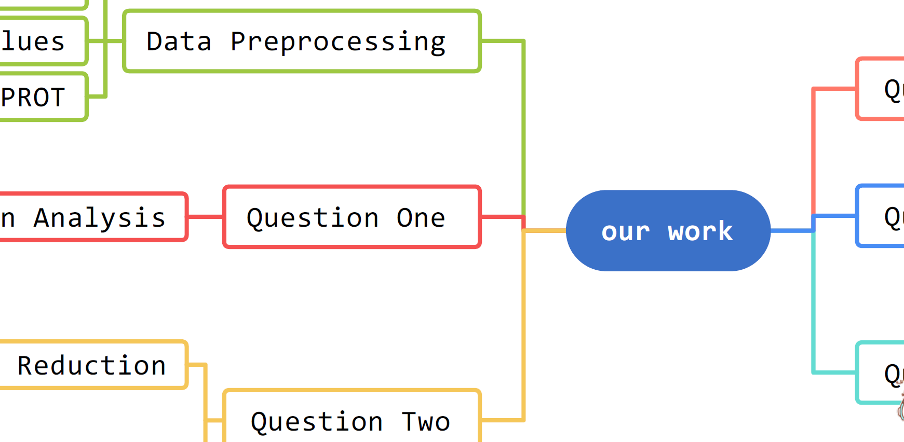

# 【建模知识分享】高清无损的svg的科研绘图与思维导图

> 截图软件是```snipaste```；录屏软件是OBS；这个软件是```typora```，在仓库的```readme.md```有介绍。

## 0 引入

在2021年数维杯国际赛时，深受图片高糊其害，铩羽而归。而在2022年数维杯国际赛时，竟发现，```svg```有如此妙用，可谓是妙不可言啊~~~

去看看哇




## 1 svg格式

SVG是一种图形文件格式，它的英文全称为Scalable Vector Graphics，意思为可缩放的**矢量图形**。它是基于XML（Extensible Markup Language），由World Wide Web Consortium（W3C）联盟进行开发的。严格来说应该是一种开放标准的矢量图形语言，可让你设计激动人心的、**高分辨率**的Web图形页面。用户可以直接用代码来描绘图像，可以用**任何文字处理工具**打开SVG图像，通过**改变部分代码**来使图像具有交互功能，并可以随时插入到HTML中**通过浏览器**来观看。

## 2 如何制作svg图像

### 2.1 python的画图库

```python
plt.
```

### 2.2 思维导图软件——mindmaster

- 导出svg或PDF都可

## 3 如何更改svg图像

### 3.1 PPT——可有可无的更改

PPT虽然可以更改，但是较为麻烦。

### 3.2 文本处理软件——快速去水印

> 文本处理软件嘛 文本文档 记事本 notepad++ vscode 都可以啦

##### 3.1.1 去水印

##### 3.1.2去背景

### 3.3 Adobe Illustrator——想怎么改就怎么改

> Adobe illustrator，简称AI，是一种应用于[出版](https://baike.baidu.com/item/出版/285005?fromModule=lemma_inlink)、[多媒体](https://baike.baidu.com/item/多媒体/140486?fromModule=lemma_inlink)和在线图像的工业标准矢量插画的软件。<br>由Adobe公司产品，和Adobe PhotoShop（PS）是一家人。当然和剪视频的pr、做特效的ae、处理PDF的acrobat也是一家人。
>
> 想要快速学习AI的，可以去看看这一个[【【AI 教程】拜托三连了！这绝对是你能找到的最良心AI教程 『只用90分钟』       AI基础系统教程/海报设计/排版/详细步骤/软件排版学习/】](https://www.bilibili.com/video/BV1cy4y1p7vp)

改这个还不简单，B站看视频不就得了...

- 图片归位
- 锦上添花
- 偷梁换柱

## 4 Word使用

直接拖进去不行的话，就需要你，点一下【插入】-【图片】-【此设备】了。
