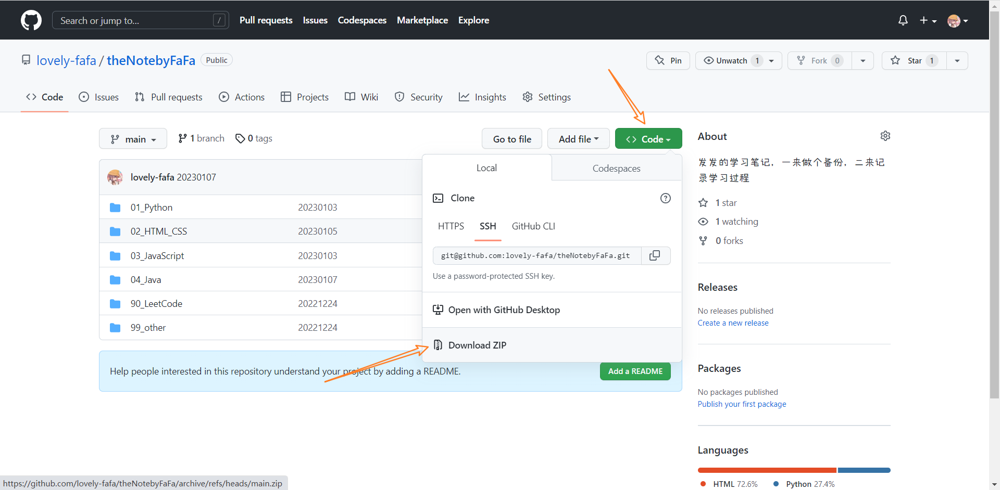
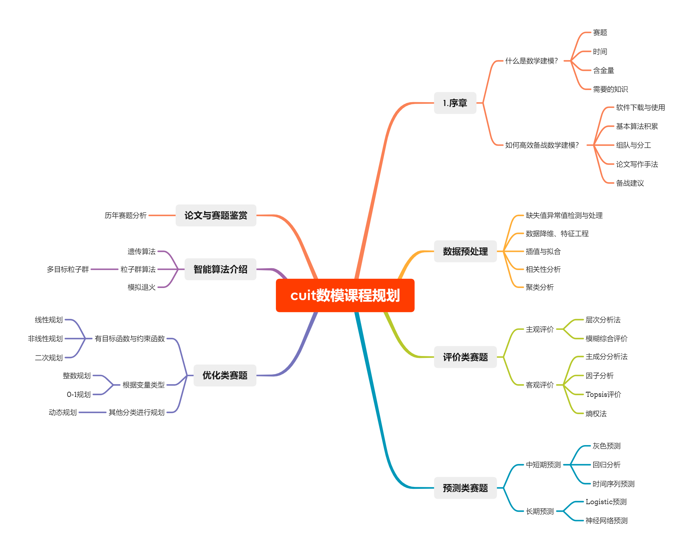

# 学生数学建模协会 建模知识分享


## 0 简介

这里是**成都信息工程大学 学生数学建模协会**的小仓库，里面有很多建模的小资料。主要是[协会B站](https://space.bilibili.com/1619279517)中交流学习的视频，里面有很多的资料、代码，懒得通过网盘分享，于是乎建立的这个仓库。

跪求在右上角点一个```Star```，求你了...

## 1 怎么使用

### 1.1 关于GitHub

你在的这个网站叫[GitHub](https://www.github.com)，是全世界最大的代码托管仓库。

#### 1.1.1 傻瓜式使用

你可以直接点击下图这个地方，下载这个仓库的东西，当然仓库有更新就需要重新下载。

> 我知道你大概率看不了这个图，你可以尝试百度百度或者看看这个文字描述<br>点击绿色的```< > Code↓``` - 点击```Download ZIP``` - ok啦



#### 1.1.2 浅浅的使用

1. 安装```git```

2. 克隆仓库```git clone 粘贴一坨东西```

   ```git```中复制：选中即可

   ```git```中粘贴：```shitf+insert```；

3. 每次有更新后

   > 下面这一坨是我从[我的笔记](https://github.com/lovely-fafa/theNotebyFaFa/blob/main/99_other/git.md)复制粘贴过来的
   >
   > 简言之，你可以直接使用```git pull```。但是，在你没有熟练使用```git```之前，**请不要把你自己的代码或者笔记留在仓库里面**！！

   - 抓取命令

     - ```git fetch [remote name][branch name]```
     - 抓取命令就是将仓库里的更新都抓取到本地，不会进行合并
     - 如果不指定远端名称和分支名，则抓取所有分支
     - 然后进行```merge```

   - 拉取命令
     - ```git pull [remote name][branch name] ```
     - 拉取命令就是把远端仓库的修改拉到本地并自动进行合并，等同于```fetch+merge```
     - 如果不指定远端名称和分支名，则抓取所有并更新**当前分支**

#### 1.1.3 优雅的使用

也可以尝试去学习```git```，以便于更加优雅的使用GitHub中的学习资料。在这里我推荐黑马的一个教程[【黑马程序员Git全套教程，完整的git项目管理工具教程，一套精通git】]( https://www.bilibili.com/video/BV1MU4y1Y7h5/?share_source=copy_web&vd_source=6ed6843ba78cd69441d2ca9588f1c5c3)

<iframe src="//player.bilibili.com/player.html?aid=672338577&bvid=BV1MU4y1Y7h5&cid=347107180&page=1" scrolling="no" border="0" frameborder="no" framespacing="0" allowfullscreen="true"> </iframe>

### 1.2 关于markdown与typora

这个文档的后缀是```.md```，即```markdown```语法书写的，这个语法是一个很好的、用于做笔记的语法。（比如说这个笔记就非常的好。）而```typora```是一个用于书写```markdowm```语法的一个工具，当然你也可以用其他的工具。

```markdown```语法十分简单，你可以前往[官网](https://markdown.com.cn/basic-syntax/)简单学习即可。

破解版的```typora```在群文件里面。

> 忍不住说一句话，一定要设置```typora```里面图片的位置！！！！

## 2 资料目录

这个是flag，就看着玩玩吧

### 2.1 数学建模入门系列

> 数学建模的入门级知识，比如说什么是数学建模啊，应该怎么准备呢...

### 2.2 数学建模知识系列

> 数学建模的各大模型，是这个仓库的主体。

#### [熵权法](./2_数学建模知识系列/熵权法)

#### [Excel数据可视化](./2_数学建模知识系列/Excel数据可视化)

### 2.3 数学建模其他知识系列

> 比较成体系的知识点，但是并不是模型类的，所以放到这个地方。

#### 1. python画图系列

发发作为23年美赛的御用画图师，必定是要深入学习```matplotlib```，并分享分享。

### 2.4 “卷王行动”——历年国赛、美赛寒暑假集训

> 此活动由```@他还没有GitHub```在2022年暑假发起的**2022国赛集训**开始，每年的寒暑假都会搞一次集训。集训时，每周选一道国赛、美赛题目，大家研究研```luàn```究```zuò```，并在周日晚一起腾讯会议进行交流学习，并将录屏发在B站。

#### 2.4.1 2022年暑假国赛集训

> 本次的宣言是“本群主要为了广大单身青年的脱单大计而创！”。

#### 2.4.2 2023年寒假美赛集训

> 本次的宣言是“本群为2023美赛集训群，主要为美赛而建立”。

马上就要开始了...

### 2.5 [数学建模其他小知识](5_数学建模其他小知识)

> 是我们在数学建模的学习与竞赛中，发现的奇奇怪怪的小知识，可以实现**锦上添花**的效果。

#### [Python爬虫快速入门——以2019年数学建模国赛C题【机场的出租车问题】的数据采集为例](5_数学建模其他小知识./1_Python爬虫快速入门——以2019年数学建模国赛C题【机场的出租车问题】的数据采集为例)

19年建模C题需要采集代码，于是乎以此为例，浅浅的讲了一下```python```爬虫。但是其实讲的真的很浅，可以参考参考里面的推荐资料，进行更深一步的学习。

#### [高清无损的svg的科研绘图与思维导图](5_数学建模其他小知识/2_高清无损的svg的科研绘图与思维导图)

发发在2021年数维杯国际赛时，深受图片高糊其害，铩羽而归。而在2022年数维杯国际赛时，竟发现，```svg```有如此妙用，可谓是妙不可言啊~~~

